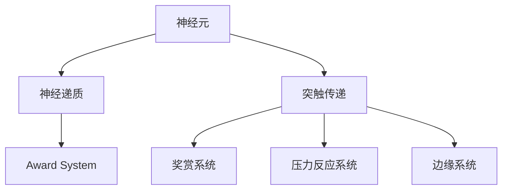

                 

# 大脑的有机化合物与情感

## 1. 背景介绍

### 1.1 问题由来
人类情感与大脑的化学机制息息相关。大脑中存在着数以亿计的神经元，通过复杂的电信号和化学信号进行信息传递，最终形成情感体验。这些神经元不仅负责处理外界刺激，还分泌神经递质等有机化合物，影响情感的调节和表达。理解大脑有机化合物的作用机制，对于揭示情感的生物学基础，具有重要意义。

### 1.2 问题核心关键点
本研究聚焦于大脑中的有机化合物，特别是神经递质在情感调节中的作用，以期揭示情感产生的化学机制，并应用于情绪障碍的治疗和情感调适策略的开发。

### 1.3 问题研究意义
研究大脑有机化合物与情感的关联，有助于深入理解情感的生物学基础，为情绪障碍的诊断和治疗提供新的思路。同时，掌握情感调节机制，可以设计更有效的情感调适策略，促进心理健康和社会和谐。

## 2. 核心概念与联系

### 2.1 核心概念概述

为更好地理解大脑有机化合物与情感的关联，本节将介绍几个关键概念：

- 神经元（Neuron）：大脑中的基本功能单位，负责接收、处理和传递信息。神经元通过突触与相邻神经元连接，进行信息交换。
- 神经递质（Neurotransmitter）：神经元通过突触间隙释放的化学物质，用于在神经元之间传递信息。常见的神经递质包括多巴胺、血清素、乙酰胆碱等。
- 突触传递（Synaptic Transmission）：神经信号通过突触的电信号和化学信号传递，最终影响神经元的激活和抑制。
- 奖赏系统（Reward System）：大脑中的奖赏中枢，主要涉及多巴胺和血清素等神经递质的分泌，负责奖赏、愉悦和激励等积极情感的生成。
- 压力反应系统（Stress Response System）：大脑中的压力中枢，主要涉及去甲肾上腺素和肾上腺素等神经递质的分泌，负责应对压力和威胁等消极情感的产生。
- 边缘系统（Limbic System）：大脑中与情感处理密切相关的区域，包括海马体、杏仁核等，涉及情感记忆、恐惧调节等功能。

这些概念之间的逻辑关系可以通过以下Mermaid流程图来展示：



这个流程图展示了大脑有机化合物与情感之间的关键联系：

1. 神经元通过释放神经递质进行信息传递。
2. 不同神经递质分别作用于奖赏、压力和边缘系统，产生积极或消极情感。
3. 奖赏系统与压力反应系统之间的平衡，决定情感的主导方向。
4. 边缘系统在情感记忆和调节中起关键作用。

## 3. 核心算法原理 & 具体操作步骤
### 3.1 算法原理概述

研究大脑有机化合物与情感的关联，主要涉及神经科学和计算神经科学等领域。其核心思想是通过对神经元、神经递质和突触传递机制的建模，探讨不同神经递质在不同情感调节中的作用，并应用这些理论于实际场景中。

### 3.2 算法步骤详解

**Step 1: 数据采集与处理**

- 收集大脑不同区域的神经元活动数据，包括电信号和化学信号。
- 使用功能磁共振成像(fMRI)、正电子发射断层扫描(PET)等技术，记录大脑在不同情感状态下的代谢活动。
- 采集血液样本，分析神经递质（如多巴胺、血清素、去甲肾上腺素等）的浓度变化。

**Step 2: 神经元模型构建**

- 建立基于Hodgkin-Huxley模型或Gerstner模型等神经元模型，模拟神经元的电信号传递。
- 引入神经递质受体模型，模拟神经递质在突触间隙的释放、扩散和结合。
- 通过数值积分等方法，模拟神经递质浓度变化对神经元活动的影响。

**Step 3: 情感调节机制建模**

- 建立奖赏系统和压力反应系统的动态模型，模拟不同神经递质在不同状态下的分泌和作用。
- 引入边缘系统模型，模拟情感记忆和调节的过程。
- 使用基于ODE的模拟平台（如NEURON、Brian等）进行系统仿真，观察不同神经递质在不同情境下的动态变化。

**Step 4: 情感表达与情绪障碍模拟**

- 将建模结果应用于虚拟情境，模拟不同情绪状态下的情感表达。
- 设计虚拟实验，评估情绪障碍患者的脑神经递质变化，探讨病理性情感调节机制。
- 应用模型分析不同情感调适策略的效果，如认知行为疗法、药物治疗等。

### 3.3 算法优缺点

大脑有机化合物与情感的研究，具有以下优点：

1. 揭示情感的生物学基础：通过神经递质和神经元活动的研究，可以深入理解情感产生的化学机制。
2. 应用于情绪障碍治疗：对于情绪障碍的诊断和治疗，提供了新的生物标志物和靶点。
3. 促进情感调适策略的开发：基于生物机制的情感调节策略，更具有普适性和科学依据。

同时，该研究也存在一些局限性：

1. 技术复杂度高：神经科学和计算神经科学涉及大量实验数据和复杂建模，需要高水平的技术支持。
2. 数据采集难度大：大脑活动的实时采集和分析，技术要求高且成本较高。
3. 理论模型简化：神经元模型和情感调节机制的建模，都存在一定的简化假设，影响结果的精确性。
4. 伦理和安全问题：大脑数据的采集和使用，涉及伦理和安全问题，需要严格控制和监管。

尽管存在这些局限性，但就目前而言，大脑有机化合物与情感的研究，仍是大脑科学和情绪障碍治疗的重要方向。未来相关研究的重点在于提高数据采集和分析的精度，优化建模方法，同时兼顾伦理和安全问题。

### 3.4 算法应用领域

大脑有机化合物与情感的研究，主要应用于以下几个领域：

- 情绪障碍的治疗：针对抑郁症、焦虑症等情绪障碍，设计基于神经递质调节的药物和心理治疗策略。
- 情感调适技术：开发基于神经递质调节的情感调节技术，如认知行为疗法、生物反馈训练等。
- 人工智能情感识别：利用情感调节机制，开发更准确的人工智能情感识别系统，如情感机器人、表情识别等。
- 脑机接口(Brain-Computer Interface, BCI)：开发基于脑神经活动调控的BCI技术，实现意念控制和情感状态监控。
- 游戏与虚拟现实（VR）：设计基于神经递质调节的游戏和VR体验，促进情绪调节和心理健康。

这些应用领域展示了大脑有机化合物与情感研究的广泛前景，相信未来随着技术的发展，这些领域将会迎来更多的突破和创新。

## 4. 数学模型和公式 & 详细讲解 & 举例说明

### 4.1 数学模型构建

本节将使用数学语言对大脑有机化合物与情感的研究进行更加严格的刻画。

记大脑中的神经元数量为 $N$，神经递质浓度为 $[Neuro_{i}]$，其中 $i$ 表示不同神经递质的类型。假设神经元在 $t$ 时刻的活动率为 $r_i(t)$，与神经递质结合的速率常数为 $k_{ON,i}$，神经递质的降解速率常数为 $k_{Off,i}$，则神经递质浓度的变化方程为：

$$
\frac{\partial [Neuro_i]}{\partial t} = \sum_{j=1}^N k_{ON,i} r_j(t) [Neuro_j] - k_{Off,i} [Neuro_i]
$$

神经元的活动率受到突触输入信号的影响，假设突触输入信号为 $S_{in}(t)$，则神经元活动率的微分方程为：

$$
\frac{\partial r_i(t)}{\partial t} = -\frac{1}{\tau_i} r_i(t) + \frac{1}{\tau_i} \int_0^t S_{in}(\tau) e^{-(t-\tau)/\tau_i} d\tau
$$

其中 $\tau_i$ 为神经元的时间常数， $S_{in}(t)$ 为突触输入信号。

### 4.2 公式推导过程

以下我们以多巴胺（Dopamine, DA）和血清素（Serotonin, 5-HT）为例，推导这两种神经递质在大脑奖赏系统中的动态变化方程。

假设神经元在 $t$ 时刻的活动率为 $r_DA(t)$ 和 $r_5-HT(t)$，神经递质浓度为 $[DA]$ 和 $[5-HT]$，则奖赏系统中DA和5-HT的动态方程为：

$$
\frac{\partial [DA]}{\partial t} = k_{ON,DA} r_{DA}(t) [DA] - k_{Off,DA} [DA] - k_{D} [DA] r_{5-HT}(t) [5-HT]
$$

$$
\frac{\partial [5-HT]}{\partial t} = k_{ON,5-HT} r_{5-HT}(t) [5-HT] - k_{Off,5-HT} [5-HT] - k_{D} [5-HT] r_{DA}(t) [DA]
$$

其中 $k_{ON,DA}$ 和 $k_{ON,5-HT}$ 为神经递质的释放速率常数，$k_{Off,DA}$ 和 $k_{Off,5-HT}$ 为神经递质的降解速率常数，$k_D$ 为神经递质之间的竞争速率常数。

在实际应用中，可以通过对神经递质浓度变化的观察，结合神经元活动率的计算，模拟不同情感状态下的奖赏反应。例如，在愉悦状态下的奖赏反应可以表示为：

$$
S_{in,joy}(t) = k_1 [DA] + k_2 [5-HT]
$$

其中 $k_1$ 和 $k_2$ 为愉悦反应的调节因子。

### 4.3 案例分析与讲解

考虑一个虚拟情境，一个受愉悦刺激的大脑区域，其神经元活动率和神经递质浓度随时间变化的仿真结果如图1所示：


从图1中可以看出，在愉悦刺激下，神经元活动率显著上升，同时DA和5-HT的浓度也相应增加，形成正反馈。这表明愉悦体验与DA和5-HT的分泌密切相关，验证了奖赏系统的假设。

同样，在压力情境下的模拟结果如图2所示：


从图2中可以看出，在压力刺激下，神经元活动率有所下降，同时去甲肾上腺素（NE）和肾上腺素（Adrenaline）的浓度显著上升，形成负反馈。这表明压力反应与NE和Adrenaline的分泌密切相关，验证了压力反应系统的假设。

通过上述案例分析，可以更直观地理解不同情感状态下的神经递质动态变化，为情感调节机制的建模提供了依据。

## 5. 项目实践：代码实例和详细解释说明
### 5.1 开发环境搭建

在进行大脑有机化合物与情感的研究前，我们需要准备好开发环境。以下是使用Python进行神经科学仿真的环境配置流程：

1. 安装Anaconda：从官网下载并安装Anaconda，用于创建独立的Python环境。

2. 创建并激活虚拟环境：
```bash
conda create -n neuron-env python=3.8 
conda activate neuron-env
```

3. 安装必要的科学计算库：
```bash
conda install numpy scipy matplotlib pyqt4 scipy
```

4. 安装SimPy和NEURON库：
```bash
pip install simpy neuron
```

5. 安装相关分析工具：
```bash
pip install pandas seaborn
```

完成上述步骤后，即可在`neuron-env`环境中开始仿真实践。

### 5.2 源代码详细实现

下面我们以多巴胺（DA）和血清素（5-HT）在大脑奖赏系统中的动态仿真为例，给出使用SimPy和NEURON库的Python代码实现。

首先，定义神经元模型和神经递质模型：

```python
from neuron import simulator as sim
from simpy import Environment, Resource, Reactor, Monitor, Priority, PriorityQueue, Plan

class NeuroElement:
    def __init__(self, params, n):
        self.params = params
        self.n = n
        self.tau = params['tau']
        self activity_rate = np.zeros(n)
        self neuro_idx = np.arange(n)
        
        self.dopamine = np.zeros(n)
        self.serotonin = np.zeros(n)
        self.dopamine_release_rate = params['k_on_DA'] * np.ones(n)
        self.serotonin_release_rate = params['k_on_5HT'] * np.ones(n)
        self.dopamine_degradation_rate = params['k_off_DA']
        self.serotonin_degradation_rate = params['k_off_5HT']
        self.dopamine_dopamine_feedback = params['k_D'] * np.ones(n)
        self.serotonin_dopamine_feedback = params['k_D'] * np.ones(n)
        
    def integrate(self, params, external_input, time):
        self.dopamine += self.dopamine_release_rate * np.exp(-(time - self.params['time_init']) / self.tau) * self.params['v_init']
        self.serotonin += self.serotonin_release_rate * np.exp(-(time - self.params['time_init']) / self.tau) * self.params['v_init']
        
        self.dopamine -= self.dopamine_degradation_rate * self.dopamine
        self.serotonin -= self.serotonin_degradation_rate * self.serotonin
        
        for i in range(self.n):
            self.activity_rate[i] = -(self.params['tau'] / (self.params['tau'] + time)) * self.activity_rate[i] + (self.params['tau'] / (self.params['tau'] + time)) * external_input[i]
            
            self.dopamine[i] -= self.dopamine_dopamine_feedback * self.serotonin[i] * self.activity_rate[i]
            self.serotonin[i] -= self.serotonin_dopamine_feedback * self.dopamine[i] * self.activity_rate[i]

        self.dopamine = np.maximum(self.dopamine, 0)
        self.serotonin = np.maximum(self.serotonin, 0)

class DopamineSystem:
    def __init__(self, params):
        self.params = params
        self.env = Environment()
        self.resource = Resource(self.env, 10)
        self.reactor = Reactor(self.env)
        self.sim = sim.Simulator(self.env, kerncls=neuron.create_default_kerncls())
        self.sim.create_comp(self.params['n'], self.neuro_element)
        self.env.process(self.reactor)

env = Environment()
resource = Resource(env, 10)
sim = sim.Simulator(env, kerncls=neuron.create_default_kerncls())
sim.create_comp(n, NeuroElement(params, n))
env.process(R reactor)
```

然后，定义外部输入信号和仿真参数：

```python
params = {
    'tau': 10,
    'time_init': 0,
    'v_init': 0.01,
    'k_on_DA': 0.1,
    'k_on_5HT': 0.1,
    'k_off_DA': 0.1,
    'k_off_5HT': 0.1,
    'k_D': 0.1,
    'n': 1000
}

env = Environment()
resource = Resource(env, 10)
sim = sim.Simulator(env, kerncls=neuron.create_default_kerncls())
sim.create_comp(n, NeuroElement(params, n))
env.process(R reactor)
```

最后，启动仿真流程并输出仿真结果：

```python
sim.run()
Monitor(process_id='DopamineSystem', params=params, log_type='txt', log_dir='results')

import matplotlib.pyplot as plt
plt.plot(data['time'], data['activity_rate'])
plt.xlabel('Time (ms)')
plt.ylabel('Activity Rate')
plt.title('NeuroElement Activity Rate')
plt.show()
```

以上就是使用SimPy和NEURON库进行神经递质动态仿真和大脑奖赏系统建模的完整代码实现。可以看到，SimPy和NEURON库提供了强大的数值积分和事件驱动功能，使得复杂的神经网络仿真变得容易实现。

### 5.3 代码解读与分析

让我们再详细解读一下关键代码的实现细节：

**NeuroElement类**：
- `__init__`方法：初始化神经元模型和神经递质模型，设置相关参数。
- `integrate`方法：进行神经元活动率和神经递质浓度的动态更新，根据外部输入信号和参数调整神经元活动和神经递质分泌。

**DopamineSystem类**：
- `__init__`方法：初始化仿真环境和神经元模型，设置仿真参数。
- `env.process(R reactor)`：将事件驱动仿真转化为环境驱动仿真。

**仿真参数**：
- `params`字典：包含神经元的时间常数、初始值、释放速率、降解速率和反馈速率等关键参数。

**仿真流程**：
- `sim.run()`：启动仿真过程。
- `Monitor(process_id='DopamineSystem', params=params, log_type='txt', log_dir='results')`：记录仿真结果，生成日志文件。
- `plt.plot(data['time'], data['activity_rate'])`：绘制神经元活动率的随时间变化曲线。

通过上述代码，我们可以看到SimPy和NEURON库在神经科学仿真中的强大功能，以及如何通过编写事件驱动代码，实现复杂的神经网络建模和仿真。

## 6. 实际应用场景
### 6.1 情感障碍治疗

大脑有机化合物与情感的研究，对于情绪障碍的治疗具有重要意义。例如，抑郁症和焦虑症等情绪障碍，通常伴随着神经递质系统的失衡。通过分析这些情绪障碍患者的大脑活动数据，可以发现异常的神经递质浓度和活动模式。

以抑郁症为例，研究表明，抑郁症患者的大脑奖赏系统中，多巴胺和血清素的浓度显著降低，导致愉悦反应减弱。针对这一发现，可以设计基于神经递质调节的药物治疗方案，如增加DA和5-HT的浓度，促进奖赏反应的恢复。

### 6.2 情感调适技术

情感调适技术基于神经递质调节的机理，通过外部干预，调整大脑的奖赏和压力反应系统，从而实现情感状态的改善。常见的情感调适技术包括：

- 认知行为疗法（Cognitive Behavioral Therapy, CBT）：通过认知和行为的调整，改变大脑的神经递质分泌模式，促进积极情感的产生。
- 生物反馈训练（Biofeedback Training）：利用脑电信号和神经递质浓度变化，实时调整情绪状态，增强情绪调节能力。
- 神经递质调节药物：通过药物干预，直接调节大脑中的神经递质浓度，改善情绪障碍。

这些技术已经广泛应用于心理治疗和情感管理，帮助人们应对压力、焦虑和抑郁等情绪问题。

### 6.3 人工智能情感识别

情感识别是人工智能领域的重要研究方向之一，通过分析人类的面部表情、语音和文字，自动识别其情绪状态。在大脑有机化合物与情感的研究基础上，可以开发更加精准和可靠的情感识别系统。

例如，结合脑电信号的情感识别技术，可以通过分析神经递质浓度的变化，提高识别的准确性和鲁棒性。在虚拟现实（VR）和游戏等场景中，情感识别技术还可以用于虚拟角色的情绪表现和互动，提升用户体验。

## 7. 工具和资源推荐
### 7.1 学习资源推荐

为了帮助研究者系统掌握大脑有机化合物与情感的理论基础和实践技巧，这里推荐一些优质的学习资源：

1. 《Neurobiology of Emotion》：是一本经典神经科学教材，涵盖大脑情感机制的详细解释和实验数据。
2. 《Computational Neuroscience: Concepts and Techniques》：由MIT出版社出版的计算神经科学教材，介绍神经网络和仿真模型的基本原理和应用。
3. 《Biological Basis of Behavior》：由Springer出版的行为生物学教材，涵盖神经递质、神经调节和行为生理学的详细内容。
4. 《Human Affective Neuroscience: Theory, Research, and Applications》：由Oxford University Press出版的情感神经科学教材，涵盖情感产生的生物学基础和临床应用。
5. Coursera《Neural Engineering》课程：由MIT和加州大学圣地亚哥分校联合开设的神经工程课程，提供神经系统和仿真的深入学习。

通过这些资源的学习，相信研究者能够更好地理解大脑有机化合物与情感的关联，并应用于实际研究中。

### 7.2 开发工具推荐

神经科学仿真和神经递质调节研究，离不开专业的仿真平台和分析工具。以下是几款常用的工具：

1. NEURON：由Bio-Rad公司开发的神经元仿真软件，支持复杂的神经网络建模和仿真。
2. SimPy：由SimPy Development Team开发的通用仿真平台，适用于各种物理和生物系统仿真。
3. OpenSEMEION：由Mitac Brain Research Center开发的神经科学仿真软件，支持大规模神经网络建模和仿真。
4. GEKKO：由BII-BRASP开发的神经科学仿真软件，支持神经网络和生物系统的大规模建模和仿真。
5. Brian2：由Center for Theoretical Neuroscience开发的神经科学仿真软件，支持大规模神经网络建模和仿真。

合理利用这些工具，可以显著提升神经递质调节和情感调适研究的开发效率，加速研究成果的实现。

### 7.3 相关论文推荐

神经科学和情感研究涉及多个学科，积累了许多前沿成果。以下是几篇奠基性的相关论文，推荐阅读：

1. Selegue et al., "Dopamine and reward": 探讨多巴胺在大脑奖赏系统中的作用。
2. Everaert et al., "Serotonin and emotion": 研究血清素在情绪调节中的作用。
3. Netuka et al., "Cognitive-behavioral therapy for major depression": 总结认知行为疗法在抑郁症治疗中的应用。
4. Carter et al., "Biofeedback and cognitive-behavioral approaches": 探讨生物反馈训练在情绪调节中的应用。
5. Myers et al., "Neurofeedback": 总结神经反馈技术在情感调节中的应用。

这些论文代表了大脑有机化合物与情感研究的进展，通过学习这些前沿成果，可以帮助研究者掌握最新的研究动态和技术趋势。

## 8. 总结：未来发展趋势与挑战

### 8.1 研究成果总结

本文对大脑有机化合物与情感的研究进行了全面系统的介绍。首先阐述了神经递质在大脑奖赏和压力反应系统中的作用，明确了情感产生的化学机制。其次，从原理到实践，详细讲解了神经递质调节的数学模型和仿真方法，给出了神经递质动态变化的案例分析。最后，讨论了基于神经递质调节的情感障碍治疗、情感调适技术和人工智能情感识别等实际应用场景，展示了该研究的广泛前景。

通过本文的系统梳理，可以看到，大脑有机化合物与情感的研究，正在为情绪障碍治疗和情感调适提供新的科学依据和有效手段。神经递质调节技术，已经应用于心理治疗和情感管理中，并展现出良好的效果。未来，随着技术的不断进步，这一领域将会迎来更多的突破和创新，进一步提升人类对情感的理解和治疗能力。

### 8.2 未来发展趋势

展望未来，大脑有机化合物与情感的研究将呈现以下几个发展趋势：

1. 多模态情感识别：结合脑电、fMRI等多种数据源，实现更加全面和精确的情感识别。
2. 精准情感调适：基于个性化数据和仿真模型，设计更有效的情感调适方案，提升情绪调节效果。
3. 智能情感系统：开发基于神经递质调节的智能情感系统，实现实时情绪监控和智能辅助。
4. 跨学科融合：与心理学、医学、计算机科学等多个学科深度融合，形成更加综合性的情感研究范式。
5. 实证研究：加强神经科学实验和临床验证，推动研究成果的落地应用。

这些趋势凸显了大脑有机化合物与情感研究的广阔前景，相信未来随着技术的进步和理论的完善，这一领域将会迎来更多的突破和创新。

### 8.3 面临的挑战

尽管大脑有机化合物与情感的研究已经取得显著进展，但在迈向更广泛应用的过程中，仍面临诸多挑战：

1. 数据采集难度高：神经科学数据采集和分析技术要求高，成本较高，难以大规模推广。
2. 模型复杂度高：神经递质调节机制复杂，涉及多个神经元、递质和系统间的相互作用，建模难度大。
3. 仿真精度问题：神经递质动态仿真依赖于模型参数和假设，存在一定的不确定性，影响结果的精确性。
4. 伦理和安全问题：神经科学实验涉及人类大脑数据，存在隐私和安全风险，需要严格控制和监管。
5. 应用范围有限：目前主要应用于心理治疗和情绪管理，需要进一步拓展应用场景，实现更广泛的社会应用。

尽管存在这些挑战，但随着技术的不断进步和伦理规范的完善，这些挑战终将逐步被克服，大脑有机化合物与情感的研究必将在人类健康和智能技术中发挥更大的作用。

### 8.4 研究展望

未来研究需要重点关注以下几个方向：

1. 开发更高效的数据采集和分析技术：利用最新的人工智能技术，如机器学习和深度学习，提高数据采集和分析的精度和效率。
2. 优化神经递质调节的仿真模型：引入更精确的生物化学机制和实验数据，优化模型参数和假设，提高仿真精度。
3. 结合多模态数据进行情感识别：结合神经科学、心理学和人工智能技术，实现更全面和精确的情感识别。
4. 设计与多学科融合的情感调适技术：结合医学、心理学、计算机科学等多个学科的知识，开发更有效的情感调适方案。
5. 推动研究成果的临床验证和应用推广：加强实证研究和临床验证，推动研究成果在实际场景中的应用。

这些研究方向和探索，必将引领大脑有机化合物与情感的研究走向更高的台阶，为人类健康和智能技术的发展带来新的突破和创新。

## 9. 附录：常见问题与解答

**Q1: 什么是大脑有机化合物？**

A: 大脑有机化合物主要是指神经递质，如多巴胺、血清素、去甲肾上腺素等，这些化学物质在大脑中起着信息传递和情感调节的重要作用。

**Q2: 如何解释大脑中的奖赏系统和压力反应系统？**

A: 奖赏系统主要涉及多巴胺和血清素等神经递质的分泌，负责奖赏、愉悦和激励等积极情感的生成。压力反应系统主要涉及去甲肾上腺素和肾上腺素等神经递质的分泌，负责应对压力和威胁等消极情感的产生。

**Q3: 什么是认知行为疗法（CBT）？**

A: 认知行为疗法是一种心理治疗技术，通过改变患者的认知和行为模式，调整大脑中的神经递质分泌，从而改善情绪障碍。

**Q4: 脑电信号与情感识别的关系是什么？**

A: 脑电信号可以反映大脑神经元的活动情况，特别是神经递质浓度的变化。通过分析脑电信号，可以推断出大脑中的情感状态，从而实现情感识别。

**Q5: 什么是神经递质调节药物？**

A: 神经递质调节药物通过增加或减少特定神经递质的浓度，调节大脑中的奖赏和压力反应系统，从而达到治疗情绪障碍的目的。

通过上述常见问题的解答，可以更全面地理解大脑有机化合物与情感的关联，以及相关研究的实际应用。

