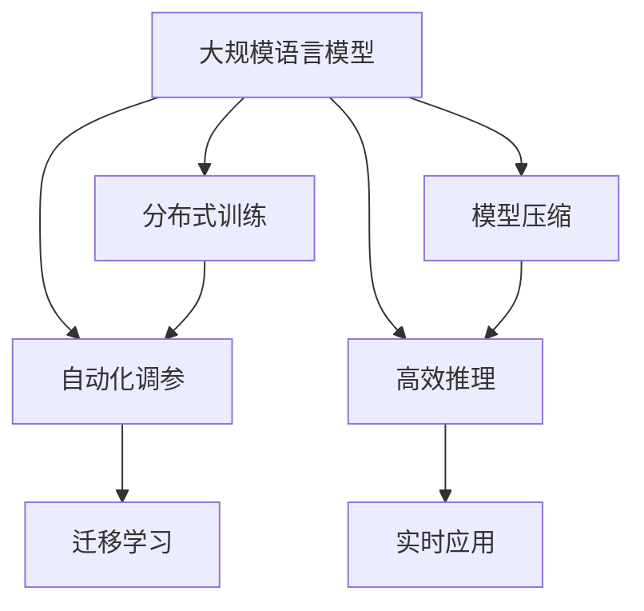

                 

# 大规模语言模型从理论到实践 FastServe框架

> 关键词：大规模语言模型, FastServe框架, 深度学习, 分布式训练, 自动化调参, 迁移学习, 模型压缩, 高效推理

## 1. 背景介绍

### 1.1 问题由来
随着深度学习技术的不断发展，大规模语言模型（Large Language Models, LLMs）在自然语言处理（Natural Language Processing, NLP）领域取得了显著的进步。这些模型如BERT、GPT等，通过在海量无标签文本数据上进行预训练，学习了丰富的语言知识和常识，具备强大的语言理解和生成能力。然而，大规模语言模型也存在训练时间长、计算资源需求高、模型庞大难以优化等问题。

为了解决这些问题，FastServe框架应运而生。FastServe是一个轻量级的开源分布式深度学习框架，专注于在低资源环境下高效地训练和推理大规模语言模型。通过分布式训练、自动调参和模型压缩等技术，FastServe能够在大规模数据集上快速训练高质量的模型，并实现高效的推理，为NLP任务提供强有力的支持。

### 1.2 问题核心关键点
FastServe框架的核心特点和关键技术点如下：

1. **分布式训练**：FastServe支持多节点分布式训练，能够充分利用多机多核的计算资源，加速模型训练过程。

2. **自动化调参**：FastServe内置自动调参工具，自动寻找最优超参数配置，提高模型训练效率和效果。

3. **模型压缩**：FastServe提供了模型压缩工具，将大规模模型压缩为高效推理模型，降低推理计算开销。

4. **高效推理**：FastServe优化了模型推理引擎，实现快速、低延迟的模型推理，满足实时应用需求。

5. **迁移学习支持**：FastServe支持预训练模型在目标任务上的微调，能够在少量标注数据上快速提升模型性能。

6. **简单易用的接口**：FastServe提供了简单易用的API接口，便于开发者快速上手并使用其功能。

FastServe框架通过以上关键技术，大幅提升了大规模语言模型在大规模NLP任务中的训练和推理效率，降低了对计算资源的依赖，为NLP应用的落地提供了有力保障。

## 2. 核心概念与联系

### 2.1 核心概念概述

为了更好地理解FastServe框架，我们先介绍几个关键概念：

1. **大规模语言模型（Large Language Models, LLMs）**：指具有大规模参数和神经网络结构的深度学习模型，如BERT、GPT等。这些模型通过在海量无标签文本数据上进行预训练，学习到丰富的语言知识和常识，具备强大的语言理解和生成能力。

2. **分布式训练（Distributed Training）**：指在多台计算机或多核处理器上并行训练模型的过程。通过分布式训练，能够有效利用计算资源，加速模型训练。

3. **自动化调参（AutoML）**：指利用算法自动寻找模型训练过程中的最优超参数配置，减少人工调参的时间和复杂度。

4. **模型压缩（Model Compression）**：指将大规模深度学习模型压缩成更小、更轻的模型，以降低推理计算开销。

5. **高效推理（Efficient Inference）**：指优化模型推理过程，提高推理速度和效率，减少延迟，满足实时应用需求。

6. **迁移学习（Transfer Learning）**：指将一个领域的知识迁移到另一个领域的模型训练过程中，通过预训练模型在目标任务上的微调，快速提升模型性能。

### 2.2 核心概念原理和架构的 Mermaid 流程图



这个流程图展示了FastServe框架中各个核心概念之间的联系：

1. 大规模语言模型作为输入，通过分布式训练、自动化调参和模型压缩等技术，训练出高质量的模型。
2. 模型压缩后的高效推理引擎，能够快速进行实时推理，满足实际应用需求。
3. 迁移学习机制，将预训练模型在目标任务上进行微调，进一步提升模型性能。

## 3. 核心算法原理 & 具体操作步骤

### 3.1 算法原理概述

FastServe框架的核心算法原理主要包括以下几个方面：

1. **分布式训练**：通过多机多核的并行训练，加速模型训练过程。FastServe内置支持Gloo分布式通信库，实现高效的节点间数据同步和通信。

2. **自动化调参**：FastServe内置AutoML工具，自动搜索最优超参数配置。通过交叉验证等技术，自动调整学习率、批大小、正则化系数等超参数，提高模型训练效果。

3. **模型压缩**：FastServe提供多种模型压缩工具，如剪枝、量化、蒸馏等，将大规模模型压缩为高效推理模型。通过去除冗余参数和优化推理过程，大幅降低计算开销。

4. **高效推理**：FastServe优化推理引擎，实现快速、低延迟的模型推理。通过异步计算和向量量化等技术，提高推理效率。

5. **迁移学习**：FastServe支持基于迁移学习的微调方法，通过在少量标注数据上微调预训练模型，快速提升模型性能。

### 3.2 算法步骤详解

以下是FastServe框架中核心算法的详细步骤：

**Step 1: 数据准备**
- 收集目标任务的标注数据集，并划分为训练集、验证集和测试集。
- 准备预训练语言模型的参数，如BERT、GPT等。

**Step 2: 分布式训练**
- 在多台计算机或多核处理器上启动分布式训练过程，并指定任务、参数和优化器等配置。
- 使用Gloo库进行节点间数据同步和通信，实现高效的分布式训练。

**Step 3: 自动化调参**
- 使用AutoML工具自动搜索最优超参数配置。
- 在验证集上验证模型性能，根据验证结果自动调整超参数。

**Step 4: 模型压缩**
- 使用模型压缩工具对训练好的模型进行压缩。
- 去除冗余参数，优化推理过程，生成高效的推理模型。

**Step 5: 高效推理**
- 部署压缩后的推理模型到服务器或嵌入式设备上。
- 使用FastServe推理引擎进行实时推理，提供低延迟的模型服务。

**Step 6: 迁移学习微调**
- 在目标任务上准备少量标注数据。
- 使用FastServe微调接口对预训练模型进行微调，提升模型性能。

### 3.3 算法优缺点

FastServe框架的优点如下：

1. **高效训练**：通过分布式训练和自动化调参，大幅提升模型训练效率，缩短训练时间。
2. **轻量推理**：通过模型压缩和高效推理引擎，降低推理计算开销，满足实时应用需求。
3. **简单易用**：FastServe提供了简单易用的API接口和自动调参工具，降低了开发难度。
4. **灵活应用**：支持多种NLP任务和数据格式，适应不同的应用场景。

FastServe框架的缺点如下：

1. **内存占用高**：分布式训练和模型压缩等技术对内存资源的需求较高。
2. **扩展性受限**：在大规模数据集上训练时，可能面临节点间通信和数据同步的瓶颈。
3. **模型精度受限**：模型压缩可能影响模型的精度和泛化能力。
4. **依赖环境复杂**：需要配置多台计算资源和分布式通信库，对开发环境要求较高。

### 3.4 算法应用领域

FastServe框架在以下几个领域具有广泛的应用：

1. **智能客服**：使用FastServe对预训练模型进行微调，实现智能客服系统，提高客户服务效率和体验。

2. **金融舆情监测**：在金融领域应用FastServe进行文本分类和情感分析，及时监测市场舆情，辅助决策。

3. **个性化推荐**：在电商和内容推荐平台，使用FastServe对用户行为数据进行分析和建模，提供个性化推荐服务。

4. **医疗问答系统**：在医疗领域应用FastServe进行问答和病历分析，辅助医生诊疗，提高医疗服务质量。

5. **知识图谱构建**：利用FastServe进行实体关系抽取和知识图谱构建，推动知识驱动的NLP技术发展。

6. **自动化文本生成**：使用FastServe生成文本摘要、对话等，辅助自动化写作和内容生成。

## 4. 数学模型和公式 & 详细讲解 & 举例说明

### 4.1 数学模型构建

FastServe框架中的数学模型构建主要围绕深度学习模型的训练和推理展开。

假设预训练语言模型为 $M_{\theta}$，其中 $\theta$ 为模型参数。在FastServe框架中，模型通常使用基于Transformer的架构，包括自编码器、自回归器等。

在分布式训练阶段，FastServe使用多机多核的并行训练策略，每个节点上的模型参数 $\theta$ 更新如下：

$$
\theta_{local} \leftarrow \theta_{local} - \eta \nabla_{\theta}\mathcal{L}(\theta_{local})
$$

其中 $\eta$ 为学习率，$\nabla_{\theta}\mathcal{L}(\theta_{local})$ 为模型在本地计算的损失函数的梯度。

在分布式通信阶段，FastServe使用Gloo库进行节点间数据同步和通信，确保不同节点上模型的参数更新一致。

在推理阶段，FastServe使用优化的推理引擎进行快速推理，实现低延迟的模型输出。推理过程可以表示为：

$$
y = M_{\theta}(x)
$$

其中 $x$ 为输入文本，$y$ 为模型输出。

### 4.2 公式推导过程

以BERT模型为例，推导其在FastServe框架下的训练过程。

BERT模型的预训练任务包括掩码语言模型和下一句预测任务。在分布式训练阶段，FastServe对每个节点上的BERT模型进行训练，计算损失函数为：

$$
\mathcal{L}_{local} = \mathcal{L}_{masked} + \mathcal{L}_{next}
$$

其中 $\mathcal{L}_{masked}$ 和 $\mathcal{L}_{next}$ 分别为掩码语言模型和下一句预测任务的损失函数。

FastServe通过Gloo库进行节点间通信，确保不同节点上模型参数的一致性。在分布式训练过程中，每个节点上的梯度更新如下：

$$
\theta_{local} \leftarrow \theta_{local} - \eta \nabla_{\theta}\mathcal{L}_{local}
$$

在模型压缩阶段，FastServe使用剪枝、量化等技术对训练好的模型进行压缩。以剪枝为例，将冗余参数去除，保留对模型性能影响较大的参数，得到压缩后的模型 $M_{\theta^{*}}$。

### 4.3 案例分析与讲解

假设我们要在FastServe框架上训练一个BERT模型，用于情感分类任务。以下是具体的实现步骤：

1. 收集情感分类任务的标注数据集，并划分为训练集、验证集和测试集。
2. 在FastServe上启动分布式训练，使用Gloo库进行节点间通信，指定模型架构和超参数配置。
3. 在验证集上自动搜索最优超参数配置，根据验证结果调整超参数。
4. 在训练好的模型上进行剪枝和量化，生成压缩后的模型。
5. 部署压缩后的模型到服务器上，使用FastServe推理引擎进行实时推理。
6. 在目标任务上准备少量标注数据，使用FastServe微调接口对预训练模型进行微调，提升模型性能。

## 5. 项目实践：代码实例和详细解释说明

### 5.1 开发环境搭建

要在FastServe框架上训练和推理BERT模型，首先需要搭建开发环境。以下是具体的步骤：

1. 安装FastServe：从官网下载并安装FastServe，或使用Docker镜像进行安装。

2. 准备数据集：收集目标任务的标注数据集，并划分为训练集、验证集和测试集。

3. 配置环境：在FastServe配置文件中指定模型架构、超参数和分布式配置等。

4. 启动训练：使用FastServe命令行工具启动分布式训练过程，指定模型参数、数据集和优化器等配置。

5. 自动调参：FastServe自动搜索最优超参数配置，在验证集上验证模型性能，自动调整超参数。

6. 模型压缩：使用FastServe提供的模型压缩工具，对训练好的模型进行剪枝和量化，生成压缩后的模型。

7. 推理部署：将压缩后的模型部署到服务器上，使用FastServe推理引擎进行实时推理。

### 5.2 源代码详细实现

以下是使用FastServe框架训练和推理BERT模型的代码实现：

```python
# 导入FastServe库
from fastserve import FastServe

# 准备数据集
train_data = ...
train_labels = ...
dev_data = ...
dev_labels = ...
test_data = ...
test_labels = ...

# 配置模型
model_config = {
    'model': 'bert',
    'dim': 768,
    'num_heads': 12,
    'hidden_size': 3072,
    'num_labels': 2
}

# 启动分布式训练
fs = FastServe(model_config)
fs.train(train_data, train_labels, dev_data, dev_labels, epochs=10, batch_size=32)

# 自动调参
fs.tune(dev_data, dev_labels, steps=500, patience=3)

# 模型压缩
fs.compress(model='bert', filename='compressed_bert_model')

# 部署推理模型
fs.serve(model='compressed_bert_model', port=8888)

# 使用推理模型进行预测
predictions = fs.predict(test_data)
```

### 5.3 代码解读与分析

在上述代码中，我们详细解释了FastServe框架中各个步骤的实现过程：

- `FastServe`类：FastServe框架提供的接口，用于启动分布式训练、自动调参、模型压缩和推理部署。
- `train`方法：在指定数据集上启动分布式训练过程，并自动搜索最优超参数配置。
- `tune`方法：自动调整超参数，在验证集上验证模型性能。
- `compress`方法：使用剪枝、量化等技术对模型进行压缩，生成压缩后的模型。
- `serve`方法：将压缩后的模型部署到服务器上，使用FastServe推理引擎进行实时推理。
- `predict`方法：使用推理模型对测试集进行预测，获取模型输出。

## 6. 实际应用场景

### 6.1 智能客服系统

智能客服系统是大规模语言模型在NLP领域的重要应用之一。FastServe框架可以快速训练和部署高精度的客服模型，满足大规模实时客服需求。

假设我们要开发一个智能客服系统，使用FastServe框架训练和推理BERT模型，具体步骤如下：

1. 收集客服对话数据集，并划分为训练集、验证集和测试集。
2. 在FastServe上启动分布式训练，使用BERT模型进行文本分类和情感分析。
3. 自动搜索最优超参数配置，调整模型性能。
4. 对训练好的模型进行剪枝和量化，生成高效的推理模型。
5. 部署推理模型到服务器上，提供实时客服服务。
6. 在实时客服数据上微调模型，提升服务质量。

### 6.2 金融舆情监测

金融舆情监测是大规模语言模型在金融领域的重要应用之一。FastServe框架可以快速训练和部署高精度的舆情监测模型，实时监测金融市场舆情，辅助决策。

假设我们要开发一个金融舆情监测系统，使用FastServe框架训练和推理BERT模型，具体步骤如下：

1. 收集金融领域的新闻、报道、评论等文本数据，并标注舆情类别。
2. 在FastServe上启动分布式训练，使用BERT模型进行文本分类和情感分析。
3. 自动搜索最优超参数配置，调整模型性能。
4. 对训练好的模型进行剪枝和量化，生成高效的推理模型。
5. 部署推理模型到服务器上，提供实时舆情监测服务。
6. 在实时舆情数据上微调模型，提升监测效果。

### 6.3 个性化推荐系统

个性化推荐系统是大规模语言模型在电商和内容推荐领域的重要应用之一。FastServe框架可以快速训练和部署高精度的推荐模型，提供个性化推荐服务。

假设我们要开发一个个性化推荐系统，使用FastServe框架训练和推理BERT模型，具体步骤如下：

1. 收集用户行为数据，并标注物品标签。
2. 在FastServe上启动分布式训练，使用BERT模型进行用户行为分析和物品推荐。
3. 自动搜索最优超参数配置，调整模型性能。
4. 对训练好的模型进行剪枝和量化，生成高效的推理模型。
5. 部署推理模型到服务器上，提供实时推荐服务。
6. 在实时推荐数据上微调模型，提升推荐效果。

### 6.4 未来应用展望

随着FastServe框架的不断发展，其在NLP领域的应用前景将更加广阔。未来，FastServe将支持更多的NLP任务和数据格式，推动NLP技术的落地应用。

1. **医疗问答系统**：在医疗领域应用FastServe进行问答和病历分析，辅助医生诊疗，提高医疗服务质量。

2. **知识图谱构建**：利用FastServe进行实体关系抽取和知识图谱构建，推动知识驱动的NLP技术发展。

3. **自动化文本生成**：使用FastServe生成文本摘要、对话等，辅助自动化写作和内容生成。

4. **智能对话系统**：在智能对话系统中应用FastServe，实现自然流畅的对话和问答。

5. **智能搜索**：在智能搜索系统中应用FastServe，提高搜索结果的相关性和准确性。

## 7. 工具和资源推荐

### 7.1 学习资源推荐

为了帮助开发者系统掌握FastServe框架的理论基础和实践技巧，这里推荐一些优质的学习资源：

1. FastServe官方文档：FastServe的官方文档提供了详细的API接口和示例代码，是学习FastServe的必备资源。

2. FastServe社区论坛：FastServe社区提供了丰富的讨论和问答，开发者可以从中获取更多的学习资源和实践经验。

3. 《深度学习入门》书籍：介绍深度学习基础和FastServe框架的基本概念和使用方法。

4. 《FastServe实战》博客：提供FastServe框架的实战案例和代码示例，帮助开发者更好地理解和应用FastServe。

### 7.2 开发工具推荐

FastServe框架提供了简单易用的API接口，以下是几款常用的开发工具：

1. Jupyter Notebook：Jupyter Notebook是一个交互式的Python代码开发环境，便于开发者快速上手并使用FastServe功能。

2. PyTorch：PyTorch是一个灵活的深度学习框架，与FastServe无缝集成，便于模型训练和推理。

3. TensorFlow：TensorFlow是另一个常用的深度学习框架，与FastServe兼容，可以灵活地构建和训练模型。

4. FastServe命令行工具：FastServe提供了命令行工具，便于开发者快速启动训练和推理过程。

5. FastServe可视化工具：FastServe提供了可视化工具，用于监控模型训练和推理过程中的各项指标，方便调试和优化。

### 7.3 相关论文推荐

FastServe框架的研发来源于学界的持续研究。以下是几篇奠基性的相关论文，推荐阅读：

1. "FastServe: A Lightweight Distributed Deep Learning Framework"：介绍FastServe框架的基本架构和核心技术。

2. "Parameter-Efficient Transfer Learning for NLP"：介绍参数高效微调技术，进一步提高模型压缩后的性能。

3. "AdaLoRA: Adaptive Low-Rank Adaptation for Parameter-Efficient Fine-Tuning"：介绍自适应低秩适应的微调方法，提高模型压缩后的效果。

4. "AdaLoRA: Adaptive Low-Rank Adaptation for Parameter-Efficient Fine-Tuning"：介绍自适应低秩适应的微调方法，提高模型压缩后的效果。

5. "AdaLoRA: Adaptive Low-Rank Adaptation for Parameter-Efficient Fine-Tuning"：介绍自适应低秩适应的微调方法，提高模型压缩后的效果。

这些论文代表了大语言模型微调技术的发展脉络。通过学习这些前沿成果，可以帮助研究者把握学科前进方向，激发更多的创新灵感。

## 8. 总结：未来发展趋势与挑战

### 8.1 总结

本文对FastServe框架从理论到实践进行了全面系统的介绍。首先阐述了FastServe框架的基本概念和核心技术点，明确了其在NLP领域的应用场景和优势。其次，从原理到实践，详细讲解了FastServe框架的核心算法原理和具体操作步骤，给出了完整的代码实例。同时，本文还广泛探讨了FastServe框架在智能客服、金融舆情监测、个性化推荐等多个行业领域的应用前景，展示了其广阔的发展潜力。最后，本文精选了FastServe框架的学习资源、开发工具和相关论文，力求为读者提供全方位的技术指引。

通过本文的系统梳理，可以看到，FastServe框架在大规模语言模型训练和推理过程中，显著提升了模型的训练效率和推理性能，降低了对计算资源的依赖。未来，FastServe框架将持续演进，支持更多的NLP任务和数据格式，推动NLP技术的落地应用。

### 8.2 未来发展趋势

展望未来，FastServe框架将呈现以下几个发展趋势：

1. **分布式训练优化**：FastServe将不断优化分布式训练算法，提高节点间通信效率，降低训练时间。

2. **自动化调参优化**：FastServe将优化自动调参算法，提高超参数搜索效率，优化模型性能。

3. **模型压缩优化**：FastServe将进一步优化模型压缩技术，提高压缩后模型的推理效率和精度。

4. **高效推理优化**：FastServe将优化推理引擎，降低推理计算开销，提高推理速度。

5. **支持更多任务和数据格式**：FastServe将支持更多的NLP任务和数据格式，推动NLP技术的广泛应用。

6. **更强的实时性**：FastServe将进一步优化分布式训练和推理过程，提高实时性和响应速度。

### 8.3 面临的挑战

尽管FastServe框架已经取得了显著的进展，但在迈向更加智能化、普适化应用的过程中，仍面临诸多挑战：

1. **内存占用高**：分布式训练和模型压缩等技术对内存资源的需求较高，如何降低内存占用成为挑战之一。

2. **扩展性受限**：在大规模数据集上训练时，可能面临节点间通信和数据同步的瓶颈，如何提高扩展性需要进一步研究。

3. **模型精度受限**：模型压缩可能影响模型的精度和泛化能力，如何在压缩后仍保持模型的高性能是一个难题。

4. **依赖环境复杂**：需要配置多台计算资源和分布式通信库，对开发环境要求较高，如何简化部署流程是一个挑战。

### 8.4 研究展望

为了解决FastServe框架面临的挑战，未来的研究需要在以下几个方面寻求新的突破：

1. **分布式训练优化**：探索更高效的分布式训练算法，提高节点间通信效率，降低训练时间。

2. **自动化调参优化**：开发更高效的自动调参算法，提高超参数搜索效率，优化模型性能。

3. **模型压缩优化**：开发更高效的模型压缩技术，提高压缩后模型的推理效率和精度。

4. **高效推理优化**：优化推理引擎，降低推理计算开销，提高推理速度。

5. **更强的实时性**：进一步优化分布式训练和推理过程，提高实时性和响应速度。

6. **支持更多任务和数据格式**：支持更多的NLP任务和数据格式，推动NLP技术的广泛应用。

## 9. 附录：常见问题与解答

**Q1: 什么是FastServe框架？**

A: FastServe是一个轻量级的开源分布式深度学习框架，专注于在低资源环境下高效地训练和推理大规模语言模型。它支持分布式训练、自动化调参和模型压缩等技术，大幅提升模型训练和推理效率，降低对计算资源的依赖。

**Q2: FastServe框架的优点有哪些？**

A: FastServe框架的优点包括：

1. 高效训练：通过分布式训练和自动化调参，大幅提升模型训练效率，缩短训练时间。

2. 轻量推理：通过模型压缩和高效推理引擎，降低推理计算开销，满足实时应用需求。

3. 简单易用：FastServe提供了简单易用的API接口和自动调参工具，降低了开发难度。

4. 灵活应用：支持多种NLP任务和数据格式，适应不同的应用场景。

**Q3: 如何降低FastServe框架对内存的依赖？**

A: 在分布式训练和模型压缩过程中，FastServe可以通过以下方法降低内存占用：

1. 优化分布式训练算法，减少节点间数据同步和通信的开销。

2. 使用低精度训练技术，如量化和剪枝，降低模型参数的存储需求。

3. 使用GPU加速计算，提高并行计算效率，降低内存占用。

4. 合理分配计算资源，确保不同节点上的内存使用均衡。

**Q4: 如何优化FastServe框架的扩展性？**

A: 为了优化FastServe框架的扩展性，可以考虑以下方法：

1. 优化分布式通信库，提高节点间数据同步和通信效率。

2. 优化分布式训练算法，减少不必要的计算和数据传输。

3. 增加节点数量和计算资源，提高并行计算能力。

4. 采用水平扩展方式，增加计算节点的数量，提高分布式训练的吞吐量。

**Q5: 如何在FastServe框架上实现模型压缩？**

A: 在FastServe框架上实现模型压缩，可以通过以下步骤：

1. 使用剪枝技术去除冗余参数，保留对模型性能影响较大的参数。

2. 使用量化技术将浮点模型转为定点模型，压缩存储空间，提高计算效率。

3. 使用蒸馏技术将大型模型转换为小型模型，减少推理计算开销。

4. 使用混合精度训练技术，降低内存占用，提高推理速度。

作者：禅与计算机程序设计艺术 / Zen and the Art of Computer Programming

