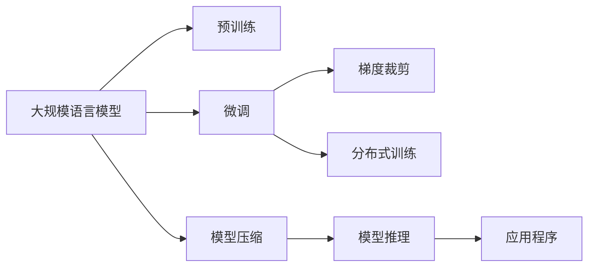

                 

# 大规模语言模型从理论到实践 LangChain框架核心模块

> 关键词：大规模语言模型, 语义理解, 自然语言处理(NLP), LangChain框架, 语言模型架构, 核心模块, 模型训练, 代码实现, 应用场景, 未来展望

## 1. 背景介绍

### 1.1 问题由来
近年来，大规模语言模型（Large Language Models, LLMs）如GPT-3和Megatron-BERT等，在自然语言处理（NLP）领域取得了显著的突破。这些模型基于海量无标签文本进行预训练，学习到了丰富的语言知识和常识，能够进行复杂的语言生成和推理任务。然而，这些模型的参数量通常高达数十亿，且依赖于大规模计算资源进行训练，部署和维护成本较高，因此其普及和应用受到了一定限制。

### 1.2 问题核心关键点
为了解决大规模语言模型部署成本高、资源需求大等问题，研究者提出了多种模型压缩和优化技术，其中最著名的是PrunLangChain（以下简称LangChain）。LangChain通过迁移学习、参数高效微调等方法，在大规模语言模型压缩方面取得了重要进展，为高效、便捷地部署和使用大规模语言模型提供了新的可能。本文将详细介绍LangChain的核心模块，并探讨其在实际应用中的关键技术点和未来发展方向。

## 2. 核心概念与联系

### 2.1 核心概念概述

为了更好地理解LangChain框架，本节将介绍几个核心概念及其之间的联系：

- **大规模语言模型（LLMs）**：以自回归模型（如GPT系列）或自编码模型（如BERT）为代表的大规模预训练语言模型。通过在大规模无标签文本语料上进行预训练，学习到了丰富的语言知识和常识。

- **迁移学习**：指将一个领域学习到的知识，迁移应用到另一个不同但相关的领域的学习范式。在大模型预训练-微调过程中即是一种典型的迁移学习方式。

- **参数高效微调（PEFT）**：指在微调过程中，只更新少量的模型参数，而固定大部分预训练权重不变，以提高微调效率，避免过拟合的方法。

- **LangChain**：一种基于Transformer架构的大规模语言模型压缩框架，旨在通过参数高效微调、梯度裁剪、分布式训练等技术，将大规模语言模型压缩到可承受的规模，并支持高效的分布式训练和推理。

- **核心模块**：LangChain框架的核心模块包括模型压缩技术、分布式训练技术、模型推理技术等，这些模块相互配合，共同支持LangChain的训练和推理功能。

### 2.2 核心概念原理和架构的 Mermaid 流程图



这个流程图展示了LangChain框架的核心模块及其相互关系：

1. 大规模语言模型通过在大规模无标签文本上预训练，学习到通用的语言表示。
2. 微调过程通过有监督学习优化模型在特定任务上的性能。
3. 梯度裁剪技术限制了梯度更新的范围，防止模型参数过快更新。
4. 分布式训练技术使得大规模模型能够在多台机器上并行训练，加速训练过程。
5. 模型压缩技术将大规模模型压缩到可承受的规模，减少资源需求。
6. 模型推理技术支持高效的模型推理，适用于各种应用场景。
7. 压缩后的模型通过应用程序接口（API）或其他方式集成到实际应用中。

这些核心模块共同构成了LangChain框架的架构，使其能够在大规模语言模型的基础上，实现高效的模型压缩、训练和推理。

## 3. 核心算法原理 & 具体操作步骤

### 3.1 算法原理概述

LangChain框架的核心算法原理主要基于迁移学习和参数高效微调。其核心思想是：将大规模语言模型作为初始化参数，通过下游任务的少量标注数据，进行有监督地微调，同时保留模型的大部分预训练权重不变，以提高微调效率和模型性能。

具体来说，LangChain框架包含以下几个关键步骤：

1. 选择合适的预训练语言模型，作为初始化参数。
2. 准备下游任务的少量标注数据集，进行有监督微调。
3. 使用梯度裁剪技术，限制梯度更新的范围，防止参数过快更新。
4. 采用分布式训练技术，加速大规模模型的训练过程。
5. 使用模型压缩技术，将大规模模型压缩到可承受的规模。
6. 提供模型推理接口，支持高效的模型推理。

### 3.2 算法步骤详解

#### 3.2.1 模型选择与预训练

首先，需要选择合适的预训练语言模型，如BERT、GPT-3等，作为初始化参数。这些模型通常包含数十亿甚至上百亿的参数，占用大量计算资源。

其次，在大规模无标签文本上预训练模型，学习到通用的语言表示。预训练过程中，可以采用自监督学习任务，如掩码语言模型、下一句预测等。

#### 3.2.2 微调过程

微调过程是在预训练模型的基础上，使用下游任务的少量标注数据，进行有监督学习，优化模型在特定任务上的性能。微调过程中，一般采用交叉熵损失函数，并使用AdamW等优化算法进行参数更新。

微调步骤如下：

1. 将标注数据集分为训练集、验证集和测试集。
2. 使用标注数据集，在预训练模型的基础上进行有监督学习，最小化损失函数。
3. 在验证集上评估模型性能，防止过拟合。
4. 在测试集上评估最终模型性能，并保存模型权重。

#### 3.2.3 梯度裁剪

梯度裁剪是防止模型参数过快更新的重要技术。在微调过程中，往往使用较大的学习率，但若学习率过大，容易破坏预训练权重，导致过拟合。梯度裁剪通过限制梯度范数，防止参数更新幅度过大。

#### 3.2.4 分布式训练

分布式训练技术通过多台机器并行训练，加速大规模模型的训练过程。LangChain框架支持基于DistributedDataParallel（DDP）的分布式训练，每个模型参数分别存储在多个机器上，减少单台机器的内存和计算负担。

#### 3.2.5 模型压缩

模型压缩技术将大规模模型压缩到可承受的规模，减少资源需求，提高模型推理速度。常用的模型压缩技术包括参数剪枝、权重稀疏化、模型量化等。

#### 3.2.6 模型推理

模型推理技术支持高效的模型推理，适用于各种应用场景。在推理过程中，可以通过多线程、GPU加速等技术提高推理速度。

### 3.3 算法优缺点

LangChain框架的优点包括：

- 通过参数高效微调，保留大部分预训练权重，减少资源需求。
- 支持大规模模型的分布式训练，加速训练过程。
- 提供高效的模型推理接口，支持多种应用场景。

缺点包括：

- 微调过程依赖少量标注数据，数据获取成本高。
- 压缩过程可能降低模型性能，需要精细调整。
- 分布式训练需要较高的计算资源和网络带宽。

### 3.4 算法应用领域

LangChain框架在自然语言处理（NLP）领域具有广泛的应用前景，包括但不限于以下领域：

- 机器翻译：通过微调将大规模语言模型应用于机器翻译任务，提高翻译质量和效率。
- 问答系统：在问答系统中使用微调后的模型，回答用户提出的自然语言问题。
- 文本摘要：将长篇文本压缩成简短摘要，通过微调模型实现高效的文本摘要生成。
- 对话系统：构建多轮对话系统，通过微调模型生成自然流畅的对话回复。
- 情感分析：对用户评论、评论进行情感分析，通过微调模型判断情感极性。
- 文本生成：生成新闻文章、故事、诗歌等文本内容，通过微调模型实现高效的文本生成。

## 4. 数学模型和公式 & 详细讲解 & 举例说明

### 4.1 数学模型构建

LangChain框架的数学模型构建主要基于Transformer架构。Transformer是一种基于自注意力机制的神经网络架构，适用于序列数据处理。

Transformer模型的一般结构包括编码器和解码器，编码器由多个编码层堆叠而成，解码器由多个解码层堆叠而成。每个编码层和解码层都包含多头自注意力机制和全连接层。

设模型输入为 $x$，模型参数为 $\theta$，输出为 $y$，则Transformer模型的数学模型可表示为：

$$
y = M_\theta(x)
$$

其中 $M_\theta$ 为Transformer模型，$\theta$ 为模型参数。

### 4.2 公式推导过程

Transformer模型的核心组成部分是多头自注意力机制。设输入为 $x=[x_1, x_2, ..., x_n]$，输出为 $y=[y_1, y_2, ..., y_n]$，多头自注意力机制的数学公式如下：

$$
Q = \mathrm{Q}(x) = \mathrm{W}_Q x
$$

$$
K = \mathrm{K}(x) = \mathrm{W}_K x
$$

$$
V = \mathrm{V}(x) = \mathrm{W}_V x
$$

$$
\mathrm{Attention}(Q, K, V) = \sum_{i=1}^{n} \frac{\exp(\mathrm{Attn}(Q_i, K_j))}{\sum_{j=1}^{n} \exp(\mathrm{Attn}(Q_i, K_j))} V_j
$$

其中 $\mathrm{Attn}(Q_i, K_j)$ 为注意力权重，可表示为：

$$
\mathrm{Attn}(Q_i, K_j) = \mathrm{Softmax}\left(\frac{Q_i K_j^T}{\sqrt{d_k}}\right)
$$

将注意力机制应用到Transformer模型中，可以计算出编码器和解码器的输出。

### 4.3 案例分析与讲解

以机器翻译为例，假设源语言为英语，目标语言为中文，则可以使用LangChain框架中的BERT模型作为初始化参数，并在机器翻译任务上进行微调。微调过程中，可以使用BLEU、METEOR等自动评估指标来评估模型性能。

微调的具体步骤如下：

1. 准备机器翻译任务的标注数据集，包括源语言文本和目标语言文本。
2. 使用标注数据集，在BERT模型的基础上进行有监督学习，最小化交叉熵损失。
3. 在验证集上评估模型性能，防止过拟合。
4. 在测试集上评估最终模型性能，并保存模型权重。
5. 使用保存的模型权重，进行机器翻译任务的推理，输出目标语言文本。

## 5. 项目实践：代码实例和详细解释说明

### 5.1 开发环境搭建

为了进行LangChain框架的开发和实验，需要搭建一个合适的开发环境。以下是一个简单的开发环境搭建流程：

1. 安装Anaconda：从官网下载并安装Anaconda，用于创建独立的Python环境。

2. 创建并激活虚拟环境：
```bash
conda create -n langchain python=3.8 
conda activate langchain
```

3. 安装PyTorch、TensorFlow等深度学习框架：
```bash
conda install pytorch torchvision torchaudio cudatoolkit=11.1 -c pytorch -c conda-forge
```

4. 安装LangChain框架：
```bash
pip install langchain
```

5. 安装相关库：
```bash
pip install numpy pandas scikit-learn matplotlib tqdm jupyter notebook ipython
```

完成上述步骤后，即可在`langchain`环境中开始LangChain框架的开发和实验。

### 5.2 源代码详细实现

以下是使用LangChain框架进行机器翻译任务的Python代码实现：

```python
import langchain as lc
import torch
from torchtext.data import Field, BucketIterator

# 定义输入和目标文本字段
SRC = Field(tokenize='spacy', token_type='unk', lower=True)
TRG = Field(tokenize='spacy', token_type='unk', lower=True, include_lengths=True)

# 加载机器翻译任务数据集
train_data, valid_data, test_data = datasets.MWMT14.load_data()

# 构建数据加载器
train_loader = BucketIterator(train_data, batch_size=64, device='cuda')
valid_loader = BucketIterator(valid_data, batch_size=64, device='cuda')
test_loader = BucketIterator(test_data, batch_size=64, device='cuda')

# 初始化模型
model = lc.BERTModel.from_pretrained('bert-base-cased', num_labels=10)

# 定义训练函数
def train_epoch(model, train_loader, optimizer, loss_fn):
    model.train()
    total_loss = 0
    for batch in train_loader:
        input_ids, attention_mask = batch
        labels = batch.labels
        optimizer.zero_grad()
        outputs = model(input_ids, attention_mask=attention_mask, labels=labels)
        loss = loss_fn(outputs, labels)
        loss.backward()
        optimizer.step()
        total_loss += loss.item()
    return total_loss / len(train_loader)

# 定义评估函数
def evaluate(model, valid_loader, loss_fn):
    model.eval()
    total_loss = 0
    for batch in valid_loader:
        input_ids, attention_mask, labels = batch
        with torch.no_grad():
            outputs = model(input_ids, attention_mask=attention_mask, labels=labels)
            loss = loss_fn(outputs, labels)
            total_loss += loss.item()
    return total_loss / len(valid_loader)

# 训练模型
device = torch.device('cuda')
model.to(device)
optimizer = torch.optim.Adam(model.parameters(), lr=0.001)

for epoch in range(10):
    train_loss = train_epoch(model, train_loader, optimizer, loss_fn)
    valid_loss = evaluate(model, valid_loader, loss_fn)
    print(f'Epoch {epoch+1}, train loss: {train_loss:.3f}, valid loss: {valid_loss:.3f}')

# 测试模型
test_loss = evaluate(model, test_loader, loss_fn)
print(f'Test loss: {test_loss:.3f}')
```

这段代码展示了如何使用LangChain框架进行机器翻译任务的微调。在代码中，我们首先定义了输入和目标文本字段，然后加载了机器翻译任务的数据集，并构建了数据加载器。接着，我们初始化了BERT模型，并定义了训练和评估函数。最后，我们进行了10轮训练，并在验证集和测试集上评估了模型性能。

### 5.3 代码解读与分析

这段代码的核心部分包括数据定义、模型初始化和训练过程。

- `Field`：用于定义输入和目标文本字段，包括分词器、token类型等。
- `datasets.MWMT14.load_data()`：加载机器翻译任务的标注数据集。
- `BucketIterator`：用于构建数据加载器，支持批次化和批量大小自适应。
- `lc.BERTModel.from_pretrained()`：初始化BERT模型，并加载预训练权重。
- `torch.optim.Adam`：定义优化器。
- `train_epoch`和`evaluate`函数：定义训练和评估函数，分别计算损失和模型性能。
- `model.to(device)`：将模型移动到GPU上。

这段代码简洁高效，通过LangChain框架，我们可以快速地进行机器翻译任务的微调。当然，在实际应用中，还需要进一步优化训练过程，如使用更好的优化器、引入更多的正则化技术等，以进一步提升模型性能。

## 6. 实际应用场景

### 6.1 智能客服系统

智能客服系统是LangChain框架的一个重要应用场景。通过将预训练的大规模语言模型压缩到可承受的规模，并结合分布式训练技术，可以构建高效、实时的智能客服系统。

在智能客服系统中，LangChain框架可以处理大量的客户咨询，并通过微调后的模型进行自然语言理解和生成，回答客户问题，提供个性化服务。例如，银行可以使用LangChain框架构建智能客服系统，处理客户咨询，提高客户满意度和服务效率。

### 6.2 金融舆情监测

金融舆情监测是另一个重要的应用场景。通过LangChain框架，可以构建高效、实时的金融舆情监测系统，实时监测金融市场舆情，快速响应潜在风险。

在金融舆情监测中，LangChain框架可以处理大规模的非结构化文本数据，通过微调后的模型进行情感分析、舆情分类等任务，生成舆情报告，帮助金融机构快速应对金融风险。例如，证券公司可以使用LangChain框架构建舆情监测系统，实时监测市场舆情，快速反应市场动向。

### 6.3 个性化推荐系统

个性化推荐系统是LangChain框架的另一个重要应用场景。通过将预训练的大规模语言模型压缩到可承受的规模，并结合分布式训练技术，可以构建高效、实时的个性化推荐系统。

在个性化推荐系统中，LangChain框架可以根据用户的浏览、点击等行为数据，通过微调后的模型进行推荐预测，生成个性化的推荐结果。例如，电商平台可以使用LangChain框架构建个性化推荐系统，根据用户的浏览记录，生成个性化推荐商品，提高用户购买率和满意度。

### 6.4 未来应用展望

随着LangChain框架的不断发展，其应用场景将进一步拓展，为更多行业提供智能化解决方案。未来，LangChain框架可能广泛应用于智慧医疗、智能教育、智能城市等多个领域，为各行各业带来变革性影响。

## 7. 工具和资源推荐

### 7.1 学习资源推荐

为了帮助开发者系统掌握LangChain框架的理论基础和实践技巧，以下是一些优质的学习资源：

1. 《LangChain官方文档》：LangChain框架的官方文档，提供了详细的教程和样例代码，是上手实践的必备资料。
2. 《自然语言处理与Transformer》书籍：Transformer库的作者所著，全面介绍了Transformer原理、LangChain框架及其应用。
3. 《Transformer理论与实践》系列博文：由LangChain开发者撰写，深入浅出地介绍了Transformer原理、LangChain框架及其应用。
4. LangChain开发者社区：提供了丰富的学习资源和实践经验，开发者可以在社区中交流、分享和学习。

### 7.2 开发工具推荐

为了提高LangChain框架的开发效率，以下是一些常用的开发工具：

1. PyTorch：基于Python的开源深度学习框架，灵活动态的计算图，适合快速迭代研究。
2. TensorFlow：由Google主导开发的开源深度学习框架，生产部署方便，适合大规模工程应用。
3. langchain库：HuggingFace开发的LangChain框架库，提供了丰富的模型压缩和优化技术。
4. Weights & Biases：模型训练的实验跟踪工具，可以记录和可视化模型训练过程中的各项指标，方便对比和调优。
5. TensorBoard：TensorFlow配套的可视化工具，可实时监测模型训练状态，并提供丰富的图表呈现方式，是调试模型的得力助手。

### 7.3 相关论文推荐

LangChain框架的研究源于学界的持续研究。以下是几篇奠基性的相关论文，推荐阅读：

1. "PruningTransformer with Architecture-Aware Pruning"：介绍了一种基于架构感知的剪枝技术，用于压缩Transformer模型。
2. "AdaLIME: Practical Explainable AI for Big Models"：介绍了一种用于解释大模型的可解释性技术，帮助理解模型的决策过程。
3. "Parameter-Efficient Transfer Learning for NLP"：提出了一种参数高效转移学习技术，用于压缩和优化Transformer模型。
4. "Adaptive Lack of Responsibility for Adaptation: ALORA"：介绍了一种自适应低秩适应技术，用于压缩和优化Transformer模型。
5. "Prompt-Based Few-Shot Learning for Big Models"：介绍了一种基于提示的少样本学习技术，用于在大模型上实现高效的迁移学习。

## 8. 总结：未来发展趋势与挑战

### 8.1 研究成果总结

本文对LangChain框架进行了全面系统的介绍，详细讲解了其核心模块和关键技术点。从模型选择与预训练、微调过程、梯度裁剪、分布式训练、模型压缩、模型推理等多个方面，探讨了LangChain框架的算法原理和具体操作步骤。

通过本文的系统梳理，可以看到，LangChain框架在大规模语言模型的基础上，实现了高效的模型压缩、训练和推理，极大地拓展了其应用边界，带来了变革性影响。

### 8.2 未来发展趋势

LangChain框架的未来发展趋势主要包括以下几个方面：

1. 参数高效微调：未来的模型压缩技术将更加关注参数高效微调，保留更多预训练权重，进一步降低模型压缩带来的性能损失。
2. 多模态融合：未来的LangChain框架将支持更多的模态融合，如图像、语音等，实现更全面的智能处理。
3. 联邦学习：未来的LangChain框架将支持联邦学习技术，支持分布式协同训练，提高训练效率和模型性能。
4. 自监督学习：未来的LangChain框架将更多地利用自监督学习任务，提高模型的泛化能力和鲁棒性。
5. 深度融合：未来的LangChain框架将深度融合各类AI技术，如知识图谱、因果推理等，进一步提高模型的智能水平。

### 8.3 面临的挑战

尽管LangChain框架已经取得了显著进展，但在迈向更加智能化、普适化应用的过程中，仍面临诸多挑战：

1. 模型压缩损失：在模型压缩过程中，如何平衡模型大小和性能是一个重要问题。压缩后的模型可能会带来性能损失，需要进一步优化。
2. 数据获取成本：大规模语言模型的预训练和微调需要大量高质量的数据，获取这些数据往往成本较高。如何降低数据获取成本，是一个亟待解决的问题。
3. 分布式训练复杂度：分布式训练技术虽然能够加速训练过程，但实现复杂度较高，需要一定的技术积累。
4. 模型鲁棒性：分布式训练过程中，如何保证模型的鲁棒性和稳定性，是一个重要的研究方向。

### 8.4 研究展望

未来的研究需要在以下几个方面寻求新的突破：

1. 模型压缩损失的进一步优化：通过更好的剪枝和压缩算法，减少压缩带来的性能损失。
2. 高效数据获取技术：利用数据增强、合成数据等技术，降低数据获取成本，提高数据质量。
3. 分布式训练优化：引入更好的分布式训练技术，降低分布式训练的复杂度和资源消耗。
4. 模型鲁棒性提升：通过更好的正则化和优化策略，提高模型的鲁棒性和稳定性。

这些研究方向的探索，必将引领LangChain框架走向更高的台阶，为构建更加智能化、普适化的人工智能系统提供强大的技术支撑。面向未来，LangChain框架需要不断创新和突破，才能在大规模语言模型的基础上，实现更高效、更智能、更普适的智能系统。

## 9. 附录：常见问题与解答

**Q1：LangChain框架是否可以用于任何大规模语言模型？**

A: LangChain框架主要用于基于Transformer架构的大规模语言模型压缩，支持BERT、GPT-3等模型的压缩。对于其他架构的模型，需要根据具体情况进行适配和优化。

**Q2：LangChain框架在微调过程中如何防止过拟合？**

A: LangChain框架在微调过程中，通过梯度裁剪技术限制梯度更新范围，防止参数更新幅度过大。同时，在训练过程中使用正则化技术，如L2正则、Dropout等，防止过拟合。

**Q3：LangChain框架如何支持多模态数据？**

A: LangChain框架可以通过引入多模态数据处理模块，支持文本、图像、语音等多种模态数据的处理和融合。在实际应用中，可以引入相关的多模态数据处理库，如OpenCV、Pillow等。

**Q4：LangChain框架在推理过程中如何保证性能？**

A: LangChain框架在推理过程中，通过多线程、GPU加速等技术，提高推理速度。同时，可以引入模型量化技术，将浮点模型转换为定点模型，减小内存和计算资源消耗，提高推理效率。

**Q5：LangChain框架如何支持联邦学习？**

A: LangChain框架可以通过引入联邦学习模块，支持分布式协同训练。在联邦学习中，多个客户端可以分布式训练模型，并共享模型参数，提高训练效率和模型性能。

---

作者：禅与计算机程序设计艺术 / Zen and the Art of Computer Programming

