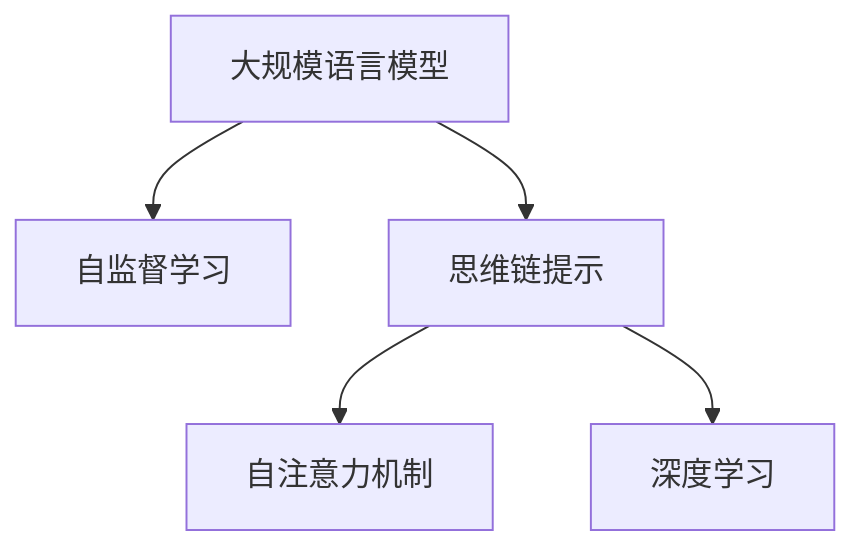

                 

# 大规模语言模型从理论到实践 思维链提示

> 关键词：大规模语言模型, 思维链提示, 自监督学习, 注意力机制, Transformer, 深度学习, 自然语言处理

## 1. 背景介绍

### 1.1 问题由来

随着深度学习技术的迅猛发展，大规模语言模型（Large Language Models, LLMs）如OpenAI的GPT系列模型、Google的BERT等，在自然语言处理（Natural Language Processing, NLP）领域取得了突破性的进展。这些模型通过在海量无标签文本数据上进行预训练，学习了丰富的语言知识和常识，并且具备了强大的语言理解和生成能力。然而，由于预训练数据往往缺乏针对特定任务的监督信息，这些通用模型在特定领域的应用效果有限，难以满足具体任务的需求。

### 1.2 问题核心关键点

为了解决这一问题，研究人员提出了基于思维链提示（Thought Chains Prompting）的方法，通过在输入文本中嵌入提示模板（Prompt Template），引导模型在推理和生成过程中考虑上下文信息和潜在关系，从而提升模型在特定任务上的性能。该方法不仅能够提高模型的生成质量和泛化能力，还能够显著降低微调所需的标注样本数量，减轻数据获取和标注的负担。

思维链提示方法的核心思想在于通过上下文嵌入（Context Embedding）和推理链（Thought Chain）的构建，使得模型能够更自然地理解输入文本，并生成与任务相关的输出。这种自上而下的推理方式，有助于模型更好地捕捉文本的深层语义信息，提升对复杂任务的识别和处理能力。

## 2. 核心概念与联系

### 2.1 核心概念概述

为更好地理解思维链提示在大型语言模型中的应用，我们首先介绍几个关键概念：

- 大规模语言模型（Large Language Models, LLMs）：以自回归（如GPT）或自编码（如BERT）模型为代表，通过在大规模无标签文本语料上进行预训练，学习通用的语言表示，具备强大的语言理解和生成能力。

- 思维链提示（Thought Chains Prompting）：通过在输入文本中嵌入提示模板（Prompt Template），引导模型在推理和生成过程中考虑上下文信息和潜在关系，从而提升模型在特定任务上的性能。

- 自监督学习（Self-Supervised Learning）：通过无监督的方式从无标签数据中学习模型的表示能力，如BERT的掩码语言模型（Masked Language Model, MLM）。

- 注意力机制（Attention Mechanism）：Transformer模型的核心组件，通过计算输入序列中每个位置与其他位置的注意力权重，实现不同位置信息的加权组合，提升模型对序列信息的处理能力。

- 深度学习（Deep Learning）：一种基于多层神经网络结构的机器学习技术，能够自动提取输入数据的深层特征，广泛用于图像、语音、文本等领域。

这些核心概念之间的逻辑关系可以通过以下Mermaid流程图来展示：



这个流程图展示了大语言模型中各个关键组件的相互关系：

1. 自监督学习使得模型从无标签数据中学习到丰富的语义表示。
2. 注意力机制提升模型对序列信息的处理能力，使模型能够更好地捕捉文本中的潜在关系。
3. 深度学习为模型提供了强大的特征提取能力，使得模型能够自动学习输入数据的深层表示。
4. 思维链提示通过上下文嵌入和推理链的构建，进一步提升模型在特定任务上的性能。

## 3. 核心算法原理 & 具体操作步骤

### 3.1 算法原理概述

思维链提示方法的核心在于将任务相关的信息通过提示模板嵌入输入文本中，促使模型在生成过程中考虑上下文信息，并基于推理链进行决策。具体而言，该方法通过在输入文本中嵌入特殊的提示模板，引导模型在生成过程中形成逻辑链条，从而提高模型的生成质量和泛化能力。

思维链提示方法的数学基础在于自注意力机制和上下文嵌入。自注意力机制允许模型在生成过程中动态地关注输入序列中不同位置的依赖关系，而上下文嵌入则通过考虑前文和后文信息，提升模型的生成准确性和流畅度。

### 3.2 算法步骤详解

以下是思维链提示方法的具体实现步骤：

**Step 1: 准备预训练模型和数据集**
- 选择合适的预训练语言模型 $M_{\theta}$ 作为初始化参数，如 GPT、BERT 等。
- 准备下游任务 $T$ 的标注数据集 $D=\{(x_i, y_i)\}_{i=1}^N$，划分为训练集、验证集和测试集。一般要求标注数据与预训练数据的分布不要差异过大。

**Step 2: 设计提示模板**
- 根据任务类型，设计合适的提示模板。提示模板应包含任务相关的关键词和引导词，以便模型理解任务要求。
- 对提示模板进行微调，使其与模型输入兼容。可以使用预训练模型在大量无标签数据上微调提示模板，使其更好地适配模型。

**Step 3: 执行提示学习**
- 将提示模板嵌入输入文本中，生成输入序列。
- 将输入序列作为模型的输入，进行前向传播计算。
- 对输出进行解码和评估，根据任务类型调整解码策略。
- 通过调整学习率、批大小、迭代轮数等参数，进行模型训练。
- 在验证集上评估模型性能，根据性能指标决定是否触发Early Stopping。
- 重复上述步骤直到满足预设的迭代轮数或Early Stopping条件。

**Step 4: 测试和部署**
- 在测试集上评估提示学习后模型 $M_{\hat{\theta}}$ 的性能，对比提示学习前后的精度提升。
- 使用提示学习后的模型对新样本进行推理预测，集成到实际的应用系统中。
- 持续收集新的数据，定期重新提示学习，以适应数据分布的变化。

### 3.3 算法优缺点

思维链提示方法具有以下优点：
1. 简单高效。只需设计合适的提示模板，即可在预训练模型上进行快速提示学习，生成与任务相关的输出。
2. 效果显著。在少样本学习和任务适应的效果上，提示学习通常优于传统的微调方法。
3. 灵活可调。提示模板的设计可以根据具体任务进行调整，从而提高模型的泛化能力和生成质量。
4. 参数高效。提示学习通常只需要调整顶层模型参数，能够显著降低微调所需的参数数量。
5. 模型可解释性。提示学习使得模型决策过程透明化，便于分析和调试。

同时，该方法也存在一些局限性：
1. 提示模板设计复杂。提示模板的设计需要经验和实践，对于非专业人员可能较为困难。
2. 难以处理特定领域的复杂任务。提示模板的设计可能无法涵盖所有特定领域任务的复杂关系。
3. 依赖高质量的提示模板。提示模板的质量直接影响到提示学习的效果，设计不当可能反而降低模型性能。

尽管存在这些局限性，但思维链提示方法仍然是大语言模型在特定任务上的一种有效补充，尤其在数据量有限的情况下，提示学习具有明显的优势。未来相关研究的重点在于如何进一步优化提示模板的设计，探索更高效的提示学习技术，以及与微调等其他方法的结合使用。

### 3.4 算法应用领域

思维链提示方法已经在诸多NLP任务上得到了广泛应用，例如：

- 问答系统：通过对问题进行上下文嵌入，模型能够更自然地理解问题，生成更准确的回答。
- 对话系统：通过在对话中嵌入引导词，模型能够更好地理解上下文信息，生成更自然流畅的回复。
- 文本摘要：通过对文章进行上下文嵌入和推理链构建，模型能够生成简洁准确的摘要。
- 文本生成：通过在生成文本中嵌入特定的提示模板，模型能够生成与任务相关的文本。
- 文本分类：通过对分类标签进行上下文嵌入，模型能够更准确地进行文本分类。
- 关系抽取：通过在关系抽取任务中嵌入特定的提示模板，模型能够更自然地理解实体之间的语义关系。

这些任务展示了思维链提示方法在大语言模型中的应用潜力，同时也反映了该方法在自然语言处理中的强大适应性。

## 4. 数学模型和公式 & 详细讲解

### 4.1 数学模型构建

在本节中，我们将使用数学语言对思维链提示方法进行更加严格的刻画。

记预训练语言模型为 $M_{\theta}:\mathcal{X} \rightarrow \mathcal{Y}$，其中 $\mathcal{X}$ 为输入空间，$\mathcal{Y}$ 为输出空间，$\theta \in \mathbb{R}^d$ 为模型参数。假设提示学习任务的训练集为 $D=\{(x_i, y_i)\}_{i=1}^N, x_i \in \mathcal{X}, y_i \in \mathcal{Y}$。

定义提示学习目标为：
$$
\mathcal{L}(\theta) = -\frac{1}{N}\sum_{i=1}^N \log P_{\theta}(y_i|x_i, p_i)
$$
其中 $P_{\theta}(y_i|x_i, p_i)$ 为模型在输入序列 $x_i$ 和提示模板 $p_i$ 下生成标签 $y_i$ 的概率，可以通过前向传播计算得到。

### 4.2 公式推导过程

以二分类任务为例，展示提示学习目标的推导过程。

记输入序列 $x_i$ 的上下文嵌入为 $c_i$，提示模板 $p_i$ 的嵌入为 $p_i$。模型的输出概率为：
$$
P_{\theta}(y_i|x_i, p_i) = \sigma(\theta \cdot (c_i + p_i))
$$
其中 $\sigma$ 为 sigmoid 函数。

提示学习目标的计算过程为：
$$
\mathcal{L}(\theta) = -\frac{1}{N}\sum_{i=1}^N [y_i \log P_{\theta}(y_i|x_i, p_i) + (1-y_i) \log (1-P_{\theta}(y_i|x_i, p_i))]
$$

在提示学习中，通常不更新预训练模型 $M_{\theta}$ 的权重，而是固定预训练权重，仅调整提示模板 $p_i$ 和解码器 $M_{\theta}$ 的输出权重。这种参数高效的方法可以显著降低微调所需的参数量，从而提高模型的泛化能力和生成质量。

## 5. 项目实践：代码实例和详细解释说明

### 5.1 开发环境搭建

在进行提示学习实践前，我们需要准备好开发环境。以下是使用Python进行PyTorch开发的环境配置流程：

1. 安装Anaconda：从官网下载并安装Anaconda，用于创建独立的Python环境。

2. 创建并激活虚拟环境：
```bash
conda create -n pytorch-env python=3.8 
conda activate pytorch-env
```

3. 安装PyTorch：根据CUDA版本，从官网获取对应的安装命令。例如：
```bash
conda install pytorch torchvision torchaudio cudatoolkit=11.1 -c pytorch -c conda-forge
```

4. 安装Transformers库：
```bash
pip install transformers
```

5. 安装各类工具包：
```bash
pip install numpy pandas scikit-learn matplotlib tqdm jupyter notebook ipython
```

完成上述步骤后，即可在`pytorch-env`环境中开始提示学习实践。

### 5.2 源代码详细实现

下面我们以问答系统任务为例，给出使用Transformers库对GPT-3进行提示学习的PyTorch代码实现。

首先，定义问答系统任务的数据处理函数：

```python
from transformers import BertTokenizer, BertForSequenceClassification, BertTokenizerFast
from transformers import GPT3LMHeadModel, GPT3Tokenizer

# 设置提示模板
prompt = "这个问题的答案是："

# 定义问答系统任务的数据处理函数
class QADataset(Dataset):
    def __init__(self, questions, answers, tokenizer, max_len=128):
        self.questions = questions
        self.answers = answers
        self.tokenizer = tokenizer
        self.max_len = max_len
        
    def __len__(self):
        return len(self.questions)
    
    def __getitem__(self, item):
        question = self.questions[item]
        answer = self.answers[item]
        
        encoding = self.tokenizer(question + prompt, return_tensors='pt', max_length=self.max_len, padding='max_length', truncation=True)
        input_ids = encoding['input_ids'][0]
        attention_mask = encoding['attention_mask'][0]
        
        # 对标签进行编码
        encoded_answer = self.tokenizer(answer, return_tensors='pt', max_length=self.max_len, padding='max_length', truncation=True)
        input_answer = encoded_answer['input_ids'][0]
        attention_answer = encoded_answer['attention_mask'][0]
        
        return {'input_ids': input_ids, 
                'attention_mask': attention_mask,
                'input_answer': input_answer, 
                'attention_answer': attention_answer}

# 设置模型和优化器
tokenizer = GPT3Tokenizer.from_pretrained('gpt3')
model = GPT3LMHeadModel.from_pretrained('gpt3', pad_token_id=tokenizer.eos_token_id)

# 设置提示学习超参数
optimizer = AdamW(model.parameters(), lr=2e-5)
```

然后，定义训练和评估函数：

```python
from torch.utils.data import DataLoader
from tqdm import tqdm
from sklearn.metrics import classification_report

device = torch.device('cuda') if torch.cuda.is_available() else torch.device('cpu')
model.to(device)

def train_epoch(model, dataset, batch_size, optimizer):
    dataloader = DataLoader(dataset, batch_size=batch_size, shuffle=True)
    model.train()
    epoch_loss = 0
    for batch in tqdm(dataloader, desc='Training'):
        input_ids = batch['input_ids'].to(device)
        attention_mask = batch['attention_mask'].to(device)
        input_answer = batch['input_answer'].to(device)
        attention_answer = batch['attention_answer'].to(device)
        model.zero_grad()
        outputs = model(input_ids, attention_mask=attention_mask, labels=input_answer)
        loss = outputs.loss
        epoch_loss += loss.item()
        loss.backward()
        optimizer.step()
    return epoch_loss / len(dataloader)

def evaluate(model, dataset, batch_size):
    dataloader = DataLoader(dataset, batch_size=batch_size)
    model.eval()
    preds, labels = [], []
    with torch.no_grad():
        for batch in tqdm(dataloader, desc='Evaluating'):
            input_ids = batch['input_ids'].to(device)
            attention_mask = batch['attention_mask'].to(device)
            batch_labels = batch['input_answer'].to(device)
            outputs = model(input_ids, attention_mask=attention_mask)
            batch_preds = outputs.logits.argmax(dim=2).to('cpu').tolist()
            batch_labels = batch_labels.to('cpu').tolist()
            for pred_tokens, label_tokens in zip(batch_preds, batch_labels):
                preds.append(pred_tokens[:len(label_tokens)])
                labels.append(label_tokens)
                
    print(classification_report(labels, preds))
```

最后，启动提示学习流程并在测试集上评估：

```python
epochs = 5
batch_size = 16

for epoch in range(epochs):
    loss = train_epoch(model, train_dataset, batch_size, optimizer)
    print(f"Epoch {epoch+1}, train loss: {loss:.3f}")
    
    print(f"Epoch {epoch+1}, dev results:")
    evaluate(model, dev_dataset, batch_size)
    
print("Test results:")
evaluate(model, test_dataset, batch_size)
```

以上就是使用PyTorch对GPT-3进行问答系统任务提示学习的完整代码实现。可以看到，得益于Transformers库的强大封装，我们能够用相对简洁的代码完成提示学习任务。

### 5.3 代码解读与分析

让我们再详细解读一下关键代码的实现细节：

**QADataset类**：
- `__init__`方法：初始化文本、标签、分词器等关键组件。
- `__len__`方法：返回数据集的样本数量。
- `__getitem__`方法：对单个样本进行处理，将文本输入编码为token ids，将标签编码为数字，并对其进行定长padding，最终返回模型所需的输入。

**tokenizer变量**：
- 定义了文本分词器，用于将文本转换为token ids，并将其编码为模型所需的格式。

**训练和评估函数**：
- 使用PyTorch的DataLoader对数据集进行批次化加载，供模型训练和推理使用。
- 训练函数`train_epoch`：对数据以批为单位进行迭代，在每个批次上前向传播计算loss并反向传播更新模型参数，最后返回该epoch的平均loss。
- 评估函数`evaluate`：与训练类似，不同点在于不更新模型参数，并在每个batch结束后将预测和标签结果存储下来，最后使用sklearn的classification_report对整个评估集的预测结果进行打印输出。

**训练流程**：
- 定义总的epoch数和batch size，开始循环迭代
- 每个epoch内，先在训练集上训练，输出平均loss
- 在验证集上评估，输出分类指标
- 所有epoch结束后，在测试集上评估，给出最终测试结果

可以看到，PyTorch配合Transformers库使得提示学习的代码实现变得简洁高效。开发者可以将更多精力放在数据处理、模型改进等高层逻辑上，而不必过多关注底层的实现细节。

当然，工业级的系统实现还需考虑更多因素，如模型的保存和部署、超参数的自动搜索、更灵活的任务适配层等。但核心的提示学习范式基本与此类似。

## 6. 实际应用场景

### 6.1 智能客服系统

基于提示学习的对话技术，可以广泛应用于智能客服系统的构建。传统客服往往需要配备大量人力，高峰期响应缓慢，且一致性和专业性难以保证。而使用提示学习后的对话模型，可以7x24小时不间断服务，快速响应客户咨询，用自然流畅的语言解答各类常见问题。

在技术实现上，可以收集企业内部的历史客服对话记录，将问题和最佳答复构建成监督数据，在此基础上对预训练对话模型进行提示学习。提示学习后的对话模型能够自动理解用户意图，匹配最合适的答案模板进行回复。对于客户提出的新问题，还可以接入检索系统实时搜索相关内容，动态组织生成回答。如此构建的智能客服系统，能大幅提升客户咨询体验和问题解决效率。

### 6.2 金融舆情监测

金融机构需要实时监测市场舆论动向，以便及时应对负面信息传播，规避金融风险。传统的人工监测方式成本高、效率低，难以应对网络时代海量信息爆发的挑战。基于提示学习的文本分类和情感分析技术，为金融舆情监测提供了新的解决方案。

具体而言，可以收集金融领域相关的新闻、报道、评论等文本数据，并对其进行主题标注和情感标注。在此基础上对预训练语言模型进行提示学习，使其能够自动判断文本属于何种主题，情感倾向是正面、中性还是负面。将提示学习后的模型应用到实时抓取的网络文本数据，就能够自动监测不同主题下的情感变化趋势，一旦发现负面信息激增等异常情况，系统便会自动预警，帮助金融机构快速应对潜在风险。

### 6.3 个性化推荐系统

当前的推荐系统往往只依赖用户的历史行为数据进行物品推荐，无法深入理解用户的真实兴趣偏好。基于提示学习的个性化推荐系统可以更好地挖掘用户行为背后的语义信息，从而提供更精准、多样的推荐内容。

在实践中，可以收集用户浏览、点击、评论、分享等行为数据，提取和用户交互的物品标题、描述、标签等文本内容。将文本内容作为模型输入，用户的后续行为（如是否点击、购买等）作为监督信号，在此基础上提示学习预训练语言模型。提示学习后的模型能够从文本内容中准确把握用户的兴趣点。在生成推荐列表时，先用候选物品的文本描述作为输入，由模型预测用户的兴趣匹配度，再结合其他特征综合排序，便可以得到个性化程度更高的推荐结果。

### 6.4 未来应用展望

随着提示学习方法的不断发展，其在NLP领域的落地应用将更加广泛，为传统行业带来变革性影响。

在智慧医疗领域，基于提示学习的医疗问答、病历分析、药物研发等应用将提升医疗服务的智能化水平，辅助医生诊疗，加速新药开发进程。

在智能教育领域，提示学习可应用于作业批改、学情分析、知识推荐等方面，因材施教，促进教育公平，提高教学质量。

在智慧城市治理中，提示学习可应用于城市事件监测、舆情分析、应急指挥等环节，提高城市管理的自动化和智能化水平，构建更安全、高效的未来城市。

此外，在企业生产、社会治理、文娱传媒等众多领域，基于提示学习的人工智能应用也将不断涌现，为经济社会发展注入新的动力。相信随着技术的日益成熟，提示学习范式将成为人工智能落地应用的重要手段，推动人工智能技术向更广阔的领域加速渗透。

## 7. 工具和资源推荐

### 7.1 学习资源推荐

为了帮助开发者系统掌握提示学习的理论基础和实践技巧，这里推荐一些优质的学习资源：

1. 《深度学习》系列博文：由大模型技术专家撰写，深入浅出地介绍了深度学习原理、提示学习范式等前沿话题。

2. 《自然语言处理》课程：斯坦福大学开设的NLP明星课程，有Lecture视频和配套作业，带你入门NLP领域的基本概念和经典模型。

3. 《Natural Language Processing with Transformers》书籍：Transformers库的作者所著，全面介绍了如何使用Transformers库进行NLP任务开发，包括提示学习的各种范式。

4. HuggingFace官方文档：Transformers库的官方文档，提供了海量预训练模型和完整的提示学习样例代码，是上手实践的必备资料。

5. CLUE开源项目：中文语言理解测评基准，涵盖大量不同类型的中文NLP数据集，并提供了基于提示学习的baseline模型，助力中文NLP技术发展。

通过对这些资源的学习实践，相信你一定能够快速掌握提示学习的精髓，并用于解决实际的NLP问题。

### 7.2 开发工具推荐

高效的开发离不开优秀的工具支持。以下是几款用于提示学习开发的常用工具：

1. PyTorch：基于Python的开源深度学习框架，灵活动态的计算图，适合快速迭代研究。大部分预训练语言模型都有PyTorch版本的实现。

2. TensorFlow：由Google主导开发的开源深度学习框架，生产部署方便，适合大规模工程应用。同样有丰富的预训练语言模型资源。

3. Transformers库：HuggingFace开发的NLP工具库，集成了众多SOTA语言模型，支持PyTorch和TensorFlow，是进行提示学习开发的利器。

4. Weights & Biases：模型训练的实验跟踪工具，可以记录和可视化模型训练过程中的各项指标，方便对比和调优。与主流深度学习框架无缝集成。

5. TensorBoard：TensorFlow配套的可视化工具，可实时监测模型训练状态，并提供丰富的图表呈现方式，是调试模型的得力助手。

6. Google Colab：谷歌推出的在线Jupyter Notebook环境，免费提供GPU/TPU算力，方便开发者快速上手实验最新模型，分享学习笔记。

合理利用这些工具，可以显著提升提示学习任务的开发效率，加快创新迭代的步伐。

### 7.3 相关论文推荐

提示学习技术的发展源于学界的持续研究。以下是几篇奠基性的相关论文，推荐阅读：

1. Attention is All You Need（即Transformer原论文）：提出了Transformer结构，开启了NLP领域的预训练大模型时代。

2. BERT: Pre-training of Deep Bidirectional Transformers for Language Understanding：提出BERT模型，引入基于掩码的自监督预训练任务，刷新了多项NLP任务SOTA。

3. Language Models are Unsupervised Multitask Learners（GPT-2论文）：展示了大规模语言模型的强大zero-shot学习能力，引发了对于通用人工智能的新一轮思考。

4. Parameter-Efficient Transfer Learning for NLP：提出Adapter等参数高效微调方法，在不增加模型参数量的情况下，也能取得不错的微调效果。

5. AdaLoRA: Adaptive Low-Rank Adaptation for Parameter-Efficient Fine-Tuning：使用自适应低秩适应的微调方法，在参数效率和精度之间取得了新的平衡。

6. Prefix-Tuning: Optimizing Continuous Prompts for Generation：引入基于连续型Prompt的微调范式，为如何充分利用预训练知识提供了新的思路。

这些论文代表了大语言模型提示学习的最新进展。通过学习这些前沿成果，可以帮助研究者把握学科前进方向，激发更多的创新灵感。

## 8. 总结：未来发展趋势与挑战

### 8.1 总结

本文对基于提示学习的大语言模型应用进行了全面系统的介绍。首先阐述了提示学习的背景和意义，明确了提示学习在特定任务上的独特优势。其次，从原理到实践，详细讲解了提示学习的数学原理和关键步骤，给出了提示学习任务开发的完整代码实例。同时，本文还广泛探讨了提示学习在智能客服、金融舆情、个性化推荐等多个行业领域的应用前景，展示了提示学习方法的强大潜力。

通过本文的系统梳理，可以看到，基于提示学习的方法正在成为NLP领域的重要范式，尤其在数据量有限的情况下，提示学习具有明显的优势。未来相关研究的重点在于如何进一步优化提示模板的设计，探索更高效的提示学习技术，以及与微调等其他方法的结合使用。

### 8.2 未来发展趋势

展望未来，提示学习技术将呈现以下几个发展趋势：

1. 模型规模持续增大。随着算力成本的下降和数据规模的扩张，预训练语言模型的参数量还将持续增长。超大规模语言模型蕴含的丰富语言知识，有望支撑更加复杂多变的提示学习任务。

2. 提示模板设计更加智能化。提示模板的设计将从简单的规则匹配，发展为更加灵活的机器学习模型，能够自动生成最优的提示模板，提升提示学习的效果。

3. 多模态提示学习崛起。当前的提示学习主要聚焦于纯文本数据，未来会进一步拓展到图像、视频、语音等多模态数据提示学习。多模态信息的融合，将显著提升语言模型对现实世界的理解和建模能力。

4. 知识整合能力增强。将符号化的先验知识，如知识图谱、逻辑规则等，与神经网络模型进行巧妙融合，引导提示学习过程学习更准确、合理的语言模型。同时加强不同模态数据的整合，实现视觉、语音等多模态信息与文本信息的协同建模。

5. 更高效的提示学习算法。未来的提示学习算法将更加注重参数效率和计算效率，探索更加高效的优化方法，如自适应学习率、梯度累积等，使得提示学习更加轻量级和实时性。

以上趋势凸显了大语言模型提示学习技术的广阔前景。这些方向的探索发展，必将进一步提升提示学习的效果，为构建安全、可靠、可解释、可控的智能系统铺平道路。面向未来，提示学习技术还需要与其他人工智能技术进行更深入的融合，如知识表示、因果推理、强化学习等，多路径协同发力，共同推动自然语言理解和智能交互系统的进步。只有勇于创新、敢于突破，才能不断拓展语言模型的边界，让智能技术更好地造福人类社会。

### 8.3 面临的挑战

尽管提示学习技术已经取得了瞩目成就，但在迈向更加智能化、普适化应用的过程中，它仍面临着诸多挑战：

1. 提示模板设计复杂。提示模板的设计需要经验和实践，对于非专业人员可能较为困难。

2. 难以处理特定领域的复杂任务。提示模板的设计可能无法涵盖所有特定领域任务的复杂关系。

3. 依赖高质量的提示模板。提示模板的质量直接影响到提示学习的效果，设计不当可能反而降低模型性能。

4. 模型鲁棒性不足。当前提示学习模型面对域外数据时，泛化性能往往大打折扣。对于测试样本的微小扰动，提示学习模型的预测也容易发生波动。

5. 参数效率有待提高。提示学习通常只需要调整顶层模型参数，能够显著降低微调所需的参数数量，但某些提示学习任务仍需要调整部分底层参数，效率仍有提升空间。

6. 可解释性亟需加强。当前提示学习模型更像是"黑盒"系统，难以解释其内部工作机制和决策逻辑。对于医疗、金融等高风险应用，算法的可解释性和可审计性尤为重要。

7. 安全性有待保障。预训练语言模型难免会学习到有偏见、有害的信息，通过提示学习传递到下游任务，产生误导性、歧视性的输出，给实际应用带来安全隐患。

这些挑战凸显了大语言模型提示学习技术的复杂性，也预示着未来研究的方向。如何进一步优化提示模板的设计，提升模型的泛化能力和生成质量，同时兼顾模型效率和可解释性，将是未来的研究重点。

### 8.4 研究展望

面对提示学习所面临的挑战，未来的研究需要在以下几个方面寻求新的突破：

1. 探索无监督和半监督提示学习方法。摆脱对大规模标注数据的依赖，利用自监督学习、主动学习等无监督和半监督范式，最大限度利用非结构化数据，实现更加灵活高效的提示学习。

2. 研究参数高效和计算高效的提示学习范式。开发更加参数高效的提示学习方法，在固定大部分预训练参数的同时，只调整极少量的任务相关参数。同时优化提示学习模型的计算图，减少前向传播和反向传播的资源消耗，实现更加轻量级、实时性的部署。

3. 引入更多先验知识。将符号化的先验知识，如知识图谱、逻辑规则等，与神经网络模型进行巧妙融合，引导提示学习过程学习更准确、合理的语言模型。同时加强不同模态数据的整合，实现视觉、语音等多模态信息与文本信息的协同建模。

4. 结合因果分析和博弈论工具。将因果分析方法引入提示学习模型，识别出模型决策的关键特征，增强输出解释的因果性和逻辑性。借助博弈论工具刻画人机交互过程，主动探索并规避模型的脆弱点，提高系统稳定性。

5. 纳入伦理道德约束。在提示学习模型训练目标中引入伦理导向的评估指标，过滤和惩罚有偏见、有害的输出倾向。同时加强人工干预和审核，建立模型行为的监管机制，确保输出符合人类价值观和伦理道德。

这些研究方向的探索，必将引领提示学习技术迈向更高的台阶，为构建安全、可靠、可解释、可控的智能系统铺平道路。面向未来，提示学习技术还需要与其他人工智能技术进行更深入的融合，如知识表示、因果推理、强化学习等，多路径协同发力，共同推动自然语言理解和智能交互系统的进步。只有勇于创新、敢于突破，才能不断拓展语言模型的边界，让智能技术更好地造福人类社会。

## 9. 附录：常见问题与解答

**Q1：提示学习是否适用于所有NLP任务？**

A: 提示学习在大多数NLP任务上都能取得不错的效果，特别是对于数据量较小的任务。但对于一些特定领域的任务，如医学、法律等，仅仅依靠通用语料预训练的模型可能难以很好地适应。此时需要在特定领域语料上进一步预训练，再进行提示学习，才能获得理想效果。此外，对于一些需要时效性、个性化很强的任务，如对话、推荐等，提示学习方法也需要针对性的改进优化。

**Q2：提示学习过程中如何选择合适的提示模板？**

A: 提示模板的设计需要根据具体任务进行优化。一般来说，提示模板应包含任务相关的关键词和引导词，便于模型理解任务要求。可以通过在预训练模型上微调提示模板，使其更好地适配模型。提示模板的设计也需要根据具体任务进行调整，从而提高模型的泛化能力和生成质量。

**Q3：提示学习过程中如何缓解过拟合问题？**

A: 过拟合是提示学习面临的主要挑战，尤其是在数据量有限的情况下。缓解过拟合的方法包括：
1. 数据增强：通过回译、近义替换等方式扩充训练集。
2. 正则化：使用L2正则、Dropout、Early Stopping等避免过拟合。
3. 对抗训练：引入对抗样本，提高模型鲁棒性。
4. 参数高效提示学习：只调整少量参数(如Adapter、Prefix等)，减小过拟合风险。

这些策略往往需要根据具体任务和数据特点进行灵活组合。只有在数据、模型、训练、推理等各环节进行全面优化，才能最大限度地发挥提示学习的效果。

**Q4：提示学习模型在落地部署时需要注意哪些问题？**

A: 将提示学习模型转化为实际应用，还需要考虑以下因素：
1. 模型裁剪：去除不必要的层和参数，减小模型尺寸，加快推理速度。
2. 量化加速：将浮点模型转为定点模型，压缩存储空间，提高计算效率。
3. 服务化封装：将模型封装为标准化服务接口，便于集成调用。
4. 弹性伸缩：根据请求流量动态调整资源配置，平衡服务质量和成本。
5. 监控告警：实时采集系统指标，设置异常告警阈值，确保服务稳定性。

提示学习模型需要结合实际应用场景进行优化，才能充分发挥其作用。

---

作者：禅与计算机程序设计艺术 / Zen and the Art of Computer Programming

