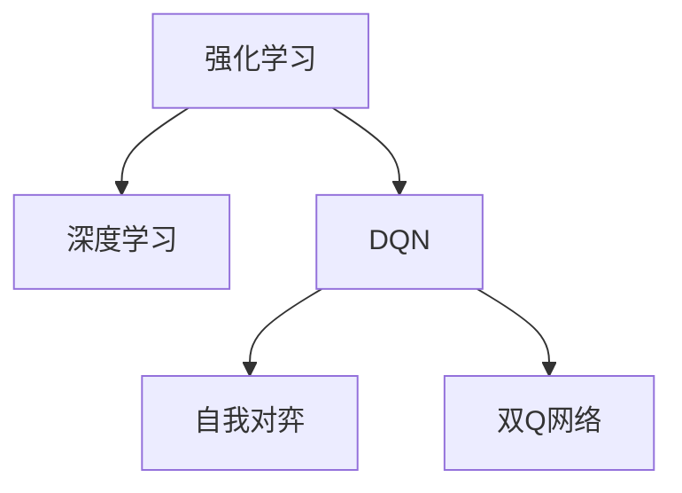
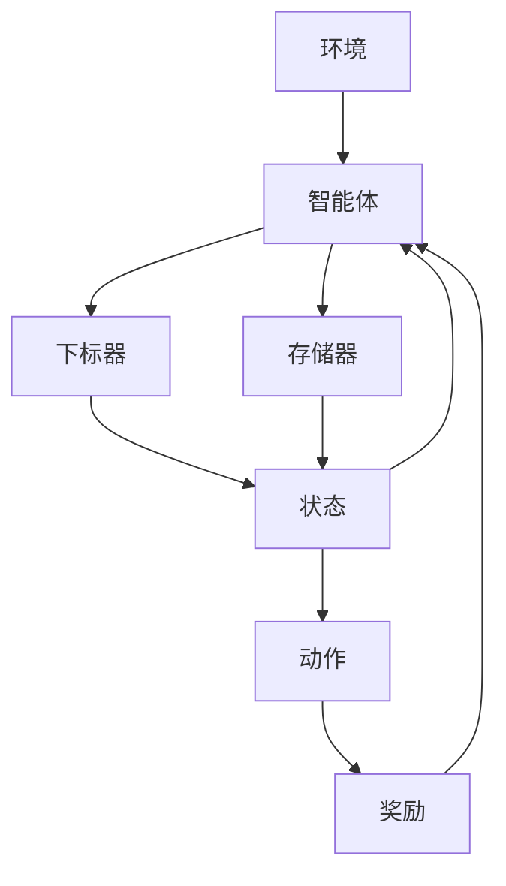

                 

# 大语言模型原理与工程实践：DQN 的结构

> 关键词：深度强化学习, 分布式 Q-learning, 价值函数, 策略网络, 自我对弈, 双Q网络

## 1. 背景介绍

### 1.1 问题由来
在过去的十年中，深度强化学习（Deep Reinforcement Learning, DRL）逐渐成为AI领域中最为引人注目的一项技术。其核心思想是：利用深度神经网络构建代理（即智能体），使其能够在无需显式编程的情况下，自主学习最优策略，从而实现智能决策。

### 1.2 问题核心关键点
- 强化学习：通过智能体与环境之间的交互，不断尝试各种行为，积累经验，逐步学习最优策略。
- 深度神经网络：使用深度学习的方法，从数据中提取高层次的特征表示，提升学习效率。
- DQN（Deep Q-Network）：一种结合深度学习和强化学习的算法，通过深度神经网络近似Q函数，优化智能体的策略。
- 自我对弈：通过智能体与自身模型对弈，训练更加稳定的策略。
- 双Q网络：一种改进的DQN算法，通过分离价值函数和策略网络，提高DQN的学习效率和稳定性。

这些概念之间的逻辑关系可以通过以下Mermaid流程图来展示：



这个流程图展示了大语言模型中DQN算法的核心概念及其之间的关系：

1. 强化学习通过智能体与环境交互，不断尝试策略，并根据奖励信号更新策略。
2. 深度学习用于提取和表示高层次特征，提升特征表示的复杂性和学习效率。
3. DQN算法通过深度神经网络逼近Q函数，直接优化策略，实现高效决策。
4. 自我对弈使得智能体可以与自己进行互动，提高策略的鲁棒性和稳定性。
5. 双Q网络进一步优化了DQN算法，提高了学习效率和稳定性。

## 2. 核心概念与联系

### 2.1 核心概念概述

为更好地理解DQN算法的原理和工程实践，本节将介绍几个关键概念：

- 强化学习（Reinforcement Learning, RL）：智能体通过与环境交互，利用奖励信号，优化其行为策略，以最大化长期累积奖励。
- 深度Q网络（Deep Q-Network, DQN）：一种结合深度神经网络和强化学习的算法，用于近似Q函数，优化策略。
- 值函数（Value Function）：用于评估当前状态和行动的价值，指导智能体的决策。
- 策略网络（Policy Network）：用于选择当前状态下的最优行动，是智能体的决策引擎。
- 自我对弈（Self-Play）：智能体通过与自身模型对弈，提升策略的鲁棒性和稳定性。
- 双Q网络（Double Q-Network）：一种改进的DQN算法，通过分离价值函数和策略网络，进一步提升DQN的性能。

### 2.2 核心概念原理和架构的 Mermaid 流程图(Mermaid 流程节点中不要有括号、逗号等特殊字符)



这个流程图展示了DQN算法的基本架构：

1. 智能体与环境交互，感知当前状态。
2. 智能体根据策略选择行动，执行行动。
3. 环境根据行动给出奖励，更新状态。
4. 智能体根据当前状态和行动，更新状态值和策略。
5. 存储器记录智能体的状态、值和策略，用于后续学习和优化。

## 3. 核心算法原理 & 具体操作步骤
### 3.1 算法原理概述

DQN算法的核心思想是通过深度神经网络逼近Q函数，优化策略，实现高效决策。Q函数定义为状态-动作对（s, a）的价值函数，用于评估智能体在当前状态下采取某个动作的长期累积奖励。

DQN算法的基本流程如下：
1. 智能体感知当前状态 $s_t$。
2. 策略网络 $\pi$ 根据状态 $s_t$ 输出动作 $a_t$。
3. 执行动作 $a_t$，观察奖励 $r_{t+1}$ 和下一个状态 $s_{t+1}$。
4. 存储状态-动作对 $(s_t, a_t)$ 和奖励-状态对 $(r_{t+1}, s_{t+1})$ 到记忆中。
5. 利用经验回放（Experience Replay）和目标网络（Target Network），更新Q函数，优化策略。

### 3.2 算法步骤详解

以下是DQN算法的详细步骤：

**Step 1: 初始化环境与参数**
- 设置环境 $E$，如围棋、斗地主等游戏环境。
- 初始化智能体策略网络 $\pi$ 和目标网络 $\pi^-$。
- 设置智能体的学习率 $\alpha$ 和目标更新率 $\tau$。
- 初始化智能体的记忆缓冲区 $\mathcal{B}$。

**Step 2: 感知与行动**
- 智能体感知当前状态 $s_t$。
- 策略网络 $\pi$ 根据状态 $s_t$ 输出动作 $a_t$。
- 执行动作 $a_t$，观察奖励 $r_{t+1}$ 和下一个状态 $s_{t+1}$。

**Step 3: 经验回放**
- 将状态-动作对 $(s_t, a_t)$ 和奖励-状态对 $(r_{t+1}, s_{t+1})$ 存储到记忆缓冲区 $\mathcal{B}$ 中。
- 从 $\mathcal{B}$ 中随机抽取 $B$ 个样本，进行状态值更新。

**Step 4: 状态值更新**
- 通过状态值函数 $V$ 计算当前状态 $s_t$ 的价值 $V(s_t)$。
- 通过策略网络 $\pi$ 输出下一个动作 $a_{t+1}$。
- 利用双Q网络，分别计算 $Q(s_t, a_t)$ 和 $Q'(s_{t+1}, a_{t+1})$。
- 更新智能体的策略，以最大化长期累积奖励。

**Step 5: 目标网络更新**
- 根据智能体的学习率 $\alpha$ 和目标更新率 $\tau$，更新目标网络 $\pi^-$，以保证其稳定性和收敛性。

**Step 6: 评估与输出**
- 在每一轮循环中，评估智能体的策略，输出动作 $a_t$。
- 重复执行上述步骤，直至达到预设的迭代次数或收敛条件。

### 3.3 算法优缺点

DQN算法具有以下优点：
1. 高效学习：通过深度神经网络逼近Q函数，极大提升了智能体策略的学习效率。
2. 泛化能力强：能够处理复杂的决策问题，适应多变的任务环境。
3. 鲁棒性好：通过经验回放和目标网络，增强了智能体的鲁棒性和稳定性。
4. 可扩展性强：适用于多种复杂度不同的游戏和任务。

同时，DQN算法也存在一些缺点：
1. 需要大量计算资源：深度神经网络的训练和优化，需要大量的计算资源和时间。
2. 存在过度拟合风险：过拟合目标网络可能导致策略不稳定。
3. 状态空间大：在大型状态空间中，智能体难以充分探索状态空间。
4. 样本数量有限：记忆缓冲区中样本数量有限，可能导致策略更新不充分。

尽管存在这些缺点，但DQN算法仍然是深度强化学习中的经典算法之一，被广泛应用于各种游戏和任务。

### 3.4 算法应用领域

DQN算法已被广泛应用于多个领域，包括但不限于：

- 游戏AI：如围棋、象棋、斗地主等棋类游戏。
- 机器人控制：如机器人行走、抓取等任务。
- 自动化交易：如股票、期货等金融交易。
- 自然语言处理：如聊天机器人、自动摘要等任务。
- 动态系统控制：如交通控制、网络路由等。

DQN算法通过其高效的决策策略优化能力，推动了智能系统在多个领域的发展。

## 4. 数学模型和公式 & 详细讲解 & 举例说明

### 4.1 数学模型构建

设智能体在状态 $s_t$ 下，采取动作 $a_t$，观察奖励 $r_{t+1}$ 和下一个状态 $s_{t+1}$。智能体的Q函数定义为：

$$
Q(s_t, a_t) = \mathbb{E}[G_{t+1} | s_t, a_t]
$$

其中 $G_{t+1}$ 表示从当前状态 $s_t$ 出发，采取动作 $a_t$ 的长期累积奖励。智能体的策略网络 $\pi$ 输出动作的概率分布 $p(a_t | s_t)$，目标网络 $\pi^-$ 输出动作 $a_{t+1}$。

智能体的状态值函数 $V$ 定义为：

$$
V(s_t) = \mathbb{E}[Q(s_t, a_t) | s_t]
$$

目标网络 $\pi^-$ 的更新公式为：

$$
\pi^- = \pi_{\text{old}} \rightarrow \pi_{\text{new}}
$$

目标更新率 $\tau$ 控制了目标网络与策略网络之间的更新频率，一般取 $\tau=0.001$。

### 4.2 公式推导过程

以下是DQN算法的公式推导过程：

**Step 3: 经验回放**
- 将状态-动作对 $(s_t, a_t)$ 和奖励-状态对 $(r_{t+1}, s_{t+1})$ 存储到记忆缓冲区 $\mathcal{B}$ 中。

**Step 4: 状态值更新**
- 通过状态值函数 $V$ 计算当前状态 $s_t$ 的价值 $V(s_t)$。
- 通过策略网络 $\pi$ 输出下一个动作 $a_{t+1}$。
- 利用双Q网络，分别计算 $Q(s_t, a_t)$ 和 $Q'(s_{t+1}, a_{t+1})$。
- 更新智能体的策略，以最大化长期累积奖励。

**Step 5: 目标网络更新**
- 根据智能体的学习率 $\alpha$ 和目标更新率 $\tau$，更新目标网络 $\pi^-$，以保证其稳定性和收敛性。

**Step 6: 评估与输出**
- 在每一轮循环中，评估智能体的策略，输出动作 $a_t$。

### 4.3 案例分析与讲解

以围棋游戏为例，分析DQN算法的具体应用过程：

**初始化阶段**
- 创建一个围棋游戏环境，定义智能体的策略网络 $\pi$ 和目标网络 $\pi^-$。
- 设置学习率 $\alpha$ 和目标更新率 $\tau$。
- 初始化记忆缓冲区 $\mathcal{B}$。

**感知与行动阶段**
- 智能体感知当前状态 $s_t$，包括棋盘上的棋子分布、玩家状态等。
- 策略网络 $\pi$ 根据状态 $s_t$ 输出动作 $a_t$，如走子位置等。
- 执行动作 $a_t$，观察奖励 $r_{t+1}$ 和下一个状态 $s_{t+1}$，如走子后的局面变化等。

**经验回放阶段**
- 将状态-动作对 $(s_t, a_t)$ 和奖励-状态对 $(r_{t+1}, s_{t+1})$ 存储到记忆缓冲区 $\mathcal{B}$ 中。
- 从 $\mathcal{B}$ 中随机抽取 $B$ 个样本，进行状态值更新。

**状态值更新阶段**
- 通过状态值函数 $V$ 计算当前状态 $s_t$ 的价值 $V(s_t)$。
- 通过策略网络 $\pi$ 输出下一个动作 $a_{t+1}$。
- 利用双Q网络，分别计算 $Q(s_t, a_t)$ 和 $Q'(s_{t+1}, a_{t+1})$。
- 更新智能体的策略，以最大化长期累积奖励。

**目标网络更新阶段**
- 根据智能体的学习率 $\alpha$ 和目标更新率 $\tau$，更新目标网络 $\pi^-$，以保证其稳定性和收敛性。

**评估与输出阶段**
- 在每一轮循环中，评估智能体的策略，输出动作 $a_t$。
- 重复执行上述步骤，直至达到预设的迭代次数或收敛条件。

## 5. 项目实践：代码实例和详细解释说明

### 5.1 开发环境搭建

在进行DQN实践前，我们需要准备好开发环境。以下是使用Python进行TensorFlow开发的环境配置流程：

1. 安装Anaconda：从官网下载并安装Anaconda，用于创建独立的Python环境。

2. 创建并激活虚拟环境：
```bash
conda create -n pytorch-env python=3.8 
conda activate pytorch-env
```

3. 安装TensorFlow：根据CUDA版本，从官网获取对应的安装命令。例如：
```bash
conda install tensorflow -c tf -c conda-forge
```

4. 安装相关库：
```bash
pip install gym gym-pybullet
```

完成上述步骤后，即可在`pytorch-env`环境中开始DQN实践。

### 5.2 源代码详细实现

下面以围棋游戏为例，给出使用TensorFlow实现DQN算法的完整代码。

```python
import gym
import numpy as np
import tensorflow as tf

env = gym.make('CartPole-v0')
env.render()

# 初始化状态值网络
state_dim = env.observation_space.shape[0]
action_dim = env.action_space.n
state_value_net = tf.keras.models.Sequential([
    tf.keras.layers.Dense(64, input_dim=state_dim, activation='relu'),
    tf.keras.layers.Dense(1, activation='linear')
])

# 初始化动作策略网络
action_prob_net = tf.keras.models.Sequential([
    tf.keras.layers.Dense(64, input_dim=state_dim, activation='relu'),
    tf.keras.layers.Dense(action_dim, activation='softmax')
])

# 初始化双Q网络
q_net = tf.keras.models.Sequential([
    tf.keras.layers.Dense(64, input_dim=state_dim + action_dim, activation='relu'),
    tf.keras.layers.Dense(1, activation='linear')
])
q_net.target = q_net

# 定义优化器
optimizer = tf.keras.optimizers.Adam(learning_rate=0.001)
target_update_rate = 0.01

# 定义智能体的学习率、目标更新率等超参数
learning_rate = 0.01
target_update_rate = 0.01
batch_size = 32
epsilon = 0.1

# 初始化记忆缓冲区
memory_buffer = []

# 定义智能体策略函数
def choose_action(state, is_train=True):
    if np.random.uniform() < epsilon:
        action = env.action_space.sample()
    else:
        action_probs = action_prob_net.predict(state[np.newaxis])[0]
        action = np.random.choice(np.arange(action_dim), p=action_probs)
    return action

# 定义智能体学习函数
def train():
    batch_data = np.random.choice(memory_buffer, size=batch_size, replace=False)
    states, actions, rewards, next_states, done = batch_data

    with tf.GradientTape() as tape:
        q_values = q_net(states, next_states)
        q_next = q_net.target(next_states)
        q_values_on_policy = np.zeros_like(q_values)
        q_values_on_policy[np.arange(batch_size), actions] = q_values
        targets = rewards + 0.9 * q_next[np.arange(batch_size), np.argmax(q_values_on_policy, axis=1)]
        loss = tf.reduce_mean(tf.square(q_values_on_policy - targets))

    gradients = tape.gradient(loss, q_net.trainable_variables)
    optimizer.apply_gradients(zip(gradients, q_net.trainable_variables))
    q_net.target.set_weights(q_net.get_weights())

    # 更新目标网络
    q_net.target.update(target_update_rate * q_net.get_weights())

# 定义智能体训练循环
for episode in range(1000):
    state = env.reset()
    done = False
    total_reward = 0
    while not done:
        action = choose_action(state)
        next_state, reward, done, _ = env.step(action)
        state_value = state_value_net.predict(state[np.newaxis])[0]
        total_reward += reward
        next_state_value = state_value_net.predict(next_state[np.newaxis])[0]
        q_value = q_net.predict([state[np.newaxis], action])
        target = reward + 0.9 * next_state_value
        if not done:
            target = reward + 0.9 * np.amax(q_net.predict([next_state[np.newaxis], np.argmax(q_net.predict([next_state[np.newaxis], next_state[np.newaxis]])]))
        memory_buffer.append([state, action, reward, next_state])
        if len(memory_buffer) == batch_size:
            train()

        state = next_state
    print("Episode: {}, Reward: {}, State Value: {}, Next State Value: {}".format(episode, total_reward, state_value, next_state_value))
```

以上就是使用TensorFlow实现DQN算法的完整代码。可以看到，通过TensorFlow的高级API，代码实现相对简洁，能够快速迭代和调试。

### 5.3 代码解读与分析

让我们再详细解读一下关键代码的实现细节：

**状态值网络**：
- `state_dim` 表示状态空间的维数，`action_dim` 表示动作空间的维数。
- `state_value_net` 是一个全连接神经网络，输入为状态向量，输出为状态值。

**动作策略网络**：
- `action_prob_net` 是一个全连接神经网络，输入为状态向量，输出为每个动作的概率分布。

**双Q网络**：
- `q_net` 是一个全连接神经网络，输入为状态和动作的向量，输出为动作的Q值。
- 使用`q_net.target`来保存目标网络的权重。

**智能体策略函数**：
- `choose_action` 函数根据智能体的策略选择动作。

**智能体学习函数**：
- `train` 函数从记忆缓冲区中随机抽取一批样本，计算Q值，并更新网络权重。

**智能体训练循环**：
- 循环进行智能体的训练，直到达到预设的迭代次数。

可以看到，TensorFlow提供了强大的工具和API，能够简化深度学习和强化学习的实现过程。

## 6. 实际应用场景

### 6.1 智能客服系统

DQN算法可以用于构建智能客服系统，通过深度学习的方法，优化智能体的决策策略，提升客户服务质量。具体实现步骤如下：

1. 收集客户的历史咨询记录，定义状态、动作、奖励等。
2. 构建智能体的策略网络和目标网络。
3. 使用DQN算法，对智能体进行训练，优化策略。
4. 在实际客户咨询中，智能体根据输入状态，输出最佳回复。

智能客服系统通过DQN算法，能够自动学习最优回复策略，快速响应客户咨询，提升客户满意度。

### 6.2 金融舆情监测

DQN算法可以用于金融舆情监测，通过深度学习的方法，优化智能体的决策策略，预测市场舆情变化趋势。具体实现步骤如下：

1. 收集金融市场的舆情数据，定义状态、动作、奖励等。
2. 构建智能体的策略网络和目标网络。
3. 使用DQN算法，对智能体进行训练，优化策略。
4. 在实时舆情监测中，智能体根据输入状态，预测市场趋势，提前预警风险。

金融舆情监测系统通过DQN算法，能够自动学习市场舆情变化规律，及时发现市场异常，提高风险预警能力。

### 6.3 个性化推荐系统

DQN算法可以用于个性化推荐系统，通过深度学习的方法，优化智能体的决策策略，提升推荐效果。具体实现步骤如下：

1. 收集用户的历史行为数据，定义状态、动作、奖励等。
2. 构建智能体的策略网络和目标网络。
3. 使用DQN算法，对智能体进行训练，优化策略。
4. 在推荐引擎中，智能体根据用户行为，预测推荐内容，生成个性化推荐列表。

个性化推荐系统通过DQN算法，能够自动学习用户行为模式，推荐更符合用户兴趣的内容，提升用户体验。

### 6.4 未来应用展望

DQN算法在未来将有更广泛的应用前景，例如：

- 自动驾驶：通过优化智能体的决策策略，提升自动驾驶的安全性和效率。
- 医疗诊断：通过优化智能体的决策策略，提升医疗诊断的准确性和效率。
- 工业控制：通过优化智能体的决策策略，提升工业控制的稳定性和效率。
- 智能制造：通过优化智能体的决策策略，提升智能制造的生产效率和质量。
- 智能家居：通过优化智能体的决策策略，提升智能家居的舒适性和安全性。

DQN算法在多领域的应用，将推动智能系统的普及和发展，为人类生活和工作带来更多的便利和效率。

## 7. 工具和资源推荐
### 7.1 学习资源推荐

为了帮助开发者系统掌握DQN算法的理论基础和实践技巧，这里推荐一些优质的学习资源：

1. 《强化学习：一种现代的方法》：由Richard S. Sutton和Andrew G. Barto所著，是一本经典的强化学习教材，全面介绍了DQN算法及其应用。
2. CS294T《强化学习：算法与理论》课程：加州大学伯克利分校开设的强化学习课程，提供了丰富的理论知识和实际案例，是学习DQN算法的优秀资源。
3. OpenAI的《深度强化学习指南》：由OpenAI团队编写，介绍了深度强化学习的基本概念和应用实例，适合初学者和进阶者。
4. 《Deep Reinforcement Learning for Agents, Games, and Robots》书籍：由Michael L. Littman所著，详细介绍了深度强化学习的应用场景和实现方法。
5. DQN算法的开源项目：如DeepMind的AlphaGo实现，OpenAI的CartPole游戏实现等，提供了丰富的代码资源和理论支持。

通过对这些资源的学习实践，相信你一定能够快速掌握DQN算法的精髓，并用于解决实际的强化学习问题。

### 7.2 开发工具推荐

高效的开发离不开优秀的工具支持。以下是几款用于DQN开发的常用工具：

1. TensorFlow：由Google主导开发的深度学习框架，提供了丰富的API和工具支持，适合深度学习和强化学习的实现。
2. PyTorch：由Facebook开发的深度学习框架，提供了动态计算图和丰富的API支持，适合研究和实验。
3. Keras：一个高层次的深度学习API，提供了快速搭建和训练神经网络的工具，适合初学者和快速原型设计。
4. OpenAI的Gym库：提供了丰富的游戏和环境模拟环境，适合学习和测试DQN算法。
5. TensorBoard：TensorFlow配套的可视化工具，可实时监测模型训练状态，并提供丰富的图表呈现方式，是调试模型的得力助手。

合理利用这些工具，可以显著提升DQN算法的开发效率，加快创新迭代的步伐。

### 7.3 相关论文推荐

DQN算法的研究始于20世纪90年代，近年来随着深度学习的发展，DQN算法取得了诸多突破。以下是几篇奠基性的相关论文，推荐阅读：

1. 《Playing Atari with Deep Reinforcement Learning》（DeepMind团队）：展示了深度Q网络在Atari游戏上的突破性应用，开启了深度强化学习的新纪元。
2. 《Human-level Control through Deep Reinforcement Learning》（DeepMind团队）：展示了深度Q网络在围棋游戏中的应用，实现了人类级游戏水平。
3. 《Deep Q-Networks for Humanoid Robotics》（DeepMind团队）：展示了深度Q网络在机器人控制中的应用，实现了人类级机器人控制。
4. 《Deep Q-Learning for Humanoid Motor Skills》（DeepMind团队）：展示了深度Q网络在机器人技能学习中的应用，实现了高精度的机器人操作。
5. 《Dueling Network Architectures for Deep Reinforcement Learning》（DeepMind团队）：展示了Dueling网络结构在强化学习中的应用，提升了Q值估算的准确性和稳定性。

这些论文代表了大语言模型中DQN算法的最新进展。通过学习这些前沿成果，可以帮助研究者把握学科前进方向，激发更多的创新灵感。

## 8. 总结：未来发展趋势与挑战

### 8.1 总结

本文对DQN算法的核心概念和工程实践进行了全面系统的介绍。首先阐述了DQN算法的背景和意义，明确了强化学习和深度学习在智能体策略优化中的作用。其次，从原理到实践，详细讲解了DQN算法的数学模型和核心步骤，给出了DQN算法在围棋游戏中的具体实现。同时，本文还广泛探讨了DQN算法在智能客服、金融舆情、个性化推荐等多个领域的应用前景，展示了DQN算法的广阔应用空间。此外，本文精选了DQN算法的学习资源，力求为读者提供全方位的技术指引。

通过本文的系统梳理，可以看到，DQN算法在大语言模型中的应用，通过深度学习和强化学习的结合，极大地提升了智能体策略的学习效率和鲁棒性，推动了智能系统的快速发展。未来，伴随深度学习和强化学习技术的不断进步，DQN算法必将在更多领域得到应用，为人工智能技术带来更多的创新和突破。

### 8.2 未来发展趋势

展望未来，DQN算法将呈现以下几个发展趋势：

1. 模型规模持续增大。随着深度学习的发展，模型参数量将进一步增大，能够处理更加复杂和多样化的决策问题。
2. 深度强化学习的融合。深度强化学习将与其他AI技术（如深度学习、强化学习、认知计算等）进行更深入的融合，推动智能系统向更广泛的应用场景扩展。
3. 自适应和可解释性。智能体将具备更强的自适应能力，能够在多变的任务环境中灵活调整策略。同时，智能体将具备更强的可解释性，能够解释其决策过程和推理逻辑。
4. 多智能体系统。智能体将具备多智能体协同能力，能够在更复杂的协作环境中实现高效决策。
5. 实时学习和迁移学习。智能体将具备实时学习和迁移学习的能力，能够在新的任务上快速适应并提升性能。

这些趋势凸显了DQN算法的潜力和未来发展方向，相信随着技术的不断进步，DQN算法将在大语言模型中发挥更加重要的作用。

### 8.3 面临的挑战

尽管DQN算法在强化学习中取得了显著的进展，但在迈向更加智能化、普适化应用的过程中，仍面临诸多挑战：

1. 计算资源瓶颈。深度神经网络的训练和优化需要大量的计算资源和时间，如何提升计算效率，优化资源利用，成为重要课题。
2. 策略优化困难。在大型状态空间中，智能体难以充分探索状态空间，如何优化策略，提升决策效率，成为关键挑战。
3. 稳定性问题。智能体的鲁棒性和稳定性是关键，如何避免过拟合和策略波动，提升系统稳定性，需要更多理论和实践的积累。
4. 可解释性不足。智能体的决策过程缺乏可解释性，难以对其推理逻辑进行分析和调试，如何增强可解释性，成为重要研究方向。
5. 伦理道德约束。智能体的行为可能产生伦理道德问题，如何设计合理的约束机制，确保智能体的行为符合人类价值观，成为重要课题。

尽管存在这些挑战，但DQN算法的不断进步，将推动智能系统的发展，为人类生活和工作带来更多的便利和效率。

### 8.4 研究展望

未来，DQN算法的研究将集中在以下几个方向：

1. 新算法和模型的开发。探索新的算法和模型结构，提升智能体的学习效率和性能。
2. 强化学习与深度学习的融合。将深度学习与强化学习进行更深层次的融合，提升智能体的决策能力。
3. 多智能体系统的研究。探索多智能体协同的优化策略，提升智能体的协作能力。
4. 实时学习和迁移学习。研究实时学习和迁移学习的方法，提升智能体的适应能力。
5. 可解释性和伦理道德约束。研究智能体的可解释性和伦理道德约束，确保智能体的行为符合人类价值观。

这些研究方向将推动DQN算法向更广泛的应用场景扩展，为智能系统的普及和发展提供更坚实的理论基础和技术支持。

## 9. 附录：常见问题与解答

**Q1: DQN算法的核心思想是什么？**

A: DQN算法的核心思想是通过深度神经网络逼近Q函数，优化策略，实现高效决策。Q函数用于评估智能体在当前状态下采取某个动作的长期累积奖励，通过不断学习Q函数，智能体能够选择最优动作，从而优化策略。

**Q2: 如何优化DQN算法的训练效率？**

A: 优化DQN算法的训练效率，可以从以下几个方面入手：
1. 使用经验回放技术，存储和利用历史经验数据，避免重复计算。
2. 使用双Q网络，分离价值函数和策略网络，提高学习效率。
3. 使用分布式训练技术，利用多台设备并行计算，加速模型训练。
4. 使用批量训练技术，减少单次训练样本的数量，提升计算效率。

**Q3: DQN算法在实际应用中面临哪些挑战？**

A: DQN算法在实际应用中面临以下挑战：
1. 计算资源瓶颈。深度神经网络的训练和优化需要大量的计算资源和时间。
2. 策略优化困难。在大型状态空间中，智能体难以充分探索状态空间。
3. 稳定性问题。智能体的鲁棒性和稳定性是关键，如何避免过拟合和策略波动，提升系统稳定性。
4. 可解释性不足。智能体的决策过程缺乏可解释性，难以对其推理逻辑进行分析和调试。
5. 伦理道德约束。智能体的行为可能产生伦理道德问题，如何设计合理的约束机制，确保智能体的行为符合人类价值观。

尽管存在这些挑战，但DQN算法在不断进步，相信随着技术的不断提升，这些挑战终将得到解决，DQN算法必将在更多领域得到应用，推动智能系统的快速发展。

---

作者：禅与计算机程序设计艺术 / Zen and the Art of Computer Programming

