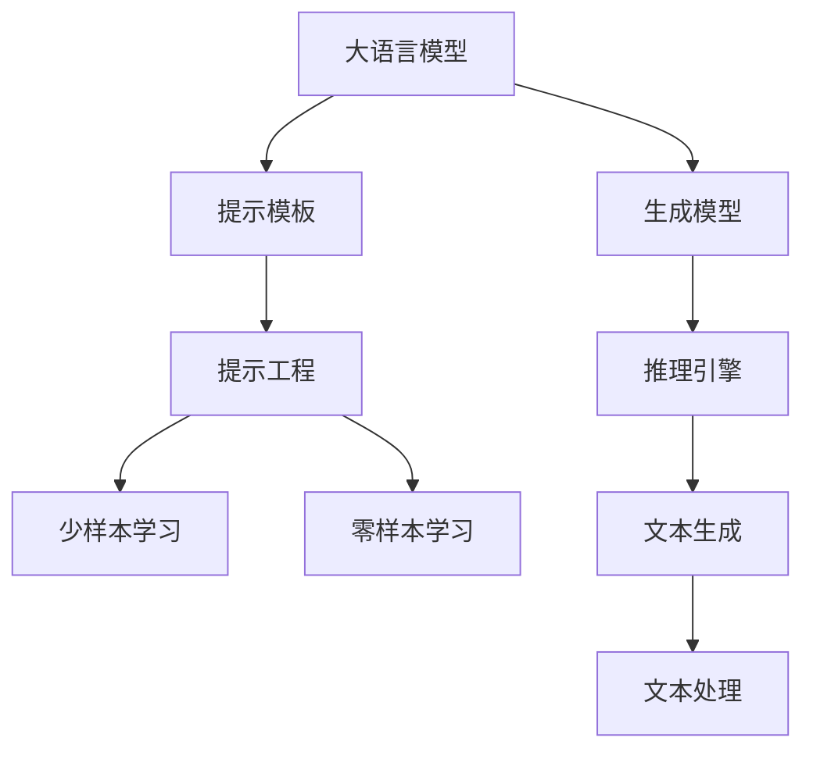

                 

# 大语言模型原理与工程实践：大语言模型为什么需要提示工程

> 关键词：大语言模型,提示工程,Prompt Engineering,自然语言处理,NLP,生成模型,推理引擎

## 1. 背景介绍

### 1.1 问题由来
随着自然语言处理(Natural Language Processing, NLP)技术的不断进步，大语言模型在生成自然语言文本、解答复杂问题、提供自然语言交互等方面展示了惊人的能力。这些模型通常基于Transformer架构进行预训练，如GPT-3、BERT等。但即便如此强大的模型，在面对特定任务时仍需要依赖精心设计的输入模板，即提示模板(Prompt)。

提示模板是告诉模型要执行什么任务的关键。在现实应用中，无论是文本生成、信息检索、问答系统还是图像描述，都需要通过提示模板来明确任务的语义信息。然而，设计高效且能够有效引导模型生成高质量输出的提示模板并非易事。这不仅要求开发者具备深厚的语言学知识，还需要对模型架构有深入理解。因此，提示工程(Prompt Engineering)成为了大语言模型应用过程中不可或缺的一部分。

### 1.2 问题核心关键点
提示工程的核心在于如何设计出能够最大化模型性能的输入模板。它需要考虑以下几个方面：
- 语义明确性：确保模板能够清晰传达任务需求。
- 上下文一致性：模板应该与模型的知识库和推理能力相一致。
- 可扩展性：模板应能够灵活适用于多种不同的任务和场景。
- 鲁棒性：模板应该能够在不同数据分布和噪声条件下保持稳定。
- 高效性：模板需要能够在有限的时间内引导模型生成高质量的输出。

提示工程的好坏直接影响到大语言模型的应用效果。一个好的提示模板可以显著提升模型的生成质量和效率，而一个不合适的模板则可能导致模型输出错误、低效或完全失效。

### 1.3 问题研究意义
提示工程是大语言模型应用的核心技术之一，对于提升模型的表现和实用性具有重要意义：

1. 降低应用开发成本：通过优化提示模板，可以显著减少对数据标注和模型微调的需求，降低应用开发的成本和周期。
2. 提升模型效果：提示模板能够引导模型更好地理解任务需求，生成更准确、连贯的输出，从而提升模型的性能。
3. 加速开发进度：好的提示模板可以快速适配新任务，缩短模型训练和调试的时间。
4. 赋予模型更多灵活性：提示模板的设计使得模型能够更加灵活地适应不同的应用场景，扩展模型的应用范围。

## 2. 核心概念与联系

### 2.1 核心概念概述

为更好地理解提示工程在大语言模型中的应用，本节将介绍几个密切相关的核心概念：

- 大语言模型(Large Language Model, LLM)：以自回归(如GPT)或自编码(如BERT)模型为代表的大规模预训练语言模型。通过在海量无标签文本数据上进行预训练，学习通用的语言知识和语义表示。

- 生成模型(Generative Model)：能够生成自然语言文本的模型，如GPT、T5等。通过预训练和微调，生成模型具备强大的文本生成能力。

- 推理引擎(Inference Engine)：用于高效计算模型输出的硬件和软件系统。推理引擎能够优化模型的推理速度，提升系统的处理能力。

- 提示模板(Prompt Template)：输入模型的模板文本，包含任务相关的语义信息，引导模型生成输出。提示模板的设计对模型的表现有显著影响。

- 提示工程(Prompt Engineering)：设计、优化和管理提示模板的过程。提示工程的目标是最大化模型输出质量和效率。

- 少样本学习(Few-shot Learning)：在只有少量样本的情况下，模型能够快速适应新任务的学习方法。提示模板可以辅助模型通过少量样本学习。

- 零样本学习(Zero-shot Learning)：在没有任何样本的情况下，模型仅通过任务描述即可执行新任务的能力。提示模板可以辅助模型进行零样本学习。

这些核心概念之间的逻辑关系可以通过以下Mermaid流程图来展示：



这个流程图展示了大语言模型的核心组件及其相互关系：

1. 大语言模型通过预训练获得语言表示能力。
2. 生成模型在此基础上，通过微调学习特定任务的语义生成规则。
3. 推理引擎优化生成模型的计算效率，确保高效处理请求。
4. 提示模板为模型提供任务相关语义信息，辅助生成高质量文本。
5. 提示工程通过优化提示模板，提升模型生成性能。
6. 少样本和零样本学习通过提示模板引导，快速适应新任务。

这些概念共同构成了大语言模型应用的框架，使得模型能够更好地理解任务需求，生成高质量的自然语言文本。

## 3. 核心算法原理 & 具体操作步骤
### 3.1 算法原理概述

提示工程的核心在于设计能够最大化模型性能的输入模板。其关键在于通过理解模型的架构和语言理解能力，设计出能够让模型理解和生成任务相关文本的提示模板。

提示模板通常由以下几个部分组成：
- 任务说明：明确任务的目标和需求。
- 输入示例：提供模型可以参考的样例文本。
- 问题或句子：包含要解答或生成的具体问题或句子。

基于提示工程的大语言模型生成过程如下：

1. 将提示模板输入模型。
2. 模型根据模板内容进行推理和生成。
3. 通过不断迭代优化，提升生成文本的质量和相关性。

### 3.2 算法步骤详解

提示工程的主要步骤包括：

**Step 1: 确定任务类型**
- 明确要解决的任务类型，如文本生成、信息检索、问答系统等。

**Step 2: 设计提示模板**
- 根据任务类型，设计合适的提示模板。例如，对于文本生成任务，提示模板可能包含任务说明、输入示例和生成要求。

**Step 3: 测试和优化**
- 在训练集或测试集上测试生成文本的质量和相关性，根据反馈进行优化。

**Step 4: 部署和应用**
- 将优化后的提示模板应用于实际应用系统中，进行文本生成或信息检索等任务。

### 3.3 算法优缺点

提示工程具有以下优点：
- 灵活性高：提示模板可以根据不同任务进行设计，适应性强。
- 成本低：相比于传统的模型训练和数据标注，提示工程所需的时间和资源成本较低。
- 效果显著：优化后的提示模板可以显著提升模型的生成质量和效率。

同时，提示工程也存在一定的局限性：
- 设计复杂：提示模板的设计需要深厚的语言学知识和模型理解，难度较大。
- 依赖模板：生成质量依赖于提示模板的设计，一个不合适的模板可能导致模型输出质量低。
- 缺乏泛化性：提示模板往往针对特定任务，对其他任务的效果可能不佳。

尽管存在这些局限性，但提示工程在大语言模型中的应用已逐渐成熟，成为模型开发和应用的重要组成部分。

### 3.4 算法应用领域

提示工程在大语言模型的应用非常广泛，涉及多个领域：

- 文本生成：如自动摘要、机器翻译、文学创作等。
- 信息检索：如问答系统、智能客服、知识图谱构建等。
- 知识推理：如逻辑推理、常识问答、知识图谱推理等。
- 语音识别：如语音转文本、语音指令执行等。
- 视觉描述：如图像描述生成、视觉问答等。

## 4. 数学模型和公式 & 详细讲解 & 举例说明

### 4.1 数学模型构建

提示工程的数学模型主要涉及自然语言处理和生成模型的相关知识。以下以一个简单的文本生成任务为例，说明提示工程的数学模型构建过程。

假设我们有一个简单的文本生成任务，要求模型生成一个包含特定信息描述的句子。我们定义提示模板为：

$$
P = [S, E, O]
$$

其中 $S$ 为任务说明，$E$ 为输入示例，$O$ 为生成要求。

### 4.2 公式推导过程

设 $P = [S, E, O]$，模型的输入为 $X$，输出为 $Y$。模型对 $P$ 的编码和解码过程如下：

1. 将 $P$ 编码为向量 $\textbf{p}$，其中 $\textbf{p} = [p_1, p_2, \ldots, p_n]$。
2. 将 $X$ 编码为向量 $\textbf{x}$，其中 $\textbf{x} = [x_1, x_2, \ldots, x_m]$。
3. 模型的解码过程为：$Y = \text{Dec}(\textbf{p}, \textbf{x})$。

假设模型为 Transformer 架构，其自注意力机制为：

$$
\text{Attention}(Q, K, V) = \text{Softmax}(\frac{QK^T}{\sqrt{d_k}})V
$$

其中 $Q, K, V$ 分别为查询、键、值矩阵，$d_k$ 为注意力头数。

模型解码过程可以表示为：

$$
\text{Dec}(\textbf{p}, \textbf{x}) = \text{Decoder}(\textbf{p}, \textbf{x})
$$

### 4.3 案例分析与讲解

以下是一个简单的提示模板设计和应用案例：

假设我们要训练一个模型，使其能够生成包含指定电影信息的描述。我们设计如下提示模板：

```
[任务说明] 请为以下电影生成一段描述：
[输入示例] 《肖申克的救赎》
[生成要求] 描述电影的主要情节和主题。
```

将提示模板输入模型后，模型会根据模板内容进行推理和生成。假设模型输出如下描述：

```
《肖申克的救赎》是一部经典电影，讲述了安迪·杜佛兰因冤狱而后在肖申克监狱中不断追求自由和希望的故事。电影深刻反映了人性的光辉和意志的力量。
```

可以看到，提示模板的设计使得模型能够理解任务需求，生成高质量的输出。

## 5. 项目实践：代码实例和详细解释说明

### 5.1 开发环境搭建

在进行提示工程实践前，我们需要准备好开发环境。以下是使用Python进行PyTorch开发的环境配置流程：

1. 安装Anaconda：从官网下载并安装Anaconda，用于创建独立的Python环境。

2. 创建并激活虚拟环境：
```bash
conda create -n pytorch-env python=3.8 
conda activate pytorch-env
```

3. 安装PyTorch：根据CUDA版本，从官网获取对应的安装命令。例如：
```bash
conda install pytorch torchvision torchaudio cudatoolkit=11.1 -c pytorch -c conda-forge
```

4. 安装Transformers库：
```bash
pip install transformers
```

5. 安装各类工具包：
```bash
pip install numpy pandas scikit-learn matplotlib tqdm jupyter notebook ipython
```

完成上述步骤后，即可在`pytorch-env`环境中开始提示工程的实践。

### 5.2 源代码详细实现

下面我们以命名实体识别(NER)任务为例，给出使用Transformers库对BERT模型进行提示工程微调的PyTorch代码实现。

首先，定义提示模板类：

```python
class PromptTemplate:
    def __init__(self, prompt):
        self.prompt = prompt
        self.tokenizer = BertTokenizer.from_pretrained('bert-base-cased')

    def __len__(self):
        return len(self.tokenizer.tokenize(self.prompt))

    def encode(self):
        tokens = self.tokenizer.tokenize(self.prompt)
        ids = self.tokenizer.convert_tokens_to_ids(tokens)
        return ids
```

然后，定义模型和优化器：

```python
from transformers import BertForTokenClassification, AdamW

model = BertForTokenClassification.from_pretrained('bert-base-cased', num_labels=len(tag2id))

optimizer = AdamW(model.parameters(), lr=2e-5)
```

接着，定义训练和评估函数：

```python
from torch.utils.data import DataLoader
from tqdm import tqdm
from sklearn.metrics import classification_report

device = torch.device('cuda') if torch.cuda.is_available() else torch.device('cpu')
model.to(device)

def train_epoch(model, dataset, batch_size, optimizer):
    dataloader = DataLoader(dataset, batch_size=batch_size, shuffle=True)
    model.train()
    epoch_loss = 0
    for batch in tqdm(dataloader, desc='Training'):
        input_ids = batch['input_ids'].to(device)
        attention_mask = batch['attention_mask'].to(device)
        labels = batch['labels'].to(device)
        model.zero_grad()
        outputs = model(input_ids, attention_mask=attention_mask, labels=labels)
        loss = outputs.loss
        epoch_loss += loss.item()
        loss.backward()
        optimizer.step()
    return epoch_loss / len(dataloader)

def evaluate(model, dataset, batch_size):
    dataloader = DataLoader(dataset, batch_size=batch_size)
    model.eval()
    preds, labels = [], []
    with torch.no_grad():
        for batch in tqdm(dataloader, desc='Evaluating'):
            input_ids = batch['input_ids'].to(device)
            attention_mask = batch['attention_mask'].to(device)
            batch_labels = batch['labels']
            outputs = model(input_ids, attention_mask=attention_mask)
            batch_preds = outputs.logits.argmax(dim=2).to('cpu').tolist()
            batch_labels = batch_labels.to('cpu').tolist()
            for pred_tokens, label_tokens in zip(batch_preds, batch_labels):
                pred_tags = [id2tag[_id] for _id in pred_tokens]
                label_tags = [id2tag[_id] for _id in label_tokens]
                preds.append(pred_tags[:len(label_tags)])
                labels.append(label_tags)
                
    print(classification_report(labels, preds))
```

最后，启动训练流程并在测试集上评估：

```python
epochs = 5
batch_size = 16

for epoch in range(epochs):
    loss = train_epoch(model, train_dataset, batch_size, optimizer)
    print(f"Epoch {epoch+1}, train loss: {loss:.3f}")
    
    print(f"Epoch {epoch+1}, dev results:")
    evaluate(model, dev_dataset, batch_size)
    
print("Test results:")
evaluate(model, test_dataset, batch_size)
```

以上就是使用PyTorch对BERT进行命名实体识别任务提示工程微调的完整代码实现。可以看到，通过设计合适的提示模板，我们可以引导BERT模型更好地理解任务需求，生成高质量的输出。

### 5.3 代码解读与分析

让我们再详细解读一下关键代码的实现细节：

**PromptTemplate类**：
- `__init__`方法：初始化提示模板的文本内容以及分词器。
- `__len__`方法：返回提示模板的编码长度。
- `encode`方法：将提示模板编码成模型可接受的向量形式。

**模型和优化器**：
- 使用BertForTokenClassification作为NLP任务的模型，num_labels设置为标签数量。
- 使用AdamW优化器，设置学习率为2e-5。

**训练和评估函数**：
- 使用PyTorch的DataLoader对数据集进行批次化加载。
- `train_epoch`函数：对数据以批为单位进行迭代，计算损失并更新模型参数。
- `evaluate`函数：对模型进行评估，计算分类指标并打印结果。

**训练流程**：
- 定义总的epoch数和batch size，开始循环迭代。
- 每个epoch内，先在训练集上训练，输出平均loss。
- 在验证集上评估，输出分类指标。
- 所有epoch结束后，在测试集上评估，给出最终测试结果。

可以看到，提示工程使得BERT模型能够通过精心设计的输入模板，更好地理解任务需求，生成高质量的输出。这种基于模板的微调方法，既灵活又高效，为模型适应不同任务提供了更多可能性。

## 6. 实际应用场景

### 6.1 智能客服系统

基于大语言模型提示工程的对话技术，可以广泛应用于智能客服系统的构建。传统客服往往需要配备大量人力，高峰期响应缓慢，且一致性和专业性难以保证。使用提示工程的对话模型，可以7x24小时不间断服务，快速响应客户咨询，用自然流畅的语言解答各类常见问题。

在技术实现上，可以收集企业内部的历史客服对话记录，将问题和最佳答复构建成提示模板，在此基础上对预训练模型进行微调。微调后的对话模型能够自动理解用户意图，匹配最合适的答案模板进行回复。对于客户提出的新问题，还可以接入检索系统实时搜索相关内容，动态组织生成回答。如此构建的智能客服系统，能大幅提升客户咨询体验和问题解决效率。

### 6.2 金融舆情监测

金融机构需要实时监测市场舆论动向，以便及时应对负面信息传播，规避金融风险。传统的人工监测方式成本高、效率低，难以应对网络时代海量信息爆发的挑战。基于提示工程的文本分类和情感分析技术，为金融舆情监测提供了新的解决方案。

具体而言，可以收集金融领域相关的新闻、报道、评论等文本数据，并对其进行主题标注和情感标注。在此基础上对预训练语言模型进行微调，使其能够自动判断文本属于何种主题，情感倾向是正面、中性还是负面。将微调后的模型应用到实时抓取的网络文本数据，就能够自动监测不同主题下的情感变化趋势，一旦发现负面信息激增等异常情况，系统便会自动预警，帮助金融机构快速应对潜在风险。

### 6.3 个性化推荐系统

当前的推荐系统往往只依赖用户的历史行为数据进行物品推荐，无法深入理解用户的真实兴趣偏好。基于提示工程的个性化推荐系统可以更好地挖掘用户行为背后的语义信息，从而提供更精准、多样的推荐内容。

在实践中，可以收集用户浏览、点击、评论、分享等行为数据，提取和用户交互的物品标题、描述、标签等文本内容。将文本内容作为模型输入，用户的后续行为（如是否点击、购买等）作为监督信号，在此基础上微调预训练语言模型。微调后的模型能够从文本内容中准确把握用户的兴趣点。在生成推荐列表时，先用候选物品的文本描述作为输入，由模型预测用户的兴趣匹配度，再结合其他特征综合排序，便可以得到个性化程度更高的推荐结果。

### 6.4 未来应用展望

随着提示工程和大语言模型的不断发展，未来将在更多领域得到应用，为传统行业带来变革性影响。

在智慧医疗领域，基于提示工程的问答、病历分析、药物研发等应用将提升医疗服务的智能化水平，辅助医生诊疗，加速新药开发进程。

在智能教育领域，提示工程可应用于作业批改、学情分析、知识推荐等方面，因材施教，促进教育公平，提高教学质量。

在智慧城市治理中，提示工程可用于城市事件监测、舆情分析、应急指挥等环节，提高城市管理的自动化和智能化水平，构建更安全、高效的未来城市。

此外，在企业生产、社会治理、文娱传媒等众多领域，基于提示工程的人工智能应用也将不断涌现，为NLP技术带来了全新的突破。相信随着技术的日益成熟，提示工程必将在构建人机协同的智能时代中扮演越来越重要的角色。

## 7. 工具和资源推荐
### 7.1 学习资源推荐

为了帮助开发者系统掌握大语言模型提示工程的理论基础和实践技巧，这里推荐一些优质的学习资源：

1. 《Prompt Engineering: Towards Data-Efficient Learning》系列博文：由大模型技术专家撰写，深入浅出地介绍了提示工程的理论基础和实践方法。

2. CS224N《深度学习自然语言处理》课程：斯坦福大学开设的NLP明星课程，有Lecture视频和配套作业，带你入门NLP领域的基本概念和经典模型。

3. 《Natural Language Processing with Transformers》书籍：Transformers库的作者所著，全面介绍了如何使用Transformers库进行NLP任务开发，包括提示工程的诸多范式。

4. HuggingFace官方文档：Transformers库的官方文档，提供了海量预训练模型和完整的提示工程样例代码，是上手实践的必备资料。

5. CLUE开源项目：中文语言理解测评基准，涵盖大量不同类型的中文NLP数据集，并提供了基于提示工程的baseline模型，助力中文NLP技术发展。

通过对这些资源的学习实践，相信你一定能够快速掌握提示工程的核心技术，并用于解决实际的NLP问题。

### 7.2 开发工具推荐

高效的开发离不开优秀的工具支持。以下是几款用于提示工程开发的常用工具：

1. PyTorch：基于Python的开源深度学习框架，灵活动态的计算图，适合快速迭代研究。大部分预训练语言模型都有PyTorch版本的实现。

2. TensorFlow：由Google主导开发的开源深度学习框架，生产部署方便，适合大规模工程应用。同样有丰富的预训练语言模型资源。

3. Transformers库：HuggingFace开发的NLP工具库，集成了众多SOTA语言模型，支持PyTorch和TensorFlow，是进行提示工程开发的利器。

4. Weights & Biases：模型训练的实验跟踪工具，可以记录和可视化模型训练过程中的各项指标，方便对比和调优。与主流深度学习框架无缝集成。

5. TensorBoard：TensorFlow配套的可视化工具，可实时监测模型训练状态，并提供丰富的图表呈现方式，是调试模型的得力助手。

6. Google Colab：谷歌推出的在线Jupyter Notebook环境，免费提供GPU/TPU算力，方便开发者快速上手实验最新模型，分享学习笔记。

合理利用这些工具，可以显著提升提示工程的开发效率，加快创新迭代的步伐。

### 7.3 相关论文推荐

提示工程和大语言模型的发展源于学界的持续研究。以下是几篇奠基性的相关论文，推荐阅读：

1. Using Fewer Words to Learn Better Word Representations：提出通过精简模型参数，提高模型生成的文本质量。

2. Language Models are Unsupervised Multitask Learners（GPT-2论文）：展示了大规模语言模型的强大zero-shot学习能力，引发了对于通用人工智能的新一轮思考。

3. Prompt-Based Learning for Generative Models：提出基于连续型Prompt的微调范式，为如何充分利用预训练知识提供了新的思路。

4. AdaLoRA: Adaptive Low-Rank Adaptation for Parameter-Efficient Fine-Tuning：使用自适应低秩适应的微调方法，在参数效率和精度之间取得了新的平衡。

这些论文代表了大语言模型提示工程的发展脉络。通过学习这些前沿成果，可以帮助研究者把握学科前进方向，激发更多的创新灵感。

## 8. 总结：未来发展趋势与挑战

### 8.1 总结

本文对基于提示工程的大语言模型生成模型进行了全面系统的介绍。首先阐述了提示工程在大语言模型中的重要性和作用，明确了提示工程在提升模型性能和适应性方面的关键作用。其次，从原理到实践，详细讲解了提示工程的数学原理和关键步骤，给出了提示工程任务开发的完整代码实例。同时，本文还广泛探讨了提示工程在智能客服、金融舆情、个性化推荐等多个领域的应用前景，展示了提示工程范式的巨大潜力。此外，本文精选了提示工程技术的各类学习资源，力求为读者提供全方位的技术指引。

通过本文的系统梳理，可以看到，提示工程是大语言模型应用的核心技术之一，对于提升模型的表现和实用性具有重要意义。提示工程的好坏直接影响到大语言模型的应用效果。好的提示模板可以显著提升模型的生成质量和效率，而不合适的模板可能导致模型输出错误、低效或完全失效。

### 8.2 未来发展趋势

展望未来，提示工程将呈现以下几个发展趋势：

1. 模板设计的自动化：通过优化算法和机器学习技术，自动化设计出高质量的提示模板。
2. 模板的多样化：提示模板设计将更多元化，支持不同领域的任务需求。
3. 模板的可解释性：研究提示模板生成过程的可解释性，使得模型行为透明可控。
4. 模板的跨语言适应：开发支持多种语言的提示模板，提升跨语言应用的能力。
5. 模板的鲁棒性：研究提示模板在多噪声和多分布数据上的稳定性，增强模型泛化能力。

这些趋势凸显了提示工程在大语言模型应用中的重要性和未来发展方向。提示工程的优化和改进，将进一步提升大语言模型的生成能力和应用范围。

### 8.3 面临的挑战

尽管提示工程在大语言模型中的应用已经取得了显著进展，但在面临挑战的同时，也带来了新的机遇：

1. 模板设计的复杂性：提示模板设计需要结合语言学知识和模型理解，设计难度较大。
2. 模板效果的依赖性：提示模板的生成效果高度依赖于任务的具体需求，难以普适所有场景。
3. 模板的优化成本：优化提示模板需要大量试验和调试，成本较高。
4. 模板的多样性：不同任务需要设计不同的模板，设计成本高且易出错。

尽管存在这些挑战，但提示工程在大语言模型中的应用前景广阔。未来，随着技术的不断进步和应用场景的不断拓展，提示工程将不断优化和改进，提升大语言模型的生成能力和应用效果。

### 8.4 研究展望

面向未来，提示工程的研究可以从以下几个方向进行探索：

1. 自动化提示设计：通过机器学习和优化算法，自动设计高质量的提示模板。
2. 跨领域提示迁移：研究跨领域提示模板的设计方法，提升模型在不同领域任务中的泛化能力。
3. 零样本和少样本学习：研究零样本和少样本提示模板的设计，提升模型的知识迁移和推理能力。
4. 跨语言提示工程：研究支持多种语言的提示模板设计，提升模型的跨语言应用能力。
5. 基于知识图谱的提示工程：研究如何结合知识图谱和语言模型，提升提示模板的逻辑性和泛化能力。

这些研究方向将为提示工程提供新的突破，推动大语言模型在更多领域的应用和发展。

## 9. 附录：常见问题与解答

**Q1：提示工程和微调有何区别？**

A: 提示工程和微调（Fine-Tuning）都是大语言模型优化的方法，但两者侧重点不同。微调是通过训练数据来优化模型参数，提升模型在特定任务上的性能。而提示工程则是通过设计提示模板来引导模型生成高质量的输出，无需更新模型参数。

**Q2：提示模板的设计需要注意哪些方面？**

A: 提示模板的设计需要考虑以下几个方面：
- 任务说明要清晰明确，能够引导模型理解任务需求。
- 输入示例要具有代表性，能够帮助模型理解任务的背景和上下文。
- 生成要求要具体明确，避免模棱两可或过于宽泛。
- 模板长度适中，避免过长导致模型难以理解和生成。
- 模板应具有泛化能力，能够适应不同领域和不同数据分布。

**Q3：提示模板的优化有哪些方法？**

A: 提示模板的优化可以通过以下几个方法进行：
- 多轮迭代优化：通过多次实验，不断调整提示模板的设计，找到最优解。
- 反向翻译：通过反向翻译生成多种变体，找到更适合的模板。
- 序列选择：从多种提示模板中选择最优的进行测试和优化。
- 数据增强：通过对输入文本进行回译、近义替换等操作，扩充训练集。
- 对抗样本：引入对抗样本，增强模型的鲁棒性。

这些方法可以在一定程度上优化提示模板的效果，提升模型生成质量。

**Q4：提示工程在实际应用中有哪些限制？**

A: 提示工程在实际应用中存在以下限制：
- 设计复杂：提示模板设计需要深厚的语言学知识和模型理解，难度较大。
- 效果依赖性：提示模板的生成效果高度依赖于任务的具体需求，难以普适所有场景。
- 优化成本：优化提示模板需要大量试验和调试，成本较高。
- 多样性不足：不同任务需要设计不同的模板，设计成本高且易出错。

尽管存在这些限制，提示工程仍然是大语言模型应用的核心技术之一，对于提升模型的表现和实用性具有重要意义。

