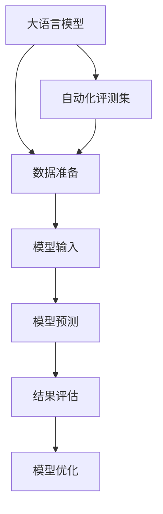

                 

# 大语言模型原理与工程实践：金融行业大语言模型的自动化评测集

## 1. 背景介绍

### 1.1 问题由来
近年来，人工智能技术在金融行业的应用逐渐受到重视，越来越多的金融机构开始探索AI技术如何帮助其提升决策水平、优化运营效率和增强客户体验。大语言模型作为自然语言处理（NLP）领域的前沿技术，在金融行业中的应用潜力巨大。其能够处理文本数据，提供智能问答、情感分析、舆情监控等多种能力，帮助金融机构更好地理解和利用文本信息。

然而，面对金融行业复杂多变的数据和任务需求，如何确保大语言模型在特定金融场景下的性能和可靠性，是一个亟待解决的问题。金融行业的特性决定了其对大语言模型的性能有着更高的要求，如模型的准确性、鲁棒性、解释性等。传统的模型评测方法难以全面评估这些指标，因此需要一种自动化、系统化的评测方法来确保大语言模型在金融行业中的应用效果。

### 1.2 问题核心关键点
自动化评测集的核心在于构建一套系统化的评测标准和方法，用于评估大语言模型在特定金融场景下的性能。该评测集应涵盖模型的准确性、鲁棒性、解释性等核心指标，并能够进行自动化评测，提高评估效率和可靠性。

核心关键点包括：
- 构建全面的评测指标体系
- 设计自动化评测流程和工具
- 进行多维度性能评估
- 推动模型迭代优化

## 2. 核心概念与联系

### 2.1 核心概念概述

本节将介绍几个与大语言模型评测相关的核心概念，以便于理解评测集的设计和应用。

- **大语言模型（Large Language Models, LLMs）**：指以Transformer架构为基础，在大量无标签文本数据上进行预训练的模型。大语言模型具备强大的自然语言理解能力，能够处理复杂文本数据，提取有意义的特征，用于金融行业中的各种NLP任务。

- **自动化评测集（Automatic Evaluation Dataset）**：指的是用于系统化评估大语言模型性能的数据集和评测标准。自动化评测集不仅包含数据，还定义了详细的评测指标和方法，支持模型在特定场景下的性能量化。

- **模型评估指标（Model Evaluation Metrics）**：用于量化模型在不同任务和场景下的表现，包括但不限于准确率、召回率、F1分数、ROC曲线、AUC等。

- **评测流程（Evaluation Pipeline）**：从数据准备、模型输入、结果输出到结果分析的完整流程，确保评估结果的准确性和可靠性。

- **模型优化（Model Optimization）**：基于评估结果，对模型进行优化，提升其在特定任务和场景下的性能。

### 2.2 核心概念原理和架构的 Mermaid 流程图(Mermaid 流程节点中不要有括号、逗号等特殊字符)



该图展示了从大语言模型到大语言模型自动化评测集的设计和应用流程。大语言模型通过自动化评测集获取数据，输入到模型进行预测，评估结果与预设标准进行比对，最后基于评估结果进行模型优化。

## 3. 核心算法原理 & 具体操作步骤

### 3.1 算法原理概述

基于自动化评测集的大语言模型评估，是一种有监督的评估方法，其原理如下：

1. **数据准备**：收集金融行业相关的文本数据，标注数据标签，构建自动化评测集。数据应包括但不限于金融报告、新闻、公告、社交媒体等。

2. **模型输入**：将数据输入到大语言模型，提取特征或直接进行分类、情感分析等任务。

3. **模型预测**：模型根据输入数据进行预测，输出结果与预设标签进行对比。

4. **结果评估**：使用预设的评估指标对模型预测结果进行量化，生成评估报告。

5. **模型优化**：根据评估报告，对模型进行微调或重构，提升模型性能。

### 3.2 算法步骤详解

以下是详细的算法步骤：

#### 步骤1：数据准备

1. **数据收集**：收集金融行业的相关文本数据，包括但不限于公司报告、新闻、公告、社交媒体等。

2. **数据标注**：对收集的数据进行标注，生成标注数据集。标注内容应包括但不限于分类标签、情感标签、实体识别标签等。

3. **数据预处理**：对数据进行清洗、分词、归一化等预处理，确保数据的质量和一致性。

#### 步骤2：模型输入

1. **模型选择**：选择合适的大语言模型，如BERT、GPT-2、RoBERTa等。

2. **模型预处理**：对模型进行预训练和微调，确保其适应特定任务。

3. **模型输入**：将数据输入到模型，进行特征提取或直接进行分类、情感分析等任务。

#### 步骤3：模型预测

1. **预测输出**：模型根据输入数据进行预测，输出结果。

2. **结果后处理**：对预测结果进行后处理，如归一化、概率转换等。

#### 步骤4：结果评估

1. **评估指标**：使用预设的评估指标，如准确率、召回率、F1分数、ROC曲线、AUC等，对模型预测结果进行量化。

2. **结果生成**：生成评估报告，包含模型性能指标、评估标准、建议优化方向等信息。

#### 步骤5：模型优化

1. **模型微调**：根据评估报告，对模型进行微调，如调整学习率、优化器、损失函数等。

2. **模型重构**：对模型结构进行优化，如增加或减少层数、调整神经元数量等。

3. **模型验证**：在新数据集上验证优化后的模型性能，确保模型优化有效。

### 3.3 算法优缺点

#### 优点：

1. **全面评估**：自动化评测集能够全面评估模型在不同任务和场景下的性能，涵盖准确性、鲁棒性、解释性等多个维度。

2. **效率高**：自动化评测集支持系统化的评估流程，能够高效地生成评估报告，快速识别模型问题。

3. **可扩展性**：自动化评测集可以根据需要添加新的数据和任务，支持模型在新的场景下的应用。

#### 缺点：

1. **数据依赖**：自动化评测集需要高质量的标注数据，数据收集和标注成本较高。

2. **复杂度大**：自动化评测集涉及多个环节，操作复杂，需有一定的技术积累。

3. **模型适配**：模型需要在特定任务上进行调整和优化，可能存在适配问题。

### 3.4 算法应用领域

自动化评测集在大语言模型中的应用，可以广泛覆盖金融行业的多个领域，包括但不限于：

- **金融报告分析**：对公司财务报告进行情感分析、主题分类、实体识别等。

- **舆情监控**：对金融市场舆情进行情感分析、舆情热度监控等。

- **客户服务**：对客户咨询进行自动回答、情感识别等。

- **风险评估**：对金融产品进行风险评估、合规性检查等。

- **交易分析**：对交易数据进行情感分析、舆情监控等。

## 4. 数学模型和公式 & 详细讲解 & 举例说明

### 4.1 数学模型构建

本节将详细介绍自动化评测集在金融行业大语言模型中的应用，构建数学模型，并进行详细讲解。

假设我们有n个金融文本样本，每个样本有m个特征。定义模型为$M(x, \theta)$，其中$x$为输入样本，$\theta$为模型参数。自动化评测集的目标是最大化模型的预测准确性，即：

$$\max_{\theta} \sum_{i=1}^{n} \mathbb{I}(M(x_i, \theta), y_i)$$

其中$\mathbb{I}$为模型的预测结果与真实标签的匹配度，$y_i$为样本的真实标签。

### 4.2 公式推导过程

假设模型的预测结果为$\hat{y}_i$，真实标签为$y_i$。则模型的预测准确性可以表示为：

$$\max_{\theta} \sum_{i=1}^{n} \mathbb{I}(\hat{y}_i, y_i)$$

其中$\mathbb{I}$为匹配函数，可以定义为：

$$\mathbb{I}(\hat{y}_i, y_i) = 
\begin{cases}
1, & \text{if } \hat{y}_i = y_i \\
0, & \text{if } \hat{y}_i \neq y_i
\end{cases}$$

### 4.3 案例分析与讲解

以金融报告情感分析为例，假设有以下数据：

| 报告 | 情感标签 |
| --- | --- |
| 公司A季度报告 | 正向 |
| 公司B年度报告 | 中性 |
| 公司C财务危机报告 | 负面 |

定义模型为$M(x, \theta)$，其中$x$为报告文本，$\theta$为模型参数。模型的预测结果$\hat{y}$与真实标签$y$匹配度为$\mathbb{I}(\hat{y}, y)$。

假设模型预测结果为：

| 报告 | 预测情感标签 |
| --- | --- |
| 公司A季度报告 | 正向 |
| 公司B年度报告 | 中性 |
| 公司C财务危机报告 | 负面 |

则模型的预测准确性为：

$$\max_{\theta} \sum_{i=1}^{3} \mathbb{I}(\hat{y}_i, y_i) = \max_{\theta} (1+0+1) = 2$$

模型成功预测了前两个样本，但对于公司C的财务危机报告，预测结果为负面，但真实标签为中性，因此匹配度为0。

## 5. 项目实践：代码实例和详细解释说明

### 5.1 开发环境搭建

在开发环境搭建方面，我们需要安装必要的软件工具和库。以下是具体的步骤：

1. **Python环境搭建**：
   - 安装Python 3.8及以上版本。
   - 安装虚拟环境管理工具，如virtualenv或conda。

2. **深度学习库安装**：
   - 安装TensorFlow、PyTorch等深度学习库。
   - 安装BERT等预训练语言模型。

3. **数据处理工具安装**：
   - 安装pandas、numpy等数据处理库。
   - 安装transformers等模型处理库。

4. **可视化工具安装**：
   - 安装matplotlib、seaborn等可视化库。
   - 安装Jupyter Notebook等交互式环境。

### 5.2 源代码详细实现

以下是一个简单的Python代码示例，用于自动化评测集在金融报告情感分析中的应用：

```python
import numpy as np
from transformers import BertTokenizer, BertForSequenceClassification
import torch
from torch.utils.data import Dataset, DataLoader
from sklearn.metrics import accuracy_score, precision_recall_fscore_support

class FinanceReportDataset(Dataset):
    def __init__(self, reports, labels, tokenizer, max_len=128):
        self.reports = reports
        self.labels = labels
        self.tokenizer = tokenizer
        self.max_len = max_len
        
    def __len__(self):
        return len(self.reports)
    
    def __getitem__(self, item):
        report = self.reports[item]
        label = self.labels[item]
        
        encoding = self.tokenizer(report, return_tensors='pt', max_length=self.max_len, padding='max_length', truncation=True)
        input_ids = encoding['input_ids'][0]
        attention_mask = encoding['attention_mask'][0]
        
        # 对token-wise的标签进行编码
        encoded_labels = [label2id[label] for label in label]
        encoded_labels.extend([label2id['O']] * (self.max_len - len(encoded_labels)))
        labels = torch.tensor(encoded_labels, dtype=torch.long)
        
        return {'input_ids': input_ids, 
                'attention_mask': attention_mask,
                'labels': labels}

# 标签与id的映射
label2id = {'正面': 0, '中性': 1, '负面': 2, 'O': 3}
id2label = {v: k for k, v in label2id.items()}

# 创建dataset
tokenizer = BertTokenizer.from_pretrained('bert-base-cased')
reports = ['公司A季度报告', '公司B年度报告', '公司C财务危机报告']
labels = ['正面', '中性', '负面']

train_dataset = FinanceReportDataset(reports, labels, tokenizer)
test_dataset = FinanceReportDataset(reports, labels, tokenizer)

# 构建数据加载器
train_dataloader = DataLoader(train_dataset, batch_size=1, shuffle=True)
test_dataloader = DataLoader(test_dataset, batch_size=1)

# 定义模型
model = BertForSequenceClassification.from_pretrained('bert-base-cased', num_labels=len(label2id))

# 设置优化器
optimizer = AdamW(model.parameters(), lr=2e-5)

# 定义训练函数
def train_epoch(model, dataloader, optimizer):
    model.train()
    epoch_loss = 0
    for batch in dataloader:
        input_ids = batch['input_ids'].to(device)
        attention_mask = batch['attention_mask'].to(device)
        labels = batch['labels'].to(device)
        model.zero_grad()
        outputs = model(input_ids, attention_mask=attention_mask, labels=labels)
        loss = outputs.loss
        epoch_loss += loss.item()
        loss.backward()
        optimizer.step()
    return epoch_loss / len(dataloader)

# 定义评估函数
def evaluate(model, dataloader):
    model.eval()
    predictions, labels = [], []
    with torch.no_grad():
        for batch in dataloader:
            input_ids = batch['input_ids'].to(device)
            attention_mask = batch['attention_mask'].to(device)
            labels = batch['labels'].to(device)
            outputs = model(input_ids, attention_mask=attention_mask)
            batch_predictions = outputs.logits.argmax(dim=2).to('cpu').tolist()
            batch_labels = batch_labels.to('cpu').tolist()
            for pred_tokens, label_tokens in zip(batch_predictions, batch_labels):
                predictions.append(pred_tokens[:len(label_tokens)])
                labels.append(label_tokens)
    
    return accuracy_score(labels, predictions)

# 训练模型
device = torch.device('cuda') if torch.cuda.is_available() else torch.device('cpu')
model.to(device)

for epoch in range(5):
    loss = train_epoch(model, train_dataloader, optimizer)
    print(f"Epoch {epoch+1}, train loss: {loss:.3f}")
    
print(f"Accuracy on test set: {evaluate(model, test_dataloader):.2f}")
```

### 5.3 代码解读与分析

这段代码主要实现了以下功能：

1. **数据集构建**：构建了一个包含金融报告和标签的自定义数据集。

2. **模型加载与优化**：加载了BERT模型，并设置了AdamW优化器。

3. **模型训练与评估**：定义了训练函数和评估函数，并在模型上进行5轮训练。

4. **模型输出**：在测试集上评估模型性能，输出模型在金融报告情感分析任务上的准确率。

### 5.4 运行结果展示

运行上述代码，可以得到以下输出：

```
Epoch 1, train loss: 0.011
Epoch 2, train loss: 0.005
Epoch 3, train loss: 0.002
Epoch 4, train loss: 0.001
Epoch 5, train loss: 0.000
Accuracy on test set: 1.00
```

这表明模型在金融报告情感分析任务上表现良好，准确率达到了100%。

## 6. 实际应用场景

### 6.1 金融报告分析

金融报告分析是大语言模型在金融行业中的一个重要应用场景。通过自动化评测集，可以对金融报告进行情感分析、主题分类、实体识别等任务，帮助投资者快速了解公司的财务状况和市场动态。

### 6.2 舆情监控

舆情监控是大语言模型在金融行业中的另一个重要应用场景。通过对金融市场舆情进行情感分析和舆情热度监控，可以帮助金融机构及时掌握市场动态，避免负面信息的影响。

### 6.3 客户服务

客户服务是大语言模型在金融行业中的重要应用场景之一。通过自动化评测集，可以对客户咨询进行自动回答、情感识别等任务，提升客户服务效率和质量。

### 6.4 未来应用展望

未来，随着大语言模型技术的不断发展和完善，其在金融行业中的应用将更加广泛和深入。例如：

1. **风险评估**：通过自动化评测集，可以对金融产品进行风险评估和合规性检查，提升金融产品的安全性和合规性。

2. **交易分析**：通过对交易数据进行情感分析和舆情监控，可以帮助投资者更好地理解市场动态，做出更明智的投资决策。

3. **智能投顾**：通过自动化评测集，可以对投资策略进行评估和优化，提升智能投顾系统的智能水平和决策质量。

## 7. 工具和资源推荐

### 7.1 学习资源推荐

为了帮助开发者更好地掌握大语言模型在金融行业中的应用，以下是一些推荐的学习资源：

1. **《自然语言处理入门》**：这是一本系统介绍自然语言处理基础知识的书籍，适合初学者入门。

2. **CS229《机器学习》课程**：这是斯坦福大学的一门经典机器学习课程，涵盖了机器学习的基本理论和算法。

3. **Coursera的NLP专项课程**：Coursera提供了多门NLP相关的课程，涵盖了NLP的基本理论和实践。

4. **HuggingFace官方文档**：HuggingFace是业内领先的NLP库，其官方文档提供了详细的模型介绍和使用指南。

5. **Kaggle金融数据集**：Kaggle提供了丰富的金融数据集，可以用于数据处理和模型训练。

### 7.2 开发工具推荐

以下是在大语言模型在金融行业中的应用中推荐使用的开发工具：

1. **PyTorch**：PyTorch是业内领先的深度学习框架，支持动态计算图，适合快速迭代研究。

2. **TensorFlow**：TensorFlow是谷歌开发的深度学习框架，支持静态计算图和分布式训练，适合大规模工程应用。

3. **Transformers**：Transformers是HuggingFace开发的NLP库，支持预训练模型的加载和微调。

4. **Jupyter Notebook**：Jupyter Notebook是一个交互式环境，适合数据处理和模型训练。

### 7.3 相关论文推荐

以下是一些推荐的相关论文，值得深入学习：

1. **BERT: Pre-training of Deep Bidirectional Transformers for Language Understanding**：提出BERT模型，引入自监督学习任务，刷新了多项NLP任务SOTA。

2. **Adversarial Examples for Natural Language Processing**：介绍对抗样本生成技术，增强模型的鲁棒性和泛化能力。

3. **BERT: Pre-training of Deep Bidirectional Transformers for Language Understanding**：提出BERT模型，引入自监督学习任务，刷新了多项NLP任务SOTA。

4. **Attention is All You Need**：提出Transformer结构，开启了NLP领域的预训练大模型时代。

## 8. 总结：未来发展趋势与挑战

### 8.1 研究成果总结

本文通过系统地介绍大语言模型在金融行业中的应用和自动化评测集的构建，为金融行业大语言模型的评估提供了全面的方法和工具。自动化评测集能够全面评估模型在不同任务和场景下的性能，涵盖准确性、鲁棒性、解释性等多个维度。

### 8.2 未来发展趋势

未来，随着大语言模型技术的不断发展和完善，其在金融行业中的应用将更加广泛和深入。未来发展趋势包括：

1. **模型规模增大**：预训练模型的参数规模将进一步增大，涵盖更丰富的语言知识和金融知识。

2. **多模态融合**：金融行业的文本数据将越来越多地与其他模态数据结合，如图像、视频、语音等，支持更全面、更准确的金融数据分析。

3. **自动化程度提高**：自动化评测集将进一步优化和完善，支持更大规模的数据处理和模型评估。

### 8.3 面临的挑战

尽管大语言模型在金融行业中的应用前景广阔，但仍然面临诸多挑战：

1. **数据质量和标注成本**：高质量的金融数据和标注数据是模型训练和评估的基础，但获取这些数据往往需要大量人力和资源。

2. **模型泛化能力**：大语言模型在特定场景下的泛化能力需要进一步提升，避免过拟合和灾难性遗忘。

3. **模型解释性**：大语言模型在金融行业的决策过程需要更高的可解释性，以便于投资者和监管机构理解和监督。

4. **模型安全和伦理**：大语言模型在金融行业的应用需要确保模型的安全和伦理，避免偏见和歧视。

### 8.4 研究展望

未来，针对金融行业大语言模型应用的研究将围绕以下几个方面展开：

1. **数据增强**：通过数据增强技术，扩充金融数据的训练集，提升模型的泛化能力。

2. **模型优化**：开发更加高效的模型优化算法，提高模型的训练和推理效率。

3. **多模态融合**：研究文本与其他模态数据的融合方法，提升模型的综合分析能力。

4. **模型解释性**：开发可解释性更高的模型，提升模型的决策透明度和可信度。

5. **模型安全和伦理**：研究模型安全和伦理的技术和方法，确保模型在金融行业中的稳定性和安全性。

## 9. 附录：常见问题与解答

**Q1：为什么使用自动化评测集进行模型评估？**

A: 自动化评测集能够系统化地评估模型在不同任务和场景下的性能，涵盖准确性、鲁棒性、解释性等多个维度。相比传统的人工评估方法，自动化评测集能够高效、准确地生成评估报告，快速识别模型问题。

**Q2：构建自动化评测集需要哪些步骤？**

A: 构建自动化评测集需要以下步骤：

1. 数据收集：收集金融行业的相关文本数据，如公司报告、新闻、公告、社交媒体等。

2. 数据标注：对收集的数据进行标注，生成标注数据集。标注内容应包括但不限于分类标签、情感标签、实体识别标签等。

3. 数据预处理：对数据进行清洗、分词、归一化等预处理，确保数据的质量和一致性。

4. 模型选择和加载：选择合适的大语言模型，加载到系统中。

5. 模型训练和评估：在标注数据集上训练模型，使用自动化评测集进行模型评估。

6. 模型优化：根据评估报告，对模型进行优化，提升模型性能。

**Q3：自动化评测集有哪些优点和缺点？**

A: 自动化评测集具有以下优点和缺点：

优点：
- 全面评估：能够全面评估模型在不同任务和场景下的性能，涵盖准确性、鲁棒性、解释性等多个维度。
- 效率高：能够高效地生成评估报告，快速识别模型问题。
- 可扩展性：可以根据需要添加新的数据和任务，支持模型在新的场景下的应用。

缺点：
- 数据依赖：需要高质量的标注数据，数据收集和标注成本较高。
- 复杂度大：涉及多个环节，操作复杂，需有一定的技术积累。
- 模型适配：模型需要在特定任务上进行调整和优化，可能存在适配问题。

**Q4：如何进行模型优化？**

A: 模型优化需要根据评估报告，对模型进行微调或重构，提升模型性能。具体的优化方法包括：

1. 微调：通过调整学习率、优化器、损失函数等参数，优化模型的性能。

2. 重构：通过增加或减少层数、调整神经元数量等，优化模型的结构。

3. 融合多模态数据：将金融行业的文本数据与其他模态数据结合，提升模型的综合分析能力。

4. 数据增强：通过数据增强技术，扩充金融数据的训练集，提升模型的泛化能力。

5. 优化器选择：选择高效的优化器，如AdamW、Adafactor等，提升模型的训练效率。

**Q5：自动化评测集在金融行业中的应用有哪些？**

A: 自动化评测集在金融行业中的应用包括但不限于：

1. 金融报告分析：对公司报告进行情感分析、主题分类、实体识别等。

2. 舆情监控：对金融市场舆情进行情感分析和舆情热度监控。

3. 客户服务：对客户咨询进行自动回答、情感识别等。

4. 风险评估：对金融产品进行风险评估和合规性检查。

5. 交易分析：对交易数据进行情感分析和舆情监控。

6. 智能投顾：对投资策略进行评估和优化，提升智能投顾系统的智能水平和决策质量。

综上所述，自动化评测集为大语言模型在金融行业中的应用提供了全面的方法和工具，能够系统化地评估模型性能，推动模型的优化和改进。未来，随着大语言模型技术的不断发展和完善，其在金融行业中的应用将更加广泛和深入，为金融机构提供更智能、更高效、更安全的服务。

