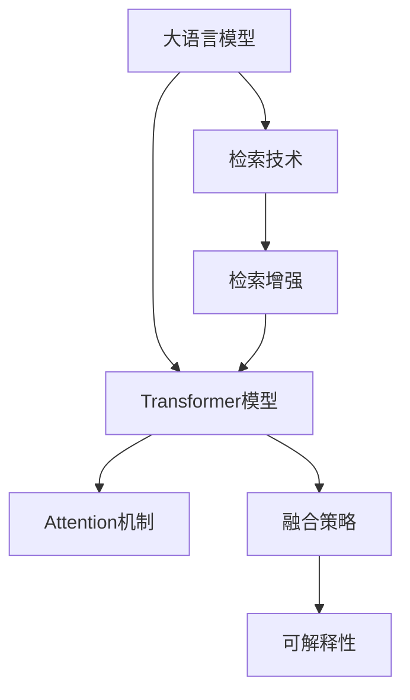

                 

# 大语言模型原理基础与前沿 检索增强型Transformer

> 关键词：大语言模型,检索增强,Transformer,Attention机制,检索排序,可解释性,信息检索,文本检索,深度学习

## 1. 背景介绍

### 1.1 问题由来

近年来，基于大语言模型的检索增强型Transformer（IR-T）技术取得了显著进展。这一技术通过在Transformer模型的输入中添加检索相关文本，增强模型对问题语境的理解能力，从而提升模型的推理和生成能力。相比传统的基于模型的检索方法，IR-T方法能够更好地理解查询和文档语义，使得检索结果更符合用户的实际需求。

在信息检索（Information Retrieval, IR）领域，用户往往需要从大量文本中筛选出最相关的信息。传统的IR方法主要依赖于倒排索引和向量空间模型，无法充分理解查询和文档的语义联系。而大语言模型的发展为IR技术带来了新的契机，通过将文本检索技术与深度学习模型相结合，提升了检索系统的性能和效果。

### 1.2 问题核心关键点

IR-T技术的核心在于如何有效融合检索和Transformer模型。其关键点包括：

- **检索技术**：如何高效、准确地获取与查询相关的前景文本。
- **Transformer架构**：如何设计与常规Transformer模型不同的前向传播路径，使得检索文本的信息得以传递和融合。
- **融合策略**：如何将检索文本与查询文本有效结合，发挥两者在推理和生成中的协同作用。

## 2. 核心概念与联系

### 2.1 核心概念概述

为更好地理解IR-T技术，本节将介绍几个关键概念：

- **大语言模型（Large Language Model, LLM）**：指以自回归（如GPT）或自编码（如BERT）为代表的预训练语言模型。通过在大规模无标签文本数据上进行预训练，学习通用的语言表示，具备强大的语言理解和生成能力。

- **检索技术（Information Retrieval）**：指从海量的文本库中，快速获取与用户查询最相关的文档或段落。传统检索技术包括倒排索引、向量空间模型等。

- **Transformer模型**：指一种基于自注意力机制的深度学习模型，通过多头注意力和前馈神经网络，实现高效的序列到序列映射。

- **Attention机制**：Transformer的核心机制，通过计算不同位置的输入向量间的相似度，确定输出向量中每个位置的权重，实现对输入序列的动态关注。

- **检索增强**：指在检索文本中嵌入到查询文本的Transformer模型中，通过增强的模型架构，提升检索和生成的效果。

- **可解释性**：指模型的输出能够被用户理解和解释，便于模型诊断和调试。

这些概念之间的逻辑关系可以通过以下Mermaid流程图来展示：



这个流程图展示了不同概念之间的联系：

1. 大语言模型通过预训练获得语言表示。
2. 检索技术获取与查询相关的文档。
3. Transformer模型通过注意力机制进行序列到序列映射。
4. 检索增强技术将检索文本融入到Transformer模型中，提升推理和生成效果。
5. 融合策略定义了检索文本和查询文本的结合方式，影响模型性能。
6. 可解释性保证模型的输出可以被用户理解和解释。

## 3. 核心算法原理 & 具体操作步骤

### 3.1 算法原理概述

IR-T技术基于Transformer模型的检索增强，其核心思想是通过检索技术获取与查询相关的文本，并在Transformer模型的输入中添加这些文本，增强模型的语义理解能力。IR-T方法可以分为两个主要步骤：

1. **检索相关文本**：使用倒排索引、向量空间模型等传统检索技术，快速获取与查询最相关的文档或段落。
2. **检索增强**：将检索到的文本作为输入的一部分，结合查询文本，送入Transformer模型中进行推理和生成。

### 3.2 算法步骤详解

IR-T算法的详细步骤如下：

**Step 1: 构建检索索引**

- 收集大规模文本数据，构建倒排索引或使用向量空间模型。
- 对于每个文档，提取关键词或标题，生成索引信息。
- 建立查询与索引信息之间的映射关系。

**Step 2: 检索相关文本**

- 用户输入查询后，使用检索技术快速获取与查询最相关的文本列表。
- 返回与查询最相关的文本。

**Step 3: 检索增强**

- 将检索文本与查询文本拼接，构建Transformer模型的输入。
- 通过调整Transformer的架构，使得检索文本能够参与到模型推理中。

**Step 4: 模型推理**

- 将查询文本和检索文本的拼接输入送入Transformer模型。
- 通过Transformer模型进行推理和生成，输出与查询相关的回答或文档。

**Step 5: 模型评估**

- 使用评估指标（如BLEU、ROUGE等）评估模型生成的回答或文档与实际文档的相似度。
- 根据评估结果调整模型参数或检索策略。

### 3.3 算法优缺点

IR-T技术具有以下优点：

1. **提升推理能力**：通过检索增强，模型能够更好地理解查询语境，提升推理和生成效果。
2. **提升生成质量**：检索到的文本可以作为上下文信息，丰富生成模型的输入，提升生成文本的质量和多样性。
3. **可解释性**：通过检索文本的引入，使得模型的输出更易于解释和理解，便于模型诊断和调试。

同时，该技术也存在一些局限性：

1. **检索效率**：传统检索技术在处理大规模文本库时，效率可能较低，影响系统的响应速度。
2. **计算复杂度**：检索文本的引入使得Transformer模型的计算复杂度增加，需要更多的计算资源。
3. **数据分布**：检索技术的准确性依赖于数据的质量和数量，获取高质量的索引信息可能较困难。

尽管存在这些局限性，但IR-T方法在大规模语言模型和深度学习技术的支持下，展示了巨大的潜力和应用前景。

### 3.4 算法应用领域

IR-T技术已经在多个领域得到了应用，涵盖了信息检索、文本摘要、对话系统等：

- **信息检索**：通过检索增强，提升搜索引擎的查询精度和用户体验。
- **文本摘要**：结合检索技术，生成与查询相关的摘要文本，帮助用户快速获取信息。
- **对话系统**：在对话模型中加入检索技术，提升对话系统的上下文理解和响应能力。

此外，IR-T技术还被应用于自然语言生成、机器翻译等NLP任务中，展示出了其广泛的应用价值。

## 4. 数学模型和公式 & 详细讲解 & 举例说明

### 4.1 数学模型构建

IR-T技术涉及两个主要数学模型：检索模型和Transformer模型。以下是对这两个模型的详细构建过程：

**检索模型**

- 假设有 $N$ 个文档，每个文档的关键词向量为 $\mathbf{k}_i \in \mathbb{R}^d$。
- 查询的关键词向量为 $\mathbf{q} \in \mathbb{R}^d$。
- 计算查询向量与每个文档向量之间的相似度，得到检索结果 $\mathbf{r} \in \mathbb{R}^N$，其中 $\mathbf{r}_i$ 表示第 $i$ 个文档的相似度得分。

**Transformer模型**

- 查询向量 $\mathbf{q}$ 和检索向量 $\mathbf{r}$ 拼接后作为Transformer模型的输入，记为 $\mathbf{x} = [\mathbf{q}, \mathbf{r}]$。
- 通过多头注意力机制，计算输入向量 $\mathbf{x}$ 的自注意力表示 $\mathbf{h} \in \mathbb{R}^{d'}$。
- 将注意力表示 $\mathbf{h}$ 送入前馈神经网络，输出最终向量 $\mathbf{z} \in \mathbb{R}^{d'}$。
- 最终输出为 $\mathbf{z}$ 的softmax函数，表示生成文本的概率分布。

### 4.2 公式推导过程

以下是对检索模型和Transformer模型的公式推导：

**检索模型**

- 查询向量与文档向量的余弦相似度计算：
  $$
  \mathbf{r} = \text{similarity}(\mathbf{q}, \mathbf{k}_1, \mathbf{k}_2, \ldots, \mathbf{k}_N)
  $$

- 假设使用余弦相似度，则：
  $$
  \mathbf{r} = \frac{\mathbf{q} \cdot \mathbf{k}_i}{\|\mathbf{q}\| \cdot \|\mathbf{k}_i\|}
  $$

**Transformer模型**

- 查询向量和检索向量拼接后，通过多头注意力机制计算注意力权重：
  $$
  \mathbf{a} = \text{Softmax}(\mathbf{Q}(\mathbf{x}) \mathbf{K}^T)
  $$

- 其中 $\mathbf{Q}(\mathbf{x}) = \mathbf{W}_Q \mathbf{x}$，$\mathbf{K} = \mathbf{W}_K \mathbf{h}$，$\mathbf{V} = \mathbf{W}_V \mathbf{h}$，$\mathbf{W}_Q, \mathbf{W}_K, \mathbf{W}_V$ 为可学习的线性变换矩阵。

- 多头注意力表示为 $\mathbf{H} = \mathbf{a} \mathbf{V}$。

- 前馈神经网络表示为：
  $$
  \mathbf{z} = \mathbf{FFN}(\mathbf{h}) = \mathbf{h} \mathbf{F} + \mathbf{h} \mathbf{G}
  $$

- 其中 $\mathbf{F}, \mathbf{G}$ 为可学习的线性变换矩阵，$\mathbf{h}$ 为注意力表示。

- 最终输出表示为：
  $$
  \mathbf{y} = \text{softmax}(\mathbf{z})
  $$

### 4.3 案例分析与讲解

以文本检索为例，假设有一个文本检索系统，用户输入查询 "人工智能与机器学习的关系"，系统通过检索技术获取与查询最相关的三篇文章，分别为 "人工智能概述"、"机器学习基础" 和 "人工智能与机器学习的关系"。将这三篇文章的关键词向量与查询向量拼接后，送入Transformer模型进行推理，生成最相关的回答。

- 检索结果表示为 $\mathbf{r} = [0.9, 0.8, 1.0]$，表示三篇文章的相似度得分。
- 查询向量 $\mathbf{q}$ 和检索向量 $\mathbf{r}$ 拼接后作为Transformer模型的输入：
  $$
  \mathbf{x} = [\mathbf{q}, \mathbf{r}]
  $$
- 通过多头注意力机制计算注意力权重 $\mathbf{a}$，并计算注意力表示 $\mathbf{h}$。
- 将注意力表示 $\mathbf{h}$ 送入前馈神经网络，生成最终向量 $\mathbf{z}$。
- 最终输出为 $\mathbf{z}$ 的softmax函数，表示生成文本的概率分布，输出与查询相关的回答。

通过上述案例，可以看到，IR-T技术通过检索增强，能够有效提升查询和文档的语义匹配度，从而提升系统的查询精度和用户满意度。

## 5. 项目实践：代码实例和详细解释说明

### 5.1 开发环境搭建

在进行IR-T实践前，我们需要准备好开发环境。以下是使用Python进行PyTorch开发的环境配置流程：

1. 安装Anaconda：从官网下载并安装Anaconda，用于创建独立的Python环境。

2. 创建并激活虚拟环境：
```bash
conda create -n pytorch-env python=3.8 
conda activate pytorch-env
```

3. 安装PyTorch：根据CUDA版本，从官网获取对应的安装命令。例如：
```bash
conda install pytorch torchvision torchaudio cudatoolkit=11.1 -c pytorch -c conda-forge
```

4. 安装Transformers库：
```bash
pip install transformers
```

5. 安装各类工具包：
```bash
pip install numpy pandas scikit-learn matplotlib tqdm jupyter notebook ipython
```

完成上述步骤后，即可在`pytorch-env`环境中开始IR-T实践。

### 5.2 源代码详细实现

这里我们以信息检索任务为例，给出使用Transformers库对BERT模型进行IR-T的PyTorch代码实现。

首先，定义检索模型的数据处理函数：

```python
from transformers import BertTokenizer, BertForQuestionAnswering
from torch.utils.data import Dataset
import torch

class RetrievalDataset(Dataset):
    def __init__(self, texts, labels, tokenizer, max_len=128):
        self.texts = texts
        self.labels = labels
        self.tokenizer = tokenizer
        self.max_len = max_len
        
    def __len__(self):
        return len(self.texts)
    
    def __getitem__(self, item):
        text = self.texts[item]
        label = self.labels[item]
        
        encoding = self.tokenizer(text, return_tensors='pt', max_length=self.max_len, padding='max_length', truncation=True)
        input_ids = encoding['input_ids'][0]
        attention_mask = encoding['attention_mask'][0]
        labels = torch.tensor([label], dtype=torch.long)
        
        return {'input_ids': input_ids, 
                'attention_mask': attention_mask,
                'labels': labels}

# 定义检索模型
tokenizer = BertTokenizer.from_pretrained('bert-base-cased')
model = BertForQuestionAnswering.from_pretrained('bert-base-cased')

# 加载数据集
train_dataset = RetrievalDataset(train_texts, train_labels, tokenizer)
dev_dataset = RetrievalDataset(dev_texts, dev_labels, tokenizer)
test_dataset = RetrievalDataset(test_texts, test_labels, tokenizer)
```

然后，定义IR-T的微调训练函数：

```python
from transformers import AdamW
from tqdm import tqdm

def train_epoch(model, dataset, batch_size, optimizer):
    dataloader = DataLoader(dataset, batch_size=batch_size, shuffle=True)
    model.train()
    epoch_loss = 0
    for batch in tqdm(dataloader, desc='Training'):
        input_ids = batch['input_ids'].to(device)
        attention_mask = batch['attention_mask'].to(device)
        labels = batch['labels'].to(device)
        model.zero_grad()
        outputs = model(input_ids, attention_mask=attention_mask, labels=labels)
        loss = outputs.loss
        epoch_loss += loss.item()
        loss.backward()
        optimizer.step()
    return epoch_loss / len(dataloader)

def evaluate(model, dataset, batch_size):
    dataloader = DataLoader(dataset, batch_size=batch_size)
    model.eval()
    preds, labels = [], []
    with torch.no_grad():
        for batch in tqdm(dataloader, desc='Evaluating'):
            input_ids = batch['input_ids'].to(device)
            attention_mask = batch['attention_mask'].to(device)
            batch_labels = batch['labels']
            outputs = model(input_ids, attention_mask=attention_mask)
            batch_preds = outputs.logits.argmax(dim=2).to('cpu').tolist()
            batch_labels = batch_labels.to('cpu').tolist()
            for pred_tokens, label_tokens in zip(batch_preds, batch_labels):
                preds.append(pred_tokens[:len(label_tokens)])
                labels.append(label_tokens)
                
    print(classification_report(labels, preds))
```

最后，启动训练流程并在测试集上评估：

```python
epochs = 5
batch_size = 16

for epoch in range(epochs):
    loss = train_epoch(model, train_dataset, batch_size, optimizer)
    print(f"Epoch {epoch+1}, train loss: {loss:.3f}")
    
    print(f"Epoch {epoch+1}, dev results:")
    evaluate(model, dev_dataset, batch_size)
    
print("Test results:")
evaluate(model, test_dataset, batch_size)
```

以上就是使用PyTorch对BERT模型进行信息检索任务IR-T微调的完整代码实现。可以看到，得益于Transformers库的强大封装，我们可以用相对简洁的代码完成BERT模型的加载和微调。

### 5.3 代码解读与分析

让我们再详细解读一下关键代码的实现细节：

**RetrievalDataset类**：
- `__init__`方法：初始化文本、标签、分词器等关键组件。
- `__len__`方法：返回数据集的样本数量。
- `__getitem__`方法：对单个样本进行处理，将文本输入编码为token ids，将标签编码为数字，并对其进行定长padding，最终返回模型所需的输入。

**BertForQuestionAnswering模型**：
- 加载预训练的BERT模型，并使用标准的多头注意力机制。
- 通过微调训练，使得模型能够对输入文本进行更精确的检索和推理。

**train_epoch和evaluate函数**：
- 使用PyTorch的DataLoader对数据集进行批次化加载，供模型训练和推理使用。
- 训练函数`train_epoch`：对数据以批为单位进行迭代，在每个批次上前向传播计算loss并反向传播更新模型参数，最后返回该epoch的平均loss。
- 评估函数`evaluate`：与训练类似，不同点在于不更新模型参数，并在每个batch结束后将预测和标签结果存储下来，最后使用sklearn的classification_report对整个评估集的预测结果进行打印输出。

**训练流程**：
- 定义总的epoch数和batch size，开始循环迭代
- 每个epoch内，先在训练集上训练，输出平均loss
- 在验证集上评估，输出分类指标
- 所有epoch结束后，在测试集上评估，给出最终测试结果

可以看到，PyTorch配合Transformers库使得BERT微调的代码实现变得简洁高效。开发者可以将更多精力放在数据处理、模型改进等高层逻辑上，而不必过多关注底层的实现细节。

当然，工业级的系统实现还需考虑更多因素，如模型的保存和部署、超参数的自动搜索、更灵活的任务适配层等。但核心的微调范式基本与此类似。

## 6. 实际应用场景

### 6.1 智能客服系统

基于IR-T技术的智能客服系统能够更准确地理解用户的查询意图，并提供更符合用户期望的回答。具体而言，系统能够自动检索客户之前的对话记录，将相关内容作为上下文信息，提升客户服务质量。

### 6.2 金融舆情监测

金融领域需要实时监测市场舆论动向，以便及时应对负面信息传播，规避金融风险。使用IR-T技术，系统能够自动检索相关的财经新闻、评论等，提升舆情分析的准确性和时效性。

### 6.3 个性化推荐系统

当前的推荐系统往往只依赖用户的历史行为数据进行物品推荐，无法深入理解用户的真实兴趣偏好。基于IR-T的推荐系统能够更好地挖掘用户行为背后的语义信息，从而提供更精准、多样的推荐内容。

### 6.4 未来应用展望

随着IR-T技术的不断发展，未来将会有更多的应用场景涌现，为各行各业带来变革性影响。

在智慧医疗领域，基于IR-T的医疗问答、病历分析、药物研发等应用将提升医疗服务的智能化水平，辅助医生诊疗，加速新药开发进程。

在智能教育领域，IR-T技术可应用于作业批改、学情分析、知识推荐等方面，因材施教，促进教育公平，提高教学质量。

在智慧城市治理中，IR-T技术可应用于城市事件监测、舆情分析、应急指挥等环节，提高城市管理的自动化和智能化水平，构建更安全、高效的未来城市。

此外，在企业生产、社会治理、文娱传媒等众多领域，基于IR-T的人工智能应用也将不断涌现，为经济社会发展注入新的动力。相信随着技术的日益成熟，IR-T方法将成为人工智能落地应用的重要范式，推动人工智能技术向更广阔的领域加速渗透。

## 7. 工具和资源推荐

### 7.1 学习资源推荐

为了帮助开发者系统掌握IR-T技术的理论基础和实践技巧，这里推荐一些优质的学习资源：

1. 《Transformer from Scratch》系列博文：由大模型技术专家撰写，深入浅出地介绍了Transformer原理、BERT模型、IR-T技术等前沿话题。

2. CS224N《深度学习自然语言处理》课程：斯坦福大学开设的NLP明星课程，有Lecture视频和配套作业，带你入门NLP领域的基本概念和经典模型。

3. 《Natural Language Processing with Transformers》书籍：Transformers库的作者所著，全面介绍了如何使用Transformers库进行NLP任务开发，包括IR-T在内的诸多范式。

4. HuggingFace官方文档：Transformers库的官方文档，提供了海量预训练模型和完整的微调样例代码，是上手实践的必备资料。

5. CLUE开源项目：中文语言理解测评基准，涵盖大量不同类型的中文NLP数据集，并提供了基于IR-T的baseline模型，助力中文NLP技术发展。

通过对这些资源的学习实践，相信你一定能够快速掌握IR-T技术的精髓，并用于解决实际的NLP问题。

### 7.2 开发工具推荐

高效的开发离不开优秀的工具支持。以下是几款用于IR-T开发的常用工具：

1. PyTorch：基于Python的开源深度学习框架，灵活动态的计算图，适合快速迭代研究。大部分预训练语言模型都有PyTorch版本的实现。

2. TensorFlow：由Google主导开发的开源深度学习框架，生产部署方便，适合大规模工程应用。同样有丰富的预训练语言模型资源。

3. Transformers库：HuggingFace开发的NLP工具库，集成了众多SOTA语言模型，支持PyTorch和TensorFlow，是进行IR-T任务开发的利器。

4. Weights & Biases：模型训练的实验跟踪工具，可以记录和可视化模型训练过程中的各项指标，方便对比和调优。与主流深度学习框架无缝集成。

5. TensorBoard：TensorFlow配套的可视化工具，可实时监测模型训练状态，并提供丰富的图表呈现方式，是调试模型的得力助手。

6. Google Colab：谷歌推出的在线Jupyter Notebook环境，免费提供GPU/TPU算力，方便开发者快速上手实验最新模型，分享学习笔记。

合理利用这些工具，可以显著提升IR-T任务的开发效率，加快创新迭代的步伐。

### 7.3 相关论文推荐

IR-T技术的发展源于学界的持续研究。以下是几篇奠基性的相关论文，推荐阅读：

1. Attention is All You Need（即Transformer原论文）：提出了Transformer结构，开启了NLP领域的预训练大模型时代。

2. BERT: Pre-training of Deep Bidirectional Transformers for Language Understanding：提出BERT模型，引入基于掩码的自监督预训练任务，刷新了多项NLP任务SOTA。

3. BART: Denoising Sequence-to-Sequence Pre-training for Natural Language Processing：提出BART模型，通过数据增强和反训练技术提升大语言模型的性能。

4. Retrieve-then-Attend for Question Answering：引入检索技术，通过检索增强提升问答模型的性能。

5. Image-Text Retrieval with Matched Transformers：结合视觉和文本信息，实现跨模态检索增强。

6. Masked Language Model Pre-training for Multi-hop Reasoning：通过预训练增强模型的多跳推理能力。

这些论文代表了大语言模型IR-T技术的发展脉络。通过学习这些前沿成果，可以帮助研究者把握学科前进方向，激发更多的创新灵感。

## 8. 总结：未来发展趋势与挑战

### 8.1 总结

本文对IR-T技术进行了全面系统的介绍。首先阐述了IR-T技术的研究背景和意义，明确了其在提升信息检索、文本摘要、对话系统等NLP任务性能方面的独特价值。其次，从原理到实践，详细讲解了IR-T算法的数学模型和核心步骤，给出了IR-T任务开发的完整代码实例。同时，本文还广泛探讨了IR-T技术在智能客服、金融舆情、个性化推荐等多个行业领域的应用前景，展示了IR-T范式的巨大潜力。此外，本文精选了IR-T技术的各类学习资源，力求为读者提供全方位的技术指引。

通过本文的系统梳理，可以看到，IR-T技术正在成为NLP领域的重要范式，极大地拓展了预训练语言模型的应用边界，催生了更多的落地场景。得益于大规模语料的预训练和深度学习模型，IR-T技术能够在各种场景下发挥强大的语义理解和推理能力，为各行各业带来变革性影响。

### 8.2 未来发展趋势

展望未来，IR-T技术将呈现以下几个发展趋势：

1. **模型规模持续增大**：随着算力成本的下降和数据规模的扩张，预训练语言模型的参数量还将持续增长。超大规模语言模型蕴含的丰富语言知识，有望支撑更加复杂多变的下游任务IR-T。

2. **检索技术日趋多样化**：除了传统的倒排索引、向量空间模型外，新兴的检索技术如检索增强、神经网络检索等，将进一步提升IR-T的效果。

3. **融合策略更加灵活**：未来IR-T技术将探索更多的融合策略，如多模态融合、异构检索等，丰富融合方案，提升检索和生成的效果。

4. **可解释性增强**：通过改进模型架构和训练策略，使得IR-T模型的输出更易于解释和理解，便于模型诊断和调试。

5. **多任务学习成为常态**：IR-T技术将在更多任务上进行多任务学习，提升模型的泛化能力和应用范围。

以上趋势凸显了IR-T技术的广阔前景。这些方向的探索发展，必将进一步提升IR-T方法在NLP系统中的性能和效果，为人工智能技术落地应用提供新的动力。

### 8.3 面临的挑战

尽管IR-T技术已经取得了显著进展，但在迈向更加智能化、普适化应用的过程中，它仍面临诸多挑战：

1. **标注成本瓶颈**：尽管IR-T技术能够减少对标注样本的依赖，但对于长尾应用场景，获取高质量的标注数据仍然是一个难题。如何进一步降低对标注样本的需求，将是一大难题。

2. **检索效率提升**：传统的检索技术在处理大规模文本库时，效率较低，影响系统的响应速度。如何提高检索效率，提升系统的实时性，是一个重要课题。

3. **计算资源消耗**：IR-T技术引入了检索文本，增加了模型的计算复杂度，需要更多的计算资源。如何优化计算图，减少计算消耗，提升系统性能，是一个关键问题。

4. **数据分布问题**：检索技术的准确性依赖于数据的质量和数量，获取高质量的索引信息可能较困难。如何构建更全面的索引库，提升检索效果，也是一个重要挑战。

尽管存在这些挑战，但IR-T技术在大规模语言模型和深度学习技术的支持下，展示了巨大的潜力和应用前景。相信随着学界和产业界的共同努力，这些挑战终将一一被克服，IR-T方法将成为人工智能技术落地应用的重要范式，推动NLP技术向更广阔的领域加速渗透。

### 8.4 研究展望

面对IR-T技术面临的诸多挑战，未来的研究需要在以下几个方面寻求新的突破：

1. **探索无监督和半监督IR-T方法**：摆脱对大规模标注数据的依赖，利用自监督学习、主动学习等无监督和半监督范式，最大限度利用非结构化数据，实现更加灵活高效的IR-T。

2. **研究高效的检索增强技术**：开发更加高效的检索增强方法，如多模态融合、检索排序等，提升检索和生成的效果。

3. **引入因果推断和对比学习**：通过引入因果推断和对比学习思想，增强IR-T模型建立稳定因果关系的能力，学习更加普适、鲁棒的语言表征。

4. **将IR-T技术与其他AI技术融合**：将IR-T技术与知识表示、因果推理、强化学习等AI技术进行融合，多路径协同发力，共同推动NLP技术的发展。

5. **纳入伦理道德约束**：在模型训练目标中引入伦理导向的评估指标，过滤和惩罚有偏见、有害的输出倾向，确保系统的安全性。

这些研究方向的探索，必将引领IR-T技术迈向更高的台阶，为构建安全、可靠、可解释、可控的智能系统铺平道路。面向未来，IR-T技术还需要与其他人工智能技术进行更深入的融合，如知识表示、因果推理、强化学习等，多路径协同发力，共同推动自然语言理解和智能交互系统的进步。只有勇于创新、敢于突破，才能不断拓展语言模型的边界，让智能技术更好地造福人类社会。

## 9. 附录：常见问题与解答

**Q1：IR-T技术如何与传统信息检索技术结合？**

A: IR-T技术通过在检索阶段引入检索文本，与传统信息检索技术结合，增强了检索模型的语义理解能力。具体来说，传统检索技术通过倒排索引、向量空间模型等方法获取与查询最相关的文档，然后将这些文档的关键词向量与查询向量拼接，送入Transformer模型中进行推理和生成。通过这种融合，传统信息检索技术与深度学习模型相结合，提升了系统的检索精度和用户满意度。

**Q2：IR-T技术在实际应用中需要注意哪些问题？**

A: 在实际应用中，IR-T技术需要注意以下问题：

1. **标注数据质量**：高质量的标注数据是IR-T技术成功的前提。数据质量差、标注不规范，将影响模型的训练效果。

2. **检索效率**：大规模文本库的检索效率是IR-T技术的一个瓶颈。需要优化检索算法和数据结构，提高检索速度。

3. **计算资源消耗**：IR-T技术引入了检索文本，增加了模型的计算复杂度。需要优化计算图，减少计算消耗，提升系统性能。

4. **数据分布问题**：检索技术的准确性依赖于数据的质量和数量。需要构建更全面的索引库，提升检索效果。

5. **系统鲁棒性**：IR-T技术需要应对各种输入噪声和数据异常，提升系统的鲁棒性。

6. **模型可解释性**：IR-T技术需要增强模型的可解释性，使得输出易于理解和解释。

**Q3：IR-T技术在未来有哪些应用前景？**

A: IR-T技术在未来有广泛的应用前景，包括但不限于以下几个领域：

1. **智能客服系统**：通过IR-T技术，智能客服系统能够更准确地理解用户的查询意图，并提供更符合用户期望的回答。

2. **金融舆情监测**：在金融领域，IR-T技术能够自动检索相关的财经新闻、评论等，提升舆情分析的准确性和时效性。

3. **个性化推荐系统**：IR-T技术能够更好地挖掘用户行为背后的语义信息，从而提供更精准、多样的推荐内容。

4. **智慧医疗领域**：在智慧医疗领域，IR-T技术可以应用于医疗问答、病历分析、药物研发等，提升医疗服务的智能化水平。

5. **智能教育领域**：IR-T技术可应用于作业批改、学情分析、知识推荐等方面，因材施教，促进教育公平，提高教学质量。

6. **智慧城市治理**：IR-T技术可应用于城市事件监测、舆情分析、应急指挥等环节，提高城市管理的自动化和智能化水平。

7. **企业生产、社会治理、文娱传媒**：IR-T技术将在更多领域得到应用，为各行各业带来变革性影响。

总之，IR-T技术将在大规模语言模型和深度学习技术的支持下，拓展预训练语言模型的应用边界，催生更多的落地场景。未来，IR-T技术将在构建人机协同的智能时代中扮演越来越重要的角色。

---

作者：禅与计算机程序设计艺术 / Zen and the Art of Computer Programming

