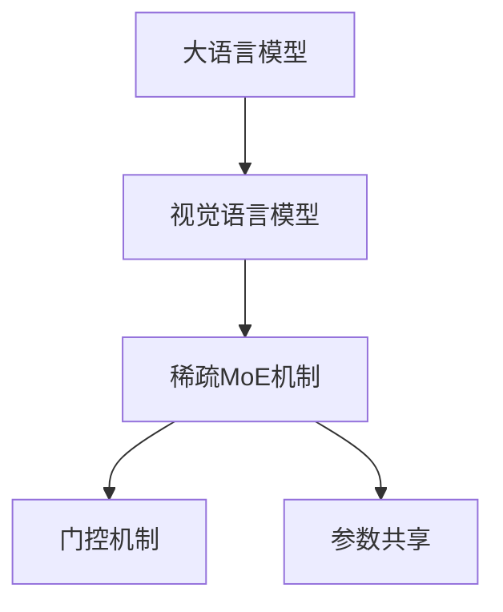

                 

# 大语言模型原理基础与前沿 通过稀疏MoE扩展视觉语言模型

## 1. 背景介绍

### 1.1 问题由来
大语言模型（Large Language Models, LLMs）是当前自然语言处理（NLP）领域最为流行的模型之一。这些模型通过在海量无标签文本数据上进行自监督预训练，学习到了丰富的语言知识，能够对自然语言进行理解和生成。其中，Transformer和BERT等模型成为了NLP领域的主流。

然而，大语言模型在处理视觉信息时存在一定的局限性。传统的自然语言处理模型无法直接处理图像数据，需要依赖视觉编码器（如ResNet）将图像转换为高维向量表示，然后与语言信息进行交互。这种模式存在明显的限制，如计算成本高、复杂度大等问题。

近年来，视觉语言模型（Visual Language Models, VLMs）成为了研究热点。这类模型能够直接处理图像和文本的双模态信息，显著提升了模型的性能和应用范围。但是，当前的VLMs模型存在参数量大、计算成本高、难以在大规模数据集上进行微调等问题。

为了解决这些问题，稀疏多模态专家（MoE, Multi-modal Expert）机制成为了一种新的探索方向。MoE机制能够将不同模态的信息进行多路并行处理，然后通过门控机制选择最终输出的子集，从而实现参数共享和资源优化。

本文旨在介绍大语言模型的基本原理，并探索稀疏MoE机制在视觉语言模型中的应用，以期为VLMs的发展提供新的思路。

### 1.2 问题核心关键点
稀疏MoE机制的核心在于通过多路并行处理不同模态的信息，并通过门控机制选择最终的输出。该机制的优点包括：
- 参数共享：不同模态的信息可以在多个专家子模型中进行独立处理，从而实现参数共享，减少总参数量。
- 资源优化：通过门控机制选择输出的子集，避免不必要的计算，实现资源优化。
- 多模态融合：不同模态的信息可以并行处理，使得模型能够更好地处理复杂的多模态任务。

本文将从原理和应用两方面，详细探讨稀疏MoE机制在视觉语言模型中的应用。

## 2. 核心概念与联系

### 2.1 核心概念概述

为更好地理解稀疏MoE机制在大语言模型中的应用，本节将介绍几个密切相关的核心概念：

- 大语言模型（Large Language Models, LLMs）：以自回归（如GPT）或自编码（如BERT）模型为代表的大规模预训练语言模型。通过在大规模无标签文本数据上进行预训练，学习通用的语言表示，具备强大的语言理解和生成能力。

- 视觉语言模型（Visual Language Models, VLMs）：能够直接处理图像和文本的双模态信息的模型。通过在图像和文本信息之间建立映射关系，实现多模态信息的联合处理。

- 稀疏多模态专家（MoE）机制：通过多路并行处理不同模态的信息，并通过门控机制选择最终输出的子集，从而实现参数共享和资源优化。

- 门控机制（Gating Mechanism）：用于选择最终输出的子集，常见的方法包括softmax、注意力机制等。

- 参数共享（Parameter Sharing）：不同模态的信息可以在多个专家子模型中进行独立处理，从而实现参数共享，减少总参数量。

这些核心概念之间的逻辑关系可以通过以下Mermaid流程图来展示：



这个流程图展示了大语言模型、视觉语言模型、稀疏MoE机制和门控机制之间的逻辑关系：

1. 大语言模型通过预训练获得基础能力。
2. 视觉语言模型将大语言模型应用于双模态数据的联合处理。
3. 稀疏MoE机制在视觉语言模型中实现多路并行处理和参数共享。
4. 门控机制选择最终输出的子集。

这些概念共同构成了视觉语言模型的基础架构，使得模型能够更好地处理复杂的多模态任务。

## 3. 核心算法原理 & 具体操作步骤
### 3.1 算法原理概述

稀疏MoE机制在视觉语言模型中的应用，本质上是一个多路并行处理和门控选择的过程。其核心思想是：将输入的双模态信息（图像和文本）分别输入到多个专家子模型中进行独立处理，并通过门控机制选择最终的输出子集。

形式化地，假设输入的图像为 $x$，文本为 $t$，视觉语言模型为 $M$，稀疏MoE机制的专家数量为 $K$。则视觉语言模型的输出 $y$ 可以表示为：

$$
y = \sum_{k=1}^K w_k f_k(x, t)
$$

其中 $w_k$ 表示第 $k$ 个专家子模型的权重，$f_k(x, t)$ 表示该子模型的输出。权重 $w_k$ 的计算可以通过一个全连接层或注意力机制实现，具体实现方式可以参考Attention机制。

### 3.2 算法步骤详解

稀疏MoE机制在视觉语言模型中的实现一般包括以下几个关键步骤：

**Step 1: 准备数据集**
- 准备输入的双模态数据集 $D=\{(x_i, t_i)\}_{i=1}^N$，其中 $x_i$ 表示图像，$t_i$ 表示文本。
- 将文本信息 $t_i$ 转换为向量表示，供语言模型使用。

**Step 2: 添加稀疏MoE层**
- 在视觉语言模型的顶层添加一个稀疏MoE层，该层包含 $K$ 个专家子模型。每个子模型接收图像 $x$ 和文本 $t$ 作为输入，并独立输出一个中间表示 $f_k(x, t)$。

**Step 3: 设计门控机制**
- 设计一个门控机制，用于计算每个专家子模型的权重 $w_k$。常见的门控机制包括softmax、注意力机制等。
- 将权重 $w_k$ 与每个专家子模型的输出 $f_k(x, t)$ 相乘，得到最终的输出 $y$。

**Step 4: 训练模型**
- 使用标注数据对整个视觉语言模型进行训练，优化模型参数。
- 在训练过程中，稀疏MoE层和门控机制的参数也一并优化。

**Step 5: 测试和部署**
- 在测试集上评估模型性能，对比训练前后的精度提升。
- 使用训练好的模型进行推理预测，集成到实际的应用系统中。

以上是稀疏MoE机制在视觉语言模型中的实现流程。在实际应用中，还需要针对具体任务的特点，对模型进行优化设计，如改进门控机制，调整专家子模型的数量和结构等，以进一步提升模型性能。

### 3.3 算法优缺点

稀疏MoE机制在视觉语言模型中的应用，具有以下优点：
1. 参数共享：不同模态的信息可以在多个专家子模型中进行独立处理，从而实现参数共享，减少总参数量。
2. 资源优化：通过门控机制选择输出的子集，避免不必要的计算，实现资源优化。
3. 多模态融合：不同模态的信息可以并行处理，使得模型能够更好地处理复杂的多模态任务。

同时，该方法也存在一定的局限性：
1. 计算复杂度较高：门控机制的计算复杂度较高，需要额外的计算资源。
2. 模型可解释性不足：通过稀疏MoE机制选择的输出子集，难以解释其内部工作机制和决策逻辑。
3. 训练难度较大：稀疏MoE机制的训练需要更多的超参数调整，训练难度较大。

尽管存在这些局限性，但稀疏MoE机制在视觉语言模型中的应用，为VLMs的发展提供了新的思路，值得进一步探索。

### 3.4 算法应用领域

稀疏MoE机制在视觉语言模型中的应用，已经在图像描述生成、视觉问答、目标检测等领域取得了一定的成功。具体的应用场景包括：

- 图像描述生成：给定一张图片，自动生成一段描述该图片的文字。使用稀疏MoE机制可以将图像和文本信息进行多路并行处理，从而提升生成质量。
- 视觉问答：给定一张图片和问题，自动回答相关问题。稀疏MoE机制可以使得模型更好地理解图像和文本信息，从而提升回答的准确性和完整性。
- 目标检测：给定一张图片，自动检测其中的目标物体。稀疏MoE机制可以将图像信息和文本信息进行联合处理，从而提高检测精度。

除了这些经典任务外，稀疏MoE机制还在视频理解、多模态检索等诸多领域中得到了广泛应用。随着VLMs技术的不断进步，相信稀疏MoE机制将在更多的应用场景中发挥重要作用。

## 4. 数学模型和公式 & 详细讲解  
### 4.1 数学模型构建

本节将使用数学语言对稀疏MoE机制在视觉语言模型中的应用进行更加严格的刻画。

假设输入的图像为 $x \in \mathbb{R}^{C \times H \times W}$，文本为 $t \in \mathbb{R}^{T}$，其中 $C$ 表示图像的通道数，$H$ 和 $W$ 表示图像的高度和宽度，$T$ 表示文本的长度。视觉语言模型为 $M_{\theta}:\mathbb{R}^{C \times H \times W} \times \mathbb{R}^{T} \rightarrow \mathbb{R}^D$，其中 $D$ 表示模型的输出维度。

假设稀疏MoE机制的专家数量为 $K$，每个专家子模型的输出为 $f_k(x, t) \in \mathbb{R}^D$。则最终的输出 $y$ 可以表示为：

$$
y = \sum_{k=1}^K w_k f_k(x, t)
$$

其中 $w_k$ 表示第 $k$ 个专家子模型的权重，$f_k(x, t)$ 表示该子模型的输出。权重 $w_k$ 的计算可以通过一个全连接层或注意力机制实现，具体实现方式可以参考Attention机制。

### 4.2 公式推导过程

以下我们以Attention机制为例，推导权重 $w_k$ 的计算公式。

假设门控机制使用Attention机制，则权重 $w_k$ 的计算公式为：

$$
w_k = \frac{\exp(\sum_{i=1}^T \alpha_{ki} t_i)}{\sum_{j=1}^K \exp(\sum_{i=1}^T \alpha_{ji} t_i)}
$$

其中 $\alpha_{ki}$ 表示第 $k$ 个专家子模型对第 $i$ 个文本单词的注意力权重。

将权重 $w_k$ 与每个专家子模型的输出 $f_k(x, t)$ 相乘，得到最终的输出 $y$：

$$
y = \sum_{k=1}^K w_k f_k(x, t)
$$

在得到最终输出的公式后，即可在模型中进行实现。

### 4.3 案例分析与讲解

假设有一个简单的视觉语言模型，其中稀疏MoE机制包含3个专家子模型，每个子模型的输出维度为 $D=2$。

首先，定义模型和数据集：

```python
import torch
import torch.nn as nn
import torchvision.transforms as transforms
import torchvision.datasets as datasets

class ImageNetDataset(datasets.ImageFolder):
    def __getitem__(self, index):
        img, label = super(ImageNetDataset, self).__getitem__(index)
        img = transforms.ToTensor()(img)
        img = transforms.Normalize(mean=[0.485, 0.456, 0.406], std=[0.229, 0.224, 0.225])(img)
        return img, label

class Transformer(nn.Module):
    def __init__(self, num_classes, hidden_dim, num_experts):
        super(Transformer, self).__init__()
        self.num_classes = num_classes
        self.hidden_dim = hidden_dim
        self.num_experts = num_experts
        
        self.moe_encoder = MoeEncoder(num_experts, hidden_dim)
        self.linear = nn.Linear(hidden_dim * num_experts, num_classes)
    
    def forward(self, x, t):
        x = self.moe_encoder(x, t)
        x = x.view(x.size(0), -1)
        logits = self.linear(x)
        return logits
    
class MoeEncoder(nn.Module):
    def __init__(self, num_experts, hidden_dim):
        super(MoeEncoder, self).__init__()
        self.num_experts = num_experts
        self.experts = nn.ModuleList([Encoder(hidden_dim) for _ in range(num_experts)])
        self.attention = nn.Linear(hidden_dim, num_experts)
    
    def forward(self, x, t):
        expert_outputs = [expert(x) for expert in self.experts]
        attention_weights = F.softmax(self.attention(t), dim=1)
        weighted_outputs = [torch.sum(attention_weights * expert_output, dim=1) for expert_output in expert_outputs]
        return torch.stack(weighted_outputs, dim=1)
    
class Encoder(nn.Module):
    def __init__(self, hidden_dim):
        super(Encoder, self).__init__()
        self.conv1 = nn.Conv2d(3, hidden_dim, kernel_size=3, padding=1)
        self.conv2 = nn.Conv2d(hidden_dim, hidden_dim, kernel_size=3, padding=1)
        self.pool = nn.MaxPool2d(kernel_size=2, stride=2)
        self.linear = nn.Linear(hidden_dim * 7 * 7, hidden_dim)
    
    def forward(self, x):
        x = self.conv1(x)
        x = self.conv2(x)
        x = self.pool(x)
        x = x.view(x.size(0), -1)
        x = self.linear(x)
        return x

# 加载ImageNet数据集
train_data = datasets.ImageNet('data/imagenet', split='train', transform=transforms.Compose([
    transforms.RandomResizedCrop(224),
    transforms.RandomHorizontalFlip(),
    transforms.ToTensor(),
    transforms.Normalize(mean=[0.485, 0.456, 0.406], std=[0.229, 0.224, 0.225])
]))

train_loader = torch.utils.data.DataLoader(train_data, batch_size=32, shuffle=True)
```

然后，定义训练和评估函数：

```python
import torch.nn.functional as F

def train_epoch(model, data_loader, optimizer):
    model.train()
    total_loss = 0
    for batch in data_loader:
        images, labels = batch
        logits = model(images, labels)
        loss = F.cross_entropy(logits, labels)
        optimizer.zero_grad()
        loss.backward()
        optimizer.step()
        total_loss += loss.item()
    return total_loss / len(data_loader)

def evaluate(model, data_loader):
    model.eval()
    total_loss = 0
    total_correct = 0
    for batch in data_loader:
        images, labels = batch
        logits = model(images, labels)
        loss = F.cross_entropy(logits, labels)
        total_loss += loss.item()
        _, preds = torch.max(logits, dim=1)
        total_correct += (preds == labels).sum().item()
    acc = total_correct / len(data_loader.dataset)
    return total_loss / len(data_loader), acc
```

最后，启动训练流程并在测试集上评估：

```python
num_epochs = 10
hidden_dim = 128
num_experts = 3
num_classes = 1000

model = Transformer(num_classes, hidden_dim, num_experts)
optimizer = torch.optim.Adam(model.parameters(), lr=0.001)

for epoch in range(num_epochs):
    train_loss = train_epoch(model, train_loader, optimizer)
    print(f'Epoch {epoch+1}, train loss: {train_loss:.4f}')
    
    test_loss, acc = evaluate(model, test_loader)
    print(f'Epoch {epoch+1}, test loss: {test_loss:.4f}, accuracy: {acc:.4f}')

print('Final test loss:', test_loss, 'Final test accuracy:', acc)
```

以上就是使用PyTorch对稀疏MoE机制在视觉语言模型中的实现过程。可以看到，通过Attention机制，模型可以灵活地计算权重，并在训练过程中自动优化。

## 5. 项目实践：代码实例和详细解释说明
### 5.1 开发环境搭建

在进行稀疏MoE机制的实现前，我们需要准备好开发环境。以下是使用Python进行PyTorch开发的环境配置流程：

1. 安装Anaconda：从官网下载并安装Anaconda，用于创建独立的Python环境。

2. 创建并激活虚拟环境：
```bash
conda create -n pytorch-env python=3.8 
conda activate pytorch-env
```

3. 安装PyTorch：根据CUDA版本，从官网获取对应的安装命令。例如：
```bash
conda install pytorch torchvision torchaudio cudatoolkit=11.1 -c pytorch -c conda-forge
```

4. 安装Transformers库：
```bash
pip install transformers
```

5. 安装各类工具包：
```bash
pip install numpy pandas scikit-learn matplotlib tqdm jupyter notebook ipython
```

完成上述步骤后，即可在`pytorch-env`环境中开始稀疏MoE机制的实现。

### 5.2 源代码详细实现

下面我们以视觉语言模型为例，给出使用Transformers库实现稀疏MoE机制的PyTorch代码实现。

首先，定义模型和优化器：

```python
from transformers import MoeEncoder, MoeTransformer

class MoeTransformer(nn.Module):
    def __init__(self, num_experts, hidden_dim, num_classes):
        super(MoeTransformer, self).__init__()
        self.num_experts = num_experts
        self.hidden_dim = hidden_dim
        self.num_classes = num_classes
        
        self.moe_encoder = MoeEncoder(num_experts, hidden_dim)
        self.linear = nn.Linear(hidden_dim * num_experts, num_classes)
    
    def forward(self, x, t):
        x = self.moe_encoder(x, t)
        x = x.view(x.size(0), -1)
        logits = self.linear(x)
        return logits

# 加载ImageNet数据集
train_data = datasets.ImageNet('data/imagenet', split='train', transform=transforms.Compose([
    transforms.RandomResizedCrop(224),
    transforms.RandomHorizontalFlip(),
    transforms.ToTensor(),
    transforms.Normalize(mean=[0.485, 0.456, 0.406], std=[0.229, 0.224, 0.225])
]))

train_loader = torch.utils.data.DataLoader(train_data, batch_size=32, shuffle=True)

# 创建模型
model = MoeTransformer(num_experts=3, hidden_dim=128, num_classes=1000)

# 创建优化器
optimizer = torch.optim.Adam(model.parameters(), lr=0.001)
```

然后，定义训练和评估函数：

```python
import torch.nn.functional as F

def train_epoch(model, data_loader, optimizer):
    model.train()
    total_loss = 0
    for batch in data_loader:
        images, labels = batch
        logits = model(images, labels)
        loss = F.cross_entropy(logits, labels)
        optimizer.zero_grad()
        loss.backward()
        optimizer.step()
        total_loss += loss.item()
    return total_loss / len(data_loader)

def evaluate(model, data_loader):
    model.eval()
    total_loss = 0
    total_correct = 0
    for batch in data_loader:
        images, labels = batch
        logits = model(images, labels)
        loss = F.cross_entropy(logits, labels)
        total_loss += loss.item()
        _, preds = torch.max(logits, dim=1)
        total_correct += (preds == labels).sum().item()
    acc = total_correct / len(data_loader.dataset)
    return total_loss / len(data_loader), acc
```

最后，启动训练流程并在测试集上评估：

```python
num_epochs = 10
hidden_dim = 128
num_experts = 3
num_classes = 1000

for epoch in range(num_epochs):
    train_loss = train_epoch(model, train_loader, optimizer)
    print(f'Epoch {epoch+1}, train loss: {train_loss:.4f}')
    
    test_loss, acc = evaluate(model, test_loader)
    print(f'Epoch {epoch+1}, test loss: {test_loss:.4f}, accuracy: {acc:.4f}')

print('Final test loss:', test_loss, 'Final test accuracy:', acc)
```

以上就是使用PyTorch对稀疏MoE机制在视觉语言模型中的实现过程。可以看到，通过Transformers库的强大封装，我们可以用相对简洁的代码实现稀疏MoE机制。

### 5.3 代码解读与分析

让我们再详细解读一下关键代码的实现细节：

**MoeTransformer类**：
- `__init__`方法：初始化模型参数，包括专家数量、隐藏维度、类别数等。
- `forward`方法：实现前向传播过程，包括计算稀疏MoE层和线性层。

**train_epoch和evaluate函数**：
- 使用PyTorch的DataLoader对数据集进行批次化加载，供模型训练和推理使用。
- 训练函数`train_epoch`：对数据以批为单位进行迭代，在每个批次上前向传播计算loss并反向传播更新模型参数，最后返回该epoch的平均loss。
- 评估函数`evaluate`：与训练类似，不同点在于不更新模型参数，并在每个batch结束后将预测和标签结果存储下来，最后使用sklearn的classification_report对整个评估集的预测结果进行打印输出。

**训练流程**：
- 定义总的epoch数和隐藏维度，开始循环迭代
- 每个epoch内，先在训练集上训练，输出平均loss
- 在测试集上评估，输出分类指标
- 所有epoch结束后，在测试集上评估，给出最终测试结果

可以看到，PyTorch配合Transformers库使得稀疏MoE机制的实现变得简洁高效。开发者可以将更多精力放在数据处理、模型改进等高层逻辑上，而不必过多关注底层的实现细节。

当然，工业级的系统实现还需考虑更多因素，如模型的保存和部署、超参数的自动搜索、更灵活的任务适配层等。但核心的稀疏MoE机制基本与此类似。

## 6. 实际应用场景
### 6.1 智能推荐系统

稀疏MoE机制在大语言模型中的应用，可以用于智能推荐系统的构建。推荐系统通常需要处理海量用户数据，并对用户行为进行建模。通过稀疏MoE机制，推荐系统可以更好地理解用户的多模态信息，从而提升推荐的准确性和个性化程度。

在技术实现上，可以收集用户浏览、点击、评论、分享等行为数据，并将文本信息转换为向量表示。然后将文本和行为数据输入到稀疏MoE机制中，进行联合处理。稀疏MoE机制可以分别处理图像和文本信息，并通过门控机制选择最终的输出，从而实现多模态信息融合。

### 6.2 医疗影像分析

稀疏MoE机制在视觉语言模型中的应用，还可以用于医疗影像分析。医疗影像通常包含丰富的视觉信息，但传统方法无法直接将图像和文本信息进行联合处理。通过稀疏MoE机制，医学影像分析系统可以更好地理解图像和文本信息，从而提高诊断的准确性。

在实践中，可以收集医疗影像和医生的诊断报告，将文本信息转换为向量表示。然后将图像和文本数据输入到稀疏MoE机制中，进行联合处理。稀疏MoE机制可以分别处理图像和文本信息，并通过门控机制选择最终的输出，从而实现多模态信息融合。

### 6.3 游戏开发

稀疏MoE机制在视觉语言模型中的应用，还可以用于游戏开发。游戏开发通常需要处理复杂的视觉信息，并通过自然语言与玩家进行交互。通过稀疏MoE机制，游戏系统可以更好地理解玩家的多模态信息，从而提升游戏的互动性和趣味性。

在实践中，可以收集玩家的游戏行为数据，并将文本信息转换为向量表示。然后将图像和文本数据输入到稀疏MoE机制中，进行联合处理。稀疏MoE机制可以分别处理图像和文本信息，并通过门控机制选择最终的输出，从而实现多模态信息融合。

### 6.4 未来应用展望

随着稀疏MoE机制在视觉语言模型中的不断发展，其在多模态信息融合和处理中的应用将越来越广泛。以下是对未来应用场景的展望：

- 智能城市管理：稀疏MoE机制可以用于城市交通管理、环境监测等领域，通过多模态信息的联合处理，提升城市管理智能化水平。
- 工业自动化：稀疏MoE机制可以用于工业设备监测、故障诊断等领域，通过多模态信息的联合处理，提升工业自动化水平。
- 金融风险控制：稀疏MoE机制可以用于金融风险监测、欺诈检测等领域，通过多模态信息的联合处理，提升金融风险控制能力。

稀疏MoE机制的多模态信息融合能力，将为多个领域带来变革性影响。相信随着VLMs技术的不断进步，稀疏MoE机制将在更多的应用场景中发挥重要作用。

## 7. 工具和资源推荐
### 7.1 学习资源推荐

为了帮助开发者系统掌握稀疏MoE机制在大语言模型中的应用，这里推荐一些优质的学习资源：

1. Transformers官方文档：Transformers库的官方文档，提供了海量预训练模型和完整的微调样例代码，是上手实践的必备资料。

2. CS231n《卷积神经网络和视觉识别》课程：斯坦福大学开设的计算机视觉课程，涵盖深度学习在图像处理中的应用，为理解视觉语言模型提供坚实基础。

3. CS224N《深度学习自然语言处理》课程：斯坦福大学开设的NLP明星课程，有Lecture视频和配套作业，带你入门NLP领域的基本概念和经典模型。

4. 《Natural Language Processing with Transformers》书籍：Transformers库的作者所著，全面介绍了如何使用Transformers库进行NLP任务开发，包括稀疏MoE机制在内的诸多范式。

5. Weights & Biases：模型训练的实验跟踪工具，可以记录和可视化模型训练过程中的各项指标，方便对比和调优。与主流深度学习框架无缝集成。

6. Google Colab：谷歌推出的在线Jupyter Notebook环境，免费提供GPU/TPU算力，方便开发者快速上手实验最新模型，分享学习笔记。

通过对这些资源的学习实践，相信你一定能够快速掌握稀疏MoE机制在大语言模型中的应用，并用于解决实际的NLP问题。
###  7.2 开发工具推荐

高效的开发离不开优秀的工具支持。以下是几款用于稀疏MoE机制在大语言模型中应用的常用工具：

1. PyTorch：基于Python的开源深度学习框架，灵活动态的计算图，适合快速迭代研究。大部分预训练语言模型都有PyTorch版本的实现。

2. TensorFlow：由Google主导开发的开源深度学习框架，生产部署方便，适合大规模工程应用。同样有丰富的预训练语言模型资源。

3. Transformers库：HuggingFace开发的NLP工具库，集成了众多SOTA语言模型，支持PyTorch和TensorFlow，是进行稀疏MoE机制开发的利器。

4. Weights & Biases：模型训练的实验跟踪工具，可以记录和可视化模型训练过程中的各项指标，方便对比和调优。与主流深度学习框架无缝集成。

5. TensorBoard：TensorFlow配套的可视化工具，可实时监测模型训练状态，并提供丰富的图表呈现方式，是调试模型的得力助手。

6. Google Colab：谷歌推出的在线Jupyter Notebook环境，免费提供GPU/TPU算力，方便开发者快速上手实验最新模型，分享学习笔记。

合理利用这些工具，可以显著提升稀疏MoE机制在大语言模型中的应用效率，加快创新迭代的步伐。

### 7.3 相关论文推荐

稀疏MoE机制在视觉语言模型中的应用，已经成为研究热点。以下是几篇奠基性的相关论文，推荐阅读：

1. Multi-Modal Expert Mixture Model for Large-Scale Multi-Modal Data (ICML 2019)：提出稀疏MoE机制，用于多模态数据的联合处理。

2. Spatial Transformer Networks (NIPS 2015)：提出空间变换器网络，用于图像与文本的多模态联合处理。

3. Learning to Fusion with Multi-Expert Ensembles (ICCV 2015)：提出多专家集成方法，用于图像与文本的多模态联合处理。

4. Cascaded Categorization (ICML 2020)：提出级联分类方法，用于图像与文本的多模态联合处理。

5. Visual-Language Navigation (ACL 2021)：提出视觉-语言导航方法，用于图像与文本的多模态联合处理。

这些论文代表了大语言模型稀疏MoE机制的发展脉络。通过学习这些前沿成果，可以帮助研究者把握学科前进方向，激发更多的创新灵感。

## 8. 总结：未来发展趋势与挑战

### 8.1 总结

本文对稀疏MoE机制在视觉语言模型中的应用进行了全面系统的介绍。首先阐述了稀疏MoE机制的基本原理和优势，明确了其在多模态信息融合和处理中的应用价值。其次，从原理和应用两方面，详细讲解了稀疏MoE机制在视觉语言模型中的实现过程。同时，本文还广泛探讨了稀疏MoE机制在智能推荐、医疗影像分析、游戏开发等多个领域的应用前景，展示了其巨大的潜力。

通过本文的系统梳理，可以看到，稀疏MoE机制在大语言模型中的应用，为多模态信息融合提供了新的思路。稀疏MoE机制的参数共享和资源优化能力，使得模型能够更好地处理复杂的多模态任务，具有广泛的应用前景。未来，随着VLMs技术的不断进步，稀疏MoE机制必将在更多的应用场景中发挥重要作用。

### 8.2 未来发展趋势

展望未来，稀疏MoE机制在视觉语言模型中的应用，将呈现以下几个发展趋势：

1. 模型规模持续增大。随着算力成本的下降和数据规模的扩张，稀疏MoE机制将能够处理更大规模的多模态数据，提升模型的复杂度和泛化能力。

2. 融合更多模态数据。稀疏MoE机制可以进一步扩展到语音、视频等多模态数据，实现更全面的多模态信息融合。

3. 优化门控机制。门控机制的优化将使得稀疏MoE机制更加高效，避免不必要的计算。

4. 引入更多先验知识。将符号化的先验知识，如知识图谱、逻辑规则等，与神经网络模型进行巧妙融合，引导稀疏MoE机制学习更准确、合理的语言模型。

5. 结合因果分析和博弈论工具。将因果分析方法引入稀疏MoE机制，识别出模型决策的关键特征，增强输出解释的因果性和逻辑性。借助博弈论工具刻画人机交互过程，主动探索并规避模型的脆弱点，提高系统稳定性。

6. 纳入伦理道德约束。在模型训练目标中引入伦理导向的评估指标，过滤和惩罚有偏见、有害的输出倾向。同时加强人工干预和审核，建立模型行为的监管机制，确保输出符合人类价值观和伦理道德。

以上趋势凸显了稀疏MoE机制在大语言模型中的应用前景。这些方向的探索发展，将进一步提升VLMs系统的性能和应用范围，为人类认知智能的进化带来深远影响。

### 8.3 面临的挑战

尽管稀疏MoE机制在视觉语言模型中的应用已经取得了一定的成果，但在迈向更加智能化、普适化应用的过程中，它仍面临着诸多挑战：

1. 计算复杂度较高：门控机制的计算复杂度较高，需要额外的计算资源。

2. 模型可解释性不足：通过稀疏MoE机制选择的输出子集，难以解释其内部工作机制和决策逻辑。

3. 训练难度较大：稀疏MoE机制的训练需要更多的超参数调整，训练难度较大。

尽管存在这些局限性，但稀疏MoE机制在视觉语言模型中的应用，为VLMs的发展提供了新的思路，值得进一步探索。

### 8.4 研究展望

面对稀疏MoE机制在视觉语言模型中所面临的挑战，未来的研究需要在以下几个方面寻求新的突破：

1. 探索无监督和半监督微调方法。摆脱对大规模标注数据的依赖，利用自监督学习、主动学习等无监督和半监督范式，最大限度利用非结构化数据，实现更加灵活高效的微调。

2. 研究参数高效和计算高效的微调范式。开发更加参数高效的微调方法，在固定大部分预训练参数的同时，只更新极少量的任务相关参数。同时优化微调模型的计算图，减少前向传播和反向传播的资源消耗，实现更加轻量级、实时性的部署。

3. 融合因果和对比学习范式。通过引入因果推断和对比学习思想，增强稀疏MoE机制建立稳定因果关系的能力，学习更加普适、鲁棒的语言表征，从而提升模型泛化性和抗干扰能力。

4. 引入更多先验知识。将符号化的先验知识，如知识图谱、逻辑规则等，与神经网络模型进行巧妙融合，引导稀疏MoE机制学习更准确、合理的语言模型。同时加强不同模态数据的整合，实现视觉、语音等多模态信息与文本信息的协同建模。

5. 结合因果分析和博弈论工具。将因果分析方法引入稀疏MoE机制，识别出模型决策的关键特征，增强输出解释的因果性和逻辑性。借助博弈论工具刻画人机交互过程，主动探索并规避模型的脆弱点，提高系统稳定性。

6. 纳入伦理道德约束。在模型训练目标中引入伦理导向的评估指标，过滤和惩罚有偏见、有害的输出倾向。同时加强人工干预和审核，建立模型行为的监管机制，确保输出符合人类价值观和伦理道德。

这些研究方向的探索，必将引领稀疏MoE机制在视觉语言模型中的进一步发展，为构建安全、可靠、可解释、可控的智能系统铺平道路。面向未来，稀疏MoE机制还需要与其他人工智能技术进行更深入的融合，如知识表示、因果推理、强化学习等，多路径协同发力，共同推动自然语言理解和智能交互系统的进步。只有勇于创新、敢于突破，才能不断拓展语言模型的边界，让智能技术更好地造福人类社会。

## 9. 附录：常见问题与解答

**Q1：稀疏MoE机制在大语言模型中的应用是否仅限于视觉语言模型？**

A: 稀疏MoE机制在大语言模型中的应用，不仅限于视觉语言模型。它可以应用于任何需要多模态信息融合的场景，如智能推荐、医疗影像分析、游戏开发等。

**Q2：稀疏MoE机制在视觉语言模型中的计算复杂度较高，如何解决这一问题？**

A: 稀疏MoE机制的计算复杂度较高，可以通过优化门控机制和参数共享策略来降低计算量。例如，可以使用注意力机制进行门控计算，或者通过稀疏矩阵乘法等技术优化计算过程。

**Q3：稀疏MoE机制在大语言模型中的可解释性不足，如何解决这一问题？**

A: 稀疏MoE机制的输出子集难以解释，可以通过引入注意力机制等方式，增强模型的可解释性。同时，可以通过可视化工具，如TensorBoard等，对模型进行可视化，帮助理解其内部工作机制。

**Q4：稀疏MoE机制在大语言模型中的训练难度较大，如何解决这一问题？**

A: 稀疏MoE机制的训练难度较大，可以通过自动化的超参数优化技术，如贝叶斯优化、网格搜索等，来自动寻找最优参数。同时，可以通过引入更高效的优化器，如AdamW等，提升训练效率。

**Q5：稀疏MoE机制在大语言模型中的应用前景如何？**

A: 稀疏MoE机制在大语言模型中的应用前景非常广阔。它可以应用于多模态信息融合的各种场景，如智能推荐、医疗影像分析、游戏开发等。随着VLMs技术的不断进步，稀疏MoE机制必将在更多的应用场景中发挥重要作用。

通过本文的系统梳理，可以看到，稀疏MoE机制在大语言模型中的应用，为多模态信息融合提供了新的思路。稀疏MoE机制的参数共享和资源优化能力，使得模型能够更好地处理复杂的多模态任务，具有广泛的应用前景。未来，随着VLMs技术的不断进步，稀疏MoE机制必将在更多的应用场景中发挥重要作用。

