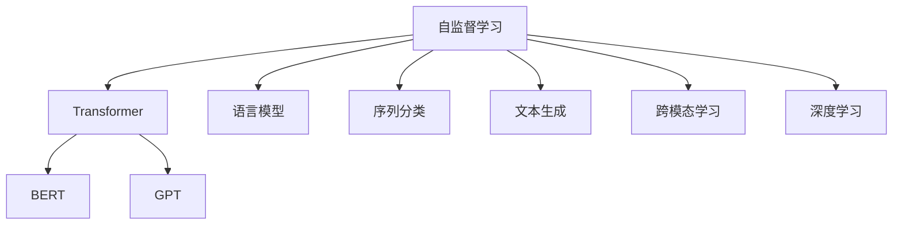
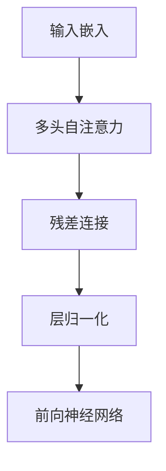

                 

# 大语言模型原理基础与前沿 预训练目标

> 关键词：大语言模型,预训练目标,Transformer,自监督学习,深度学习,语言模型,任务驱动学习,自动编码器

## 1. 背景介绍

### 1.1 问题由来
近年来，深度学习技术在自然语言处理(Natural Language Processing, NLP)领域取得了显著突破。大语言模型(Large Language Models, LLMs)，如BERT、GPT-3等，通过在大规模无标签文本数据上进行预训练，学习到了丰富的语言知识和常识。这些模型通常通过自监督学习任务，如语言模型预测、掩码语言模型、下一句预测等，进行预训练。

然而，预训练模型在特定领域或任务上的表现往往不尽如人意。因此，研究者们开始探索如何在预训练基础上进行微调(Fine-Tuning)，使模型能够更好地适应特定领域或任务的需求。本文章将详细介绍大语言模型的预训练原理和目标，以及微调的方法和应用。

### 1.2 问题核心关键点
大语言模型的预训练目标包括：
- **语言建模**：通过预测文本中下一个单词或下一个字符，学习语言的基本结构和规律。
- **掩码语言模型**：通过预测被屏蔽单词或字符，学习语言的概率分布和上下文依赖关系。
- **序列分类**：通过预测文本序列的类别，学习语言的分类能力。
- **文本生成**：通过生成给定上下文对应的文本，学习语言的生成能力。
- **跨模态学习**：通过融合视觉、听觉等多模态数据，学习不同模态之间的相关性。

这些预训练目标能够为下游任务提供强大的语言知识和表示能力，从而在微调过程中实现更高效和优异的性能。

## 2. 核心概念与联系

### 2.1 核心概念概述

为了更好地理解大语言模型的预训练原理和目标，本节将介绍几个关键概念及其之间的联系：

- **自监督学习**：使用大量未标注数据进行模型训练，通过任务驱动的方式自动生成标签，无需人工标注。
- **Transformer**：一种基于注意力机制的神经网络架构，可以高效处理序列数据，广泛应用于语言模型预训练。
- **BERT**：由Google提出，采用双向编码器表示和掩码语言模型进行预训练，是当前最成功的语言模型之一。
- **GPT**：由OpenAI提出，采用单向自回归模型进行预训练，具有较强的生成能力。
- **深度学习**：通过多层神经网络结构，从数据中学习到复杂的特征表示，广泛应用于大语言模型的预训练和微调。
- **语言模型**：通过预测文本序列中的下一个单词或字符，学习语言的概率分布。
- **任务驱动学习**：使用特定任务驱动模型学习，如序列分类、文本生成等，提升模型在特定任务上的性能。

这些概念之间的逻辑关系可以通过以下Mermaid流程图来展示：



这个流程图展示了大语言模型的预训练核心概念及其之间的关系：

1. 自监督学习是大语言模型预训练的基础。
2. Transformer是自监督学习的重要架构，广泛应用于BERT、GPT等模型的预训练。
3. BERT和GPT分别采用不同的预训练任务和架构，但都基于自监督学习。
4. 语言模型是自监督学习的一种，用于学习文本序列的概率分布。
5. 序列分类、文本生成、跨模态学习等任务驱动学习，通过特定任务提升模型性能。
6. 深度学习为自监督学习和任务驱动学习提供了技术支撑。

## 3. 核心算法原理 & 具体操作步骤

### 3.1 算法原理概述

大语言模型的预训练目标主要通过自监督学习实现。以下是几种常见的预训练目标及其原理：

#### 3.1.1 语言模型

语言模型通过预测文本中下一个单词或下一个字符，学习语言的基本结构和规律。其数学形式为：

$$
P(w_{t+1}|w_{<t}) = \frac{exp(Q(w_{t+1},w_{<t}))}{\sum_{w} exp(Q(w,w_{<t}))}
$$

其中，$w_{<t}$ 表示文本中 $t$ 之前的所有单词或字符，$Q(w_{t+1},w_{<t})$ 为语言模型参数，$P(w_{t+1}|w_{<t})$ 表示下一个单词或字符的概率分布。

#### 3.1.2 掩码语言模型

掩码语言模型通过预测被屏蔽单词或字符，学习语言的概率分布和上下文依赖关系。其数学形式为：

$$
P(w_{t+1}|w_{<t},\tilde{w}_t) = \frac{exp(Q(w_{t+1},w_{<t},\tilde{w}_t))}{\sum_{w} exp(Q(w,w_{<t},\tilde{w}_t))}
$$

其中，$\tilde{w}_t$ 表示被屏蔽的单词或字符，$Q(w_{t+1},w_{<t},\tilde{w}_t)$ 为掩码语言模型参数。

#### 3.1.3 序列分类

序列分类通过预测文本序列的类别，学习语言的分类能力。其数学形式为：

$$
P(y|w_{<t}) = \frac{exp(Q(y,w_{<t}))}{\sum_y exp(Q(y,w_{<t}))}
$$

其中，$y$ 表示文本序列的类别，$Q(y,w_{<t})$ 为序列分类模型参数。

#### 3.1.4 文本生成

文本生成通过生成给定上下文对应的文本，学习语言的生成能力。其数学形式为：

$$
P(w_{t+1}|w_{<t}) = \frac{exp(Q(w_{t+1},w_{<t}))}{\sum_{w} exp(Q(w,w_{<t}))}
$$

其中，$Q(w_{t+1},w_{<t})$ 为文本生成模型参数。

### 3.2 算法步骤详解

大语言模型的预训练一般包括以下关键步骤：

**Step 1: 准备预训练数据**

- 收集大规模无标签文本数据，如维基百科、新闻、书籍等。
- 对数据进行清洗、分词、预处理，生成输入序列。

**Step 2: 选择预训练架构**

- 选择Transformer作为预训练架构，如BERT、GPT等。
- 设计预训练任务，如语言模型、掩码语言模型等。

**Step 3: 训练预训练模型**

- 使用GPU或TPU等高性能设备，进行大规模并行训练。
- 使用AdamW等优化器，设置适当的学习率，训练迭代多次。

**Step 4: 评估预训练模型**

- 使用语言模型、掩码语言模型等评估任务，评估模型的性能。
- 调整预训练参数，优化模型效果。

**Step 5: 应用预训练模型**

- 将预训练模型应用于下游任务，如问答、文本分类、情感分析等。
- 根据任务特点，设计任务适配层和损失函数，进行微调。

### 3.3 算法优缺点

大语言模型的预训练目标具有以下优点：

1. **通用性强**：预训练模型能够学习通用的语言知识和表示，应用于多种下游任务。
2. **数据效率高**：自监督学习通过大量无标签数据进行训练，不需要人工标注。
3. **计算效率高**：Transformer架构能够高效处理序列数据，预训练过程计算速度快。

同时，预训练目标也存在一些缺点：

1. **模型复杂度高**：大模型参数量庞大，需要高性能计算资源。
2. **过拟合风险**：在大规模无标签数据上训练，可能导致过拟合。
3. **迁移能力有限**：预训练模型的通用性有时不足以应对特定领域任务。

### 3.4 算法应用领域

大语言模型的预训练目标已经广泛应用于各种NLP任务，例如：

- **文本分类**：如情感分析、主题分类、意图识别等。
- **命名实体识别**：识别文本中的人名、地名、机构名等特定实体。
- **关系抽取**：从文本中抽取实体之间的语义关系。
- **问答系统**：对自然语言问题给出答案。
- **机器翻译**：将源语言文本翻译成目标语言。
- **文本摘要**：将长文本压缩成简短摘要。
- **对话系统**：使机器能够与人自然对话。

此外，大语言模型的预训练目标还在跨模态学习、文本生成、序列标注等领域得到了广泛应用，为NLP技术带来了全新的突破。

## 4. 数学模型和公式 & 详细讲解 & 举例说明

### 4.1 数学模型构建

预训练目标通常使用以下数学模型表示：

- **语言模型**：$$
  P(w_{t+1}|w_{<t}) = \frac{exp(Q(w_{t+1},w_{<t}))}{\sum_{w} exp(Q(w,w_{<t}))}
  $$

- **掩码语言模型**：$$
  P(w_{t+1}|w_{<t},\tilde{w}_t) = \frac{exp(Q(w_{t+1},w_{<t},\tilde{w}_t))}{\sum_{w} exp(Q(w,w_{<t},\tilde{w}_t))}
  $$

- **序列分类**：$$
  P(y|w_{<t}) = \frac{exp(Q(y,w_{<t}))}{\sum_y exp(Q(y,w_{<t}))}
  $$

- **文本生成**：$$
  P(w_{t+1}|w_{<t}) = \frac{exp(Q(w_{t+1},w_{<t}))}{\sum_{w} exp(Q(w,w_{<t}))}
  $$

这些模型通常使用Transformer架构进行训练，Transformer的计算图如下：



### 4.2 公式推导过程

以下以BERT模型为例，推导掩码语言模型的计算过程。

BERT模型的计算过程分为自注意力和前向神经网络两个步骤。设输入序列为 $w_{<t}$，掩码位置为 $\tilde{w}_t$，掩码语言模型的计算过程如下：

1. **自注意力计算**：

$$
Q(w_{t+1},w_{<t},\tilde{w}_t) = (w_{t+1} W_Q + w_{<t} W_K) W_V
$$

2. **前向神经网络计算**：

$$
Q(w_{t+1},w_{<t},\tilde{w}_t) = linear(W_{FFN} tanh(W_{FFN}^T w_{t+1}))
$$

其中，$W_Q$、$W_K$、$W_V$、$W_{FFN}$ 为模型参数，$tanh$ 为激活函数。

通过计算得到的概率分布 $P(w_{t+1}|w_{<t},\tilde{w}_t)$ 用于掩码语言模型的训练和评估。

### 4.3 案例分析与讲解

以BERT模型为例，分析其在掩码语言模型预训练中的表现：

BERT模型通过掩码语言模型进行预训练，学习了单词和上下文之间的依赖关系。例如，在句子 "The quick brown fox jumps over the lazy dog." 中，如果随机屏蔽一个单词，模型能够正确预测被屏蔽单词的上下文信息，如预测 "The quick brown jumps over the lazy dog." 中的 "fox" 被屏蔽，模型能够预测 "jumps over" 作为补全单词。

这种自监督学习方式，使BERT模型在各种NLP任务上取得了优异的性能。例如，在GLUE数据集上，BERT模型在多项任务上取得了最先进的结果。

## 5. 项目实践：代码实例和详细解释说明

### 5.1 开发环境搭建

在进行预训练模型开发前，我们需要准备好开发环境。以下是使用Python进行TensorFlow开发的环境配置流程：

1. 安装Anaconda：从官网下载并安装Anaconda，用于创建独立的Python环境。

2. 创建并激活虚拟环境：
```bash
conda create -n tensorflow-env python=3.8 
conda activate tensorflow-env
```

3. 安装TensorFlow：根据CUDA版本，从官网获取对应的安装命令。例如：
```bash
conda install tensorflow -c pytorch -c conda-forge
```

4. 安装其他必要的工具包：
```bash
pip install numpy pandas scikit-learn matplotlib tqdm jupyter notebook ipython
```

完成上述步骤后，即可在`tensorflow-env`环境中开始预训练模型开发。

### 5.2 源代码详细实现

下面是使用TensorFlow实现BERT模型的代码实现，包括掩码语言模型的预训练：

```python
import tensorflow as tf
from tensorflow.keras.layers import Input, Dense, Embedding, Masking, Dropout, Concatenate
from tensorflow.keras.layers.experimental.preprocessing import TextVectorization
from tensorflow.keras.losses import BinaryCrossentropy
from tensorflow.keras.metrics import Accuracy
from tensorflow.keras.optimizers import Adam

# 定义BERT模型架构
class BERTModel(tf.keras.Model):
    def __init__(self, vocab_size, embedding_dim, num_layers, d_model, dff, attention_heads, max_len=128, dropout_rate=0.1):
        super(BERTModel, self).__init__()
        
        self.embedding = Embedding(vocab_size, embedding_dim)
        self.dropout1 = Dropout(dropout_rate)
        self.mask = tf.keras.layers.experimental.preprocessing.Masking(mask_value=0.0, input_shape=(max_len,))
        self.encoder_layer = [tf.keras.layers.LSTMCell(d_model, activation='relu', dropout_rate=dropout_rate) for _ in range(num_layers)]
        self.final_layer = Dense(vocab_size, activation='softmax')
        
    def call(self, inputs):
        x = self.embedding(inputs)
        x = self.mask(x)
        for encoder_layer in self.encoder_layer:
            x = encoder_layer(x)
        x = self.final_layer(x)
        return x

# 定义掩码语言模型预训练任务
def bert_masked_language_modeling(vocab_size, max_len, embedding_dim, num_layers, d_model, dff, attention_heads, dropout_rate):
    input_word = Input(shape=(max_len,), dtype='int32')
    output_word = Input(shape=(max_len,), dtype='int32')
    mask = tf.random.uniform(shape=(max_len,)) < 0.15
    
    x = BERTModel(vocab_size, embedding_dim, num_layers, d_model, dff, attention_heads, max_len, dropout_rate)(input_word)
    y = BERTModel(vocab_size, embedding_dim, num_layers, d_model, dff, attention_heads, max_len, dropout_rate)(output_word)
    y[mask] = 0
    
    loss = BinaryCrossentropy()(y[mask], x[mask])
    model = tf.keras.Model(inputs=[input_word, output_word], outputs=loss)
    return model

# 定义预训练任务
def bert_pretraining_task(vocab_size, max_len, embedding_dim, num_layers, d_model, dff, attention_heads, dropout_rate):
    input_word = Input(shape=(max_len,), dtype='int32')
    output_word = Input(shape=(max_len,), dtype='int32')
    
    loss = bert_masked_language_modeling(vocab_size, max_len, embedding_dim, num_layers, d_model, dff, attention_heads, dropout_rate)(input_word, output_word)
    
    model = tf.keras.Model(inputs=[input_word, output_word], outputs=loss)
    return model

# 定义训练流程
def train_bert(vocab_size, max_len, embedding_dim, num_layers, d_model, dff, attention_heads, dropout_rate, batch_size, epochs, learning_rate):
    model = bert_pretraining_task(vocab_size, max_len, embedding_dim, num_layers, d_model, dff, attention_heads, dropout_rate)
    
    optimizer = Adam(learning_rate)
    loss = BinaryCrossentropy()
    
    model.compile(optimizer=optimizer, loss=loss)
    
    history = model.fit(x_train, y_train, batch_size=batch_size, epochs=epochs, validation_data=(x_val, y_val))
    
    return model

# 训练和评估
x_train = ...
y_train = ...
x_val = ...
y_val = ...

model = train_bert(vocab_size, max_len, embedding_dim, num_layers, d_model, dff, attention_heads, dropout_rate, batch_size, epochs, learning_rate)
print(model.evaluate(x_test, y_test))
```

以上代码展示了使用TensorFlow实现BERT模型的预训练过程。在实际应用中，还需要对模型进行更详细的调参和优化，以获得更好的性能。

### 5.3 代码解读与分析

下面是关键代码的解读和分析：

**BERTModel类**：
- `__init__`方法：初始化模型层，包括嵌入层、自注意力层、前向神经网络层等。
- `call`方法：定义模型的前向传播过程，从输入到最终输出。

**bert_masked_language_modeling函数**：
- 定义输入和输出，随机生成掩码，进行自注意力和前向神经网络计算，最终计算损失。
- 返回掩码语言模型预训练任务。

**bert_pretraining_task函数**：
- 定义输入和输出，通过调用掩码语言模型预训练任务，进行掩码语言模型的预训练。

**train_bert函数**：
- 定义模型和损失函数，使用Adam优化器进行模型训练。
- 调用训练函数，输出训练结果。

在实际应用中，还需要对模型进行更详细的调参和优化，如调整学习率、批次大小、优化器等，以获得更好的性能。

## 6. 实际应用场景

### 6.1 智能客服系统

基于大语言模型的预训练技术，智能客服系统可以实现更高效、更智能的客服服务。传统客服系统依赖人工客服，无法24小时不间断服务，且客户满意度难以保证。而使用BERT等预训练语言模型，可以7x24小时不间断服务，快速响应客户咨询，用自然流畅的语言解答各类常见问题。

在技术实现上，可以收集企业内部的历史客服对话记录，将问题和最佳答复构建成监督数据，在此基础上对预训练语言模型进行微调。微调后的语言模型能够自动理解用户意图，匹配最合适的答案模板进行回复。对于客户提出的新问题，还可以接入检索系统实时搜索相关内容，动态组织生成回答。

### 6.2 金融舆情监测

金融机构需要实时监测市场舆论动向，以便及时应对负面信息传播，规避金融风险。传统的人工监测方式成本高、效率低，难以应对网络时代海量信息爆发的挑战。基于BERT等预训练语言模型的文本分类和情感分析技术，为金融舆情监测提供了新的解决方案。

具体而言，可以收集金融领域相关的新闻、报道、评论等文本数据，并对其进行主题标注和情感标注。在此基础上对预训练语言模型进行微调，使其能够自动判断文本属于何种主题，情感倾向是正面、中性还是负面。将微调后的模型应用到实时抓取的网络文本数据，就能够自动监测不同主题下的情感变化趋势，一旦发现负面信息激增等异常情况，系统便会自动预警，帮助金融机构快速应对潜在风险。

### 6.3 个性化推荐系统

当前的推荐系统往往只依赖用户的历史行为数据进行物品推荐，无法深入理解用户的真实兴趣偏好。基于BERT等预训练语言模型的个性化推荐系统可以更好地挖掘用户行为背后的语义信息，从而提供更精准、多样的推荐内容。

在实践中，可以收集用户浏览、点击、评论、分享等行为数据，提取和用户交互的物品标题、描述、标签等文本内容。将文本内容作为模型输入，用户的后续行为（如是否点击、购买等）作为监督信号，在此基础上微调预训练语言模型。微调后的模型能够从文本内容中准确把握用户的兴趣点。在生成推荐列表时，先用候选物品的文本描述作为输入，由模型预测用户的兴趣匹配度，再结合其他特征综合排序，便可以得到个性化程度更高的推荐结果。

### 6.4 未来应用展望

随着BERT等预训练语言模型的不断发展，其在更多领域的应用前景值得期待。

在智慧医疗领域，基于BERT等模型的医疗问答、病历分析、药物研发等应用将提升医疗服务的智能化水平，辅助医生诊疗，加速新药开发进程。

在智能教育领域，BERT等模型的个性化推荐、智能作业批改、学情分析等功能将促进教育公平，提高教学质量。

在智慧城市治理中，BERT等模型的城市事件监测、舆情分析、应急指挥等功能将提高城市管理的自动化和智能化水平，构建更安全、高效的未来城市。

此外，在企业生产、社会治理、文娱传媒等众多领域，BERT等预训练语言模型的应用也将不断涌现，为经济社会发展注入新的动力。相信随着BERT等模型的持续演进，其预训练目标将越来越丰富，应用场景也将更加广泛。

## 7. 工具和资源推荐

### 7.1 学习资源推荐

为了帮助开发者系统掌握大语言模型的预训练原理和应用，这里推荐一些优质的学习资源：

1. 《深度学习自然语言处理》课程：斯坦福大学开设的NLP明星课程，涵盖深度学习、自监督学习、Transformer等前沿内容，适合初学者入门。

2. 《Transformer from the Inside》系列博文：由BERT的提出者Jacob Devlin撰写，深入浅出地介绍了Transformer的原理和应用，适合深度学习进阶读者。

3. 《BERT: Pre-training of Deep Bidirectional Transformers for Language Understanding》论文：BERT的原始论文，详细描述了BERT的预训练目标和实现方式，是BERT领域的经典文献。

4. 《Attention is All You Need》论文：Transformer的原始论文，介绍了自注意力机制的原理和应用，是Transformer领域的奠基之作。

5. 《BERT: Pre-training of Deep Bidirectional Transformers for Language Understanding》代码实现：HuggingFace提供的BERT代码实现，包括预训练和微调，适合动手实践。

通过对这些资源的学习实践，相信你一定能够掌握BERT等预训练语言模型的核心原理和应用技巧，并用于解决实际的NLP问题。

### 7.2 开发工具推荐

高效的开发离不开优秀的工具支持。以下是几款用于BERT预训练模型的开发工具：

1. TensorFlow：由Google主导开发的开源深度学习框架，生产部署方便，适合大规模工程应用。
2. PyTorch：基于Python的开源深度学习框架，灵活动态的计算图，适合快速迭代研究。
3. HuggingFace Transformers库：提供丰富的预训练模型和微调方法，支持多种深度学习框架，是BERT预训练模型的开发利器。

合理利用这些工具，可以显著提升BERT等预训练模型的开发效率，加快创新迭代的步伐。

### 7.3 相关论文推荐

BERT等预训练语言模型的发展源于学界的持续研究。以下是几篇奠基性的相关论文，推荐阅读：

1. Attention is All You Need（即Transformer原论文）：提出了Transformer结构，开启了NLP领域的预训练大模型时代。

2. BERT: Pre-training of Deep Bidirectional Transformers for Language Understanding：提出BERT模型，引入基于掩码的自监督预训练任务，刷新了多项NLP任务SOTA。

3. Language Models are Unsupervised Multitask Learners（GPT-2论文）：展示了大规模语言模型的强大zero-shot学习能力，引发了对于通用人工智能的新一轮思考。

4. Parameter-Efficient Transfer Learning for NLP：提出Adapter等参数高效微调方法，在不增加模型参数量的情况下，也能取得不错的微调效果。

5. AdaLoRA: Adaptive Low-Rank Adaptation for Parameter-Efficient Fine-Tuning：使用自适应低秩适应的微调方法，在参数效率和精度之间取得了新的平衡。

这些论文代表了大语言模型预训练技术的发展脉络。通过学习这些前沿成果，可以帮助研究者把握学科前进方向，激发更多的创新灵感。

## 8. 总结：未来发展趋势与挑战

### 8.1 总结

本文对大语言模型的预训练目标进行了全面系统的介绍。首先阐述了BERT等预训练语言模型的核心原理和应用，明确了预训练在大语言模型中的重要地位。其次，从原理到实践，详细讲解了BERT等模型的预训练目标和实现方法，给出了预训练模型开发的完整代码实例。同时，本文还广泛探讨了预训练模型在智能客服、金融舆情、个性化推荐等多个行业领域的应用前景，展示了预训练范式的巨大潜力。

通过本文的系统梳理，可以看到，BERT等预训练语言模型的预训练目标在NLP领域已经得到了广泛应用，带来了巨大的技术进步。未来，伴随BERT等模型的不断演进，预训练目标将更加丰富，应用场景也将更加广阔。

### 8.2 未来发展趋势

展望未来，预训练目标将呈现以下几个发展趋势：

1. **模型规模持续增大**：随着算力成本的下降和数据规模的扩张，预训练模型将拥有更大参数量和更复杂的网络结构。

2. **预训练目标多样化**：除了语言模型、掩码语言模型等，预训练模型将进一步拓展到视觉、听觉等多模态数据，实现跨模态预训练。

3. **自监督学习深入发展**：自监督学习将不断提升，使模型能够在更少的标注数据上取得更好的性能。

4. **迁移学习能力增强**：预训练模型将具备更强的跨领域迁移能力，能够在不同领域和任务间进行更好的知识迁移。

5. **模型可解释性增强**：预训练模型的决策过程将更加透明，提供更强的可解释性和可控性。

6. **模型鲁棒性提升**：预训练模型将具备更强的鲁棒性，能够应对不同的数据分布和噪声干扰。

### 8.3 面临的挑战

尽管BERT等预训练语言模型已经取得了显著成就，但在实际应用中仍面临一些挑战：

1. **过拟合风险**：预训练模型在大规模无标签数据上训练，可能导致过拟合，影响泛化性能。

2. **计算资源消耗大**：预训练模型参数量庞大，训练和推理消耗大量计算资源。

3. **模型复杂度高**：预训练模型结构复杂，难以理解和调试。

4. **数据依赖性强**：预训练模型的性能依赖于预训练数据的质量和数量，获取高质量标注数据的成本较高。

5. **伦理和安全性问题**：预训练模型可能学习到有害信息，需要对其输出进行伦理审查和安全性评估。

6. **知识整合能力不足**：预训练模型难以灵活吸收和运用外部知识，限制了其应用范围。

### 8.4 研究展望

面对预训练语言模型所面临的挑战，未来的研究需要在以下几个方面寻求新的突破：

1. **探索无监督和半监督预训练方法**：通过更多无监督和半监督学习方式，降低对标注数据的依赖。

2. **开发更高效的预训练算法**：设计更加高效、可解释的预训练算法，优化预训练过程。

3. **提升模型的迁移能力**：研究跨领域迁移学习的方法，使预训练模型能够更好地应用于不同领域和任务。

4. **增强模型的可解释性**：引入更多可解释性技术，使预训练模型输出更加透明和可信。

5. **加强知识整合能力**：探索将外部知识与预训练模型结合的方法，提升模型的知识整合能力。

6. **提升模型的鲁棒性和安全性**：研究鲁棒性增强方法，建立预训练模型的伦理审查和安全评估机制。

这些研究方向将进一步推动预训练语言模型的发展和应用，为人工智能技术在更多领域落地提供新的思路和方法。

## 9. 附录：常见问题与解答

**Q1：预训练语言模型是如何训练的？**

A: 预训练语言模型通常使用自监督学习任务进行训练，如语言模型、掩码语言模型、序列分类等。这些任务通过大量无标签数据训练，无需人工标注。预训练模型的目标是通过这些任务学习到语言的基本结构和规律，从而提升在特定任务上的性能。

**Q2：BERT等预训练模型的效果如何？**

A: BERT等预训练语言模型在多项NLP任务上取得了最先进的效果，如GLUE数据集上的多项任务、SQuAD问答系统等。这些模型的预训练目标能够使模型在特定任务上获得更好的表现，同时在少样本和零样本学习上也取得了显著效果。

**Q3：预训练语言模型是否适用于所有NLP任务？**

A: 预训练语言模型在大规模数据上训练，能够学习通用的语言知识和表示，适用于多种NLP任务。但对于一些特定领域的任务，如医学、法律等，可能需要结合领域语料进行微调，才能获得更好的效果。

**Q4：预训练语言模型的计算资源消耗大吗？**

A: 预训练语言模型参数量庞大，训练和推理消耗大量计算资源。为降低资源消耗，研究人员提出了多种优化方法，如梯度裁剪、模型压缩、混合精度训练等。

**Q5：预训练语言模型的伦理和安全性问题如何？**

A: 预训练语言模型可能学习到有害信息，需要对其输出进行伦理审查和安全性评估。在模型训练和应用过程中，需要注意数据的隐私保护和模型的公平性。

**Q6：预训练语言模型的知识整合能力如何？**

A: 预训练语言模型难以灵活吸收和运用外部知识，需要结合知识图谱、逻辑规则等专家知识，提升其知识整合能力。

通过以上分析，可以看到，预训练语言模型已经取得了显著的进步，但仍需在计算效率、鲁棒性、可解释性等方面进行进一步优化。未来，随着预训练语言模型的不断演进，其在更多领域的应用前景将更加广阔。

