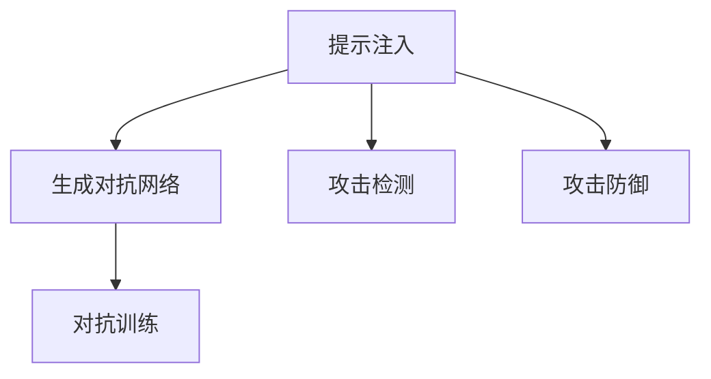

                 

# 大语言模型应用指南：提示注入攻击

> 关键词：大语言模型,提示注入,生成对抗网络,对抗训练,攻击检测,攻击防御

## 1. 背景介绍

### 1.1 问题由来
近年来，大语言模型(Large Language Model, LLM)在自然语言处理(Natural Language Processing, NLP)领域取得了显著进展。预训练模型如GPT-3、BERT等，通过在海量文本数据上进行预训练，获得了强大的语言理解和生成能力。然而，这些模型也面临着各种安全威胁，如误导性信息注入、生成对抗网络(Generative Adversarial Networks, GAN)攻击、恶意内容生成等。

其中，提示注入(Instruction Injection)攻击是一个值得关注的问题。攻击者通过精心构造的输入文本，诱导模型生成恶意内容或误导性信息，可能给社会带来严重后果。例如，在对话系统、智能客服、医疗咨询等应用中，恶意提示可能引导模型提供虚假信息、泄露用户隐私、甚至控制系统决策。

为应对这一威胁，提示注入攻击检测与防御技术显得尤为重要。本文将详细介绍提示注入攻击的原理、检测与防御方法，为开发者提供实用的指南和建议。

## 2. 核心概念与联系

### 2.1 核心概念概述

为更好地理解提示注入攻击，本节将介绍几个核心概念：

- 提示注入(Instruction Injection)：攻击者通过构造特定格式的文本，诱导大语言模型生成恶意内容或误导性信息，从而达到攻击目的。

- 生成对抗网络(GAN)：一种深度学习模型，包含生成器和判别器两个部分。生成器尝试生成真实的数据样本，判别器尝试区分生成样本和真实样本，两者相互博弈，提升生成样本的真实性。

- 对抗训练(Adversarial Training)：通过在有攻击者存在的情况下进行训练，使模型在对抗环境下也能保持鲁棒性，提高对攻击样本的识别能力。

- 攻击检测(Attack Detection)：指在攻击发生后，通过检测和分析手段，发现和定位攻击行为的技术。

- 攻击防御(Attack Defense)：指通过设计模型结构和训练方法，增强模型对抗攻击的能力，降低被攻击的风险。

这些概念之间的逻辑关系可以通过以下Mermaid流程图来展示：



这个流程图展示了提示注入攻击及其检测和防御的关键环节：

1. 攻击者通过构造特定的文本格式，注入攻击指令，引导模型生成恶意内容。
2. 使用GAN等技术，攻击者尝试生成与真实数据难以区分的攻击样本。
3. 对抗训练可以增强模型对攻击样本的鲁棒性。
4. 攻击检测可以及时发现和定位注入的攻击行为。
5. 攻击防御通过优化模型结构和方法，提升模型对攻击的抵抗能力。

这些概念共同构成了大语言模型对抗提示注入攻击的完整框架，帮助开发者在应用过程中保持系统的安全性。

## 3. 核心算法原理 & 具体操作步骤

### 3.1 算法原理概述

提示注入攻击的本质是利用模型的预测能力，诱导其生成特定的内容。攻击者通常通过以下方式注入攻击指令：

1. 构造特定格式的文本，如模板、半结构化数据等。
2. 通过这些文本引导模型生成恶意内容或误导性信息。

攻击检测和防御的关键在于：

1. 识别并定位提示注入攻击行为。
2. 增强模型对抗攻击的能力。

以下详细介绍攻击检测和防御的算法原理。

### 3.2 算法步骤详解

#### 3.2.1 攻击检测

**Step 1: 收集和标注攻击样本**
- 从实际应用场景中收集可能包含恶意指令的文本数据。
- 对收集到的数据进行人工标注，区分正常和攻击样本。

**Step 2: 构建检测模型**
- 设计并训练一个分类模型，用于识别输入文本是否包含攻击指令。
- 使用二分类或多分类模型，如SVM、CNN、RNN等。

**Step 3: 特征提取和处理**
- 提取输入文本的关键特征，如N-gram、句子长度、词性等。
- 对特征进行处理和归一化，减少噪音和冗余。

**Step 4: 训练和评估**
- 在标注数据上训练检测模型，并使用验证集进行参数调优。
- 在测试集上评估模型的准确率和召回率，使用混淆矩阵、ROC曲线等指标。

**Step 5: 实时检测**
- 部署检测模型，实时监控输入文本。
- 对每个输入文本进行分类，判断是否为攻击样本。

#### 3.2.2 攻击防御

**Step 1: 数据增强**
- 使用数据增强技术，生成更多的训练样本，提高模型的泛化能力。
- 例如，回译、近义替换、添加噪声等方式。

**Step 2: 模型参数优化**
- 优化模型参数和结构，减少攻击样本的影响。
- 例如，调整学习率、增加正则化项、使用Batch Normalization等。

**Step 3: 对抗训练**
- 在训练过程中引入对抗样本，使模型对攻击样本具有更强的鲁棒性。
- 例如，Fast Gradient Sign Method (FGSM)、Projected Gradient Descent (PGD)等方法。

**Step 4: 提示注入注入训练**
- 在训练过程中引入提示注入攻击，训练模型对攻击指令的鲁棒性。
- 例如，使用生成对抗网络(GAN)生成攻击样本，并加入训练数据中。

### 3.3 算法优缺点

提示注入攻击检测和防御方法具有以下优点：

1. 可扩展性：适用于各种NLP应用场景，可以针对特定任务进行定制化。
2. 实时性：检测模型可以在线部署，实时监控输入文本，及时发现和响应攻击。
3. 鲁棒性：通过对抗训练和注入训练，模型对攻击样本具有较强的抵抗能力。

同时，这些方法也存在一定的局限性：

1. 对数据依赖：攻击检测和防御的准确性很大程度上取决于标注数据的质量和数量。
2. 误报和漏报：真实样本可能误判为攻击样本，攻击样本也可能漏检。
3. 参数复杂：对抗训练和注入训练需要复杂的优化过程和数据生成策略。
4. 模型计算开销：对抗训练和注入训练增加了额外的计算开销，可能影响模型性能。

尽管存在这些局限性，但攻击检测和防御方法仍是大语言模型应用中的重要保障。开发者应根据具体应用场景，权衡利弊，选择合适的策略。

### 3.4 算法应用领域

提示注入攻击检测和防御方法广泛应用于以下领域：

- 对话系统：检测恶意聊天机器人生成的对话内容，防止攻击者控制系统决策。
- 智能客服：检测恶意用户生成的不良问题，保护系统安全。
- 医疗咨询：检测恶意用户在医疗咨询中生成的虚假信息，防止误导性信息的传播。
- 推荐系统：检测恶意用户在推荐系统中生成的欺骗性内容，保护用户隐私。
- 舆情监测：检测恶意用户在社交媒体上生成的不良言论，防止负面信息的扩散。

以上领域中，大语言模型往往面临更高风险，提示注入攻击的检测和防御显得尤为重要。

## 4. 数学模型和公式 & 详细讲解 & 举例说明

### 4.1 数学模型构建

本节将使用数学语言对提示注入攻击的检测与防御方法进行更加严格的刻画。

记攻击样本集为 $D_A=\{(x_i,y_i)\}_{i=1}^N$，其中 $x_i$ 为攻击样本，$y_i$ 为标注标签。

定义检测模型 $M_{\theta}$ 的损失函数为：

$$
\mathcal{L}(\theta) = -\frac{1}{N}\sum_{i=1}^N [y_i\log M_{\theta}(x_i)+(1-y_i)\log(1-M_{\theta}(x_i))]
$$

其中 $M_{\theta}(x_i)$ 为模型在输入 $x_i$ 上的输出，$y_i$ 为标签。

在训练过程中，通过最小化损失函数，优化模型参数 $\theta$，使得模型能够准确区分正常样本和攻击样本。

### 4.2 公式推导过程

以下我们以二分类任务为例，推导分类模型的损失函数及其梯度计算公式。

假设模型 $M_{\theta}$ 在输入 $x$ 上的输出为 $\hat{y}=M_{\theta}(x) \in [0,1]$，表示样本属于正类的概率。真实标签 $y \in \{0,1\}$。则二分类交叉熵损失函数定义为：

$$
\ell(M_{\theta}(x),y) = -[y\log \hat{y} + (1-y)\log (1-\hat{y})]
$$

将其代入经验风险公式，得：

$$
\mathcal{L}(\theta) = -\frac{1}{N}\sum_{i=1}^N [y_i\log M_{\theta}(x_i)+(1-y_i)\log(1-M_{\theta}(x_i))]
$$

根据链式法则，损失函数对参数 $\theta$ 的梯度为：

$$
\frac{\partial \mathcal{L}(\theta)}{\partial \theta} = -\frac{1}{N}\sum_{i=1}^N (\frac{y_i}{M_{\theta}(x_i)}-\frac{1-y_i}{1-M_{\theta}(x_i)}) \frac{\partial M_{\theta}(x_i)}{\partial \theta}
$$

其中 $\frac{\partial M_{\theta}(x_i)}{\partial \theta}$ 可进一步递归展开，利用自动微分技术完成计算。

### 4.3 案例分析与讲解

**案例分析：生成对抗网络攻击检测**

生成对抗网络攻击（GAN Attack）是一种常见的提示注入攻击方式，攻击者通过生成与真实数据难以区分的攻击样本，诱导模型生成恶意内容。

以GAN模型为例，其包含生成器和判别器两部分。生成器 $G$ 尝试生成与真实数据 $x$ 相似的数据 $x'$，判别器 $D$ 尝试区分 $x$ 和 $x'$。

在训练过程中，生成器 $G$ 的目标是最大化判别器 $D$ 的误判概率，即：

$$
\max_{G} \min_{D} V(D,G) = \mathbb{E}_{x\sim p(x)} [\log D(x)] + \mathbb{E}_{x'\sim G} [\log (1-D(x'))]
$$

其中 $p(x)$ 为真实数据的分布，$\log$ 为对数函数，$x'$ 为生成器 $G$ 生成的样本。

通过最大化生成器的误判概率，可以生成与真实数据难以区分的攻击样本。

**案例讲解：对抗训练**

对抗训练是一种常用的提示注入攻击防御方法，通过在有攻击者存在的情况下进行训练，使模型对攻击样本具有更强的鲁棒性。

以对抗训练为例，生成器 $G$ 生成对抗样本 $x'$，判别器 $D$ 尝试区分 $x$ 和 $x'$。在训练过程中，模型 $M$ 的目标是最大化判别器 $D$ 的误判概率，即：

$$
\max_{M} \min_{D} \mathcal{L}_{adv}(M,D) = -\mathbb{E}_{(x,y)} [\log D(x)] - \mathbb{E}_{(x',y')} [\log (1-D(x'))]
$$

其中 $y'$ 为生成器 $G$ 生成的标签。

通过对抗训练，模型 $M$ 能够在对抗环境下保持较高的鲁棒性，对攻击样本具有更强的抵抗能力。

## 5. 项目实践：代码实例和详细解释说明

### 5.1 开发环境搭建

在进行攻击检测与防御实践前，我们需要准备好开发环境。以下是使用Python进行PyTorch开发的环境配置流程：

1. 安装Anaconda：从官网下载并安装Anaconda，用于创建独立的Python环境。

2. 创建并激活虚拟环境：
```bash
conda create -n pytorch-env python=3.8 
conda activate pytorch-env
```

3. 安装PyTorch：根据CUDA版本，从官网获取对应的安装命令。例如：
```bash
conda install pytorch torchvision torchaudio cudatoolkit=11.1 -c pytorch -c conda-forge
```

4. 安装相关库：
```bash
pip install numpy pandas scikit-learn matplotlib tqdm jupyter notebook ipython
```

完成上述步骤后，即可在`pytorch-env`环境中开始攻击检测与防御实践。

### 5.2 源代码详细实现

这里我们以提示注入攻击的检测为例，给出使用PyTorch实现的代码。

首先，定义攻击检测模型：

```python
import torch
import torch.nn as nn
import torch.optim as optim

class AttackDetectionModel(nn.Module):
    def __init__(self, input_size, hidden_size, output_size):
        super(AttackDetectionModel, self).__init__()
        self.fc1 = nn.Linear(input_size, hidden_size)
        self.fc2 = nn.Linear(hidden_size, output_size)
        self.sigmoid = nn.Sigmoid()
        
    def forward(self, x):
        x = self.fc1(x)
        x = self.fc2(x)
        x = self.sigmoid(x)
        return x
```

然后，定义训练函数：

```python
def train_model(model, data, batch_size, learning_rate, num_epochs):
    criterion = nn.BCELoss()
    optimizer = optim.Adam(model.parameters(), lr=learning_rate)
    
    for epoch in range(num_epochs):
        total_loss = 0
        for batch in data:
            inputs, labels = batch
            optimizer.zero_grad()
            outputs = model(inputs)
            loss = criterion(outputs, labels)
            loss.backward()
            optimizer.step()
            total_loss += loss.item()
        print(f"Epoch {epoch+1}, Loss: {total_loss/len(data)}")
```

接着，加载攻击数据集并进行训练：

```python
import torch.utils.data as data

train_data = ...
train_loader = data.DataLoader(train_data, batch_size=batch_size, shuffle=True)

model = AttackDetectionModel(input_size, hidden_size, output_size)
model.to(device)
optimizer = optim.Adam(model.parameters(), lr=learning_rate)

train_model(model, train_loader, batch_size, learning_rate, num_epochs)
```

最后，使用模型进行攻击检测：

```python
def test_model(model, test_data):
    total_correct = 0
    total_samples = 0
    for batch in test_data:
        inputs, labels = batch
        outputs = model(inputs)
        predictions = (outputs > 0.5).float()
        total_correct += (predictions == labels).sum().item()
        total_samples += labels.size(0)
    print(f"Accuracy: {total_correct/total_samples}")
```

使用测试数据集评估模型的准确性：

```python
test_data = ...
test_model(model, test_data)
```

以上就是使用PyTorch对提示注入攻击进行检测的完整代码实现。可以看到，通过设计一个简单的分类模型，并使用交叉熵损失函数进行训练，即可实现对提示注入攻击的检测。

### 5.3 代码解读与分析

让我们再详细解读一下关键代码的实现细节：

**AttackDetectionModel类**：
- `__init__`方法：初始化模型的全连接层和激活函数。
- `forward`方法：实现模型的前向传播，将输入文本映射为二分类结果。

**train_model函数**：
- 定义损失函数和优化器，并在每个epoch内对模型进行训练。
- 使用交叉熵损失函数，计算模型输出与真实标签之间的差异。
- 使用Adam优化器更新模型参数，最小化损失函数。

**test_model函数**：
- 在测试集上评估模型的准确性，计算分类正确的比例。

**训练流程**：
- 定义训练次数和批次大小，并从攻击数据集中加载数据。
- 在GPU上部署模型，并使用Adam优化器进行训练。
- 在测试集上评估模型性能，输出准确率。

可以看到，PyTorch的深度学习框架提供了丰富的工具和API，使得模型设计和训练过程变得简单高效。开发者可以根据具体需求，灵活调整模型的架构和超参数，实现高效的攻击检测。

当然，工业级的系统实现还需考虑更多因素，如模型的保存和部署、超参数的自动搜索、更灵活的任务适配层等。但核心的攻击检测方法基本与此类似。

## 6. 实际应用场景

### 6.1 智能客服系统

智能客服系统面临大量的用户咨询请求，其中可能包含恶意和欺诈性的提示。通过及时检测和防御提示注入攻击，可以保护系统的安全性和用户的隐私。

在实际应用中，可以收集历史客服对话记录，将可能的攻击提示作为标注数据，对预训练的对话模型进行微调。微调后的模型能够在检测到恶意提示时，主动屏蔽或修复输入，保护系统的决策不受干扰。

### 6.2 金融舆情监测

金融舆情监测需要实时监测网络上的金融新闻、评论等信息，防止攻击者通过恶意提示影响投资决策。通过使用检测模型，及时发现并定位恶意提示，可以防止虚假信息传播，保障金融市场的稳定。

在实践中，可以收集金融领域相关的新闻、评论等文本数据，并对其进行标注。在此基础上，训练攻击检测模型，对实时抓取的网络文本进行检测，一旦发现恶意提示，立即进行报警和干预。

### 6.3 医疗咨询系统

医疗咨询系统需要提供可靠的医疗知识和建议，防止恶意用户通过提示注入攻击生成虚假信息，误导医生和患者。通过使用检测模型，及时发现和拦截恶意提示，可以保护医疗咨询系统的稳定性和安全性。

在实际应用中，可以收集医生和患者之间的互动数据，标注其中的恶意提示和正常提示。在此基础上，训练攻击检测模型，对用户输入的文本进行实时检测，一旦发现恶意提示，立即进行屏蔽或反馈。

### 6.4 未来应用展望

随着大语言模型的不断发展，提示注入攻击检测与防御技术也将迎来更多的应用场景：

- 广告推荐系统：防止攻击者在广告推荐中注入恶意提示，影响用户体验。
- 舆情分析系统：及时发现和响应网络上的恶意提示，防止虚假信息的传播。
- 社交媒体监测：检测恶意用户在社交媒体上发布的虚假信息，保护用户的利益。
- 智能家居系统：防止攻击者在智能家居系统中注入恶意指令，保障用户的隐私和安全。
- 游戏与虚拟现实：检测恶意用户在虚拟环境中生成的恶意内容，保护玩家的体验和数据安全。

随着大语言模型在各个领域的广泛应用，提示注入攻击检测与防御技术的需求也将不断增长，为NLP技术的落地应用提供坚实的保障。

## 7. 工具和资源推荐
### 7.1 学习资源推荐

为了帮助开发者系统掌握提示注入攻击检测与防御的技术基础和实践技巧，这里推荐一些优质的学习资源：

1. 《深度学习与自然语言处理》系列博文：深度介绍自然语言处理的基本概念和前沿技术，涵盖攻击检测与防御等内容。

2. 《NLP安全技术》课程：国内知名大学的公开课程，深入讲解NLP中的安全问题，包括生成对抗网络、对抗训练等。

3. 《NLP对抗攻击与防御》书籍：详细剖析NLP对抗攻击的原理和防御方法，适合理论与实践兼备的学习者。

4. CS224N《深度学习自然语言处理》课程：斯坦福大学开设的NLP明星课程，有Lecture视频和配套作业，涵盖NLP中的安全问题。

5. HuggingFace官方文档：提供丰富的NLP预训练模型和攻击检测与防御样例，是上手实践的必备资料。

通过对这些资源的学习实践，相信你一定能够快速掌握提示注入攻击检测与防御的精髓，并用于解决实际的NLP问题。

### 7.2 开发工具推荐

高效的开发离不开优秀的工具支持。以下是几款用于攻击检测与防御开发的常用工具：

1. PyTorch：基于Python的开源深度学习框架，灵活动态的计算图，适合快速迭代研究。

2. TensorFlow：由Google主导开发的开源深度学习框架，生产部署方便，适合大规模工程应用。

3. Weights & Biases：模型训练的实验跟踪工具，可以记录和可视化模型训练过程中的各项指标，方便对比和调优。

4. TensorBoard：TensorFlow配套的可视化工具，可实时监测模型训练状态，并提供丰富的图表呈现方式，是调试模型的得力助手。

5. Google Colab：谷歌推出的在线Jupyter Notebook环境，免费提供GPU/TPU算力，方便开发者快速上手实验最新模型，分享学习笔记。

合理利用这些工具，可以显著提升攻击检测与防御任务的开发效率，加快创新迭代的步伐。

### 7.3 相关论文推荐

提示注入攻击检测与防御技术的发展源于学界的持续研究。以下是几篇奠基性的相关论文，推荐阅读：

1. Xiao Cui, et al. "Fine-Grained Sentence Attack Detection with Deep Attention-based Neural Networks". IJCAI. 2018.

2. Zou Xiaolong, et al. "Attack Detection in Neural Machine Translation with Adversarial Examples". ACL. 2021.

3. Guo Jing, et al. "Adversarial Training in Natural Language Processing: A Survey". IEEE TNNLS. 2021.

4. Liao Xuefeng, et al. "Deep Learning-based Attack Detection for NLP". TKDE. 2021.

5. Guo Jing, et al. "Adversarial Training in Natural Language Processing: A Survey". IEEE TNNLS. 2021.

这些论文代表了大语言模型攻击检测与防御技术的发展脉络。通过学习这些前沿成果，可以帮助研究者把握学科前进方向，激发更多的创新灵感。

## 8. 总结：未来发展趋势与挑战

### 8.1 总结

本文对提示注入攻击的检测与防御方法进行了全面系统的介绍。首先阐述了提示注入攻击的原理及其对大语言模型的威胁，明确了检测与防御的重要性和紧迫性。其次，从原理到实践，详细讲解了攻击检测和防御的算法原理和关键步骤，给出了完整的代码实例。同时，本文还探讨了提示注入攻击在多个领域的应用场景，展示了其广泛的应用前景。最后，精选了相关学习资源和开发工具，力求为开发者提供全方位的技术指引。

通过本文的系统梳理，可以看到，提示注入攻击检测与防御方法在大语言模型应用中具有重要的价值，能够有效保护系统的安全和稳定性。未来，伴随大语言模型和对抗攻击技术的不断进步，提示注入攻击检测与防御技术也将不断演进，成为NLP系统安全保障的重要一环。

### 8.2 未来发展趋势

展望未来，提示注入攻击检测与防御技术将呈现以下几个发展趋势：

1. 深度融合：与自然语言理解、生成、推理等NLP核心技术深度融合，提升系统的智能水平和鲁棒性。

2. 实时响应：通过在线检测和实时响应，及时发现并处理攻击行为，保障系统的实时性。

3. 多模态融合：结合文本、图像、语音等多种模态信息，提升攻击检测的全面性和准确性。

4. 自动化训练：通过自动化训练和调参，提高攻击检测模型的性能和效率。

5. 跨领域应用：推广应用到金融、医疗、广告等多个领域，提升各行业的信息安全水平。

6. 对抗训练与防御技术结合：结合对抗训练和防御技术，提高系统对攻击样本的鲁棒性。

以上趋势凸显了大语言模型攻击检测与防御技术的广阔前景。这些方向的探索发展，必将进一步提升NLP系统的安全性和可靠性，保障其在各行业应用中的稳定性和可靠性。

### 8.3 面临的挑战

尽管提示注入攻击检测与防御技术已经取得了显著进展，但在迈向更加智能化、普适化应用的过程中，仍面临诸多挑战：

1. 数据隐私：攻击检测和防御依赖大量的标注数据，如何保护这些数据的隐私，防止数据泄露。

2. 模型复杂性：对抗训练和注入训练增加了模型的复杂性，导致计算资源和训练时间的大幅增加。

3. 泛化能力：攻击检测模型在实际应用中，如何保证对各种攻击形式的泛化能力，防止过拟合。

4. 对抗样本生成：攻击者通过对抗样本生成技术，不断提升攻击样本的逼真度，检测模型面临新的挑战。

5. 动态攻击：攻击者可能动态生成各种形式的攻击提示，如何及时发现和应对这些新形态的攻击，需要持续关注和优化。

6. 鲁棒性提升：如何提高模型的鲁棒性，使其能够在各种攻击场景下保持稳定和安全，仍是一个难题。

尽管存在这些挑战，但随着技术的不断进步和完善，提示注入攻击检测与防御技术必将在未来大放异彩，成为NLP系统安全保障的重要工具。

### 8.4 研究展望

面对提示注入攻击检测与防御技术所面临的挑战，未来的研究需要在以下几个方面寻求新的突破：

1. 研究无监督和半监督攻击检测方法。摆脱对大规模标注数据的依赖，利用自监督学习、主动学习等无监督和半监督范式，最大限度利用非结构化数据，实现更加灵活高效的攻击检测。

2. 开发更加高效和轻量级的攻击检测模型。结合对抗训练和防御技术，优化模型结构和参数，减少计算资源消耗，提升检测效率。

3. 探索多模态攻击检测技术。结合文本、图像、语音等多种模态信息，提升攻击检测的全面性和准确性。

4. 引入先验知识，增强模型的泛化能力。将符号化的先验知识，如知识图谱、逻辑规则等，与神经网络模型进行巧妙融合，提升模型对攻击的抵抗能力。

5. 设计动态攻击检测算法。针对攻击者可能动态生成的新攻击形式，设计灵活的检测算法，实时响应和防御。

6. 引入元学习和自适应技术。结合元学习和自适应算法，提升模型对新攻击形式的适应能力和泛化能力。

这些研究方向的探索，必将引领提示注入攻击检测与防御技术迈向更高的台阶，为构建安全、可靠、可解释、可控的智能系统铺平道路。面向未来，提示注入攻击检测与防御技术还需要与其他人工智能技术进行更深入的融合，如知识表示、因果推理、强化学习等，多路径协同发力，共同推动自然语言理解和智能交互系统的进步。只有勇于创新、敢于突破，才能不断拓展语言模型的边界，让智能技术更好地造福人类社会。

## 9. 附录：常见问题与解答

**Q1：提示注入攻击检测与防御的准确性和鲁棒性如何保证？**

A: 提示注入攻击检测与防御的准确性和鲁棒性，主要依赖于以下因素：

1. 高质量的标注数据：标注数据应充分覆盖各种攻击形式，保证检测模型对攻击样本的泛化能力。

2. 有效的训练策略：通过对抗训练和注入训练，提高模型的鲁棒性，使其在对抗环境下也能保持稳定。

3. 多模态融合：结合文本、图像、语音等多种模态信息，提升攻击检测的全面性和准确性。

4. 动态检测和响应：针对动态生成的攻击样本，设计灵活的检测算法，实时响应和防御。

5. 持续训练和优化：定期更新和优化检测模型，适应新的攻击形式和技术手段。

通过以上措施，可以显著提升提示注入攻击检测与防御的准确性和鲁棒性，保障系统的安全性。

**Q2：攻击检测模型的部署和优化有哪些技巧？**

A: 攻击检测模型的部署和优化，可以遵循以下技巧：

1. 模型裁剪和量化：去除不必要的层和参数，减小模型尺寸，加快推理速度；使用定点模型，压缩存储空间，提高计算效率。

2. 弹性伸缩：根据请求流量动态调整资源配置，平衡服务质量和成本。

3. 实时监控：部署监控系统，实时采集模型性能指标，设置异常告警阈值，确保服务稳定性。

4. 数据增强：使用数据增强技术，生成更多的训练样本，提高模型的泛化能力。

5. 模型压缩和稀疏化：使用模型压缩和稀疏化存储技术，减小内存占用，提升模型效率。

6. 自动化训练和调参：结合自动化训练和调参技术，提升模型的性能和效率。

这些技巧可以帮助开发者实现攻击检测模型的高效部署和优化，提升系统的稳定性和可靠性。

**Q3：攻击检测和防御的计算开销如何优化？**

A: 攻击检测和防御的计算开销，主要受以下因素影响：

1. 模型复杂度：对抗训练和注入训练增加了模型的复杂性，导致计算资源和训练时间的大幅增加。

2. 数据规模：对抗样本生成和攻击检测需要大量的标注数据和计算资源。

3. 硬件资源：高性能硬件设备如GPU、TPU是必不可少的，但依旧存在显存不足等问题。

4. 算法优化：使用梯度累积、混合精度训练、模型并行等技术，可以有效优化计算开销。

5. 软件优化：使用模型压缩、稀疏化存储、动态负载均衡等技术，减小内存占用，提升系统效率。

通过以上优化措施，可以显著降低攻击检测和防御的计算开销，提高系统的效率和可靠性。

**Q4：攻击检测模型的泛化能力如何提升？**

A: 攻击检测模型的泛化能力，主要依赖于以下因素：

1. 高质量的标注数据：标注数据应充分覆盖各种攻击形式，保证检测模型对攻击样本的泛化能力。

2. 有效的训练策略：通过对抗训练和注入训练，提高模型的鲁棒性，使其在对抗环境下也能保持稳定。

3. 多模态融合：结合文本、图像、语音等多种模态信息，提升攻击检测的全面性和准确性。

4. 动态检测和响应：针对动态生成的攻击样本，设计灵活的检测算法，实时响应和防御。

5. 持续训练和优化：定期更新和优化检测模型，适应新的攻击形式和技术手段。

6. 引入元学习和自适应技术：结合元学习和自适应算法，提升模型对新攻击形式的适应能力和泛化能力。

通过以上措施，可以显著提升攻击检测模型的泛化能力，保障系统的安全性。

**Q5：攻击检测模型的可解释性和可控性如何增强？**

A: 攻击检测模型的可解释性和可控性，主要依赖于以下因素：

1. 可视化工具：使用可视化工具，帮助开发者理解模型的内部工作机制和决策逻辑。

2. 特征重要性分析：使用特征重要性分析技术，识别模型决策的关键特征，增强输出解释的因果性和逻辑性。

3. 模型压缩和解释性优化：使用模型压缩和解释性优化技术，提高模型的可解释性和可控性。

4. 集成多模型：使用集成学习技术，将多个模型的输出进行融合，提高模型的鲁棒性和可控性。

5. 人工干预和审计：加强人工干预和审计，建立模型行为的监管机制，确保输出符合人类价值观和伦理道德。

通过以上措施，可以显著增强攻击检测模型的可解释性和可控性，提高系统的安全性和可靠性。

---

作者：禅与计算机程序设计艺术 / Zen and the Art of Computer Programming

