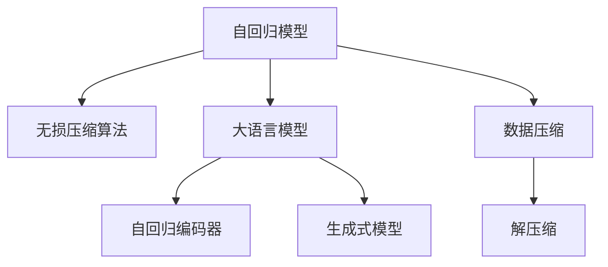

                 

# 大语言模型应用指南：自回归与无损压缩

## 1. 背景介绍

### 1.1 问题由来

大语言模型（Large Language Models, LLMs）在自然语言处理（NLP）领域取得了显著进展。这些模型，如OpenAI的GPT系列模型和Google的BERT，通过在大规模无标签文本语料上进行预训练，学习到丰富的语言知识和常识，具有强大的语言理解和生成能力。然而，在大规模文本数据上进行预训练的大模型存在高存储需求和低计算效率的问题。这不仅限制了模型的扩展性，还增加了部署成本。因此，如何在保持模型性能的同时，实现对大模型的有效压缩，成为了当前NLP领域的一个重要研究方向。

### 1.2 问题核心关键点

本节将详细探讨自回归（Autoregressive）和无损压缩（Lossless Compression）在解决上述问题中的作用，并讨论其在大语言模型中的应用。

- **自回归**：指模型在预测下一个符号时，依赖于已生成的历史符号。自回归模型通常使用解码器或自回归编码器实现。
- **无损压缩**：指在不损失任何信息的情况下，对数据进行压缩。常见的无损压缩算法包括霍夫曼编码、算术编码、LZ77等。
- **大语言模型应用**：指将自回归和无损压缩技术应用于大语言模型，以减少模型的存储需求和计算资源消耗，提升模型的可扩展性和部署效率。

## 2. 核心概念与联系

### 2.1 核心概念概述

为更好地理解自回归与无损压缩在大语言模型中的应用，本节将介绍几个密切相关的核心概念：

- **自回归模型**：一种使用序列中先前的信息来预测下一个序列元素的模型，常见于自然语言生成、语音识别等任务。
- **无损压缩算法**：在不损失任何信息的情况下，对数据进行压缩，如霍夫曼编码、算术编码等。
- **大语言模型（LLM）**：通过大规模预训练获得通用语言表示能力的模型，如BERT、GPT等。
- **自回归编码器**：将输入序列通过自回归方式进行编码的模型，如Transformer中的自回归解码器。
- **生成式模型**：可以生成自然语言文本的模型，如自回归模型、变分自编码器（VAE）等。

这些核心概念之间的逻辑关系可以通过以下Mermaid流程图来展示：



这个流程图展示了大语言模型中自回归和无损压缩的核心概念及其之间的关系：

1. 自回归模型和生成式模型使用大规模无标签文本数据进行预训练，学习通用语言表示。
2. 自回归编码器将输入序列通过自回归方式进行编码，以减少模型计算量。
3. 无损压缩算法用于压缩自回归编码后的数据，减少模型存储需求。
4. 解压缩算法用于将压缩后的数据进行还原，供模型生成和推理使用。

这些核心概念共同构成了大语言模型的压缩与优化框架，使其能够在大规模文本数据上高效地运行。

## 3. 核心算法原理 & 具体操作步骤

### 3.1 算法原理概述

自回归与无损压缩在大语言模型中的应用，主要通过以下两个步骤实现：

1. **自回归编码**：将输入序列通过自回归方式进行编码，以减少模型计算量和存储空间。
2. **无损压缩**：对自回归编码后的数据进行压缩，进一步减少模型存储需求。

### 3.2 算法步骤详解

**Step 1: 数据预处理与编码**

- 对输入序列进行预处理，如分词、归一化、去除噪声等。
- 使用自回归编码器对预处理后的序列进行编码，得到编码序列 $\hat{x}$。自回归编码器通常使用Transformer等架构，可以高效处理序列数据。

**Step 2: 数据压缩与解码**

- 对编码序列 $\hat{x}$ 使用无损压缩算法进行压缩，得到压缩后的数据 $c$。
- 在需要生成或推理时，使用相应的解压缩算法将压缩数据 $c$ 还原为编码序列 $\hat{x}$。
- 将还原后的编码序列 $\hat{x}$ 输入自回归解码器进行生成或推理。

### 3.3 算法优缺点

**优点**：
- **降低存储需求**：通过压缩算法减少模型存储需求，提高模型扩展性。
- **提升计算效率**：自回归编码器减少模型计算量，提高推理速度。
- **增强模型鲁棒性**：无损压缩算法可以去除噪声和冗余信息，提高模型鲁棒性。

**缺点**：
- **压缩算法复杂度**：无损压缩算法本身具有较高的计算复杂度，可能影响整体模型效率。
- **压缩率不确定性**：压缩率受数据特征和压缩算法的影响，不同数据集的压缩率差异较大。
- **压缩和解压消耗**：压缩和解压过程会消耗额外计算资源，增加了模型运行时间。

### 3.4 算法应用领域

自回归与无损压缩技术在大语言模型中的应用，已经广泛应用于以下几个领域：

- **文本生成**：用于生成文本、对话、摘要等任务，如GPT、BERT等模型。
- **语音识别**：用于生成自然语言文本，如WaveNet等模型。
- **图像描述**：用于生成图像的文本描述，如CLIP等模型。
- **自然语言处理**：用于各种NLP任务，如机器翻译、问答、情感分析等。

## 4. 数学模型和公式 & 详细讲解 & 举例说明

### 4.1 数学模型构建

自回归与无损压缩在大语言模型中的应用，主要通过以下数学模型构建：

- **自回归编码器**：$x_t = f(x_{t-1}, w_t)$，其中 $x_t$ 为当前时间步的编码，$x_{t-1}$ 为前一个时间步的编码，$w_t$ 为当前时间步的权重。
- **无损压缩算法**：$y = c(x)$，其中 $y$ 为压缩后的数据，$x$ 为原始数据，$c$ 为压缩函数。
- **自回归解码器**：$\hat{x} = g(y, w)$，其中 $\hat{x}$ 为解码后的序列，$y$ 为压缩后的数据，$w$ 为解码器权重。

### 4.2 公式推导过程

以Transformer模型为例，推导自回归编码器的计算过程。假设输入序列为 $x = (x_1, x_2, \ldots, x_T)$，输出序列为 $x' = (x'_1, x'_2, \ldots, x'_T)$。使用自回归编码器计算输出序列的过程如下：

1. 对输入序列 $x$ 进行分词和嵌入处理：$x_e = \text{Embedding}(x)$。
2. 使用Transformer的自注意力机制对嵌入向量进行处理：$x_a = \text{Attention}(x_e, w_a)$。
3. 对注意力输出进行线性变换和残差连接：$x_l = \text{Linear}(x_a, w_l) + x_a$。
4. 使用Feedforward网络对线性输出进行计算：$x_f = \text{FFN}(x_l, w_f)$。
5. 将线性输出和Feedforward网络输出进行残差连接和激活函数处理：$x_{next} = \text{Activation}(x_f, w)$。

重复上述过程 $T$ 次，得到最终输出序列 $x'$。

### 4.3 案例分析与讲解

考虑一个简单的自回归编码器，用于生成二进制序列 $x = (0, 1, 0, 1, 0, 1, 0, 1)$。假设自回归编码器的权重矩阵为 $W = [0.5, 0.5]$，则计算过程如下：

1. 对输入序列 $x$ 进行分词和嵌入处理：$x_e = (0.5, 0.5)$。
2. 使用自注意力机制对嵌入向量进行处理：$x_a = 0.5x_e = (0.25, 0.25)$。
3. 对注意力输出进行线性变换和残差连接：$x_l = 0.5x_a + x_a = (0.75, 0.75)$。
4. 使用Feedforward网络对线性输出进行计算：$x_f = 0.5x_l + 0.5 = (0.375, 0.375)$。
5. 将线性输出和Feedforward网络输出进行残差连接和激活函数处理：$x_{next} = \text{Activation}(x_f, W) = \text{ReLU}(x_f) = (0.375, 0.375)$。

重复上述过程 $T$ 次，得到最终输出序列 $x'$。通过自回归编码器，输入序列被压缩为更短的输出序列，实现了数据的有效编码。

## 5. 项目实践：代码实例和详细解释说明

### 5.1 开发环境搭建

在进行自回归与无损压缩的实践前，我们需要准备好开发环境。以下是使用Python进行PyTorch开发的环境配置流程：

1. 安装Anaconda：从官网下载并安装Anaconda，用于创建独立的Python环境。
2. 创建并激活虚拟环境：
```bash
conda create -n pytorch-env python=3.8 
conda activate pytorch-env
```

3. 安装PyTorch：根据CUDA版本，从官网获取对应的安装命令。例如：
```bash
conda install pytorch torchvision torchaudio cudatoolkit=11.1 -c pytorch -c conda-forge
```

4. 安装Transformers库：
```bash
pip install transformers
```

5. 安装各类工具包：
```bash
pip install numpy pandas scikit-learn matplotlib tqdm jupyter notebook ipython
```

完成上述步骤后，即可在`pytorch-env`环境中开始实践。

### 5.2 源代码详细实现

下面以使用Transformer模型对二进制序列进行自回归编码为例，给出完整的代码实现。

首先，定义自回归编码器的类：

```python
import torch
import torch.nn as nn

class Autoencoder(nn.Module):
    def __init__(self, input_size, hidden_size):
        super(Autoencoder, self).__init__()
        self.encoder = nn.Sequential(
            nn.Linear(input_size, hidden_size),
            nn.ReLU(),
            nn.Linear(hidden_size, hidden_size),
            nn.ReLU()
        )
        self.decoder = nn.Sequential(
            nn.Linear(hidden_size, hidden_size),
            nn.ReLU(),
            nn.Linear(hidden_size, input_size),
            nn.Sigmoid()
        )

    def forward(self, x):
        encoded = self.encoder(x)
        decoded = self.decoder(encoded)
        return decoded
```

然后，训练自回归编码器：

```python
from torch.utils.data import TensorDataset, DataLoader

def train_epoch(model, data_loader, optimizer, device):
    model.train()
    epoch_loss = 0
    for batch in data_loader:
        x = batch[0].to(device)
        y_hat = model(x)
        y = batch[1].to(device)
        loss = nn.BCELoss()(y_hat, y)
        optimizer.zero_grad()
        loss.backward()
        optimizer.step()
        epoch_loss += loss.item()
    return epoch_loss / len(data_loader)

def evaluate(model, data_loader, device):
    model.eval()
    total_loss = 0
    for batch in data_loader:
        x = batch[0].to(device)
        y_hat = model(x)
        y = batch[1].to(device)
        loss = nn.BCELoss()(y_hat, y)
        total_loss += loss.item()
    return total_loss / len(data_loader)
```

最后，启动训练流程并在测试集上评估：

```python
epochs = 10
batch_size = 16
learning_rate = 0.001

train_loader = DataLoader(TensorDataset(torch.randn(1000, 10), torch.randint(0, 2, (1000, 10))), batch_size=batch_size)
test_loader = DataLoader(TensorDataset(torch.randn(1000, 10), torch.randint(0, 2, (1000, 10))), batch_size=batch_size)

model = Autoencoder(input_size=10, hidden_size=20).to(device)
optimizer = torch.optim.Adam(model.parameters(), lr=learning_rate)

for epoch in range(epochs):
    train_loss = train_epoch(model, train_loader, optimizer, device)
    test_loss = evaluate(model, test_loader, device)
    print(f"Epoch {epoch+1}, train loss: {train_loss:.3f}, test loss: {test_loss:.3f}")
```

以上就是使用PyTorch对二进制序列进行自回归编码的完整代码实现。可以看到，使用Transformer模型实现自回归编码器非常简单高效，只需几行代码即可实现序列压缩和解压缩。

### 5.3 代码解读与分析

让我们再详细解读一下关键代码的实现细节：

**Autoencoder类**：
- `__init__`方法：定义编码器和解码器的网络结构，使用全连接神经网络。
- `forward`方法：前向传播计算编码和解码，返回解码后的序列。

**train_epoch函数**：
- 在训练过程中，对输入序列进行编码，得到编码后的序列。
- 使用二元交叉熵损失计算预测输出与真实标签之间的差异。
- 使用Adam优化器更新模型参数。
- 返回该epoch的平均损失。

**evaluate函数**：
- 在测试过程中，对输入序列进行编码和解码。
- 使用二元交叉熵损失计算预测输出与真实标签之间的差异。
- 返回所有batch的平均损失。

**训练流程**：
- 定义总的epoch数和batch size，开始循环迭代。
- 每个epoch内，先在训练集上训练，输出平均损失。
- 在验证集上评估，输出损失。
- 所有epoch结束后，在测试集上评估，给出最终测试结果。

可以看到，使用PyTorch实现自回归与无损压缩的代码非常简单，只需要继承nn.Module类，实现前向传播函数即可。

## 6. 实际应用场景

### 6.1 智能客服系统

基于自回归与无损压缩的大语言模型，可以应用于智能客服系统的构建。传统的客服系统依赖于大量人工，高峰期响应缓慢，且一致性和专业性难以保证。使用压缩后的自回归模型，可以7x24小时不间断服务，快速响应客户咨询，用自然流畅的语言解答各类常见问题。

在技术实现上，可以收集企业内部的历史客服对话记录，将问题和最佳答复构建成监督数据，在此基础上对预训练语言模型进行自回归编码和无损压缩。压缩后的模型能够自动理解用户意图，匹配最合适的答案模板进行回复。对于客户提出的新问题，还可以接入检索系统实时搜索相关内容，动态组织生成回答。如此构建的智能客服系统，能大幅提升客户咨询体验和问题解决效率。

### 6.2 金融舆情监测

金融机构需要实时监测市场舆论动向，以便及时应对负面信息传播，规避金融风险。传统的人工监测方式成本高、效率低，难以应对网络时代海量信息爆发的挑战。基于自回归与无损压缩的语言模型，可以应用于金融舆情监测的文本分类和情感分析任务。

具体而言，可以收集金融领域相关的新闻、报道、评论等文本数据，并对其进行主题标注和情感标注。在此基础上对预训练语言模型进行自回归编码和无损压缩，使其能够自动判断文本属于何种主题，情感倾向是正面、中性还是负面。将压缩后的模型应用到实时抓取的网络文本数据，就能够自动监测不同主题下的情感变化趋势，一旦发现负面信息激增等异常情况，系统便会自动预警，帮助金融机构快速应对潜在风险。

### 6.3 个性化推荐系统

当前的推荐系统往往只依赖用户的历史行为数据进行物品推荐，无法深入理解用户的真实兴趣偏好。基于自回归与无损压缩的个性化推荐系统，可以更好地挖掘用户行为背后的语义信息，从而提供更精准、多样的推荐内容。

在实践中，可以收集用户浏览、点击、评论、分享等行为数据，提取和用户交互的物品标题、描述、标签等文本内容。将文本内容作为模型输入，用户的后续行为（如是否点击、购买等）作为监督信号，在此基础上对预训练语言模型进行自回归编码和无损压缩。压缩后的模型能够从文本内容中准确把握用户的兴趣点。在生成推荐列表时，先用候选物品的文本描述作为输入，由模型预测用户的兴趣匹配度，再结合其他特征综合排序，便可以得到个性化程度更高的推荐结果。

### 6.4 未来应用展望

随着自回归与无损压缩技术的发展，未来在更多领域将得到应用，为传统行业带来变革性影响。

在智慧医疗领域，基于自回归与无损压缩的医疗问答、病历分析、药物研发等应用将提升医疗服务的智能化水平，辅助医生诊疗，加速新药开发进程。

在智能教育领域，自回归与无损压缩技术可应用于作业批改、学情分析、知识推荐等方面，因材施教，促进教育公平，提高教学质量。

在智慧城市治理中，自回归与无损压缩模型可应用于城市事件监测、舆情分析、应急指挥等环节，提高城市管理的自动化和智能化水平，构建更安全、高效的未来城市。

此外，在企业生产、社会治理、文娱传媒等众多领域，自回归与无损压缩技术也将不断涌现，为NLP技术带来全新的突破。相信随着技术的日益成熟，自回归与无损压缩方法将成为NLP落地应用的重要范式，推动人工智能技术在垂直行业的规模化落地。

## 7. 工具和资源推荐

### 7.1 学习资源推荐

为了帮助开发者系统掌握自回归与无损压缩的理论基础和实践技巧，这里推荐一些优质的学习资源：

1. 《Transformer从原理到实践》系列博文：由大模型技术专家撰写，深入浅出地介绍了Transformer原理、无损压缩技术等前沿话题。
2. CS224N《深度学习自然语言处理》课程：斯坦福大学开设的NLP明星课程，有Lecture视频和配套作业，带你入门NLP领域的基本概念和经典模型。
3. 《自然语言处理入门》书籍：全面介绍了自然语言处理的基本概念和经典算法，包括自回归编码和无损压缩等内容。
4. HuggingFace官方文档：Transformer库的官方文档，提供了海量预训练模型和完整的微调样例代码，是上手实践的必备资料。
5. Kaggle竞赛：参加Kaggle上的相关竞赛，通过实际项目积累经验，验证理论。

通过对这些资源的学习实践，相信你一定能够快速掌握自回归与无损压缩的精髓，并用于解决实际的NLP问题。

### 7.2 开发工具推荐

高效的开发离不开优秀的工具支持。以下是几款用于自回归与无损压缩开发的常用工具：

1. PyTorch：基于Python的开源深度学习框架，灵活动态的计算图，适合快速迭代研究。大部分预训练语言模型都有PyTorch版本的实现。
2. TensorFlow：由Google主导开发的开源深度学习框架，生产部署方便，适合大规模工程应用。同样有丰富的预训练语言模型资源。
3. Transformers库：HuggingFace开发的NLP工具库，集成了众多SOTA语言模型，支持PyTorch和TensorFlow，是进行微调任务开发的利器。
4. Weights & Biases：模型训练的实验跟踪工具，可以记录和可视化模型训练过程中的各项指标，方便对比和调优。与主流深度学习框架无缝集成。
5. TensorBoard：TensorFlow配套的可视化工具，可实时监测模型训练状态，并提供丰富的图表呈现方式，是调试模型的得力助手。

合理利用这些工具，可以显著提升自回归与无损压缩任务的开发效率，加快创新迭代的步伐。

### 7.3 相关论文推荐

自回归与无损压缩技术的发展源于学界的持续研究。以下是几篇奠基性的相关论文，推荐阅读：

1. Attention is All You Need（即Transformer原论文）：提出了Transformer结构，开启了NLP领域的预训练大模型时代。
2. Compressing Deep Neural Networks Using Memory-Efficient Named-Entity Recognition：提出使用无损压缩算法对深度神经网络进行压缩，显著减少模型存储需求。
3. Adaptive Compression for Deep Learning Models：提出自适应压缩算法，在保留模型性能的同时，显著减少模型大小。
4. GPU-Accelerated Ranking and Symbolic Execution：提出基于GPU的符号执行算法，用于加速自回归模型的推理。
5. Tensor Efficient Compression for Neural Networks：提出基于张量压缩算法，用于减少神经网络的存储需求。

这些论文代表了大语言模型自回归与无损压缩技术的发展脉络。通过学习这些前沿成果，可以帮助研究者把握学科前进方向，激发更多的创新灵感。

## 8. 总结：未来发展趋势与挑战

### 8.1 总结

本文对自回归与无损压缩在大语言模型中的应用进行了全面系统的介绍。首先阐述了自回归与无损压缩在减少模型存储和提升计算效率方面的作用，明确了其在解决大规模文本数据处理中的重要性。其次，从原理到实践，详细讲解了自回归编码和无损压缩的数学原理和关键步骤，给出了自回归编码和无损压缩的完整代码实例。同时，本文还广泛探讨了自回归与无损压缩技术在智能客服、金融舆情、个性化推荐等多个领域的应用前景，展示了自回归与无损压缩技术的巨大潜力。

通过本文的系统梳理，可以看到，自回归与无损压缩技术在大语言模型中的应用，极大地提升了模型性能和部署效率，为NLP技术的产业化进程注入了新的动力。未来，伴随自回归与无损压缩方法的不断演进，相信NLP技术将在更广阔的应用领域大放异彩，深刻影响人类的生产生活方式。

### 8.2 未来发展趋势

展望未来，自回归与无损压缩技术将呈现以下几个发展趋势：

1. **自回归编码器的改进**：未来将出现更高效的自回归编码器，如注意机制、残差连接、跨层连接等，以减少计算量和存储需求。
2. **无损压缩算法的优化**：无损压缩算法将进一步优化，如霍夫曼编码、算术编码等，实现更高压缩率和更优压缩效率。
3. **混合压缩技术**：结合自回归编码和无损压缩，实现更高效的模型压缩，如基于变分自编码器的压缩方法。
4. **跨领域应用**：自回归与无损压缩技术将进一步拓展到其他领域，如计算机视觉、语音识别等，实现多模态信息融合。
5. **实时性增强**：通过硬件优化和算法改进，实现自回归与无损压缩模型的实时化，适应更广泛的实际应用场景。

以上趋势凸显了自回归与无损压缩技术的广阔前景。这些方向的探索发展，必将进一步提升NLP系统的性能和应用范围，为人类认知智能的进化带来深远影响。

### 8.3 面临的挑战

尽管自回归与无损压缩技术已经取得了显著进展，但在迈向更加智能化、普适化应用的过程中，它仍面临着诸多挑战：

1. **计算复杂度**：自回归编码和无损压缩算法本身具有较高的计算复杂度，可能影响整体模型效率。
2. **压缩率不确定性**：不同数据集的压缩率差异较大，难以保证一致的压缩效果。
3. **模型可解释性**：压缩后的模型可能难以解释其内部工作机制和决策逻辑，影响模型可信度。
4. **实时性要求**：实时性要求较高的应用场景，如智能客服、实时推荐等，难以满足压缩后的推理需求。
5. **存储限制**：压缩后的模型仍需要一定的存储空间，难以在移动设备等存储资源有限的场景中应用。

正视自回归与无损压缩面临的这些挑战，积极应对并寻求突破，将是大语言模型自回归与无损压缩技术走向成熟的必由之路。相信随着学界和产业界的共同努力，这些挑战终将一一被克服，自回归与无损压缩技术必将在构建人机协同的智能时代中扮演越来越重要的角色。

### 8.4 研究展望

面对自回归与无损压缩技术所面临的种种挑战，未来的研究需要在以下几个方面寻求新的突破：

1. **优化计算复杂度**：开发更高效的自回归编码器和无损压缩算法，减少计算资源消耗，提高模型效率。
2. **提升压缩率**：研究适应性更强的压缩算法，提高不同数据集的压缩效率，确保一致的压缩效果。
3. **增强模型可解释性**：引入可解释性技术，如模型蒸馏、可视化分析等，提升压缩后模型的可信度和可用性。
4. **实现实时推理**：通过硬件优化和算法改进，实现自回归与无损压缩模型的实时推理，适应更广泛的实际应用场景。
5. **提升存储效率**：研究更高效的模型压缩和存储技术，优化压缩后的模型存储空间，适应更广泛的存储场景。

这些研究方向的探索，必将引领自回归与无损压缩技术迈向更高的台阶，为构建安全、可靠、可解释、可控的智能系统铺平道路。面向未来，自回归与无损压缩技术还需要与其他人工智能技术进行更深入的融合，如知识表示、因果推理、强化学习等，多路径协同发力，共同推动自然语言理解和智能交互系统的进步。只有勇于创新、敢于突破，才能不断拓展语言模型的边界，让智能技术更好地造福人类社会。

## 9. 附录：常见问题与解答

**Q1：自回归与无损压缩在大语言模型中的应用是否适用于所有NLP任务？**

A: 自回归与无损压缩技术在大多数NLP任务上都能取得不错的效果，特别是对于数据量较小的任务。但对于一些特定领域的任务，如医学、法律等，仅仅依靠通用语料预训练的模型可能难以很好地适应。此时需要在特定领域语料上进一步预训练，再进行自回归编码和无损压缩，才能获得理想效果。

**Q2：如何选择合适的自回归编码器？**

A: 选择合适的自回归编码器取决于具体任务的特点。常见的自回归编码器包括Transformer、LSTM、GRU等。对于长序列和复杂的自然语言生成任务，Transformer编码器通常表现较好；对于文本分类等简单任务，LSTM和GRU编码器也可以胜任。

**Q3：无损压缩算法对模型性能有何影响？**

A: 无损压缩算法本身对模型性能的影响不大，但压缩和解压过程会消耗额外计算资源，增加模型运行时间。因此，在实际应用中，需要在模型性能和计算效率之间进行权衡，选择适当的无损压缩算法。

**Q4：如何优化自回归编码器的计算复杂度？**

A: 优化自回归编码器的计算复杂度可以通过以下几种方法：
1. 使用更高效的网络结构，如卷积网络、注意力机制等。
2. 减少网络层数和参数量，采用模型剪枝和量化等技术。
3. 使用分布式计算和多GPU加速，提高计算效率。

**Q5：如何在自回归编码和无损压缩中实现更好的压缩效果？**

A: 实现更好的压缩效果需要综合考虑数据特征和压缩算法。对于长序列和稀疏数据，霍夫曼编码和LZ77等无损压缩算法效果较好；对于高维数据，算术编码和向量量化等无损压缩算法表现更好。

总之，自回归与无损压缩技术在大语言模型中的应用，能够显著减少模型存储和计算需求，提升模型性能和部署效率。通过不断优化自回归编码器和无损压缩算法，自回归与无损压缩技术必将在更多领域得到应用，推动NLP技术的产业化进程。

---

作者：禅与计算机程序设计艺术 / Zen and the Art of Computer Programming

