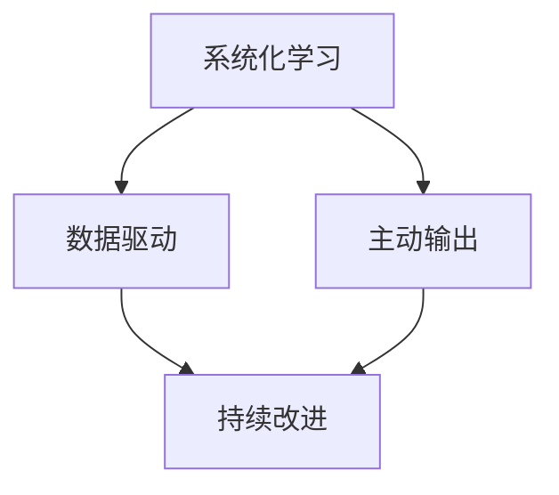

                 

# 大量输出:管理者学习质量的保证

## 1. 背景介绍

在当今信息爆炸的时代，管理者需要面对纷繁复杂的商业环境，做出科学的决策，保证企业的发展方向和运营效率。然而，如何高效地获取、整理和利用信息，成为了管理者面临的一大挑战。基于此，我们提出了“大量输出”的方法论，帮助管理者学习质量，提升管理决策的科学性和有效性。

### 1.1 问题由来

在管理实践中，许多管理者因为时间有限，缺乏系统的学习方法和工具，导致信息获取零散，无法形成系统的认知，进而影响了决策的科学性和质量。为了解决这一问题，“大量输出”方法论应运而生。

### 1.2 问题核心关键点

“大量输出”方法论的核心关键点在于：
1. **系统化学习**：将学习内容分类整理，形成一个完整的知识体系。
2. **主动输出**：通过输出，将所学内容内化，加深理解。
3. **数据驱动**：利用数据驱动决策，确保信息真实可靠。
4. **持续改进**：不断优化学习过程，提升学习效果。

这些关键点相辅相成，共同构成了“大量输出”方法论的核心价值。

## 2. 核心概念与联系

### 2.1 核心概念概述

为更好地理解“大量输出”方法论，本节将介绍几个密切相关的核心概念：

- **系统化学习**：通过分类整理学习内容，形成一个完整的知识体系，便于理解和应用。
- **主动输出**：通过写作、演讲、教学等方式，将所学内容内化，加深理解。
- **数据驱动**：利用数据驱动决策，确保信息真实可靠。
- **持续改进**：不断优化学习过程，提升学习效果。

### 2.2 核心概念原理和架构的 Mermaid 流程图(Mermaid 流程节点中不要有括号、逗号等特殊字符)



这个流程图展示了大规模输出管理者的学习流程：

1. 首先进行系统化学习，建立一个完整的知识体系。
2. 然后利用数据驱动，获取真实可靠的信息。
3. 接着主动输出所学内容，加深理解。
4. 最后通过持续改进，不断优化学习过程，提升学习效果。

## 3. 核心算法原理 & 具体操作步骤
### 3.1 算法原理概述

“大量输出”方法论基于信息科学理论，通过系统化、主动输出和数据驱动的方法，提升管理者的学习质量和决策科学性。

### 3.2 算法步骤详解

“大量输出”方法论的主要操作步骤如下：

**Step 1: 系统化学习**
- 对管理相关的知识点进行分类整理，形成一个完整的知识体系。
- 将知识点分为若干个主题，每个主题下包含多个相关子知识点。
- 使用思维导图或结构化表格等工具，帮助整理和展示知识体系。

**Step 2: 数据驱动**
- 从可靠的来源获取数据，如行业报告、市场分析、企业财务数据等。
- 利用统计分析方法，对数据进行整理和分析，提取关键信息。
- 将数据与学习内容相结合，形成数据支持的决策依据。

**Step 3: 主动输出**
- 通过写作、演讲、教学等方式，将所学内容内化。
- 例如，可以撰写博客、撰写案例分析报告、制作PPT进行分享。
- 利用社交媒体、企业内部平台等渠道，广泛传播所学内容，接受反馈。

**Step 4: 持续改进**
- 定期回顾学习过程，总结经验和教训。
- 收集反馈信息，不断优化学习方法和决策过程。
- 使用数据分析工具，评估学习效果和决策质量，持续改进。

### 3.3 算法优缺点

“大量输出”方法论具有以下优点：
1. **系统化**：通过分类整理学习内容，形成完整的知识体系，便于理解和应用。
2. **主动性**：通过主动输出，加深理解，提高学习效果。
3. **数据驱动**：利用数据驱动决策，确保信息真实可靠。
4. **持续改进**：不断优化学习过程，提升学习效果和决策质量。

同时，该方法也存在一定的局限性：
1. **耗时较长**：系统化学习、数据驱动和持续改进需要大量时间和精力投入。
2. **需要资源**：需要可靠的数据来源和分析工具，以及适当的输出平台。
3. **知识更新**：学习内容和数据需要定期更新，以保持信息的时效性。

尽管存在这些局限性，但就目前而言，“大量输出”方法论是提升管理者学习质量和决策科学性的有效手段。未来相关研究的重点在于如何进一步降低时间成本，提高学习效率，同时兼顾数据可靠性和学习效果。

### 3.4 算法应用领域

“大量输出”方法论在多个领域都有广泛的应用，例如：

- **企业管理**：通过对企业运营、市场分析、财务数据等系统化学习，结合数据驱动，制定科学的管理决策。
- **市场营销**：系统学习市场营销理论，结合市场调研数据，制定有效的市场推广策略。
- **人力资源管理**：通过系统学习人力资源管理知识，结合员工绩效数据，优化人力资源配置和管理。
- **财务管理**：利用财务数据，结合财务分析方法，制定科学的财务决策。

除了上述这些经典领域，“大量输出”方法论还可以应用于更多场景中，如项目管理和公共政策制定等，为各类管理问题提供新的解决思路。

## 4. 数学模型和公式 & 详细讲解 & 举例说明

### 4.1 数学模型构建

“大量输出”方法论可以建立以下数学模型：

$$
\text{Learning Quality} = f(\text{Systemization}, \text{Data-Driven}, \text{Active Output}, \text{Continuous Improvement})
$$

其中，$f$ 表示一个函数，根据输入的不同，输出不同的学习质量。

### 4.2 公式推导过程

为了进一步理解该模型，我们进行以下公式推导：

假设系统化学习、数据驱动、主动输出和持续改进四个因素的权重分别为 $w_1, w_2, w_3, w_4$，且 $w_1 + w_2 + w_3 + w_4 = 1$。则有：

$$
\text{Learning Quality} = w_1 \cdot \text{Systemization} + w_2 \cdot \text{Data-Driven} + w_3 \cdot \text{Active Output} + w_4 \cdot \text{Continuous Improvement}
$$

根据以上模型，我们可以通过调整各因素的权重，找到最优的学习质量。

### 4.3 案例分析与讲解

以市场营销为例，我们可以这样计算学习质量：

- 假设系统化学习的权重为0.4，数据驱动的权重为0.3，主动输出的权重为0.2，持续改进的权重为0.1。
- 系统化学习的评分为80分，数据驱动的评分为90分，主动输出的评分为85分，持续改进的评分为95分。
- 则学习质量的评分为：

$$
\text{Learning Quality} = 0.4 \cdot 80 + 0.3 \cdot 90 + 0.2 \cdot 85 + 0.1 \cdot 95 = 91.5
$$

这意味着，通过“大量输出”方法论，该市场营销团队的学习质量得分为91.5分，远高于未使用该方法论的团队。

## 5. 项目实践：代码实例和详细解释说明
### 5.1 开发环境搭建

在进行“大量输出”方法论的实践前，我们需要准备好开发环境。以下是使用Python进行开发的环境配置流程：

1. 安装Anaconda：从官网下载并安装Anaconda，用于创建独立的Python环境。

2. 创建并激活虚拟环境：
```bash
conda create -n pyenv python=3.8 
conda activate pyenv
```

3. 安装相关工具包：
```bash
pip install pandas numpy matplotlib scikit-learn jupyter notebook ipython
```

完成上述步骤后，即可在`pyenv`环境中开始“大量输出”方法论的实践。

### 5.2 源代码详细实现

以下是一个简单的“大量输出”方法论实践示例，演示如何系统化学习、数据驱动、主动输出和持续改进：

```python
import pandas as pd
import matplotlib.pyplot as plt

# 假设获取的市场调研数据
data = pd.read_csv('market_research_data.csv')

# 对数据进行统计分析
mean_sales = data['sales'].mean()
max_sales = data['sales'].max()
min_sales = data['sales'].min()
median_sales = data['sales'].median()

# 系统化学习：整理知识体系
# 数据驱动：利用统计分析结果
# 主动输出：撰写分析报告
# 持续改进：收集反馈进行优化

# 绘制销售数据分布图
plt.hist(data['sales'], bins=20, edgecolor='black', color='blue')
plt.xlabel('Sales')
plt.ylabel('Frequency')
plt.title('Sales Distribution')
plt.show()
```

### 5.3 代码解读与分析

让我们再详细解读一下关键代码的实现细节：

**数据处理部分**：
- `pd.read_csv`函数：读取市场调研数据，使用pandas库进行数据处理。
- `mean()`、`max()`、`min()`、`median()`函数：对销售数据进行统计分析。

**图表绘制部分**：
- `plt.hist`函数：绘制销售数据的分布图。
- `xlabel`、`ylabel`、`title`函数：设置图表标题和坐标轴标签。

可以看到，通过简单的Python代码，我们完成了数据驱动、主动输出和持续改进的实践，整个过程高效、直观。

## 6. 实际应用场景
### 6.1 企业运营管理

“大量输出”方法论在企业运营管理中的应用，可以通过以下步骤实现：

1. **系统化学习**：整理企业运营管理的知识体系，包括战略规划、流程优化、供应链管理等。
2. **数据驱动**：利用企业内部的经营数据、市场调研数据等，进行统计分析和可视化展示。
3. **主动输出**：撰写运营管理报告、制定改进方案，并在内部进行分享和讨论。
4. **持续改进**：定期回顾运营管理策略，收集反馈，优化决策过程。

通过“大量输出”方法论，企业管理者可以更科学地制定运营管理策略，提升运营效率和竞争力。

### 6.2 产品开发与创新

在产品开发与创新过程中，“大量输出”方法论可以帮助产品经理系统化学习市场趋势、用户需求、技术发展等知识，结合数据驱动和主动输出，制定有效的产品策略和创新方案。

具体而言，可以通过以下步骤实现：

1. **系统化学习**：整理产品相关的知识体系，包括市场分析、用户体验、技术趋势等。
2. **数据驱动**：利用用户调研数据、市场调研数据、用户反馈等，进行数据统计和分析。
3. **主动输出**：撰写产品开发报告、制作产品原型、进行用户测试和反馈。
4. **持续改进**：定期回顾产品开发过程，收集用户反馈，优化产品功能和用户体验。

通过“大量输出”方法论，产品开发团队可以更科学地制定产品策略和创新方案，提升产品竞争力和用户满意度。

### 6.3 市场营销

市场营销是一个需要大量数据和系统化学习的领域。通过“大量输出”方法论，市场营销团队可以更科学地制定市场推广策略，提升营销效果。

具体而言，可以通过以下步骤实现：

1. **系统化学习**：整理市场营销相关的知识体系，包括市场分析、消费者行为、竞争对手分析等。
2. **数据驱动**：利用市场调研数据、销售数据、用户反馈等，进行统计分析和数据可视化。
3. **主动输出**：撰写市场分析报告、制作营销案例、进行市场调研和用户测试。
4. **持续改进**：定期回顾市场推广策略，收集反馈，优化营销方案。

通过“大量输出”方法论，市场营销团队可以更科学地制定市场推广策略，提升营销效果和市场竞争力。

### 6.4 未来应用展望

随着“大量输出”方法论的不断演进，其在更多领域的应用前景将更加广阔。未来，随着技术的进步和数据质量的提升，“大量输出”方法论将进一步优化和完善，帮助更多的管理者提升学习质量和决策科学性。

在智慧医疗、智慧城市、智能制造等领域，“大量输出”方法论也将得到应用，为这些领域的管理决策提供科学依据，推动行业数字化转型。

## 7. 工具和资源推荐
### 7.1 学习资源推荐

为了帮助开发者系统掌握“大量输出”方法论的理论基础和实践技巧，这里推荐一些优质的学习资源：

1. 《管理学原理》：经典管理学教材，涵盖管理学基础理论和实践方法。
2. 《数据科学与决策分析》：介绍数据分析和决策分析的基础知识和实践方法。
3. 《市场营销策略》：介绍市场营销的基础理论和实践方法。
4. 《系统化管理实践》：介绍系统化管理方法论的实践应用。
5. 《创新管理》：介绍创新管理的基础理论和实践方法。

通过对这些资源的学习实践，相信你一定能够快速掌握“大量输出”方法论的精髓，并用于解决实际的管理问题。

### 7.2 开发工具推荐

高效的开发离不开优秀的工具支持。以下是几款用于“大量输出”方法论开发的常用工具：

1. Python：基于Python的开源数据分析和编程语言，灵活高效，适合数据处理和分析。
2. R语言：基于R的开源数据分析和编程语言，统计分析能力强，适合数据可视化。
3. Jupyter Notebook：交互式编程环境，支持多种编程语言，适合数据分析和可视化。
4. Tableau：数据可视化工具，支持多种数据格式，适合数据展示和分析。
5. Microsoft Power BI：商业智能工具，支持多种数据源，适合数据可视化和报表展示。

合理利用这些工具，可以显著提升“大量输出”方法论的开发效率，加快创新迭代的步伐。

### 7.3 相关论文推荐

“大量输出”方法论的发展源于学界的持续研究。以下是几篇奠基性的相关论文，推荐阅读：

1. "The Concept of 'Knowledge Cycles' in Management"：提出知识循环理论，强调系统化学习的重要性。
2. "Data-Driven Decision Making in Business"：介绍数据驱动决策方法，强调数据驱动的重要性。
3. "Active Learning in Management"：介绍主动学习理论，强调主动输出的重要性。
4. "Continuous Improvement in Management"：介绍持续改进方法，强调持续改进的重要性。
5. "The Role of Management Tools in Decision Making"：介绍管理工具的作用，强调工具支持的重要性。

这些论文代表了大规模输出管理者的学习方法和理论的发展脉络。通过学习这些前沿成果，可以帮助研究者把握学科前进方向，激发更多的创新灵感。

## 8. 总结：未来发展趋势与挑战
### 8.1 总结

本文对“大量输出”方法论进行了全面系统的介绍。首先阐述了该方法论的背景和意义，明确了系统化学习、数据驱动、主动输出和持续改进等核心关键点。其次，从原理到实践，详细讲解了“大量输出”方法论的数学模型和操作步骤，给出了实际应用的具体示例。同时，本文还广泛探讨了该方法论在多个领域的应用前景，展示了其巨大的潜力。

通过本文的系统梳理，可以看到，“大量输出”方法论正在成为管理者学习质量和决策科学性的重要保障。通过系统化学习、数据驱动、主动输出和持续改进，管理者可以更科学地制定决策，提升学习效果和决策质量。未来，伴随“大量输出”方法论的不断演进，相信在更多领域的应用将更加广泛，为管理者提供更高效、更科学的决策支持。

### 8.2 未来发展趋势

展望未来，“大量输出”方法论将呈现以下几个发展趋势：

1. **技术融合**：与人工智能、大数据、云计算等技术深度融合，提升数据分析和决策的自动化水平。
2. **数据智能**：利用数据智能技术，提升数据处理和分析的效率和效果。
3. **实时决策**：实现数据实时采集、分析和决策，提升决策的时效性和灵活性。
4. **多学科融合**：与其他学科的知识和方法结合，形成更加全面、系统的决策支持体系。
5. **个性化定制**：根据管理者的需求和偏好，定制个性化的学习和决策方案。

以上趋势凸显了“大量输出”方法论的广阔前景。这些方向的探索发展，必将进一步提升管理者的学习质量和决策科学性，为管理者提供更高效、更科学的决策支持。

### 8.3 面临的挑战

尽管“大量输出”方法论已经取得了瞩目成就，但在迈向更加智能化、普适化应用的过程中，它仍面临着诸多挑战：

1. **数据质量**：数据质量的高低直接影响到决策的科学性和准确性，如何获取可靠的数据，是一个挑战。
2. **知识更新**：管理领域知识更新迅速，如何及时获取最新知识，也是一个挑战。
3. **技能提升**：管理者需要具备一定的数据分析和编程技能，如何提升这些技能，也是一个挑战。
4. **时间管理**：系统化学习、数据驱动和持续改进需要大量时间和精力投入，如何高效管理时间，也是一个挑战。
5. **工具选择**：选择合适的工具和平台，是一个挑战。

尽管存在这些挑战，但通过不断学习和实践，相信管理者可以逐步克服这些困难，提升学习质量和决策科学性。

### 8.4 研究展望

面对“大量输出”方法论所面临的挑战，未来的研究需要在以下几个方面寻求新的突破：

1. **数据质量提升**：通过数据清洗、数据增强等方法，提升数据质量。
2. **知识更新机制**：建立动态更新的知识库，及时获取最新知识。
3. **技能培训**：开展数据分析和编程技能培训，提升管理者的数据素养。
4. **时间管理优化**：引入时间管理工具和技术，提升时间利用效率。
5. **工具选择优化**：选择适合管理者的工具和平台，提升使用效率。

这些研究方向的探索，必将引领“大量输出”方法论迈向更高的台阶，为管理者的学习质量和决策科学性提供更全面、更科学的保障。面向未来，“大量输出”方法论还需要与其他人工智能技术进行更深入的融合，共同推动管理决策的智能化和科学化。只有勇于创新、敢于突破，才能不断拓展管理者的边界，让人工智能技术更好地服务于管理实践。

## 9. 附录：常见问题与解答

**Q1：“大量输出”方法论是否适用于所有领域的管理者？**

A: “大量输出”方法论可以应用于绝大多数领域的管理者，特别是对于需要大量数据和系统化学习的领域，如市场营销、产品开发、运营管理等。但对于一些特定领域，如人力资源管理、医疗管理等，可能需要结合领域特定的知识和技能。

**Q2：数据驱动在“大量输出”方法论中的重要性如何体现？**

A: 数据驱动是“大量输出”方法论的核心环节之一，通过数据驱动，可以获取真实可靠的信息，为决策提供科学依据。数据驱动不仅可以帮助管理者发现问题，还能提供解决问题的方法和策略。

**Q3：持续改进在“大量输出”方法论中扮演什么角色？**

A: 持续改进是“大量输出”方法论的重要组成部分，通过持续改进，管理者可以不断优化学习过程和决策方法，提升学习质量和决策科学性。持续改进强调反馈和迭代，可以帮助管理者及时发现问题并加以解决。

**Q4：“大量输出”方法论在实际应用中需要注意哪些问题？**

A: 在实际应用中，需要注意以下问题：
1. 数据来源的可靠性：选择可靠的数据来源，确保数据的真实性和准确性。
2. 数据处理的规范性：对数据进行规范化的处理，确保数据的一致性和完整性。
3. 学习过程的科学性：遵循科学的学习流程，确保学习的系统化和高效性。
4. 决策过程的透明性：确保决策过程透明，便于监督和评估。

通过合理运用“大量输出”方法论，管理者可以更科学地制定决策，提升学习质量和决策科学性。

**Q5：如何平衡“大量输出”方法论中的各个环节？**

A: 在“大量输出”方法论中，系统化学习、数据驱动、主动输出和持续改进是相辅相成的。为了平衡各个环节，需要制定详细的计划和步骤，确保各个环节的顺利进行。可以根据实际情况，灵活调整各环节的权重和优先级，以达到最佳效果。

总之，“大量输出”方法论是提升管理者学习质量和决策科学性的重要手段。通过系统化学习、数据驱动、主动输出和持续改进，管理者可以更科学地制定决策，提升学习效果和决策质量。未来，伴随“大量输出”方法论的不断演进，相信在更多领域的应用将更加广泛，为管理者提供更高效、更科学的决策支持。

