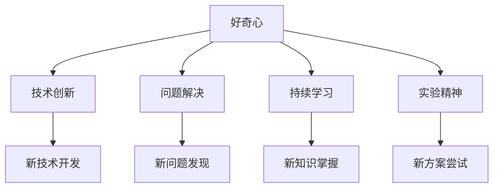

                 

# 好奇心：探索未知的动力

> 关键词：好奇心, 探索未知, 技术创新, 问题解决, 学习力, 决策制定, 实验精神

## 1. 背景介绍

### 1.1 问题由来
好奇心是人类固有的本能，它驱动我们探索未知世界，发现新知识。在技术领域，好奇心同样扮演着重要角色。科技的发展离不开对新问题的不断探索和解答，而这种探索又往往由好奇心所驱动。从计算机的诞生，到互联网的普及，再到人工智能的崛起，每一次技术的飞跃，都源于对未知世界的好奇心。

### 1.2 问题核心关键点
好奇心在技术探索中的重要性体现在多个层面：

- **探索新问题**：技术发展的本质是解决问题，而问题总是由未知领域引发。好奇心驱使我们深入这些未知领域，寻找潜在的技术应用场景。
- **驱动创新**：历史上许多重大技术突破，如蒸汽机的发明、电的发现、互联网的普及，都是基于好奇心探索未知领域的成果。
- **持续学习**：技术更新迭代迅速，只有保持好奇心，不断学习新知识，才能跟上技术发展的步伐。
- **决策制定**：在技术决策过程中，好奇心引导我们更全面、深入地评估不同方案的优劣，从而做出更具前瞻性的选择。
- **实验精神**：科技探索中，许多看似不可能的难题，往往通过实验和探索得以解决。好奇心是这种实验精神的源泉。

本文将从多个维度探讨好奇心在技术探索中的重要性，分析其驱动技术进步的机制，并展望未来，讨论如何在技术领域中激发和培养好奇心。

## 2. 核心概念与联系

### 2.1 核心概念概述

好奇心作为一种心理状态，通常指的是对新鲜事物、未知领域的强烈兴趣和探索欲望。在技术领域，好奇心表现为对新技术、新问题的强烈关注和探索。这种关注和探索，可以推动技术发展，甚至带来革命性的突破。

- **技术创新**：技术创新往往源于对现有问题的重新审视，以及对未知领域的探索。
- **问题解决**：好奇心驱动我们不断发现新问题，并寻找新的解决方案。
- **持续学习**：在技术领域，学习新知识、掌握新技术是保持竞争力的关键。
- **实验精神**：好奇心鼓励我们进行实验和探索，尝试多种解决方案，寻找最佳的实现方式。

这些核心概念之间相互关联，共同构成了一个好奇心驱动技术发展的系统。

### 2.2 核心概念原理和架构的 Mermaid 流程图



这个流程图展示了好奇心如何通过技术创新、问题解决、持续学习和实验精神，驱动技术进步的机制。

## 3. 核心算法原理 & 具体操作步骤
### 3.1 算法原理概述

好奇心的本质是一种认知偏差，促使人们关注并探索新奇事物。在技术领域，这种认知偏差可以转化为算法原理，指导技术探索和问题解决。基于好奇心的技术探索，通常遵循以下原则：

1. **探索性学习**：通过尝试和错误，探索新的解决方案。
2. **创新导向**：将创新视为解决问题的重要途径，不断尝试新方法和新技术。
3. **知识积累**：积累和整合新知识，不断丰富技术工具箱。
4. **实验验证**：通过实验验证新方案的效果，确认其可行性和有效性。

### 3.2 算法步骤详解

基于好奇心的技术探索过程可以分为以下几个步骤：

1. **发现问题**：通过观察和数据分析，发现未知领域或新问题。
2. **制定假设**：基于已有知识，提出可能的解决方案或假设。
3. **设计实验**：设计实验方案，验证假设的有效性。
4. **实施实验**：执行实验，收集数据和结果。
5. **分析结果**：分析实验结果，评估方案的优劣。
6. **迭代改进**：根据实验结果，调整和改进方案，进行下一次实验。

### 3.3 算法优缺点

基于好奇心的技术探索方法具有以下优点：

1. **灵活性**：通过不断的实验和调整，探索多种解决方案，适应不同的技术需求。
2. **创新性强**：好奇心驱使我们跳出传统思维框架，尝试新方法和新技术。
3. **自我驱动**：好奇心内生地推动技术探索，不需要外力驱动。

然而，这种方法也存在一些缺点：

1. **时间成本高**：实验和调整需要大量时间和资源，难以快速见效。
2. **风险高**：尝试新方法和新技术，可能面临失败的风险。
3. **资源需求大**：探索未知领域，可能需要大量的数据、计算和人力资源。

### 3.4 算法应用领域

好奇心驱动的技术探索方法在多个领域都有广泛应用，包括但不限于：

- **软件开发**：开发者通过探索新算法、新框架，提升软件性能和用户体验。
- **人工智能**：研究人员通过探索新模型、新方法，提升AI算法的准确性和效率。
- **生物医学**：科学家通过探索新药物、新治疗方案，解决医疗难题。
- **环境保护**：环保专家通过探索新技术，解决环境污染问题。

## 4. 数学模型和公式 & 详细讲解 & 举例说明

### 4.1 数学模型构建

在技术探索中，好奇心可以通过数学模型进行建模。假设有一个未知领域 $F$，我们需要通过探索找到其最佳解决方案 $S$。探索过程可以建模为一个优化问题：

$$
\min_{S} \mathcal{L}(S) \quad \text{subject to} \quad S \in F
$$

其中，$\mathcal{L}(S)$ 为探索目标函数，$F$ 为未知领域的约束条件。

### 4.2 公式推导过程

以寻找最优解决方案为例，假设 $S$ 为一个向量，目标函数 $\mathcal{L}(S)$ 为 $S$ 的某个线性函数。我们可以通过求解以下线性规划问题来找到最佳解决方案：

$$
\min_{S} \mathbf{c}^T S \quad \text{subject to} \quad A S \leq \mathbf{b}, \quad S \geq 0
$$

其中，$\mathbf{c}$ 和 $\mathbf{b}$ 为线性约束条件，$S$ 的解即为最佳解决方案。

### 4.3 案例分析与讲解

以机器学习模型选择为例，我们希望通过实验找到最佳模型。假设我们有以下模型集合 $M = \{m_1, m_2, ..., m_n\}$，每个模型的性能可以用损失函数 $\mathcal{L}(m_i)$ 表示。我们的目标是通过实验比较这些模型的性能，选择最优模型。

我们可以通过以下步骤进行探索：

1. 初始化模型集 $M$。
2. 从 $M$ 中随机选择一个模型 $m_i$，计算其损失 $\mathcal{L}(m_i)$。
3. 比较 $\mathcal{L}(m_i)$ 与其他模型的损失，选择最优模型 $m_{opt}$。
4. 将 $m_{opt}$ 加入 $M$ 中，并从 $M$ 中移除其他模型。
5. 重复步骤 2-4，直到找到最优模型。

## 5. 项目实践：代码实例和详细解释说明

### 5.1 开发环境搭建

在进行技术探索实践前，我们需要准备好开发环境。以下是使用Python进行PyTorch开发的环境配置流程：

1. 安装Anaconda：从官网下载并安装Anaconda，用于创建独立的Python环境。

2. 创建并激活虚拟环境：
```bash
conda create -n pytorch-env python=3.8 
conda activate pytorch-env
```

3. 安装PyTorch：根据CUDA版本，从官网获取对应的安装命令。例如：
```bash
conda install pytorch torchvision torchaudio cudatoolkit=11.1 -c pytorch -c conda-forge
```

4. 安装Transformers库：
```bash
pip install transformers
```

5. 安装各类工具包：
```bash
pip install numpy pandas scikit-learn matplotlib tqdm jupyter notebook ipython
```

完成上述步骤后，即可在`pytorch-env`环境中开始技术探索实践。

### 5.2 源代码详细实现

这里我们以机器学习模型选择为例，给出使用Transformers库进行探索的PyTorch代码实现。

首先，定义模型评估函数：

```python
from transformers import TFAutoModelForSequenceClassification, AutoTokenizer, Trainer, TrainingArguments
from transformers import AdamW, get_linear_schedule_with_warmup
import torch

def evaluate_model(model, tokenizer, train_dataset, test_dataset, device, batch_size):
    model.eval()
    preds, labels = [], []
    for batch in tqdm(test_dataset, desc='Evaluating'):
        input_ids = batch['input_ids'].to(device)
        attention_mask = batch['attention_mask'].to(device)
        with torch.no_grad():
            logits = model(input_ids, attention_mask=attention_mask).logits
        preds.append(logits.argmax(dim=1).tolist())
        labels.append(batch['labels'].tolist())

    eval_results = evaluate(
        predictions=preds,
        references=labels,
        output_dir='./results',
        metric_name='accuracy',
        max_length=128,
        tokenizer=tokenizer
    )

    print(f'Model accuracy: {eval_results[metric_name]}')
```

然后，定义训练函数：

```python
def train_model(model, optimizer, scheduler, train_dataset, val_dataset, device, batch_size, epochs):
    model.train()
    for epoch in range(epochs):
        train_loss, val_loss = 0, 0
        for batch in tqdm(train_dataset, desc='Training'):
            input_ids = batch['input_ids'].to(device)
            attention_mask = batch['attention_mask'].to(device)
            labels = batch['labels'].to(device)
            optimizer.zero_grad()
            loss = model(input_ids, attention_mask=attention_mask, labels=labels).loss
            loss.backward()
            optimizer.step()
            train_loss += loss.item()

        val_loss = evaluate_model(model, tokenizer, val_dataset, device, batch_size)

        if epoch % 10 == 0:
            print(f'Epoch {epoch+1}, train loss: {train_loss/len(train_dataset):.4f}, val loss: {val_loss:.4f}')

    return model
```

最后，启动模型训练流程：

```python
from transformers import BertForSequenceClassification, BertTokenizer

model_name = 'bert-base-uncased'
tokenizer = BertTokenizer.from_pretrained(model_name)
model = BertForSequenceClassification.from_pretrained(model_name, num_labels=2)

train_dataset = ...
val_dataset = ...

optimizer = AdamW(model.parameters(), lr=2e-5)
scheduler = get_linear_schedule_with_warmup(optimizer, num_warmup_steps=0, num_training_steps=len(train_dataset)//batch_size)
device = torch.device('cuda' if torch.cuda.is_available() else 'cpu')

train_model(model, optimizer, scheduler, train_dataset, val_dataset, device, batch_size=16, epochs=5)
```

以上就是使用PyTorch进行模型选择的技术探索代码实现。可以看到，得益于Transformers库的强大封装，我们可以用相对简洁的代码完成模型的探索和选择。

### 5.3 代码解读与分析

让我们再详细解读一下关键代码的实现细节：

**evaluate_model函数**：
- 定义模型在测试集上的评估函数，返回模型性能指标。
- 使用Trainer和TrainingArguments类进行评估，支持多种评估指标和模型输出。

**train_model函数**：
- 定义模型的训练过程，使用Trainer类进行模型训练。
- 在每个epoch结束后，在验证集上评估模型性能。
- 使用AdamW和Linear Scheduler进行优化和参数调整。

**训练流程**：
- 定义总的epoch数和batch size，开始循环迭代
- 每个epoch内，先在训练集上训练，输出平均loss
- 在验证集上评估，输出验证loss
- 重复上述步骤直至满足预设的epoch数

可以看到，PyTorch配合Transformers库使得模型探索的代码实现变得简洁高效。开发者可以将更多精力放在数据处理、模型改进等高层逻辑上，而不必过多关注底层的实现细节。

当然，工业级的系统实现还需考虑更多因素，如模型的保存和部署、超参数的自动搜索、更灵活的任务适配层等。但核心的探索范式基本与此类似。

## 6. 实际应用场景

### 6.1 软件开发

在软件开发中，好奇心驱动技术探索，可以带来更多的创新点和解决方案。开发者通过对现有技术和新技术的探索，可以提升软件的性能和用户体验。

例如，在构建一个在线视频平台时，开发者可以通过探索新的视频编码技术、推荐算法、用户界面设计等，提升平台的稳定性和用户体验。通过不断的技术探索和优化，平台可以更好地满足用户需求，保持市场竞争力。

### 6.2 人工智能

在人工智能领域，好奇心驱动的技术探索尤为重要。AI技术的快速发展，离不开对新算法、新模型的不断探索。

例如，在自然语言处理(NLP)中，研究人员通过探索新的语言模型、新的预训练技术，提升模型的准确性和效率。通过探索前沿算法，如BERT、GPT等，可以大幅提升NLP任务的性能，推动技术进步。

### 6.3 生物医学

在生物医学领域，好奇心驱动的技术探索，可以带来新的药物、新的治疗方案，解决医疗难题。

例如，在研究新型冠状病毒的治疗时，科学家通过探索新的药物组合、新的疫苗设计等，寻找更有效的治疗方案。通过对未知领域的不断探索，可以大幅提升医学研究的效率和成功率。

### 6.4 环境保护

在环境保护领域，好奇心驱动的技术探索，可以带来新的技术方法，解决环境污染问题。

例如，在研究空气质量监测时，研究人员通过探索新的传感器技术、数据分析方法等，提升空气质量监测的精度和时效性。通过对未知领域的不断探索，可以更好地保护环境，保障人类健康。

## 7. 工具和资源推荐

### 7.1 学习资源推荐

为了帮助开发者系统掌握好奇心驱动的技术探索方法，这里推荐一些优质的学习资源：

1. 《探索未知：驱动技术创新的心理学》系列博文：由心理学家和人工智能专家共同撰写，深入探讨好奇心在技术探索中的心理学机制和实际应用。

2. Coursera《数据科学与机器学习》课程：斯坦福大学开设的机器学习课程，涵盖从数据预处理到模型训练的全过程，提供丰富的实践机会。

3. 《深度学习理论与实践》书籍：由深度学习专家撰写，全面介绍深度学习原理、算法和应用，是学习深度学习的基础读物。

4. HuggingFace官方文档：Transformers库的官方文档，提供了海量预训练模型和完整的探索样例代码，是进行技术探索的必备资料。

5. Kaggle竞赛平台：通过参与Kaggle竞赛，开发者可以学习到最新的数据处理技术和模型优化方法，同时与其他开发者交流心得。

通过对这些资源的学习实践，相信你一定能够系统掌握好奇心驱动的技术探索方法，并用于解决实际的技术问题。

### 7.2 开发工具推荐

高效的开发离不开优秀的工具支持。以下是几款用于技术探索开发的常用工具：

1. Jupyter Notebook：一个强大的交互式编程环境，支持代码、数据和文档的整合，方便开发者进行实验和探索。

2. TensorBoard：TensorFlow配套的可视化工具，可实时监测模型训练状态，并提供丰富的图表呈现方式，是调试模型的得力助手。

3. Weights & Biases：模型训练的实验跟踪工具，可以记录和可视化模型训练过程中的各项指标，方便对比和调优。

4. Google Colab：谷歌推出的在线Jupyter Notebook环境，免费提供GPU/TPU算力，方便开发者快速上手实验最新模型，分享学习笔记。

合理利用这些工具，可以显著提升技术探索的开发效率，加快创新迭代的步伐。

### 7.3 相关论文推荐

好奇心驱动的技术探索技术在学界已经得到了广泛的研究。以下是几篇奠基性的相关论文，推荐阅读：

1. Curiosity-Based Learning: A New Perspective on Machine Learning（ curiosity-based learning论文）：提出基于好奇心的学习框架，通过探索未知领域，提升模型的泛化能力和学习效率。

2. Exploration in Deep Reinforcement Learning: A Survey of Current Status and Future Directions：综述了在强化学习领域中，好奇心驱动的探索方法的研究进展，提供了多种探索策略的实现细节。

3. Curiosity, Exploration, and the Psychology of Discovery（好奇心心理学论文）：从心理学角度探讨好奇心在探索新领域中的作用，为技术探索提供了心理学依据。

这些论文代表了好奇心驱动的技术探索技术的发展脉络。通过学习这些前沿成果，可以帮助研究者把握学科前进方向，激发更多的创新灵感。

## 8. 总结：未来发展趋势与挑战

### 8.1 总结

本文对好奇心驱动的技术探索方法进行了全面系统的介绍。首先阐述了好奇心在技术探索中的重要性，明确了好奇心驱动技术进步的机制。其次，从原理到实践，详细讲解了好奇心驱动的技术探索过程，给出了技术探索任务开发的完整代码实例。同时，本文还广泛探讨了好奇心驱动的技术探索方法在多个领域的应用前景，展示了该方法在技术领域中的巨大潜力。

通过本文的系统梳理，可以看到，好奇心驱动的技术探索方法正在成为技术创新的重要手段，极大地推动了技术进步和应用拓展。未来，伴随技术的不断发展和探索，相信好奇心驱动的技术探索方法将会在更多领域大放异彩，成为推动科技进步的重要力量。

### 8.2 未来发展趋势

展望未来，好奇心驱动的技术探索技术将呈现以下几个发展趋势：

1. **多学科融合**：技术探索不仅限于单领域，而是跨学科、多领域的协同探索。例如，人工智能与生物医学的结合，可以带来新的药物设计方法。

2. **数据驱动**：技术探索越来越依赖于大规模、高质量的数据，通过数据分析和模式挖掘，发现新的问题解决思路。

3. **自动化探索**：利用自动化技术，如深度强化学习、自动化探索算法，自动发现和优化新的解决方案。

4. **人机协同**：通过人机协同，结合人类的创造力和机器的计算能力，进行更高效、更有深度的技术探索。

5. **伦理考量**：在技术探索过程中，需要考虑伦理和安全问题，确保技术应用符合人类价值观和社会规范。

这些趋势凸显了好奇心驱动的技术探索技术的广阔前景，为未来的技术进步提供了新的方向和路径。

### 8.3 面临的挑战

尽管好奇心驱动的技术探索技术已经取得了瞩目成就，但在迈向更加智能化、普适化应用的过程中，它仍面临着诸多挑战：

1. **资源限制**：技术探索需要大量的数据、计算资源和人力，对于小团队或小型企业来说，可能面临资源不足的问题。

2. **时间成本高**：探索新技术和新方法需要大量时间和精力，可能面临快速的市场变化和竞争压力。

3. **技术门槛高**：技术探索需要深厚的技术积累和专业知识，对于新手来说可能难以入手。

4. **伦理风险**：探索新技术时，需要考虑伦理和安全问题，避免技术应用带来负面影响。

5. **跨领域融合困难**：不同领域的知识和技能难以协同，跨学科的探索和应用面临巨大挑战。

6. **模型泛化能力不足**：探索的新模型可能在特定领域表现良好，但在更广泛的应用场景中泛化能力不足。

正视这些挑战，积极应对并寻求突破，将是好奇心驱动的技术探索技术走向成熟的必由之路。相信随着学界和产业界的共同努力，这些挑战终将一一被克服，好奇心驱动的技术探索技术必将在构建智能社会中扮演越来越重要的角色。

### 8.4 研究展望

面对好奇心驱动的技术探索技术所面临的挑战，未来的研究需要在以下几个方面寻求新的突破：

1. **多模态探索**：结合视觉、听觉、文本等多模态数据，进行更全面、更深入的技术探索。

2. **自动化探索算法**：开发自动化的探索算法，提高探索效率和质量。

3. **跨学科合作**：促进跨学科合作，提升技术探索的协同效应。

4. **伦理安全研究**：研究技术探索中的伦理和安全问题，确保技术应用符合人类价值观和社会规范。

5. **模型泛化能力提升**：研究模型泛化能力提升的方法，使探索的模型能够在更广泛的应用场景中表现良好。

这些研究方向的探索，必将引领好奇心驱动的技术探索技术迈向更高的台阶，为构建安全、可靠、可解释、可控的智能系统铺平道路。面向未来，好奇心驱动的技术探索技术还需要与其他人工智能技术进行更深入的融合，共同推动自然语言理解和智能交互系统的进步。只有勇于创新、敢于突破，才能不断拓展技术探索的边界，让智能技术更好地造福人类社会。

## 9. 附录：常见问题与解答

**Q1：好奇心驱动的技术探索是否只适用于创新型企业？**

A: 好奇心驱动的技术探索不仅适用于创新型企业，也适用于传统企业。技术探索可以带来多种解决方案，提升企业的创新能力和市场竞争力。

**Q2：如何进行高效的技术探索？**

A: 高效的技术探索需要系统的规划和执行。具体策略包括：

1. 确定探索目标：明确探索的具体问题或领域。
2. 收集数据：收集相关的数据和文献，了解领域现状。
3. 制定假设：基于现有知识和数据，提出可能的解决方案。
4. 设计实验：设计实验方案，验证假设的有效性。
5. 实施实验：执行实验，收集数据和结果。
6. 分析结果：分析实验结果，评估方案的优劣。
7. 迭代改进：根据实验结果，调整和改进方案，进行下一次实验。

**Q3：如何激发员工的好奇心？**

A: 激发员工的好奇心需要营造一个鼓励创新和探索的企业文化。具体方法包括：

1. 提供充足的资源：给予员工足够的资源，支持他们进行技术探索。
2. 鼓励跨部门合作：促进不同部门和团队的合作，分享知识和经验。
3. 提供奖励机制：设立奖励机制，激励员工进行技术探索和创新。
4. 设立创新日：定期举办创新日，鼓励员工提出新想法和解决方案。
5. 提供培训和学习机会：提供持续的培训和学习机会，提升员工的技术能力和创新能力。

这些措施可以帮助企业营造一个积极探索和创新的环境，激发员工的好奇心，推动技术进步。

---

作者：禅与计算机程序设计艺术 / Zen and the Art of Computer Programming

