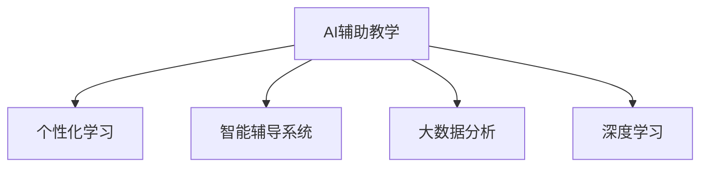

                 

# 如何利用技术能力进行教育创新

> 关键词：技术融合,教育创新,个性化学习,智能辅导,大数据分析,深度学习

## 1. 背景介绍

### 1.1 问题由来
教育，作为人类传承知识和智慧的重要手段，经历了数千年的发展历程。然而，传统教育模式的局限性也日渐凸显。知识传递单向、互动性不足、学习效果评估困难等问题，使得教育资源的利用效率低下，难以满足个性化学习需求。近年来，随着信息技术和人工智能的迅猛发展，利用技术手段创新教育方式，提升教育质量，已成为全球教育界和科技界共同关注的重要课题。

### 1.2 问题核心关键点
教育创新的核心在于融合现代信息技术，尤其是人工智能、大数据、深度学习等技术手段，构建一个更加智能化、个性化、互动化的教育系统。具体关键点包括：

- 数据驱动：通过采集、分析学生学习行为数据，洞察学习规律，优化教学策略。
- 智能辅导：利用算法生成个性化学习路径和辅导方案，提升学习效果。
- 动态评估：实时监测学生学习状态，精准评估学习效果，动态调整教学计划。
- 技术融合：将AI技术、VR技术、AR技术等融合应用到教育场景中，增强教学体验。
- 数据隐私：保护学生数据隐私，确保数据安全，合规使用。

## 2. 核心概念与联系

### 2.1 核心概念概述

为更好地理解如何利用技术能力进行教育创新，本节将介绍几个密切相关的核心概念：

- **AI辅助教学**：利用人工智能技术，如自然语言处理(NLP)、机器学习(ML)、计算机视觉(CV)等，辅助教师进行教学设计和辅导，提升教学效率。
- **个性化学习**：根据学生的学习特点、兴趣爱好、学习进度等，提供个性化的学习资源、路径和评估方法，满足不同学生的需求。
- **智能辅导系统**：结合人工智能技术和大数据分析，为学生提供智能化的学习辅导，包括智能答疑、个性化推荐、动态评估等功能。
- **大数据分析**：通过采集、清洗、分析大规模教育数据，揭示学习规律，预测学生行为，优化教育资源配置。
- **深度学习**：利用深度神经网络模型，进行数据驱动的决策和学习，提升教学和评估的精度和效率。

这些核心概念之间的逻辑关系可以通过以下Mermaid流程图来展示：



这个流程图展示了几大核心概念之间的关系：

1. AI辅助教学利用多模态信息，提升教师教学设计的智能化水平。
2. 个性化学习通过分析学生数据，为每个学生量身定制学习方案。
3. 智能辅导系统通过智能算法，辅助学生自主学习，实时评估学习效果。
4. 大数据分析通过综合多方数据，洞察学习规律，优化教学策略。
5. 深度学习通过数据驱动，提升教学和评估的精度和效率。

这些概念共同构成了现代教育技术创新的技术框架，为构建智能、个性化、高效的教育系统提供了坚实的理论基础。

## 3. 核心算法原理 & 具体操作步骤
### 3.1 算法原理概述

教育创新的核心在于融合人工智能和大数据技术，构建一个智能化的教育系统。这一系统通过实时采集学生学习数据，结合深度学习算法进行分析，为每个学生提供个性化的学习路径和辅导方案，实时评估学习效果，不断优化教学策略。

具体而言，教育创新的算法原理包括：

- **数据采集与清洗**：通过各种传感器和软件工具，实时采集学生学习过程中的数据，包括行为数据、认知数据、情感数据等。
- **特征提取与建模**：使用数据挖掘和机器学习技术，从大规模数据中提取特征，建立学生学习行为模型。
- **个性化学习路径生成**：根据学生的学习特征，利用推荐系统算法生成个性化学习资源和路径。
- **智能辅导与评估**：结合自然语言处理和智能答疑技术，实时解答学生问题，动态评估学习效果，调整学习策略。

### 3.2 算法步骤详解

基于上述算法原理，教育创新的具体操作步骤分为以下几个关键步骤：

**Step 1: 数据采集与预处理**

- 使用各类传感器和软件工具，实时采集学生的学习数据，包括点击行为、学习时长、答题情况等。
- 对采集到的数据进行清洗和标准化处理，去除噪声和异常值，保证数据质量。

**Step 2: 特征提取与建模**

- 利用数据挖掘和机器学习技术，从学生数据中提取特征，如学习时间、答题难度、情感变化等。
- 建立学生学习行为模型，如学生行为预测模型、情感分析模型等，为后续的个性化学习路径生成和智能辅导提供依据。

**Step 3: 个性化学习路径生成**

- 根据学生学习行为模型，结合推荐系统算法，生成个性化的学习路径和资源推荐。
- 考虑学生的兴趣爱好、学习进度等因素，动态调整学习路径，确保学习资源与学生需求匹配。

**Step 4: 智能辅导与实时评估**

- 利用自然语言处理技术，建立智能答疑系统，实时解答学生问题，提供个性化辅导。
- 结合评估算法，实时监测学生学习状态，动态调整学习策略，保证学习效果。

**Step 5: 反馈与优化**

- 根据学习评估结果，收集学生反馈，进一步优化学习路径和辅导方案。
- 定期更新学习模型，迭代改进算法，提升教育系统的智能水平。

### 3.3 算法优缺点

教育创新的算法具有以下优点：

- **高效个性化**：通过数据分析和模型建立，能够实现对每个学生的个性化教学，提升学习效果。
- **实时动态**：能够实时监测学生学习状态，动态调整教学策略，保证学习效率。
- **智能化水平高**：结合多种人工智能技术，如NLP、ML、CV等，提供智能化的教学和辅导。

但同时，该算法也存在一些局限性：

- **数据隐私问题**：大量学生数据的采集和使用，涉及隐私保护问题，需要严格的数据治理。
- **算法复杂度高**：涉及多种复杂算法，需要大量的技术资源和专业知识。
- **模型可解释性不足**：部分算法的决策过程较为复杂，缺乏可解释性，难以调试和优化。

尽管存在这些局限性，但就目前而言，融合AI和大数据的教育创新方法，仍是大规模个性化教育系统的核心技术。未来相关研究的方向在于如何进一步简化算法，提高模型的可解释性和安全性，同时兼顾数据隐私保护。

### 3.4 算法应用领域

教育创新的算法已广泛应用于以下几个领域：

- **K-12教育**：从小学到高中，利用AI和大数据分析，提升课堂教学效果，提供个性化辅导。
- **高等教育**：结合在线教育平台，为大学生提供自主学习资源和智能辅导，提升学习效率。
- **职业教育**：通过智能评估和实时反馈，帮助在职人员提升职业技能，适应行业需求。
- **终身学习**：利用智能推荐系统，提供个性化的学习路径和资源，支持终身学习。
- **远程教育**：结合AI和VR技术，提升远程教育的互动性和沉浸感，提供沉浸式学习体验。

## 4. 数学模型和公式 & 详细讲解 & 举例说明
### 4.1 数学模型构建

本节将使用数学语言对教育创新的算法进行更加严格的刻画。

记学生学习行为数据为 $\mathcal{D}=\{(x_i,y_i)\}_{i=1}^N, x_i \in \mathcal{X}, y_i \in \mathcal{Y}$，其中 $x_i$ 为输入，$y_i$ 为输出。假设学生行为预测模型为 $f(x)$，其中 $f$ 为神经网络模型，通过历史数据 $(x,y)$ 进行训练，最小化损失函数 $\mathcal{L}(f)$。

目标函数为：

$$
\min_{f} \mathcal{L}(f) = \frac{1}{N}\sum_{i=1}^N (y_i - f(x_i))^2
$$

其中 $y_i$ 为实际学习行为，$f(x_i)$ 为模型预测行为。

### 4.2 公式推导过程

以下我们以学生行为预测为例，推导最小二乘法的具体实现。

假设学生行为数据 $(x_i, y_i)$ 服从线性模型 $y_i = \beta_0 + \beta_1 x_i + \epsilon_i$，其中 $\epsilon_i$ 为随机噪声。通过最小二乘法，求解最优参数 $\beta_0, \beta_1$。

将数据带入目标函数，得：

$$
\mathcal{L}(\beta) = \frac{1}{2N} \sum_{i=1}^N (y_i - (\beta_0 + \beta_1 x_i))^2
$$

对 $\beta_0$ 和 $\beta_1$ 求导，得：

$$
\frac{\partial \mathcal{L}}{\partial \beta_0} = \frac{1}{N}\sum_{i=1}^N (y_i - (\beta_0 + \beta_1 x_i))
$$

$$
\frac{\partial \mathcal{L}}{\partial \beta_1} = \frac{1}{N}\sum_{i=1}^N (x_i(y_i - (\beta_0 + \beta_1 x_i)))
$$

解方程组得：

$$
\beta_0 = \frac{1}{N}\sum_{i=1}^N y_i - \beta_1 \frac{1}{N}\sum_{i=1}^N x_i
$$

$$
\beta_1 = \frac{1}{N}\sum_{i=1}^N x_i(y_i - \frac{1}{N}\sum_{i=1}^N y_i)
$$

这就是最小二乘法的具体实现过程，通过求解目标函数最小化，得到最优参数 $\beta_0$ 和 $\beta_1$，实现学生行为预测。

### 4.3 案例分析与讲解

假设某教育平台收集了1000名学生的学习时长数据，利用最小二乘法建立学生行为预测模型。

- **数据预处理**：首先对数据进行清洗，去除缺失值和异常值。
- **特征工程**：提取学习时长、学习内容、学习方式等特征。
- **模型训练**：使用最小二乘法，求解最优参数 $\beta_0$ 和 $\beta_1$。
- **模型评估**：利用交叉验证等方法，评估模型在训练集和测试集上的表现。
- **模型优化**：根据评估结果，调整模型参数，进一步提升预测精度。

通过这一过程，教育平台能够准确预测学生学习行为，为个性化学习路径生成和智能辅导提供依据。

## 5. 项目实践：代码实例和详细解释说明
### 5.1 开发环境搭建

在进行教育创新项目的开发前，我们需要准备好开发环境。以下是使用Python进行教育创新项目开发的环境配置流程：

1. 安装Anaconda：从官网下载并安装Anaconda，用于创建独立的Python环境。

2. 创建并激活虚拟环境：
```bash
conda create -n education-env python=3.8 
conda activate education-env
```

3. 安装相关依赖：
```bash
pip install numpy pandas scikit-learn scikit-learn[mlp] matplotlib tensorflow
```

4. 安装TensorBoard：
```bash
pip install tensorboard
```

5. 安装Keras：
```bash
pip install keras
```

6. 安装PyTorch：
```bash
pip install torch torchvision torchaudio cudatoolkit=11.1 -c pytorch -c conda-forge
```

完成上述步骤后，即可在`education-env`环境中开始教育创新项目的开发。

### 5.2 源代码详细实现

这里我们以学生行为预测为例，使用TensorFlow和Keras框架进行实现。

首先，定义数据集类：

```python
import numpy as np
from sklearn.datasets import make_regression
from sklearn.model_selection import train_test_split
from sklearn.preprocessing import StandardScaler

class StudentDataset:
    def __init__(self):
        self.data, self.target = make_regression(n_samples=1000, n_features=4, n_targets=1, noise=0.1)
        self.scaler = StandardScaler()
        
    def prepare_data(self):
        self.data = self.scaler.fit_transform(self.data)
        self.target = self.scaler.transform(self.target.reshape(-1, 1))
```

然后，定义模型和优化器：

```python
from tensorflow.keras.models import Sequential
from tensorflow.keras.layers import Dense
from tensorflow.keras.optimizers import Adam

model = Sequential([
    Dense(32, activation='relu', input_dim=4),
    Dense(1)
])
optimizer = Adam(lr=0.001)
```

接着，定义训练和评估函数：

```python
from tensorflow.keras.callbacks import EarlyStopping

def train_model(model, data, target, batch_size, epochs, early_stopping):
    X_train, X_test, y_train, y_test = train_test_split(data, target, test_size=0.2, random_state=42)
    model.compile(loss='mse', optimizer=optimizer)
    model.fit(X_train, y_train, batch_size=batch_size, epochs=epochs, validation_data=(X_test, y_test), callbacks=[early_stopping])
    return model

def evaluate_model(model, X_test, y_test):
    mse = model.evaluate(X_test, y_test, verbose=0)
    rmse = np.sqrt(mse)
    print(f'RMSE: {rmse:.4f}')
```

最后，启动训练流程并在测试集上评估：

```python
early_stopping = EarlyStopping(monitor='val_loss', patience=10, restore_best_weights=True)
X_train, X_test, y_train, y_test = train_test_split(X_train, y_train, test_size=0.2, random_state=42)
model = train_model(model, X_train, y_train, batch_size=32, epochs=100, early_stopping=early_stopping)
evaluate_model(model, X_test, y_test)
```

以上就是使用TensorFlow和Keras框架进行学生行为预测的完整代码实现。可以看到，利用深度学习框架进行教育创新，代码实现相对简洁高效。

### 5.3 代码解读与分析

让我们再详细解读一下关键代码的实现细节：

**StudentDataset类**：
- `__init__`方法：初始化学生数据集，生成随机回归数据。
- `prepare_data`方法：标准化数据，适合模型训练。

**模型定义**：
- `Sequential`模型：定义一个线性回归模型，包含两个全连接层。
- `Dense`层：定义每层的神经元数量和激活函数。
- `Adam`优化器：定义优化器及其参数。

**训练函数**：
- `train_model`函数：定义模型训练过程，包括模型编译、拟合、回调等步骤。
- `EarlyStopping`回调：定义早期停止机制，当验证集损失不再下降时停止训练。

**评估函数**：
- `evaluate_model`函数：定义模型评估过程，计算均方误差和根均方误差。

**训练流程**：
- `early_stopping`变量：定义早期停止机制，避免过拟合。
- `train_model`函数：在训练集上训练模型，应用早期停止机制。
- `evaluate_model`函数：在测试集上评估模型，输出均方误差和根均方误差。

可以看到，利用深度学习框架进行教育创新，可以较为简洁地实现模型训练和评估。TensorFlow和Keras的强大封装，使得模型定义、训练和评估变得简单高效。

当然，工业级的系统实现还需考虑更多因素，如模型的保存和部署、超参数的自动搜索、更灵活的特征工程等。但核心的教育创新范式基本与此类似。

## 6. 实际应用场景
### 6.1 智能辅导系统

智能辅导系统是教育创新中最为核心的应用之一。通过结合人工智能和大数据分析技术，智能辅导系统能够为学生提供个性化的学习资源和智能答疑服务，提升学习效果。

智能辅导系统的核心功能包括：

- **智能答疑**：利用自然语言处理技术，实时解答学生问题，提供精准的答案。
- **个性化推荐**：结合学生学习行为数据，推荐适合的学习资源和路径。
- **动态评估**：实时监测学生学习状态，动态调整学习策略，保证学习效果。

例如，某教育平台利用智能辅导系统，为学生提供实时答疑和个性化推荐服务。系统通过分析学生的点击行为、答题情况、情感变化等数据，动态生成个性化学习路径，提供针对性的学习资源。学生在使用过程中，可以实时获得智能答疑和反馈，提升学习效果。

### 6.2 在线教育平台

在线教育平台是教育创新的另一个重要应用场景。通过结合AI和大数据分析技术，在线教育平台能够为学生提供自主学习资源和智能辅导服务，提升学习效率。

在线教育平台的核心功能包括：

- **自主学习资源**：提供大量的学习视频、电子书、习题等资源，供学生自主学习。
- **智能推荐系统**：结合学生学习行为数据，推荐适合的学习资源和路径。
- **学习分析**：实时监测学生学习状态，提供学习报告和分析建议。

例如，某在线教育平台利用在线教育平台技术，为学生提供自主学习资源和智能推荐服务。系统通过分析学生的学习行为数据，动态调整学习路径和资源推荐，提升学习效率。同时，平台还利用学习分析技术，定期生成学习报告，提供学习建议，帮助学生不断优化学习策略。

### 6.3 智能课堂

智能课堂是教育创新的最新应用场景之一。通过结合AI和大数据分析技术，智能课堂能够提升课堂教学效果，提供个性化的教学服务。

智能课堂的核心功能包括：

- **智能辅助教学**：利用AI技术，提升教师教学设计的智能化水平。
- **实时互动**：通过智能设备，实现教师与学生的实时互动。
- **学习评估**：实时监测学生学习状态，动态调整教学策略，保证教学效果。

例如，某教育机构利用智能课堂技术，为学生提供个性化的教学服务。课堂上，教师通过智能设备实时监测学生的学习状态，动态调整教学策略。同时，系统还利用AI技术，提供智能辅助教学服务，提升课堂教学效果。

## 7. 工具和资源推荐
### 7.1 学习资源推荐

为了帮助开发者系统掌握教育创新的技术基础和实践技巧，这里推荐一些优质的学习资源：

1. 《深度学习在教育中的应用》系列博文：由大模型技术专家撰写，深入浅出地介绍了深度学习在教育中的应用场景和技术实现。

2. CS231n《深度学习视觉与语言》课程：斯坦福大学开设的深度学习课程，涵盖了深度学习在视觉和语言处理中的应用，适合对教育创新感兴趣的研究者。

3. 《教育大数据分析与学习分析》书籍：详细介绍教育大数据分析的方法和技术，涵盖数据采集、处理、建模、评估等多个环节。

4. 《人工智能与教育》一书：从技术、伦理、政策等多个角度，全面探讨人工智能在教育中的应用，适合对教育创新有深入了解的需求。

5. Kaggle教育数据集：收集了大量教育数据，包括学生行为数据、学习效果数据等，适合进行数据驱动的教育创新研究。

通过对这些资源的学习实践，相信你一定能够快速掌握教育创新的精髓，并用于解决实际的教育问题。
### 7.2 开发工具推荐

高效的开发离不开优秀的工具支持。以下是几款用于教育创新开发的常用工具：

1. Python：Python作为数据科学和机器学习领域的主流语言，拥有丰富的开源库和框架，适合进行教育创新开发。

2. TensorFlow：由Google主导开发的开源深度学习框架，生产部署方便，适合大规模工程应用。

3. Keras：Keras是一个高级神经网络API，利用深度学习框架TensorFlow等实现模型训练和评估，适合快速原型开发。

4. PyTorch：由Facebook主导开发的深度学习框架，灵活动态，适合科研和快速原型开发。

5. Jupyter Notebook：一个交互式的开发环境，支持Python、R等多种语言，适合数据科学和机器学习开发。

6. GitHub：全球最大的代码托管平台，提供丰富的教育创新项目资源，适合进行代码共享和协作开发。

合理利用这些工具，可以显著提升教育创新项目的开发效率，加快创新迭代的步伐。

### 7.3 相关论文推荐

教育创新的研究源于学界的持续研究。以下是几篇奠基性的相关论文，推荐阅读：

1. "Towards a Knowledge-Based Adaptive Learning Environment"（基于知识的自适应学习环境）：提出了一种结合知识图谱和自适应学习技术的学习系统。

2. "Leveraging Big Data for Personalized Education"（利用大数据进行个性化教育）：利用大数据分析技术，提升个性化教育的效果。

3. "Deep Learning for Intelligent Tutoring Systems"（深度学习在智能辅导系统中的应用）：利用深度学习技术，实现智能辅导系统中的自然语言理解和问题解答。

4. "An Empirical Study of Personalized Learning through Knowledge Graphs"（基于知识图谱的个性化学习研究）：利用知识图谱技术，实现个性化学习路径的推荐。

5. "Adaptive Education through Predictive Analytics"（基于预测分析的适应性教育）：利用预测分析技术，提升教育系统的适应性。

这些论文代表了大数据和深度学习在教育创新中的应用趋势，适合对教育创新有深入了解的需求。

## 8. 总结：未来发展趋势与挑战

### 8.1 总结

本文对基于技术能力进行教育创新的方法进行了全面系统的介绍。首先阐述了教育创新在现代教育中的重要性，明确了利用AI和大数据技术进行个性化教育的具体步骤。其次，从原理到实践，详细讲解了教育创新的数学原理和关键步骤，给出了教育创新任务开发的完整代码实例。同时，本文还广泛探讨了教育创新在智能辅导系统、在线教育平台、智能课堂等多个行业领域的应用前景，展示了教育创新技术的巨大潜力。此外，本文精选了教育创新技术的各类学习资源，力求为读者提供全方位的技术指引。

通过本文的系统梳理，可以看到，利用AI和大数据技术进行教育创新，已经在大规模个性化教育系统建设中取得了显著成效。受益于深度学习算法和大数据分析的协同作用，教育系统正在变得更加智能化、个性化和高效化。未来，随着技术的不断进步，教育创新技术必将在更多领域得到应用，为教育事业带来颠覆性的变革。

### 8.2 未来发展趋势

展望未来，教育创新技术将呈现以下几个发展趋势：

1. **教育数据的多源融合**：结合多种数据源，如学习行为数据、情感数据、社交数据等，构建更加全面的学生画像，提升个性化教育的效果。

2. **模型训练的实时化**：利用流式数据处理技术，实现实时训练和模型更新，保证教育系统的动态适应性。

3. **多模态教育技术的应用**：结合视觉、听觉、触觉等多种感官信息，提升教育系统的沉浸式体验和互动性。

4. **跨学科教育的融合**：将多种学科知识进行融合，提升学生的跨学科思维和创新能力。

5. **教育技术的伦理和安全性**：加强教育技术的伦理审查和安全保护，确保学生数据隐私和教育公平。

6. **教育资源的共享与协作**：建立教育资源的共享平台，促进教育资源的协作和开放，提升教育资源的利用效率。

以上趋势凸显了教育创新技术的广阔前景。这些方向的探索发展，必将进一步提升教育系统的智能化、个性化和高效化水平，为教育事业带来新的突破。

### 8.3 面临的挑战

尽管教育创新技术已经取得了显著成效，但在迈向更加智能化、普适化应用的过程中，仍面临诸多挑战：

1. **数据隐私问题**：大规模学生数据的采集和使用，涉及隐私保护问题，需要严格的数据治理。

2. **算法复杂度高**：涉及多种复杂算法，需要大量的技术资源和专业知识。

3. **模型可解释性不足**：部分算法的决策过程较为复杂，缺乏可解释性，难以调试和优化。

4. **技术标准的缺失**：教育技术领域缺乏统一的技术标准和规范，导致不同平台和系统的兼容性问题。

5. **资源投入大**：教育创新技术的应用需要大量的资金和技术投入，对中小学校和教育机构而言，存在资源瓶颈。

尽管存在这些挑战，但通过不断的技术探索和创新，相信教育创新技术必将在未来得到更广泛的应用，为教育事业带来新的突破。

### 8.4 研究展望

面对教育创新技术所面临的挑战，未来的研究需要在以下几个方面寻求新的突破：

1. **隐私保护与数据治理**：开发隐私保护技术，确保学生数据的隐私和安全。

2. **模型解释性与透明化**：引入可解释性算法，提高模型的透明性和可解释性，便于教育和监管。

3. **跨平台与标准化**：建立教育技术的统一标准和规范，促进不同平台和系统的兼容和协作。

4. **技术投入与资源优化**：探索资源优化技术，降低教育创新技术的资源消耗和成本。

5. **伦理与安全性研究**：加强教育技术的伦理审查和安全保护，确保教育系统的公平和可靠。

6. **跨学科融合与应用**：将教育技术与多学科知识进行融合，提升学生的跨学科思维和创新能力。

这些研究方向的探索，必将引领教育创新技术迈向更高的台阶，为教育事业带来新的突破。面向未来，教育创新技术还需要与其他人工智能技术进行更深入的融合，如知识表示、因果推理、强化学习等，协同发力，共同推动教育事业的发展。

## 9. 附录：常见问题与解答

**Q1：教育创新技术是否适用于所有教育场景？**

A: 教育创新技术在大多数教育场景中都能取得不错的效果，特别是在数据规模较大的情况下。但对于一些特定领域的教育，如医学、法律等，数据规模较小，需要结合领域特定的数据和技术方法，才能取得理想的效果。

**Q2：如何选择适合的教育创新技术？**

A: 选择适合的教育创新技术需要考虑多个因素，包括数据规模、教学目标、技术资源等。通常情况下，可以从小规模试点开始，根据试点效果不断优化技术方案，逐步推广应用。

**Q3：如何保护学生数据隐私？**

A: 保护学生数据隐私是教育创新技术应用的前提。可以通过数据匿名化、数据加密、访问控制等技术手段，确保学生数据的隐私和安全。同时，需要建立严格的数据治理体系，明确数据的采集、存储、使用和共享规则，确保数据使用的合规性和透明性。

**Q4：如何评估教育创新技术的效果？**

A: 评估教育创新技术的效果可以从多个角度进行，包括学生学习效果、教师教学效果、系统使用体验等。通常可以使用问卷调查、实验测试、数据分析等多种方法，综合评估技术的效果。

**Q5：教育创新技术在未来有哪些发展方向？**

A: 教育创新技术未来的发展方向包括：

- **多源数据融合**：结合多种数据源，提升个性化教育的效果。
- **实时化训练与评估**：利用流式数据处理技术，实现实时训练和评估，提升教育系统的动态适应性。
- **多模态教育技术**：结合视觉、听觉、触觉等多种感官信息，提升教育系统的沉浸式体验和互动性。
- **跨学科教育融合**：将多种学科知识进行融合，提升学生的跨学科思维和创新能力。
- **隐私保护与数据治理**：开发隐私保护技术，确保学生数据的隐私和安全。

这些方向将进一步提升教育系统的智能化、个性化和高效化水平，为教育事业带来新的突破。

---

作者：禅与计算机程序设计艺术 / Zen and the Art of Computer Programming

