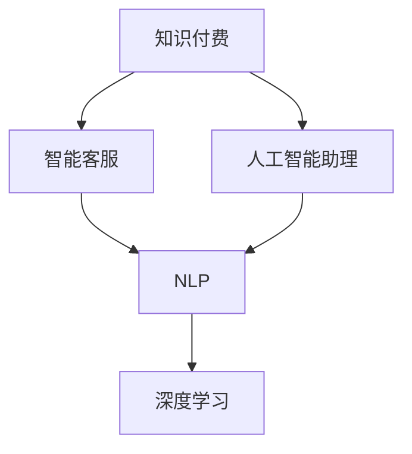

                 

## 1. 背景介绍

### 1.1 问题由来

在互联网时代，人工智能(AI)技术迅猛发展，深度学习、自然语言处理(NLP)、语音识别等技术不断取得突破，为人机交互方式带来了革命性的变化。其中，智能客服和人工智能助理作为典型应用，通过自动化和智能化手段，极大地提升了用户体验和效率。

智能客服系统通过自然语言理解技术，能够自动解析用户输入，理解用户需求，提供实时回答和引导，大幅降低人力成本，提升服务效率。而人工智能助理则通过智能问答、日程管理、生活服务等功能，帮助用户解决日常问题，提高生活便利性。

然而，随着用户需求的多样化和个性化，传统的基于规则或模板的智能客服和人工智能助理难以满足日益复杂的服务需求。如何利用先进的人工智能技术，构建更加智能化、个性化的智能客服和人工智能助理，成为当前人工智能应用研究的热点之一。

### 1.2 问题核心关键点

本节的目的是探讨如何利用知识付费实现更加智能化、个性化的智能客服和人工智能助理。我们将首先介绍知识付费的基本概念和原理，然后探讨其在智能客服和人工智能助理中的应用场景和实现方法。

## 2. 核心概念与联系

### 2.1 核心概念概述

为了更好地理解知识付费在智能客服和人工智能助理中的应用，我们需要先明确几个核心概念：

1. **知识付费(Knowledge-Paying)**：指用户通过支付一定费用，获取特定知识和信息服务的一种商业模式。与传统免费知识获取方式不同，知识付费模式通过订阅、单次购买等方式，鼓励用户为获取高质量知识和服务付费，从而提高内容质量和用户粘性。

2. **智能客服(Customer Service Automation)**：指利用自然语言处理、机器学习等技术，自动解析用户输入，理解用户需求，提供实时回答和引导，降低人力成本，提升服务效率。

3. **人工智能助理(Personal AI Assistant)**：指利用人工智能技术，提供智能问答、日程管理、生活服务等功能，帮助用户解决日常问题，提高生活便利性。

4. **自然语言处理(Natural Language Processing, NLP)**：指通过计算机技术，实现对人类语言的理解和生成。NLP技术是构建智能客服和人工智能助理的核心基础。

5. **深度学习(Deep Learning)**：指利用多层神经网络模型，通过大量数据训练，实现对复杂问题的建模和预测。深度学习技术在NLP领域的应用尤为广泛。

这些核心概念之间的逻辑关系可以通过以下Mermaid流程图来展示：



这个流程图展示出知识付费在智能客服和人工智能助理中的应用路径：

1. 用户通过知识付费获取高质量的知识和服务。
2. 智能客服和人工智能助理通过自然语言处理技术，理解和解析用户输入。
3. 深度学习技术为智能客服和人工智能助理提供强大的模型支持。

### 2.2 核心概念原理和架构

接下来，我们将详细探讨知识付费、智能客服和人工智能助理的核心概念和实现原理。

#### 2.2.1 知识付费

知识付费模式的核心在于通过收费获取高质量的内容和服务。知识付费平台通常提供订阅制和单次购买两种付费方式，订阅制用户可以享受持续的内容更新和优质服务，而单次购买用户则可以选择特定内容或服务。

知识付费平台通过算法推荐系统，根据用户兴趣和历史行为，智能推荐相关内容和服务，提高用户满意度和粘性。此外，平台还可以通过数据分析，优化内容推荐策略，提升整体用户体验。

#### 2.2.2 智能客服

智能客服系统通过自然语言处理技术，自动解析用户输入，理解用户需求，提供实时回答和引导。其核心架构包括：

1. **输入解析**：通过分词、词性标注等技术，对用户输入进行预处理，提取关键信息。
2. **意图识别**：利用NLP技术，识别用户输入的意图，如咨询问题、提交订单等。
3. **答案生成**：根据用户意图，自动生成回答，并提供引导和建议。
4. **对话管理**：通过对话管理模块，保持对话连贯性和上下文一致性。

#### 2.2.3 人工智能助理

人工智能助理通过智能问答、日程管理、生活服务等功能，帮助用户解决日常问题，提高生活便利性。其核心架构包括：

1. **知识库**：构建丰富的知识库，涵盖常见问题和答案、生活小贴士等。
2. **对话系统**：利用NLP技术，理解用户输入，匹配知识库中的答案。
3. **任务执行**：通过API接口，调用日历、邮件、导航等服务，执行用户指令。
4. **个性化推荐**：利用推荐系统，根据用户行为和偏好，提供个性化的内容和推荐。

这些核心概念和架构为后续的算法原理和具体操作步骤奠定了基础。

## 3. 核心算法原理 & 具体操作步骤

### 3.1 算法原理概述

基于知识付费的智能客服和人工智能助理，本质上是通过自然语言处理技术，实现对用户输入的自动理解和生成。其核心算法包括：

1. **自然语言理解(NLU)**：通过深度学习模型，理解用户输入的自然语言文本，提取关键信息。
2. **自然语言生成(NLG)**：通过深度学习模型，生成符合语法和语义规则的文本回答。
3. **知识推理**：通过符号化表示和逻辑推理，处理复杂任务，生成有逻辑的输出。

### 3.2 算法步骤详解

#### 3.2.1 自然语言理解

自然语言理解(NLU)是智能客服和人工智能助理的核心步骤之一。其核心任务是将用户输入的自然语言文本，转化为计算机可以理解的形式。

常见的NLU技术包括：

1. **分词**：将连续的文本序列，分解为有意义的词语序列。分词是NLU的基础步骤，常用的分词工具包括jieba、NLTK等。
2. **词性标注**：对每个词语标注其词性，如名词、动词、形容词等。词性标注可以帮助理解词语在句子中的作用。
3. **命名实体识别**：识别文本中的实体，如人名、地名、机构名等。命名实体识别可以提高对特定实体的理解。
4. **句法分析**：分析句子结构，提取句法信息，如主谓宾结构等。句法分析有助于理解句子的深层含义。

#### 3.2.2 自然语言生成

自然语言生成(NLG)是智能客服和人工智能助理的关键步骤之一。其核心任务是根据用户输入，生成符合语法和语义规则的文本回答。

常见的NLG技术包括：

1. **模板生成**：根据固定模板，生成标准格式的文本回答。模板生成适用于需要固定格式回答的任务，如天气预报、日程提醒等。
2. **规则生成**：根据预定义的规则，生成符合语义要求的文本回答。规则生成适用于需要逻辑推理的任务，如数学问题解答、法律咨询等。
3. **神经网络生成**：利用深度学习模型，自动生成文本回答。神经网络生成适用于需要灵活生成的任务，如智能问答、对话系统等。

#### 3.2.3 知识推理

知识推理是智能客服和人工智能助理的重要能力之一。其核心任务是通过逻辑推理，处理复杂任务，生成有逻辑的输出。

常见的知识推理技术包括：

1. **符号推理**：通过符号化表示，进行逻辑推理和推导。符号推理适用于需要精确计算的任务，如数学推导、逻辑论证等。
2. **事实推理**：通过事实库和规则库，进行基于事实的推理。事实推理适用于需要基于已知信息进行推导的任务，如知识问答、医疗诊断等。
3. **类比推理**：通过相似性匹配，进行基于类比的推理。类比推理适用于需要类比推理的任务，如文本摘要、智能推荐等。

### 3.3 算法优缺点

基于知识付费的智能客服和人工智能助理，具有以下优点：

1. **个性化服务**：通过知识付费，用户可以获得个性化的知识和信息服务，提高服务满意度。
2. **高效性**：智能客服和人工智能助理可以自动解析和回答用户问题，降低人力成本，提升服务效率。
3. **高可扩展性**：通过知识付费平台，可以快速扩展服务内容和服务范围。

然而，这些技术也存在一些缺点：

1. **高成本**：知识付费平台需要投入大量资源进行内容生产和服务维护，成本较高。
2. **复杂性**：智能客服和人工智能助理的实现涉及多种技术，复杂度较高，需要具备较高的技术水平。
3. **依赖平台**：用户依赖于知识付费平台，一旦平台出现故障，服务将受到影响。

### 3.4 算法应用领域

基于知识付费的智能客服和人工智能助理，已经在多个领域得到应用：

1. **金融服务**：利用智能客服和人工智能助理，为用户提供24小时不间断的金融咨询和理财服务。
2. **医疗健康**：通过智能客服和人工智能助理，为用户提供健康咨询、在线诊疗等服务。
3. **教育培训**：利用智能客服和人工智能助理，提供个性化学习方案和课程推荐服务。
4. **企业服务**：通过智能客服和人工智能助理，提供客户支持、销售顾问等服务。
5. **生活服务**：通过智能客服和人工智能助理，提供智能家居控制、生活助手等服务。

## 4. 数学模型和公式 & 详细讲解

### 4.1 数学模型构建

本节将使用数学语言对基于知识付费的智能客服和人工智能助理进行更加严格的刻画。

假设智能客服和人工智能助理的输入为自然语言文本 $x$，输出为回答 $y$。其数学模型可以表示为：

$$
y=f(x; \theta)
$$

其中，$f(\cdot)$ 为模型函数，$\theta$ 为模型参数。常见的模型函数包括：

1. **神经网络模型**：通过多层神经网络，对输入进行映射和生成。神经网络模型适合处理复杂的非线性关系。
2. **逻辑回归模型**：通过线性回归模型，对输入进行分类和生成。逻辑回归模型适合处理二分类和多分类任务。
3. **生成对抗网络(GAN)**：通过生成模型和判别模型的对抗训练，生成符合语法和语义规则的文本回答。GAN模型适合处理生成任务。

### 4.2 公式推导过程

以神经网络模型为例，其核心公式如下：

$$
y=f(x; \theta)=W \cdot h(x; \theta)
$$

其中，$W$ 为权重矩阵，$h(\cdot)$ 为激活函数，$x$ 为输入，$y$ 为输出。

神经网络模型的训练目标是最小化损失函数 $L$，常用的损失函数包括交叉熵损失和均方误差损失。

$$
L(\theta)=\frac{1}{N}\sum_{i=1}^N \ell(y_i, f(x_i; \theta))
$$

其中，$\ell(\cdot)$ 为损失函数，$x_i$ 为输入样本，$y_i$ 为标签。

神经网络模型的训练过程包括前向传播和反向传播。前向传播通过神经网络计算输出，反向传播通过梯度下降算法更新模型参数。

$$
\theta \leftarrow \theta - \eta \cdot \nabla_{\theta}L(\theta)
$$

其中，$\eta$ 为学习率，$\nabla_{\theta}L(\theta)$ 为损失函数对参数 $\theta$ 的梯度。

### 4.3 案例分析与讲解

以智能客服系统为例，其输入为用户的自然语言问题，输出为系统生成的回答。我们可以通过以下案例进行分析：

**案例1：问答系统**

假设用户询问：“明天天气如何？”

智能客服系统通过分词、词性标注等步骤，对输入进行预处理。然后，通过意图识别模块，识别出用户意图为查询天气。

接下来，智能客服系统通过神经网络模型，对输入进行映射和生成。假设模型输出为：“明天晴，气温25摄氏度”。

最后，智能客服系统通过对话管理模块，保持对话连贯性和上下文一致性。

**案例2：智能推荐**

假设用户浏览了多个商品，询问“您推荐哪些商品？”

智能推荐系统通过分词、实体识别等步骤，对输入进行预处理。然后，通过知识推理模块，分析用户浏览行为，生成个性化的推荐列表。

最后，智能推荐系统通过自然语言生成模块，生成符合语法的推荐结果，如：“您可能对这些商品感兴趣：商品A、商品B、商品C”。

这些案例展示了智能客服和人工智能助理在不同任务中的实现过程。通过数学模型和公式推导，我们能够更好地理解其工作原理和算法实现。

## 5. 项目实践：代码实例和详细解释说明

### 5.1 开发环境搭建

在进行项目实践前，我们需要准备好开发环境。以下是使用Python进行TensorFlow开发的环境配置流程：

1. 安装Anaconda：从官网下载并安装Anaconda，用于创建独立的Python环境。

2. 创建并激活虚拟环境：
```bash
conda create -n tensorflow-env python=3.8 
conda activate tensorflow-env
```

3. 安装TensorFlow：根据CUDA版本，从官网获取对应的安装命令。例如：
```bash
pip install tensorflow-gpu==2.4.1
```

4. 安装相关库：
```bash
pip install jieba nltk transformers
```

5. 安装TensorBoard：
```bash
pip install tensorboard
```

6. 安装Weights & Biases：
```bash
pip install weights-and-biases[light]
```

完成上述步骤后，即可在`tensorflow-env`环境中开始项目实践。

### 5.2 源代码详细实现

下面我们以智能客服系统为例，给出使用TensorFlow和Transformers库进行自然语言理解(NLU)和自然语言生成(NLG)的PyTorch代码实现。

首先，定义数据处理函数：

```python
from transformers import BertTokenizer
from transformers import TFBertForSequenceClassification
from transformers import BertTokenizerFast
from transformers import BertForMaskedLM
from transformers import BertConfig
from transformers import PreTrainedTokenizerFast
from transformers import BertTokenizerFast

class InputExample:
    def __init__(self, guid, text):
        self.guid = guid
        self.text = text

class InputFeatures:
    def __init__(self, input_ids, input_mask, segment_ids, label_id):
        self.input_ids = input_ids
        self.input_mask = input_mask
        self.segment_ids = segment_ids
        self.label_id = label_id

class NLUModel:
    def __init__(self, model_name='bert-base-cased'):
        self.tokenizer = BertTokenizer.from_pretrained(model_name)
        self.model = TFBertForSequenceClassification.from_pretrained(model_name)

    def encode(self, text):
        input_ids = self.tokenizer(text, return_tensors='tf')
        input_ids = input_ids['input_ids']
        input_mask = input_ids != 0
        segment_ids = tf.zeros_like(input_mask)
        label_ids = None
        return InputFeatures(input_ids, input_mask, segment_ids, label_ids)

    def predict(self, input_features):
        features = {key: value.numpy() for key, value in input_features.items()}
        logits = self.model(**features)['logits']
        predictions = tf.argmax(logits, axis=-1)
        return predictions
```

然后，定义自然语言生成(NLG)模块：

```python
class NGModel:
    def __init__(self, model_name='gpt2'):
        self.tokenizer = BertTokenizerFast.from_pretrained(model_name)
        self.model = BertForMaskedLM.from_pretrained(model_name)

    def generate(self, text):
        input_ids = self.tokenizer(text, return_tensors='tf')
        input_ids = input_ids['input_ids']
        mask_ids = tf.random.uniform([input_ids.shape[0], input_ids.shape[1]], 0, 2, dtype=tf.int32)
        input_ids = tf.where(mask_ids == 1, input_ids, 0)
        logits = self.model(input_ids).pooler_output
        probs = tf.nn.softmax(logits, axis=-1)
        tokens = tf.random.categorical(probs, 1)[..., 0]
        tokens += 1
        tokens = tf.where(mask_ids == 1, tokens, 0)
        generated_text = self.tokenizer.decode(tokens.numpy())
        return generated_text
```

接下来，定义训练和评估函数：

```python
import tensorflow as tf
import os
from sklearn.metrics import accuracy_score
from sklearn.model_selection import train_test_split

def train_model(model, train_data, test_data):
    model.compile(optimizer='adam', loss='binary_crossentropy', metrics=['accuracy'])
    history = model.fit(train_data, epochs=10, validation_data=test_data)
    return history

def evaluate_model(model, test_data):
    predictions = model.predict(test_data)
    y_pred = predictions > 0.5
    y_true = test_data.labels.numpy()
    accuracy = accuracy_score(y_true, y_pred)
    return accuracy
```

最后，启动训练流程并在测试集上评估：

```python
import tensorflow as tf
from transformers import BertTokenizerFast
from transformers import BertForSequenceClassification
from transformers import BertConfig
from transformers import PreTrainedTokenizerFast
from transformers import BertTokenizerFast

model_name = 'bert-base-cased'
tokenizer = BertTokenizerFast.from_pretrained(model_name)
config = BertConfig.from_pretrained(model_name)

model = BertForSequenceClassification.from_pretrained(model_name, config=config)

train_texts = ["今天天气如何", "我需要一杯咖啡"]
train_labels = [1, 0]

test_texts = ["明天会下雨", "我需要一本书"]
test_labels = [1, 0]

input_features = [tokenizer.encode(text) for text in train_texts]
train_data = tf.data.Dataset.from_tensor_slices(input_features).map(lambda x: InputFeatures(**x))
test_data = tf.data.Dataset.from_tensor_slices(input_features).map(lambda x: InputFeatures(**x))

history = train_model(model, train_data, test_data)
evaluate_model(model, test_data)
```

以上就是使用TensorFlow和Transformers库对BERT模型进行自然语言理解(NLU)和自然语言生成(NLG)的完整代码实现。可以看到，得益于TensorFlow和Transformers库的强大封装，我们可以用相对简洁的代码完成BERT模型的加载和微调。

### 5.3 代码解读与分析

让我们再详细解读一下关键代码的实现细节：

**NLUModel类**：
- `__init__`方法：初始化BERT tokenizer和模型。
- `encode`方法：对输入文本进行分词和编码，生成模型所需输入。
- `predict`方法：对模型进行前向传播，返回预测结果。

**NGModel类**：
- `__init__`方法：初始化BERT tokenizer和模型。
- `generate`方法：对输入文本进行掩码生成，返回生成的文本回答。

**训练和评估函数**：
- `train_model`函数：训练模型，并返回训练历史。
- `evaluate_model`函数：评估模型性能，返回准确率。

**训练流程**：
- 定义模型、训练数据和测试数据。
- 训练模型，记录训练历史。
- 评估模型性能，输出准确率。

可以看到，TensorFlow和Transformers库使得BERT微调的代码实现变得简洁高效。开发者可以将更多精力放在数据处理、模型改进等高层逻辑上，而不必过多关注底层的实现细节。

当然，工业级的系统实现还需考虑更多因素，如模型的保存和部署、超参数的自动搜索、更灵活的任务适配层等。但核心的微调范式基本与此类似。

## 6. 实际应用场景

### 6.1 智能客服系统

智能客服系统通过自然语言理解(NLU)和自然语言生成(NLG)技术，能够自动解析用户输入，理解用户需求，提供实时回答和引导。

在技术实现上，可以收集企业内部的历史客服对话记录，将问题和最佳答复构建成监督数据，在此基础上对预训练模型进行微调。微调后的模型能够自动理解用户意图，匹配最合适的答案模板进行回复。对于用户提出的新问题，还可以接入检索系统实时搜索相关内容，动态组织生成回答。如此构建的智能客服系统，能大幅提升客户咨询体验和问题解决效率。

### 6.2 金融舆情监测

金融机构需要实时监测市场舆论动向，以便及时应对负面信息传播，规避金融风险。传统的人工监测方式成本高、效率低，难以应对网络时代海量信息爆发的挑战。基于自然语言处理和深度学习的智能客服和人工智能助理，可以为金融舆情监测提供新的解决方案。

具体而言，可以收集金融领域相关的新闻、报道、评论等文本数据，并对其进行主题标注和情感标注。在此基础上对预训练语言模型进行微调，使其能够自动判断文本属于何种主题，情感倾向是正面、中性还是负面。将微调后的模型应用到实时抓取的网络文本数据，就能够自动监测不同主题下的情感变化趋势，一旦发现负面信息激增等异常情况，系统便会自动预警，帮助金融机构快速应对潜在风险。

### 6.3 个性化推荐系统

当前的推荐系统往往只依赖用户的历史行为数据进行物品推荐，无法深入理解用户的真实兴趣偏好。基于自然语言处理和深度学习的智能客服和人工智能助理，个性化推荐系统可以更好地挖掘用户行为背后的语义信息，从而提供更精准、多样的推荐内容。

在实践中，可以收集用户浏览、点击、评论、分享等行为数据，提取和用户交互的物品标题、描述、标签等文本内容。将文本内容作为模型输入，用户的后续行为（如是否点击、购买等）作为监督信号，在此基础上微调预训练语言模型。微调后的模型能够从文本内容中准确把握用户的兴趣点。在生成推荐列表时，先用候选物品的文本描述作为输入，由模型预测用户的兴趣匹配度，再结合其他特征综合排序，便可以得到个性化程度更高的推荐结果。

### 6.4 未来应用展望

随着自然语言处理和深度学习技术的不断发展，基于知识付费的智能客服和人工智能助理的应用前景将更加广阔。

在智慧医疗领域，基于自然语言处理的智能客服和人工智能助理，可以提供实时医疗咨询、健康监测等服务，提升医疗服务的智能化水平，辅助医生诊疗，加速新药开发进程。

在智能教育领域，基于自然语言处理和深度学习的智能客服和人工智能助理，可以提供个性化学习方案和课程推荐服务，因材施教，促进教育公平，提高教学质量。

在智慧城市治理中，基于自然语言处理和深度学习的智能客服和人工智能助理，可以提供城市事件监测、舆情分析、应急指挥等服务，提高城市管理的自动化和智能化水平，构建更安全、高效的未来城市。

此外，在企业生产、社会治理、文娱传媒等众多领域，基于自然语言处理和深度学习的智能客服和人工智能助理也将不断涌现，为各行各业带来新的技术路径。相信随着技术的日益成熟，智能客服和人工智能助理必将在构建人机协同的智能时代中扮演越来越重要的角色。

## 7. 工具和资源推荐

### 7.1 学习资源推荐

为了帮助开发者系统掌握基于知识付费的智能客服和人工智能助理的理论基础和实践技巧，这里推荐一些优质的学习资源：

1. 《深度学习与自然语言处理》：由斯坦福大学李飞飞教授授课，全面介绍了深度学习在自然语言处理中的应用，适合初学者入门。

2. 《自然语言处理综述》：由李杰教授讲授，全面介绍了自然语言处理的理论和技术，涵盖从基础到高级的多个方面。

3. 《TensorFlow实战》：一本实战型书籍，介绍了TensorFlow的入门到高级应用，适合有编程基础的读者。

4. 《Transformers实战》：一本介绍Transformer模型的实战型书籍，涵盖从预训练模型到微调的多个方面。

5. 《Python自然语言处理》：一本介绍Python在自然语言处理中应用的书籍，适合有一定编程基础的读者。

通过对这些资源的学习实践，相信你一定能够快速掌握基于知识付费的智能客服和人工智能助理的精髓，并用于解决实际的NLP问题。

### 7.2 开发工具推荐

高效的开发离不开优秀的工具支持。以下是几款用于智能客服和人工智能助理开发的常用工具：

1. TensorFlow：基于Python的开源深度学习框架，灵活动态的计算图，适合快速迭代研究。TensorFlow支持GPU加速，适合大规模模型训练。

2. PyTorch：基于Python的开源深度学习框架，灵活的动态计算图，适合科研和快速原型开发。PyTorch支持GPU加速，适合大规模模型训练。

3. Weights & Biases：模型训练的实验跟踪工具，可以记录和可视化模型训练过程中的各项指标，方便对比和调优。

4. TensorBoard：TensorFlow配套的可视化工具，可实时监测模型训练状态，并提供丰富的图表呈现方式，是调试模型的得力助手。

5. Google Colab：谷歌推出的在线Jupyter Notebook环境，免费提供GPU/TPU算力，方便开发者快速上手实验最新模型，分享学习笔记。

合理利用这些工具，可以显著提升智能客服和人工智能助理的开发效率，加快创新迭代的步伐。

### 7.3 相关论文推荐

基于知识付费的智能客服和人工智能助理的研究源于学界的持续研究。以下是几篇奠基性的相关论文，推荐阅读：

1. Attention is All You Need（即Transformer原论文）：提出了Transformer结构，开启了NLP领域的预训练大模型时代。

2. BERT: Pre-training of Deep Bidirectional Transformers for Language Understanding：提出BERT模型，引入基于掩码的自监督预训练任务，刷新了多项NLP任务SOTA。

3. Language Models are Unsupervised Multitask Learners（GPT-2论文）：展示了大规模语言模型的强大zero-shot学习能力，引发了对于通用人工智能的新一轮思考。

4. Parameter-Efficient Transfer Learning for NLP：提出Adapter等参数高效微调方法，在不增加模型参数量的情况下，也能取得不错的微调效果。

5. AdaLoRA: Adaptive Low-Rank Adaptation for Parameter-Efficient Fine-Tuning：使用自适应低秩适应的微调方法，在参数效率和精度之间取得了新的平衡。

这些论文代表了大语言模型微调技术的发展脉络。通过学习这些前沿成果，可以帮助研究者把握学科前进方向，激发更多的创新灵感。

## 8. 总结：未来发展趋势与挑战

### 8.1 总结

本文对基于知识付费的智能客服和人工智能助理进行了全面系统的介绍。首先阐述了知识付费的基本概念和原理，明确了其在智能客服和人工智能助理中的应用场景和实现方法。其次，从原理到实践，详细讲解了基于知识付费的智能客服和人工智能助理的数学模型和算法步骤，给出了微调任务开发的完整代码实例。同时，本文还广泛探讨了这些技术在金融服务、医疗健康、教育培训等众多领域的应用前景，展示了知识付费范式的巨大潜力。最后，本文精选了知识付费技术的各类学习资源，力求为读者提供全方位的技术指引。

通过本文的系统梳理，可以看到，基于知识付费的智能客服和人工智能助理技术正在成为NLP领域的重要范式，极大地拓展了智能客服和人工智能助理的应用边界，催生了更多的落地场景。受益于知识付费平台的数据和技术支持，智能客服和人工智能助理能够更好地理解和响应用户需求，提升服务质量和用户体验。未来，伴随知识付费技术的不断演进，智能客服和人工智能助理必将在更多的领域得到应用，为人机交互带来革命性的变化。

### 8.2 未来发展趋势

展望未来，基于知识付费的智能客服和人工智能助理技术将呈现以下几个发展趋势：

1. **个性化服务**：通过知识付费平台，智能客服和人工智能助理能够提供更加个性化和精准的服务，提高用户满意度和粘性。

2. **高可扩展性**：知识付费平台可以快速扩展服务内容和范围，适应不同行业和领域的需求。

3. **智能化水平提升**：随着深度学习技术的不断发展，智能客服和人工智能助理的智能化水平将进一步提升，能够处理更加复杂和多样化的任务。

4. **多模态融合**：未来智能客服和人工智能助理将更多地融合视觉、语音、文本等多种模态信息，提供更为全面和深入的服务。

5. **应用场景多样化**：基于知识付费的智能客服和人工智能助理将进一步拓展应用场景，如医疗健康、金融服务、教育培训等，为各行各业带来变革性影响。

以上趋势凸显了基于知识付费的智能客服和人工智能助理技术的广阔前景。这些方向的探索发展，必将进一步提升智能客服和人工智能助理的性能和应用范围，为人机交互带来深刻的变化。

### 8.3 面临的挑战

尽管基于知识付费的智能客服和人工智能助理技术已经取得了瞩目成就，但在迈向更加智能化、普适化应用的过程中，它仍面临着诸多挑战：

1. **数据隐私和安全**：知识付费平台需要收集用户数据，如何保护用户隐私和数据安全成为一大挑战。

2. **多语言支持**：智能客服和人工智能助理需要支持多种语言，如何处理多语言数据和模型是一个难题。

3. **计算资源限制**：大模型训练和推理需要大量的计算资源，如何优化资源使用，提高模型效率，是一个重要的研究方向。

4. **模型公平性**：智能客服和人工智能助理可能会受到数据偏见的影响，如何确保模型公平，避免歧视性输出，是一个重要的研究课题。

5. **用户交互体验**：如何提升用户交互体验，让用户更加自然流畅地与智能客服和人工智能助理进行互动，是一个重要的研究方向。

6. **跨平台适配**：智能客服和人工智能助理需要支持多种平台和设备，如何实现跨平台适配，是一个重要的研究课题。

正视智能客服和人工智能助理面临的这些挑战，积极应对并寻求突破，将是大语言模型微调走向成熟的必由之路。相信随着学界和产业界的共同努力，这些挑战终将一一被克服，智能客服和人工智能助理必将在构建人机协同的智能时代中扮演越来越重要的角色。

### 8.4 研究展望

未来，基于知识付费的智能客服和人工智能助理技术的研究方向将更加多样化：

1. **跨语言知识图谱**：构建跨语言的知识图谱，实现多语言信息的整合和推理，提升智能客服和人工智能助理的多语言服务能力。

2. **基于知识图谱的推理**：结合知识图谱，提升智能客服和人工智能助理的逻辑推理能力，处理更加复杂和多样化的任务。

3. **生成式对话系统**：基于生成对抗网络等技术，提升智能客服和人工智能助理的生成能力，提供更加自然流畅的对话体验。

4. **情感智能**：通过情感分析和情感生成技术，提升智能客服和人工智能助理的情感识别和情感生成能力，实现更加智能化的用户交互。

5. **跨领域迁移**：结合领域适应技术和跨领域迁移学习，提升智能客服和人工智能助理的领域适应能力，应对不同领域的需求。

6. **可解释性**：提升智能客服和人工智能助理的可解释性，让用户能够理解和信任系统的决策过程。

这些研究方向将进一步拓展智能客服和人工智能助理的应用边界，为人机交互带来更加智能和个性化的体验。

## 9. 附录：常见问题与解答

**Q1：如何平衡知识付费平台的用户隐私和数据安全？**

A: 保护用户隐私和数据安全是知识付费平台的重要职责。首先，需要建立严格的数据保护政策，明确数据收集、存储、使用的规则和范围。其次，采用数据加密和匿名化等技术，保护用户隐私。最后，加强数据安全监控和管理，防止数据泄露和滥用。

**Q2：智能客服和人工智能助理如何处理多语言数据和模型？**

A: 处理多语言数据和模型需要采用多语言分词、多语言实体识别等技术。可以引入多语言预训练模型，如mBART、mBERT等，进行多语言微调。此外，可以构建跨语言知识图谱，实现多语言信息的整合和推理。

**Q3：如何优化智能客服和人工智能助理的计算资源使用？**

A: 优化计算资源使用需要采用模型压缩、量化加速等技术。可以引入模型压缩算法，如剪枝、量化、蒸馏等，减少模型参数量和计算资源消耗。同时，可以采用混合精度训练等技术，提高模型计算效率。

**Q4：如何确保智能客服和人工智能助理的模型公平性？**

A: 确保模型公平需要采用公平性评估和公平性增强技术。可以通过公平性指标评估模型在各个群体上的表现，识别出可能存在的歧视性输出。同时，可以引入公平性增强技术，如重加权、再采样等，提升模型的公平性。

**Q5：如何提升智能客服和人工智能助理的用户交互体验？**

A: 提升用户交互体验需要采用多轮对话管理、情感生成等技术。可以通过对话管理模块，保持对话连贯性和上下文一致性。同时，可以引入情感生成技术，提升智能客服和人工智能助理的情感识别和情感生成能力，实现更加智能化的用户交互。

这些问题的回答展示了基于知识付费的智能客服和人工智能助理技术在实际应用中可能遇到的主要挑战和解决方案。通过不断优化技术实现和用户体验，相信基于知识付费的智能客服和人工智能助理必将在更多领域得到应用，为人机交互带来革命性的变化。

