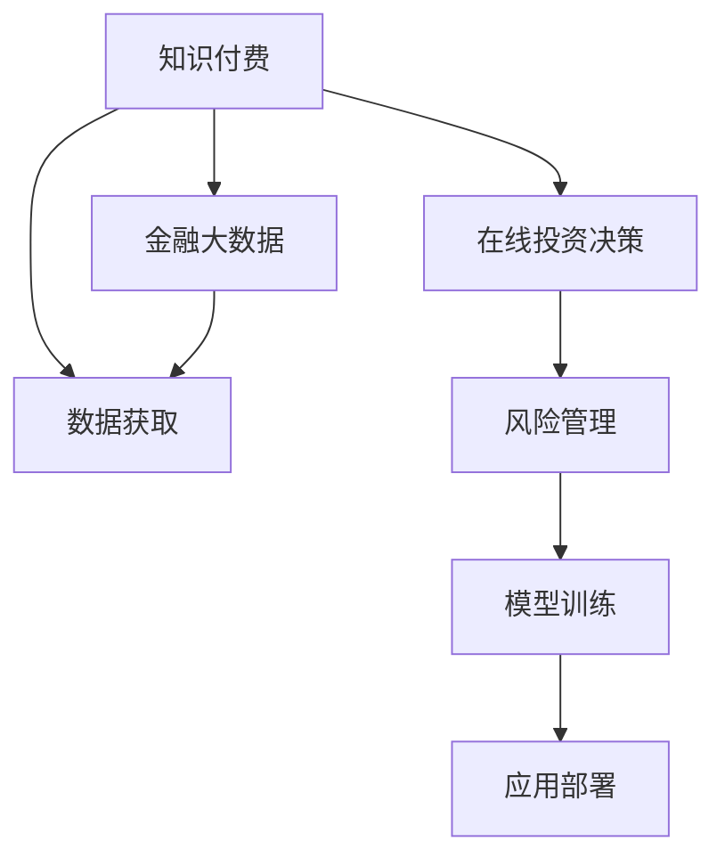

                 

# 如何利用知识付费实现在线投资决策与风险管理？

> 关键词：知识付费,在线投资决策,风险管理,机器学习,深度学习,金融大数据

## 1. 背景介绍

### 1.1 问题由来

随着互联网金融的蓬勃发展，在线投资决策与风险管理成为金融科技领域的热点话题。然而，传统金融产品的交易规则、风险评估等需要经过专业培训才能理解和应用，普通投资者往往难以适应。如何帮助投资者以更低的成本、更高效的方式做出科学的投资决策和风险管理，成为了亟待解决的问题。

同时，随着知识付费和人工智能技术的兴起，通过付费订阅获取高质量金融知识，再结合AI技术进行分析，为投资者提供精准建议的方法逐渐被业界采纳。知识付费与AI技术相结合，不仅能够满足投资者对专业知识的渴求，还能通过智能算法，辅助其进行更科学、更有效的投资决策和风险管理。

### 1.2 问题核心关键点

本论文聚焦于如何利用知识付费的资源，结合在线投资决策与风险管理的算法，提出了一套从数据获取、知识学习、模型训练到应用部署的完整解决方案，实现更科学、高效、稳健的投资决策与风险管理。

## 2. 核心概念与联系

### 2.1 核心概念概述

为更好地理解利用知识付费实现在线投资决策与风险管理的系统，本节将介绍几个密切相关的核心概念：

- **知识付费**：通过在线平台（如付费订阅、知识社区等）获取金融领域的深度知识和专业分析，为投资者提供高质量的信息。
- **在线投资决策**：利用AI算法对历史交易数据、新闻、公告、社交媒体等进行分析和预测，辅助投资者制定投资策略。
- **风险管理**：通过量化风险评估、监测市场波动等方法，为投资者提供风险提示和应对策略。
- **机器学习**：通过数据挖掘、模型训练等技术，自动化地从大量数据中提取知识并做出预测。
- **深度学习**：一种能处理复杂数据的机器学习算法，可以构建更加精确、灵活的模型。
- **金融大数据**：金融行业产生的海量数据，用于训练和测试投资决策与风险管理模型。

这些核心概念之间的逻辑关系可以通过以下Mermaid流程图来展示：



这个流程图展示出知识付费、在线投资决策、风险管理与数据获取、模型训练和应用部署之间的联系：

1. 知识付费提供高质量的金融信息，数据获取负责从多个渠道收集数据。
2. 在线投资决策利用收集的数据训练模型，为投资者提供投资建议。
3. 风险管理通过量化指标监测市场波动，辅助投资者进行风险管理。
4. 模型训练是连接数据与应用的桥梁，通过深度学习等技术提升模型的预测精度。
5. 应用部署将训练好的模型集成到实际系统中，供投资者使用。
6. 金融大数据作为数据基础，支撑整个系统的运转。

## 3. 核心算法原理 & 具体操作步骤

### 3.1 算法原理概述

基于知识付费的在线投资决策与风险管理系统，主要依赖于机器学习和深度学习技术。其核心思想是：

1. **数据获取与清洗**：收集金融市场数据、新闻、公告、社交媒体等多源数据，并进行清洗处理。
2. **知识提取与学习**：通过自然语言处理(NLP)技术，从知识付费平台获取的深度知识中提取有价值的信息。
3. **模型训练与优化**：利用金融大数据训练预测模型，并通过交叉验证等方法优化模型性能。
4. **决策与风险管理**：利用训练好的模型，对投资者输入的信息进行智能分析，并提供投资建议和风险提示。

### 3.2 算法步骤详解

1. **数据收集与预处理**：
   - 数据收集：从各类金融平台、新闻网站、社交媒体等渠道获取数据。
   - 数据清洗：去重、缺失值填充、异常值处理等，保证数据质量。
   - 数据转换：将数据转换为机器学习算法友好的格式，如One-Hot编码、归一化等。

2. **知识提取与学习**：
   - 文本处理：通过分词、去停用词等NLP技术对知识付费平台的文章进行预处理。
   - 主题建模：使用LDA（Latent Dirichlet Allocation）等算法对文本进行主题提取，挖掘出关键信息。
   - 向量表示：使用Word2Vec、GloVe等词嵌入技术，将文本转化为向量形式，便于模型处理。

3. **模型训练与优化**：
   - 选择模型：根据任务需求选择合适的机器学习或深度学习模型，如线性回归、随机森林、卷积神经网络（CNN）、循环神经网络（RNN）、长短期记忆网络（LSTM）等。
   - 数据划分：将数据划分为训练集、验证集和测试集，通常采用K-fold交叉验证。
   - 模型训练：在训练集上训练模型，使用优化器（如Adam、SGD等）更新模型参数。
   - 模型评估：在验证集上评估模型性能，根据指标（如准确率、精确率、召回率等）决定是否需要调整模型。
   - 模型优化：使用超参数调优技术，如网格搜索、随机搜索、贝叶斯优化等，寻找最优模型参数。

4. **决策与风险管理**：
   - 输入处理：将用户输入的信息（如股票代码、公司财务报告、市场趋势等）进行标准化处理。
   - 模型推理：利用训练好的模型对用户输入进行处理，输出预测结果（如买入、卖出建议，风险等级等）。
   - 风险提示：根据市场波动、历史数据等综合分析，给出风险提示和应对策略。

### 3.3 算法优缺点

基于知识付费的在线投资决策与风险管理系统的优点包括：

- **高效性**：通过自动化算法，投资者可以快速获取投资建议和风险提示。
- **精准性**：利用深度学习模型，从多源数据中提取有价值的信息，提供精准的投资建议。
- **普适性**：系统能够为不同级别的投资者提供服务，覆盖从新手到专业用户的各类需求。
- **透明度**：投资者能够清晰了解系统决策过程，增加对系统的信任度。

缺点方面主要体现在：

- **依赖数据**：系统的预测结果依赖于数据的全面性和质量，数据不足或错误可能导致预测失准。
- **模型偏差**：模型可能存在偏差，对一些特定类型的数据或市场情况处理不足。
- **用户信任**：部分投资者可能对系统的预测结果持怀疑态度，依赖人工判断。
- **成本问题**：知识付费和算法优化需要一定的成本投入，对小型投资者可能不具经济性。

### 3.4 算法应用领域

该系统适用于各种金融市场和投资场景，包括但不限于：

- **股票投资**：利用机器学习模型预测股票价格变化，提供买卖建议。
- **基金管理**：结合量化分析，优化基金组合，提高基金收益率。
- **债券交易**：根据债券市场数据，评估债券风险，优化投资策略。
- **外汇交易**：利用汇率预测模型，提供外汇买卖建议。
- **资产配置**：根据市场数据和用户风险偏好，制定资产配置方案。
- **风险管理**：实时监测市场波动，提供风险预警和应对策略。

## 4. 数学模型和公式 & 详细讲解 & 举例说明

### 4.1 数学模型构建

为了实现上述系统，我们构建了如下数学模型：

设 $X$ 为输入特征，$Y$ 为输出标签（如股票代码、买入信号、风险等级等），$M$ 为机器学习或深度学习模型，$\theta$ 为模型参数。

训练集为 $D=\{(x_i,y_i)\}_{i=1}^N$，模型损失函数为 $L(M)=\frac{1}{N}\sum_{i=1}^N l(M(x_i),y_i)$，其中 $l$ 为损失函数（如均方误差、交叉熵等）。

模型的目标是最小化损失函数 $L(M)$，即：

$$
\min_{\theta}L(M)
$$

### 4.2 公式推导过程

以简单的线性回归模型为例，公式推导如下：

设 $X=[x_1, x_2, ..., x_n]$ 为输入向量，$Y$ 为输出标签。

假设模型为线性回归模型 $Y=M(X;\theta)=\theta_0+\theta_1x_1+\theta_2x_2+...+\theta_nx_n$，其中 $\theta=(\theta_0,\theta_1,\theta_2,...,\theta_n)$ 为模型参数。

模型的损失函数为均方误差损失 $L(M)=\frac{1}{N}\sum_{i=1}^N(y_i-M(x_i))^2$。

对模型进行梯度下降优化，更新参数 $\theta$：

$$
\theta \leftarrow \theta - \alpha \frac{\partial L(M)}{\partial \theta}
$$

其中 $\alpha$ 为学习率，$\frac{\partial L(M)}{\partial \theta}$ 为模型参数的梯度。

通过训练集数据，模型参数不断调整，使得损失函数最小化。在验证集上评估模型性能，根据指标选择最优模型。

### 4.3 案例分析与讲解

以股票价格预测为例，分析系统实现过程。

- **数据准备**：收集股票历史价格数据、公司财务报告、市场新闻等，进行预处理。
- **特征工程**：构建特征向量，包括技术指标（如RSI、MACD等）、基本面数据（如市盈率、市净率等）和市场情绪指标（如Twitter sentiment score）。
- **模型训练**：选择LSTM模型，对历史数据进行训练。
- **模型评估**：在验证集上评估模型，选择最优超参数。
- **风险提示**：根据市场波动、历史数据等综合分析，提供风险提示。

## 5. 项目实践：代码实例和详细解释说明

### 5.1 开发环境搭建

要搭建一个基于知识付费的在线投资决策与风险管理系统，需要以下开发环境：

1. **Python**：作为系统开发的语言，Python具有丰富的机器学习库和数据处理工具。
2. **Jupyter Notebook**：提供交互式环境，方便代码调试和模型训练。
3. **TensorFlow或PyTorch**：深度学习框架，支持构建复杂神经网络。
4. **NLP库**：如NLTK、spaCy等，用于文本处理和分析。
5. **金融数据分析库**：如Pandas、NumPy等，用于数据处理和分析。

### 5.2 源代码详细实现

以下是一个简单的基于LSTM的股票价格预测模型实现，包括数据加载、特征工程、模型训练、风险提示等功能：

```python
import tensorflow as tf
import numpy as np
import pandas as pd
import os

# 数据加载
def load_data(file_path, window_size=60):
    data = pd.read_csv(file_path, index_col=0, parse_dates=True)
    X = data.drop(columns=['close', 'open', 'high', 'low', 'volume'])
    Y = data['close']
    X = X.shift(window_size).dropna()
    Y = Y.shift(window_size).dropna()
    return X, Y

# 特征工程
def create_features(X):
    features = []
    for i in range(X.shape[1]):
        features.append(X.iloc[:, i].rolling(window=20).mean())
        features.append(X.iloc[:, i].rolling(window=20).std())
        features.append(X.iloc[:, i].rolling(window=20).sum())
    return np.concatenate(features, axis=1)

# 模型构建
def build_model(input_size):
    model = tf.keras.Sequential([
        tf.keras.layers.LSTM(64, input_shape=(input_size, input_size)),
        tf.keras.layers.Dense(64, activation='relu'),
        tf.keras.layers.Dense(1)
    ])
    return model

# 风险提示
def risk_alert(model, data, threshold=0.8):
    pred = model.predict(data)
    if pred.mean() > threshold:
        print("高风险预警：市场可能存在大幅波动")
    else:
        print("正常市场波动，无需警惕")

# 示例代码
if __name__ == '__main__':
    X, Y = load_data('stock_data.csv', window_size=60)
    features = create_features(X)
    model = build_model(features.shape[1])
    model.compile(optimizer='adam', loss='mse')
    model.fit(X, Y, epochs=100, batch_size=32)
    risk_alert(model, features.tail(100))
```

### 5.3 代码解读与分析

上述代码展示了系统实现的基本流程，包括数据加载、特征工程、模型训练和风险提示等环节。

**数据加载**：
- `load_data`函数：从CSV文件中加载数据，并创建特征窗口，用于训练和测试模型。

**特征工程**：
- `create_features`函数：对输入特征进行时间序列处理，计算均值、标准差和总和等统计特征，形成新的特征向量。

**模型构建**：
- `build_model`函数：构建LSTM神经网络模型，包括输入层、LSTM层、全连接层和输出层。

**模型训练**：
- 使用`model.compile`方法配置模型，使用`model.fit`方法进行模型训练。

**风险提示**：
- `risk_alert`函数：根据模型预测结果，判断是否存在高风险预警。

## 6. 实际应用场景

### 6.1 智能投顾服务

基于知识付费的在线投资决策与风险管理系统的第一个典型应用场景是智能投顾服务。

智能投顾通过大数据分析和深度学习技术，帮助投资者制定个性化的投资策略，并提供精准的投资建议和风险提示。投资者只需通过接口提供交易决策信息，系统就能根据历史数据和实时市场信息，进行分析和预测，辅助投资者做出最优决策。

### 6.2 量化交易

该系统也可应用于量化交易。量化交易通过算法自动化执行交易策略，最大化投资回报。系统结合深度学习模型和金融知识，构建复杂的交易策略，实现自动交易，减少人为操作风险，提高交易效率。

### 6.3 投资组合优化

利用系统对多种金融产品的风险和收益进行分析，优化投资组合，实现风险最小化或收益最大化。

### 6.4 风险预警与防控

实时监控市场波动，提供风险预警和应对策略，帮助投资者及时调整投资组合，降低风险损失。

## 7. 工具和资源推荐

### 7.1 学习资源推荐

1. **《Python机器学习》**：推荐书籍，详细介绍了机器学习和深度学习在金融领域的应用。
2. **Kaggle**：数据科学社区，提供大量金融数据集和竞赛项目，有助于实践和学习。
3. **Google Colab**：免费GPU云服务，支持Python环境，方便进行大数据分析和深度学习实验。
4. **Coursera**：在线学习平台，提供多个金融相关的深度学习课程。
5. **《深度学习实战》**：详细介绍了深度学习算法的实现和应用，包括金融领域。

### 7.2 开发工具推荐

1. **TensorFlow**：开源深度学习框架，支持分布式训练和模型优化。
2. **PyTorch**：深度学习框架，具有动态图和灵活性，适合研究和实验。
3. **Jupyter Notebook**：交互式开发环境，便于代码调试和数据可视化。
4. **Pandas**：数据处理库，支持多种数据格式和复杂数据处理。
5. **NumPy**：数值计算库，提供高效矩阵运算和科学计算功能。

### 7.3 相关论文推荐

1. **《Deep Learning for Asset Allocation》**：探讨深度学习在资产配置中的应用。
2. **《A Survey on Financial Time Series Prediction Using Deep Learning》**：综述深度学习在金融时间序列预测中的应用。
3. **《Application of Big Data in Financial Engineering》**：介绍大数据技术在金融工程中的应用。
4. **《Fintech and Blockchain: the Next Revolution》**：探讨区块链技术在金融科技中的应用。

## 8. 总结：未来发展趋势与挑战

### 8.1 研究成果总结

利用知识付费实现在线投资决策与风险管理系统，成功将金融领域的深度知识和AI技术相结合，实现了高效的投资分析和风险管理。系统不仅能够提供精准的投资建议，还能实时监测市场波动，为投资者提供及时的风险预警。

### 8.2 未来发展趋势

1. **模型融合**：未来将更多金融知识和数据源引入模型，提升模型预测的准确性和鲁棒性。
2. **实时更新**：实现模型参数的实时更新，适应市场动态变化。
3. **个性化服务**：根据用户历史行为和偏好，提供个性化的投资策略和风险管理方案。
4. **多模态数据**：结合股票、期货、外汇等多种金融产品数据，构建多模态分析模型。
5. **协同决策**：将专家知识和系统预测结果结合，提升决策的可靠性和全面性。

### 8.3 面临的挑战

尽管系统已取得显著进展，但仍面临以下挑战：

1. **数据稀缺**：部分金融数据难以获取，数据质量问题可能影响模型性能。
2. **模型复杂**：深度学习模型参数众多，训练和优化难度较大。
3. **市场不确定性**：市场环境复杂多变，模型难以捕捉所有影响因素。
4. **用户信任**：部分用户对AI决策持怀疑态度，需要建立信任机制。
5. **法规合规**：金融领域法规众多，系统需遵守相关法律法规。

### 8.4 研究展望

未来的研究将聚焦于以下几个方面：

1. **数据扩充**：探索更多数据源和数据处理技术，提高数据质量和多样性。
2. **模型简化**：研究参数高效和计算高效的模型，提升系统效率。
3. **协同学习**：引入专家知识和经验，提升模型的解释性和可靠性。
4. **隐私保护**：研究用户数据隐私保护技术，确保数据安全和用户隐私。
5. **法规遵循**：研究金融科技合规技术，确保系统符合相关法律法规。

## 9. 附录：常见问题与解答

### 9.1 问题一：如何选择适合的模型？

A: 根据具体应用场景选择模型，一般而言，对于简单的金融问题，如股票价格预测，线性回归和LSTM等线性模型或时间序列模型已经足够；对于复杂问题，如金融时间序列预测，深度学习模型（如RNN、LSTM、GRU等）更为适合。

### 9.2 问题二：系统如何处理实时数据？

A: 系统通过实时数据流处理技术，如Kafka、Flink等，对实时数据进行采集和处理，确保模型的实时性和时效性。

### 9.3 问题三：系统如何应对市场波动？

A: 系统通过建立风险预警机制，实时监测市场波动，提供风险提示和应对策略，确保投资者及时调整投资组合，降低风险损失。

### 9.4 问题四：系统如何保证模型安全？

A: 系统通过模型训练中的正则化技术、对抗训练等方法，提升模型的鲁棒性；同时，引入安全审计机制，确保模型输出符合法规要求，保证系统安全。

### 9.5 问题五：如何评估系统性能？

A: 系统通过交叉验证、A/B测试、回测等多种方法，评估模型的准确性、鲁棒性和适用性。同时，结合专家评估和用户反馈，不断优化系统性能。

---

作者：禅与计算机程序设计艺术 / Zen and the Art of Computer Programming

