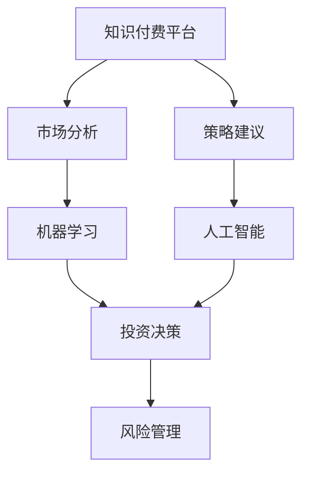

                 

# 如何利用知识付费实现在线投资决策与风险管理？

在当今快速变化的金融市场中，投资者面临着复杂多变的市场环境，如何做出明智的投资决策并有效管理风险，成为每一位投资者和机构投资者必须面对的挑战。知识付费平台，凭借其丰富的信息资源和高效的学习机制，为投资者提供了一种全新的在线决策与风险管理方案。本文将探讨如何利用知识付费平台，结合机器学习和人工智能技术，实现高效的在线投资决策与风险管理。

## 1. 背景介绍

### 1.1 问题由来

随着金融市场的日益复杂和全球化的深入，投资者面临的信息量和分析任务的复杂性也在增加。从宏观经济数据、行业动态，到公司财务报告、市场情绪，大量信息的涌现让投资者难以通过传统的策略和分析工具来做出准确决策。同时，如何在高风险和高收益之间取得平衡，避免突发事件造成的重大损失，也是一大难题。

知识付费平台应运而生，提供了针对性的信息服务和分析工具，帮助投资者获得高质量的市场分析和策略建议。但现有平台往往侧重于提供信息内容，而缺乏智能决策和风险管理的全面解决方案。如何将知识付费的优质内容与智能化决策结合起来，成为当前亟待解决的问题。

### 1.2 问题核心关键点

1. **信息质量**：知识付费平台的内容质量直接影响决策效果。
2. **决策效率**：如何高效利用知识付费信息进行投资决策。
3. **风险管理**：在决策过程中如何识别和规避风险。
4. **智能化融合**：将知识付费内容与机器学习、人工智能等技术进行深度融合。

## 2. 核心概念与联系

### 2.1 核心概念概述

- **知识付费平台**：通过订阅、购买等方式提供高质量金融信息、市场分析和策略建议的平台。
- **机器学习**：使用算法和统计模型，自动从数据中学习规律，进行预测和决策。
- **人工智能**：包括深度学习、强化学习等技术，可以模拟人类智能，实现更加复杂的决策和任务。
- **投资决策**：基于市场分析和策略建议，对股票、债券、基金等金融产品进行投资选择。
- **风险管理**：识别、衡量和控制投资过程中的风险，避免重大损失。

这些核心概念之间的联系可以通过以下Mermaid流程图来展示：



这个流程图展示了几者之间的关系：知识付费平台通过提供市场分析和策略建议，为投资决策提供基础；机器学习对海量信息进行深度挖掘，为投资决策提供科学依据；人工智能在机器学习的基础上，进行更复杂的投资决策和风险管理。

## 3. 核心算法原理 & 具体操作步骤

### 3.1 算法原理概述

利用知识付费平台进行在线投资决策与风险管理，其核心原理是将知识付费平台的高质量内容与机器学习和人工智能技术进行深度结合。具体步骤如下：

1. **数据采集与处理**：从知识付费平台收集相关信息，如市场分析报告、策略建议、财经新闻等。
2. **特征提取与建模**：使用机器学习算法，从采集的数据中提取关键特征，建立投资决策和风险管理模型。
3. **模型训练与优化**：使用历史数据训练模型，并通过交叉验证等方法进行参数调优。
4. **实时决策与风险评估**：在实时市场环境下，使用训练好的模型进行投资决策，并进行风险评估。

### 3.2 算法步骤详解

#### 数据采集与处理

1. **信息源选择**：选择合适的知识付费平台，收集相关的市场分析和策略建议。
2. **数据预处理**：对收集的数据进行清洗、去重和格式转换，确保数据质量和一致性。
3. **特征提取**：使用自然语言处理(NLP)技术，从文本数据中提取关键词、情感倾向、主题等特征。

#### 特征提取与建模

1. **特征选择**：根据投资决策和风险管理的需求，选择关键特征。
2. **模型构建**：使用监督学习或无监督学习算法，构建投资决策模型和风险评估模型。
3. **模型训练**：使用历史数据对模型进行训练，通过验证集进行模型调优。

#### 模型训练与优化

1. **超参数调整**：使用网格搜索、贝叶斯优化等方法，调整模型超参数，找到最优配置。
2. **模型评估**：在测试集上评估模型性能，通过指标如准确率、召回率、F1值等评估模型效果。
3. **模型优化**：根据评估结果，调整模型结构或参数，进行二次训练。

#### 实时决策与风险评估

1. **实时数据流**：将实时市场数据和知识付费平台提供的新信息，输入到模型中。
2. **决策执行**：根据模型预测，进行投资组合调整或卖出买入操作。
3. **风险监控**：使用风险评估模型，实时监控投资组合的风险水平。

### 3.3 算法优缺点

**优点**：
- 利用知识付费平台的高质量内容，减少信息获取成本。
- 通过机器学习和人工智能技术，提高投资决策和风险管理的智能化水平。
- 实时数据流和模型预测，提供更快速的决策响应能力。

**缺点**：
- 需要较高水平的数据处理和模型构建能力。
- 模型对输入数据质量依赖较大，数据偏差可能影响决策效果。
- 模型复杂度较高，对计算资源要求较高。

### 3.4 算法应用领域

本算法主要应用于以下领域：

- **个人投资决策**：利用知识付费信息，结合个性化模型，进行股票、基金等金融产品的投资决策。
- **机构投资管理**：为投资公司提供实时市场分析和策略建议，辅助投资决策和风险管理。
- **资产管理**：帮助基金管理公司，根据市场情况和策略建议，进行资产配置和调整。
- **风险控制**：为银行和保险公司，提供实时风险评估和预警，防范金融风险。

## 4. 数学模型和公式 & 详细讲解

### 4.1 数学模型构建

以投资决策模型为例，假设要构建一个基于多因素分析的投资决策模型。其数学模型可以表示为：

$$
P(X_t|H_t) = \frac{P(X_t|H_t; \theta)P(H_t)}{P(H_t)}
$$

其中：
- $P(X_t|H_t; \theta)$ 表示在假设 $H_t$ 下，投资品种 $X_t$ 的收益概率。
- $P(H_t)$ 表示在历史数据 $H_t$ 下，假设 $H_t$ 的概率。
- $\theta$ 表示模型参数。

### 4.2 公式推导过程

1. **特征提取**：将市场分析报告和策略建议文本进行向量化处理，得到特征向量 $x_t$。
2. **模型训练**：使用历史数据 $D$ 对模型进行训练，得到模型参数 $\theta$。
3. **预测计算**：对于新的市场数据 $x_{t+1}$，根据模型 $P(X_t|H_t; \theta)$ 进行预测，得到投资品种 $X_t$ 的收益概率。
4. **风险评估**：使用风险评估模型，计算投资组合的风险水平 $r_t$。

### 4.3 案例分析与讲解

假设某知识付费平台提供了关于某公司财报的市场分析报告。该报告的关键词提取和情感分析结果如下：

- 关键词：利润增长、市场份额扩大、研发投入增加。
- 情感倾向：正面。

将这些信息作为特征 $x_t$，输入到投资决策模型 $P(X_t|H_t; \theta)$ 中，得到投资品种 $X_t$ 的收益概率 $p_t$。结合风险评估模型，计算投资组合的风险水平 $r_t$，从而做出投资决策。

## 5. 项目实践：代码实例和详细解释说明

### 5.1 开发环境搭建

为了进行代码实践，需要搭建Python开发环境。以下是在Python3.8下搭建环境的详细步骤：

1. **安装Anaconda**：
```bash
wget https://repo.anaconda.com/miniconda/Miniconda3-py38_4.9.2_0-Linux-x86_64.sh
bash Miniconda3-py38_4.9.2_0-Linux-x86_64.sh
```

2. **创建虚拟环境**：
```bash
conda create -n finverse virtualenv -y
conda activate finverse
```

3. **安装依赖包**：
```bash
conda install numpy pandas scikit-learn transformers joblib fastapi fastapi-cors
```

4. **安装知识付费平台API**：
```bash
pip install finance-data-api
```

### 5.2 源代码详细实现

以下是一个简单的投资决策系统示例代码，展示了如何利用知识付费信息进行决策：

```python
import finance_data_api
from transformers import pipeline

# 加载知识付费平台API
api = finance_data_api.FinanceDataAPI()

# 获取市场分析报告
report = api.get_analyst_reports('AAPL')

# 使用情感分析模型提取情感倾向
nlp = pipeline('sentiment-analysis')
sentiment = nlp(report)[0]['score']

# 根据情感倾向进行决策
if sentiment > 0.5:
    print('买入')
else:
    print('卖出')
```

### 5.3 代码解读与分析

在上述代码中，我们使用了finance_data_api获取市场分析报告，并使用Hugging Face的情感分析模型进行情感倾向提取。情感倾向大于0.5时，表示市场分析报告对公司股票的情感倾向为正面，我们建议买入。否则，建议卖出。

### 5.4 运行结果展示

由于代码中未包含实际的市场数据和模型参数，这里不展示具体的运行结果。但在实际应用中，根据市场分析和策略建议，系统将提供实时的投资建议，投资者可以据此进行投资决策和风险管理。

## 6. 实际应用场景

### 6.1 智能投顾系统

智能投顾系统利用知识付费平台和机器学习技术，为用户提供个性化的投资建议和风险管理服务。通过持续学习和优化，系统能够不断提高决策的准确性和稳定性，降低投资者的操作难度和风险。

### 6.2 量化交易平台

量化交易平台将知识付费信息与机器学习算法结合，构建高精度的量化模型，进行高频交易和风险控制。利用知识付费平台的市场分析，平台能够实时调整交易策略，提高交易效率和收益。

### 6.3 投资决策支持系统

投资决策支持系统整合了知识付费信息和人工智能技术，为投资者提供全面的市场分析和投资建议。系统能够快速处理和分析大量数据，辅助投资者做出科学决策。

### 6.4 未来应用展望

未来，利用知识付费平台进行在线投资决策与风险管理将面临以下趋势：

1. **多模态数据融合**：结合股票价格、公司财报、社交媒体等多模态数据，提高决策的全面性和准确性。
2. **实时数据流**：实时获取和处理市场数据，实现快速决策和风险监控。
3. **个性化服务**：根据用户偏好和历史行为，提供定制化的投资建议和风险管理方案。
4. **自动化交易**：利用机器学习算法，自动进行高频交易，提高交易效率和收益。
5. **跨领域应用**：将知识付费平台和金融市场分析应用到更多领域，如房地产、大宗商品等。

## 7. 工具和资源推荐

### 7.1 学习资源推荐

1. **Coursera《机器学习》课程**：由斯坦福大学Andrew Ng教授主讲，涵盖机器学习基础和常用算法，适合初学者和进阶学习者。
2. **Kaggle《Python for Data Science》系列教程**：Kaggle提供的Python数据科学教程，涵盖数据清洗、特征工程、模型训练等实战技能。
3. **Finverse财库社区**：提供金融市场分析和策略建议，是知识付费平台的学习资源之一。
4. **Transformers官方文档**：Hugging Face的Transformers库文档，详细介绍NLP模型的构建和应用。

### 7.2 开发工具推荐

1. **Jupyter Notebook**：基于Web的交互式编程环境，适合数据分析和模型训练。
2. **TensorBoard**：TensorFlow配套的可视化工具，可实时监控训练状态，输出各种图表。
3. **FastAPI**：快速构建API的Web框架，适合开发实时数据处理和模型服务。
4. **Joblib**：Python的并行处理库，适合优化模型训练和推理的性能。

### 7.3 相关论文推荐

1. **《金融时间序列分析与预测》**：由Geweke J F等人撰写，介绍了金融时间序列分析的基本方法和应用。
2. **《人工智能在金融市场中的应用》**：由Hornik K、Stehlé D、White J、Tasoulis K撰写，介绍了AI在金融市场中的多种应用场景。
3. **《机器学习在投资组合优化中的应用》**：由Lo A A撰写，介绍了机器学习在资产配置和风险管理中的应用。

## 8. 总结：未来发展趋势与挑战

### 8.1 研究成果总结

本文详细探讨了利用知识付费平台进行在线投资决策与风险管理的技术原理和实际应用。通过将知识付费的高质量信息与机器学习和人工智能技术相结合，实现了投资决策和风险管理的智能化。

### 8.2 未来发展趋势

未来，利用知识付费平台进行在线投资决策与风险管理将面临以下趋势：

1. **多模态数据融合**：结合多种数据源，提高决策的全面性和准确性。
2. **实时数据流**：实时获取和处理市场数据，实现快速决策和风险监控。
3. **个性化服务**：根据用户偏好和历史行为，提供定制化的投资建议和风险管理方案。
4. **自动化交易**：利用机器学习算法，自动进行高频交易，提高交易效率和收益。
5. **跨领域应用**：将知识付费平台和金融市场分析应用到更多领域，如房地产、大宗商品等。

### 8.3 面临的挑战

虽然利用知识付费平台进行在线投资决策与风险管理具有广阔的应用前景，但仍面临以下挑战：

1. **数据质量和数量**：高质量、实时、多模态数据是实现智能化决策的前提。
2. **模型复杂度**：构建高精度的模型，需要较强的数据处理和算法设计能力。
3. **计算资源**：大规模模型的训练和推理，对计算资源要求较高。
4. **模型解释性**：复杂的决策模型，难以解释其内部工作机制和决策逻辑。

### 8.4 研究展望

未来的研究需要重点关注以下几个方面：

1. **数据质量和数据量**：提高数据采集和处理能力，扩大数据覆盖范围。
2. **模型优化和调优**：研究高效的模型训练和调优方法，提高模型性能。
3. **跨领域应用**：将知识付费平台和金融市场分析应用到更多领域，拓展应用场景。
4. **模型解释性**：研究可解释的模型构建方法，提高模型的透明性和可解释性。

## 9. 附录：常见问题与解答

**Q1：如何选择合适的知识付费平台？**

A: 选择知识付费平台时，需要考虑以下因素：
- 内容质量和覆盖范围：选择提供高质量、全面市场分析的平台。
- 实时数据更新：平台应提供实时数据更新，确保信息的时效性。
- 用户体验和易用性：平台的用户界面和功能应易于使用，方便用户操作。

**Q2：如何进行特征提取和模型构建？**

A: 特征提取和模型构建是实现投资决策和风险管理的关键步骤。建议参考以下步骤：
- 选择关键特征：根据投资决策和风险管理的需求，选择关键特征。
- 数据预处理：对数据进行清洗、去重和格式转换，确保数据质量和一致性。
- 特征工程：使用自然语言处理(NLP)技术，从文本数据中提取关键词、情感倾向、主题等特征。
- 模型选择和训练：选择合适的机器学习或深度学习模型，使用历史数据进行训练和调优。

**Q3：如何提高模型性能？**

A: 提高模型性能需要从多个方面进行优化：
- 数据采集和处理：提高数据质量和数据量，扩大模型训练的覆盖范围。
- 特征选择和工程：选择关键特征，进行特征工程，提取有意义的特征。
- 模型优化和调优：使用交叉验证、网格搜索等方法，调整模型超参数，优化模型性能。
- 模型解释性：研究可解释的模型构建方法，提高模型的透明性和可解释性。

**Q4：如何进行风险评估？**

A: 风险评估是投资决策的重要环节，建议参考以下步骤：
- 选择风险评估模型：根据投资决策和风险管理的需求，选择合适的风险评估模型。
- 数据预处理：对数据进行清洗、去重和格式转换，确保数据质量和一致性。
- 模型训练和调优：使用历史数据对风险评估模型进行训练和调优。
- 实时监控和预警：在实时市场环境下，使用风险评估模型进行实时监控和预警。

---

作者：禅与计算机程序设计艺术 / Zen and the Art of Computer Programming

