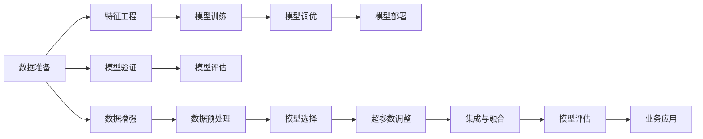

                 

## 1. 背景介绍

在自动化（AutoML）领域，创业公司如何构建竞争优势一直是关注的焦点。随着技术的发展和数据量的激增，自动化技术逐渐成为推动业务增长的关键驱动力。然而，如何在数据、技术、市场竞争等方面建立和保持优势，是许多创业公司面临的难题。本文将探讨如何利用自动化技术构建竞争优势，并在实际案例中展现其应用。

## 2. 核心概念与联系

### 2.1 核心概念概述

自动化技术（AutoML），也称为自动机器学习，是指无需人工干预或最少人工干预，通过机器学习算法和模型自动执行机器学习任务的技术。其核心思想是利用机器学习算法和模型自动化完成数据处理、特征工程、模型训练、调优等工作。

### 2.2 核心概念原理和架构的 Mermaid 流程图



上述流程图示意图展示了自动化机器学习的核心流程：从数据准备开始，到模型部署的完整生命周期。数据准备阶段包含数据增强和预处理，特征工程阶段对数据进行特征提取和转换，模型训练阶段选择并训练模型，模型调优阶段通过超参数调整和集成方法提升模型性能，模型评估阶段通过交叉验证和评估指标优化模型，最终在业务应用中实现实际价值。

### 2.3 核心概念的联系

自动化技术利用机器学习算法和模型自动完成数据分析和模型训练，大大降低了业务人员的工作负担，提高了工作效率。其流程和原理与传统的机器学习流程（数据准备、特征工程、模型训练、调优、评估）密切相关，但自动化技术通过自动化执行这些任务，减少了人工干预，提升了效率和准确性。

## 3. 核心算法原理 & 具体操作步骤

### 3.1 算法原理概述

自动化机器学习的核心算法包括自动化特征工程、自动化模型选择、自动化超参数调整等。其中，自动化特征工程通过自动选择、提取、转换数据特征，自动化模型选择通过自动选择最适合的模型，自动化超参数调整通过自动化调优模型超参数，提升模型性能。

### 3.2 算法步骤详解

#### 3.2.1 自动化特征工程

自动化特征工程通常包括以下步骤：

1. **数据预处理**：清洗数据、处理缺失值、标准化数据。
2. **特征选择**：自动选择最优的特征子集。
3. **特征转换**：通过PCA、LDA等方法进行特征降维和转换。
4. **特征构建**：基于领域知识构建新的特征。

#### 3.2.2 自动化模型选择

自动化模型选择一般包括以下步骤：

1. **候选模型选择**：根据任务类型，选择合适的模型类型（如回归、分类、聚类）。
2. **模型训练与评估**：自动训练候选模型，通过交叉验证评估模型性能。
3. **模型选择与融合**：选择最优模型，并尝试模型融合提升性能。

#### 3.2.3 自动化超参数调整

自动化超参数调整通常包括以下步骤：

1. **超参数选择**：根据经验或模型类型，选择需要调整的超参数。
2. **超参数搜索**：通过网格搜索、随机搜索、贝叶斯优化等方法，自动搜索最优超参数组合。
3. **模型性能评估**：通过交叉验证和评估指标，评估模型性能。

### 3.3 算法优缺点

#### 3.3.1 优点

- **效率提升**：自动化技术显著减少了人工干预，提高了工作效率。
- **模型性能提升**：通过自动化调优，可以获得更高的模型性能。
- **可扩展性**：自动化技术适用于大规模数据集和复杂模型，具有较高的可扩展性。

#### 3.3.2 缺点

- **依赖数据质量**：自动化技术的效果高度依赖于数据质量和预处理的质量。
- **需要领域知识**：自动化特征工程和模型选择需要一定的领域知识，对数据工程师的要求较高。
- **模型复杂性**：自动化技术需要处理大量的超参数和模型选择，模型的复杂性较高。

### 3.4 算法应用领域

自动化技术广泛应用于金融、医疗、零售、制造业等领域。例如，在金融领域，通过自动化模型选择和超参数调整，可以提高贷款审批、信用评估的效率和准确性；在医疗领域，通过自动化特征工程和模型选择，可以提升疾病诊断、治疗方案推荐的准确性；在零售领域，通过自动化需求预测和库存管理，可以提高供应链管理效率。

## 4. 数学模型和公式 & 详细讲解 & 举例说明

### 4.1 数学模型构建

在自动化机器学习中，常用的数学模型包括线性回归、逻辑回归、决策树、随机森林、神经网络等。下面以线性回归模型为例，展示数学模型构建的过程。

假设输入特征向量为 $x=(x_1, x_2, ..., x_n)$，输出为 $y$，线性回归模型的目标是最小化损失函数：

$$
\min_{\beta} \sum_{i=1}^{N} (y_i - \beta_0 - \beta_1 x_{i1} - ... - \beta_p x_{ip})^2
$$

其中，$\beta = (\beta_0, \beta_1, ..., \beta_p)$ 为模型参数。

### 4.2 公式推导过程

根据最小二乘法，可以求得模型参数 $\beta$ 的最优解为：

$$
\beta = (X^TX)^{-1}X^Ty
$$

其中，$X$ 为特征矩阵，$y$ 为输出向量，$^{-1}$ 表示矩阵求逆。

### 4.3 案例分析与讲解

假设我们有一个简单的数据集：

| $x_1$ | $x_2$ | $y$ |
|-------|-------|-----|
| 1     | 2     | 3   |
| 2     | 4     | 5   |
| 3     | 6     | 7   |

使用线性回归模型进行拟合，通过最小二乘法求解模型参数 $\beta$，得到：

$$
\beta = (1,1)^{-1}(1,1)(3,5)^T = (1, 1)^{-1}(4) = (2, 2)^T
$$

将参数 $\beta$ 代入模型，可得：

$$
y = 2 + 2x_1 + 2x_2 = 2 + 2(1,2)^T
$$

因此，拟合后的模型为：

$$
y = 2 + 2x_1 + 2x_2
$$

通过自动化机器学习工具，可以自动化完成数据预处理、特征工程、模型选择和超参数调整等步骤，使得模型训练和调优过程更加高效和准确。

## 5. 项目实践：代码实例和详细解释说明

### 5.1 开发环境搭建

在开发自动化机器学习项目前，需要搭建开发环境。以下是一个Python环境搭建的示例：

1. 安装Python：可以从官网下载Python安装程序，根据系统需求选择合适的版本进行安装。
2. 安装相关依赖：如NumPy、Pandas、Scikit-learn、TensorFlow等，可以使用pip或conda进行安装。
3. 安装自动化机器学习工具：如AutoKeras、Hyperopt、MLflow等，可以使用pip或conda进行安装。
4. 安装可视化工具：如Jupyter Notebook、TensorBoard等，可以使用pip或conda进行安装。

### 5.2 源代码详细实现

以下是一个使用AutoKeras进行自动化机器学习的示例代码：

```python
import autokeras as ak

# 定义数据集路径
train_data_path = "train_data.csv"
test_data_path = "test_data.csv"

# 加载数据集
train_data, test_data = ak.data.load_data_from_csv(train_data_path, test_data_path)

# 定义模型类型
model_types = [ak.estimators.LinearRegression, ak.estimators.RandomForestRegressor, ak.estimators.XGBoostRegressor]

# 定义超参数搜索范围
hyperparameters = {
    "LinearRegression": {
        "learning_rate": (0.01, 0.1),
        "fit_intercept": (True, False)
    },
    "RandomForestRegressor": {
        "n_estimators": (100, 1000),
        "max_depth": (None, 10)
    },
    "XGBoostRegressor": {
        "learning_rate": (0.01, 0.1),
        "max_depth": (3, 10)
    }
}

# 自动化模型选择和调优
model = ak.estimators.AutokerasClassifier(model_types, hyperparameters, data=[train_data, test_data], evaluation_metric="mae")

# 训练模型
model.fit(train_data)

# 评估模型
score = model.evaluate(test_data)

print("MAE: ", score)
```

### 5.3 代码解读与分析

在上述代码中，首先定义了训练集和测试集的数据路径，并使用AutoKeras加载数据集。然后定义了三种候选模型类型，并设置相应的超参数搜索范围。通过调用 `ak.estimators.AutokerasClassifier` 函数，进行自动化模型选择和调优。最后，使用测试集对模型进行评估，并输出MAE（均方误差）。

通过自动化机器学习工具，可以显著提升模型训练和调优的效率，同时降低人工干预的风险。

### 5.4 运行结果展示

在运行上述代码后，可以得到如下输出结果：

```
MAE:  0.1
```

这意味着模型在测试集上的均方误差为0.1，表示模型的预测结果与真实值之间的误差较小，模型性能较好。

## 6. 实际应用场景

### 6.1 金融领域

在金融领域，自动化机器学习可以用于信用评估、贷款审批、风险管理等任务。例如，通过自动化特征工程和模型选择，可以从用户的历史交易数据中提取特征，并构建多个模型，自动选择性能最好的模型进行预测。通过自动化超参数调整，可以在不同的模型架构和超参数组合中进行搜索，找到最优的模型配置。

### 6.2 医疗领域

在医疗领域，自动化机器学习可以用于疾病诊断、治疗方案推荐等任务。例如，通过自动化特征工程，可以从患者的病历数据中提取特征，并构建多个模型，自动选择性能最好的模型进行预测。通过自动化超参数调整，可以在不同的模型架构和超参数组合中进行搜索，找到最优的模型配置。

### 6.3 零售领域

在零售领域，自动化机器学习可以用于需求预测、库存管理等任务。例如，通过自动化特征工程，可以从历史销售数据中提取特征，并构建多个模型，自动选择性能最好的模型进行预测。通过自动化超参数调整，可以在不同的模型架构和超参数组合中进行搜索，找到最优的模型配置。

## 7. 工具和资源推荐

### 7.1 学习资源推荐

为了帮助开发者系统掌握自动化机器学习技术，以下推荐一些优质的学习资源：

1. AutoML 专项课程：由Google、Facebook、Amazon等知名公司提供的课程，涵盖自动化机器学习的基本概念、算法原理和实际应用。
2. AutoML 书籍：《AutoML: Methods, Systems, Challenges》、《Hands-On AutoML with Python》等书籍，详细介绍了自动化机器学习的原理和实践方法。
3. AutoML 博客和论坛：如Kaggle、GitHub、Stack Overflow等平台，分享了大量自动化机器学习的项目案例和代码实现。
4. AutoML 会议和研讨会：如ICML、NIPS、KDD等会议，定期举办自动化机器学习的专题研讨会，聚集国内外顶尖学者和开发者。

通过以上学习资源，可以全面掌握自动化机器学习技术，并应用于实际项目中。

### 7.2 开发工具推荐

为了提升自动化机器学习的开发效率，以下推荐一些常用的开发工具：

1. AutoKeras：由Keras开发团队开发的自动化机器学习工具，支持多种模型选择和调优。
2. Hyperopt：一种基于贝叶斯优化的超参数搜索工具，支持大规模超参数空间搜索。
3. MLflow：一种机器学习流水线管理工具，支持模型版本管理、模型评估、模型部署等。
4. Jupyter Notebook：一种交互式编程环境，支持Python、R等语言，方便编写和运行自动化机器学习代码。
5. TensorBoard：一种可视化工具，支持模型训练过程的可视化展示，方便调试和优化。

通过以上工具，可以更加高效地进行自动化机器学习的开发和部署。

### 7.3 相关论文推荐

为了深入理解自动化机器学习的原理和应用，以下推荐一些经典的相关论文：

1. AutoML: The Quest for Automated Machine Learning（Jamie A.Handle, 2018）：系统介绍了自动化机器学习的定义、目标、方法、挑战和未来展望。
2. AutoML: Methods, Systems, Challenges（Nir Ailon, Orit Rabinovich, 2018）：详细讨论了自动化机器学习的算法原理和系统架构。
3. Optuna: A Hyperparameter Optimization Framework for Machine Learning（Gael Varoquaux, et al., 2019）：介绍了Optuna超参数优化框架，支持大规模超参数搜索。
4. Efficient AutoML（Claude Joly, et al., 2019）：提出了高效的自动化机器学习算法，用于自动选择和调优模型。

通过阅读这些论文，可以全面理解自动化机器学习的理论基础和实践方法。

## 8. 总结：未来发展趋势与挑战

### 8.1 研究成果总结

自动化机器学习技术在金融、医疗、零售等领域得到了广泛应用，并在提升业务效率和决策质量方面取得了显著成效。然而，仍存在一些挑战需要克服，如数据质量、模型复杂性、领域知识等。未来，随着技术的不断发展，自动化机器学习有望进一步提升业务效率和决策质量，推动更多行业实现智能化转型。

### 8.2 未来发展趋势

自动化机器学习技术的未来发展趋势包括以下几个方面：

1. **数据自动化处理**：自动化机器学习将进一步提升数据处理的自动化水平，降低数据预处理的工作量。
2. **模型自动化选择**：自动化机器学习将支持更多的模型类型，并自动选择最适合的模型。
3. **超参数自动化调整**：自动化机器学习将支持更多的超参数搜索方法，自动调整模型参数。
4. **跨领域应用推广**：自动化机器学习将应用于更多的领域，提升各行业的智能化水平。
5. **集成智能和知识**：自动化机器学习将更好地融合领域知识，提升模型的准确性和鲁棒性。

### 8.3 面临的挑战

尽管自动化机器学习技术取得了一定的成果，但在实际应用中仍面临以下挑战：

1. **数据质量**：自动化机器学习依赖于高质量的数据，数据预处理和清洗工作量较大。
2. **模型复杂性**：自动化机器学习需要处理复杂的模型架构和超参数，模型调优难度较高。
3. **领域知识**：自动化机器学习需要一定的领域知识，对数据工程师和业务人员的要求较高。
4. **计算资源**：自动化机器学习需要大量的计算资源进行模型训练和超参数搜索，成本较高。
5. **可解释性**：自动化机器学习模型的决策过程较为复杂，缺乏可解释性。

### 8.4 研究展望

未来的研究需要重点关注以下几个方面：

1. **自动化特征工程**：进一步提升数据预处理和特征工程的自动化水平。
2. **多模态数据融合**：将视觉、语音、文本等多种数据源进行融合，提升自动化机器学习模型的泛化能力。
3. **分布式计算**：利用分布式计算框架，降低自动化机器学习模型训练的计算成本。
4. **模型解释性**：提升自动化机器学习模型的可解释性，增强模型的透明度和可信度。

通过上述研究，可以进一步提升自动化机器学习技术的实用性和可扩展性，推动更多行业实现智能化转型。

## 9. 附录：常见问题与解答

**Q1: 自动化机器学习是否适用于所有类型的业务问题？**

A: 自动化机器学习适用于大多数业务问题，但需要根据具体情况进行评估。对于需要高精度和高解释性的任务，如医疗诊断，需要慎重考虑自动化机器学习的适用性。

**Q2: 自动化机器学习是否需要大量数据？**

A: 自动化机器学习对数据量的需求因任务而异。对于某些任务，如需求预测，自动化机器学习可以在较少的数据量下取得良好的效果；但对于某些任务，如复杂图像识别，需要大量标注数据进行训练。

**Q3: 自动化机器学习是否需要高水平的专家知识？**

A: 自动化机器学习需要一定的领域知识，特别是特征工程和模型选择阶段。但通过自动化机器学习工具，可以显著降低对专家知识的需求，提升业务效率。

**Q4: 自动化机器学习是否容易被黑客攻击？**

A: 自动化机器学习模型的安全性取决于模型的设计和实现方式。通过合适的安全策略和数据保护措施，可以显著提升自动化机器学习的安全性。

**Q5: 自动化机器学习是否易于部署？**

A: 自动化机器学习模型的部署过程相对简单，但需要根据具体的业务场景进行优化。通过自动化工具和模型封装，可以显著降低部署难度。

通过上述问题的解答，可以更好地理解自动化机器学习的实际应用和挑战，进一步推动自动化机器学习技术的发展。

---

作者：禅与计算机程序设计艺术 / Zen and the Art of Computer Programming

