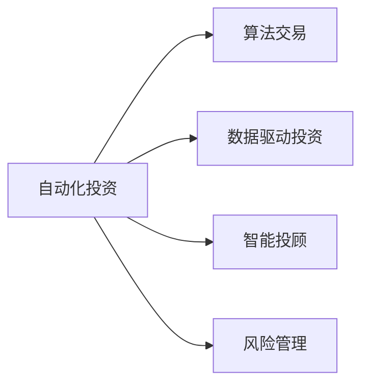

                 

# 如何将编程技能应用于自动化投资

## 1. 背景介绍

在金融领域，投资决策长期以来依赖于人工分析、经验和直觉，但随着数字化和自动化技术的不断发展，传统的投资策略正逐渐向数据驱动、算法驱动的自动化投资转变。编程技能在这一过程中扮演了至关重要的角色，不仅用于数据处理和模型构建，还涉及自动化交易、风险管理、智能投顾等多个环节。本文将系统阐述如何将编程技能应用于自动化投资，从基础概念到实际应用，为金融技术爱好者和从业人员提供全面的技术指引。

## 2. 核心概念与联系

### 2.1 核心概念概述

- **自动化投资**：利用计算机算法和程序化交易策略，自动执行投资决策和交易操作，提升投资效率和收益。
- **算法交易**：基于数学模型和计算技术，自动执行买卖指令以获取最大收益。
- **数据驱动投资**：依赖于大量数据分析，通过机器学习和量化模型来指导投资决策。
- **智能投顾**：利用人工智能技术，为投资者提供个性化的投资建议和服务。
- **风险管理**：通过算法和模型评估和控制投资风险，确保资产组合的稳健性。

这些核心概念之间的逻辑关系可以通过以下Mermaid流程图来展示：



这个流程图展示出自动化投资的多重应用路径，每条路径均需要编程技能作为支撑。

### 2.2 核心概念原理和架构

自动化投资的核心原理是利用计算机算法自动化执行投资策略，从而提升决策效率和精确度。其核心架构包括数据采集与处理、策略设计、回测与优化、实盘交易和风险控制等环节。以下各节将详细介绍这些环节的核心概念及其架构设计。

## 3. 核心算法原理 & 具体操作步骤

### 3.1 算法原理概述

自动化投资的算法核心是量化投资模型，这些模型基于数学和统计方法，能够从海量数据中提取有价值的信息，指导投资决策。常见的量化模型包括回归分析、时间序列预测、机器学习模型等。这些模型通过编程实现，能够自动地、高效地进行数据分析和交易操作。

### 3.2 算法步骤详解

#### 3.2.1 数据采集与处理

**数据来源**：
- **公开市场数据**：包括股票价格、成交量、市场情绪等，可通过金融API获取。
- **非公开数据**：包括公司财报、新闻、社交媒体情绪等，需通过爬虫等技术从互联网获取。

**数据处理**：
- **数据清洗**：去除无效数据、缺失值处理。
- **数据转换**：将不同格式的数据转换为一致的格式，如时间序列数据的标准化处理。
- **特征工程**：提取和构造有意义的特征，如技术指标、基本面指标、情绪指标等。

#### 3.2.2 策略设计

**策略类型**：
- **趋势跟踪**：基于价格走势的趋势分析，寻找买入或卖出的时机。
- **均值回归**：利用价格围绕均值波动的特性，在价格偏离均值时进行买卖。
- **套利策略**：寻找价格差异，通过买卖不同市场或资产获利。

**策略实现**：
- **条件语句**：根据市场条件（如价格、成交量）自动执行买卖操作。
- **循环结构**：在一定时间范围内，持续监测市场情况并执行策略。

#### 3.2.3 回测与优化

**回测流程**：
- **历史数据选择**：选取一定历史时间段内的市场数据进行回测。
- **策略执行**：按照设定策略，在历史数据上执行模拟交易，记录每笔交易的结果。
- **绩效评估**：计算策略的收益率、夏普比率、最大回撤等指标，评估策略性能。

**优化方法**：
- **超参数调整**：调整策略参数（如买卖点、仓位大小、交易频率），寻找最优配置。
- **特征选择**：选择和组合不同特征，寻找最具预测性的特征组合。
- **模型融合**：组合多个模型，构建更为稳定的投资策略。

#### 3.2.4 实盘交易

**交易系统构建**：
- **API接口**：与交易所、清算所等对接，实现自动下单和撤单。
- **状态管理**：记录交易状态，如订单状态、账户余额等。
- **实时监控**：监测市场波动，触发交易策略。

**交易执行**：
- **委托下单**：根据策略自动生成买卖委托。
- **订单执行**：通过API向交易所发送订单，等待成交。
- **风险控制**：设置止损和止盈点，避免过度交易。

#### 3.2.5 风险管理

**风险评估**：
- **VaR计算**：计算在一定置信水平下，投资组合可能损失的最大金额。
- **波动率分析**：评估资产价格波动的频率和幅度。

**风险控制**：
- **仓位控制**：根据市场情况和策略需求，动态调整仓位大小。
- **止损止盈**：设置止损和止盈价格，避免亏损和获利回吐。
- **对冲策略**：利用对冲策略降低投资组合的总体风险。

### 3.3 算法优缺点

#### 3.3.1 优点

- **效率高**：自动执行交易，减少了人工干预，提高决策速度。
- **一致性强**：算法无情绪波动，严格按照预设规则执行。
- **回测可控**：回测过程中，策略参数可调，反复验证，保证策略可靠性。
- **数据驱动**：利用数据挖掘和机器学习，发现更有效的投资策略。

#### 3.3.2 缺点

- **依赖数据质量**：策略性能高度依赖于数据的质量和完整性。
- **模型失效风险**：在市场异常或数据缺失时，模型可能失效，造成损失。
- **算法复杂度高**：构建和优化复杂的量化模型需要较高的技术门槛。
- **费用较高**：算法交易和量化投资通常需支付高频交易手续费等费用。

### 3.4 算法应用领域

自动化投资技术已经广泛应用于股票、期货、外汇等金融市场，其核心应用领域包括：

- **量化交易**：通过算法自动执行买卖指令，获取高频率交易收益。
- **智能投顾**：利用AI技术提供个性化投资建议，优化资产配置。
- **风险管理**：通过算法评估和控制投资组合风险，确保资产稳健。
- **高频交易**：利用计算机算法在极短时间内完成大量交易操作，获取微小价差收益。
- **套利策略**：在多个市场间寻找价格差异，通过无风险套利获利。

这些应用领域涵盖了从高频交易到长期投资的多个层次，展现了自动化投资技术的广泛应用潜力。

## 4. 数学模型和公式 & 详细讲解

### 4.1 数学模型构建

#### 4.1.1 投资组合优化模型

**目标函数**：
$$
\min_{w} \frac{1}{2}w^T\Sigma w - \mathbf{1}^Tw + R
$$

**约束条件**：
$$
w_i \geq 0, \sum_{i=1}^n w_i = 1
$$

其中，$w$ 为投资组合权重向量，$\Sigma$ 为协方差矩阵，$\mathbf{1}$ 为全1向量，$R$ 为目标收益率。

#### 4.1.2 风险管理模型

**VaR模型**：
$$
VaR_{\alpha} = \mathbf{w}^T\mu - \frac{\sigma \phi^{-1}(\alpha)}{\sqrt{n}}
$$

**波动率模型**：
$$
\sigma = \sqrt{\sum_{i=1}^n w_i \sigma_i^2}
$$

其中，$\alpha$ 为置信水平，$\phi^{-1}(\alpha)$ 为标准正态分布的逆函数，$n$ 为资产数量，$\sigma_i$ 为第 $i$ 个资产的波动率。

### 4.2 公式推导过程

#### 4.2.1 投资组合优化公式推导

根据Markowitz的投资组合理论，投资组合的风险和收益可以通过以下公式计算：

$$
\mathbb{E}[R] = \mathbf{w}^T\mu
$$

$$
Var(R) = \mathbf{w}^T\Sigma w
$$

构建优化问题，最小化风险，同时最大化收益：

$$
\min_{w} \frac{1}{2}w^T\Sigma w - \mathbf{1}^Tw + R
$$

**拉格朗日乘数法**：

$$
\mathcal{L}(w, \lambda) = \frac{1}{2}w^T\Sigma w - \mathbf{1}^Tw + R + \lambda (\mathbf{1}^Tw - 1)
$$

求偏导数：

$$
\frac{\partial \mathcal{L}}{\partial w} = \Sigma w - \mathbf{1}\lambda = 0
$$

$$
\frac{\partial \mathcal{L}}{\partial \lambda} = \mathbf{1}^Tw - 1 = 0
$$

解得：

$$
w = \frac{\Sigma^{-1}\mu + \lambda \mathbf{1}}{\mathbf{1}^T\Sigma^{-1}\mathbf{1}}
$$

其中 $\lambda$ 为拉格朗日乘数。

#### 4.2.2 VaR模型公式推导

VaR模型的核心在于计算在一定置信水平下，投资组合的最大可能损失。

假设资产价格变化服从正态分布，则：

$$
\mathbb{P}(R < VaR_{\alpha}) = \alpha
$$

根据正态分布的性质，可以推导出：

$$
VaR_{\alpha} = \mathbf{w}^T\mu - \frac{\sigma \phi^{-1}(\alpha)}{\sqrt{n}}
$$

其中 $\phi^{-1}(\alpha)$ 为标准正态分布的逆函数。

### 4.3 案例分析与讲解

**案例1：趋势跟踪策略**

假设市场数据服从随机游走，基于趋势跟踪的策略可通过计算股价的移动平均来确定买卖点。具体实现如下：

**策略定义**：
- **移动平均**：计算股价的5日和20日移动平均。
- **趋势判断**：当股价高于20日移动平均时买入，低于5日移动平均时卖出。

**代码实现**：
```python
import pandas as pd
import numpy as np
from backtrader import CandleStick

class TrendStrategy:
    def __init__(self):
        self.data = None
        self.buy_signal = None
        self.sell_signal = None

    def initialize(self, csv_file):
        self.data = pd.read_csv(csv_file, parse_dates=['date'], index_col='date')
        self.buy_signal = self.data['close'] > self.data['ema_20']
        self.sell_signal = self.data['close'] < self.data['ema_5']
```

**策略回测**：
- **历史数据选择**：选取2010-2019年的A股日频数据。
- **策略执行**：按照趋势跟踪策略执行模拟交易，记录每笔交易的结果。
- **绩效评估**：计算策略的收益率、夏普比率、最大回撤等指标。

**案例2：均值回归策略**

均值回归策略基于价格围绕均值波动的特性，当价格偏离均值时进行买卖。具体实现如下：

**策略定义**：
- **均值计算**：计算股价的5日移动平均。
- **均值回归判断**：当股价偏离均值超过2%时买入，回归均值时卖出。

**代码实现**：
```python
class MeanReversionStrategy:
    def __init__(self):
        self.data = None
        self.buy_signal = None
        self.sell_signal = None

    def initialize(self, csv_file):
        self.data = pd.read_csv(csv_file, parse_dates=['date'], index_col='date')
        self.mean = self.data['close'].mean()
        self.buy_signal = np.abs(self.data['close'] - self.mean) > 0.02
        self.sell_signal = np.abs(self.data['close'] - self.mean) < 0.02
```

**策略回测**：
- **历史数据选择**：选取2010-2019年的A股日频数据。
- **策略执行**：按照均值回归策略执行模拟交易，记录每笔交易的结果。
- **绩效评估**：计算策略的收益率、夏普比率、最大回撤等指标。

## 5. 项目实践：代码实例和详细解释说明

### 5.1 开发环境搭建

**Python环境**：
- **安装Anaconda**：从官网下载并安装Anaconda，用于创建独立的Python环境。
- **创建虚拟环境**：
  ```bash
  conda create -n backtest python=3.8 
  conda activate backtest
  ```

**依赖包安装**：
- **QuantConnect**：用于构建自动化交易系统。
- **Pandas**：数据处理和分析。
- **Matplotlib**：绘制图表。
- **Numpy**：数值计算。

**代码安装**：
```bash
pip install quantconnect pandas matplotlib numpy
```

### 5.2 源代码详细实现

**项目结构**：
```bash
my_backtest/
│
├── src/
│   ├── __init__.py
│   ├── strategy.py
│   ├── util.py
│   └── ...
├── data/
│   ├── ...
│   └── ...
├── backtest.py
├── config.py
└── ...
```

**代码实现**：

**策略定义**：
```python
from quantconnect import brokerages, strategies
from quantconnect.utils import logging, datetime as dt

class TrendStrategy(strategies strategy):
    def __init__(self):
        super().__init__()
        self.data = None
        self.buy_signal = None
        self.sell_signal = None

    def initialize(self):
        self.data = self.pipeline.data.history(period=dt.Daily).get('close')
        self.buy_signal = self.data['close'] > self.data['ema_20']
        self.sell_signal = self.data['close'] < self.data['ema_5']

    def on_buy_signal(self, buy_signal):
        self.buy_signal = buy_signal
        if buy_signal:
            self.order('buy')

    def on_sell_signal(self, sell_signal):
        self.sell_signal = sell_signal
        if sell_signal:
            self.order('sell')
```

**回测配置**：
```python
from quantconnect.config import settings
settings.data产品类型 = 'stock'

class TrendConfig(strategies backtesting):
    def initialize(self):
        self.strategy = TrendStrategy()

    def on_data(self, data):
        self.strategy.on_buy_signal(data.buy_signal)
        self.strategy.on_sell_signal(data.sell_signal)

    def on_run(self):
        self.pipeline.run(self.strategy)
```

**数据下载**：
```python
import quantconnect.data as quant

# 下载A股日频数据
assets = quant.Assets.AAPL
data_source = quant.DataRange.Daily
data_frequency = quant.DataFrequency.Day

ticker = quant.Tickers.asset_ticker(assets, data_source, data_frequency)
data = quant.Data(data_source, data_frequency, ticker)

# 存储数据到本地
data.download(start_date='2010-01-01', end_date='2019-12-31', save_to='data/aapl.csv')
```

**回测执行**：
```python
from quantconnect.client import backtesting_client

# 启动回测系统
client = backtesting_client()
client.run_backtest(TrendConfig)
```

**结果展示**：
```python
import quantconnect.analytics as analytics

# 绘制收益曲线
analytics.ret_value_curve()
```

### 5.3 代码解读与分析

**代码实现分析**：
- **数据加载**：使用QuantConnect的Data API加载A股日频数据，存储到本地。
- **策略定义**：定义趋势跟踪策略，根据5日和20日移动平均判断买卖信号。
- **回测配置**：配置回测系统，包括数据源、策略等。
- **回测执行**：启动回测系统，运行策略。
- **结果展示**：使用QuantConnect的Analytics模块绘制收益曲线。

## 6. 实际应用场景

### 6.1 智能投顾

智能投顾系统通过编程技能，利用机器学习和量化模型，为投资者提供个性化投资建议。系统首先通过问卷和数据收集用户的投资偏好、风险承受能力等信息，然后根据用户数据，构建个性化的投资组合，并实时调整策略，优化资产配置。

**案例**：某智能投顾系统使用Python实现，具体流程如下：
- **用户画像构建**：收集用户的投资偏好、风险承受能力、财务状况等信息，构建用户画像。
- **量化模型构建**：构建多因子模型、机器学习模型等，评估不同资产的风险收益。
- **组合优化**：根据用户画像和市场数据，优化资产配置，构建投资组合。
- **实时监控**：实时监测市场变化，调整投资组合，动态优化策略。

### 6.2 高频交易

高频交易系统通过编程技能，利用计算机算法，在极短时间内完成大量交易操作，获取微小价差收益。高频交易系统需要极高的数据处理能力和算法效率，以及对交易速度和准确性的严格要求。

**案例**：某高频交易系统使用Python实现，具体流程如下：
- **数据采集**：从交易所接口获取实时交易数据。
- **算法实现**：设计基于统计学和计算技术的高频交易算法。
- **策略回测**：在历史数据上回测算法，优化策略参数。
- **实盘交易**：在实盘环境中执行高频交易算法，实时下单和撤单。

### 6.3 量化选股

量化选股系统通过编程技能，利用机器学习和统计模型，自动化筛选符合条件的股票。量化选股系统通常会设置多个筛选条件，如市盈率、市净率、财务指标等，并通过编程实现。

**案例**：某量化选股系统使用Python实现，具体流程如下：
- **数据采集**：从交易所接口获取股票数据。
- **特征工程**：提取股票的市盈率、市净率、EPS等特征。
- **模型训练**：训练基于统计学和机器学习的量化模型，筛选符合条件的股票。
- **实时选股**：实时筛选股票，动态更新股票池。

## 7. 工具和资源推荐

### 7.1 学习资源推荐

**书籍**：
- 《Python量化投资实战》：全面介绍Python在量化投资中的应用。
- 《算法交易：现代市场中的交易策略与定量模型》：深入讲解算法交易的实现和优化。
- 《量化投资：应用Python构建自动化交易系统》：实战教程，教你构建自动化交易系统。

**在线课程**：
- Coursera《Python for Data Science》：学习Python编程和数据分析。
- Udacity《Quantitative Trading: From Data to Algorithm》：系统学习量化交易技术。
- edX《Data Mining and Statistical Learning》：介绍数据挖掘和统计学习基础。

### 7.2 开发工具推荐

**编程语言**：
- **Python**：简洁高效，生态丰富，是量化投资和算法交易的主流语言。
- **R语言**：统计分析能力强，适合量化选股和金融数据分析。

**开发工具**：
- **QuantConnect**：Python量化交易平台，提供完善的API和生态支持。
- **Jupyter Notebook**：交互式编程环境，适合数据处理和模型调试。
- **PyCharm**：专业级IDE，支持Python开发，提供丰富的插件和工具。

### 7.3 相关论文推荐

**论文1**：《Algorithmic Trading: A Practical Guide to Building Your Own Algorithmic Trading Business》：详细讲解算法交易的实现和应用。
**论文2**：《A Survey of Machine Learning Techniques for Quantitative Finance》：综述量化金融中机器学习的应用。
**论文3**：《Algorithmic Trading Systems: Strategies and Technologies》：介绍高频交易系统的设计和实现。

## 8. 总结：未来发展趋势与挑战

### 8.1 研究成果总结

编程技能在自动化投资中的应用广泛而深入，涉及数据处理、算法设计、策略优化等多个方面。通过编程技能，投资者可以实现高效、稳定、智能的投资策略，提升投资回报率。同时，编程技能也带来了更强大的数据处理能力，使得投资决策更具科学性和精确性。

### 8.2 未来发展趋势

未来，自动化投资将继续向智能化、自动化、个性化方向发展。编程技能在这一过程中扮演越来越重要的角色，以下趋势将推动未来发展：
- **人工智能与量化结合**：利用AI技术，提升投资决策的智能化水平。
- **机器学习与大数据融合**：通过大数据分析，挖掘更全面的市场信息，优化投资策略。
- **实时交易与高频交易**：提升交易速度和效率，追求微小价差收益。
- **个性化投顾与智能投顾**：通过编程技能，构建个性化投资建议系统，提升用户体验。
- **多模态数据整合**：融合股票、期货、外汇等多类数据，实现更全面的市场监测和预测。

### 8.3 面临的挑战

尽管自动化投资在过去几年取得了显著进展，但在发展过程中仍面临诸多挑战：
- **数据质量问题**：市场数据的质量和完整性直接影响到投资决策的准确性。
- **算法复杂度**：高频率交易和高频算法需要高度复杂的算法和优化策略。
- **技术门槛高**：量化投资和算法交易需要较高的技术门槛，非专业投资者难以入行。
- **系统安全问题**：高频交易和算法交易系统需要严密的安全防护措施，防止系统被攻击或操纵。
- **合规问题**：量化投资和算法交易需要遵守复杂的监管规定，确保合规性。

### 8.4 研究展望

未来，编程技能在自动化投资中的应用将不断深入和拓展，需要研究者从以下几个方面进行突破：
- **数据处理**：提升数据采集和处理的自动化水平，降低数据质量问题。
- **算法优化**：开发更高效、更鲁棒的算法，提升交易速度和准确性。
- **系统安全**：提升系统安全防护能力，防止系统被攻击或操纵。
- **合规管理**：确保自动化投资和算法交易系统的合规性，遵守监管规定。
- **技术普及**：降低量化投资和算法交易的技术门槛，使更多投资者能够参与其中。

## 9. 附录：常见问题与解答

**Q1：如何构建自动化投资系统？**

A: 构建自动化投资系统需要以下步骤：
1. **需求分析**：明确投资策略、风险偏好、资产配置等需求。
2. **数据采集**：从交易所接口、互联网等获取市场数据。
3. **数据处理**：清洗、转换、提取特征等数据处理。
4. **策略设计**：基于市场数据，设计投资策略，如趋势跟踪、均值回归等。
5. **策略回测**：在历史数据上回测策略，优化参数。
6. **策略优化**：根据回测结果，进一步优化策略。
7. **实盘测试**：在实盘环境测试策略，收集数据。
8. **策略部署**：部署策略到生产环境，持续监测和优化。

**Q2：高频交易需要哪些核心技术？**

A: 高频交易需要以下核心技术：
1. **数据采集与处理**：实时获取市场数据，进行数据清洗和转换。
2. **算法设计**：设计高效的交易算法，如统计学、机器学习等。
3. **实时交易**：通过API实现快速下单和撤单。
4. **风险控制**：设置止损和止盈点，控制交易风险。
5. **系统监控**：实时监测系统状态，预防异常情况。

**Q3：如何选择适合的编程语言和工具？**

A: 选择适合的编程语言和工具需要考虑以下几个方面：
1. **数据处理能力**：Python和R语言在数据处理方面表现优异。
2. **生态系统**：Python拥有丰富的生态系统，适合量化投资和算法交易。
3. **性能要求**：高频交易需要高性能工具，如C++和Python的混合编程。
4. **学习曲线**：选择易于学习和使用的语言和工具，降低入门门槛。

**Q4：如何评估量化投资策略的性能？**

A: 评估量化投资策略的性能通常需要以下指标：
1. **收益率**：策略的年化收益率。
2. **夏普比率**：策略的超额收益与波动率之比。
3. **最大回撤**：策略的最大亏损幅度。
4. **波动率**：策略的市场风险水平。
5. **胜率**：策略的胜率，即正确执行交易的比例。
6. **交易频率**：策略的交易次数。

**Q5：如何应对高频交易中的滑点问题？**

A: 滑点问题是高频交易中常见的问题，可以通过以下方法应对：
1. **滑点控制**：通过算法优化，减少滑点损失。
2. **实时计算**：采用高性能计算工具，实时计算订单价格。
3. **订单分组**：将大单拆分成小单，减少滑点风险。
4. **限价订单**：设置限价订单，避免滑点。

作者：禅与计算机程序设计艺术 / Zen and the Art of Computer Programming

