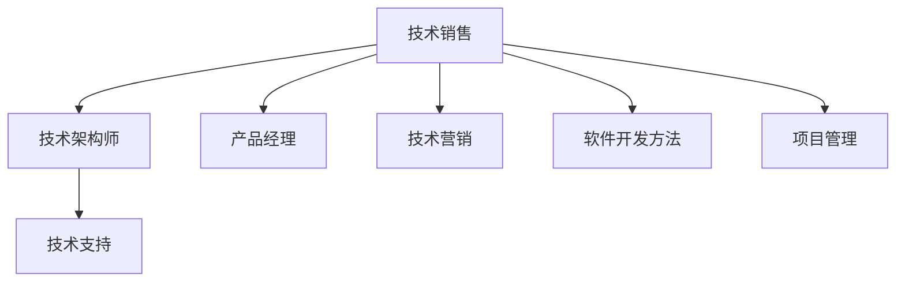

                 

# 如何将编程技能转化为销售能力

> 关键词：编程技能, 销售能力, 技术销售, 技术营销, 软件工程

## 1. 背景介绍

### 1.1 问题由来

在现代企业中，技术团队与销售团队的协同合作愈发重要。技术团队负责研发，而销售团队负责将技术转化为业务成果，推动公司增长。但现实情况往往是不利的，技术团队对市场和技术需求理解不足，销售团队对技术的实现细节缺乏深入了解。这种知识鸿沟导致双方交流不畅，影响产品落地和市场推广。因此，将编程技能转化为销售能力，成为提升技术团队与销售团队协作的关键。

### 1.2 问题核心关键点

本文聚焦于如何将编程技能转化为销售能力，通过技术销售（Technical Sales）的概念，探讨如何将编程能力、软件开发方法、项目管理等技能，应用于销售和市场推广工作中，提升销售团队的数字化、智能化水平。

### 1.3 问题研究意义

通过技术销售，销售团队能够更好地理解技术细节，更准确地向客户传达产品优势，更高效地解决问题。此外，技术销售还能够帮助技术团队更深入地了解客户需求，优化产品设计和用户体验，从而提升整体产品竞争力。

## 2. 核心概念与联系

### 2.1 核心概念概述

为更好地理解如何将编程技能转化为销售能力，本节将介绍几个关键概念：

- 技术销售（Technical Sales）：结合销售和技术双领域的知识和技能，帮助销售团队理解和传达产品技术细节，提升客户满意度。
- 技术营销（Technical Marketing）：结合市场和技术，制定并实施针对技术类产品的营销策略。
- 技术架构师（Technical Architect）：具有深厚技术背景，能够帮助客户理解产品架构和实现细节的专业技术角色。
- 产品经理（Product Manager）：负责产品规划、开发、上线，连接市场和技术的桥梁。
- 技术支持（Technical Support）：提供产品技术问题解答，维护客户关系，提升客户粘性。
- 软件开发方法（Software Development Methodology）：如敏捷开发、DevOps、精益开发等，提升产品开发效率和质量。
- 项目管理（Project Management）：如Scrum、Kanban等，确保项目按时交付，优化资源配置。

这些概念之间具有紧密联系，通过技术销售和营销，技术架构师和产品经理能够更有效地与市场和客户沟通，技术支持和项目管理则保证了产品从开发到交付的全生命周期顺畅运行。

### 2.2 核心概念原理和架构的 Mermaid 流程图



这个流程图展示了技术销售与其他关键概念的连接关系：

1. 技术销售(A)负责连接市场和客户需求与技术实现，起到桥梁作用。
2. 技术架构师(B)提供技术细节，帮助客户理解产品。
3. 技术支持(C)解答技术问题，维护客户关系。
4. 产品经理(D)规划产品路线，优化用户体验。
5. 技术营销(E)制定营销策略，推广产品。
6. 软件开发方法(F)提升开发效率和质量。
7. 项目管理(G)确保项目按时交付，优化资源配置。

这些概念共同构成了技术销售的执行框架，有助于提升技术团队与销售团队的协作效率，推动产品成功落地。

## 3. 核心算法原理 & 具体操作步骤

### 3.1 算法原理概述

技术销售的本质是一种跨领域的技能转化，旨在通过编程技能和软件开发方法，提升销售团队的数字化和智能化水平。其核心原理包括以下几个方面：

- **知识传递**：通过技术培训、案例讲解等方式，将编程知识和软件开发方法传递给销售团队。
- **问题诊断**：利用编程思维，分析客户问题，提出解决方案。
- **需求分析**：结合编程视角，理解客户需求，提供定制化产品。
- **客户沟通**：使用编程语言和技术概念，与客户建立信任和共鸣。

### 3.2 算法步骤详解

技术销售的实施步骤主要包括以下几个环节：

**Step 1: 评估现状**

- 进行内部技术能力评估，了解销售团队现有技术水平。
- 分析销售团队与客户沟通中的常见痛点，找出提升空间。
- 识别关键技术点和难点，为后续技术培训提供方向。

**Step 2: 制定计划**

- 根据评估结果，制定技术培训计划，确定培训内容、频率和形式。
- 制定技术营销策略，规划技术内容传播路径，选择合适的传播渠道。
- 确定技术支持和项目管理的介入方式，确保技术团队与销售团队协同工作。

**Step 3: 实施培训**

- 组织技术培训，包括编程基础、软件开发方法、问题诊断、需求分析等。
- 提供案例分享和实际项目经验，帮助销售团队理解和应用技术知识。
- 安排技术架构师和产品经理进行技术介绍和客户交流，解答疑虑。

**Step 4: 技术支持**

- 提供技术支持服务，帮助销售团队解决技术难题。
- 建立知识共享平台，便于销售团队随时查阅和学习技术资料。
- 定期进行技术更新，确保销售团队保持最新知识。

**Step 5: 绩效评估**

- 设置技术销售评估指标，如客户满意度、技术问题解决率、项目交付准时率等。
- 定期收集反馈，调整技术销售策略和方法，持续优化。
- 分析技术销售成果，与销售团队共同总结经验和教训。

### 3.3 算法优缺点

技术销售的优点包括：

1. **提升销售团队能力**：通过编程技能和软件开发方法的培训，提高销售团队的技术理解能力和问题解决能力。
2. **促进客户满意度**：销售团队能够更准确地理解客户需求，提供更符合期望的产品和服务。
3. **优化资源配置**：结合技术支持和管理，提升项目执行效率，确保资源高效利用。

其缺点包括：

1. **培训成本高**：技术培训需要投入时间和金钱，短期内可能带来一定的成本负担。
2. **学习曲线陡峭**：对于没有编程背景的销售人员，学习新技术和工具可能需要时间。
3. **效果难以量化**：技术销售的效果往往难以直接衡量，需要长期观察和积累。

### 3.4 算法应用领域

技术销售的方法在多个领域都有广泛应用，例如：

- **企业信息化**：将技术销售应用于企业ERP、CRM、HR等系统的推广和实施，提升企业数字化水平。
- **软件开发**：将技术销售应用于软件产品的推广和维护，帮助客户理解产品架构和功能。
- **智能制造**：将技术销售应用于工业4.0和智能制造领域的设备和解决方案推广，提升生产效率。
- **金融科技**：将技术销售应用于金融产品的推广和应用，帮助客户理解技术实现和风险控制。
- **医疗健康**：将技术销售应用于医疗健康产品的推广和实施，提升医疗服务的数字化和智能化水平。

这些领域中，技术销售方法可以帮助企业更好地将技术转化为业务价值，推动行业数字化转型。

## 4. 数学模型和公式 & 详细讲解 & 举例说明

### 4.1 数学模型构建

技术销售的效果可以通过一系列指标进行量化和评估，包括客户满意度、技术问题解决率、项目准时率、销售额增长率等。以下是几个关键指标的数学模型构建：

- **客户满意度（CSAT）**：客户满意度的计算公式为：

$$
\text{CSAT} = \frac{1}{N}\sum_{i=1}^N \text{CSAT}_i
$$

其中 $N$ 为评估样本数量，$\text{CSAT}_i$ 为第 $i$ 个样本的满意度评分。

- **技术问题解决率（TDR）**：技术问题解决率的计算公式为：

$$
\text{TDR} = \frac{S}{T}
$$

其中 $S$ 为成功解决的技术问题数量，$T$ 为问题总数。

- **项目准时率（OTP）**：项目准时率的计算公式为：

$$
\text{OTP} = \frac{C}{T}
$$

其中 $C$ 为按时交付的项目数量，$T$ 为总项目数量。

- **销售额增长率（ROI）**：销售额增长率的计算公式为：

$$
\text{ROI} = \frac{(G_{\text{new}} - G_{\text{old}})}{G_{\text{old}}}
$$

其中 $G_{\text{new}}$ 为新的销售额，$G_{\text{old}}$ 为旧的销售额。

### 4.2 公式推导过程

以客户满意度（CSAT）的计算公式为例，进行推导：

假设某销售团队评估了 $N$ 个客户样本，每个样本的满意度评分为 $1$ 到 $5$ 分。我们定义客户满意度的数学模型如下：

$$
\text{CSAT} = \frac{1}{N}\sum_{i=1}^N \text{CSAT}_i
$$

其中 $\text{CSAT}_i$ 为第 $i$ 个客户的满意度评分。

将公式展开：

$$
\text{CSAT} = \frac{1}{N}(a_1 + a_2 + \cdots + a_N)
$$

其中 $a_i$ 表示第 $i$ 个客户的满意度评分。

通过上述推导，我们可以清晰地看到客户满意度的计算过程。类似地，对于技术问题解决率、项目准时率和销售额增长率的计算，我们也可以按照类似的思路进行推导。

### 4.3 案例分析与讲解

假设某销售团队在某个月份进行了技术销售实践，通过技术培训和支持，提升了销售人员的技术理解和问题解决能力。我们收集了以下数据：

- 技术培训的总课时为 200 小时。
- 客户满意度评分的平均值为 $4.2$。
- 技术问题解决率为 $80\%$。
- 项目准时率为 $95\%$。
- 销售额增长率为 $25\%$。

我们可以通过这些数据来评估技术销售的效果：

- **客户满意度（CSAT）**：

$$
\text{CSAT} = \frac{1}{N}\sum_{i=1}^N \text{CSAT}_i = 4.2
$$

- **技术问题解决率（TDR）**：

$$
\text{TDR} = \frac{S}{T} = 80\% = 0.8
$$

- **项目准时率（OTP）**：

$$
\text{OTP} = \frac{C}{T} = 95\% = 0.95
$$

- **销售额增长率（ROI）**：

$$
\text{ROI} = \frac{(G_{\text{new}} - G_{\text{old}})}{G_{\text{old}}} = 25\%
$$

通过这些计算结果，我们可以得出结论：技术销售实践显著提升了客户满意度和项目交付效率，同时显著推动了销售额增长。

## 5. 项目实践：代码实例和详细解释说明

### 5.1 开发环境搭建

在进行技术销售实践前，我们需要准备好开发环境。以下是使用Python进行PyTorch开发的环境配置流程：

1. 安装Anaconda：从官网下载并安装Anaconda，用于创建独立的Python环境。

2. 创建并激活虚拟环境：
```bash
conda create -n pytorch-env python=3.8 
conda activate pytorch-env
```

3. 安装PyTorch：根据CUDA版本，从官网获取对应的安装命令。例如：
```bash
conda install pytorch torchvision torchaudio cudatoolkit=11.1 -c pytorch -c conda-forge
```

4. 安装TensorBoard：
```bash
pip install tensorboard
```

5. 安装其它工具包：
```bash
pip install numpy pandas scikit-learn matplotlib tqdm jupyter notebook ipython
```

完成上述步骤后，即可在`pytorch-env`环境中开始技术销售实践。

### 5.2 源代码详细实现

下面我们以技术销售的客户满意度（CSAT）评估为例，给出使用PyTorch进行客户满意度评估的Python代码实现。

首先，定义客户满意度评估函数：

```python
import torch

def calculate_csat(satisfaction_scores):
    """
    计算客户满意度（CSAT）
    """
    n = len(satisfaction_scores)
    csat = torch.mean(torch.tensor(satisfaction_scores))
    return csat.item()

# 假设客户满意度评分列表
satisfaction_scores = [4.2, 4.1, 4.3, 4.4, 4.5]
csat = calculate_csat(satisfaction_scores)
print(f"客户满意度：{csat}")
```

然后，我们可以使用这个函数来计算多个客户样本的满意度，并进行平均值的计算。

### 5.3 代码解读与分析

让我们再详细解读一下关键代码的实现细节：

**calculate_csat函数**：
- 定义了一个计算客户满意度（CSAT）的函数，接收一个满意度评分的列表。
- 将评分转换为Tensor，使用`torch.mean`计算平均值。
- 返回计算结果，使用`item()`将其转换为Python浮点数。

通过这个函数，我们可以方便地计算多个客户样本的满意度平均值。

## 6. 实际应用场景

### 6.1 智能制造

技术销售在智能制造领域的推广和实施中发挥了重要作用。智能制造要求高度的技术集成和复杂的操作流程，销售团队需要通过技术培训，理解生产设备的运行机制和维护需求，从而更有效地与客户沟通，推广智能制造解决方案。

具体而言，可以组织销售人员参与智能制造设备的培训，学习设备的操作和维护流程，了解生产线的运行原理和数据采集方式。通过技术培训和支持，销售人员可以更好地向客户展示智能制造的优势，解答技术问题，提供定制化的解决方案。

### 6.2 医疗健康

在医疗健康领域，技术销售的实施同样至关重要。医疗健康产品涉及复杂的临床数据和高度专业化的技术，销售团队需要具备扎实的技术基础，才能更好地理解产品功能，向医生和患者解释技术细节。

例如，销售人员可以接受医疗健康产品的技术培训，学习产品的数据处理、算法实现和临床应用，了解产品的技术特点和优势。通过技术培训，销售人员可以更有效地与医生和患者沟通，解答技术问题，提升医疗服务的质量和效率。

### 6.3 企业信息化

在企业信息化领域，技术销售方法帮助销售团队更好地理解ERP、CRM、HR等系统的功能和技术细节。销售人员通过接受技术培训，学习系统的使用方法和维护知识，可以更有效地推广企业信息化解决方案，解决客户的实际需求。

例如，销售人员可以接受企业信息化的培训，学习ERP系统的模块结构和功能应用，了解数据管理和安全性的技术要求。通过技术培训和支持，销售人员可以更高效地推广ERP系统，解答客户的技术问题，提供定制化的解决方案。

### 6.4 未来应用展望

随着技术销售方法的不断完善，未来其在更多领域的应用前景将更加广阔。例如：

- **金融科技**：技术销售在金融产品的推广和应用中，帮助销售团队理解金融技术的实现细节，提供定制化的金融解决方案。
- **智能家居**：技术销售在智能家居产品的推广和实施中，帮助销售团队理解产品的技术架构和应用场景，提升用户的使用体验。
- **物流管理**：技术销售在物流管理的推广和实施中，帮助销售团队理解物流技术的应用流程和数据管理，优化物流服务质量。
- **智能农业**：技术销售在智能农业的推广和实施中，帮助销售团队理解农业技术的实现细节和应用效果，提升农业生产的智能化水平。

技术销售方法不仅能够提升销售团队的技术能力，还能促进客户对产品的理解和使用，推动技术在各行业的广泛应用，加速数字化转型进程。

## 7. 工具和资源推荐

### 7.1 学习资源推荐

为了帮助开发者系统掌握技术销售的理论基础和实践技巧，这里推荐一些优质的学习资源：

1. **《技术销售与营销》系列博文**：由技术销售专家撰写，深入浅出地介绍了技术销售与营销的基本概念和实践方法。

2. **Coursera《技术销售与营销》课程**：来自知名大学的在线课程，涵盖技术销售和营销的核心内容，适合系统学习。

3. **《技术销售实战指南》书籍**：详细介绍了技术销售的流程、技巧和方法，是实践中的实用工具书。

4. **LinkedIn Learning《技术销售》课程**：提供系统的技术销售培训，涵盖客户沟通、问题诊断、需求分析等关键技能。

5. **Salesforce技术销售资源**：Salesforce作为全球领先的企业管理软件提供商，提供丰富的技术销售资源，包括课程、文档、社区等。

通过对这些资源的学习实践，相信你一定能够快速掌握技术销售的精髓，并用于解决实际的销售问题。

### 7.2 开发工具推荐

高效的开发离不开优秀的工具支持。以下是几款用于技术销售开发的常用工具：

1. **JIRA**：项目管理工具，帮助团队跟踪项目进度，优化资源配置。

2. **Confluence**：知识管理工具，便于团队协作和知识共享。

3. **Slack**：即时通讯工具，促进团队内部沟通和协作。

4. **Zoom**：视频会议工具，支持远程培训和客户交流。

5. **Google Drive**：云存储工具，便于文件共享和远程协作。

合理利用这些工具，可以显著提升技术销售任务的开发效率，加快创新迭代的步伐。

### 7.3 相关论文推荐

技术销售和营销的研究源于学界的持续研究。以下是几篇奠基性的相关论文，推荐阅读：

1. **《技术销售：理论、实践和挑战》**：探讨技术销售的理论基础、实践方法和挑战。

2. **《技术营销：数字时代的创新》**：分析技术营销在数字化转型中的作用和价值。

3. **《技术销售的成功因素》**：研究技术销售成功的关键因素，如客户沟通、问题诊断、需求分析等。

4. **《技术销售与客户关系管理》**：分析技术销售在客户关系管理中的作用和效果。

5. **《技术销售与项目管理》**：研究技术销售和项目管理的关系，探讨如何协同工作。

这些论文代表了大语言模型微调技术的发展脉络。通过学习这些前沿成果，可以帮助研究者把握学科前进方向，激发更多的创新灵感。

## 8. 总结：未来发展趋势与挑战

### 8.1 总结

本文对技术销售方法进行了全面系统的介绍。首先阐述了技术销售的背景和意义，明确了技术销售在提升技术团队与销售团队协作中的重要性。其次，从原理到实践，详细讲解了技术销售的数学模型和关键步骤，给出了技术销售任务开发的完整代码实例。同时，本文还广泛探讨了技术销售方法在多个行业领域的应用前景，展示了技术销售范式的巨大潜力。最后，本文精选了技术销售技术的各类学习资源，力求为读者提供全方位的技术指引。

通过本文的系统梳理，可以看到，技术销售方法正在成为推动产品成功落地的重要手段，极大地提升了销售团队的技术能力和客户满意度。未来，伴随技术销售方法的不断完善和应用，销售团队的技术理解和问题解决能力将进一步增强，推动企业产品和服务在各行业的广泛应用。

### 8.2 未来发展趋势

展望未来，技术销售方法将呈现以下几个发展趋势：

1. **跨领域融合**：技术销售方法将与其他领域的技术方法进行更多融合，如敏捷开发、DevOps、人工智能等，提升技术销售的全面性和效果。
2. **客户体验优化**：技术销售方法将更多关注客户体验的优化，如用户体验设计、用户反馈收集等，提升客户满意度和忠诚度。
3. **数据驱动决策**：技术销售方法将更多依赖数据驱动的决策，如客户行为分析、市场预测等，提升决策的科学性和准确性。
4. **数字化工具应用**：技术销售方法将更多依赖数字化工具，如CRM系统、AI助手等，提升工作效率和客户沟通效率。
5. **全球化市场拓展**：技术销售方法将更多应用于全球化市场，提升企业在国际市场的竞争力。

这些趋势凸显了技术销售方法的广阔前景，技术销售作为连接技术团队和销售团队的桥梁，将在未来变得更加重要，推动企业数字化转型的深入发展。

### 8.3 面临的挑战

尽管技术销售方法已经取得了瞩目成就，但在迈向更加智能化、普适化应用的过程中，仍面临诸多挑战：

1. **技术培训成本高**：技术培训需要投入时间和金钱，短期内可能带来一定的成本负担。
2. **学习曲线陡峭**：对于没有技术背景的销售人员，学习新技术和工具可能需要时间。
3. **效果难以量化**：技术销售的效果往往难以直接衡量，需要长期观察和积累。
4. **知识更新迅速**：技术发展和变化迅速，销售团队需要不断学习新技术，保持知识更新。
5. **跨团队协作困难**：技术团队和销售团队之间的协作可能存在沟通障碍，需要更多的沟通和协调。

这些挑战需要技术销售团队和企业在实践中不断探索和解决，以实现更好的效果。

### 8.4 研究展望

面对技术销售面临的这些挑战，未来的研究需要在以下几个方面寻求新的突破：

1. **技术培训方法的优化**：开发更加灵活和高效的技术培训方法，如在线培训、微培训等，降低培训成本，提高培训效果。
2. **技术支持工具的创新**：开发更加智能化和自动化的技术支持工具，如AI助手、知识图谱等，提升技术支持的效率和效果。
3. **跨团队协作机制的建立**：建立技术团队和销售团队之间的协作机制，促进信息共享和知识传递，提升团队协同效率。
4. **技术销售模型的构建**：建立技术销售的数学模型和评估指标，量化技术销售的效果，优化技术销售策略。
5. **全球化市场适应性**：研究技术销售方法在全球化市场中的应用，提升企业在国际市场的竞争力。

这些研究方向将引领技术销售方法的持续演进，推动企业在各行业的数字化转型中取得更大的成功。

## 9. 附录：常见问题与解答

**Q1：技术销售和销售有什么区别？**

A: 技术销售是一种结合销售和技术领域知识和技能的岗位，与传统销售有所不同。传统销售主要关注产品的销售和客户关系维护，而技术销售更侧重于理解技术细节，解答客户的技术问题，提供定制化的产品和服务。

**Q2：技术销售的培训成本高，如何解决？**

A: 可以采用在线培训、微培训等方式，降低培训成本。同时，可以逐步引入技术销售方法，逐步提升销售团队的技术能力。

**Q3：技术销售的效果如何评估？**

A: 技术销售的效果可以通过客户满意度、技术问题解决率、项目准时率、销售额增长率等指标进行评估。

**Q4：如何提升技术销售的效果？**

A: 可以通过技术培训、技术支持和项目管理等方式，提升销售团队的技术理解和问题解决能力。同时，可以优化客户沟通方式，提升客户满意度。

**Q5：技术销售在未来的发展趋势是什么？**

A: 技术销售将在全球化市场、数字化工具应用、客户体验优化等方面有更大发展。

---

作者：禅与计算机程序设计艺术 / Zen and the Art of Computer Programming

