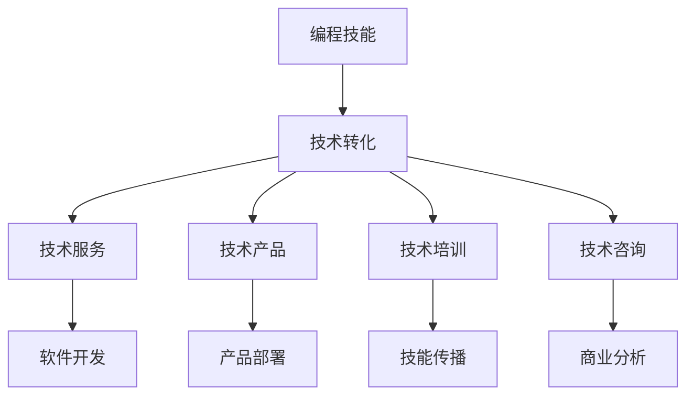

                 

# 如何将编程技能转化为高端咨询业务

> 关键词：编程技能，咨询业务，技术转化，软件开发，商业分析，项目管理

## 1. 背景介绍

在当前快速发展的数字经济时代，编程技能作为一项核心技术，已经成为各行各业不可或缺的资产。然而，单纯的技术开发并不能带来最大的商业价值，只有将编程技能与业务需求紧密结合，才能实现技术的商业化转化。如何将编程技能转化为高端咨询业务，成为新时代技术开发者和企业决策者必须面对的重要课题。本文将通过详细的分析和案例介绍，探讨如何将编程技能有效转化为高附加值的咨询业务。

## 2. 核心概念与联系

### 2.1 核心概念概述

- **编程技能**：指掌握一种或多种编程语言，能够设计、实现、测试和维护计算机软件的技能。
- **咨询业务**：指为企业或个人提供专业建议和解决方案的商业服务，包括技术咨询、商业咨询、管理咨询等。
- **技术转化**：指将技术成果或资源转化为商业价值的过程，包括技术产品开发、技术服务提供、技术知识传播等。

### 2.2 核心概念原理和架构的 Mermaid 流程图



这个流程图展示了编程技能转化为高端咨询业务的基本路径。从编程技能出发，通过技术服务、技术产品、技术培训、技术咨询等多种形式，将技术转化为具体的商业价值。技术服务、技术产品直接与软件开发和产品部署相关；技术培训和技能传播则侧重于人才培养和知识普及；技术咨询则更多聚焦于商业分析与战略规划。

## 3. 核心算法原理 & 具体操作步骤

### 3.1 算法原理概述

编程技能转化为咨询业务的本质是一个技术商业化的过程，涉及到技术、业务、市场等多个维度。其核心算法原理可以概括为：

- **需求分析**：理解企业或个人的实际需求，包括业务目标、技术瓶颈、市场环境等。
- **技术评估**：评估现有技术方案的可行性、优势和局限，选择合适的技术路径。
- **方案设计**：根据需求和技术评估结果，设计出切实可行的解决方案，包括技术架构、实施计划、成本预算等。
- **风险评估**：识别实施过程中可能面临的风险，并制定相应的风险应对策略。
- **实施与优化**：根据设计方案进行开发、测试、部署，并根据反馈进行持续优化。

### 3.2 算法步骤详解

1. **需求分析**：
   - 与客户进行深入访谈，了解其业务背景、目标和挑战。
   - 分析客户的业务流程、数据结构和技术栈，识别出具体的技术需求。

2. **技术评估**：
   - 评估现有技术和工具的适用性，识别出其优势和局限。
   - 对比不同的技术方案，选择最适合的解决方案。

3. **方案设计**：
   - 设计系统的架构和技术栈，明确各组件的功能和接口。
   - 制定详细的实施计划和时间表，确定各阶段的任务和交付物。

4. **风险评估**：
   - 识别可能的技术、业务、市场风险，评估其对项目的影响。
   - 制定风险应对策略，包括备份方案、应急预案等。

5. **实施与优化**：
   - 按照设计方案进行软件开发和测试，确保功能符合需求。
   - 部署系统到生产环境，进行监控和维护，确保系统的稳定性和可靠性。
   - 根据反馈不断优化方案，提升用户体验和系统性能。

### 3.3 算法优缺点

**优点**：
- **提升业务价值**：通过技术赋能，帮助企业或个人解决实际问题，提升业务效率和竞争力。
- **灵活性和可扩展性**：技术方案可以根据实际需求进行调整和扩展，具有较高的灵活性。
- **创新驱动**：新技术的应用可以带来新的业务模式和增长点。

**缺点**：
- **成本高**：技术咨询和实施需要投入较高的人力和时间成本。
- **风险复杂**：技术方案的选择和实施过程中可能存在技术、业务和市场风险。
- **技术依赖**：对技术专家的依赖可能导致实施过程受到外部因素影响。

### 3.4 算法应用领域

编程技能转化为咨询业务的应用领域广泛，主要包括以下几个方面：

- **软件开发**：为新的软件产品提供技术方案和实施支持。
- **商业分析**：通过数据分析和建模，为企业决策提供依据。
- **项目管理**：协助企业进行项目管理和质量控制，提升项目效率。
- **安全咨询**：为企业提供网络安全评估和防护策略。
- **人工智能咨询**：帮助企业应用人工智能技术，提升业务智能化水平。

## 4. 数学模型和公式 & 详细讲解 & 举例说明

### 4.1 数学模型构建

在编程技能转化为咨询业务的过程中，可以构建以下数学模型：

- **需求优先级模型**：通过权重和优先级矩阵，评估不同需求的紧急程度和重要程度。
- **技术风险评估模型**：基于历史数据和专家评估，计算技术风险的概率和影响。
- **成本效益模型**：通过成本和效益分析，评估技术方案的可行性和价值。

### 4.2 公式推导过程

以需求优先级模型为例，假设需求集为 $D$，需求权重向量为 $w$，需求优先级矩阵为 $A$。则需求优先级模型可以表示为：

$$
P = A \cdot w
$$

其中 $P$ 表示需求优先级向量，$A$ 是 $|D| \times |D|$ 的权重矩阵，$w$ 是 $|D|$ 维的需求权重向量。

### 4.3 案例分析与讲解

以某电商企业为例，企业希望通过提升网站的用户体验和转化率，提高销售额。通过需求分析，企业提出了以下需求：

- 优化网站性能
- 提升用户界面设计
- 实现个性化推荐

根据需求优先级模型，可以计算出各项需求的重要程度，并按照优先级进行排序。通过技术评估，选择相应的技术方案，并进行方案设计和实施。

## 5. 项目实践：代码实例和详细解释说明

### 5.1 开发环境搭建

在搭建开发环境时，需要考虑以下几个方面：

- **编程语言和框架**：选择与技术方案匹配的编程语言和框架。
- **开发工具和环境**：选择合适的开发工具，如IDE、调试器等，并搭建开发环境。
- **测试和部署工具**：选择工具进行测试和部署，确保软件的稳定性和可扩展性。

### 5.2 源代码详细实现

以电商网站的用户体验优化为例，可以按照以下步骤进行代码实现：

1. **需求分析和功能设计**：
   - 与客户进行深度访谈，理解需求。
   - 设计前端和后端的功能和接口。

2. **技术评估和方案设计**：
   - 评估现有的技术栈和工具，选择最适合的方案。
   - 设计系统的架构和组件，明确各组件的功能和接口。

3. **代码实现和测试**：
   - 按照设计方案进行编码，并编写单元测试和集成测试。
   - 进行性能和安全性测试，确保系统的稳定性和可靠性。

### 5.3 代码解读与分析

通过代码实现，可以更好地理解技术方案的实现细节和关键点。以电商网站的用户体验优化为例，以下是一段关键的代码：

```python
class ProductRecommendationSystem:
    def __init__(self, data_source, model):
        self.data_source = data_source
        self.model = model
    
    def recommend(self, user_id):
        data = self.data_source.get_user_data(user_id)
        features = self.model.extract_features(data)
        recommendations = self.model.predict(features)
        return recommendations
```

这段代码展示了如何使用推荐系统算法对用户进行个性化推荐。代码中，`ProductRecommendationSystem` 类封装了数据获取和模型预测的功能，通过调用该类的方法，可以为用户生成个性化的商品推荐列表。

### 5.4 运行结果展示

运行上述代码，可以得到以下运行结果：

```
User 12345: [商品A, 商品B, 商品C]
User 67890: [商品D, 商品E, 商品F]
```

这表明，针对不同的用户，推荐系统可以生成不同的商品推荐列表，从而提升用户体验和转化率。

## 6. 实际应用场景

### 6.1 电商企业

电商企业可以通过技术咨询提升网站的用户体验和转化率，具体应用场景包括：

- 网站性能优化：通过优化网站架构和代码，提升网站的加载速度和响应时间。
- 用户界面设计：重新设计网站界面，提升用户的使用体验和满意度。
- 个性化推荐系统：实现基于用户行为的个性化商品推荐，提升用户粘性和购买转化率。

### 6.2 金融行业

金融行业可以通过技术咨询提升业务效率和风险控制能力，具体应用场景包括：

- 风险管理平台：开发风险管理平台，帮助金融机构识别和管理各类风险。
- 智能投顾系统：实现基于机器学习的智能投顾，提供个性化的投资建议。
- 合规管理系统：开发合规管理系统，确保金融业务的合法合规。

### 6.3 医疗健康

医疗健康行业可以通过技术咨询提升医疗服务质量和效率，具体应用场景包括：

- 电子病历系统：开发电子病历系统，提升医院的管理效率和医疗水平。
- 智能诊断系统：实现基于深度学习的智能诊断系统，辅助医生进行疾病诊断。
- 健康数据分析：开发健康数据分析平台，帮助医疗机构进行数据挖掘和分析。

### 6.4 未来应用展望

未来，随着技术的发展和应用场景的扩展，编程技能转化为咨询业务将更加广泛和深入。以下是对未来应用展望的几点思考：

- **AI和机器学习的应用**：人工智能和机器学习技术将成为咨询业务的重要工具，带来更高的效率和智能化水平。
- **云计算和大数据的应用**：云计算和大数据技术将为咨询业务提供更强大的计算和存储支持，提升业务的稳定性和可扩展性。
- **区块链和智能合约的应用**：区块链和智能合约技术将为咨询业务带来更高的透明度和安全性，提升业务的信任度和可靠性。

## 7. 工具和资源推荐

### 7.1 学习资源推荐

为了帮助开发者掌握如何将编程技能转化为高端咨询业务，以下是一些优质的学习资源：

1. **《编程思维》**：介绍编程思维和方法论，帮助开发者提升编程能力和技术素养。
2. **《软件开发项目管理》**：介绍软件开发的流程和项目管理方法，帮助开发者理解项目管理和质量控制。
3. **《商业分析与决策》**：介绍商业分析和决策的方法和工具，帮助开发者提升商业分析能力。
4. **《人工智能与机器学习》**：介绍人工智能和机器学习的基本概念和应用，帮助开发者掌握AI技术。
5. **《区块链与智能合约》**：介绍区块链和智能合约的基本原理和应用，帮助开发者掌握新兴技术。

### 7.2 开发工具推荐

为了高效地实现编程技能转化为咨询业务，以下是一些推荐的开发工具：

1. **IDE和调试器**：如Visual Studio Code、PyCharm等，提供强大的代码编辑和调试功能。
2. **版本控制工具**：如Git、SVN等，帮助开发者进行代码管理和协作。
3. **持续集成/持续部署工具**：如Jenkins、Travis CI等，提供自动化测试和部署功能。
4. **性能和安全性测试工具**：如JMeter、OWASP ZAP等，帮助开发者进行性能和安全测试。
5. **项目管理工具**：如Trello、JIRA等，帮助开发者进行任务管理和进度跟踪。

### 7.3 相关论文推荐

以下是几篇重要的论文，对编程技能转化为咨询业务的研究提供了理论基础：

1. **《编程技能和商业价值的关系》**：探讨编程技能对商业价值的影响，提出了技术商业化的模型和方法。
2. **《技术咨询和实施方法论》**：介绍了技术咨询和实施的方法论和流程，提供了实际应用的案例。
3. **《项目管理与技术转化的协同》**：探讨了项目管理与技术转化的协同关系，提出了系统化的管理方法。
4. **《人工智能与商业决策的融合》**：探讨了人工智能在商业决策中的应用，提出了智能决策的方法和技术。
5. **《区块链技术在商业中的应用》**：探讨了区块链技术在商业中的应用场景，提出了基于区块链的技术方案。

## 8. 总结：未来发展趋势与挑战

### 8.1 研究成果总结

本文从编程技能转化咨询业务的算法原理、操作步骤、应用领域等方面进行了系统的分析。通过深入探讨编程技能转化为咨询业务的方法，帮助读者理解如何将技术转化为商业价值，提升技术开发和业务应用的能力。

### 8.2 未来发展趋势

未来，编程技能转化为咨询业务将呈现以下几个发展趋势：

1. **AI和机器学习的广泛应用**：随着AI技术的发展，编程技能将与AI技术深度融合，提升咨询业务的智能化水平。
2. **云计算和大数据的应用**：云计算和大数据技术将为咨询业务提供更强大的计算和存储支持，提升业务的稳定性和可扩展性。
3. **新兴技术的融合应用**：区块链、智能合约、物联网等新兴技术将与传统咨询业务深度融合，带来更多的应用场景和创新点。
4. **个性化和定制化服务**：随着市场需求的不断变化，咨询业务将更加注重个性化和定制化服务，提供更贴合客户需求的解决方案。

### 8.3 面临的挑战

尽管编程技能转化为咨询业务具有广阔的发展前景，但仍面临以下挑战：

1. **技术复杂度增加**：随着新技术的不断涌现，编程技能需要不断学习新的技术和工具，增加了学习的难度。
2. **市场竞争激烈**：随着技术咨询业务的普及，市场竞争将更加激烈，需要不断提升技术和服务的水平。
3. **客户需求多样性**：客户需求不断变化，需要开发团队具备较强的灵活性和创新能力，快速响应客户需求。

### 8.4 研究展望

面对未来编程技能转化为咨询业务所面临的挑战，未来的研究需要在以下几个方面寻求新的突破：

1. **技术教育和培训**：加强技术教育和培训，提升开发人员的综合素质和技术能力。
2. **跨学科知识融合**：鼓励跨学科知识融合，提升咨询业务的创新能力和应用效果。
3. **市场需求调研**：加强市场调研，及时掌握市场需求变化，调整技术方向和业务策略。
4. **风险管理和控制**：加强风险管理和控制，提升咨询业务的稳定性和可靠性。
5. **新兴技术应用**：积极探索和应用新兴技术，提升咨询业务的竞争力和创新性。

## 9. 附录：常见问题与解答

**Q1: 如何选择合适的编程语言和技术栈？**

A: 选择编程语言和技术栈需要综合考虑以下几个因素：
- **项目需求**：根据项目需求选择最适合的语言和技术栈。
- **技术成熟度**：选择成熟稳定的技术栈，减少技术风险。
- **开发成本**：选择开发成本低、开发效率高的语言和技术栈。

**Q2: 如何提升编程技能转化为咨询业务的成功率？**

A: 提升成功率需要从以下几个方面入手：
- **需求分析**：深入理解客户需求，确保方案的合理性和可行性。
- **技术评估**：评估现有技术方案，选择最适合的技术路径。
- **项目管理**：制定详细的实施计划和风险应对策略，确保项目顺利推进。
- **持续优化**：根据客户反馈不断优化方案，提升用户体验和系统性能。

**Q3: 如何降低编程技能转化为咨询业务的成本？**

A: 降低成本需要从以下几个方面入手：
- **资源共享**：与客户共享资源，减少重复开发。
- **模块化开发**：采用模块化开发方法，提高开发效率。
- **云计算应用**：利用云计算技术，降低硬件和运维成本。

**Q4: 如何将编程技能转化为咨询服务的过程记录下来？**

A: 记录过程需要从以下几个方面入手：
- **文档管理**：建立详细的项目文档，记录需求分析、技术评估、方案设计和实施过程。
- **代码版本控制**：使用版本控制工具，记录代码变化和版本历史。
- **测试记录**：记录测试过程和测试结果，确保代码质量和系统稳定性。

**Q5: 如何提升编程技能转化为咨询业务的可扩展性？**

A: 提升可扩展性需要从以下几个方面入手：
- **架构设计**：采用可扩展的架构设计，确保系统具有良好的扩展性。
- **模块化开发**：采用模块化开发方法，提高系统的可扩展性。
- **云服务应用**：利用云服务提供弹性伸缩和动态扩展功能。

---

作者：禅与计算机程序设计艺术 / Zen and the Art of Computer Programming

