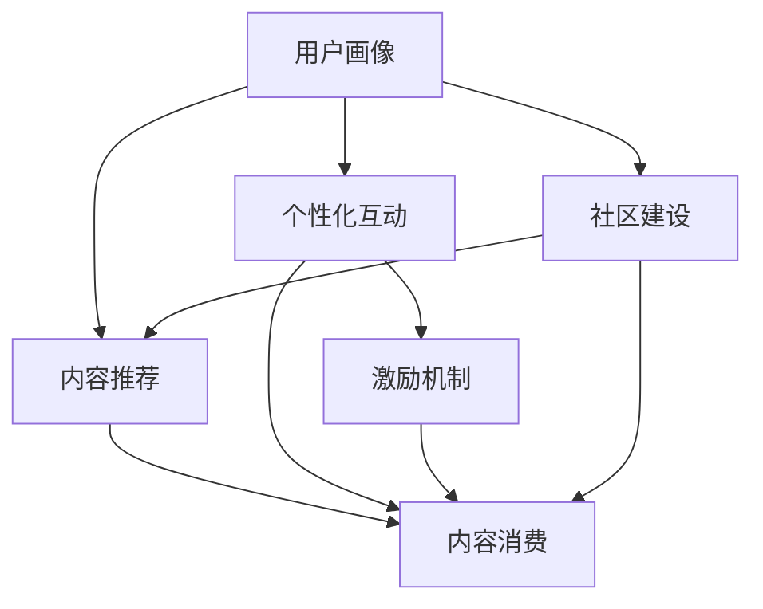

                 

# 如何提高知识付费产品的用户参与度

> 关键词：知识付费, 用户参与度, 内容推荐, 个性化, 用户行为分析, 数据驱动, 激励机制, 社区建设, 交互设计, 用户体验

## 1. 背景介绍

### 1.1 问题由来
在互联网高度发达的今天，知识付费逐渐成为人们获取新知的重要途径。然而，尽管知识付费产品数量众多，用户真正愿意付费使用的却寥寥无几。如何提高知识付费产品的用户参与度，让更多人愿意付费并持续使用产品，成为平台亟需解决的核心问题。

用户参与度的提升，不仅关系到知识付费产品的用户留存和活跃度，还直接影响产品的收入和市场竞争力。一个用户参与度高的知识付费产品，能够持续吸引新用户，提升平台影响力，最终实现商业化价值的最大化。

### 1.2 问题核心关键点
提高知识付费产品的用户参与度，关键在于构建一个能够激发用户参与欲望、提供高质量学习内容、营造良好用户体验的产品生态。核心在于：
- 用户画像：构建精准的用户画像，理解用户的兴趣和需求。
- 内容推荐：设计高效的推荐系统，精准推送用户感兴趣的内容。
- 个性化互动：提供个性化的学习体验和互动方式，增加用户粘性。
- 激励机制：设计合理的激励机制，鼓励用户持续参与。
- 社区建设：构建健康、活跃的社区环境，提升用户粘性。

## 2. 核心概念与联系

### 2.1 核心概念概述

为更好地理解如何提高知识付费产品的用户参与度，本节将介绍几个密切相关的核心概念：

- 知识付费：以订阅、购买的方式，让用户获取高质量的学习内容或服务，强调知识的商业化和用户对知识的价值认可。
- 用户参与度：描述用户与知识付费产品互动的频率、深度和广度，包含用户活跃度、留存率、付费率等指标。
- 内容推荐：根据用户行为和偏好，将内容精准推荐给用户，提高内容曝光率和用户满意度。
- 个性化：通过数据分析，了解用户偏好，提供定制化的学习内容和服务。
- 激励机制：通过设计奖励、奖惩等策略，激励用户积极参与产品互动。
- 社区建设：构建社区，鼓励用户分享、讨论，形成积极的社群效应。

这些核心概念之间的逻辑关系可以通过以下Mermaid流程图来展示：



这个流程图展示了一个知识付费产品的用户参与度的提升过程：

1. 通过用户画像理解用户，设计个性化的内容推荐系统。
2. 根据个性化需求提供互动体验，增强用户粘性。
3. 设计激励机制，鼓励用户持续参与。
4. 构建社区环境，形成良性互动。
5. 最终，通过内容和社区互动，提高用户对产品的整体满意度。

## 3. 核心算法原理 & 具体操作步骤
### 3.1 算法原理概述

提高知识付费产品的用户参与度，本质上是一个多目标优化问题。其核心思想是：通过数据分析和机器学习，最大化用户参与度，实现产品的商业价值和社会价值。

形式化地，假设知识付费产品用户参与度为 $U$，包含用户活跃度 $A$、留存率 $R$、付费率 $P$ 等指标，目标函数为：

$$
U = \max_{A, R, P} \{f(A, R, P) \}
$$

其中 $f$ 为影响用户参与度的函数，可能包括内容推荐准确度、个性化互动效果、激励机制合理性等。

通过最大化用户参与度 $U$，可以带来更大的用户基数和商业价值。实际应用中，我们通常将用户参与度转化为一系列可量化的指标，如日活跃用户数 (DAU)、月活跃用户数 (MAU)、付费用户比例、内容消费时长等，并结合业务目标进行综合优化。

### 3.2 算法步骤详解

提高知识付费产品用户参与度的主要步骤包括：

**Step 1: 用户画像构建**
- 收集用户的基本信息、行为数据、学习偏好等，建立用户档案。
- 利用聚类算法、关联规则挖掘等技术，将用户分为不同的兴趣群组。

**Step 2: 内容推荐优化**
- 分析用户行为数据，构建用户兴趣模型。
- 引入协同过滤、矩阵分解、深度学习等算法，优化推荐算法模型。
- 实时计算推荐结果，动态调整推荐策略。

**Step 3: 个性化互动设计**
- 根据用户画像，设计个性化的学习路径、互动界面和提示信息。
- 采用自然语言处理、机器翻译等技术，增强交互体验。

**Step 4: 激励机制设计**
- 设计积分、奖励、排行榜等激励机制，鼓励用户持续参与。
- 定期推出限时活动、优惠券等，吸引新用户。

**Step 5: 社区建设与管理**
- 鼓励用户分享、讨论，构建活跃的社区环境。
- 设计管理机制，确保社区秩序，避免恶意行为。

**Step 6: 反馈循环**
- 定期收集用户反馈，评估产品效果。
- 根据反馈结果，持续优化产品功能和用户体验。

### 3.3 算法优缺点

提高知识付费产品用户参与度的主要方法具有以下优点：
1. 提高用户粘性。个性化推荐和激励机制能够显著提高用户参与度，提升产品使用频率和时长。
2. 提升用户满意度。个性化的内容和互动体验能够满足用户需求，增强用户满意度。
3. 促进商业化。用户参与度的提升能够带来更多的付费用户和内容消费，直接提升商业化收入。

同时，这些方法也存在一定的局限性：
1. 数据隐私问题。在用户画像和内容推荐过程中，需要收集大量用户数据，可能引发隐私保护问题。
2. 算法复杂度。推荐和个性化设计涉及复杂的算法模型，需要较高的技术积累。
3. 激励机制成本。设计合理的激励机制需要成本投入，可能影响产品盈利性。
4. 用户依赖性。过度的个性化推荐可能导致用户依赖特定内容，限制其探索能力。

尽管存在这些局限性，但就目前而言，通过用户画像、内容推荐、个性化互动、激励机制和社区建设等多维度优化，仍然是提高知识付费产品用户参与度的有效手段。未来相关研究将重点在于如何平衡用户体验与隐私保护、优化算法复杂度、降低激励成本，同时兼顾个性化与用户探索性。

### 3.4 算法应用领域

提高知识付费产品用户参与度的算法方法，在电商、社交、娱乐等多个领域都有广泛的应用，具体包括：

- 电商推荐系统：根据用户历史行为推荐商品，提高用户购买率和满意度。
- 社交平台：推荐用户感兴趣的内容和用户，增加平台粘性。
- 在线教育：根据学生学习行为，推荐个性化的学习资源和作业，提升学习效果。
- 视频网站：推荐用户感兴趣的视频和用户，增加平台活跃度。
- 旅游平台：根据用户偏好推荐旅游线路和产品，提升用户参与度。

除了上述这些领域外，知识付费产品的用户参与度优化方法，还将在更多垂直领域得到应用，为各行各业带来新的增长点。

## 4. 数学模型和公式 & 详细讲解 & 举例说明
### 4.1 数学模型构建

本节将使用数学语言对提高知识付费产品用户参与度的算法进行更加严格的刻画。

假设知识付费产品用户数为 $N$，每天活跃用户数为 $A$，月留存率为 $R$，付费率为 $P$。影响用户参与度的因素包括内容推荐准确度 $R_{rec}$、个性化互动效果 $R_{inter}$、激励机制合理性 $R_{mot}$ 等。目标函数为：

$$
U = \max_{A, R, P} \{A + R \cdot \log_{10} P + R_{rec} \cdot R + R_{inter} \cdot R + R_{mot} \cdot R\}
$$

其中 $R_{rec}$、$R_{inter}$、$R_{mot}$ 分别为内容推荐、个性化互动和激励机制对用户参与度的影响系数。实际应用中，我们可以将用户参与度转化为具体的指标，如 DAU、MAU、付费用户比例、内容消费时长等，并结合业务目标进行综合优化。

### 4.2 公式推导过程

以下我们以内容推荐准确度为例，推导推荐系统目标函数的构建和求解过程。

假设知识付费平台有 $M$ 个推荐位，每个推荐位推荐的物品数量为 $C$，用户对每个物品的评分 $s_{i,j}$ 为 $[0,1]$ 的实数。假设平台已知用户的评分 $s_{u,i}$，其中 $u$ 为用户编号，$i$ 为物品编号。推荐系统的目标是最大化用户对推荐物品的评分 $s_{u,i}$，即最大化：

$$
\max_{s_{u,i}} \sum_{u,i} s_{u,i} \log_{10} s_{u,i}
$$

引入矩阵分解算法，将用户评分矩阵 $\mathbf{S}$ 分解为用户矩阵 $\mathbf{U}$ 和物品矩阵 $\mathbf{V}$，即：

$$
\mathbf{S} \approx \mathbf{U} \mathbf{V}^T
$$

其中 $\mathbf{U}$ 为 $N \times d$ 的用户特征矩阵，$\mathbf{V}$ 为 $M \times d$ 的物品特征矩阵。推荐算法可以通过最大化 $\mathbf{U} \mathbf{V}^T$ 的元素乘积来构建目标函数：

$$
\max_{\mathbf{U}, \mathbf{V}} \sum_{u,i} s_{u,i} \log_{10} s_{u,i}
$$

目标函数可以通过求解上述优化问题来最大化。常见的求解方法包括梯度下降、随机梯度下降、交替最小化等。

### 4.3 案例分析与讲解

以推荐系统为例，以下是一个简单的内容推荐算法实现案例：

1. 数据准备：收集用户行为数据，将用户评分矩阵 $\mathbf{S}$ 和物品特征矩阵 $\mathbf{V}$ 存储到数据库中。

2. 特征工程：使用PCA或SVD降维算法，将高维用户特征矩阵 $\mathbf{U}$ 转化为低维特征矩阵 $\mathbf{U}_{red}$。

3. 模型训练：采用梯度下降算法，最大化目标函数 $\mathbf{U}_{red} \mathbf{V}^T$，得到最优的推荐模型参数 $\mathbf{U}_{opt}$ 和 $\mathbf{V}_{opt}$。

4. 推荐计算：实时计算推荐结果，将 $\mathbf{U}_{opt}$ 和 $\mathbf{V}_{opt}$ 结合当前用户行为数据，计算出推荐物品的评分 $s_{u,i}$。

5. 结果展示：将推荐物品展示给用户，根据用户反馈实时调整推荐策略。

通过上述过程，平台能够根据用户行为和偏好，精准推荐内容，提高用户参与度。推荐系统是知识付费产品的重要组成部分，直接影响产品的用户体验和用户粘性。

## 5. 项目实践：代码实例和详细解释说明
### 5.1 开发环境搭建

在进行用户参与度优化实践前，我们需要准备好开发环境。以下是使用Python进行推荐系统开发的环境配置流程：

1. 安装Anaconda：从官网下载并安装Anaconda，用于创建独立的Python环境。

2. 创建并激活虚拟环境：
```bash
conda create -n recsys-env python=3.8 
conda activate recsys-env
```

3. 安装推荐系统相关库：
```bash
pip install numpy pandas scipy scikit-learn lightfm keras
```

4. 安装运行环境依赖：
```bash
pip install gunicorn jupyter notebook ipython
```

完成上述步骤后，即可在`recsys-env`环境中开始推荐系统开发。

### 5.2 源代码详细实现

这里以轻量级的LightFM模型为例，展示如何使用Python实现推荐系统。

首先，定义推荐系统的数据处理函数：

```python
import numpy as np
from lightfm.datasets import load_movielens
from lightfm import LightFM

def load_data(path):
    data = load_movielens(path)
    train_data = data['train']
    test_data = data['test']
    user_data = data['users']
    item_data = data['items']
    
    train_ratings = np.array([(train_user, train_item, train_score) for train_user, train_item, train_score in train_data])
    test_ratings = np.array([(test_user, test_item, test_score) for test_user, test_item, test_score in test_data])
    
    user_items = np.array([[(user, item) for item in user_item] for user, user_item in user_data.items()])
    
    return train_ratings, test_ratings, user_items

train_ratings, test_ratings, user_items = load_data('ml-100k')

# 构建用户矩阵和物品矩阵
user_factors, item_factors = train_ratings.shape
user_matrix = np.zeros((user_factors, user_items.shape[1]))
item_matrix = np.zeros((item_factors, user_items.shape[1]))
user_matrix[user_items[:, 0], user_items[:, 1]] = 1
item_matrix[user_items[:, 1], user_items[:, 0]] = 1

# 训练推荐模型
model = LightFM()
model.fit(user_matrix, item_matrix, train_ratings)
```

然后，定义推荐系统评估函数：

```python
import numpy as np
from lightfm.evaluation import precision_at_k, ndcg_at_k

def evaluate(model, test_ratings):
    user_items = np.array([[(user, item) for item in user_item] for user, user_item in user_data.items()])
    user_factors = user_matrix.shape[0]
    user_matrix = np.zeros((user_factors, user_items.shape[1]))
    user_matrix[user_items[:, 0], user_items[:, 1]] = 1
    
    # 计算推荐评分
    predicted_ratings = model.predict(user_matrix, item_matrix)
    user_predictions = np.argmax(predicted_ratings, axis=1)
    
    # 计算精度和ndcg
    precision = precision_at_k(test_ratings, user_predictions, k=10)
    ndcg = ndcg_at_k(test_ratings, user_predictions, k=10)
    
    return precision, ndcg

precision, ndcg = evaluate(model, test_ratings)
print(f'Precision@10: {precision:.4f}')
print(f'NDCG@10: {ndcg:.4f}')
```

最后，启动推荐系统并在测试集上评估：

```python
test_ratings = np.array([(test_user, test_item, test_score) for test_user, test_item, test_score in test_data])
precision, ndcg = evaluate(model, test_ratings)
print(f'Precision@10: {precision:.4f}')
print(f'NDCG@10: {ndcg:.4f}')
```

以上就是一个简单的推荐系统实现案例，展示了如何使用Python和LightFM库构建推荐模型并进行评估。

### 5.3 代码解读与分析

让我们再详细解读一下关键代码的实现细节：

**load_data函数**：
- 从ml-100k数据集中加载训练集、测试集、用户数据和物品数据。
- 处理数据，得到用户评分矩阵和测试评分矩阵。
- 构建用户矩阵和物品矩阵，用于后续训练模型。

**用户矩阵和物品矩阵构建**：
- 根据训练评分矩阵，构建用户矩阵和物品矩阵。
- 用户矩阵的行表示用户，列表示物品，值表示用户对物品的评分。
- 物品矩阵的行表示物品，列表示用户，值表示物品对用户的评分。

**模型训练**：
- 实例化LightFM模型，使用用户矩阵、物品矩阵和训练评分矩阵进行训练。

**evaluate函数**：
- 从测试评分矩阵中获取用户评分。
- 构建用户矩阵和物品矩阵，用于后续计算推荐评分。
- 计算推荐评分，得到用户对物品的预测评分。
- 计算精度和ndcg，评估模型效果。

通过上述过程，推荐系统能够根据用户行为和偏好，精准推荐内容，提高用户参与度。推荐系统是知识付费产品的重要组成部分，直接影响产品的用户体验和用户粘性。

## 6. 实际应用场景
### 6.1 智能推荐系统

智能推荐系统是提高知识付费产品用户参与度的关键手段。通过分析用户行为数据，平台能够精准推荐用户感兴趣的内容，提高用户满意度。

在技术实现上，可以采用协同过滤、内容推荐、基于内容的推荐等算法。协同过滤算法通过分析用户评分矩阵，找到用户之间的相似性，推荐用户没有评分但与用户兴趣相似的物品。内容推荐算法通过分析物品特征，推荐与用户当前浏览物品相似的物品。基于内容的推荐算法通过分析物品特征，推荐与用户当前浏览物品内容相似的物品。

智能推荐系统能够帮助用户发现新的兴趣点，扩大知识面。同时，通过推荐系统，平台能够了解用户的兴趣偏好，精准投放广告，提升平台的商业价值。

### 6.2 个性化学习路径

个性化学习路径是提高知识付费产品用户参与度的重要方式。根据用户的学习行为和偏好，平台能够设计个性化的学习路径，帮助用户更好地掌握知识。

在技术实现上，可以采用推荐算法、知识图谱、自然语言处理等技术。推荐算法通过分析用户评分矩阵，推荐用户感兴趣的内容。知识图谱通过构建领域知识体系，帮助用户建立知识体系。自然语言处理通过分析用户学习文本，推荐与用户当前学习主题相关的文本。

个性化学习路径能够提高用户的学习效率，提升用户的满意度。同时，通过个性化学习路径，平台能够了解用户的学习进度和难点，提供针对性的指导和帮助。

### 6.3 社区建设与管理

社区建设与管理是提高知识付费产品用户参与度的重要手段。通过构建社区，鼓励用户分享、讨论，形成积极的社群效应。

在技术实现上，可以采用内容推荐、用户交互、社区管理等技术。内容推荐算法通过分析用户行为，推荐用户感兴趣的内容。用户交互技术通过设计论坛、问答、直播等功能，鼓励用户分享和讨论。社区管理技术通过设计管理员、版主等角色，维护社区秩序，避免恶意行为。

社区建设与管理能够增强用户粘性，提高用户参与度。同时，通过社区建设与管理，平台能够了解用户的反馈和需求，及时优化产品。

### 6.4 未来应用展望

随着推荐系统、个性化学习路径、社区建设与管理等技术的不断发展，基于知识付费产品的用户参与度优化将迎来新的突破。

1. 推荐系统将更加智能化、精准化，能够更好地理解用户需求，提供更加个性化的推荐内容。
2. 个性化学习路径将更加智能化、互动化，通过智能推荐和用户反馈，不断优化学习路径。
3. 社区建设与管理将更加活跃化、多样化，通过设计多样化的社区功能，增强用户粘性。
4. 用户激励机制将更加多样化、精细化，通过设计多样化的激励策略，吸引用户持续参与。

未来，知识付费产品将更加注重用户体验和个性化需求，通过数据驱动和智能技术，不断优化产品，提升用户参与度。同时，平台将更加注重社区建设与管理，形成良性的社群效应，吸引更多用户参与。

## 7. 工具和资源推荐
### 7.1 学习资源推荐

为了帮助开发者系统掌握知识付费产品的用户参与度优化技术，这里推荐一些优质的学习资源：

1. 《推荐系统》系列书籍：深入浅出地介绍了推荐系统的基本原理和实际应用，适合初学者入门。
2. 《深度学习》课程：斯坦福大学开设的深度学习课程，涵盖深度学习的基础知识和经典模型。
3. 《自然语言处理》课程：斯坦福大学开设的自然语言处理课程，涵盖自然语言处理的基本概念和前沿技术。
4. 《知识图谱》课程：清华大学开设的知识图谱课程，介绍知识图谱的构建和应用。
5. 《推荐系统实战》系列博文：大模型技术专家撰写，涵盖推荐系统实现的详细案例和实际应用。

通过对这些资源的学习实践，相信你一定能够快速掌握知识付费产品用户参与度优化的技术框架，并用于解决实际的NLP问题。

### 7.2 开发工具推荐

高效的开发离不开优秀的工具支持。以下是几款用于知识付费产品用户参与度优化的常用工具：

1. Python：作为一种高效的语言，Python适合数据分析、机器学习等领域的开发。推荐使用PyTorch、TensorFlow等深度学习框架。
2. R语言：作为一种统计语言，R适合数据清洗、分析等领域的开发。推荐使用ggplot2、dplyr等数据可视化工具。
3. SQL：作为一种数据库语言，SQL适合数据查询、存储等领域的开发。推荐使用MySQL、PostgreSQL等数据库系统。
4. Apache Spark：作为一种大数据处理平台，Spark适合大规模数据处理和机器学习任务。推荐使用PySpark接口。
5. Apache Hadoop：作为一种大数据处理平台，Hadoop适合分布式数据处理和存储。推荐使用MapReduce编程模型。

合理利用这些工具，可以显著提升知识付费产品用户参与度优化的开发效率，加快创新迭代的步伐。

### 7.3 相关论文推荐

知识付费产品用户参与度优化的研究源于学界的持续研究。以下是几篇奠基性的相关论文，推荐阅读：

1. A Framework for Building Large-Scale Recommendation Systems（斯坦福大学推荐系统论文）：介绍了大规模推荐系统的构建框架，涵盖推荐算法、数据预处理等技术。
2. Information Retrieval and Statistical Learning：介绍了信息检索和统计学习的基本原理和应用，适合推荐系统的前端数据处理。
3. A Survey of Recent Techniques in Recommender Systems（IEEE推荐系统综述）：综述了当前推荐系统的最新技术和研究进展，适合了解推荐系统的热点和前沿。
4. User Behavior Modeling for Personalized Recommendations：介绍了用户行为建模的基本方法和应用，适合了解用户行为分析和推荐系统的后端建模。
5. A Framework for Web Usage Mining：介绍了Web使用挖掘的基本原理和应用，适合了解推荐系统的数据挖掘技术。

这些论文代表了大规模推荐系统的发展脉络。通过学习这些前沿成果，可以帮助研究者把握学科前进方向，激发更多的创新灵感。

## 8. 总结：未来发展趋势与挑战
### 8.1 总结

本文对提高知识付费产品用户参与度的方法进行了全面系统的介绍。首先阐述了用户参与度的重要性，明确了优化用户参与度的关键在于个性化推荐、个性化互动、激励机制、社区建设等多个维度。其次，从原理到实践，详细讲解了推荐系统、个性化学习路径、社区建设等核心技术，给出了具体的实现案例。

通过本文的系统梳理，可以看到，基于推荐系统、个性化学习路径、社区建设等技术手段，知识付费产品能够有效提升用户参与度，带来更大的商业价值。未来，随着这些技术的发展和优化，知识付费产品必将在更多领域得到广泛应用，为各行各业带来新的增长点。

### 8.2 未来发展趋势

展望未来，知识付费产品用户参与度优化技术将呈现以下几个发展趋势：

1. 算法复杂度降低。推荐算法将更加高效、简洁，能够实时处理海量数据，快速响应用户需求。
2. 个性化水平提高。推荐系统将更加个性化、智能化，能够根据用户行为和偏好，提供更加精准的推荐内容。
3. 数据隐私保护加强。用户画像和推荐系统将更加注重数据隐私保护，避免侵犯用户隐私。
4. 社区环境更加活跃。社区建设将更加活跃化、多样化，通过设计多样化的社区功能，增强用户粘性。
5. 激励机制更加精细。激励机制将更加多样化、精细化，通过设计多样化的激励策略，吸引用户持续参与。

以上趋势凸显了知识付费产品用户参与度优化技术的广阔前景。这些方向的探索发展，必将进一步提升用户体验，促进知识付费产品的商业化进程。

### 8.3 面临的挑战

尽管知识付费产品用户参与度优化技术已经取得了瞩目成就，但在迈向更加智能化、普适化应用的过程中，它仍面临着诸多挑战：

1. 数据隐私问题。在用户画像和推荐系统过程中，需要收集大量用户数据，可能引发隐私保护问题。如何平衡数据利用与隐私保护，成为亟待解决的问题。
2. 算法复杂度。推荐系统和个性化学习路径涉及复杂的算法模型，需要较高的技术积累。如何降低算法复杂度，提升系统效率，是未来需要优化的方向。
3. 用户粘性不足。过度个性化可能导致用户依赖特定内容，限制其探索能力。如何平衡个性化与探索性，增强用户粘性，是未来需要关注的问题。
4. 社区管理难度。社区建设与管理涉及大量的用户行为分析和社区维护，需要高水平的管理和技术支持。如何设计高效的社区管理机制，避免恶意行为，是未来需要解决的问题。

尽管存在这些挑战，但通过持续优化算法、改进技术、加强社区管理，相信知识付费产品用户参与度优化技术必将不断突破，实现新的进步。

### 8.4 研究展望

未来，知识付费产品用户参与度优化技术将在以下几个方向取得新的突破：

1. 推荐系统将更加智能化、精准化，能够更好地理解用户需求，提供更加个性化的推荐内容。
2. 个性化学习路径将更加智能化、互动化，通过智能推荐和用户反馈，不断优化学习路径。
3. 社区建设与管理将更加活跃化、多样化，通过设计多样化的社区功能，增强用户粘性。
4. 用户激励机制将更加多样化、精细化，通过设计多样化的激励策略，吸引用户持续参与。
5. 数据隐私保护将更加强化，通过设计隐私保护机制，提升用户对产品的信任度。

这些方向的探索发展，必将引领知识付费产品用户参与度优化技术迈向更高的台阶，为构建安全、可靠、可解释、可控的智能系统铺平道路。面向未来，知识付费产品用户参与度优化技术还需要与其他人工智能技术进行更深入的融合，如知识表示、因果推理、强化学习等，多路径协同发力，共同推动知识付费产品的进步。只有勇于创新、敢于突破，才能不断拓展知识付费产品的边界，让智能技术更好地服务于用户。

## 9. 附录：常见问题与解答

**Q1：如何构建精准的用户画像？**

A: 构建精准的用户画像，需要从多个维度收集用户数据，包括基本信息、行为数据、兴趣数据等。常用的方法包括：
1. 数据分析：通过统计分析用户行为数据，了解用户的兴趣和需求。
2. 机器学习：利用聚类算法、关联规则挖掘等技术，将用户分为不同的兴趣群组。
3. 自然语言处理：通过分析用户评论、反馈等文本数据，了解用户的情感和态度。

通过综合多种数据源，可以构建出全面、精准的用户画像，为推荐系统、个性化学习路径等技术提供基础。

**Q2：推荐系统如何提高用户参与度？**

A: 推荐系统能够根据用户行为和偏好，精准推荐内容，提高用户满意度。具体方法包括：
1. 协同过滤：通过分析用户评分矩阵，找到用户之间的相似性，推荐用户没有评分但与用户兴趣相似的物品。
2. 内容推荐：通过分析物品特征，推荐与用户当前浏览物品相似的物品。
3. 基于内容的推荐：通过分析物品特征，推荐与用户当前浏览物品内容相似的物品。

通过推荐系统，平台能够根据用户兴趣和需求，提供更加个性化、精准的内容，提高用户参与度。

**Q3：个性化学习路径如何提高用户参与度？**

A: 个性化学习路径能够根据用户的学习行为和偏好，设计个性化的学习路径，帮助用户更好地掌握知识。具体方法包括：
1. 推荐算法：通过分析用户评分矩阵，推荐用户感兴趣的内容。
2. 知识图谱：通过构建领域知识体系，帮助用户建立知识体系。
3. 自然语言处理：通过分析用户学习文本，推荐与用户当前学习主题相关的文本。

通过个性化学习路径，平台能够根据用户的学习进度和难点，提供针对性的指导和帮助，提高用户的学习效率和满意度。

**Q4：社区建设与管理如何增强用户粘性？**

A: 社区建设与管理能够增强用户粘性，提高用户参与度。具体方法包括：
1. 内容推荐：通过分析用户行为，推荐用户感兴趣的内容。
2. 用户交互：通过设计论坛、问答、直播等功能，鼓励用户分享和讨论。
3. 社区管理：通过设计管理员、版主等角色，维护社区秩序，避免恶意行为。

通过社区建设与管理，平台能够构建一个健康、活跃的社区环境，增强用户粘性，提高用户参与度。

**Q5：如何设计合理的激励机制？**

A: 设计合理的激励机制，能够吸引用户持续参与。具体方法包括：
1. 积分奖励：通过设计积分系统，鼓励用户持续参与。
2. 排行榜：通过设计排行榜，激励用户积极参与。
3. 限时活动：通过设计限时活动，吸引新用户。

通过合理的激励机制，平台能够吸引用户持续参与，提高用户参与度。

---

作者：禅与计算机程序设计艺术 / Zen and the Art of Computer Programming

