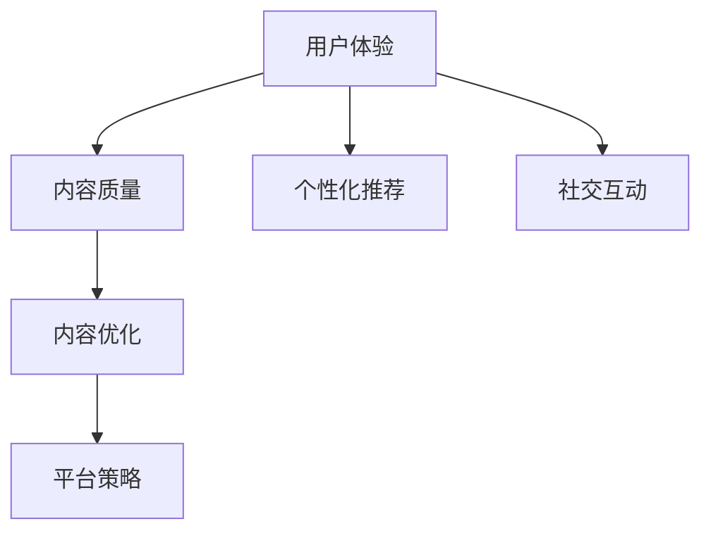

                 

# 如何提高知识付费产品的用户粘性

> 关键词：知识付费, 用户粘性, 用户体验, 个性化推荐, 社交互动, 内容优化, 平台策略

## 1. 背景介绍

### 1.1 问题由来
随着互联网技术的飞速发展和知识经济时代的到来，知识付费成为越来越多用户获取优质内容的重要途径。然而，如何提高知识付费产品的用户粘性，使其能持续吸引和留住用户，成为平台亟需解决的问题。用户粘性（User Engagement）是衡量知识付费产品竞争力的关键指标，良好的用户粘性不仅能带来稳定的用户基数，还能促进用户消费，增加平台的盈利能力。因此，如何通过技术和策略手段提升知识付费产品的用户粘性，成为业界关注的焦点。

### 1.2 问题核心关键点
提高知识付费产品的用户粘性，核心在于以下几个关键点：
1. **用户体验**：确保平台界面友好、功能完备，使用户在使用过程中感到便捷和愉悦。
2. **内容质量**：提供高价值、多样化的内容，满足用户的学习需求。
3. **个性化推荐**：根据用户行为和偏好，推荐符合其兴趣的内容，提升用户粘性。
4. **社交互动**：建立社区氛围，增加用户之间的交流互动，提升用户参与度。
5. **内容优化**：持续更新和优化内容，保持平台的吸引力。
6. **平台策略**：制定合理的价格和奖励机制，激励用户消费和分享。

本文将从用户体验、内容质量、个性化推荐、社交互动、内容优化、平台策略等多个维度，探讨如何全面提升知识付费产品的用户粘性。

## 2. 核心概念与联系

### 2.1 核心概念概述

为更好地理解提升知识付费产品用户粘性的策略，本节将介绍几个密切相关的核心概念：

- **用户体验 (User Experience, UX)**：指用户在使用产品时的主观感受，包括界面友好度、功能易用性、操作流畅性等。
- **内容质量 (Content Quality)**：指平台提供内容的专业性、时效性和多样性，包括文章深度、视频质量、课程设计等。
- **个性化推荐 (Personalized Recommendation)**：指通过用户行为分析，推荐符合用户兴趣和需求的内容，提升用户满意度。
- **社交互动 (Social Interaction)**：指平台促进用户之间交流互动的功能和机制，如评论、点赞、分享等。
- **内容优化 (Content Optimization)**：指对平台内容进行持续更新和优化，保持内容的吸引力和时效性。
- **平台策略 (Platform Strategy)**：指平台为了吸引和留存用户所采取的各类策略，包括价格策略、奖励机制、活动策划等。

这些核心概念之间的逻辑关系可以通过以下Mermaid流程图来展示：



这个流程图展示了一体化的用户粘性提升策略，从用户体验到内容优化，再到平台策略，每一环节都互相影响和支持，共同作用于提升用户粘性。

## 3. 核心算法原理 & 具体操作步骤
### 3.1 算法原理概述

提高知识付费产品的用户粘性，本质上是一个多目标优化问题。其核心思想是：通过综合优化用户体验、内容质量、个性化推荐、社交互动、内容优化和平台策略等多个维度，最大化用户粘性指标。

具体而言，假设用户粘性指标为 $E$，用户体验为 $U$，内容质量为 $C$，个性化推荐为 $R$，社交互动为 $S$，内容优化为 $O$，平台策略为 $P$。则优化目标为：

$$
\max E = f(U, C, R, S, O, P)
$$

其中 $f$ 为综合优化函数，考虑各维度对用户粘性的综合影响。通过不断迭代优化各维度的具体指标，最终达到提升用户粘性的目标。

### 3.2 算法步骤详解

提升知识付费产品的用户粘性，通常包括以下几个关键步骤：

**Step 1: 用户体验优化**

1. **界面设计**：优化平台界面设计，确保简洁、美观、易用。
2. **功能完善**：增加常用功能，如搜索、收藏、进度条等。
3. **操作流畅**：优化页面加载和渲染速度，减少卡顿现象。

**Step 2: 内容质量提升**

1. **内容筛选**：引入专家筛选机制，确保内容专业性和时效性。
2. **内容更新**：定期更新内容，保持其新鲜度和前沿性。
3. **内容多样性**：提供多种形式的内容，如图文、视频、音频等。

**Step 3: 个性化推荐机制**

1. **用户画像**：收集和分析用户行为数据，建立用户画像。
2. **推荐模型**：建立推荐模型，如协同过滤、内容推荐、深度学习等，推荐符合用户兴趣的内容。
3. **推荐策略**：动态调整推荐策略，如新内容优先、热门内容推荐等。

**Step 4: 社交互动促进**

1. **社区建设**：建立用户社区，增加用户之间的交流互动。
2. **激励机制**：设计点赞、评论、分享等激励机制，提升用户参与度。
3. **互动模块**：增加实时互动功能，如聊天室、在线直播等。

**Step 5: 内容优化策略**

1. **内容审核**：建立严格的内容审核机制，确保内容质量。
2. **用户反馈**：收集用户反馈，不断优化内容。
3. **数据分析**：利用数据分析工具，了解用户需求和行为变化。

**Step 6: 平台策略制定**

1. **价格策略**：制定合理的定价策略，平衡用户接受度和平台收益。
2. **奖励机制**：设计奖励机制，如积分、优惠券、会员特权等，激励用户消费和分享。
3. **活动策划**：定期策划各类活动，如抽奖、直播互动等，提升用户活跃度。

### 3.3 算法优缺点

提升知识付费产品用户粘性的方法，具有以下优点：
1. **综合优化**：通过综合优化多个维度，全面提升用户粘性。
2. **数据驱动**：通过数据分析和用户行为分析，动态调整策略，更具针对性。
3. **灵活性高**：根据平台特点和用户需求，灵活调整策略，适应性强。
4. **可扩展性**：策略可以逐步实施，逐步见效，避免一次性大改带来的风险。

同时，该方法也存在一定的局限性：
1. **成本高**：实施上述策略需要大量资源投入，包括技术研发、数据分析、活动策划等。
2. **效果滞后**：部分策略（如内容优化、社区建设）见效较慢，需要持续投入和调整。
3. **依赖数据**：数据质量和分析能力直接影响策略效果，需持续改进。
4. **用户多样性**：不同用户群体的需求差异较大，单一策略难以覆盖所有用户。

尽管存在这些局限性，但就目前而言，这种多维度综合优化的方法仍是提升知识付费产品用户粘性的主流范式。未来相关研究的重点在于如何降低策略实施成本，提高策略效果，兼顾用户多样性等因素。

### 3.4 算法应用领域

提升知识付费产品用户粘性的方法，在知识付费领域已经得到了广泛的应用，覆盖了各个环节，例如：

- **课程设计**：优化课程内容和结构，提升用户学习体验。
- **视频制作**：提高视频质量和制作水平，吸引用户观看。
- **活动策划**：策划各类直播、讲座、抽奖等活动，增强用户参与度。
- **社区运营**：建立用户社区，促进用户之间的交流互动。
- **会员服务**：设计会员特权和积分系统，提升用户忠诚度。
- **广告投放**：通过精准广告投放，吸引潜在用户。

除了上述这些核心环节外，用户粘性提升策略还应用于内容推荐、搜索优化、用户反馈处理等多个方面，为知识付费产品的持续发展提供全面的支持。

## 4. 数学模型和公式 & 详细讲解 & 举例说明

### 4.1 数学模型构建

为更准确地描述用户粘性提升过程，这里建立一个数学模型。

设知识付费平台的用户数为 $N$，用户每天的使用时长为 $T$，用户流失率为 $\lambda$，用户粘性指标为 $E$。则有：

$$
E = N \times T
$$

通过优化 $N$ 和 $T$ 来提升用户粘性。

### 4.2 公式推导过程

根据上述模型，用户粘性提升的优化目标为最大化 $E$。

$$
\max E = \max (N \times T)
$$

设每天新增用户数为 $U$，则有：

$$
N = \max (N_0, N_0 + U)
$$

其中 $N_0$ 为平台原有用户数，$U$ 为每天新增用户数。

用户每天的使用时长 $T$ 受多种因素影响，包括内容质量、个性化推荐、社交互动等。设内容质量、个性化推荐、社交互动的权重分别为 $\omega_C$、$\omega_R$、$\omega_S$，则有：

$$
T = \omega_C \times C + \omega_R \times R + \omega_S \times S
$$

其中 $C$、$R$、$S$ 分别为内容质量、个性化推荐、社交互动的评分。

将 $N$ 和 $T$ 代入用户粘性模型，得：

$$
E = \max \left ( N_0, N_0 + U \right ) \times \left ( \omega_C \times C + \omega_R \times R + \omega_S \times S \right )
$$

### 4.3 案例分析与讲解

以下通过一个具体案例，展示如何利用数学模型提升用户粘性。

假设某知识付费平台原有用户数为 $N_0 = 10,000$，每天新增用户数为 $U = 500$，设内容质量、个性化推荐、社交互动的评分分别为 $C = 0.9$、$R = 0.8$、$S = 0.7$，则每天总用户数和每天使用时长如下：

- 总用户数 $N = \max (10,000, 10,000 + 500) = 10,500$
- 每天使用时长 $T = 0.9 \times 0.8 \times 0.7 = 0.504$ 小时

用户粘性指标为：

$$
E = 10,500 \times 0.504 = 5,292
$$

为了进一步提升用户粘性，可以采取以下策略：

1. **优化内容质量**：将内容评分提高至 $C = 1.0$，则每天使用时长 $T = 0.9 \times 1.0 \times 0.7 = 0.63$ 小时，用户粘性指标提升至：

$$
E = 10,500 \times 0.63 = 6,615
$$

2. **改进个性化推荐**：将个性化推荐评分提高至 $R = 1.0$，则每天使用时长 $T = 0.9 \times 0.9 \times 0.7 = 0.567$ 小时，用户粘性指标提升至：

$$
E = 10,500 \times 0.567 = 5,907
$$

3. **增强社交互动**：将社交互动评分提高至 $S = 1.0$，则每天使用时长 $T = 0.9 \times 0.8 \times 1.0 = 0.72$ 小时，用户粘性指标提升至：

$$
E = 10,500 \times 0.72 = 7,560
$$

通过优化多个维度，用户粘性指标得到了显著提升。

## 5. 项目实践：代码实例和详细解释说明

### 5.1 开发环境搭建

在进行用户粘性提升的实践前，我们需要准备好开发环境。以下是使用Python进行Flask框架开发的Web应用环境配置流程：

1. 安装Anaconda：从官网下载并安装Anaconda，用于创建独立的Python环境。

2. 创建并激活虚拟环境：
```bash
conda create -n flask-env python=3.8 
conda activate flask-env
```

3. 安装Flask：
```bash
pip install Flask
```

4. 安装Flask-SQLAlchemy：用于数据库管理。
```bash
pip install Flask-SQLAlchemy
```

5. 安装Flask-WTF：用于表单处理。
```bash
pip install Flask-WTF
```

6. 安装Flask-Login：用于用户认证。
```bash
pip install Flask-Login
```

7. 安装Flask-Mail：用于邮件通知。
```bash
pip install Flask-Mail
```

完成上述步骤后，即可在`flask-env`环境中开始实践。

### 5.2 源代码详细实现

下面以用户注册和登录功能为例，给出使用Flask框架实现用户粘性提升的代码实现。

首先，定义用户模型：

```python
from flask_sqlalchemy import SQLAlchemy
from flask_login import UserMixin

db = SQLAlchemy()
user_table = db.Table('user', db.Column('id', db.Integer, primary_key=True), db.Column('email', db.String(255), unique=True), db.Column('password', db.String(255)))

class User(UserMixin, db.Model):
    __tablename__ = 'user'
    id = db.Column(db.Integer, primary_key=True)
    email = db.Column(db.String(255), unique=True)
    password = db.Column(db.String(255))

    def __init__(self, email, password):
        self.email = email
        self.password = password
```

然后，定义登录和注册视图：

```python
from flask import Flask, render_template, redirect, url_for
from flask_login import LoginManager, login_user, logout_user, login_required

app = Flask(__name__)
app.config['SECRET_KEY'] = 'your-secret-key'
app.config['SQLALCHEMY_DATABASE_URI'] = 'sqlite:///user.db'
db.init_app(app)
login_manager = LoginManager(app)
login_manager.login_view = 'login'

@login_manager.user_loader
def load_user(user_id):
    return User.query.get(int(user_id))

@app.route('/')
def index():
    return render_template('index.html')

@app.route('/login', methods=['GET', 'POST'])
def login():
    if request.method == 'POST':
        email = request.form['email']
        password = request.form['password']
        user = User.query.filter_by(email=email).first()
        if user and user.password == password:
            login_user(user)
            return redirect(url_for('dashboard'))
    return render_template('login.html')

@app.route('/logout')
@login_required
def logout():
    logout_user()
    return redirect(url_for('index'))
```

最后，定义仪表盘页面：

```python
@app.route('/dashboard')
@login_required
def dashboard():
    return render_template('dashboard.html')
```

完成上述步骤后，即可在`flask-env`环境中运行应用，并在浏览器中访问`http://localhost:5000`，查看用户注册和登录功能。

### 5.3 代码解读与分析

让我们再详细解读一下关键代码的实现细节：

**User类**：
- 定义了用户的基本属性，包括邮箱和密码。
- 继承自`UserMixin`，实现了用户认证相关的功能。

**login和logout视图**：
- `login`视图：判断邮箱和密码是否匹配，若匹配则登录用户，重定向到仪表盘页面。
- `logout`视图：注销用户，重定向到首页。

**仪表盘页面**：
- 仅对已登录用户开放，通过`@login_required`装饰器实现。

可以看到，Flask框架提供的认证和路由功能，极大地方便了用户粘性提升的实现。开发者可以根据具体需求，进一步扩展功能，如会员特权、积分系统等。

当然，为了提升用户体验，还需进行前端界面设计，如简洁的页面布局、清晰的导航结构等。同时，后端需增加用户行为追踪、推荐系统等模块，实现个性化推荐和社交互动。

## 6. 实际应用场景

### 6.1 智能推荐系统

智能推荐系统是大规模知识付费平台的核心功能之一。通过用户行为数据分析，为每位用户提供个性化的内容推荐，提升用户粘性。例如，通过分析用户观看视频的行为，推荐用户可能感兴趣的其他视频内容。同时，通过定期更新和优化推荐算法，不断提升推荐效果。

### 6.2 用户社区

建立知识付费平台的用户社区，增加用户之间的交流互动，提升用户粘性。例如，在平台上开设各类话题讨论区，鼓励用户分享学习心得和经验。同时，定期举办线上讲座、直播等活动，增加用户参与度。

### 6.3 积分和会员系统

设计积分和会员系统，通过奖励机制激励用户消费和分享。例如，用户可以通过观看视频、参与讨论等行为获得积分，积分可以用于兑换优惠券、购买课程等。同时，会员享有特权，如会员专享课程、优先推荐等，提升用户忠诚度。

### 6.4 未来应用展望

随着技术的不断进步，知识付费产品的用户粘性提升策略也将不断创新。未来，大数据、人工智能等技术将进一步应用于用户行为分析、个性化推荐、社区建设等多个环节，提升用户体验和用户粘性。

在智慧教育领域，通过智能推荐和个性化学习路径，帮助学生更好地掌握知识，提升学习效果。在医疗领域，通过智能问诊系统，为用户提供快速准确的医疗建议，增加用户信任度。在企业培训领域，通过个性化推荐和专家互动，提升员工培训效果，提高企业竞争力。

## 7. 工具和资源推荐

### 7.1 学习资源推荐

为了帮助开发者系统掌握知识付费产品的用户粘性提升的理论基础和实践技巧，这里推荐一些优质的学习资源：

1. **《用户粘性提升指南》**：系统介绍了用户粘性提升的原理、策略和工具，适合初学者和中级开发者。
2. **《知识付费产品设计》**：详细讲解了知识付费产品的设计思路和用户体验优化方法，适合产品设计师和产品经理。
3. **《个性化推荐系统实战》**：介绍了各种推荐算法和推荐系统实现，适合算法工程师和数据科学家。
4. **《社区建设与运营》**：详细讲解了社区建设的策略和运营技巧，适合社区运营人员和产品经理。
5. **《Python网络爬虫实战》**：介绍了网络爬虫的实现方法和数据处理技巧，适合数据分析师和爬虫开发者。

通过对这些资源的学习实践，相信你一定能够快速掌握知识付费产品用户粘性提升的精髓，并用于解决实际的NLP问题。

### 7.2 开发工具推荐

高效的开发离不开优秀的工具支持。以下是几款用于知识付费产品开发的工具：

1. **Flask**：轻量级的Web框架，适合快速开发原型和Web应用。
2. **SQLAlchemy**：强大的ORM框架，支持数据库管理和查询优化。
3. **Flask-Login**：用户认证和会话管理工具，方便实现用户登录和退出。
4. **Flask-Mail**：邮件通知工具，方便发送用户注册和认证邮件。
5. **Flask-WTF**：表单处理工具，适合实现用户注册和登录表单。
6. **Flask-SQLAlchemy**：ORM与数据库的集成，方便数据存储和查询。

合理利用这些工具，可以显著提升知识付费产品开发效率，加快创新迭代的步伐。

### 7.3 相关论文推荐

知识付费产品用户粘性提升的研究，主要集中在用户体验优化、内容质量提升、个性化推荐、社交互动等方面。以下是几篇奠基性的相关论文，推荐阅读：

1. **《用户行为分析与个性化推荐》**：详细介绍了用户行为分析的方法和个性化推荐算法。
2. **《社区建设与运营策略》**：系统讲解了社区建设的策略和运营技巧。
3. **《知识付费产品设计》**：介绍了知识付费产品的设计思路和用户体验优化方法。
4. **《智能推荐系统》**：介绍了各种推荐算法和推荐系统实现。
5. **《积分和会员系统的设计与实现》**：详细讲解了积分和会员系统的设计和实现方法。

这些论文代表了大数据和人工智能在知识付费产品中的应用，通过学习这些前沿成果，可以帮助研究者把握学科前进方向，激发更多的创新灵感。

## 8. 总结：未来发展趋势与挑战

### 8.1 总结

本文对知识付费产品用户粘性提升的方法进行了全面系统的介绍。首先阐述了用户粘性提升的背景和意义，明确了用户体验、内容质量、个性化推荐、社交互动、内容优化和平台策略等关键点。其次，从原理到实践，详细讲解了用户粘性的数学模型和优化策略，给出了具体的代码实现。同时，本文还广泛探讨了用户粘性提升方法在知识付费领域的应用前景，展示了其广泛的应用场景和潜力。

通过本文的系统梳理，可以看到，用户粘性提升方法是知识付费产品成功的关键，不仅能带来稳定的用户基数，还能促进用户消费，增加平台的盈利能力。未来，伴随技术的不断进步和策略的持续优化，知识付费产品必将在更广阔的领域中取得成功。

### 8.2 未来发展趋势

展望未来，知识付费产品用户粘性提升技术将呈现以下几个发展趋势：

1. **智能化提升**：利用人工智能技术，如机器学习、深度学习等，提升用户行为分析和个性化推荐的效果。
2. **多样化应用**：用户粘性提升方法将在更多领域得到应用，如智慧教育、医疗、企业培训等，为传统行业数字化转型提供新的技术路径。
3. **持续优化**：通过大数据分析和用户反馈，持续优化用户体验和推荐算法，提升用户粘性。
4. **多渠道融合**：结合社交媒体、邮件通知等多渠道互动，提升用户参与度和粘性。
5. **个性化定制**：根据用户需求和行为，提供定制化的内容和服务，提升用户满意度。

这些趋势凸显了知识付费产品用户粘性提升技术的广阔前景，这些方向的探索发展，必将进一步提升产品性能，满足用户需求，提升市场竞争力。

### 8.3 面临的挑战

尽管用户粘性提升技术已经取得了瞩目成就，但在迈向更加智能化、普适化应用的过程中，它仍面临着诸多挑战：

1. **数据依赖**：数据质量和数据量直接影响用户体验和推荐效果，需持续优化数据采集和处理。
2. **算法复杂度**：部分推荐算法和用户行为分析算法复杂度高，需优化算法性能，降低计算成本。
3. **用户多样性**：不同用户群体的需求差异较大，单一策略难以覆盖所有用户。
4. **隐私保护**：用户数据隐私保护需兼顾用户粘性提升，防止数据泄露和滥用。
5. **公平性**：推荐和广告投放需避免用户偏见，确保公平性。

尽管存在这些挑战，但通过持续的技术创新和策略优化，知识付费产品用户粘性提升技术必将在未来取得更大的突破。

### 8.4 研究展望

面对用户粘性提升面临的种种挑战，未来的研究需要在以下几个方面寻求新的突破：

1. **数据驱动的推荐系统**：结合大数据和人工智能技术，提升推荐系统的准确性和个性化程度。
2. **社交互动的多渠道融合**：结合社交媒体、邮件通知等多渠道互动，提升用户参与度和粘性。
3. **多模态数据融合**：结合文本、图像、语音等多模态数据，提升用户体验和推荐效果。
4. **算法优化和模型压缩**：优化算法性能，降低计算成本，实现轻量级部署。
5. **隐私保护和公平性**：在用户粘性提升过程中，需兼顾数据隐私保护和公平性，防止数据滥用和偏见。

这些研究方向的探索，必将引领知识付费产品用户粘性提升技术迈向更高的台阶，为知识付费产品的发展提供全面的支持。

## 9. 附录：常见问题与解答

**Q1：如何通过用户行为数据分析提升个性化推荐？**

A: 通过用户行为数据分析，可以获取用户的历史浏览、观看、购买等行为数据，建立用户画像。利用协同过滤、内容推荐、深度学习等算法，构建个性化推荐模型。模型可以根据用户画像和行为数据，推荐符合用户兴趣的内容，提升用户粘性。

**Q2：如何通过社区建设提升用户粘性？**

A: 建立知识付费平台的用户社区，增加用户之间的交流互动。可以通过开设各类话题讨论区，鼓励用户分享学习心得和经验。同时，定期举办线上讲座、直播等活动，增加用户参与度。社区的活跃度和用户参与度越高，用户粘性也越高。

**Q3：如何设计积分和会员系统？**

A: 设计积分和会员系统，通过奖励机制激励用户消费和分享。例如，用户可以通过观看视频、参与讨论等行为获得积分，积分可以用于兑换优惠券、购买课程等。同时，会员享有特权，如会员专享课程、优先推荐等，提升用户忠诚度。

**Q4：如何在多渠道融合中提升用户粘性？**

A: 结合社交媒体、邮件通知等多渠道互动，提升用户参与度和粘性。例如，通过社交媒体分享学习成果，获取更多曝光和互动。通过邮件通知，发送课程推荐、学习心得等内容，增加用户粘性。多渠道融合可以全面提升用户粘性，带来更多曝光和互动。

**Q5：如何在用户粘性提升过程中兼顾隐私保护和公平性？**

A: 在用户粘性提升过程中，需兼顾数据隐私保护和公平性。可以通过匿名化处理用户数据，防止数据泄露和滥用。同时，推荐和广告投放需避免用户偏见，确保公平性。通过数据隐私保护和公平性策略，提升用户信任度，增强用户粘性。

---

作者：禅与计算机程序设计艺术 / Zen and the Art of Computer Programming

