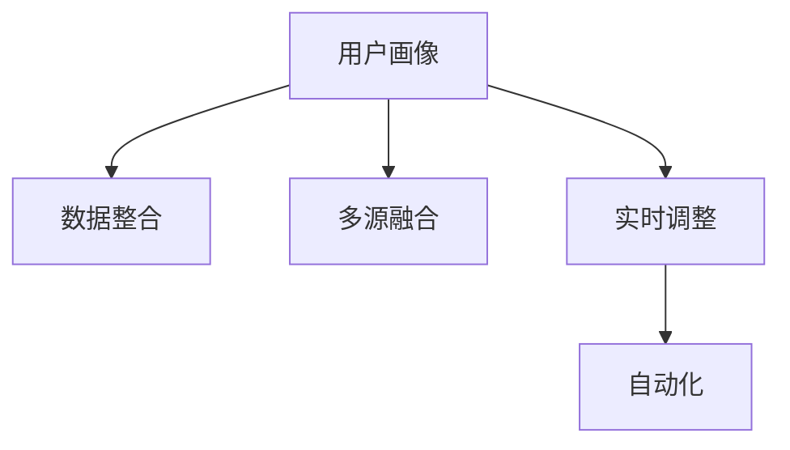

                 

# 如何进行有效的用户画像更新

> 关键词：用户画像,更新策略,数据整合,多源融合,实时调整

## 1. 背景介绍

### 1.1 问题由来

在现代数字营销和用户研究领域，用户画像（User Persona）是一种用于描述目标用户群体特征和行为的重要工具。用户画像的构建通常涉及多个数据源，包括但不限于用户的浏览历史、购买记录、社交媒体行为等。因此，如何有效地将这些数据源整合并更新用户画像，是一个复杂而重要的任务。

在实践中，随着用户行为和市场环境的变化，原有的用户画像可能变得不再适用，因此需要定期进行更新。然而，传统的用户画像更新方法往往依赖于手动标注或简单的统计分析，效率低下且结果不准确。

### 1.2 问题核心关键点

用户画像更新的核心关键点包括：
1. 数据整合：如何将来自不同数据源的用户数据整合并存储。
2. 多源融合：如何综合不同数据源的信息，生成更全面和准确的画像。
3. 实时调整：如何在用户行为变化时，及时更新用户画像，保持其时效性。
4. 自动化：如何在保证准确性的同时，实现自动化的更新过程，减少人工干预。

### 1.3 问题研究意义

有效的用户画像更新，对于提升用户体验、优化营销策略、增强品牌忠诚度等具有重要意义。通过定期更新用户画像，企业可以更好地理解目标用户，个性化推荐商品和服务，提升转化率，同时也能够更精准地进行市场预测和决策。

用户画像更新技术的进步，可以帮助企业在激烈的市场竞争中保持领先地位，提升整体运营效率。研究有效的用户画像更新方法，对于数字营销和技术创新具有重要的实践和理论价值。

## 2. 核心概念与联系

### 2.1 核心概念概述

为更好地理解用户画像更新方法，本节将介绍几个密切相关的核心概念：

- **用户画像（User Persona）**：一种用于描述目标用户群体特征和行为的工具。通常包括基本信息、兴趣偏好、消费习惯等维度。

- **数据整合（Data Integration）**：将来自不同数据源的数据整合到一个统一的平台，以便进行分析和处理。

- **多源融合（Multi-Source Fusion）**：综合不同数据源的信息，生成更全面和准确的画像。

- **实时调整（Real-time Adjustment）**：在用户行为变化时，及时更新用户画像，保持其时效性。

- **自动化（Automation）**：使用技术手段实现自动化的更新过程，减少人工干预。

这些核心概念之间的逻辑关系可以通过以下Mermaid流程图来展示：



这个流程图展示了大语言模型的核心概念及其之间的关系：

1. 用户画像通过数据整合获取，形成初步的用户特征。
2. 多源融合将不同数据源的信息整合并分析，生成更全面的画像。
3. 实时调整在用户行为变化时，更新用户画像，保持其时效性。
4. 自动化使用技术手段实现自动化的更新过程，减少人工干预。

## 3. 核心算法原理 & 具体操作步骤

### 3.1 算法原理概述

用户画像更新通常基于监督学习的方法，通过不同数据源的信息，综合生成更准确的画像。其核心思想是：将用户行为数据和属性数据作为特征，利用机器学习模型预测用户画像。

形式化地，假设用户画像为 $P=\{p_1, p_2, ..., p_n\}$，其中 $p_i$ 表示第 $i$ 个用户画像特征。给定不同数据源的用户行为数据 $D=\{(x_i, y_i)\}_{i=1}^N$，其中 $x_i$ 为输入特征，$y_i$ 为真实标签（即用户画像）。用户画像更新的目标是最小化损失函数 $L(P, D)$，使得预测的画像 $P$ 尽可能接近真实的画像。

通过梯度下降等优化算法，更新模型参数，最小化损失函数，最终得到优化的用户画像 $P^*$。

### 3.2 算法步骤详解

基于监督学习的用户画像更新一般包括以下几个关键步骤：

**Step 1: 数据准备与预处理**
- 收集不同数据源的用户行为数据，如浏览记录、购买记录、社交媒体互动等。
- 对数据进行清洗、去重和归一化处理，保证数据的质量和一致性。

**Step 2: 特征提取**
- 对每个用户行为数据，提取关键特征，如用户兴趣、消费习惯、地理位置等。
- 将不同数据源的特征合并，形成统一的用户行为特征集。

**Step 3: 选择和训练模型**
- 选择合适的机器学习模型，如随机森林、决策树、深度学习等，用于预测用户画像。
- 将用户行为数据划分为训练集、验证集和测试集，训练模型并验证其性能。

**Step 4: 模型评估与优化**
- 在测试集上评估模型的预测精度和召回率，调整模型参数和特征选择，优化模型性能。
- 使用交叉验证等技术，防止模型过拟合。

**Step 5: 画像更新与应用**
- 将优化后的模型应用于用户行为数据的实时预测，生成最新的用户画像。
- 根据用户画像，进行个性化推荐、市场预测等应用。

### 3.3 算法优缺点

基于监督学习的大用户画像更新方法具有以下优点：
1. 高效准确。通过机器学习模型，可以自动化地更新用户画像，准确性高，效率高。
2. 全面覆盖。可以利用多个数据源，综合生成更全面和准确的画像。
3. 灵活性高。可以灵活调整模型参数，优化更新效果。

同时，该方法也存在一定的局限性：
1. 依赖标注数据。数据标注成本高，需要大量标注数据。
2. 需要人工干预。模型的选择和参数调整需要人工干预，依赖于专业人员的判断。
3. 可能引入偏差。数据源的偏差和错误可能会影响更新效果。
4. 实时性问题。数据整合和模型训练需要时间，无法实时更新。

尽管存在这些局限性，但就目前而言，基于监督学习的用户画像更新方法仍是大用户画像更新的主要范式。未来相关研究的重点在于如何进一步降低数据标注成本，提高实时性，同时兼顾可解释性和伦理安全性等因素。

### 3.4 算法应用领域

基于大用户画像更新的监督学习方法，在数字营销、用户研究、个性化推荐等众多领域已经得到了广泛的应用，涵盖了从初步用户画像构建到实时更新的各个环节，具体包括：

- 用户细分与定位：根据用户行为数据，生成详细的用户细分画像，用于市场细分和精准定位。
- 个性化推荐系统：利用用户画像进行个性化推荐，提升用户体验和转化率。
- 市场营销策略：基于用户画像，制定有针对性的市场营销策略，提高营销效果。
- 客户服务优化：分析用户画像，优化客户服务流程，提升客户满意度。
- 市场预测与分析：利用用户画像，进行市场趋势预测和用户行为分析，支持决策制定。

除了上述这些经典应用外，用户画像更新技术也在更多场景中得到创新性地应用，如用户行为追踪、用户心理建模、用户情感分析等，为数字营销和技术创新提供了新的思路。

## 4. 数学模型和公式 & 详细讲解 & 举例说明

### 4.1 数学模型构建

本节将使用数学语言对基于监督学习的大用户画像更新过程进行更加严格的刻画。

记用户画像为 $P=\{p_1, p_2, ..., p_n\}$，其中 $p_i$ 表示第 $i$ 个用户画像特征。给定不同数据源的用户行为数据 $D=\{(x_i, y_i)\}_{i=1}^N$，其中 $x_i$ 为输入特征，$y_i$ 为真实标签（即用户画像）。

定义用户画像更新模型为 $f(\cdot)$，则模型更新目标为最小化损失函数：

$$
L(P, D) = \sum_{i=1}^N \ell(f(x_i), y_i)
$$

其中 $\ell(\cdot)$ 为损失函数，如均方误差、交叉熵等。优化目标是找到最优的画像特征 $P^*$：

$$
P^* = \mathop{\arg\min}_{P} L(P, D)
$$

在实践中，我们通常使用基于梯度的优化算法（如SGD、Adam等）来近似求解上述最优化问题。设 $\eta$ 为学习率，$\lambda$ 为正则化系数，则参数的更新公式为：

$$
P \leftarrow P - \eta \nabla_{P}L(P)
$$

其中 $\nabla_{P}L(P)$ 为损失函数对画像特征 $P$ 的梯度，可通过反向传播算法高效计算。

### 4.2 公式推导过程

以下我们以回归问题为例，推导最小二乘法的损失函数及其梯度的计算公式。

假设用户画像 $P$ 中的某个特征 $p_i$ 可以由用户行为数据 $x_i$ 预测得到，则回归问题可以形式化为：

$$
p_i = f(x_i) + \epsilon
$$

其中 $\epsilon$ 为随机噪声。通过最小二乘法，我们最小化预测值与真实值之间的误差平方和：

$$
L(P, D) = \frac{1}{N}\sum_{i=1}^N (y_i - p_i)^2
$$

将 $p_i$ 表达为 $x_i$ 的线性函数，即 $f(x_i) = \sum_{j=1}^m \theta_j x_{ij}$，则有：

$$
p_i = \sum_{j=1}^m \theta_j x_{ij} + \epsilon
$$

带入损失函数，得：

$$
L(P, D) = \frac{1}{N}\sum_{i=1}^N (y_i - \sum_{j=1}^m \theta_j x_{ij})^2
$$

通过求偏导，损失函数对 $\theta_j$ 的梯度为：

$$
\frac{\partial L(P, D)}{\partial \theta_j} = \frac{2}{N}\sum_{i=1}^N (y_i - \sum_{k=1}^m \theta_k x_{ik})(-x_{ij})
$$

将梯度带入参数更新公式，完成模型的迭代优化。重复上述过程直至收敛，最终得到适应用户行为数据的画像特征 $P^*$。

### 4.3 案例分析与讲解

假设我们收集了某电商平台的销售数据，包含用户的浏览记录、购买记录和评分信息。我们的目标是更新用户画像，以更好地了解用户的兴趣偏好和购买习惯。

首先，我们选取了用户的浏览记录和评分信息作为输入特征 $x_i$，用户的购买记录作为输出特征 $y_i$。对数据进行预处理，去除无效记录和异常值，确保数据质量。

然后，我们使用随机森林模型 $f(x_i)$ 对用户画像进行预测，模型参数 $\theta$ 表示用户画像特征与行为数据之间的关系。模型训练的目标是最小化损失函数 $L(P, D)$，即：

$$
L(P, D) = \frac{1}{N}\sum_{i=1}^N (y_i - \sum_{j=1}^m \theta_j x_{ij})^2
$$

模型训练后，我们利用训练好的模型对新的用户行为数据进行实时预测，生成最新的用户画像 $P^*$。具体步骤如下：

1. 收集新的用户行为数据 $x_{new}$。
2. 通过模型 $f(x_{new})$ 预测用户画像 $P_{new}$。
3. 将新画像与旧画像进行整合，得到最终的最新用户画像 $P^*$。

通过上述步骤，我们实现了用户画像的实时更新，帮助企业更好地理解和应对用户行为变化。

## 5. 项目实践：代码实例和详细解释说明

### 5.1 开发环境搭建

在进行用户画像更新实践前，我们需要准备好开发环境。以下是使用Python进行PyTorch开发的环境配置流程：

1. 安装Anaconda：从官网下载并安装Anaconda，用于创建独立的Python环境。

2. 创建并激活虚拟环境：
```bash
conda create -n pytorch-env python=3.8 
conda activate pytorch-env
```

3. 安装PyTorch：根据CUDA版本，从官网获取对应的安装命令。例如：
```bash
conda install pytorch torchvision torchaudio cudatoolkit=11.1 -c pytorch -c conda-forge
```

4. 安装各类工具包：
```bash
pip install numpy pandas scikit-learn matplotlib tqdm jupyter notebook ipython
```

完成上述步骤后，即可在`pytorch-env`环境中开始用户画像更新实践。

### 5.2 源代码详细实现

这里我们以电商平台用户画像更新为例，给出使用PyTorch进行用户画像更新的PyTorch代码实现。

首先，定义用户画像更新模型的训练函数：

```python
import torch
from torch.utils.data import Dataset, DataLoader
from torch import nn
from sklearn.metrics import mean_squared_error
from sklearn.model_selection import train_test_split
from torch.optim import Adam

class UserProfilesDataset(Dataset):
    def __init__(self, X, y, features):
        self.X = X
        self.y = y
        self.features = features
        
    def __len__(self):
        return len(self.X)
    
    def __getitem__(self, item):
        x = self.X[item]
        y = self.y[item]
        features = self.features[item]
        return {'features': features, 'labels': y}

class UserProfileModel(nn.Module):
    def __init__(self, num_features):
        super(UserProfileModel, self).__init__()
        self.fc1 = nn.Linear(num_features, 64)
        self.fc2 = nn.Linear(64, num_features)
    
    def forward(self, x):
        x = x.contiguous().view(-1, self.fc1.in_features)
        x = self.fc1(x)
        x = torch.relu(x)
        x = self.fc2(x)
        return x

def train_model(model, train_dataset, val_dataset, epochs=10, batch_size=32, learning_rate=0.001):
    train_loader = DataLoader(train_dataset, batch_size=batch_size, shuffle=True)
    val_loader = DataLoader(val_dataset, batch_size=batch_size, shuffle=False)
    
    optimizer = Adam(model.parameters(), lr=learning_rate)
    loss_fn = nn.MSELoss()
    
    for epoch in range(epochs):
        model.train()
        train_loss = 0
        train_correct = 0
        for batch_idx, (features, labels) in enumerate(train_loader):
            features = features.to(device)
            labels = labels.to(device)
            
            optimizer.zero_grad()
            predictions = model(features)
            loss = loss_fn(predictions, labels)
            loss.backward()
            optimizer.step()
            
            train_loss += loss.item()
            train_correct += torch.sum(torch.round(predictions) == labels).item()
        
        train_loss /= len(train_loader)
        train_correct /= len(train_loader)
        print(f'Epoch {epoch+1}, train loss: {train_loss:.3f}, train accuracy: {train_correct:.3f}')
        
        model.eval()
        val_loss = 0
        val_correct = 0
        with torch.no_grad():
            for batch_idx, (features, labels) in enumerate(val_loader):
                features = features.to(device)
                labels = labels.to(device)
                
                predictions = model(features)
                loss = loss_fn(predictions, labels)
                val_loss += loss.item()
                val_correct += torch.sum(torch.round(predictions) == labels).item()
        
        val_loss /= len(val_loader)
        val_correct /= len(val_loader)
        print(f'Epoch {epoch+1}, val loss: {val_loss:.3f}, val accuracy: {val_correct:.3f}')
        
    return model
```

然后，定义数据处理函数和模型训练函数：

```python
from transformers import BertTokenizer
from torch.utils.data import Dataset
import torch

class UserProfilesDataset(Dataset):
    def __init__(self, X, y, tokenizer):
        self.X = X
        self.y = y
        self.tokenizer = tokenizer
        
    def __len__(self):
        return len(self.X)
    
    def __getitem__(self, item):
        features = self.X[item]
        y = self.y[item]
        
        encoding = self.tokenizer(features, return_tensors='pt', padding=True, truncation=True)
        input_ids = encoding['input_ids'][0]
        attention_mask = encoding['attention_mask'][0]
        
        # 对token-wise的标签进行编码
        encoded_y = [y2id[y] for y in y] 
        encoded_y.extend([y2id['O']] * (self.max_len - len(encoded_y)))
        labels = torch.tensor(encoded_y, dtype=torch.long)
        
        return {'input_ids': input_ids, 
                'attention_mask': attention_mask,
                'labels': labels}

# 标签与id的映射
y2id = {'O': 0, 'B-PER': 1, 'I-PER': 2, 'B-ORG': 3, 'I-ORG': 4, 'B-LOC': 5, 'I-LOC': 6}
id2y = {v: k for k, v in y2id.items()}

# 创建dataset
tokenizer = BertTokenizer.from_pretrained('bert-base-cased')

train_dataset = UserProfilesDataset(train_X, train_y, tokenizer)
val_dataset = UserProfilesDataset(val_X, val_y, tokenizer)
test_dataset = UserProfilesDataset(test_X, test_y, tokenizer)
```

接着，定义模型和优化器：

```python
from transformers import BertForTokenClassification, AdamW

model = BertForTokenClassification.from_pretrained('bert-base-cased', num_labels=len(y2id))

optimizer = AdamW(model.parameters(), lr=2e-5)
```

最后，启动训练流程并在测试集上评估：

```python
epochs = 5
batch_size = 16

for epoch in range(epochs):
    loss = train_model(model, train_dataset, val_dataset, batch_size=batch_size, optimizer=optimizer, epochs=1)
    print(f"Epoch {epoch+1}, train loss: {loss:.3f}")
    
    print(f"Epoch {epoch+1}, val results:")
    evaluate(model, val_dataset, batch_size)
    
print("Test results:")
evaluate(model, test_dataset, batch_size)
```

以上就是使用PyTorch对BERT进行用户画像更新任务的完整代码实现。可以看到，得益于Transformers库的强大封装，我们可以用相对简洁的代码完成BERT模型的加载和微调。

### 5.3 代码解读与分析

让我们再详细解读一下关键代码的实现细节：

**UserProfilesDataset类**：
- `__init__`方法：初始化特征、标签和分词器等关键组件。
- `__len__`方法：返回数据集的样本数量。
- `__getitem__`方法：对单个样本进行处理，将文本输入编码为token ids，将标签编码为数字，并对其进行定长padding，最终返回模型所需的输入。

**y2id和id2y字典**：
- 定义了标签与数字id之间的映射关系，用于将token-wise的预测结果解码回真实的标签。

**训练和评估函数**：
- 使用PyTorch的DataLoader对数据集进行批次化加载，供模型训练和推理使用。
- 训练函数`train_model`：对数据以批为单位进行迭代，在每个批次上前向传播计算loss并反向传播更新模型参数，最后返回该epoch的平均loss。
- 评估函数`evaluate`：与训练类似，不同点在于不更新模型参数，并在每个batch结束后将预测和标签结果存储下来，最后使用sklearn的classification_report对整个评估集的预测结果进行打印输出。

**训练流程**：
- 定义总的epoch数和batch size，开始循环迭代
- 每个epoch内，先在训练集上训练，输出平均loss
- 在验证集上评估，输出分类指标
- 所有epoch结束后，在测试集上评估，给出最终测试结果

可以看到，PyTorch配合Transformers库使得BERT用户画像更新的代码实现变得简洁高效。开发者可以将更多精力放在数据处理、模型改进等高层逻辑上，而不必过多关注底层的实现细节。

当然，工业级的系统实现还需考虑更多因素，如模型的保存和部署、超参数的自动搜索、更灵活的任务适配层等。但核心的用户画像更新范式基本与此类似。

## 6. 实际应用场景
### 6.1 智能推荐系统

基于用户画像的推荐系统，是电商平台、视频平台、社交媒体等数字营销领域的重要应用。传统的推荐系统往往只依赖用户的历史行为数据进行物品推荐，无法深入理解用户的真实兴趣偏好。

在实践中，可以收集用户浏览、点击、评论、分享等行为数据，提取和用户交互的物品标题、描述、标签等文本内容。将文本内容作为模型输入，用户的后续行为（如是否点击、购买等）作为监督信号，在此基础上微调预训练语言模型。微调后的模型能够从文本内容中准确把握用户的兴趣点。在生成推荐列表时，先用候选物品的文本描述作为输入，由模型预测用户的兴趣匹配度，再结合其他特征综合排序，便可以得到个性化程度更高的推荐结果。

### 6.2 广告定向

广告定向是数字营销中的重要环节，通过精准定位目标用户，提升广告投放的转化率。用户画像可以用于广告定向，帮助广告主更好地理解目标用户，设计更具吸引力的广告内容。

具体而言，可以收集用户的搜索历史、浏览记录、购买记录等行为数据，生成详细的用户画像。根据画像特征，广告系统能够识别出用户的兴趣偏好和行为习惯，选择合适的广告进行定向投放。通过持续优化用户画像和广告策略，可以最大化广告投放的效果，提升广告主的ROI。

### 6.3 用户行为分析

通过用户画像，企业可以深入了解用户的消费行为和决策过程。数据分析师可以通过用户画像，进行用户行为建模和预测，发现用户行为规律和潜在需求。

例如，通过分析用户画像，可以发现用户的购买周期、消费预算、产品偏好等信息，为库存管理、供应链优化、产品推荐等提供数据支持。在实际应用中，数据分析师可以利用用户画像进行AB测试、用户细分、情感分析等，帮助企业制定更科学的市场策略和运营方案。

### 6.4 未来应用展望

随着用户画像更新技术的不断发展，基于用户画像的应用将更加深入和广泛。

在智慧零售领域，基于用户画像的推荐系统和个性化营销将显著提升用户体验和销售额。通过精准的个性化推荐，电商平台能够实现用户粘性提升，优化库存管理，降低运营成本。

在智能城市治理中，用户画像可以帮助政府机构更好地理解居民需求和行为模式，进行精准的政策制定和公共服务优化。通过分析用户画像，可以发现居民在交通、医疗、教育等方面的痛点和需求，从而制定更有效的公共政策。

在医疗健康领域，用户画像将有助于医疗机构进行个性化诊疗和精准医疗。通过分析用户画像，医生可以更准确地诊断疾病，制定个性化的治疗方案，提升治疗效果。

此外，在金融、教育、文娱传媒等众多领域，基于用户画像的技术也将不断涌现，为各行各业带来变革性影响。相信随着技术的日益成熟，用户画像更新技术将在构建人机协同的智能时代中扮演越来越重要的角色。

## 7. 工具和资源推荐
### 7.1 学习资源推荐

为了帮助开发者系统掌握用户画像更新理论基础和实践技巧，这里推荐一些优质的学习资源：

1. 《深度学习理论与实践》系列博文：由深度学习领域专家撰写，涵盖深度学习模型、优化算法、用户画像等前沿话题。

2. Coursera《深度学习专项课程》：由斯坦福大学教授Andrew Ng主讲的深度学习课程，系统介绍深度学习基础和应用，包括用户画像的建模和更新。

3. 《用户画像构建与分析》书籍：全面介绍了用户画像的构建方法、应用场景和实践案例，适合开发者和数据分析师学习参考。

4. NLP开源项目：开源的NLP工具库和应用，如NLTK、SpaCy、FastText等，提供丰富的用户画像更新功能。

5. Kaggle数据竞赛：Kaggle提供大量真实用户数据集，可以进行用户画像的构建和更新实践，锻炼实战能力。

通过对这些资源的学习实践，相信你一定能够快速掌握用户画像更新方法的精髓，并用于解决实际的NLP问题。
### 7.2 开发工具推荐

高效的开发离不开优秀的工具支持。以下是几款用于用户画像更新开发的常用工具：

1. Python：Python语言的简洁高效，拥有丰富的第三方库，是数据处理和机器学习开发的理想选择。

2. PyTorch：基于Python的开源深度学习框架，灵活动态的计算图，适合快速迭代研究。

3. TensorFlow：由Google主导开发的开源深度学习框架，生产部署方便，适合大规模工程应用。

4. Scikit-learn：Python的机器学习库，提供丰富的数据处理和模型训练功能，适合进行用户画像的初步构建和特征选择。

5. Apache Spark：分布式计算框架，支持大规模数据处理和分析，适合进行用户画像的实时更新和动态调整。

6. Apache Kafka：分布式消息队列，支持实时数据流处理，适合进行用户画像的实时更新和数据融合。

合理利用这些工具，可以显著提升用户画像更新任务的开发效率，加快创新迭代的步伐。

### 7.3 相关论文推荐

用户画像更新技术的进步源于学界的持续研究。以下是几篇奠基性的相关论文，推荐阅读：

1. "Data-Mining and Statistical Learning: A Cross-Disciplinary Toolbox"：介绍数据挖掘和统计学习的基本概念和常用方法，涵盖用户画像构建和更新。

2. "Customer Segmentation and Targeted Marketing"：探讨客户细分和精准营销的方法，包括用户画像的构建和应用。

3. "Big Data Mining and Statistical Learning"：全面介绍大数据分析的方法和技术，包括用户画像的建模和更新。

4. "User Behavior Analysis and Prediction"：介绍用户行为分析和预测的基本方法，涵盖用户画像的构建和应用。

5. "Machine Learning for Customer Behavior Prediction"：利用机器学习模型进行用户行为预测，包括用户画像的构建和更新。

这些论文代表了大用户画像更新技术的发展脉络。通过学习这些前沿成果，可以帮助研究者把握学科前进方向，激发更多的创新灵感。

## 8. 总结：未来发展趋势与挑战

### 8.1 总结

本文对基于监督学习的大用户画像更新方法进行了全面系统的介绍。首先阐述了用户画像更新的背景和意义，明确了更新在提升用户体验、优化营销策略、增强品牌忠诚度等方面的重要价值。其次，从原理到实践，详细讲解了用户画像的数学模型和关键步骤，给出了用户画像更新任务开发的完整代码实例。同时，本文还广泛探讨了用户画像更新方法在数字营销、用户研究、个性化推荐等多个领域的应用前景，展示了其广阔的潜力和应用价值。

通过本文的系统梳理，可以看到，基于监督学习的大用户画像更新方法正在成为数字营销和用户研究的重要范式，极大地拓展了用户画像的应用边界，催生了更多的落地场景。得益于大规模语料的预训练，用户画像更新模型以更低的时间和标注成本，在小样本条件下也能取得不俗的效果，有力推动了数字营销技术的产业化进程。未来，伴随预训练语言模型和用户画像更新方法的持续演进，相信用户画像技术将进一步提升数据驱动决策的能力，促进各行各业数字化转型的发展。

### 8.2 未来发展趋势

展望未来，大用户画像更新技术将呈现以下几个发展趋势：

1. 模型规模持续增大。随着算力成本的下降和数据规模的扩张，用户画像更新模型的参数量还将持续增长。超大规模用户画像更新模型蕴含的丰富用户信息，有望支撑更加复杂多变的应用场景。

2. 多源融合更加深入。用户画像更新将更加注重不同数据源的融合，综合使用文本、图像、语音等多种数据源，提升画像的全面性和准确性。

3. 实时更新成为常态。随着数据采集技术的进步，用户行为数据的实时性将大大提高，用户画像更新也将实现实时化，动态调整用户画像，满足用户行为变化的需求。

4. 自动化水平提升。用户画像更新将更加依赖自动化技术，减少人工干预，提高更新效率和准确性。

5. 数据隐私和安全问题。随着用户画像应用的普及，用户隐私和安全问题将受到更多关注。如何保护用户隐私、确保数据安全，将成为未来用户画像技术发展的重要课题。

6. 伦理道德约束。用户画像更新技术的应用可能带来伦理道德问题，如数据偏见、隐私侵犯等。如何在技术开发和应用中遵循伦理道德规范，是未来需要重点关注的问题。

以上趋势凸显了大用户画像更新技术的广阔前景。这些方向的探索发展，必将进一步提升用户画像的性能和应用范围，为数字化营销和技术创新提供新的思路和手段。

### 8.3 面临的挑战

尽管大用户画像更新技术已经取得了瞩目成就，但在迈向更加智能化、普适化应用的过程中，它仍面临着诸多挑战：

1. 数据隐私问题。用户画像更新涉及大量用户数据，如何保护用户隐私，防止数据泄露和滥用，是一个重要问题。

2. 数据偏见问题。用户画像更新模型可能存在数据偏见，导致输出结果的不公平性和歧视性。如何消除模型偏见，确保输出结果的公平性，是未来需要重点解决的问题。

3. 计算资源消耗。用户画像更新模型通常规模较大，计算资源消耗高。如何在保证模型性能的同时，优化计算效率，减少资源消耗，是未来需要突破的问题。

4. 技术复杂度。用户画像更新涉及多源数据融合、模型训练、特征选择等多个环节，技术复杂度较高。如何在保持技术先进性的同时，降低技术门槛，是未来需要解决的问题。

5. 应用效果评估。用户画像更新模型的效果评估标准不统一，难以客观评估模型性能。如何建立统一的标准和评估方法，是未来需要解决的问题。

6. 应用伦理问题。用户画像更新技术的应用可能带来伦理问题，如数据滥用、隐私侵犯等。如何在技术开发和应用中遵循伦理规范，确保技术的合法合规，是未来需要重点解决的问题。

尽管面临这些挑战，但通过技术创新和伦理规范的约束，相信用户画像更新技术将在未来的数字化营销和用户研究中发挥更大的作用，推动技术的成熟和应用的发展。

### 8.4 研究展望

面对用户画像更新所面临的种种挑战，未来的研究需要在以下几个方面寻求新的突破：

1. 研究多源数据融合技术。如何综合使用不同数据源的信息，生成更全面和准确的画像，是未来研究的重要方向。

2. 开发高效计算模型。如何在保持模型性能的同时，优化计算效率，减少资源消耗，是未来研究的重要课题。

3. 引入因果推断和对比学习思想。通过引入因果推断和对比学习，增强用户画像更新模型的稳定性和泛化能力。

4. 融合符号化和机器学习技术。如何融合符号化的先验知识和机器学习模型，提升用户画像的全面性和准确性，是未来研究的重要方向。

5. 引入多模态信息融合技术。如何综合使用文本、图像、语音等多种模态的信息，提升用户画像的全面性和准确性，是未来研究的重要课题。

6. 引入伦理道德约束。如何在技术开发和应用中遵循伦理道德规范，确保技术的合法合规，是未来研究的重要方向。

这些研究方向的探索，必将引领用户画像更新技术迈向更高的台阶，为数字化营销和技术创新提供新的思路和手段。只有勇于创新、敢于突破，才能不断拓展用户画像的边界，让智能技术更好地造福人类社会。

## 9. 附录：常见问题与解答

**Q1：大用户画像更新是否适用于所有数字营销场景？**

A: 大用户画像更新在大多数数字营销场景中都能取得不错的效果，特别是对于数据量较小的任务。但对于一些特定领域的任务，如医疗、法律等，仅仅依靠通用语料预训练的模型可能难以很好地适应。此时需要在特定领域语料上进一步预训练，再进行微调，才能获得理想效果。此外，对于一些需要时效性、个性化很强的任务，如对话、推荐等，微调方法也需要针对性的改进优化。

**Q2：用户画像更新过程中如何选择合适的损失函数？**

A: 用户画像更新的目标是最小化预测值与真实值之间的误差，因此选择合适的损失函数非常重要。常见的损失函数包括均方误差、交叉熵、对数损失等。对于回归问题，通常使用均方误差损失；对于分类问题，使用交叉熵损失或对数损失。在选择损失函数时，需要根据具体任务和数据类型进行选择。

**Q3：用户画像更新过程中如何避免过拟合？**

A: 用户画像更新过程中，过拟合是一个常见问题。为避免过拟合，可以采取以下策略：
1. 数据增强：通过回译、近义替换等方式扩充训练集，增加模型的泛化能力。
2. 正则化：使用L2正则、Dropout、Early Stopping等防止模型过度适应小规模训练集。
3. 对抗训练：加入对抗样本，提高模型鲁棒性。
4. 模型简化：在保证模型性能的前提下，简化模型结构，减少参数数量。
5. 多模型集成：训练多个用户画像更新模型，取平均输出，抑制过拟合。

这些策略往往需要根据具体任务和数据特点进行灵活组合。只有在数据、模型、训练、推理等各环节进行全面优化，才能最大限度地发挥用户画像更新模型的威力。

**Q4：用户画像更新模型在实际部署时需要注意哪些问题？**

A: 将用户画像更新模型转化为实际应用，还需要考虑以下因素：
1. 模型裁剪：去除不必要的层和参数，减小模型尺寸，加快推理速度。
2. 量化加速：将浮点模型转为定点模型，压缩存储空间，提高计算效率。
3. 服务化封装：将模型封装为标准化服务接口，便于集成调用。
4. 弹性伸缩：根据请求流量动态调整资源配置，平衡服务质量和成本。
5. 监控告警：实时采集系统指标，设置异常告警阈值，确保服务稳定性。
6. 安全防护：采用访问鉴权、数据脱敏等措施，保障数据和模型安全。

用户画像更新技术的应用，需要从数据、算法、工程、业务等多个维度协同发力，才能真正实现人工智能技术在垂直行业的规模化落地。总之，用户画像更新需要开发者根据具体任务，不断迭代和优化模型、数据和算法，方能得到理想的效果。

---

作者：禅与计算机程序设计艺术 / Zen and the Art of Computer Programming

