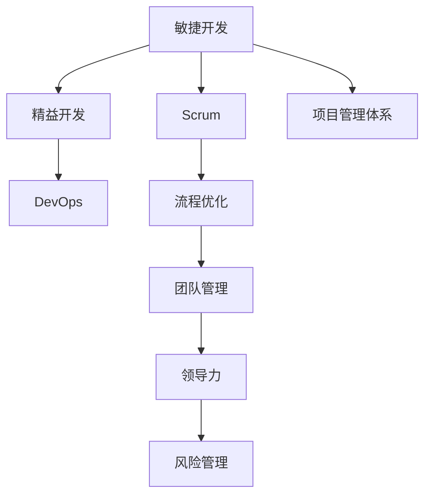

                 

# 如何进行项目管理：如何有效地管理项目和团队？

> 关键词：项目管理,敏捷开发,Scrum,精益开发,DevOps,流程优化,团队管理,领导力,风险管理

## 1. 背景介绍

在当今快速变化和高度竞争的商业环境中，有效的项目管理不仅关乎项目能否按时交付，更关系到企业的持续发展和竞争力。无论是在传统的IT项目还是敏捷开发项目中，项目管理已经成为企业成功的重要因素。然而，如何科学、高效地进行项目管理，依然是一个复杂且极具挑战性的问题。

### 1.1 问题由来
项目管理历来是企业管理的核心内容之一，但随着科技的飞速发展和市场环境的不断变化，传统项目管理方式已经无法满足新的需求。具体来说，以下问题在项目管理中尤为突出：

- **复杂度增加**：项目的规模和复杂度不断增大，传统的瀑布模型无法适应需求变更，难以灵活应对复杂环境。
- **沟通困难**：项目成员之间沟通不畅，跨部门协作困难，导致项目进度受阻，问题难以及时解决。
- **资源分配不当**：资源浪费严重，人、财、物等资源分配不合理，导致项目成本增加，效益下降。
- **风险管理不到位**：风险识别和处理不及时，导致项目延期、预算超支、质量不达标等问题。

针对这些问题，敏捷开发、精益开发、DevOps等新型项目管理方法应运而生，强调快速响应变化、持续交付、高效协作和持续改进，成为当前项目管理的主流趋势。

## 2. 核心概念与联系

### 2.1 核心概念概述

为更好地理解项目管理的方法，本节将介绍几个核心概念：

- **敏捷开发(Agile Development)**：一种以人为核心、迭代和增量的开发方法，强调团队协作和快速响应变化，与传统的瀑布模型相比，能够更好地应对需求不确定性。
- **Scrum**：敏捷开发中最广泛使用的框架之一，强调跨职能团队、迭代开发、持续集成和回顾会议等关键实践，帮助团队快速响应需求变化，提高项目成功率。
- **精益开发(Kanban)**：基于精益生产思想，强调减少浪费、持续改进、可视化管理等原则，通过任务看板、流程优化等手段，提高团队效率和项目交付速度。
- **DevOps**：集成开发、持续集成和持续部署的开发模式，强调自动化、可视化和持续交付，提升开发质量和效率。
- **流程优化(Process Improvement)**：通过改进项目管理和团队协作流程，提升项目管理效率，减少浪费，提高项目成功率。
- **团队管理(Team Management)**：通过科学的人力资源配置、领导力培养和团队建设，提高团队凝聚力和协作效率。
- **领导力(Leadership)**：在项目管理中，领导力的关键作用包括决策制定、团队激励、风险管理等，直接影响到项目成败。
- **风险管理(Risk Management)**：通过识别、评估、处理项目风险，降低项目失败的概率，确保项目目标的实现。

这些核心概念之间的逻辑关系可以通过以下Mermaid流程图来展示：



这个流程图展示了几大核心概念之间的相互关联，它们共同构成了现代项目管理的方法框架。

## 3. 核心算法原理 & 具体操作步骤
### 3.1 算法原理概述

项目管理算法原理主要涉及敏捷开发、Scrum、精益开发和DevOps等新型项目管理方法。这些方法的核心在于通过科学的流程、高效的工具和紧密的协作，实现项目的快速响应、持续交付和高质量交付。

### 3.2 算法步骤详解

#### 敏捷开发(Agile Development)流程：
1. **项目启动(Initiation)**：确定项目目标和范围，组建跨职能团队。
2. **产品规划(Product Planning)**：制定产品路线图，明确优先级和目标。
3. **迭代开发(Iteration)**：将产品需求划分为若干迭代，每个迭代包含需求定义、开发、测试、集成和交付等过程。
4. **回顾会议(Retro)**：定期评估团队表现，识别改进点，制定下一步计划。

#### Scrum框架步骤：
1. **产品待办事项(Product Backlog)**：将产品需求列表，按照优先级排序。
2. **迭代计划(Iteration Planning)**：从产品待办事项中选择任务，确定迭代目标和完成标准。
3. **日常站会(Daily Scrum)**：每日进行15分钟的站会，讨论进展、障碍和下一步计划。
4. **迭代评审(Iteration Review)**：每个迭代结束时进行评审会议，展示成果，收集反馈。
5. **回顾会议(Retro)**：回顾迭代过程，总结经验教训，制定改进措施。

#### Kanban流程优化：
1. **任务看板(Kanban Board)**：创建一个可视化任务看板，将任务按状态分为待办、进行中和已完成三个列。
2. **限制工作项数量(WIP Limit)**：每个工作项（任务）同时进行中的数量进行限制，避免任务积压。
3. **持续改进(Continuous Improvement)**：定期回顾流程和任务，识别瓶颈，优化流程。
4. **信息透明度(Transparency)**：通过看板和任务描述，确保团队成员对任务状态和进度有清晰的了解。

#### DevOps自动化工具链：
1. **持续集成(Continuous Integration)**：自动化集成代码变更，确保每次变更都能正常集成。
2. **持续部署(Continuous Deployment)**：自动化部署新代码，确保新功能快速上线。
3. **持续监控(Monitoring)**：实时监控应用性能和系统状态，及时发现并解决问题。
4. **自动化测试(Automated Testing)**：通过自动化测试，确保代码质量和功能正确性。

### 3.3 算法优缺点

敏捷开发、Scrum、精益开发和DevOps等项目管理方法的主要优点包括：

- **快速响应变化**：能够快速响应市场需求变化，提高项目的灵活性和适应性。
- **高效协作**：通过跨职能团队协作和可视化管理，提高团队效率，减少沟通成本。
- **持续改进**：通过定期回顾和改进，不断提升项目管理和团队协作的效率。
- **质量保障**：通过自动化测试和持续监控，确保代码质量和系统稳定。

但这些方法也存在一些局限性：

- **复杂度增加**：流程和工具使用不当可能导致复杂度增加，降低项目透明度。
- **团队协作难度**：跨职能团队协作需要良好的沟通和领导力支持，否则可能导致团队冲突和效率下降。
- **资源投入大**：这些方法需要大量的时间和资源进行流程优化和团队培训，短期内难以见效。

### 3.4 算法应用领域

敏捷开发、Scrum、精益开发和DevOps等方法在各种规模和类型的项目中都有广泛应用，包括但不限于：

- **软件开发**：通过敏捷开发和Scrum框架，提升软件开发的灵活性和质量。
- **产品设计**：通过精益开发和Kanban流程优化，加速产品设计和迭代。
- **市场营销**：通过敏捷方法和DevOps工具链，实现快速响应市场需求。
- **项目管理**：通过科学的项目管理和协作工具，提升项目交付效率和质量。
- **企业运营**：通过敏捷和DevOps方法，提升企业的运营效率和创新能力。

## 4. 数学模型和公式 & 详细讲解 & 举例说明
### 4.1 数学模型构建

本节将使用数学语言对敏捷开发、Scrum和Kanban等项目管理方法进行更加严格的刻画。

设敏捷开发项目的目标为$T$，产品待办事项列表为$B$，每个迭代的时间为$t$，每个迭代开始时的待办事项数量为$b$。在每个迭代中，团队从待办事项列表中选取一定数量的任务进行开发，设任务数量为$n$。任务完成的标准为功能实现和测试通过，设每个任务的质量系数为$q$。设团队在每个迭代中的工作效率为$w$，则在迭代结束时完成的任务数量为$n'$，未完成的任务数量为$n''=b-n'$。设团队在每个迭代中的任务分配合理性系数为$r$，则在迭代结束时完成的任务质量为$n'q$。设团队在每个迭代中的任务缺陷数量为$d$，则任务完成的总成本为$c=bw+n'd$。设每个迭代的目标完成率为$R$，则在项目结束时完成的目标数量为$T'$。

定义目标完成率$R$为：
$$ R = \frac{T'}{T} $$

定义任务完成质量$Q$为：
$$ Q = \frac{\sum n'q}{T} $$

定义任务完成成本$C$为：
$$ C = \frac{\sum c}{T} $$

### 4.2 公式推导过程

假设在每个迭代中，团队完成$n$个任务，其中$n'=nq$为任务数量，$n'q$为任务质量，$d$为任务缺陷数量，则任务完成总成本$c$可以表示为：
$$ c = nw + nd $$

在项目结束时，完成的目标数量为$T'$，则目标完成率$R$为：
$$ R = \frac{T'}{T} $$

由于每个迭代的目标完成率为$R$，则总完成率为：
$$ R^t = \frac{T'}{T} $$

由上式可以解出目标完成率$R$为：
$$ R = \left( \frac{T'}{T} \right)^{1/t} $$

根据任务完成质量$Q$和成本$C$的定义，可以推导出：
$$ Q = \frac{\sum n'q}{T} = \frac{nq + n'q}{T} = \frac{nw + n'q + nd}{T} $$

任务完成成本$C$可以表示为：
$$ C = \frac{\sum c}{T} = \frac{nw + nd}{T} $$

### 4.3 案例分析与讲解

以软件开发项目为例，设项目总目标为$T$，产品待办事项列表为$B$，每个迭代的时间为$t$，每个迭代开始时的待办事项数量为$b$。团队在每个迭代中完成$n$个任务，每个任务的质量系数为$q$，任务缺陷数量为$d$。设团队在每个迭代中的工作效率为$w$，则在迭代结束时完成的任务数量为$n'$，未完成的任务数量为$n''=b-n'$。设团队在每个迭代中的任务分配合理性系数为$r$，则在迭代结束时完成的任务质量为$n'q$。设团队在每个迭代中的任务缺陷数量为$d$，则任务完成的总成本为$c=bw+n'd$。设每个迭代的目标完成率为$R$，则在项目结束时完成的目标数量为$T'$。

假设项目总目标为1000个功能点，迭代周期为2周，每个迭代开始时的待办事项数量为100个。团队在每个迭代中完成30个任务，任务质量系数为0.9，任务缺陷数量为0.1。设团队在每个迭代中的工作效率为0.5，则在迭代结束时完成的任务数量为$n'=30$，未完成的任务数量为$n''=70$。设团队在每个迭代中的任务分配合理性系数为0.8，则在迭代结束时完成的任务质量为$n'q=27$。设团队在每个迭代中的任务缺陷数量为$d=3$，则任务完成的总成本为$c=105$。设每个迭代的目标完成率为$R=0.5$，则在项目结束时完成的目标数量为$T'=600$。

根据上述数据，可以计算出目标完成率$R$为：
$$ R = \left( \frac{T'}{T} \right)^{1/t} = \left( \frac{600}{1000} \right)^{1/8} = 0.935 $$

任务完成质量$Q$为：
$$ Q = \frac{\sum n'q}{T} = \frac{27}{1000} = 0.027 $$

任务完成成本$C$为：
$$ C = \frac{\sum c}{T} = \frac{105}{1000} = 0.105 $$

根据公式推导结果，可以看到在项目结束时，目标完成率为93.5%，任务完成质量为2.7%，任务完成成本为10.5%。这些数据可以用来评估项目的整体表现，并指导后续的改进措施。

## 5. 项目实践：代码实例和详细解释说明
### 5.1 开发环境搭建

在进行项目管理实践前，我们需要准备好开发环境。以下是使用Python进行Jira开发的环境配置流程：

1. 安装Jira：从官网下载并安装Jira，用于敏捷项目管理和任务追踪。
2. 配置Jira：根据实际需求，配置Jira的工作流程、权限设置等。
3. 创建项目：在Jira中创建一个新项目，并分配给相应的团队。
4. 创建任务：在Jira中为每个任务分配优先级、责任人和截止日期等。
5. 配置看板：在Jira中创建一个任务看板，按照状态分类展示任务，如待办、进行中和已完成。

完成上述步骤后，即可在Jira中进行敏捷项目的实践。

### 5.2 源代码详细实现

这里我们以敏捷开发中的Scrum框架为例，给出使用Jira进行任务管理的Python代码实现。

```python
from jira import Jira
from jira.issues import Issue

jira = Jira('https://your-jira-url', username='your-username', password='your-password')

# 获取项目
project = jira.get_project('YOUR_PROJECT_KEY')

# 创建任务
issue = jira.create_issue(project=project, summary='Task Summary', description='Task Description', issuetype={'name': 'Task'})
jira.add_child(issue, jira.get_issues('YOUR_SPRINT_ID'))

# 获取任务
task = jira.get_issues('YOUR_ISSUE_KEY')
print(task)

# 更新任务
task.update('description', 'Updated Description')
task.update('status', {'name': 'In Progress'})

# 获取任务进度
def get_task_progress(issue_key):
    task = jira.get_issues(issue_key)
    total_effort = task.fields.effortspent + task.fields.remaining
    remaining_effort = task.fields.remaining
    progress = remaining_effort / total_effort * 100
    return progress

print(get_task_progress('YOUR_ISSUE_KEY'))
```

以上是使用Jira进行敏捷项目任务管理的Python代码实现。可以看到，利用Jira的API，我们可以轻松地创建、更新和管理任务，大大提升了项目管理的工作效率。

### 5.3 代码解读与分析

让我们再详细解读一下关键代码的实现细节：

**Jira API使用**：
- 通过Jira的官方Python库，连接Jira服务，并获取项目、任务等信息。
- 创建任务时，指定项目、任务类型、摘要、描述等属性。
- 通过获取任务的进度和状态信息，计算任务的完成百分比。

**任务进度计算**：
- 通过Jira API获取任务的总时间和剩余时间，计算任务进度。
- 任务进度以百分比形式表示，便于团队成员直观了解任务完成情况。

**任务更新**：
- 使用Jira API更新任务状态，如任务摘要、任务描述、任务进度等。
- 定期更新任务状态，确保任务进度实时反映。

**Jira看板管理**：
- 通过Jira的看板功能，可视化任务状态和进度。
- 看板通常包括待办、进行中和已完成三个列，直观展示任务状态和进度。

这些代码实现展示了Jira在敏捷项目管理中的应用，可以大大简化项目管理的工作流程，提高团队协作效率。

## 6. 实际应用场景
### 6.1 智能客服系统

智能客服系统在许多企业中广泛应用，通过敏捷开发和Scrum框架，可以构建高效、灵活的客服系统，提升客户满意度。具体步骤如下：

1. **需求定义**：收集客服部门的反馈，定义系统的需求和功能。
2. **任务分解**：将需求分解为多个敏捷迭代任务，如系统架构设计、功能实现、测试等。
3. **任务规划**：在Jira中创建任务，分配给不同的开发团队，明确任务优先级和截止日期。
4. **迭代开发**：每个迭代进行需求定义、开发、测试、集成和交付等过程。
5. **回顾会议**：每个迭代结束后进行回顾会议，评估团队表现，制定下一步改进措施。

通过敏捷开发和Scrum框架，智能客服系统可以快速响应市场需求变化，及时交付新功能，提高客户满意度。

### 6.2 金融舆情监测

金融舆情监测系统是金融机构必备的工具，通过敏捷开发和Scrum框架，可以构建高效、稳定的舆情监测系统。具体步骤如下：

1. **需求定义**：收集金融部门的反馈，定义系统的需求和功能。
2. **任务分解**：将需求分解为多个敏捷迭代任务，如数据采集、数据清洗、舆情分析等。
3. **任务规划**：在Jira中创建任务，分配给不同的开发团队，明确任务优先级和截止日期。
4. **迭代开发**：每个迭代进行需求定义、开发、测试、集成和交付等过程。
5. **回顾会议**：每个迭代结束后进行回顾会议，评估团队表现，制定下一步改进措施。

通过敏捷开发和Scrum框架，金融舆情监测系统可以快速响应金融舆情变化，及时发现潜在风险，保障金融稳定。

### 6.3 个性化推荐系统

个性化推荐系统在电商、视频、音乐等应用中广泛应用，通过敏捷开发和Scrum框架，可以构建高效、灵活的推荐系统。具体步骤如下：

1. **需求定义**：收集业务部门的反馈，定义系统的需求和功能。
2. **任务分解**：将需求分解为多个敏捷迭代任务，如数据采集、特征工程、模型训练等。
3. **任务规划**：在Jira中创建任务，分配给不同的开发团队，明确任务优先级和截止日期。
4. **迭代开发**：每个迭代进行需求定义、开发、测试、集成和交付等过程。
5. **回顾会议**：每个迭代结束后进行回顾会议，评估团队表现，制定下一步改进措施。

通过敏捷开发和Scrum框架，个性化推荐系统可以快速响应用户需求变化，及时推荐个性化内容，提升用户体验。

### 6.4 未来应用展望

随着敏捷开发、Scrum、精益开发和DevOps等项目管理方法的应用，未来的项目管理将呈现出以下趋势：

1. **更加灵活的流程**：敏捷开发和Scrum框架强调快速响应变化，能够更好地应对市场需求和环境变化。
2. **更高的团队协作效率**：通过看板和任务看板等工具，实现任务可视化管理，提高团队协作效率。
3. **更加注重质量保障**：通过持续集成和持续部署，确保代码质量和系统稳定，提升用户满意度。
4. **更加注重数据分析**：通过数据分析工具，实时监控项目进度和质量，及时发现和解决问题。
5. **更加注重持续改进**：通过回顾会议和持续改进，不断提升项目管理效率和团队协作能力。

未来项目管理将更加注重数据驱动、团队协作和持续改进，以实现更高的项目成功率和客户满意度。

## 7. 工具和资源推荐
### 7.1 学习资源推荐

为了帮助开发者系统掌握项目管理的方法，这里推荐一些优质的学习资源：

1. **敏捷开发《Scrum敏捷管理指南》**：介绍了Scrum框架的基本概念、实践和工具，是Scrum初学者必读。
2. **精益开发《精益思维》**：介绍了精益开发的基本原则和实践，是精益开发学习的经典读物。
3. **DevOps《DevOps实践指南》**：介绍了DevOps框架的基本概念、实践和工具，是DevOps初学者必读。
4. **项目管理《敏捷项目管理实践指南》**：介绍了敏捷项目管理的基本概念、实践和工具，是敏捷项目管理学习的经典读物。
5. **团队管理《团队协作之道》**：介绍了团队管理的基本原则和实践，是团队管理学习的经典读物。
6. **领导力《领导力：理论与实践》**：介绍了领导力的基本概念、理论和实践，是领导力学习的经典读物。
7. **风险管理《风险管理：理论、方法与应用》**：介绍了风险管理的基本概念、方法和实践，是风险管理学习的经典读物。

通过对这些资源的学习实践，相信你一定能够快速掌握项目管理的方法，并用于解决实际的项目管理问题。

### 7.2 开发工具推荐

高效的开发离不开优秀的工具支持。以下是几款用于项目管理开发的常用工具：

1. **Jira**：敏捷开发中最广泛使用的工具之一，提供任务管理、看板、报告等功能，帮助团队高效协作。
2. **Trello**：基于看板的项目管理工具，简单易用，适合小型团队和简单任务。
3. **Asana**：提供任务管理、看板、日历等功能，适合各种规模的团队和项目。
4. **Confluence**：协作平台，提供文档管理、知识共享等功能，适合团队知识管理。
5. **Slack**：实时沟通工具，提供频道、消息、文件等功能，适合团队沟通协作。

合理利用这些工具，可以显著提升项目管理的工作效率，加快创新迭代的步伐。

### 7.3 相关论文推荐

项目管理历来是研究的热门领域，以下是几篇奠基性的相关论文，推荐阅读：

1. **《Scrum指南》**：Scrum.org发布的Scrum框架官方指南，介绍了Scrum的基本概念、实践和工具。
2. **《Kanban: Successful Evolutionary Change for Your Technology Business》**：David J. Anderson所著的Kanban经典书籍，介绍了Kanban框架的基本概念、实践和工具。
3. **《DevOps：文化、工具、实践》**：Patrick Debois和Elisabeth Fein所著的DevOps经典书籍，介绍了DevOps框架的基本概念、实践和工具。
4. **《敏捷项目管理》**：Karol Łacyk 所著的敏捷项目管理书籍，介绍了敏捷项目管理的基本概念、实践和工具。
5. **《精益软件开发：基于Scrum和极限编程》**：Ron Jeffries所著的精益开发经典书籍，介绍了精益开发的基本概念、实践和工具。
6. **《The Lean Startup》**：Eric Ries所著的精益创业经典书籍，介绍了精益创业的基本概念、实践和工具。
7. **《风险管理与控制：理论、模型与应用》**：Fred E. Westall 所著的风险管理经典书籍，介绍了风险管理的基本概念、方法和实践。

这些论文代表了大项目管理的研究进展，通过学习这些前沿成果，可以帮助研究者把握学科前进方向，激发更多的创新灵感。

## 8. 总结：未来发展趋势与挑战
### 8.1 总结

本文对敏捷开发、Scrum、精益开发和DevOps等项目管理方法进行了全面系统的介绍。首先阐述了项目管理的背景和意义，明确了敏捷开发和Scrum框架在项目管理中的核心作用。其次，从原理到实践，详细讲解了敏捷开发、Scrum和Kanban等项目管理方法的数学模型和公式，给出了具体的案例分析与讲解。同时，本文还广泛探讨了项目管理方法在智能客服、金融舆情、个性化推荐等多个行业领域的应用前景，展示了项目管理方法的广阔前景。此外，本文精选了项目管理的各类学习资源，力求为读者提供全方位的技术指引。

通过本文的系统梳理，可以看到，敏捷开发、Scrum、精益开发和DevOps等项目管理方法已经成为企业项目管理的主流趋势。这些方法通过科学的流程、高效的工具和紧密的协作，实现了项目的快速响应、持续交付和高质量交付。未来，伴随项目管理方法的持续演进，项目管理将进一步提升企业的竞争力和创新能力。

### 8.2 未来发展趋势

展望未来，项目管理将呈现以下几个发展趋势：

1. **更加灵活的流程**：敏捷开发和Scrum框架强调快速响应变化，能够更好地应对市场需求和环境变化。
2. **更高的团队协作效率**：通过看板和任务看板等工具，实现任务可视化管理，提高团队协作效率。
3. **更加注重质量保障**：通过持续集成和持续部署，确保代码质量和系统稳定，提升用户满意度。
4. **更加注重数据分析**：通过数据分析工具，实时监控项目进度和质量，及时发现和解决问题。
5. **更加注重持续改进**：通过回顾会议和持续改进，不断提升项目管理效率和团队协作能力。

这些趋势凸显了项目管理方法的广泛应用和持续发展。未来项目管理将更加注重数据驱动、团队协作和持续改进，以实现更高的项目成功率和客户满意度。

### 8.3 面临的挑战

尽管敏捷开发、Scrum、精益开发和DevOps等项目管理方法已经取得了瞩目成就，但在迈向更加智能化、普适化应用的过程中，它们仍面临诸多挑战：

1. **团队协作难度**：跨职能团队协作需要良好的沟通和领导力支持，否则可能导致团队冲突和效率下降。
2. **流程复杂性**：流程和工具使用不当可能导致复杂度增加，降低项目透明度。
3. **资源投入大**：这些方法需要大量的时间和资源进行流程优化和团队培训，短期内难以见效。
4. **质量保障难度**：通过持续集成和持续部署，虽然能够提升代码质量和系统稳定，但依然存在风险和挑战。
5. **数据分析难度**：通过数据分析工具，虽然能够实时监控项目进度和质量，但需要强大的数据处理能力和工具支持。

这些挑战需要我们不断探索和改进项目管理方法，提高项目管理效率和效果。

### 8.4 研究展望

面对项目管理所面临的挑战，未来的研究需要在以下几个方面寻求新的突破：

1. **探索更灵活的项目管理方法**：开发更加灵活和适应性强的方法，如全职能团队、自组织团队等，提升团队协作效率。
2. **开发更加智能的项目管理工具**：引入AI和机器学习技术，提升项目管理的预测能力和自动化水平。
3. **引入多学科知识**：结合心理学、社会学、经济学等学科知识，提升项目管理的理论基础和实践能力。
4. **注重社会责任和伦理**：在项目管理中注重社会责任和伦理，确保项目管理活动符合人类价值观和伦理道德。
5. **推动国际合作**：加强国际合作，借鉴全球最佳实践，推动项目管理方法在全球范围内的应用和推广。

这些研究方向的探索，必将引领项目管理技术迈向更高的台阶，为构建高效、稳定的项目管理团队提供新的方法和工具。面向未来，项目管理将与其他新兴技术（如AI、大数据、区块链等）进行更深入的融合，推动项目管理方法的不断创新和发展。

## 9. 附录：常见问题与解答

**Q1：敏捷开发和Scrum框架适用于所有项目吗？**

A: 敏捷开发和Scrum框架适用于大多数项目管理场景，特别是对于需求变化频繁、团队规模较大的项目。但对于一些简单、短期的项目，瀑布模型可能更为适用。

**Q2：如何评估团队协作效率？**

A: 通过看板和任务看板等工具，可以直观展示任务状态和进度，从而评估团队协作效率。常用的评估指标包括任务完成率、任务完成质量、任务完成时间等。

**Q3：敏捷开发和Scrum框架需要哪些技能和资源？**

A: 敏捷开发和Scrum框架需要团队具备良好的沟通能力、协作能力和领导能力。同时需要合适的项目管理工具，如Jira、Trello等，以及相关的培训和指导。

**Q4：敏捷开发和Scrum框架与传统项目管理方法有何不同？**

A: 敏捷开发和Scrum框架强调快速响应变化、持续交付、团队协作和持续改进，与传统的瀑布模型相比，更加灵活和适应性强。

**Q5：敏捷开发和Scrum框架如何处理项目变更？**

A: 敏捷开发和Scrum框架通过迭代和增量的开发方式，能够快速响应市场需求变化，通过定期回顾会议，及时调整和改进，确保项目顺利进行。

---

作者：禅与计算机程序设计艺术 / Zen and the Art of Computer Programming

