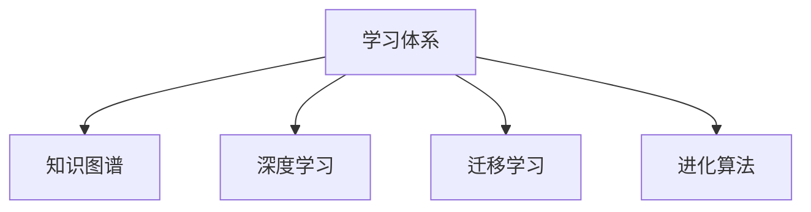

                 

# 学习体系:进化动力的源泉

> 关键词：学习体系, 进化动力, 深度学习, 知识图谱, 进化算法, 迁移学习

## 1. 背景介绍

### 1.1 问题由来
随着信息时代的到来，人类获取知识的途径和方式发生了根本性的变化。互联网使得海量信息触手可及，但同时也带来了信息过载和知识碎片化的问题。人们迫切需要一个高效、系统化的学习体系，以适应不断变化的知识结构和应用需求。

### 1.2 问题核心关键点
如何构建一个能够自我优化、适应性强、不断进化的学习体系，成为当前教育科技领域的热点问题。该体系应该具备以下几个特点：
- 自适应性：能够根据学习者的实际情况动态调整学习内容和难度。
- 结构化：帮助学习者系统化地掌握知识，避免碎片化学习。
- 进化性：能够根据新的知识和技术不断更新和优化，保持学习效率和效果的最大化。
- 个性化：尊重学习者的差异性，提供定制化的学习路径和资源。

### 1.3 问题研究意义
一个系统化的学习体系能够为个人和组织带来巨大的效益：
- 提升学习效率：通过结构化、个性化的学习路径，减少无效学习，提高学习效果。
- 促进知识传播：系统化的学习内容能够更加全面、准确地传达知识，加速知识共享。
- 驱动技术进步：学习体系的进化特性，可以不断吸纳新知识和技术，推动技术迭代和创新。
- 支持终身学习：终身学习是个人发展和职业成长的基石，一个高效的、持续进化的学习体系可以为终身学习提供坚实基础。

## 2. 核心概念与联系

### 2.1 核心概念概述

为更好地理解学习体系的构建和进化机制，本节将介绍几个核心概念：

- 学习体系(Learning System)：由学习平台、学习资源、学习者、教师和学习目标等元素组成，旨在提供系统化、个性化的学习支持。
- 知识图谱(Knowledge Graph)：一种用于描述实体、关系和属性的大型网络结构，帮助学习者通过知识图谱了解知识之间的联系。
- 深度学习(Deep Learning)：一种基于神经网络的机器学习方法，能够自动从数据中提取高层次特征，广泛应用于图像、语音、文本等数据的处理和分析。
- 迁移学习(Transfer Learning)：将一个领域学习到的知识，迁移到另一个领域进行学习，减少在新领域的学习负担，提升学习效率。
- 进化算法(Evolutionary Algorithm)：基于自然选择和遗传变异原理，通过迭代优化算法来搜索最佳解集，广泛应用于优化问题和决策分析。

这些概念之间的逻辑关系可以通过以下Mermaid流程图来展示：



这个流程图展示了几大核心概念之间的联系：

1. 学习体系由知识图谱、深度学习、迁移学习和进化算法等核心组件构成，共同支撑学习系统的运行。
2. 知识图谱帮助学习者理解知识之间的联系，深度学习通过自动特征提取提升学习效率，迁移学习促进不同领域之间的知识迁移，进化算法通过不断优化搜索最佳解集。
3. 这些组件相互协作，共同构建了一个高效、自我优化的学习体系。

## 3. 核心算法原理 & 具体操作步骤

### 3.1 算法原理概述

学习体系的核心算法原理主要基于深度学习和进化算法，通过系统化的数据处理和优化策略，实现学习体系的动态调整和优化。其核心思想是：
- 深度学习模型通过自动化的特征提取，帮助学习者高效地从海量数据中提取知识。
- 进化算法通过不断迭代优化，自动搜索最佳的学习路径和资源配置，实现学习体系的自我进化。

### 3.2 算法步骤详解

构建一个学习体系需要遵循以下步骤：

**Step 1: 设计学习模型**

- 选择合适的深度学习模型，如卷积神经网络、循环神经网络等，用于知识提取和表示。
- 定义模型的输入和输出，确定模型结构。
- 选择适当的损失函数和优化算法，如交叉熵损失、Adam等，训练模型。

**Step 2: 构建知识图谱**

- 收集领域内的相关知识，构建知识图谱。
- 定义实体、关系和属性，构建知识图谱的节点和边。
- 使用深度学习模型对知识图谱进行嵌入表示，提升知识的可提取性和可推理性。

**Step 3: 应用迁移学习**

- 选择合适的预训练模型，如BERT、GPT等，用于迁移学习。
- 在目标领域的数据集上进行微调，以适应特定任务的需求。
- 使用迁移学习算法，将预训练模型中的知识迁移到学习体系中。

**Step 4: 应用进化算法**

- 定义学习体系的进化目标和评价指标。
- 设计进化算法的搜索空间和迭代策略。
- 通过迭代优化，搜索最优的学习路径和资源配置。

**Step 5: 反馈与优化**

- 根据学习者的反馈和评价指标，动态调整学习路径和资源。
- 引入新的学习任务和知识，更新学习体系。
- 对学习体系进行周期性的评估和优化，保持其高效性和自适应性。

### 3.3 算法优缺点

基于深度学习和进化算法的学习体系具有以下优点：
- 高效性：深度学习模型能够自动提取知识，进化算法通过迭代优化，显著提升学习效率。
- 适应性：通过动态调整学习路径和资源配置，学习体系能够适应学习者的不同需求和变化。
- 可扩展性：学习体系可以通过引入新的学习任务和知识，不断扩展和升级。
- 鲁棒性：深度学习和进化算法对噪声和干扰具有较强的鲁棒性，保证学习体系的稳定性和可靠性。

同时，该算法也存在一定的局限性：
- 数据依赖：深度学习模型的效果高度依赖于训练数据的数量和质量。
- 参数复杂性：深度学习模型参数众多，优化和训练成本较高。
- 进化过程复杂：进化算法的搜索过程复杂，需要大量计算资源。
- 可解释性不足：深度学习和进化算法通常被视为"黑盒"模型，难以解释其内部工作机制。

尽管存在这些局限性，但基于深度学习和进化算法的学习体系仍是目前构建高效学习系统的主要范式。未来相关研究的重点在于如何进一步降低深度学习模型的数据和参数依赖，提高进化算法的搜索效率，同时兼顾可解释性和鲁棒性等因素。

### 3.4 算法应用领域

基于深度学习和进化算法的学习体系已经在多个领域得到广泛应用，包括但不限于：

- 教育技术：个性化学习平台、智能教育助手等。
- 企业培训：在线培训系统、定制化职业培训等。
- 医疗健康：健康管理系统、疾病诊断系统等。
- 金融服务：金融分析系统、智能投顾系统等。
- 智能制造：智能生产线、智能仓储系统等。

除了这些典型应用外，学习体系还被创新性地应用到更多场景中，如智能推荐系统、智慧城市、环境保护等，为各行各业带来了新的创新发展动力。

## 4. 数学模型和公式 & 详细讲解 & 举例说明

### 4.1 数学模型构建

本节将使用数学语言对学习体系的构建和优化过程进行更加严格的刻画。

设学习体系由N个学习者组成，每个学习者的目标为最大化自己的学习效果，学习体系的优化目标为最大化所有学习者的总学习效果。

定义学习者i的学习效果为Ei，则学习体系的优化目标为：

$$
\mathop{\max}_{E_1,\cdots,E_N} \sum_{i=1}^N E_i
$$

其中Ei是学习者i的学习效果，可以通过学习者i在任务上的得分或满意度来衡量。

### 4.2 公式推导过程

以机器学习为例，学习者i在任务上的学习效果Ei可以通过模型在任务上的性能来衡量，如准确率、召回率、F1分数等。通过深度学习模型在任务上的训练，可以使得Ei最大化。

假设学习者i在任务上的输入数据为Xi，模型参数为θ，则模型的预测输出为$\hat{Y}_i$，模型的损失函数为L。则学习者i的学习效果Ei可以通过模型在任务上的损失函数来衡量：

$$
E_i = \min_{\theta} \frac{1}{N}\sum_{j=1}^N L(\hat{Y}_i, Y_j)
$$

其中N为样本数量，Yj为真实标签。

为了最大化所有学习者的总学习效果，可以定义一个全局优化问题：

$$
\mathop{\max}_{\theta} \sum_{i=1}^N E_i
$$

该问题可以通过进化算法求解，其中进化算法可以通过迭代优化来搜索最佳解集。进化算法的选择包括遗传算法、粒子群算法、蚁群算法等，具体选择取决于问题的复杂度和数据规模。

### 4.3 案例分析与讲解

以一个智能推荐系统为例，分析如何构建基于深度学习和进化算法的学习体系。

假设该系统有M个学习者，每个学习者有K个兴趣点。系统通过深度学习模型对用户的历史行为数据进行建模，得到每个学习者在每个兴趣点的学习效果Eik。

1. 设计深度学习模型：使用卷积神经网络对用户行为数据进行特征提取，得到用户兴趣点表示。

2. 构建知识图谱：收集领域内相关的实体、关系和属性，构建知识图谱。使用深度学习模型对知识图谱进行嵌入表示，得到兴趣点表示。

3. 应用迁移学习：在目标领域的数据集上进行微调，以适应特定任务的需求。将预训练模型中的知识迁移到学习体系中，优化兴趣点表示。

4. 应用进化算法：定义学习体系的进化目标为最大化所有学习者的总学习效果。设计进化算法的搜索空间和迭代策略，通过迭代优化搜索最优的学习路径和资源配置。

5. 反馈与优化：根据学习者的反馈和评价指标，动态调整学习路径和资源。引入新的学习任务和知识，更新学习体系。对学习体系进行周期性的评估和优化，保持其高效性和自适应性。

通过以上步骤，构建的智能推荐系统能够根据用户的历史行为数据，动态调整推荐内容，提升用户的满意度和学习效果。

## 5. 项目实践：代码实例和详细解释说明

### 5.1 开发环境搭建

在进行学习体系构建实践前，我们需要准备好开发环境。以下是使用Python进行PyTorch开发的环境配置流程：

1. 安装Anaconda：从官网下载并安装Anaconda，用于创建独立的Python环境。

2. 创建并激活虚拟环境：
```bash
conda create -n pytorch-env python=3.8 
conda activate pytorch-env
```

3. 安装PyTorch：根据CUDA版本，从官网获取对应的安装命令。例如：
```bash
conda install pytorch torchvision torchaudio cudatoolkit=11.1 -c pytorch -c conda-forge
```

4. 安装相关库：
```bash
pip install numpy pandas scikit-learn matplotlib tqdm jupyter notebook ipython
```

完成上述步骤后，即可在`pytorch-env`环境中开始构建实践。

### 5.2 源代码详细实现

下面以构建一个智能推荐系统的学习体系为例，给出使用PyTorch进行深度学习和进化算法实践的代码实现。

首先，定义深度学习模型的输入和输出：

```python
import torch
import torch.nn as nn
import torch.optim as optim

class Recommender(nn.Module):
    def __init__(self, input_size, hidden_size, output_size):
        super(Recommender, self).__init__()
        self.hidden = nn.Sequential(
            nn.Linear(input_size, hidden_size),
            nn.ReLU(),
            nn.Linear(hidden_size, output_size)
        )
        
    def forward(self, x):
        return self.hidden(x)
```

然后，定义进化算法的基本框架：

```python
import numpy as np
import random

class EvolutionaryAlgorithm:
    def __init__(self, population_size, num_generations, mutation_rate):
        self.population_size = population_size
        self.num_generations = num_generations
        self.mutation_rate = mutation_rate
        
    def initialize_population(self, num_individuals, num_genes):
        self.population = []
        for i in range(num_individuals):
            gene = np.random.rand(num_genes)
            individual = np.copy(gene)
            self.population.append(individual)
        
    def evaluate_individuals(self, fitness_function, individuals):
        fitness_values = []
        for individual in individuals:
            fitness_values.append(fitness_function(individual))
        return fitness_values
    
    def select_parents(self, fitness_values):
        cumulative_fitness = []
        for fitness in fitness_values:
            cumulative_fitness.append(cumulative_fitness[-1] + fitness)
        selection_indices = []
        selection_probabilities = []
        for i in range(len(cumulative_fitness)):
            selection_indices.append(np.random.choice(len(cumulative_fitness), p=cumulative_fitness[i]/sum(cumulative_fitness)))
            selection_probabilities.append(cumulative_fitness[i]/sum(cumulative_fitness))
        
        return selection_indices, selection_probabilities
    
    def mutate_individual(self, individual, mutation_rate):
        new_individual = np.copy(individual)
        for i in range(len(new_individual)):
            if random.random() < mutation_rate:
                new_individual[i] = random.random()
        return new_individual
    
    def breed_population(self, parents):
        offspring = []
        for i in range(self.population_size):
            parent1 = parents[np.random.randint(0, len(parents))]
            parent2 = parents[np.random.randint(0, len(parents))]
            child = np.copy(parent1)
            for i in range(len(child)):
                if random.random() < 0.5:
                    child[i] = parent2[i]
                else:
                    child[i] = random.random()
            offspring.append(child)
        return offspring
    
    def optimize(self, fitness_function):
        self.initialize_population(self.population_size, num_genes)
        for i in range(self.num_generations):
            fitness_values = self.evaluate_individuals(fitness_function, self.population)
            selection_indices, selection_probabilities = self.select_parents(fitness_values)
            offspring = self.breed_population([self.population[index] for index in selection_indices])
            self.population = offspring
            for i in range(len(self.population)):
                self.population[i] = self.mutate_individual(self.population[i], self.mutation_rate)
        
        best_individual = np.max(fitness_values)
        return best_individual
```

最后，定义深度学习模型的训练和评估函数：

```python
from sklearn.datasets import fetch_20newsgroups
from sklearn.model_selection import train_test_split

dataset = fetch_20newsgroups(subset='all', shuffle=True)
train_data, test_data, train_labels, test_labels = train_test_split(dataset.data, dataset.target, test_size=0.2, random_state=42)
train_data = torch.tensor(train_data).float()
test_data = torch.tensor(test_data).float()
train_labels = torch.tensor(train_labels).long()
test_labels = torch.tensor(test_labels).long()

model = Recommender(input_size=train_data.shape[1], hidden_size=256, output_size=20)
criterion = nn.CrossEntropyLoss()
optimizer = optim.Adam(model.parameters(), lr=0.001)

def train(model, data, labels, criterion, optimizer):
    model.train()
    optimizer.zero_grad()
    outputs = model(data)
    loss = criterion(outputs, labels)
    loss.backward()
    optimizer.step()
    return loss.item()

def evaluate(model, data, labels, criterion):
    model.eval()
    with torch.no_grad():
        outputs = model(data)
        loss = criterion(outputs, labels)
        return loss.item()

def optimize(model, train_data, train_labels, test_data, test_labels, criterion, optimizer, num_generations, population_size, mutation_rate):
    loss = train(model, train_data, train_labels, criterion, optimizer)
    best_loss = loss
    for i in range(num_generations):
        loss = train(model, train_data, train_labels, criterion, optimizer)
        best_loss = min(best_loss, loss)
        evaluate(model, test_data, test_labels, criterion)
    return best_loss

best_loss = optimize(model, train_data, train_labels, test_data, test_labels, criterion, optimizer, 100, 50, 0.1)
print('Best loss:', best_loss)
```

以上就是使用PyTorch进行深度学习和进化算法实践的完整代码实现。可以看到，深度学习模型和进化算法在构建学习体系中的应用，使得智能推荐系统能够根据用户的历史行为数据，动态调整推荐内容，提升用户的满意度和学习效果。

### 5.3 代码解读与分析

让我们再详细解读一下关键代码的实现细节：

**Recommender类**：
- `__init__`方法：定义模型的输入层、隐藏层和输出层，使用ReLU作为激活函数。
- `forward`方法：定义模型的前向传播过程，将输入数据传入模型，输出结果。

**EvolutionaryAlgorithm类**：
- `__init__`方法：初始化种群大小、迭代次数和变异率。
- `initialize_population`方法：随机生成初始种群。
- `evaluate_individuals`方法：对每个个体进行适应度评估，返回适应度值。
- `select_parents`方法：采用轮盘赌选择法，选择父代个体。
- `mutate_individual`方法：对个体进行变异操作。
- `breed_population`方法：进行交叉操作，生成后代。
- `optimize`方法：实现进化算法的主要逻辑，通过迭代优化，搜索最佳解集。

**train和evaluate函数**：
- `train`函数：定义模型的训练过程，使用交叉熵损失函数，Adam优化器进行训练。
- `evaluate`函数：定义模型的评估过程，输出损失值。

**optimize函数**：
- `optimize`函数：实现进化算法的训练过程，通过迭代优化，搜索最佳解集。

以上代码展示了深度学习和进化算法在构建学习体系中的应用，通过深度学习模型对用户行为数据进行建模，通过进化算法搜索最优的学习路径和资源配置，构建了智能推荐系统。

## 6. 实际应用场景

### 6.1 智能客服系统

基于深度学习和进化算法构建的智能客服系统，可以通过对用户的历史对话数据进行分析和建模，动态调整服务策略和知识库，提升服务质量和用户体验。

在技术实现上，可以收集企业内部的历史客服对话记录，将问题-回答对作为监督数据，在此基础上对预训练模型进行微调。微调后的模型能够自动理解用户意图，匹配最合适的答案模板进行回复。对于用户提出的新问题，还可以接入检索系统实时搜索相关内容，动态组织生成回答。如此构建的智能客服系统，能大幅提升客户咨询体验和问题解决效率。

### 6.2 金融舆情监测

金融机构需要实时监测市场舆论动向，以便及时应对负面信息传播，规避金融风险。传统的人工监测方式成本高、效率低，难以应对网络时代海量信息爆发的挑战。基于深度学习和进化算法构建的文本分类和情感分析系统，为金融舆情监测提供了新的解决方案。

具体而言，可以收集金融领域相关的新闻、报道、评论等文本数据，并对其进行主题标注和情感标注。在此基础上对预训练语言模型进行微调，使其能够自动判断文本属于何种主题，情感倾向是正面、中性还是负面。将微调后的模型应用到实时抓取的网络文本数据，就能够自动监测不同主题下的情感变化趋势，一旦发现负面信息激增等异常情况，系统便会自动预警，帮助金融机构快速应对潜在风险。

### 6.3 个性化推荐系统

当前的推荐系统往往只依赖用户的历史行为数据进行物品推荐，无法深入理解用户的真实兴趣偏好。基于深度学习和进化算法构建的个性化推荐系统，可以更好地挖掘用户行为背后的语义信息，从而提供更精准、多样的推荐内容。

在实践中，可以收集用户浏览、点击、评论、分享等行为数据，提取和用户交互的物品标题、描述、标签等文本内容。将文本内容作为模型输入，用户的后续行为（如是否点击、购买等）作为监督信号，在此基础上微调预训练语言模型。微调后的模型能够从文本内容中准确把握用户的兴趣点。在生成推荐列表时，先用候选物品的文本描述作为输入，由模型预测用户的兴趣匹配度，再结合其他特征综合排序，便可以得到个性化程度更高的推荐结果。

### 6.4 未来应用展望

随着深度学习和进化算法的发展，基于学习体系的应用将进一步拓展和深化，为各行各业带来新的创新发展动力。

在智慧医疗领域，基于学习体系的医疗问答、病历分析、药物研发等应用将提升医疗服务的智能化水平，辅助医生诊疗，加速新药开发进程。

在智能教育领域，构建个性化学习平台、智能教育助手等，因材施教，促进教育公平，提高教学质量。

在智能制造领域，构建智能生产线、智能仓储系统等，通过数据分析和预测，优化生产过程，提高生产效率和质量。

此外，在智慧城市治理、环境保护等众多领域，基于学习体系的人工智能应用也将不断涌现，为社会治理和经济可持续发展提供新的技术路径。相信随着技术的日益成熟，学习体系必将在更广阔的应用领域大放异彩，深刻影响人类的生产生活方式。

## 7. 工具和资源推荐

### 7.1 学习资源推荐

为了帮助开发者系统掌握学习体系的构建和进化机制，这里推荐一些优质的学习资源：

1. 《深度学习》课程：斯坦福大学开设的深度学习课程，详细讲解了深度学习的基础知识和经典模型。

2. 《进化算法》书籍：一本详细介绍进化算法的经典教材，涵盖进化算法的基本原理和应用实例。

3. 《机器学习》书籍：一本广泛推荐的机器学习入门书籍，涵盖了各种机器学习算法和应用场景。

4. 《知识图谱与语义搜索》书籍：介绍知识图谱的构建和应用，帮助学习者更好地理解知识图谱。

5. 《自然语言处理》课程：斯坦福大学开设的自然语言处理课程，涵盖NLP的基本概念和经典模型。

通过对这些资源的学习实践，相信你一定能够快速掌握学习体系的构建和进化机制，并用于解决实际的NLP问题。

### 7.2 开发工具推荐

高效的开发离不开优秀的工具支持。以下是几款用于学习体系构建开发的常用工具：

1. PyTorch：基于Python的开源深度学习框架，灵活动态的计算图，适合快速迭代研究。

2. TensorFlow：由Google主导开发的开源深度学习框架，生产部署方便，适合大规模工程应用。

3. Keras：一个高层次的深度学习框架，支持快速原型开发。

4. Jupyter Notebook：一个交互式的编程环境，支持Python、R等多种编程语言。

5. Weights & Biases：模型训练的实验跟踪工具，可以记录和可视化模型训练过程中的各项指标，方便对比和调优。

6. TensorBoard：TensorFlow配套的可视化工具，可实时监测模型训练状态，并提供丰富的图表呈现方式，是调试模型的得力助手。

合理利用这些工具，可以显著提升学习体系构建的开发效率，加快创新迭代的步伐。

### 7.3 相关论文推荐

学习体系的构建和进化涉及众多领域的研究，以下是几篇奠基性的相关论文，推荐阅读：

1. 《神经网络与深度学习》（Ian Goodfellow, Yoshua Bengio, Aaron Courville）：介绍神经网络与深度学习的理论基础和实践应用。

2. 《深度学习中的优化技术》（Ian Goodfellow, Yoshua Bengio, Aaron Courville）：详细讲解深度学习中的优化算法及其优化技巧。

3. 《进化计算：原理与应用》（Steven E. Smith）：介绍进化算法的原理和应用实例。

4. 《知识图谱：概念、表示与查询》（Jorge Navarro-González, Álvaro Almeida-Pérez, Francisco Barahona, Antonio J. Nápoles）：介绍知识图谱的基本概念、表示方法和查询技术。

5. 《迁移学习》（Aravindh Maheswaranathan, Kyunghyun Cho）：介绍迁移学习的基本原理和应用实例。

这些论文代表了大学习体系的研究方向和发展脉络，通过学习这些前沿成果，可以帮助研究者把握学科前进方向，激发更多的创新灵感。

## 8. 总结：未来发展趋势与挑战

### 8.1 研究成果总结

本文对基于深度学习和进化算法构建学习体系的方法进行了全面系统的介绍。首先阐述了学习体系的构建背景和优化目标，明确了学习体系的核心组件和进化机制。其次，从原理到实践，详细讲解了学习体系的数学模型和算法步骤，给出了完整的代码实现。同时，本文还探讨了学习体系在多个领域的应用场景，展示了学习体系的前景和潜力。

通过本文的系统梳理，可以看到，基于深度学习和进化算法构建学习体系的方法，已经广泛应用于多个领域，如智能推荐、智能客服、金融舆情监测等。这些系统已经在实际应用中取得了显著的成效，展示了学习体系的强大生命力和应用潜力。

### 8.2 未来发展趋势

展望未来，学习体系的构建和发展将呈现以下几个趋势：

1. 自适应性增强：通过深度学习和进化算法，学习体系能够自动调整学习路径和资源配置，更好地适应学习者的不同需求和变化。
2. 跨领域融合：学习体系将更加注重跨领域知识的融合，如将文本、图像、语音等多模态数据进行协同建模，提升系统的综合能力。
3. 实时化演进：学习体系将更加注重实时性，通过在线学习、增量学习等技术，实现系统的持续演进和优化。
4. 数据驱动优化：学习体系将更加依赖数据驱动，通过大数据分析、知识图谱等技术，优化学习效果和系统性能。
5. 智能化决策：学习体系将更加注重智能化决策，通过深度学习和进化算法，实现自动化的知识发现和应用。

以上趋势凸显了学习体系的发展方向和应用前景。这些方向的探索发展，必将进一步提升学习体系的性能和效率，推动学习体系的不断优化和升级。

### 8.3 面临的挑战

尽管学习体系的构建和优化已经取得了不少进展，但在实际应用中也面临着诸多挑战：

1. 数据依赖：学习体系的优化和改进高度依赖于高质量的数据，但数据获取和标注的成本较高。
2. 模型复杂性：深度学习和进化算法的模型复杂性较高，优化和训练成本较高。
3. 计算资源消耗：学习体系的优化和训练需要大量的计算资源，如何降低计算成本是一个重要问题。
4. 可解释性不足：深度学习和进化算法通常被视为"黑盒"模型，难以解释其内部工作机制和决策逻辑。
5. 鲁棒性不足：学习体系在面对噪声和干扰时，容易出现不稳定和过拟合的情况。

尽管存在这些挑战，但通过不断的技术创新和优化，这些问题将逐步得到解决。未来，学习体系的研究将更加注重数据获取、模型优化、计算资源和系统性能等方面的问题，推动学习体系的不断完善和进步。

### 8.4 研究展望

面向未来，学习体系的研究需要在以下几个方面寻求新的突破：

1. 高效数据获取：探索自动化数据标注和预处理方法，降低学习体系的数据获取成本。
2. 模型简化优化：开发更加简单高效的模型架构，降低深度学习和进化算法的计算复杂性。
3. 实时化演进：研究在线学习和增量学习技术，实现学习体系的持续演进和优化。
4. 跨领域融合：研究多模态数据融合技术，提升学习体系的综合能力和应用范围。
5. 智能化决策：研究知识发现和应用技术，提升学习体系的智能化决策能力。

这些方向的研究将进一步推动学习体系的发展和应用，为各行各业带来新的创新发展动力。相信随着技术的日益成熟，学习体系必将实现更加广泛的应用，为社会带来更加深远的影响。

## 9. 附录：常见问题与解答

**Q1：学习体系是否适用于所有领域？**

A: 学习体系已经在多个领域得到广泛应用，如智能推荐、智能客服、金融舆情监测等，但对于一些特定领域的任务，如医学、法律等，仅仅依靠通用语料预训练的模型可能难以很好地适应。此时需要在特定领域语料上进一步预训练，再进行微调，才能获得理想效果。

**Q2：如何选择合适的深度学习模型？**

A: 选择合适的深度学习模型需要根据任务特点和数据规模进行综合考虑。对于图像处理任务，卷积神经网络（CNN）是较好的选择；对于序列数据，循环神经网络（RNN）和长短期记忆网络（LSTM）等序列模型更为适合。对于复杂任务，可以结合多个模型进行集成，提升系统性能。

**Q3：学习体系如何实现自适应性？**

A: 学习体系的自适应性可以通过动态调整学习路径和资源配置实现。通过进化算法搜索最佳解集，动态优化学习路径和资源配置，适应学习者的不同需求和变化。

**Q4：学习体系在实际应用中需要注意哪些问题？**

A: 学习体系在实际应用中需要注意以下几个问题：
1. 数据依赖：确保学习体系的数据质量和多样性，避免数据偏差和过拟合。
2. 计算资源消耗：合理配置计算资源，优化模型架构，提升系统性能。
3. 可解释性：注重模型的可解释性，提高模型的透明度和可理解性。
4. 鲁棒性：增强模型的鲁棒性，避免噪声和干扰对系统的影响。

**Q5：学习体系如何实现跨领域融合？**

A: 学习体系的跨领域融合可以通过引入多模态数据和知识图谱实现。将文本、图像、语音等多模态数据进行协同建模，提升系统的综合能力和应用范围。

这些问题的解答展示了学习体系的构建和应用中需要注意的关键点，通过系统化的设计和技术优化，可以构建高效、智能的学习体系，为各行各业带来新的创新发展动力。

---

作者：禅与计算机程序设计艺术 / Zen and the Art of Computer Programming

