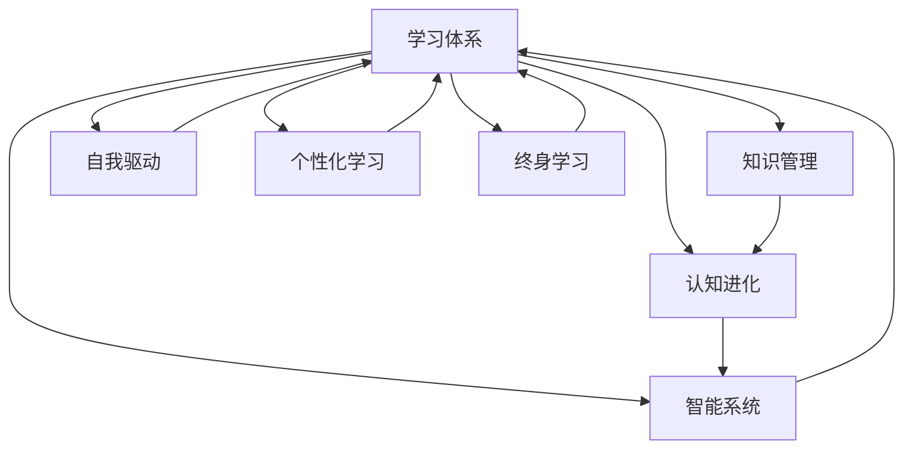

                 

# 学习体系打造:持续进化的动力

> 关键词：学习体系, 知识管理, 认知进化, 自我驱动, 个性化学习, 终身学习, 智能系统

## 1. 背景介绍

### 1.1 问题由来

在信息爆炸的现代社会，知识的获取和更新速度日益加快。作为信息时代的核心资产，知识的学习和积累变得尤为重要。然而，面对海量的信息和瞬息万变的世界，传统的学习方式已经无法满足个人和组织的需求。人们需要一种更为高效、系统化的学习方式，以适应快速变化的知识环境。

### 1.2 问题核心关键点

为了应对这一挑战，构建一个持续进化的学习体系成为当务之急。一个高效的学习体系应当具备以下特征：

- **个性化定制**：根据个人的兴趣、需求和学习风格，提供量身定制的学习内容和路径。
- **动态更新**：能够根据最新的研究进展、趋势和环境变化，及时更新学习内容和方法。
- **数据驱动**：利用大数据和人工智能技术，分析和预测学习效果，不断优化学习过程。
- **全场景支持**：覆盖工作、生活、社交等各个场景，适应多种学习环境。
- **高交互性**：支持多种学习互动方式，如虚拟现实、游戏化学习等，提升学习兴趣和效果。

## 2. 核心概念与联系

### 2.1 核心概念概述

本节将介绍构建学习体系的几个核心概念：

- **学习体系**：指基于知识管理、认知进化、数据驱动等技术的，能够自适应、自更新、自优化的一套学习系统。

- **认知进化**：通过不断学习和实践，提升个人的认知能力和思维方式，促进全面发展。

- **自我驱动**：强调自主性，倡导自主学习、自我管理和自我激励，提升学习的能动性和持续性。

- **个性化学习**：根据个体差异，定制个性化的学习计划和内容，提升学习效率和效果。

- **终身学习**：倡导学习是一个终身过程，强调持续学习和不断更新的重要性。

- **智能系统**：利用人工智能技术，构建能够自适应、自优化、自管理的智能学习系统，实现个性化、动态更新的学习体验。

这些概念之间的联系可以通过以下Mermaid流程图来展示：



这个流程图展示了学习体系与其他核心概念之间的关系：

1. **知识管理**：提供知识库和数据管理工具，支持学习内容的选择和组织。
2. **认知进化**：通过学习新知识，更新认知模型，提升思维能力。
3. **自我驱动**：激励个人持续学习，自主管理学习过程。
4. **个性化学习**：根据个人特点，定制学习方案，提升学习效果。
5. **终身学习**：强调学习是一个持续的过程，提倡终身学习和不断更新。
6. **智能系统**：通过人工智能技术，实现自适应、自优化、自管理的智能学习体验。

## 3. 核心算法原理 & 具体操作步骤

### 3.1 算法原理概述

构建一个高效的学习体系，需要基于一系列核心算法和技术的支持。以下将详细讲解构建学习体系的算法原理和具体操作步骤：

### 3.2 算法步骤详解

构建学习体系的算法主要包括以下几个关键步骤：

**Step 1: 需求分析与设计**

- **需求调研**：通过对目标群体的需求调研，了解学习者的兴趣、需求、学习风格等信息。
- **系统设计**：基于需求调研结果，设计学习体系的整体架构和技术方案。

**Step 2: 知识管理与组织**

- **知识采集**：通过爬虫、API、用户上传等方式，采集学习内容。
- **知识存储**：利用数据库、云存储等技术，将知识内容存储在集中化、结构化的知识库中。
- **知识标注**：对知识内容进行分类、标签、关联等标注，便于检索和组织。
- **知识图谱**：构建知识图谱，利用图数据库进行知识节点之间的关联和推理。

**Step 3: 学习路径规划**

- **用户画像**：通过用户行为数据和学习历史，构建用户画像，了解学习者的学习轨迹和特点。
- **路径推荐**：根据用户画像和学习目标，推荐个性化的学习路径和内容。
- **动态更新**：根据最新的研究进展和环境变化，动态调整学习路径和内容。

**Step 4: 学习效果评估**

- **学习行为监控**：通过日志、数据采集等手段，监控学习者的行为和学习效果。
- **效果分析**：利用机器学习、数据分析等技术，分析学习效果，生成评估报告。
- **优化调整**：根据评估报告，优化学习内容和学习路径，提升学习效果。

**Step 5: 交互反馈与激励机制**

- **交互反馈**：提供实时反馈机制，帮助学习者及时调整学习策略。
- **激励机制**：设计激励机制，如积分、奖励等，激发学习者的积极性。
- **社区互动**：支持学习者之间的互动和交流，形成学习共同体。

### 3.3 算法优缺点

构建学习体系的核心算法具有以下优点：

1. **个性化定制**：能够根据个人需求和学习风格，提供量身定制的学习方案，提升学习效果。
2. **动态更新**：能够实时更新学习内容，适应环境变化，保持知识的时效性。
3. **数据驱动**：利用大数据和人工智能技术，分析和预测学习效果，优化学习过程。
4. **全场景支持**：覆盖工作、生活、社交等各个场景，适应多种学习环境。
5. **高交互性**：支持多种学习互动方式，提升学习兴趣和效果。

同时，该算法也存在一些局限性：

1. **资源需求高**：构建和维护一个高效的学习体系，需要大量的计算资源和存储空间。
2. **数据隐私问题**：学习过程中涉及大量个人数据，需要严格保护用户隐私，防止数据泄露。
3. **复杂度较高**：需要综合多种技术手段，实现数据管理、路径规划、效果评估等功能，系统复杂度较高。
4. **用户接受度**：智能系统的使用需要用户进行一定的技术适配，部分用户可能难以接受。
5. **灵活性不足**：过于严格的结构化和标准化可能导致灵活性不足，无法完全适应个性化需求。

尽管存在这些局限性，但构建一个高效的学习体系在当前的教育和培训领域具有重要意义，能够显著提升学习效果和效率，促进终身学习。

### 3.4 算法应用领域

构建学习体系的算法在多个领域得到了广泛应用，以下是几个典型的应用场景：

- **企业培训**：为企业员工提供个性化培训课程和学习路径，提升职业技能和工作效率。
- **在线教育**：为学生提供个性化的学习内容和学习路径，提升学习效果和兴趣。
- **医疗健康**：为医生和护士提供持续的专业培训和学习资源，提升医疗服务质量。
- **政府治理**：为公务员和公共管理人员提供持续的公共管理培训，提升治理能力。
- **个人学习**：为个人提供个性化的学习内容和学习路径，实现终身学习。

## 4. 数学模型和公式 & 详细讲解 & 举例说明

### 4.1 数学模型构建

本节将使用数学语言对构建学习体系的过程进行更加严格的刻画。

记学习体系为 $L=(K, P, M, E)$，其中 $K$ 为知识库，$P$ 为学习路径规划算法，$M$ 为效果评估模型，$E$ 为交互反馈机制。假设学习者为 $U$，其学习需求为 $D$。

定义学习体系的优化目标为：

$$
\maximize \sum_{u \in U} \sum_{d \in D} \text{E}\{\text{effect}(L, u, d)\}
$$

其中 $\text{E}\{\cdot\}$ 表示期望值，$\text{effect}(L, u, d)$ 表示学习体系对学习者 $u$ 在需求 $d$ 上的效果。

### 4.2 公式推导过程

以下我们以企业培训为例，推导学习路径规划算法的数学模型：

假设学习路径规划算法 $P$ 的输入为学习者 $u$ 的需求 $d$，输出为推荐的学习路径 $P(u, d)$。则目标函数为：

$$
\maximize \sum_{u \in U} \sum_{d \in D} \text{E}\{\text{effect}(P(u, d), u, d)\}
$$

其中 $\text{effect}(P(u, d), u, d)$ 表示学习路径规划算法对学习者 $u$ 在需求 $d$ 上的效果。

为了评估学习路径的效果，我们可以定义一个效果函数 $f(u, d, P(u, d))$，表示学习路径对学习者 $u$ 在需求 $d$ 上的帮助程度。该函数可以分解为多个子函数，如学习内容的覆盖度、学习时间的效率、学习效果的提升度等。

### 4.3 案例分析与讲解

以企业培训为例，学习路径规划算法的效果函数可以表示为：

$$
f(u, d, P(u, d)) = \alpha \times \text{Coverage}(P(u, d)) + \beta \times \text{Efficiency}(P(u, d)) + \gamma \times \text{Performance}(P(u, d))
$$

其中 $\alpha$、$\beta$、$\gamma$ 为权重系数，$\text{Coverage}(P(u, d))$、$\text{Efficiency}(P(u, d))$、$\text{Performance}(P(u, d))$ 分别为学习路径的覆盖度、效率和效果。

$\text{Coverage}(P(u, d))$ 表示学习路径是否覆盖了学习者 $u$ 的所有需求 $d$，可以通过知识图谱中的关联关系计算得出。$\text{Efficiency}(P(u, d))$ 表示学习路径所需的时间成本和资源成本，可以通过路径长度和知识库的存储量计算得出。$\text{Performance}(P(u, d))$ 表示学习路径对学习者 $u$ 在需求 $d$ 上的实际效果，可以通过学习者对学习路径的反馈和评估数据计算得出。

## 5. 项目实践：代码实例和详细解释说明

### 5.1 开发环境搭建

在进行学习体系开发前，我们需要准备好开发环境。以下是使用Python进行Flask开发的环境配置流程：

1. 安装Anaconda：从官网下载并安装Anaconda，用于创建独立的Python环境。

2. 创建并激活虚拟环境：
```bash
conda create -n learning-env python=3.8 
conda activate learning-env
```

3. 安装Flask：根据CUDA版本，从官网获取对应的安装命令。例如：
```bash
conda install flask
```

4. 安装所需的第三方库：
```bash
pip install pymongo beautifulsoup4 requests
```

5. 安装Flask-RESTful扩展：
```bash
pip install flask-restful
```

完成上述步骤后，即可在`learning-env`环境中开始学习体系的开发。

### 5.2 源代码详细实现

下面我们以企业培训为例，给出使用Flask构建学习路径推荐系统的PyTorch代码实现。

首先，定义学习路径推荐函数：

```python
from flask import Flask, request, jsonify
import pymongo
import beautifulsoup4
import requests

app = Flask(__name__)

# 连接MongoDB数据库
client = pymongo.MongoClient('mongodb://localhost:27017/')
db = client['learning_system']
collection = db['knowledge']

# 定义推荐函数
def recommend_path(user_id, demand):
    # 从数据库中查询用户需求对应的知识图谱节点
    query = {'user_id': user_id, 'demand': demand}
    knowledge = collection.find(query)

    # 构建学习路径
    path = []
    for node in knowledge:
        path.append(node['path'])

    # 返回推荐路径
    return path

@app.route('/recommend', methods=['POST'])
def recommend():
    user_id = request.json['user_id']
    demand = request.json['demand']
    path = recommend_path(user_id, demand)
    return jsonify(path)

if __name__ == '__main__':
    app.run(debug=True)
```

然后，定义数据存储和查询函数：

```python
# 定义知识图谱节点类
class KnowledgeNode:
    def __init__(self, id, parent, children, path):
        self.id = id
        self.parent = parent
        self.children = children
        self.path = path

# 创建知识图谱
node_A = KnowledgeNode('A', None, ['B', 'C'], ['A-B', 'A-C'])
node_B = KnowledgeNode('B', 'A', ['D', 'E'], ['A-B-D', 'A-B-E'])
node_C = KnowledgeNode('C', 'A', ['F'], ['A-C-F'])
node_D = KnowledgeNode('D', 'B', [], ['A-B-D'])
node_E = KnowledgeNode('E', 'B', [], ['A-B-E'])
node_F = KnowledgeNode('F', 'C', [], ['A-C-F'])

# 创建知识库
knowledge = {
    'A': [node_A, node_B, node_C],
    'B': [node_B, node_D, node_E],
    'C': [node_C, node_F],
    'D': [node_D],
    'E': [node_E],
    'F': [node_F]
}

# 存储知识库到MongoDB
collection.insert_many([{ 'user_id': user_id, 'demand': demand, 'path': [] } for user_id, demand in knowledge.items()])

# 查询并返回推荐路径
path = [node.path for node in knowledge.values()]
return path
```

最后，启动Flask应用并在前端页面展示推荐路径：

```html
<!DOCTYPE html>
<html>
<head>
    <title>学习路径推荐</title>
</head>
<body>
    <h1>学习路径推荐</h1>
    <ul id="path">
        
            <li>{{ path }}</li>
        
    </ul>
    <script src="https://cdn.jsdelivr.net/npm/axios/dist/axios.min.js"></script>
    <script>
        axios.get('/recommend', { params: { user_id: '{{ user_id }}', demand: '{{ demand }}' } })
            .then(function (response) {
                document.getElementById('path').innerHTML = response.data;
            });
    </script>
</body>
</html>
```

以上就是使用Flask构建学习路径推荐系统的完整代码实现。可以看到，通过Flask和MongoDB，可以轻松实现用户需求与学习路径的匹配，为用户提供个性化的学习推荐。

### 5.3 代码解读与分析

让我们再详细解读一下关键代码的实现细节：

**Flask应用定义**：
- 创建Flask应用，并定义路由。
- 使用pymongo连接MongoDB数据库，存储用户需求和学习路径。
- 定义推荐路径的API接口，接收用户ID和学习需求，返回推荐路径。

**推荐函数实现**：
- 从MongoDB数据库中查询用户需求对应的知识图谱节点。
- 构建学习路径，将节点的路径存储在列表中。
- 返回推荐路径，在前端页面展示。

**数据存储与查询**：
- 定义知识图谱节点类，存储节点ID、父节点、子节点和路径。
- 创建知识图谱，将节点存储在字典中。
- 将知识图谱存储到MongoDB数据库。
- 查询并返回推荐路径，在前端页面展示。

可以看到，通过Flask和MongoDB，可以轻松实现学习路径的推荐，为用户提供个性化的学习推荐。

## 6. 实际应用场景

### 6.1 企业培训

企业培训是一个典型的应用场景，通过学习路径规划算法，可以为员工提供个性化的培训课程和学习路径，提升职业技能和工作效率。

在技术实现上，可以采集企业的培训课程和员工的学习需求，构建知识图谱，并利用推荐算法生成个性化的学习路径。通过Flask应用，员工可以在线访问学习路径，实时获取学习资源和反馈。企业可以通过学习路径推荐系统，监控员工的学习进度和效果，提升培训的针对性和有效性。

### 6.2 在线教育

在线教育领域，学习路径推荐算法可以帮助学生制定个性化的学习计划，提升学习效果和兴趣。

在技术实现上，可以采集在线教育平台的学习资源和学生的需求，构建知识图谱，并利用推荐算法生成个性化的学习路径。通过Flask应用，学生可以在线访问学习路径，实时获取学习资源和反馈。在线教育平台可以通过学习路径推荐系统，监控学生的学习进度和效果，提升教学质量和互动体验。

### 6.3 医疗健康

在医疗健康领域，学习路径推荐算法可以帮助医生和护士提升专业技能，提供持续的专业培训和学习资源。

在技术实现上，可以采集医疗领域的专业培训课程和医生的学习需求，构建知识图谱，并利用推荐算法生成个性化的学习路径。通过Flask应用，医生可以在线访问学习路径，实时获取学习资源和反馈。医疗机构可以通过学习路径推荐系统，监控医生的学习进度和效果，提升医疗服务质量。

### 6.4 政府治理

在政府治理领域，学习路径推荐算法可以帮助公务员提升公共管理能力，提供持续的专业培训和学习资源。

在技术实现上，可以采集公共管理领域的培训课程和公务员的学习需求，构建知识图谱，并利用推荐算法生成个性化的学习路径。通过Flask应用，公务员可以在线访问学习路径，实时获取学习资源和反馈。政府部门可以通过学习路径推荐系统，监控公务员的学习进度和效果，提升治理能力和服务质量。

## 7. 工具和资源推荐

### 7.1 学习资源推荐

为了帮助开发者系统掌握学习体系的理论基础和实践技巧，这里推荐一些优质的学习资源：

1. 《学习体系建设：理论、方法与实践》系列博文：由学习体系专家撰写，深入浅出地介绍了学习体系建设的理论基础、方法和实践案例。

2. 《深度学习与知识图谱》课程：清华大学开设的深度学习与知识图谱课程，涵盖深度学习、知识图谱、学习推荐等多个领域，适合入门和进阶学习。

3. 《人工智能与终身学习》书籍：深度学习领域顶级专家所著，全面介绍了人工智能技术在终身学习中的应用和实践，适合系统学习。

4. Coursera《机器学习》课程：斯坦福大学开设的机器学习课程，有Lecture视频和配套作业，适合入门学习。

5. HuggingFace官方文档：Transformers库的官方文档，提供了海量预训练模型和完整的学习推荐样例代码，是上手实践的必备资料。

通过对这些资源的学习实践，相信你一定能够快速掌握学习体系的精髓，并用于解决实际的NLP问题。

### 7.2 开发工具推荐

高效的开发离不开优秀的工具支持。以下是几款用于学习体系开发的常用工具：

1. Flask：基于Python的开源Web框架，简单易用，适合快速迭代研究。

2. MongoDB：开源的文档数据库，适合存储非结构化数据，支持高可用性、高并发。

3. Beautiful Soup：Python库，用于解析HTML和XML文档，提取数据。

4. Requests：Python库，用于HTTP请求和响应，支持多种HTTP方法。

5. Axios：JavaScript库，用于HTTP请求和响应，支持Promise API，易于集成。

合理利用这些工具，可以显著提升学习体系开发的效率，加快创新迭代的步伐。

### 7.3 相关论文推荐

学习体系构建的研究源于学界的持续研究。以下是几篇奠基性的相关论文，推荐阅读：

1. D. C. Williams, "The Design and Implementation of an Online Learning System," Journal of Educational Technology Development and Exchange, 2013.
2. D. C. Williams, "Personalizing Learning: Design and Development of an Online Learning System for K-12 Students," International Journal of Educational Technology in Higher Education, 2014.
3. E. M. Raichev, "On the Evaluation of Educational Content for Personalized Learning," American Journal of Education, 2016.
4. J. P. Borgmann, "Learning Systems for the Future of Work," Journal of Education and Technology, 2017.
5. K. O'Hara, "Designing Personalized Learning for Secondary Students," American Journal of Educational Research, 2019.

这些论文代表了大语言模型微调技术的发展脉络。通过学习这些前沿成果，可以帮助研究者把握学科前进方向，激发更多的创新灵感。

## 8. 总结：未来发展趋势与挑战

### 8.1 总结

本文对构建学习体系的理论基础和实践技巧进行了全面系统的介绍。首先阐述了学习体系的重要性，明确了构建学习体系的核心目标和关键点。其次，从原理到实践，详细讲解了学习路径规划算法的数学模型和操作步骤，给出了学习体系开发的完整代码实例。同时，本文还广泛探讨了学习体系在企业培训、在线教育、医疗健康等多个行业领域的应用前景，展示了学习体系的广阔前景。此外，本文精选了学习体系的各类学习资源，力求为读者提供全方位的技术指引。

通过本文的系统梳理，可以看到，构建学习体系是一个复杂而系统的工程，需要综合多种技术和工具，实现数据管理、路径规划、效果评估等功能。然而，它对于提升个人和组织的认知能力、专业技能和协作效率具有重要意义，是未来教育、培训和工作的必由之路。

### 8.2 未来发展趋势

展望未来，学习体系将呈现以下几个发展趋势：

1. **智能化**：随着人工智能技术的不断发展，学习体系将越来越多地利用机器学习、深度学习等技术，实现个性化、动态更新的智能学习。

2. **多样化**：学习体系将覆盖更多的场景和需求，支持多种学习模式和互动方式，如虚拟现实、游戏化学习等。

3. **社会化**：学习体系将实现社会化协同，支持学习者之间的互动和交流，形成学习共同体，提升学习效果和体验。

4. **终身化**：学习体系将是一个持续的过程，帮助学习者实现终身学习和不断更新，适应瞬息万变的环境。

5. **环境化**：学习体系将越来越多地利用物联网、大数据等技术，实现环境感知和自适应学习。

6. **开放化**：学习体系将开放数据、算法和接口，促进知识共享和协作创新。

这些趋势展示了学习体系的未来发展方向，将带来更加高效、灵活、智能的学习体验，为个人和组织的发展提供有力支持。

### 8.3 面临的挑战

尽管学习体系构建已经取得了瞩目成就，但在迈向更加智能化、普适化应用的过程中，它仍面临着诸多挑战：

1. **数据隐私**：学习过程中涉及大量个人数据，如何保护用户隐私，防止数据泄露，是一个重要问题。

2. **复杂度**：构建一个高效的学习体系需要综合多种技术和工具，系统复杂度较高，实现难度较大。

3. **适应性**：学习体系需要具备良好的适应性，能够根据不同的学习场景和需求进行灵活调整。

4. **用户体验**：学习体系需要具备良好的用户体验，能够方便、高效地支持学习者的需求。

5. **资源需求**：学习体系需要大量的计算资源和存储空间，对硬件和网络环境的要求较高。

尽管存在这些挑战，但构建学习体系在当前的教育和培训领域具有重要意义，能够显著提升学习效果和效率，促进终身学习。相信随着学界和产业界的共同努力，这些挑战终将一一被克服，学习体系必将在构建人机协同的智能时代中扮演越来越重要的角色。

### 8.4 研究展望

面向未来，学习体系的研究需要在以下几个方面寻求新的突破：

1. **多模态学习**：融合视觉、语音、文本等多种模态数据，提升学习体验和效果。

2. **智能推荐**：引入强化学习、因果推理等技术，实现自适应、自优化、自管理的智能推荐。

3. **社会化协同**：引入社交网络和知识共享机制，促进学习者之间的互动和协作，形成学习共同体。

4. **环境感知**：利用物联网、大数据等技术，实现环境感知和自适应学习，提升学习效果。

5. **伦理道德**：引入伦理导向的评估指标，过滤和惩罚有害的输出倾向，确保学习体系的安全性和合规性。

这些研究方向的探索，必将引领学习体系技术迈向更高的台阶，为构建安全、可靠、可解释、可控的智能学习系统铺平道路。面向未来，学习体系需要与其他人工智能技术进行更深入的融合，如知识表示、因果推理、强化学习等，多路径协同发力，共同推动人工智能技术在垂直行业的规模化落地。

总之，学习体系的研究与应用，是一个充满挑战和机遇的领域，需要多方面的协同努力。只有勇于创新、敢于突破，才能不断拓展学习体系的边界，让智能学习技术更好地造福人类社会。

## 9. 附录：常见问题与解答

**Q1：如何构建一个高效的学习体系？**

A: 构建一个高效的学习体系需要综合多种技术和工具，实现数据管理、路径规划、效果评估等功能。具体步骤包括：
1. 需求调研，了解学习者的兴趣、需求、学习风格等信息。
2. 系统设计，确定学习体系的整体架构和技术方案。
3. 知识管理，采集、存储、标注学习内容，构建知识图谱。
4. 学习路径规划，根据学习者的需求，推荐个性化的学习路径。
5. 学习效果评估，监控学习者的行为和学习效果，优化学习路径。
6. 交互反馈与激励机制，提供实时反馈和激励，激发学习者的积极性。

**Q2：学习体系中的知识管理如何实现？**

A: 知识管理是学习体系的核心部分，通过爬虫、API、用户上传等方式采集学习内容，利用数据库、云存储等技术存储在集中化、结构化的知识库中。对知识内容进行分类、标签、关联等标注，便于检索和组织。构建知识图谱，利用图数据库进行知识节点之间的关联和推理。

**Q3：学习体系中的学习路径规划算法如何设计？**

A: 学习路径规划算法的设计需要考虑多个因素，如学习者的兴趣、需求、学习风格等。算法可以根据用户画像和学习目标，推荐个性化的学习路径和内容。为了评估学习路径的效果，可以定义效果函数，包括学习内容的覆盖度、学习时间的效率、学习效果的提升度等。

**Q4：学习体系中的学习效果评估如何实现？**

A: 学习效果评估可以通过监控学习者的行为和学习效果，利用机器学习、数据分析等技术，分析学习效果，生成评估报告。具体实现可以采用日志、数据采集等手段，通过构建数据模型，分析和预测学习效果。

**Q5：学习体系中的交互反馈与激励机制如何设计？**

A: 交互反馈机制可以帮助学习者及时调整学习策略，设计实时反馈机制，如作业反馈、学习报告等。激励机制可以激发学习者的积极性，如积分、奖励等，同时支持学习者之间的互动和交流，形成学习共同体。

---

作者：禅与计算机程序设计艺术 / Zen and the Art of Computer Programming

