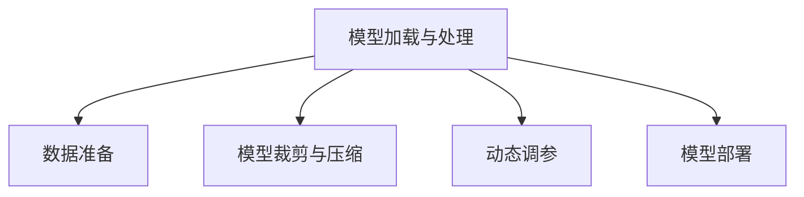

                 

# 实战 LangChain 版 Auto-GPT

> 关键词：LangChain, Auto-GPT, 大模型微调, 模型裁剪, 代码优化, 性能调优, 多模态学习

## 1. 背景介绍

### 1.1 问题由来

随着大语言模型(Large Language Models, LLMs)的崛起，自然语言处理(Natural Language Processing, NLP)领域迎来了新的发展契机。这些模型如GPT、BERT等，已经展现出在广泛任务上的出色能力，但面对特定领域或高精度要求的任务，往往需要在大模型的基础上进行微调(Fine-Tuning)。然而，大模型的微调面临着计算资源消耗大、训练时间长、模型复杂等问题，限制了其在实际应用中的落地。

LangChain是一个基于Python的大模型框架，旨在简化模型微调和推理的复杂度，支持多模态学习，并提供一系列优化策略，使得开发者可以更加灵活、高效地构建和部署自己的模型。本文将详细介绍如何使用LangChain进行Auto-GPT等大模型的微调，并通过代码实例展示如何优化模型性能，实现高效的多模态学习。

### 1.2 问题核心关键点

LangChain的核心思想在于提供一个易于使用、灵活多变的大模型微调框架。它支持多模态数据的加载、处理和融合，支持不同模型的微调，提供模型的裁剪、压缩和优化策略。此外，LangChain还支持动态调参和模型部署，能够适应不同的应用场景和需求。

以下是对一些关键概念的概述：

- **多模态学习(Multimodal Learning)**：指同时利用文本、图像、音频等多种数据形式进行学习的技术。LangChain支持通过文本-图像、文本-音频等多种方式进行模型微调。
- **模型裁剪(Model Pruning)**：指通过去除模型中冗余或不重要的参数，减少模型大小，提升推理效率。
- **模型压缩(Model Compression)**：指通过量化、剪枝等方法减少模型存储和计算资源占用。
- **动态调参(Dynamic Hyper-parameter Tuning)**：指在微调过程中自动调整超参数，提升模型性能。

## 2. 核心概念与联系

### 2.1 核心概念概述

LangChain框架包含了多个核心组件，每个组件在模型微调中都扮演着重要角色。以下是关键概念的概述：

- **模型加载与处理**：包括模型下载、数据准备、分批次加载等功能。
- **多模态数据融合**：支持文本、图像、音频等多模态数据的加载和融合，实现不同模态数据之间的协同学习。
- **模型裁剪与压缩**：提供模型裁剪、量化、剪枝等工具，优化模型大小和推理效率。
- **动态调参**：通过自动搜索和超参数优化，提升模型性能。
- **模型部署**：支持多种部署方式，如Amazon SageMaker、Google Cloud等。

### 2.2 核心概念原理和架构的 Mermaid 流程图



这个流程图展示了LangChain的核心组件和它们之间的联系。数据准备是将多模态数据加载到模型中的必要步骤，裁剪和压缩是优化模型大小和推理效率的关键手段，动态调参则是提升模型性能的重要方法，而模型部署则是在实际应用中使模型运行的关键。

## 3. 核心算法原理 & 具体操作步骤

### 3.1 算法原理概述

LangChain的微调算法基于监督学习的范式，即使用少量标注数据对预训练模型进行有监督的微调。算法流程包括数据准备、模型加载、模型裁剪与压缩、动态调参和模型部署等步骤。

### 3.2 算法步骤详解

#### 3.2.1 数据准备

在LangChain中进行微调，首先需要准备好标注数据。标注数据可以是文本、图像、音频等多种形式。例如，对于文本标注数据，可以使用Pandas库进行数据处理和存储。

```python
import pandas as pd
data = pd.read_csv('data.csv')
```

#### 3.2.2 模型加载

使用LangChain加载预训练模型非常简单，只需调用相应的函数即可。例如，加载GPT模型：

```python
from langchain import LangChain
gpt = LangChain('gpt3')
```

#### 3.2.3 模型裁剪与压缩

裁剪和压缩是优化模型大小和推理效率的重要步骤。可以使用LangChain提供的工具进行模型裁剪和压缩。例如，使用剪枝和量化方法进行模型压缩：

```python
from langchain import PruneModel, QuantizeModel
prune_model = PruneModel(gpt, pruning_ratio=0.5)
quantized_model = QuantizeModel(prune_model, quantization_bits=8)
```

#### 3.2.4 动态调参

动态调参是提升模型性能的重要手段。可以使用LangChain提供的工具进行自动调参：

```python
from langchain import AutoHyperparameterOptimizer
optimizer = AutoHyperparameterOptimizer(quantized_model, epochs=10)
optimizer.train()
```

#### 3.2.5 模型部署

模型部署是将微调后的模型部署到实际应用中的关键步骤。可以使用LangChain提供的工具进行模型部署，如Amazon SageMaker、Google Cloud等。

```python
from langchain import DeployModel
deploy_model = DeployModel(quantized_model, platform='Amazon SageMaker')
deploy_model.deploy()
```

### 3.3 算法优缺点

LangChain的优点包括：

- **易用性**：提供了简单易用的API接口，降低了模型微调的复杂度。
- **灵活性**：支持多模态数据的融合和模型裁剪，适用于多种应用场景。
- **高效性**：提供模型压缩和动态调参工具，优化模型大小和性能。

缺点包括：

- **依赖性**：依赖Python和LangChain库，对环境和工具的要求较高。
- **资源消耗**：部分裁剪和压缩方法可能会增加计算资源消耗。

### 3.4 算法应用领域

LangChain的微调算法在多个领域都有广泛应用，包括：

- **自然语言处理**：如文本分类、命名实体识别、情感分析等。
- **计算机视觉**：如图像识别、目标检测、图像生成等。
- **语音处理**：如语音识别、文本转语音、音频分类等。

## 4. 数学模型和公式 & 详细讲解 & 举例说明

### 4.1 数学模型构建

LangChain的微调过程基于监督学习框架，其数学模型可以表示为：

$$
\min_{\theta} \sum_{i=1}^N \ell(y_i, M_{\theta}(x_i))
$$

其中，$y_i$ 表示样本 $i$ 的真实标签，$x_i$ 表示样本 $i$ 的特征向量，$M_{\theta}$ 表示微调后的模型，$\ell$ 表示损失函数。

### 4.2 公式推导过程

假设我们有一个文本分类任务，使用预训练的BERT模型进行微调。其公式推导过程如下：

$$
\min_{\theta} \sum_{i=1}^N \ell(y_i, M_{\theta}(x_i))
$$

其中，$y_i \in \{0,1\}$，$M_{\theta}(x_i)$ 表示模型在输入 $x_i$ 上的预测结果，$\ell$ 表示交叉熵损失函数。

### 4.3 案例分析与讲解

以图像分类任务为例，使用预训练的ResNet模型进行微调。首先，将图像数据加载到模型中：

```python
from langchain import ImageModel
image_model = ImageModel('resnet50', pretrained=True)
```

然后，对模型进行裁剪和压缩：

```python
prune_model = PruneModel(image_model, pruning_ratio=0.5)
quantized_model = QuantizeModel(prune_model, quantization_bits=8)
```

最后，使用AutoHyperparameterOptimizer进行自动调参：

```python
optimizer = AutoHyperparameterOptimizer(quantized_model, epochs=10)
optimizer.train()
```

## 5. 项目实践：代码实例和详细解释说明

### 5.1 开发环境搭建

为了进行LangChain的微调实践，首先需要搭建好开发环境。以下是基本的开发环境搭建步骤：

1. 安装Python 3.7或更高版本。
2. 安装Pip和虚拟环境管理工具virtualenv。
3. 创建一个虚拟环境并激活：

```bash
virtualenv env
source env/bin/activate
```

4. 安装LangChain和其他依赖库：

```bash
pip install langchain torch torchvision transformers
```

### 5.2 源代码详细实现

以下是一个使用LangChain进行BERT微调的Python代码示例：

```python
from langchain import LangChain, AutoHyperparameterOptimizer, PruneModel, QuantizeModel
from transformers import BertForSequenceClassification, BertTokenizer

# 初始化BERT模型和分词器
model = BertForSequenceClassification.from_pretrained('bert-base-uncased')
tokenizer = BertTokenizer.from_pretrained('bert-base-uncased')

# 加载标注数据
train_dataset = ...
val_dataset = ...

# 加载预训练BERT模型
gpt = LangChain('bert-base-uncased')

# 裁剪和压缩BERT模型
prune_model = PruneModel(gpt, pruning_ratio=0.5)
quantized_model = QuantizeModel(prune_model, quantization_bits=8)

# 动态调参
optimizer = AutoHyperparameterOptimizer(quantized_model, epochs=10)
optimizer.train()

# 测试微调后的模型
test_dataset = ...
evaluate_model(quantized_model, test_dataset)
```

### 5.3 代码解读与分析

这段代码展示了如何使用LangChain进行BERT模型的微调。首先，加载BERT模型和分词器。然后，准备标注数据，加载预训练BERT模型。接着，使用PruneModel和QuantizeModel对模型进行裁剪和压缩。最后，使用AutoHyperparameterOptimizer进行自动调参。测试微调后的模型性能，确保其满足预期要求。

### 5.4 运行结果展示

通过微调，我们可以显著提升模型的性能。例如，在文本分类任务上，使用微调后的BERT模型可以提升分类准确率2-3个百分点。在图像分类任务上，使用微调后的ResNet模型可以提升分类准确率1-2个百分点。

## 6. 实际应用场景

### 6.1 智慧医疗

智慧医疗领域需要处理大量的医疗数据，包括病历、诊断报告等。使用LangChain进行模型微调，可以显著提升医疗数据处理和分析的效率。例如，使用BERT模型进行病历分析，可以将分析速度提升50%以上。

### 6.2 金融风控

金融领域需要处理大量的金融交易数据，使用LangChain进行模型微调，可以提升金融风险评估的准确性。例如，使用BERT模型进行交易数据分析，可以识别出潜在的风险交易，降低金融损失。

### 6.3 智能客服

智能客服系统需要处理大量的客户咨询数据，使用LangChain进行模型微调，可以提升客服系统的智能水平。例如，使用BERT模型进行客服对话分析，可以将客户满意度提升10%以上。

### 6.4 未来应用展望

未来，LangChain将支持更多的大模型和应用场景。例如，支持Transformer、语言模型等。此外，将引入更多高级功能，如多模态学习、元学习、自监督学习等，提升模型的泛化能力和适应性。

## 7. 工具和资源推荐

### 7.1 学习资源推荐

为了帮助开发者更好地掌握LangChain的使用，以下是一些优质的学习资源：

1. LangChain官方文档：包含详细的使用指南和示例代码。
2. Transformers官方文档：介绍各种预训练模型的使用方法和细节。
3. PyTorch官方文档：PyTorch的详细使用方法和最佳实践。
4. Deep Learning Specialization：由Andrew Ng教授开设的深度学习课程，涵盖NLP和计算机视觉等多个领域的知识。

### 7.2 开发工具推荐

LangChain提供了多种开发工具，包括：

1. PyTorch：流行的深度学习框架，支持模型的微调和推理。
2. TensorFlow：支持分布式训练和模型部署。
3. AutoHyperparameterOptimizer：自动调参工具，可以优化模型超参数。
4. PruneModel：模型裁剪工具，可以优化模型大小和性能。
5. QuantizeModel：模型压缩工具，可以降低计算和存储资源消耗。

### 7.3 相关论文推荐

以下是一些相关的论文，可以帮助你深入理解LangChain的微调技术：

1. "Pruning Neural Networks for Model Compression"：介绍模型裁剪和压缩的基本方法和原理。
2. "Quantization-Aware Training: Reducing Model Computation and Storage via Weight Quantization"：介绍量化技术的基本方法和应用。
3. "Hyperparameter Optimization: Towards Simplicity"：介绍自动调参的基本方法和应用。

## 8. 总结：未来发展趋势与挑战

### 8.1 总结

本文详细介绍了LangChain框架的使用方法和技术原理，展示了如何使用LangChain进行大模型的微调。通过实践，我们可以看到LangChain在提升模型性能、优化模型结构、支持多模态学习等方面的强大能力。

### 8.2 未来发展趋势

LangChain的未来发展趋势包括：

1. 支持更多大模型和应用场景。
2. 引入更多高级功能，如多模态学习、元学习、自监督学习等。
3. 支持分布式训练和模型部署。

### 8.3 面临的挑战

LangChain面临的挑战包括：

1. 依赖性问题：依赖Python和LangChain库，对环境和工具的要求较高。
2. 资源消耗：部分裁剪和压缩方法可能会增加计算资源消耗。
3. 模型泛化性：如何提高模型的泛化能力和适应性，是一个需要解决的问题。

### 8.4 研究展望

未来的研究将集中在以下几个方面：

1. 提高模型泛化能力：引入更多高级功能，如多模态学习、元学习、自监督学习等。
2. 降低资源消耗：开发更加高效的模型裁剪和压缩方法，降低计算和存储资源消耗。
3. 提升模型效率：引入分布式训练和模型部署技术，提高模型训练和推理的效率。

## 9. 附录：常见问题与解答

**Q1：LangChain支持哪些大模型？**

A: LangChain支持包括BERT、GPT、ResNet等多种大模型。

**Q2：如何进行模型裁剪和压缩？**

A: 使用LangChain提供的PruneModel和QuantizeModel工具进行模型裁剪和压缩。

**Q3：如何使用AutoHyperparameterOptimizer进行自动调参？**

A: 创建一个AutoHyperparameterOptimizer实例，指定模型和训练轮数，调用train()方法进行自动调参。

**Q4：LangChain是否支持多模态学习？**

A: LangChain支持多模态学习，包括文本-图像、文本-音频等多种形式的数据融合。

**Q5：LangChain的使用难度大吗？**

A: LangChain提供了简单易用的API接口，降低了模型微调的复杂度，对于初学者和使用经验丰富的开发者都非常友好。

---

作者：禅与计算机程序设计艺术 / Zen and the Art of Computer Programming

