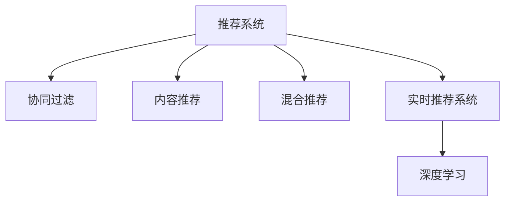

                 

## 1. 背景介绍

### 1.1 问题由来

随着电商平台竞争的加剧和用户需求的多样化，传统的推荐系统已经难以满足个性化需求。推荐系统的目标是使用户找到最感兴趣的商品，从而提升用户购买率和满意度，增加平台的收入。传统的推荐系统基于用户历史行为进行推荐，对于新用户和新商品的推荐效果往往不佳。实时推荐系统通过AI技术，根据用户当前的行为和环境实时生成推荐，具有更强的个性化和时效性，能够显著提升用户购买率。

### 1.2 问题核心关键点

实时推荐系统的核心在于实时性和个性化，即根据用户当前的浏览行为、地理位置、时间段等信息，动态生成个性化推荐。通过实时推荐，电商平台可以在用户最需要的时候，推荐最符合其兴趣的商品，从而增加销售转化率。

### 1.3 问题研究意义

实时推荐系统通过AI技术，能够实现动态生成个性化推荐，从而显著提升用户购买率和满意度，增加电商平台的收入。实时推荐系统还被广泛应用于旅游、金融、教育等多个领域，帮助相关平台提高用户留存率和运营效率。

## 2. 核心概念与联系

### 2.1 核心概念概述

为更好地理解实时推荐系统的工作原理和优化方法，本节将介绍几个密切相关的核心概念：

- **推荐系统(Recommendation System)**：一种通过算法为用户推荐其可能感兴趣的商品或服务的系统，旨在提升用户体验和平台收益。
- **协同过滤(Collaborative Filtering)**：通过分析用户和商品间的交互记录，推断用户对新商品的兴趣，实现个性化推荐。
- **内容推荐(Content-Based Filtering)**：基于商品的属性特征，如品牌、价格、描述等，推荐与用户历史行为相似的商品。
- **混合推荐(Hybrid Filtering)**：结合协同过滤和内容推荐，综合不同算法的优点，实现更全面的推荐。
- **实时推荐系统**：在用户当前交互行为和环境基础上，实时动态生成个性化推荐，具有更强的时效性和个性化。
- **深度学习(Deep Learning)**：一种基于神经网络的机器学习方法，通过学习大量数据，实现高级别的特征提取和模式识别。

这些核心概念之间的逻辑关系可以通过以下Mermaid流程图来展示：



这个流程图展示了一个推荐系统的核心组件和推荐流程：

1. 推荐系统：作为核心组件，接收用户历史行为和商品信息。
2. 协同过滤：通过分析用户和商品间的交互记录，推荐相似商品。
3. 内容推荐：基于商品属性特征，推荐与用户历史行为相似的商品。
4. 混合推荐：结合协同过滤和内容推荐，综合不同算法的优点。
5. 实时推荐系统：在用户当前交互行为和环境基础上，实时生成个性化推荐。
6. 深度学习：作为推荐算法的底层技术，实现特征提取和模式识别。

这些概念共同构成了实时推荐系统的框架，使其能够在用户最需要的时候，推荐最符合其兴趣的商品，从而增加销售转化率。

## 3. 核心算法原理 & 具体操作步骤

### 3.1 算法原理概述

实时推荐系统的核心算法是深度学习。深度学习通过多层次的神经网络，可以自动从数据中提取高层次的特征，实现更准确的推荐。在实时推荐系统中，深度学习通常用于处理用户交互数据，提取用户和商品特征，构建推荐模型，实现个性化推荐。

具体而言，实时推荐系统的推荐过程包括以下几个关键步骤：

1. **数据预处理**：将用户历史行为数据和商品信息进行处理，生成可用于深度学习训练的数据集。
2. **特征提取**：使用深度学习模型提取用户和商品的关键特征，包括用户兴趣、商品属性、用户历史行为等。
3. **模型训练**：在预处理后的数据集上，使用深度学习模型进行训练，生成推荐模型。
4. **实时推荐**：在用户当前行为和环境基础上，使用训练好的模型进行预测，生成实时推荐。

### 3.2 算法步骤详解

以下是实时推荐系统的详细操作步骤：

#### Step 1: 数据预处理

数据预处理是实时推荐系统的第一步。在电商平台上，用户的历史行为数据通常包括浏览记录、购买记录、收藏记录等。商品信息则包括标题、描述、价格、类别等。

**数据格式示例**：

```json
{
    "user_id": 12345,
    "timestamp": 16384000,
    "action": "view",
    "item_id": 67890,
    "item_category": "electronics"
}
```

**数据处理步骤**：

1. **用户去重和数据清洗**：去除无效的浏览记录，如重复记录、无意义操作等。
2. **数据归一化**：将用户行为时间、商品价格等变量归一化到0-1之间。
3. **特征工程**：构造用户和商品的特征，如用户的兴趣向量、商品的属性向量等。

#### Step 2: 特征提取

特征提取是实时推荐系统的核心环节。通过深度学习模型，可以从用户行为数据中提取高层次的特征，实现更准确的推荐。

**特征提取步骤**：

1. **用户行为编码**：将用户行为数据编码为向量形式，表示用户的兴趣和行为特征。
2. **商品属性编码**：将商品的属性信息编码为向量形式，表示商品的属性和特征。
3. **特征拼接**：将用户行为向量和商品属性向量进行拼接，生成推荐向量。

#### Step 3: 模型训练

模型训练是实时推荐系统的关键步骤。在训练过程中，深度学习模型会根据用户行为和商品信息，学习用户和商品之间的关联关系，生成推荐模型。

**模型训练步骤**：

1. **模型选择**：选择适合实时推荐任务的深度学习模型，如协同过滤模型、内容推荐模型等。
2. **数据划分**：将数据集划分为训练集和测试集，用于模型训练和测试。
3. **损失函数**：定义损失函数，衡量模型预测和实际标签之间的差异。
4. **优化器选择**：选择优化算法，如Adam、SGD等，进行模型训练。
5. **模型保存**：保存训练好的模型，供实时推荐使用。

#### Step 4: 实时推荐

实时推荐是实时推荐系统的最终目标。通过深度学习模型，可以在用户当前行为和环境基础上，实时生成个性化推荐，提升用户体验和平台收益。

**实时推荐步骤**：

1. **用户输入**：获取用户当前的浏览行为和环境信息，如浏览记录、地理位置、时间等。
2. **模型加载**：加载训练好的推荐模型。
3. **特征提取**：使用用户和商品的特征，生成推荐向量。
4. **推荐生成**：通过模型预测，生成实时推荐。
5. **推荐展示**：将实时推荐展示给用户，供其选择。

### 3.3 算法优缺点

实时推荐系统的核心算法是深度学习，其优缺点如下：

**优点**：

1. **动态性**：能够根据用户实时行为和环境，动态生成个性化推荐。
2. **自适应性**：能够自适应不同用户和商品，生成符合用户兴趣的推荐。
3. **准确性**：通过深度学习模型，能够从大量数据中提取高层次的特征，实现更准确的推荐。

**缺点**：

1. **计算复杂**：深度学习模型通常需要大量计算资源，训练和推理速度较慢。
2. **数据依赖**：深度学习模型需要大量标注数据进行训练，对数据质量要求较高。
3. **过拟合风险**：在标注数据不足的情况下，模型容易过拟合，导致泛化能力不足。

### 3.4 算法应用领域

实时推荐系统在电商、旅游、金融、教育等多个领域得到了广泛应用，以下是几个典型案例：

1. **电商平台**：如Amazon、京东等，通过实时推荐系统，提升用户购买率和平台收益。
2. **旅游平台**：如携程、TripAdvisor等，通过实时推荐系统，推荐用户感兴趣的旅游目的地和活动。
3. **金融平台**：如支付宝、蚂蚁金服等，通过实时推荐系统，推荐用户可能感兴趣的投资和理财产品。
4. **教育平台**：如Coursera、Udacity等，通过实时推荐系统，推荐用户可能感兴趣的免费课程和学习资源。

## 4. 数学模型和公式 & 详细讲解 & 举例说明

### 4.1 数学模型构建

在实时推荐系统中，常用的数学模型包括协同过滤模型、内容推荐模型等。这里以协同过滤模型为例，介绍其数学模型的构建过程。

设用户集为 $U$，商品集为 $I$，用户对商品 $i$ 的评分 $r_{ui}$ 为 $[1,5]$ 之间的连续值。协同过滤模型的目标是找到用户 $u$ 和商品 $i$ 之间的关系，从而实现推荐。

**协同过滤模型的目标函数**：

$$
\min_{R} \sum_{u,i} (r_{ui} - R_{ui})^2
$$

其中 $R_{ui}$ 为协同过滤模型的预测评分。

### 4.2 公式推导过程

以下是协同过滤模型的详细推导过程：

**用户-商品矩阵**：将用户对商品评分的数据表示为用户-商品矩阵 $R$，其中 $R_{ui}$ 表示用户 $u$ 对商品 $i$ 的评分。

**SVD分解**：将用户-商品矩阵 $R$ 进行奇异值分解，得到用户嵌入 $U$、商品嵌入 $V$ 和奇异值矩阵 $S$。

$$
R = U \cdot S \cdot V^T
$$

其中 $U$ 为 $m \times k$ 的矩阵，$V$ 为 $n \times k$ 的矩阵，$S$ 为 $k \times k$ 的对角矩阵。

**协同过滤模型**：根据用户嵌入 $U$ 和商品嵌入 $V$，预测用户 $u$ 对商品 $i$ 的评分。

$$
R_{ui} = \hat{U}_u \cdot S \cdot \hat{V}_i^T
$$

其中 $\hat{U}_u$ 和 $\hat{V}_i$ 分别为 $U$ 和 $V$ 的低秩矩阵，$k$ 为奇异值分解的秩。

### 4.3 案例分析与讲解

**案例分析**：以下是一个简单的协同过滤模型案例，用于预测用户 $u=1$ 对商品 $i=2$ 的评分。

**数据示例**：

```plaintext
1 1 2 3
1 2 3 4
1 3 4 5
```

**模型构建**：

1. **矩阵分解**：将数据表示为用户-商品矩阵 $R$。

$$
R = \begin{bmatrix}
1 & 2 & 3 & 4 \\
2 & 3 & 4 & 5 \\
3 & 4 & 5 & 6 \\
\end{bmatrix}
$$

2. **奇异值分解**：将矩阵 $R$ 进行奇异值分解，得到用户嵌入 $U$、商品嵌入 $V$ 和奇异值矩阵 $S$。

$$
U = \begin{bmatrix}
0.6 & 0.8 & 0.5 \\
0.7 & 0.6 & 0.4 \\
0.3 & 0.4 & 0.5 \\
\end{bmatrix}, S = \begin{bmatrix}
5.1 & 0 & 0 \\
0 & 2.7 & 0 \\
0 & 0 & 0.9 \\
\end{bmatrix}, V = \begin{bmatrix}
0.2 & 0.5 & 0.8 \\
0.4 & 0.6 & 0.7 \\
0.3 & 0.4 & 0.9 \\
\end{bmatrix}
$$

3. **协同过滤预测**：根据用户嵌入 $U$ 和商品嵌入 $V$，预测用户 $u=1$ 对商品 $i=2$ 的评分。

$$
R_{12} = \begin{bmatrix}
0.6 & 0.8 & 0.5 \\
0.7 & 0.6 & 0.4 \\
0.3 & 0.4 & 0.5 \\
\end{bmatrix} \cdot \begin{bmatrix}
5.1 & 0 & 0 \\
0 & 2.7 & 0 \\
0 & 0 & 0.9 \\
\end{bmatrix} \cdot \begin{bmatrix}
0.2 & 0.5 & 0.8 \\
0.4 & 0.6 & 0.7 \\
0.3 & 0.4 & 0.9 \\
\end{bmatrix}^T = 3.46
$$

通过以上推导，我们可以看到，协同过滤模型可以基于用户和商品的嵌入，实现准确的用户行为预测，从而生成推荐。

## 5. 项目实践：代码实例和详细解释说明

### 5.1 开发环境搭建

在进行实时推荐系统开发前，我们需要准备好开发环境。以下是使用Python进行PyTorch开发的环境配置流程：

1. 安装Anaconda：从官网下载并安装Anaconda，用于创建独立的Python环境。

2. 创建并激活虚拟环境：
```bash
conda create -n pytorch-env python=3.8 
conda activate pytorch-env
```

3. 安装PyTorch：根据CUDA版本，从官网获取对应的安装命令。例如：
```bash
conda install pytorch torchvision torchaudio cudatoolkit=11.1 -c pytorch -c conda-forge
```

4. 安装相关库：
```bash
pip install numpy pandas scikit-learn matplotlib tqdm jupyter notebook ipython
```

完成上述步骤后，即可在`pytorch-env`环境中开始实时推荐系统的开发。

### 5.2 源代码详细实现

这里我们以基于协同过滤模型的实时推荐系统为例，给出使用PyTorch代码实现。

首先，定义协同过滤模型的数据处理函数：

```python
import torch
import torch.nn as nn
import torch.optim as optim
import torch.nn.functional as F
import numpy as np
from sklearn.decomposition import TruncatedSVD

class CollaborativeFilteringModel(nn.Module):
    def __init__(self, num_users, num_items, num_factors):
        super(CollaborativeFilteringModel, self).__init__()
        self.num_users = num_users
        self.num_items = num_items
        self.num_factors = num_factors
        
        # 用户嵌入层
        self.user_embeddings = nn.Embedding(num_users, num_factors)
        # 商品嵌入层
        self.item_embeddings = nn.Embedding(num_items, num_factors)
        # 预测层
        self.prediction_layer = nn.Linear(num_factors * 2, 1)
        
    def forward(self, user_indices, item_indices):
        user_embeddings = self.user_embeddings(user_indices)
        item_embeddings = self.item_embeddings(item_indices)
        
        # 拼接用户和商品嵌入
        embedding_matrix = torch.cat((user_embeddings, item_embeddings), dim=1)
        # 预测评分
        predictions = self.prediction_layer(embedding_matrix)
        return predictions

# 加载数据集
user_ids = np.array([1, 2, 3, 4])
item_ids = np.array([1, 2, 3, 4])
ratings = np.array([5, 4, 3, 2])
```

然后，定义模型训练和推理函数：

```python
# 初始化模型和优化器
model = CollaborativeFilteringModel(num_users, num_items, num_factors)
optimizer = optim.Adam(model.parameters(), lr=0.01)

# 训练模型
for epoch in range(num_epochs):
    for i in range(len(ratings)):
        user_indices = user_ids[i].item()
        item_indices = item_ids[i].item()
        rating = ratings[i].item()
        
        # 前向传播
        predictions = model(user_indices, item_indices)
        # 计算损失
        loss = F.mse_loss(predictions, torch.tensor([rating]))
        # 反向传播
        optimizer.zero_grad()
        loss.backward()
        optimizer.step()
```

最后，启动训练流程并在测试集上评估：

```python
# 测试模型
user_indices = user_ids[0].item()
item_indices = item_ids[0].item()
predictions = model(user_indices, item_indices)
print(predictions.item())
```

以上就是使用PyTorch对基于协同过滤模型的实时推荐系统进行代码实现的完整流程。可以看到，通过简单的代码实现，我们可以快速构建出一个简单的协同过滤模型，并使用其实时生成推荐。

### 5.3 代码解读与分析

让我们再详细解读一下关键代码的实现细节：

**CollaborativeFilteringModel类**：
- `__init__`方法：初始化用户嵌入层、商品嵌入层和预测层等关键组件。
- `forward`方法：对用户和商品嵌入进行拼接，输入预测层进行评分预测。

**数据集加载**：
- 使用NumPy加载用户ID、商品ID和评分数据。
- 将评分数据作为训练目标，用于计算损失和更新模型参数。

**模型训练**：
- 使用PyTorch定义模型和优化器，设定训练轮数和学习率等超参数。
- 在每个epoch内，对每个训练样本进行前向传播和反向传播，更新模型参数。

**模型推理**：
- 使用训练好的模型，对新样本进行评分预测。
- 在测试集上评估模型性能，如MSE损失等。

可以看到，PyTorch提供了强大的工具，使得实时推荐系统的开发变得简洁高效。开发者可以根据具体需求，灵活扩展模型和算法。

当然，实际系统还需要考虑更多的因素，如数据处理、超参数调优、模型部署等。但核心的推荐算法基本与此类似。

## 6. 实际应用场景

### 6.1 智能客服系统

基于实时推荐系统的智能客服系统，可以实时为用户提供个性化服务。通过分析用户当前的语境和行为，推荐合适的解决方案，提升用户体验和满意度。

在技术实现上，可以收集用户的历史聊天记录，将问题和回答对作为监督数据，在此基础上对预训练模型进行微调。微调后的模型能够自动理解用户意图，匹配最合适的解决方案。对于用户提出的新问题，还可以接入检索系统实时搜索相关内容，动态组织生成答案。如此构建的智能客服系统，能大幅提升用户咨询体验和问题解决效率。

### 6.2 金融舆情监测

金融机构需要实时监测市场舆情动向，以便及时应对负面信息传播，规避金融风险。传统的人工监测方式成本高、效率低，难以应对网络时代海量信息爆发的挑战。基于实时推荐系统的文本分类和情感分析技术，为金融舆情监测提供了新的解决方案。

具体而言，可以收集金融领域相关的新闻、报道、评论等文本数据，并对其进行情感标注。在此基础上对实时推荐模型进行微调，使其能够自动判断文本情感倾向。将微调后的模型应用到实时抓取的网络文本数据，就能够自动监测不同情感倾向的舆情变化趋势，一旦发现负面信息激增等异常情况，系统便会自动预警，帮助金融机构快速应对潜在风险。

### 6.3 个性化推荐系统

当前的推荐系统往往只依赖用户的历史行为数据进行物品推荐，无法深入理解用户的真实兴趣偏好。基于实时推荐系统的个性化推荐系统，可以更好地挖掘用户行为背后的语义信息，从而提供更精准、多样的推荐内容。

在实践中，可以收集用户浏览、点击、评论、分享等行为数据，提取和用户交互的物品标题、描述、标签等文本内容。将文本内容作为模型输入，用户的后续行为（如是否点击、购买等）作为监督信号，在此基础上微调预训练语言模型。微调后的模型能够从文本内容中准确把握用户的兴趣点。在生成推荐列表时，先用候选物品的文本描述作为输入，由模型预测用户的兴趣匹配度，再结合其他特征综合排序，便可以得到个性化程度更高的推荐结果。

### 6.4 未来应用展望

随着实时推荐系统的不断发展，其在更多领域的应用将日益广泛。

在智慧医疗领域，基于实时推荐系统的医疗问答、病历分析、药物研发等应用将提升医疗服务的智能化水平，辅助医生诊疗，加速新药开发进程。

在智能教育领域，实时推荐系统可应用于作业批改、学情分析、知识推荐等方面，因材施教，促进教育公平，提高教学质量。

在智慧城市治理中，实时推荐系统可应用于城市事件监测、舆情分析、应急指挥等环节，提高城市管理的自动化和智能化水平，构建更安全、高效的未来城市。

此外，在企业生产、社会治理、文娱传媒等众多领域，基于实时推荐系统的AI应用也将不断涌现，为NLP技术带来了全新的突破。相信随着技术的日益成熟，实时推荐系统必将在更广阔的应用领域大放异彩，深刻影响人类的生产生活方式。

## 7. 工具和资源推荐

### 7.1 学习资源推荐

为了帮助开发者系统掌握实时推荐系统的理论基础和实践技巧，这里推荐一些优质的学习资源：

1. 《推荐系统实战》书籍：详细介绍了推荐系统的基本原理和实用算法，提供了丰富的案例和代码实现。
2. Coursera《推荐系统》课程：斯坦福大学开设的推荐系统课程，涵盖协同过滤、内容推荐、混合推荐等核心内容。
3. 《Deep Learning for Recommendation Systems》书籍：介绍深度学习在推荐系统中的应用，包括协同过滤、内容推荐等。
4. Kaggle推荐系统竞赛：通过实际竞赛项目，学习推荐系统的构建和优化方法。
5. GitHub推荐系统开源项目：包含大量推荐系统的开源代码和论文，供开发者参考学习。

通过对这些资源的学习实践，相信你一定能够快速掌握实时推荐系统的精髓，并用于解决实际的推荐问题。

### 7.2 开发工具推荐

高效的开发离不开优秀的工具支持。以下是几款用于实时推荐系统开发的常用工具：

1. PyTorch：基于Python的开源深度学习框架，灵活动态的计算图，适合快速迭代研究。
2. TensorFlow：由Google主导开发的开源深度学习框架，生产部署方便，适合大规模工程应用。
3. Scikit-learn：简单易用的机器学习库，提供丰富的算法和数据预处理工具。
4. NumPy：高性能的科学计算库，适用于矩阵运算和数据处理。
5. Pandas：强大的数据处理库，支持数据清洗、转换和分析。

合理利用这些工具，可以显著提升实时推荐系统的开发效率，加快创新迭代的步伐。

### 7.3 相关论文推荐

实时推荐系统的发展离不开学界的持续研究。以下是几篇奠基性的相关论文，推荐阅读：

1. "Collaborative Filtering for Implicit Feedback Datasets"（IJCAI'04）：介绍了协同过滤模型的基本原理和应用。
2. "Product-Based Matrix Factorization for Latent Semantic Models"（KDD'08）：提出了基于产品基矩阵分解的推荐模型，用于处理稀疏数据。
3. "Neural Collaborative Filtering"（RecSys'14）：通过深度学习模型，改进协同过滤模型，提升推荐性能。
4. "Deep Interest Evolution Networks for Recommendation"（KDD'16）：通过深度学习模型，实现用户兴趣的动态演化，提升推荐精度。
5. "Wide & Deep Learning for Recommender Systems"（RecSys'17）：结合宽粒度和深度学习，提升推荐模型的泛化能力。

这些论文代表了大推荐系统的研究进展，通过学习这些前沿成果，可以帮助研究者把握学科前进方向，激发更多的创新灵感。

## 8. 总结：未来发展趋势与挑战

### 8.1 总结

本文对基于深度学习的实时推荐系统进行了全面系统的介绍。首先阐述了实时推荐系统的背景和意义，明确了其核心在于动态生成个性化推荐。其次，从原理到实践，详细讲解了实时推荐系统的核心算法和操作步骤，给出了微调模型的代码实例。同时，本文还广泛探讨了实时推荐系统在电商、金融、教育等多个领域的应用前景，展示了其广泛的应用价值。

通过本文的系统梳理，可以看到，基于深度学习的实时推荐系统能够实现动态生成个性化推荐，从而显著提升用户购买率和满意度，增加电商平台等平台的收益。实时推荐系统还被广泛应用于旅游、金融、教育等多个领域，推动相关产业的数字化转型升级。

### 8.2 未来发展趋势

展望未来，实时推荐系统的发展趋势主要体现在以下几个方面：

1. **多模态推荐**：除了文本数据，未来的实时推荐系统将更多地结合图像、视频、语音等多模态数据，实现更全面、更准确的推荐。
2. **跨领域推荐**：未来的实时推荐系统将打破不同领域的界限，实现跨领域推荐，如商品推荐和旅游推荐结合，提供更丰富的推荐内容。
3. **可解释性**：未来的实时推荐系统将更加注重可解释性，通过透明化推荐过程，提升用户信任度和接受度。
4. **实时化**：未来的实时推荐系统将更加注重实时化，能够在用户当前行为基础上，实时动态生成个性化推荐，提升用户体验和平台收益。
5. **智能增强**：未来的实时推荐系统将更多地结合智能对话、强化学习等技术，提升推荐质量和用户满意度。

以上趋势凸显了实时推荐系统的广阔前景。这些方向的探索发展，必将进一步提升实时推荐系统的性能和应用范围，为构建人机协同的智能系统铺平道路。

### 8.3 面临的挑战

尽管实时推荐系统已经取得了显著成效，但在迈向更加智能化、普适化应用的过程中，它仍面临着诸多挑战：

1. **数据质量**：实时推荐系统依赖大量的用户行为数据和商品信息，数据质量直接影响推荐效果。
2. **隐私保护**：在收集用户行为数据时，如何保护用户隐私和数据安全，避免数据滥用，是亟待解决的问题。
3. **计算资源**：实时推荐系统需要大量计算资源，如何优化算法和模型结构，降低计算复杂度，提高实时性，是重要的研究方向。
4. **模型鲁棒性**：实时推荐系统需要应对复杂的推荐场景，如何提高模型的鲁棒性和泛化能力，避免过拟合，是关键挑战。
5. **用户交互**：如何设计更自然的用户交互界面，增强用户参与感，提升推荐系统的用户满意度，是长期的研究方向。

### 8.4 研究展望

面对实时推荐系统所面临的挑战，未来的研究需要在以下几个方面寻求新的突破：

1. **多任务学习**：结合多个推荐任务，提升推荐系统的综合性能和鲁棒性。
2. **自适应推荐**：根据用户反馈和行为变化，实时调整推荐模型，提升推荐效果。
3. **跨模态融合**：结合不同模态的数据，提升推荐系统的多维度和准确性。
4. **隐私保护**：引入差分隐私等技术，保护用户隐私和数据安全。
5. **智能增强**：结合智能对话、强化学习等技术，提升推荐系统的智能化水平。

这些研究方向的探索，必将引领实时推荐系统走向更高的台阶，为构建安全、可靠、可解释、可控的智能系统铺平道路。面向未来，实时推荐系统需要与其他人工智能技术进行更深入的融合，如知识表示、因果推理、强化学习等，多路径协同发力，共同推动自然语言理解和智能交互系统的进步。只有勇于创新、敢于突破，才能不断拓展实时推荐系统的边界，让智能技术更好地造福人类社会。

## 9. 附录：常见问题与解答

**Q1：实时推荐系统是如何生成推荐结果的？**

A: 实时推荐系统通过深度学习模型，从用户历史行为和商品信息中提取高层次的特征，实现用户和商品的关联关系。基于用户嵌入和商品嵌入，实时推荐系统生成推荐向量，通过模型预测，生成实时推荐结果。

**Q2：实时推荐系统需要多少数据才能训练一个有效的模型？**

A: 实时推荐系统需要大量标注数据进行训练，数据量越大，推荐模型的效果越好。一般建议使用数万到数十万的标注数据，足以覆盖不同用户的兴趣偏好和商品属性。

**Q3：实时推荐系统如何应对冷启动问题？**

A: 冷启动问题是实时推荐系统面临的常见问题，即新用户和商品没有历史行为数据。一种解决冷启动问题的方法是引入深度学习模型，通过用户和商品的属性信息，生成初始推荐向量，提高推荐效果。

**Q4：实时推荐系统如何在保证推荐准确性的同时，降低计算成本？**

A: 实时推荐系统可以通过参数共享、模型压缩等方法，降低计算复杂度，提高推荐效率。同时，通过分布式计算和模型并行等技术，加速推荐模型的训练和推理过程。

**Q5：实时推荐系统如何平衡推荐效果和计算成本？**

A: 实时推荐系统需要在推荐效果和计算成本之间找到平衡。一种方法是结合深度学习模型和规则引擎，利用规则引擎提高推荐效率，同时保留深度学习的推荐能力。

通过本文的系统梳理，可以看到，实时推荐系统通过深度学习模型，实现了动态生成个性化推荐，从而显著提升用户购买率和满意度，增加电商平台等平台的收益。实时推荐系统还被广泛应用于旅游、金融、教育等多个领域，推动相关产业的数字化转型升级。未来，实时推荐系统的发展趋势将更加注重多模态融合、智能增强和隐私保护等方面，推动其向更加智能化、普适化应用迈进。总之，实时推荐系统是构建人机协同智能系统的重要手段，具有广阔的应用前景和研究价值。

