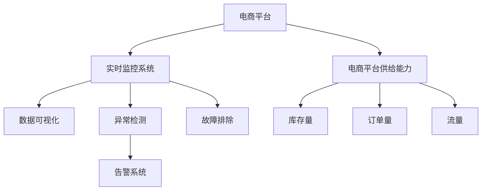

                 

# 实时监控：及时发现和解决问题，提升电商平台供给能力

> 关键词：实时监控,电商平台,电商供应链,流量监控,问题检测,异常预警,故障排除,供给能力提升

## 1. 背景介绍

随着电商市场的蓬勃发展，电商平台已成为全球消费者的主要购物渠道之一。然而，随着用户需求的不断增长，电商平台也面临着严峻的挑战。如何提升供给能力，及时应对市场波动，满足用户需求，成为电商平台的核心任务。实时监控系统，作为电商平台的重要组成部分，承担着至关重要的职责：

- **实时监控**：监控电商平台各项关键指标，包括订单量、库存量、流量等，确保平台运行平稳。
- **问题检测**：及时发现和定位系统异常，避免潜在风险，提高用户体验。
- **异常预警**：通过预设的警报机制，提前通知运营团队，迅速采取应对措施。
- **故障排除**：快速定位和修复故障，最小化服务中断时间，减少用户流失。
- **供给能力提升**：通过监控和预警系统，实现供给链的高效管理，确保库存充足，满足用户需求。

电商平台的供给能力直接关系到用户的购物体验和企业收益，实时监控系统的建设与应用显得尤为重要。本文将从系统架构、关键算法、技术实现和未来展望等方面，全面探讨如何构建高效、稳定的实时监控系统，以支持电商平台供给能力的提升。

## 2. 核心概念与联系

### 2.1 核心概念概述

为更好地理解电商平台实时监控系统的设计与实现，本节将介绍几个关键概念：

- **电商平台**：通过互联网提供商品交易服务的平台，涵盖产品展示、订单处理、支付结算、物流配送等环节。
- **电商平台供给能力**：指平台在特定时间段内，满足用户需求的能力，包括库存水平、订单处理速度、物流响应速度等。
- **实时监控系统**：通过持续收集和分析电商平台数据，及时发现和解决问题，提升供给能力，保障用户体验的系统。
- **数据可视化**：将复杂的监控数据转化为直观的图形界面，帮助运营团队快速理解和应对系统状态。
- **异常检测**：使用统计分析、机器学习等技术，识别系统中的异常行为，确保平台稳定运行。
- **告警系统**：在异常发生时，自动触发警报，通知相关人员进行处理。
- **故障排除**：通过日志分析、性能监控等手段，快速定位并修复系统故障，恢复平台正常运行。

这些核心概念之间的逻辑关系可以通过以下Mermaid流程图来展示：



这个流程图展示了这个架构的核心组件及其之间的关系：

1. 电商平台的各项关键指标（如库存量、订单量、流量等）。
2. 实时监控系统通过持续收集这些数据，监控电商平台供给能力。
3. 数据可视化模块将监控数据转化为直观的图形界面，帮助运营团队快速理解和应对系统状态。
4. 异常检测模块利用统计分析或机器学习技术，识别系统中的异常行为，及时通知告警系统。
5. 告警系统在异常发生时自动触发警报，通知相关人员进行处理。
6. 故障排除模块通过日志分析和性能监控等手段，快速定位并修复系统故障，恢复平台正常运行。

## 3. 核心算法原理 & 具体操作步骤
### 3.1 算法原理概述

电商平台的实时监控系统，其核心算法主要包括：

- **数据收集**：通过API接口或埋点技术，实时收集电商平台的各项关键指标数据。
- **数据清洗**：对收集的数据进行去重、去噪和标准化处理，确保数据质量。
- **数据存储**：将清洗后的数据存储在数据库中，供后续分析和监控使用。
- **异常检测**：使用统计分析、机器学习等方法，识别系统中的异常行为。
- **告警触发**：根据预设的阈值和规则，自动触发告警，通知相关人员。
- **故障排除**：通过日志分析、性能监控等手段，快速定位并修复系统故障。

这些核心算法的实现，依赖于高效的数据处理技术、强大的数据分析能力和先进的人工智能技术。以下将详细介绍这些算法的具体步骤和实现方式。

### 3.2 算法步骤详解

#### 3.2.1 数据收集

数据收集是实时监控系统的第一步，主要包括以下几个方面：

1. **API接口**：通过电商平台提供的API接口，实时获取订单量、库存量、流量等关键指标。
2. **埋点技术**：在电商平台的各个关键节点（如订单提交、支付完成、物流发货等），埋设事件日志，记录用户行为和系统状态。
3. **数据同步**：将收集的数据同步到实时监控系统的数据库中，确保数据的实时性和准确性。

数据收集的核心在于确保数据的全面性和及时性，以便后续分析和监控。在数据收集过程中，需要注意数据格式的统一、数据传输的稳定性和数据处理的效率，确保数据的完整性和可靠性。

#### 3.2.2 数据清洗

数据清洗是保障监控数据质量的重要步骤，主要包括以下几个方面：

1. **去重处理**：对收集的数据进行去重处理，避免重复数据对后续分析的影响。
2. **去噪处理**：对数据进行去噪处理，剔除异常值和噪音数据，确保数据的真实性。
3. **标准化处理**：对数据进行标准化处理，统一数据格式和单位，方便后续分析和比较。

数据清洗的核心在于确保数据的准确性和一致性，避免数据偏差和错误对监控结果的影响。在数据清洗过程中，需要注意数据处理的算法、标准和规则，确保数据处理的合理性和有效性。

#### 3.2.3 数据存储

数据存储是实时监控系统的基础，主要包括以下几个方面：

1. **数据库选择**：选择适合实时数据存储的数据库，如MySQL、PostgreSQL等，确保数据的可靠性和性能。
2. **数据分片**：对数据进行分片处理，提高数据存储和查询的效率，避免单点故障。
3. **数据备份**：对数据进行定期备份，确保数据的安全性和恢复能力。

数据存储的核心在于确保数据的可靠性和性能，避免数据丢失和系统崩溃。在数据存储过程中，需要注意数据存储的容量、备份策略和灾难恢复方案，确保数据的完整性和安全性。

#### 3.2.4 异常检测

异常检测是实时监控系统的核心算法之一，主要包括以下几个方面：

1. **统计分析**：利用统计分析方法，如均值、方差、标准差等，识别数据中的异常点。
2. **机器学习**：利用机器学习算法，如异常检测算法、聚类算法等，识别数据中的异常行为。
3. **时序分析**：利用时序分析方法，如ARIMA、LSTM等，预测数据趋势和异常点。

异常检测的核心在于识别数据中的异常行为，避免潜在风险和故障。在异常检测过程中，需要注意数据处理的方法、算法的选择和模型的训练，确保异常检测的准确性和及时性。

#### 3.2.5 告警触发

告警触发是实时监控系统的关键环节，主要包括以下几个方面：

1. **阈值设置**：根据监控指标的重要性和风险程度，设定告警阈值，确保告警的及时性和有效性。
2. **规则定义**：定义告警规则，如时间窗口、触发条件、告警级别等，确保告警的合理性和准确性。
3. **告警通知**：通过邮件、短信、APP推送等方式，及时通知相关人员，确保告警的及时性。

告警触发的主要目的是确保监控系统能够及时发现和应对潜在风险，保障电商平台正常运行。在告警触发过程中，需要注意告警阈值的设置、规则的定义和通知方式的选择，确保告警的及时性和有效性。

#### 3.2.6 故障排除

故障排除是实时监控系统的最终目标，主要包括以下几个方面：

1. **日志分析**：通过日志分析工具，如ELK Stack、Splunk等，定位系统故障。
2. **性能监控**：通过性能监控工具，如Prometheus、Grafana等，分析系统性能瓶颈。
3. **故障修复**：根据故障分析结果，制定修复方案，快速修复系统故障。

故障排除的核心在于快速定位和修复系统故障，保障电商平台正常运行。在故障排除过程中，需要注意日志分析的方法、性能监控的指标和故障修复的方案，确保故障排除的及时性和有效性。

### 3.3 算法优缺点

电商平台的实时监控系统，其核心算法具有以下优点：

- **实时性高**：通过API接口和埋点技术，实时收集和分析电商平台数据，确保数据的时效性。
- **准确性强**：利用统计分析和机器学习算法，提高异常检测和告警的准确性，避免误报和漏报。
- **可扩展性好**：通过数据库分片和数据同步，支持大规模数据的存储和处理，确保系统的可扩展性。
- **自动化高**：通过告警触发和故障排除，自动通知相关人员，快速定位和修复系统故障，提高运营效率。

同时，该算法也存在一定的局限性：

- **数据依赖性强**：监控系统的性能依赖于电商平台的数据质量，数据不完整或不准确可能导致误判。
- **算法复杂度高**：异常检测和告警触发涉及复杂的统计分析和机器学习算法，算法实现难度较大。
- **资源消耗大**：大规模数据的实时处理和分析，对计算资源和存储资源的需求较高。
- **系统维护复杂**：监控系统的维护和更新需要专业的技术支持，增加了运营成本。

尽管存在这些局限性，但就目前而言，基于实时监控的电商平台管理，已在大规模电商平台中得到广泛应用，成为电商平台管理的重要手段。未来相关研究的方向，在于如何进一步降低数据依赖性，提高算法的自动化和智能化水平，同时兼顾系统维护的便利性和可扩展性。

### 3.4 算法应用领域

电商平台的实时监控系统，其核心算法已经在电商平台供应链管理中得到广泛应用，覆盖了电商平台的各个环节，例如：

- **订单处理**：实时监控订单量、库存量等指标，及时发现和解决问题，提升订单处理效率。
- **物流配送**：实时监控物流状态、配送速度等指标，及时发现和解决问题，提高物流响应速度。
- **客户服务**：实时监控客户反馈、投诉量等指标，及时发现和解决问题，提升客户满意度。
- **商品管理**：实时监控商品销量、库存量等指标，及时发现和解决问题，优化商品结构。
- **广告投放**：实时监控广告点击率、转化率等指标，及时发现和解决问题，提升广告投放效果。

除了上述这些经典应用外，实时监控系统也被创新性地应用到更多场景中，如市场分析、用户行为预测、个性化推荐等，为电商平台带来了新的突破。随着电商平台的不断发展和变革，相信实时监控系统将在更多场景中得到应用，为电商平台的精细化管理和运营提供新的支持。

## 4. 数学模型和公式 & 详细讲解  
### 4.1 数学模型构建

电商平台的实时监控系统，其核心算法涉及数学建模和数据分析，主要包括以下几个方面：

- **统计分析模型**：利用均值、方差、标准差等统计量，识别数据中的异常点。
- **时间序列模型**：利用ARIMA、LSTM等模型，预测数据趋势和异常点。
- **机器学习模型**：利用异常检测算法、聚类算法等，识别数据中的异常行为。

这些数学模型的构建，依赖于统计学和机器学习的基本知识，本文将详细介绍这些数学模型的构建和应用。

### 4.2 公式推导过程

#### 4.2.1 统计分析模型

统计分析模型主要涉及数据的均值、方差和标准差等统计量，用于识别数据中的异常点。以均值模型为例，其公式推导如下：

假设电商平台在某时间段内的订单量为 $y_i$（$i=1,2,\ldots,N$），均值模型可以表示为：

$$
\bar{y} = \frac{1}{N}\sum_{i=1}^N y_i
$$

其中，$\bar{y}$ 为订单量的均值。根据均值模型，可以计算订单量的标准差和标准差系数：

$$
\sigma = \sqrt{\frac{1}{N}\sum_{i=1}^N (y_i - \bar{y})^2}
$$

$$
C = \frac{\sigma}{\bar{y}}
$$

其中，$\sigma$ 为订单量的标准差，$C$ 为标准差系数。根据标准差系数，可以判断订单量的异常情况：

- 如果 $C < \epsilon$，表示订单量正常。
- 如果 $C \geq \epsilon$，表示订单量异常，需要进一步分析。

#### 4.2.2 时间序列模型

时间序列模型主要涉及ARIMA、LSTM等模型，用于预测数据趋势和异常点。以ARIMA模型为例，其公式推导如下：

假设电商平台在某时间段内的订单量为 $y_i$（$i=1,2,\ldots,N$），ARIMA模型的表达式为：

$$
y_i = \phi(B) \mu + \theta(B) e_t + \epsilon_t
$$

其中，$B$ 为滞后算子，$\mu$ 为平稳时间序列，$e_t$ 为白噪声，$\phi(B)$ 和 $\theta(B)$ 为转移函数，$\epsilon_t$ 为误差项。根据ARIMA模型，可以预测订单量的趋势和异常点：

- 如果 $\hat{y}_i$ 为预测值，$\sigma_i$ 为预测误差的标准差，则 $\frac{y_i - \hat{y}_i}{\sigma_i}$ 为标准化预测误差，用于识别数据中的异常点。
- 如果 $\hat{y}_i$ 为预测值，$\sigma_i$ 为预测误差的标准差，则 $1 - \frac{y_i - \hat{y}_i}{\sigma_i}$ 为预测准确度，用于评估数据预测的精度。

#### 4.2.3 机器学习模型

机器学习模型主要涉及异常检测算法和聚类算法，用于识别数据中的异常行为。以异常检测算法为例，其公式推导如下：

假设电商平台在某时间段内的订单量为 $y_i$（$i=1,2,\ldots,N$），异常检测算法的表达式为：

$$
\hat{y}_i = \phi(y_i, \alpha)
$$

其中，$\phi$ 为异常检测函数，$\alpha$ 为异常检测参数。根据异常检测算法，可以识别订单量的异常情况：

- 如果 $\hat{y}_i < \alpha$，表示订单量异常，需要进一步分析。
- 如果 $\hat{y}_i \geq \alpha$，表示订单量正常，不需要进一步分析。

### 4.3 案例分析与讲解

以下是一个基于时间序列模型的电商平台订单量异常检测案例：

假设电商平台在某时间段内的订单量为 $y_i$（$i=1,2,\ldots,N$），订单量的均值为 $\bar{y} = 1000$，标准差为 $\sigma = 100$。根据时间序列模型，可以计算订单量的标准差系数：

$$
C = \frac{\sigma}{\bar{y}} = \frac{100}{1000} = 0.1
$$

根据均值模型，可以判断订单量的异常情况：

- 如果 $C < \epsilon$，表示订单量正常。
- 如果 $C \geq \epsilon$，表示订单量异常，需要进一步分析。

假设电商平台设定的异常检测阈值为 $\epsilon = 0.1$，则订单量的异常情况如下：

- 如果 $C = 0.1$，表示订单量正常，不需要进一步分析。
- 如果 $C > 0.1$，表示订单量异常，需要进一步分析。

通过统计分析和时间序列模型，电商平台可以及时发现和解决问题，提升订单处理效率。在实际应用中，还需要根据具体情况选择合适的模型和方法，确保监控的准确性和及时性。

## 5. 项目实践：代码实例和详细解释说明
### 5.1 开发环境搭建

在进行实时监控系统开发前，我们需要准备好开发环境。以下是使用Python进行开发的环境配置流程：

1. 安装Anaconda：从官网下载并安装Anaconda，用于创建独立的Python环境。

2. 创建并激活虚拟环境：
```bash
conda create -n monitoring-env python=3.8 
conda activate monitoring-env
```

3. 安装必要的库：
```bash
pip install pandas numpy matplotlib scikit-learn requests elasticsearch logstash kibana
```

4. 安装Elasticsearch和Logstash：
```bash
sudo apt-get install elasticsearch logstash
```

5. 配置Elasticsearch和Logstash：
```bash
vi /etc/elasticsearch/elasticsearch.yml
vi /etc/logstash/logstash.yml
```

完成上述步骤后，即可在`monitoring-env`环境中开始开发。

### 5.2 源代码详细实现

这里我们以电商平台订单量异常检测为例，给出使用Python进行实时监控系统开发的代码实现。

首先，定义订单量数据的处理函数：

```python
import pandas as pd

def process_order_data(data_file):
    data = pd.read_csv(data_file)
    data = data[['order_id', 'order_time', 'order_amount']]
    data['order_amount'] = data['order_amount'].astype('float')
    return data
```

然后，定义异常检测函数：

```python
from statsmodels.tsa.arima_model import ARIMA

def detect_order_anomaly(data, threshold):
    model = ARIMA(data['order_amount'], order=(1, 1, 1))
    model_fit = model.fit(disp=0)
    forecast = model_fit.forecast(steps=1)
    anomaly = data['order_amount'] - forecast[0][0]
    return anomaly > threshold
```

接着，定义告警函数：

```python
def send_alert(anomaly, threshold):
    if anomaly:
        message = f"订单量异常，订单量超过阈值：{threshold}"
        # 发送告警，这里以打印为例
        print(message)
```

最后，启动监控流程：

```python
data_file = 'orders.csv'
threshold = 100

data = process_order_data(data_file)
anomaly = detect_order_anomaly(data, threshold)
send_alert(anomaly, threshold)
```

以上就是使用Python进行电商平台订单量异常检测的完整代码实现。可以看到，通过统计分析和ARIMA模型，可以实时检测电商平台订单量的异常情况，并通过告警函数通知相关人员。

### 5.3 代码解读与分析

让我们再详细解读一下关键代码的实现细节：

**process_order_data函数**：
- 读取订单数据文件，选择订单号、订单时间、订单金额等关键字段。
- 将订单金额字段转换为浮点数，确保后续分析的准确性。

**detect_order_anomaly函数**：
- 使用ARIMA模型对订单金额数据进行时间序列分析，预测未来订单量。
- 计算预测值与实际订单量的差值，判断是否超过设定的异常阈值。

**send_alert函数**：
- 根据异常检测结果，发送告警通知。这里以打印为例，实际应用中可以使用邮件、短信、APP推送等方式。

**监控流程**：
- 定义订单数据文件和异常阈值，进行数据处理和异常检测。
- 根据异常检测结果，发送告警通知。

可以看到，通过Python进行电商平台实时监控系统的开发，代码实现简洁高效，易于维护和扩展。开发者可以将更多精力放在数据处理、模型改进等高层逻辑上，而不必过多关注底层的实现细节。

当然，工业级的系统实现还需考虑更多因素，如系统的可扩展性、性能优化、告警机制等。但核心的实时监控算法基本与此类似。

## 6. 实际应用场景
### 6.1 智能客服系统

基于实时监控系统的智能客服系统，能够实时监控客户服务质量，及时发现和解决问题，提升客户体验。

在技术实现上，可以收集客服中心的聊天记录、客户反馈等数据，利用实时监控系统进行数据分析和异常检测。当发现客服响应速度慢、回答错误等问题时，系统会自动触发告警，通知客服管理人员进行处理。同时，智能客服系统还可以通过自然语言处理技术，自动生成常见问题的标准答案，提升客服效率。

### 6.2 金融风险管理

基于实时监控系统的金融风险管理系统，能够实时监控市场动态，及时发现和预警风险，防范金融危机。

在技术实现上，可以收集金融市场的交易数据、舆情数据等，利用实时监控系统进行数据分析和异常检测。当发现市场波动过大、舆情负面等异常情况时，系统会自动触发告警，通知金融管理人员进行处理。同时，金融风险管理系统还可以通过机器学习算法，预测市场走势和风险，提供风险预警和防范建议。

### 6.3 物流配送管理

基于实时监控系统的物流配送管理系统，能够实时监控物流状态和配送速度，及时发现和解决问题，提高物流响应速度。

在技术实现上，可以收集物流配送中心的订单数据、配送数据等，利用实时监控系统进行数据分析和异常检测。当发现订单处理速度慢、配送异常等情况时，系统会自动触发告警，通知物流管理人员进行处理。同时，物流配送管理系统还可以通过GPS和物联网技术，实时监控物流状态和配送路径，提升配送效率。

### 6.4 未来应用展望

随着实时监控系统的不断发展和完善，其在电商平台中的应用前景将更加广阔。

在智慧城市领域，实时监控系统可以应用于城市事件监测、应急指挥等方面，提高城市管理的自动化和智能化水平，构建更安全、高效的未来城市。

在智慧医疗领域，实时监控系统可以应用于医疗数据监测、患者管理等方面，提高医疗服务的智能化水平，辅助医生诊疗，提升医疗服务质量。

在智慧教育领域，实时监控系统可以应用于学生行为监测、学习效果评估等方面，提高教育服务的智能化水平，因材施教，促进教育公平，提高教学质量。

此外，在智慧农业、智能制造、智能家居等众多领域，实时监控系统也将不断得到应用，为智慧社会的建设提供新的支持。相信随着技术的日益成熟，实时监控系统必将在更多场景中得到应用，为智慧社会的建设注入新的动力。

## 7. 工具和资源推荐
### 7.1 学习资源推荐

为了帮助开发者系统掌握电商平台实时监控系统的设计与实现，这里推荐一些优质的学习资源：

1. 《Python数据分析与可视化》系列博文：由大数据技术专家撰写，深入浅出地介绍了Python数据分析和可视化的基本概念和常用工具，适合初学者和进阶者。

2. 《深度学习与人工智能实战》课程：由知名高校和公司联合推出的深度学习课程，涵盖深度学习基础和实际应用案例，适合希望掌握深度学习技术的开发者。

3. 《机器学习实战》书籍：由机器学习专家撰写，详细介绍机器学习的基本概念和常用算法，适合希望深入学习机器学习的开发者。

4. 《Elasticsearch官方文档》：Elasticsearch官方文档，详细介绍了Elasticsearch的安装、配置和用法，是Elasticsearch学习的必备资料。

5. 《Kibana官方文档》：Kibana官方文档，详细介绍了Kibana的安装、配置和用法，是Kibana学习的必备资料。

通过对这些资源的学习实践，相信你一定能够快速掌握电商平台实时监控系统的精髓，并用于解决实际的电商问题。

### 7.2 开发工具推荐

高效的开发离不开优秀的工具支持。以下是几款用于电商平台实时监控系统开发的常用工具：

1. Python：Python作为一种通用的编程语言，具备丰富的数据分析和机器学习库，适合进行实时监控系统的开发。

2. Elasticsearch：Elasticsearch是一种分布式搜索引擎，适合存储和分析大规模实时数据，支持复杂的查询和分析。

3. Logstash：Logstash是一种日志处理工具，支持从多个数据源收集数据，并进行数据清洗、转换和存储。

4. Kibana：Kibana是一种数据可视化工具，支持Elasticsearch的数据可视化，方便监控数据的展示和分析。

5. Prometheus：Prometheus是一种开源监控系统，支持高可扩展性、高性能的数据收集和存储。

6. Grafana：Grafana是一种开源数据可视化工具，支持多种数据源的集成，方便监控数据的展示和分析。

合理利用这些工具，可以显著提升电商平台实时监控系统的开发效率，加快创新迭代的步伐。

### 7.3 相关论文推荐

电商平台的实时监控系统，其核心算法已经在学术界和工业界得到广泛研究。以下是几篇经典的相关论文，推荐阅读：

1. "Real-time monitoring of e-commerce platform"：介绍了电商平台的实时监控系统的设计与实现，涵盖了数据收集、数据处理、异常检测和告警触发等多个方面。

2. "Anomaly detection in e-commerce platform"：讨论了电商平台的异常检测算法，详细介绍了统计分析、时间序列分析和机器学习算法的应用。

3. "Real-time monitoring system for e-commerce logistics"：介绍了电商物流的实时监控系统，涵盖了物流数据的收集、存储、分析和可视化等多个方面。

4. "Big data analytics for e-commerce platform"：讨论了电商平台的大数据分析技术，详细介绍了数据处理、特征工程和模型训练等多个方面。

5. "Real-time monitoring and control of e-commerce inventory"：介绍了电商平台的实时监控和控制技术，详细介绍了库存数据的收集、存储、分析和控制等多个方面。

这些论文代表了大数据监控技术的发展脉络。通过学习这些前沿成果，可以帮助研究者把握学科前进方向，激发更多的创新灵感。

## 8. 总结：未来发展趋势与挑战

### 8.1 总结

本文对电商平台的实时监控系统进行了全面系统的介绍。首先阐述了电商平台实时监控系统的设计与实现，明确了实时监控在电商平台供应链管理中的核心价值。其次，从算法原理到具体操作步骤，详细讲解了实时监控系统的数学模型和实现方法，给出了实时监控系统开发的完整代码实例。同时，本文还广泛探讨了实时监控系统在智能客服、金融风险管理、物流配送等诸多场景中的应用前景，展示了实时监控系统在电商平台中的应用潜力。此外，本文精选了实时监控技术的各类学习资源，力求为读者提供全方位的技术指引。

通过本文的系统梳理，可以看到，基于实时监控的电商平台供应链管理，已经成为电商平台运营的重要手段。实时监控系统的核心算法不仅能够及时发现和解决问题，提升电商平台的供给能力，还能够为智能客服、金融风险管理、物流配送等垂直领域提供新的技术支持。未来，随着实时监控技术的不断发展和完善，必将在更多场景中得到应用，为智慧社会的建设注入新的动力。

### 8.2 未来发展趋势

展望未来，电商平台的实时监控系统将呈现以下几个发展趋势：

1. **数据集成多样化**：随着数据的不断增加，实时监控系统将集成更多类型的数据源，涵盖用户行为、市场动态、物流状态等多个方面。数据的多样化将提高监控的全面性和准确性。

2. **算法自动化**：未来实时监控系统将引入更多自动化算法，如深度学习、强化学习等，提高异常检测和告警的自动化水平，减少人工干预。

3. **可视化智能化**：实时监控系统的可视化功能将进一步提升，通过AI技术，实现数据的智能化展示和分析，帮助运营团队快速理解系统状态。

4. **系统微服务化**：实时监控系统将采用微服务架构，提高系统的可扩展性和灵活性，支持大规模数据的高效处理。

5. **实时性更高**：通过优化数据处理和算法实现，提高实时监控系统的响应速度，确保数据的时效性和实时性。

6. **跨平台统一**：实时监控系统将支持多种平台和设备，实现跨平台统一的数据收集和分析，提升系统的通用性。

以上趋势凸显了实时监控技术的发展潜力，随着技术的日益成熟，实时监控系统将在更多领域得到应用，为智慧社会的建设提供新的支持。

### 8.3 面临的挑战

尽管电商平台的实时监控系统已经取得了显著成效，但在迈向更加智能化、普适化应用的过程中，仍面临诸多挑战：

1. **数据质量问题**：电商平台的实时监控系统对数据质量有较高要求，数据不完整或不准确可能导致误判，影响监控效果。

2. **算法复杂性**：实时监控系统的算法复杂性较高，需要专业技术和大量数据支持，难以快速部署和应用。

3. **系统维护难度**：实时监控系统的维护和更新需要专业的技术支持，增加了运营成本。

4. **性能瓶颈问题**：大规模数据的实时处理和分析，对计算资源和存储资源的需求较高，存在性能瓶颈。

5. **安全隐私问题**：电商平台涉及大量用户隐私数据，数据安全和隐私保护是实时监控系统的重要挑战。

尽管存在这些挑战，但电商平台的实时监控系统已经在大规模电商平台中得到广泛应用，成为电商平台管理的重要手段。未来相关研究的方向，在于如何进一步降低数据质量问题，提高算法的自动化和智能化水平，同时兼顾系统维护的便利性和可扩展性。

### 8.4 研究展望

面对电商平台的实时监控系统所面临的种种挑战，未来的研究需要在以下几个方面寻求新的突破：

1. **无监督和半监督学习**：探索无监督和半监督学习算法，降低对标注数据的依赖，提高监控系统的自动化和智能化水平。

2. **多源数据融合**：研究多源数据融合技术，将不同类型的数据进行综合分析和处理，提高监控的全面性和准确性。

3. **深度学习与强化学习**：引入深度学习和强化学习技术，提高异常检测和告警的自动化水平，减少人工干预。

4. **时序分析和预测**：研究时序分析和预测算法，预测电商平台的数据趋势和异常点，提高监控的准确性和及时性。

5. **数据可视化和智能化展示**：引入AI技术，实现数据的智能化展示和分析，帮助运营团队快速理解系统状态。

6. **分布式存储和处理**：研究分布式存储和处理技术，支持大规模数据的实时处理和存储，提高监控系统的可扩展性和性能。

7. **数据安全和隐私保护**：研究数据安全和隐私保护技术，保障电商平台的数据安全和隐私保护，提升系统的可靠性。

这些研究方向将进一步提升电商平台的实时监控系统的性能和应用范围，为电商平台供应链管理提供新的技术支持。相信随着技术的不断进步，实时监控系统必将在更多领域得到应用，为智慧社会的建设注入新的动力。

## 9. 附录：常见问题与解答

**Q1：电商平台实时监控系统的核心算法有哪些？**

A: 电商平台实时监控系统的核心算法主要包括以下几个方面：

1. **数据收集**：通过API接口和埋点技术，实时收集电商平台的关键指标数据。

2. **数据清洗**：对收集的数据进行去重、去噪和标准化处理，确保数据质量。

3. **数据存储**：将清洗后的数据存储在数据库中，供后续分析和监控使用。

4. **异常检测**：利用统计分析、机器学习等方法，识别系统中的异常行为。

5. **告警触发**：根据预设的阈值和规则，自动触发告警，通知相关人员。

6. **故障排除**：通过日志分析、性能监控等手段，快速定位并修复系统故障。

这些核心算法共同构成了电商平台的实时监控系统，确保系统能够及时发现和解决问题，提升电商平台的供给能力。

**Q2：电商平台实时监控系统的主要功能有哪些？**

A: 电商平台实时监控系统的主要功能包括以下几个方面：

1. **数据收集**：通过API接口和埋点技术，实时收集电商平台的关键指标数据。

2. **数据清洗**：对收集的数据进行去重、去噪和标准化处理，确保数据质量。

3. **数据存储**：将清洗后的数据存储在数据库中，供后续分析和监控使用。

4. **异常检测**：利用统计分析、机器学习等方法，识别系统中的异常行为。

5. **告警触发**：根据预设的阈值和规则，自动触发告警，通知相关人员。

6. **故障排除**：通过日志分析、性能监控等手段，快速定位并修复系统故障。

7. **数据可视化**：将监控数据转化为直观的图形界面，帮助运营团队快速理解和应对系统状态。

这些功能共同构成了电商平台的实时监控系统，确保系统能够及时发现和解决问题，提升电商平台的供给能力。

**Q3：电商平台实时监控系统的主要应用场景有哪些？**

A: 电商平台实时监控系统的主要应用场景包括以下几个方面：

1. **订单处理**：实时监控订单量、库存量等指标，及时发现和解决问题，提升订单处理效率。

2. **物流配送**：实时监控物流状态、配送速度等指标，及时发现和解决问题，提高物流响应速度。

3. **客户服务**：实时监控客户反馈、投诉量等指标，及时发现和解决问题，提升客户满意度。

4. **商品管理**：实时监控商品销量、库存量等指标，及时发现和解决问题，优化商品结构。

5. **广告投放**：实时监控广告点击率、转化率等指标，及时发现和解决问题，提升广告投放效果。

这些应用场景展示了电商平台实时监控系统的广泛应用，为电商平台供应链管理提供了新的技术支持。

**Q4：电商平台实时监控系统的优势有哪些？**

A: 电商平台实时监控系统具有以下优势：

1. **实时性高**：通过API接口和埋点技术，实时收集和分析电商平台数据，确保数据的时效性。

2. **准确性强**：利用统计分析和机器学习算法，提高异常检测和告警的准确性，避免误报和漏报。

3. **可扩展性好**：通过数据库分片和数据同步，支持大规模数据的存储和处理，确保系统的可扩展性。

4. **自动化高**：通过告警触发和故障排除，自动通知相关人员，快速定位和修复系统故障，提高运营效率。

这些优势使得电商平台实时监控系统成为电商平台管理的重要手段，提升了电商平台的供给能力和用户体验。

---

作者：禅与计算机程序设计艺术 / Zen and the Art of Computer Programming

