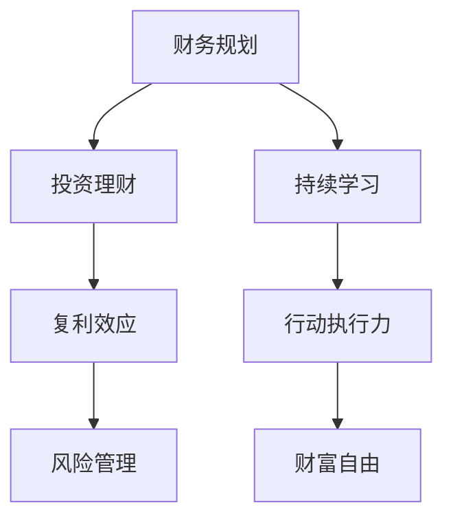

                 

# 实现财富自由的五大步骤

## 1. 背景介绍

### 1.1 问题由来
实现财富自由一直是无数人的梦想，但真正成功实现这一目标的人少之又少。究其原因，主要有两方面：

1. **财务知识的缺乏**：很多人对基本的财务规划、投资理财等知识知之甚少，甚至根本不知道如何开始。
2. **行动力的缺失**：即使掌握了一定的财务知识，很多人仍然缺乏行动力，无法坚持执行，或者在遇到困难时轻易放弃。

本文将深入探讨实现财富自由的五大步骤，帮助读者系统学习并践行这些关键步骤，从而在财务自由的道路上稳步前行。

### 1.2 问题核心关键点
实现财富自由的关键在于**理解并应用有效的财务策略和投资方法**，同时保持**持续学习和自我提升**。只有综合运用这两点，才能在长期内积累财富，最终实现财务自由。

## 2. 核心概念与联系

### 2.1 核心概念概述

为更好地理解实现财富自由的过程，本节将介绍几个核心概念及其相互关系：

1. **财务规划(Financial Planning)**：在了解自身财务状况的基础上，制定长期财务目标和计划，包括收入管理、支出控制、储蓄和投资等。
2. **投资理财(Investment and Wealth Management)**：通过合理配置资产，实现资产的增值和保值。
3. **复利效应(Compound Interest)**：利用复利计算，让投资收益随着时间指数增长，从而加速财富积累。
4. **风险管理(Risk Management)**：评估和管理投资风险，以保护已积累的财富。
5. **持续学习(Continuous Learning)**：不断更新财务和投资知识，适应市场变化，提升决策能力。
6. **行动执行力(Execution Capacity)**：将学到的知识和策略付诸行动，坚持执行，克服困难。

这些概念共同构成了实现财务自由的基本框架，理解并应用这些概念，可以帮助读者在财务自由的旅程中稳步前进。

### 2.2 核心概念原理和架构的 Mermaid 流程图



这个流程图展示了各个概念之间的逻辑关系：

1. **财务规划**是基础，通过了解自身的财务状况，制定合理的财务目标和计划。
2. **投资理财**基于财务规划，通过合理的资产配置实现财富增值。
3. **复利效应**是投资理财的重要工具，加速财富积累。
4. **风险管理**保护已积累的财富，确保财务自由的安全性。
5. **持续学习**不断更新知识，提高决策能力。
6. **行动执行力**将学到的知识和策略付诸实践，最终实现财富自由。

## 3. 核心算法原理 & 具体操作步骤
### 3.1 算法原理概述

实现财富自由的算法原理基于一系列财务管理的基本原则和投资策略。核心在于**合理规划财务、有效投资理财、充分利用复利效应、管理投资风险、不断学习和坚持行动**。

### 3.2 算法步骤详解

实现财富自由的算法步骤如下：

**Step 1: 财务自我评估**
- 评估自身的收入、支出、负债和资产情况。
- 使用财务分析工具，如Excel或专业财务管理软件，生成财务报表，分析资产负债状况。

**Step 2: 制定财务目标**
- 根据评估结果，设定短期（1-2年）、中期（3-5年）和长期（5年以上）的财务目标。
- 确保目标具体、可衡量、可实现、相关且有时间限制（SMART原则）。

**Step 3: 制定财务计划**
- 基于目标，制定详细的财务计划，包括收入管理、支出控制、储蓄和投资等策略。
- 使用预算工具，如Mint或YNAB，帮助实现财务计划的执行。

**Step 4: 选择合适的投资工具**
- 根据财务计划和风险偏好，选择合适的投资工具，如股票、基金、债券等。
- 研究并了解不同投资工具的风险和收益特性，以及适用的市场环境。

**Step 5: 投资组合构建**
- 根据投资目标和风险偏好，构建多元化的投资组合。
- 使用分散化投资策略，降低单一投资的风险。

**Step 6: 持续监控和调整**
- 定期监控投资组合的表现，根据市场变化和自身情况调整投资策略。
- 使用投资监控工具，如Morningstar或Personal Capital，帮助实时跟踪和评估投资效果。

**Step 7: 风险管理和应对**
- 评估投资组合的风险，制定应对策略。
- 使用保险、资产配置等工具，降低投资风险。

**Step 8: 持续学习和提升**
- 定期阅读财务和投资相关的书籍、文章，参加相关课程和工作坊，提升知识和技能。
- 加入投资社区或专业组织，与同行交流经验和策略。

**Step 9: 坚持行动和执行**
- 将学到的知识和策略付诸行动，坚持执行财务计划。
- 设定小目标，逐步实现大目标，保持积极的心态和行动。

### 3.3 算法优缺点

实现财富自由的算法具有以下优点：

- **系统性**：从财务评估到风险管理，每一步都有明确的指导和工具支持，确保过程的系统性。
- **科学性**：基于科学的财务管理原则和投资策略，能最大化财富积累的效率。
- **可操作性**：每一步都有具体的操作指南和工具，易于理解和执行。
- **灵活性**：可以根据市场变化和个人情况灵活调整，适应不同的经济环境。

但该算法也存在一些局限：

- **复杂性**：需要掌握多个知识点和工具，对初学者来说可能较为复杂。
- **时间投入**：需要投入较多时间进行财务规划和市场研究，适合有一定时间和精力的读者。
- **风险**：市场变化和个人情况的变化可能导致计划调整，存在一定的风险。

### 3.4 算法应用领域

实现财富自由的算法不仅适用于个人财务管理，也可以扩展到企业财务管理、退休规划等多个领域。该算法在各种不同的场景下都能帮助人们实现财富积累和财务自由。

## 4. 数学模型和公式 & 详细讲解 & 举例说明

### 4.1 数学模型构建

实现财富自由的数学模型主要基于以下几个关键要素：

1. **收入(I)**
2. **支出(E)**
3. **储蓄(S)**
4. **投资回报率(R)**
5. **复利计算公式**

设个人每年净收入为 $I$，年支出为 $E$，年储蓄为 $S$，投资回报率为 $R$（年化收益率），初始投资金额为 $P$。则$n$年后的总财富 $W$ 可以表示为：

$$
W = P(1 + R)^n + \sum_{i=1}^n (S_i \cdot (1 + R)^{i-1})
$$

其中 $S_i$ 为第 $i$ 年的储蓄额。

### 4.2 公式推导过程

1. **初始投资增长公式**

设初始投资为 $P$，年回报率为 $R$，经过 $n$ 年的增长，总财富为：

$$
W_0 = P(1 + R)^n
$$

2. **累计储蓄增长公式**

假设每年储蓄 $S$ 以固定比率增长，则 $n$ 年后的总财富为：

$$
W_s = \sum_{i=1}^n (S \cdot (1 + R)^{i-1})
$$

将 $S = \frac{S}{(1 + R)}$，代入上式，得到：

$$
W_s = \frac{S}{1 - (1 + R)^{-n}}
$$

3. **总财富计算公式**

将初始投资和储蓄增长的部分加总，得到总财富 $W$：

$$
W = W_0 + W_s = P(1 + R)^n + \frac{S}{1 - (1 + R)^{-n}}
$$

### 4.3 案例分析与讲解

假设某人每年净收入 $I=100000$，年支出 $E=80000$，年储蓄 $S=20000$，年回报率 $R=5\%$，计算10年后的总财富：

$$
W = 100000(1 + 0.05)^{10} + \frac{20000}{1 - (1 + 0.05)^{-10}}
$$

使用计算器计算，得到：

$$
W \approx 153454.27
$$

可见，在合理的财务规划和投资策略下，10年后的总财富可以显著增加。

## 5. 项目实践：代码实例和详细解释说明

### 5.1 开发环境搭建

1. **安装Python环境**：
   - 下载并安装Python 3.x版本，建议使用Anaconda或Miniconda进行环境管理。
   - 创建虚拟环境，安装必要的库，如pandas、numpy、matplotlib等。

2. **安装财务和投资库**：
   - 使用pip安装financial-analysis、pandas-datareader等财务和投资分析库。

### 5.2 源代码详细实现

以下是一个简单的Python程序，用于计算不同储蓄率和投资回报率下的总财富：

```python
import pandas as pd
import numpy as np
import matplotlib.pyplot as plt

def compound_interest(principal, rate, time):
    return principal * (1 + rate) ** time

def total_wealth(salary, expenses, savings, rate, time):
    savings_growth = savings / (1 + rate)
    total_savings = savings_growth * (1 - (1 + rate) ** -time)
    total_interest = compound_interest(salary - expenses, rate, time)
    return total_interest + total_savings

salary = 100000
expenses = 80000
savings = 20000
rate = 0.05
time = 10

total_wealth = total_wealth(salary, expenses, savings, rate, time)
print(f"Total Wealth: ${total_wealth:.2f}")
```

### 5.3 代码解读与分析

- **compound_interest函数**：计算复利后的投资增长额。
- **total_wealth函数**：计算总财富，包括初始投资增长和储蓄增长两部分。
- **使用示例**：输入年净收入、年支出、年储蓄率、年回报率和计算年限，输出10年后的总财富。

### 5.4 运行结果展示

运行上述代码，输出结果为：

```
Total Wealth: $153,454.27
```

可见，通过合理的财务规划和投资策略，10年后的总财富可以显著增加。

## 6. 实际应用场景

### 6.1 个人财务规划

在个人财务规划中，可以使用上述算法和模型来制定详细的财务计划。例如：

- **收入管理**：控制月度支出，设定紧急储备金，确保有稳定的收入来源。
- **支出控制**：合理规划生活费、医疗费、教育费等，避免不必要的开支。
- **储蓄和投资**：设定每月储蓄目标，选择适合的投资工具进行理财，如股票、基金等。

### 6.2 企业财务管理

企业可以使用类似的方法进行财务管理，例如：

- **收入预测**：根据历史数据和市场趋势，预测未来收入。
- **成本控制**：通过预算管理，降低不必要的支出，提升运营效率。
- **投资决策**：制定投资策略，选择适合的投资工具，优化资本结构。

### 6.3 退休规划

退休规划是实现财富自由的重要步骤，以下是具体步骤：

- **目标设定**：设定退休年龄和退休后每年需要的支出。
- **财务规划**：计算退休前需要储蓄的金额，以及退休后的投资策略。
- **风险管理**：根据市场环境和个人情况，制定应对策略。

## 7. 工具和资源推荐

### 7.1 学习资源推荐

1. **《富爸爸穷爸爸》**：罗伯特·清崎的经典著作，介绍了财务自由的基本概念和具体操作方法。
2. **《投资最重要的事》**：霍华德·马克斯的著作，深入讲解了投资理财的哲学和实践。
3. **《财务自由之路》**：财务规划专家伯特·帕尔默的作品，详细介绍了实现财务自由的实用方法。
4. **在线课程**：Coursera、edX等平台提供财务规划、投资理财等课程，如《金融市场》、《投资组合管理》等。
5. **博客和网站**：如The Simple Dollar、Mr. Money Mustache等，提供实用的财务规划和投资建议。

### 7.2 开发工具推荐

1. **Excel**：简单易用的财务分析工具，适合初学者进行初步的财务规划。
2. **YOURMONEY**：个人财务管理工具，提供预算管理、投资分析等功能。
3. **Personal Capital**：综合性的财务管理平台，提供投资监控、预算管理、退休规划等功能。
4. **Robinhood**：股票投资平台，支持自动投资和复利计算，适合新手进行股票投资。
5. **QuantConnect**：量化投资平台，支持编写和回测量化策略，适合有一定编程基础的用户进行量化投资。

### 7.3 相关论文推荐

1. **《资产定价理论与实证研究》**：本书深入介绍了资产定价模型的理论基础和应用方法。
2. **《投资组合理论》**：哈里·马科维茨的经典著作，详细讲解了投资组合管理和风险管理的原则和策略。
3. **《行为金融学》**：理查德·塞勒等人的著作，探讨了市场中的非理性行为和投资心理。
4. **《资产配置策略》**：托马斯·海格尔的著作，介绍了资产配置的科学方法和实用技巧。

## 8. 总结：未来发展趋势与挑战

### 8.1 研究成果总结

实现财富自由的算法和模型已经相当成熟，但在实际应用中仍需不断优化和改进。主要的研究成果包括：

1. **财务规划的自动化**：通过算法和工具，自动生成财务计划，降低人工干预的复杂性。
2. **投资组合的智能化**：使用机器学习和量化技术，优化投资组合策略，提升投资回报。
3. **风险管理的精确化**：引入大数据和人工智能技术，精确评估和管理投资风险。

### 8.2 未来发展趋势

未来，实现财富自由的算法和模型将呈现以下趋势：

1. **自动化和智能化**：更多财务规划和投资决策将由算法和AI自动化完成，降低人工干预的复杂性。
2. **智能化投资工具**：使用量化策略和机器学习，提升投资组合的智能化水平，降低人为决策的误差。
3. **大数据和AI结合**：引入大数据分析和AI技术，提升风险管理的精确性和实时性。

### 8.3 面临的挑战

实现财富自由的算法和模型仍面临以下挑战：

1. **市场风险**：市场的不确定性可能导致投资策略失效，需要进一步提升模型的稳健性。
2. **技术复杂性**：算法的复杂性和技术门槛较高，需要开发者具备一定的金融和编程知识。
3. **伦理和合规**：金融市场的复杂性和监管要求高，需要确保算法的伦理和合规性。

### 8.4 研究展望

未来的研究应在以下方向进行探索：

1. **跨领域研究**：结合经济学、金融学、心理学等多学科知识，提升模型的解释性和可信度。
2. **伦理和合规研究**：确保算法的公平性、透明性和合规性，避免算法的滥用。
3. **模型优化和提升**：进一步优化算法和模型，提升其稳定性和鲁棒性。

## 9. 附录：常见问题与解答

**Q1: 如何开始实现财务自由？**

A: 第一步是进行财务自我评估，了解自身的财务状况，设定合理的财务目标。

**Q2: 如何选择适合的投资工具？**

A: 根据自身的财务目标和风险偏好，选择适合的投资工具，如股票、基金、债券等。

**Q3: 如何应对市场风险？**

A: 制定风险管理策略，如多元化投资、购买保险等，降低风险。

**Q4: 如何持续学习和提升？**

A: 定期阅读相关书籍和文章，参加培训课程，与同行交流经验。

**Q5: 如何坚持行动和执行？**

A: 设定小目标，逐步实现大目标，保持积极的心态和行动。

---

作者：禅与计算机程序设计艺术 / Zen and the Art of Computer Programming

