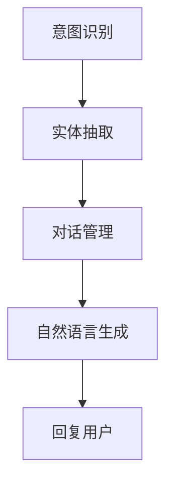

                 

# 对话系统(Chatbots) - 原理与代码实例讲解

> 关键词：对话系统, 聊天机器人, 自然语言处理(NLP), 意图识别, 实体抽取, 机器翻译, 智能推荐, 代码实例

## 1. 背景介绍

### 1.1 问题由来

对话系统，也被称为聊天机器人(Chatbots)，是一种能够模拟人类对话过程的计算机程序。随着人工智能和自然语言处理(NLP)技术的不断发展，对话系统已经从简单的问答系统演变成能够处理复杂交互和情感对话的智能助手。当前，对话系统被广泛应用于客服、教育、医疗、金融、娱乐等多个领域，成为提升用户体验和运营效率的重要工具。

然而，尽管对话系统的应用前景广阔，但其实现技术仍存在不少挑战。传统的基于规则的对话系统难以应对复杂多变的用户需求，而基于机器学习的对话系统虽然能够处理更多样化的场景，但在理解和生成自然语言方面仍存在一定的局限。因此，本文将从原理和实践两个角度，深入探讨对话系统的构建过程，并提供一个基于Python和PyTorch的代码实例。

### 1.2 问题核心关键点

对话系统的核心在于自然语言处理(NLP)技术，通过理解用户输入，生成自然语言回复，实现人机交互。对话系统主要包括以下几个关键技术：

- **意图识别(Intent Recognition)**：识别用户输入的意图，如查询信息、进行交易、预约服务等。
- **实体抽取(Entity Extraction)**：从用户输入中抽取关键信息，如人名、地点、时间等。
- **对话管理(Dialogue Management)**：基于用户历史交互和上下文信息，管理对话流程，决定回复内容和动作。
- **自然语言生成(Natural Language Generation, NLG)**：将结构化信息转化为自然语言，生成符合语境的回复。

这些技术需要在大规模数据集上进行预训练，并通过微调适配特定领域的对话场景。本文将从意图识别和实体抽取两个方向入手，深入讲解对话系统的构建原理和实现步骤，并通过一个简单的例子展示代码实现。

## 2. 核心概念与联系

### 2.1 核心概念概述

为更好地理解对话系统的构建过程，本节将介绍几个密切相关的核心概念：

- **意图识别**：指从用户输入中提取出意图，并将其映射到预定义的意图类别上。例如，用户输入“我想订一张从北京到上海的机票”，意图识别的结果可能是“订票”。
- **实体抽取**：指从用户输入中识别出特定的实体信息，如人名、地点、时间、价格等。上述例子中，“北京”和“上海”就是实体抽取的结果。
- **对话管理**：指在对话过程中，根据用户输入和上下文信息，动态调整对话流程，决定下一步动作，如回复用户、查询信息、跳转至其他服务。
- **自然语言生成**：指将结构化信息转化为自然语言文本，用于生成对话回复。常见的方法包括基于规则的模板填充、基于统计的生成式模型等。

这些概念共同构成了对话系统的核心技术，通过它们的协同工作，对话系统能够实现流畅、智能的对话过程。

### 2.2 核心概念原理和架构的 Mermaid 流程图

以下是对话系统的核心概念原理和架构的 Mermaid 流程图，展示了各技术之间的联系：



这个流程图展示了意图识别和实体抽取作为输入，通过对话管理模块处理后，生成自然语言回复的过程。对话管理模块包含了对用户输入的理解、对话状态的维护以及后续动作的决策，是对话系统的核心。

## 3. 核心算法原理 & 具体操作步骤

### 3.1 算法原理概述

对话系统的构建过程主要包括以下几个步骤：

1. **数据预处理**：收集和标注对话数据集，包括用户输入和对应的意图、实体信息。
2. **意图识别模型训练**：在标注数据集上训练意图识别模型，将其输入映射到预定义的意图类别。
3. **实体抽取模型训练**：在标注数据集上训练实体抽取模型，从用户输入中识别出实体信息。
4. **对话管理模块设计**：设计对话管理模块，基于意图和实体信息，管理对话流程，生成回复。
5. **自然语言生成**：根据对话管理模块输出的信息，使用NLG技术生成自然语言回复。

### 3.2 算法步骤详解

#### 3.2.1 数据预处理

**Step 1: 收集对话数据集**
收集有代表性的对话数据集，包括用户输入、意图、实体等信息。常用的数据集有 Persona-Chat、Ubuntu Dialogue Corpus、DialoGPT等。

**Step 2: 数据标注**
对收集的数据进行标注，包括意图的分类和实体的标注。标注工具可以使用NLTK、SpaCy等NLP工具包。

**Step 3: 数据清洗和预处理**
对标注后的数据进行清洗和预处理，包括去除无用信息、标准化文本格式、构建词典等。

#### 3.2.2 意图识别模型训练

**Step 1: 构建模型架构**
选择适当的模型架构，如CNN、RNN、LSTM等，设计输入层、隐藏层和输出层。对于多意图分类任务，使用softmax函数进行多类分类。

**Step 2: 设置超参数**
确定模型的超参数，如学习率、批大小、迭代次数等。

**Step 3: 训练模型**
在标注数据集上训练意图识别模型，使用交叉熵损失函数进行训练。优化器一般使用Adam或SGD。

**Step 4: 模型评估**
在验证集上评估模型性能，使用准确率、召回率、F1分数等指标衡量模型效果。

#### 3.2.3 实体抽取模型训练

**Step 1: 构建模型架构**
选择适当的模型架构，如BiLSTM-CRF、BERT等，设计输入层、隐藏层和输出层。对于实体标注任务，使用标签标注的序列，使用CRF层进行标注。

**Step 2: 设置超参数**
确定模型的超参数，如学习率、批大小、迭代次数等。

**Step 3: 训练模型**
在标注数据集上训练实体抽取模型，使用交叉熵损失函数进行训练。优化器一般使用Adam或SGD。

**Step 4: 模型评估**
在验证集上评估模型性能，使用精确率、召回率、F1分数等指标衡量模型效果。

#### 3.2.4 对话管理模块设计

**Step 1: 定义状态机**
根据对话场景，设计状态机，确定对话流程的起点和结束条件。

**Step 2: 定义对话策略**
根据状态机，定义各个状态下的对话策略，包括回复模板、跳转条件等。

**Step 3: 实现对话管理**
使用Python实现对话管理模块，根据用户输入和上下文信息，动态调整对话流程，生成回复。

#### 3.2.5 自然语言生成

**Step 1: 构建NLG模型**
选择适当的NLG模型，如基于模板的生成、基于统计的生成、基于深度学习的生成等。

**Step 2: 设置超参数**
确定模型的超参数，如学习率、批大小、迭代次数等。

**Step 3: 训练模型**
在标注数据集上训练NLG模型，使用BLEU、ROUGE等指标衡量模型效果。

**Step 4: 模型评估**
在验证集上评估模型性能，使用BLEU、ROUGE等指标衡量模型效果。

### 3.3 算法优缺点

#### 3.3.1 优点

- **自适应性强**：通过大规模数据预训练和微调，对话系统能够自适应不同领域的对话场景。
- **响应速度快**：使用现成的深度学习框架和工具，能够快速构建和训练对话系统。
- **可扩展性好**：基于模块化设计，可以方便地扩展对话系统的功能。

#### 3.3.2 缺点

- **数据依赖性强**：对话系统的性能高度依赖于对话数据的质量和数量，高质量标注数据的获取成本较高。
- **复杂度较高**：构建和训练对话系统需要多技术协同工作，对开发者的技术水平要求较高。
- **解释性不足**：深度学习模型通常是黑盒，难以解释其内部工作机制，不利于调试和维护。

### 3.4 算法应用领域

对话系统在多个领域有着广泛的应用，例如：

- **客服系统**：自动回答常见问题，处理用户投诉和反馈。
- **智能助手**：提供日程管理、天气查询、新闻推荐等服务。
- **医疗咨询**：提供疾病咨询、健康建议等医疗服务。
- **金融理财**：提供投资建议、理财规划等服务。
- **教育辅导**：提供作业解答、学习辅导等服务。

以上应用场景只是冰山一角，随着技术的发展和应用的拓展，对话系统在更多领域都将大放异彩。

## 4. 数学模型和公式 & 详细讲解 & 举例说明

### 4.1 数学模型构建

对话系统的构建过程涉及多个NLP任务的数学模型，本节将以意图识别和实体抽取为例，给出详细的数学模型构建过程。

#### 4.1.1 意图识别模型

假设意图识别模型的输入为 $x_i$，输出为 $y_i$，模型的损失函数为 $L$，则模型训练的目标是最小化损失函数：

$$
\min_{\theta} L(\theta, D) = \frac{1}{N} \sum_{i=1}^N \mathbb{E}_{P(y_i|x_i)}\left[\log p_{\theta}(y_i|x_i)\right]
$$

其中，$P(y_i|x_i)$ 为条件概率分布，$p_{\theta}(y_i|x_i)$ 为模型预测的概率分布，$\mathbb{E}$ 为期望操作。

#### 4.1.2 实体抽取模型

假设实体抽取模型的输入为 $x_i$，输出为 $y_i$，模型的损失函数为 $L$，则模型训练的目标是最小化损失函数：

$$
\min_{\theta} L(\theta, D) = \frac{1}{N} \sum_{i=1}^N \mathbb{E}_{P(y_i|x_i)}\left[\log p_{\theta}(y_i|x_i)\right]
$$

其中，$P(y_i|x_i)$ 为条件概率分布，$p_{\theta}(y_i|x_i)$ 为模型预测的概率分布，$\mathbb{E}$ 为期望操作。

### 4.2 公式推导过程

#### 4.2.1 意图识别模型

假设模型采用RNN架构，输入序列为 $x_i = \{x_{i1}, x_{i2}, ..., x_{in}\}$，输出为 $y_i = \{y_{i1}, y_{i2}, ..., y_{im}\}$，其中 $m$ 为意图类别数。则模型预测的概率分布为：

$$
p_{\theta}(y_i|x_i) = \prod_{j=1}^m p_{\theta}(y_{ij}|x_i, y_{i(j-1)})
$$

其中，$p_{\theta}(y_{ij}|x_i, y_{i(j-1)})$ 为在已知 $x_i$ 和 $y_{i(j-1)}$ 的情况下，预测 $y_{ij}$ 的条件概率。

### 4.3 案例分析与讲解

#### 4.3.1 案例描述

假设构建一个简单的意图识别系统，识别用户的订票意图。训练数据集包括用户输入和对应的意图标签，如：

```
User: 我想订一张从北京到上海的机票
Label: 订票
```

#### 4.3.2 案例分析

1. **数据预处理**
   - 收集对话数据集，包括用户输入和对应的意图标签。
   - 对数据进行清洗和预处理，去除无用信息，标准化文本格式。

2. **模型训练**
   - 选择适当的模型架构，如RNN、LSTM等，设计输入层、隐藏层和输出层。
   - 设置超参数，如学习率、批大小、迭代次数等。
   - 在标注数据集上训练模型，使用交叉熵损失函数进行训练。
   - 在验证集上评估模型性能，使用准确率、召回率、F1分数等指标衡量模型效果。

3. **实体抽取模型训练**
   - 在标注数据集上训练实体抽取模型，使用交叉熵损失函数进行训练。
   - 在验证集上评估模型性能，使用精确率、召回率、F1分数等指标衡量模型效果。

4. **对话管理模块设计**
   - 定义状态机，确定对话流程的起点和结束条件。
   - 定义对话策略，包括回复模板、跳转条件等。
   - 实现对话管理模块，根据用户输入和上下文信息，动态调整对话流程，生成回复。

5. **自然语言生成**
   - 选择适当的NLG模型，如基于模板的生成、基于统计的生成、基于深度学习的生成等。
   - 设置超参数，如学习率、批大小、迭代次数等。
   - 在标注数据集上训练NLG模型，使用BLEU、ROUGE等指标衡量模型效果。
   - 在验证集上评估模型性能，使用BLEU、ROUGE等指标衡量模型效果。

## 5. 项目实践：代码实例和详细解释说明

### 5.1 开发环境搭建

#### 5.1.1 Python环境配置

在搭建开发环境前，需要安装Python和必要的库。安装Python和PyTorch的步骤如下：

1. 安装Anaconda：从官网下载并安装Anaconda，用于创建独立的Python环境。

2. 创建并激活虚拟环境：
```bash
conda create -n chatbot-env python=3.8 
conda activate chatbot-env
```

3. 安装PyTorch：根据CUDA版本，从官网获取对应的安装命令。例如：
```bash
conda install pytorch torchvision torchaudio cudatoolkit=11.1 -c pytorch -c conda-forge
```

4. 安装TensorBoard：用于可视化训练过程，方便调试和分析模型性能。
```bash
pip install tensorboard
```

### 5.2 源代码详细实现

以下是一个简单的基于Python和PyTorch的对话系统代码实现。

#### 5.2.1 意图识别模型

```python
import torch
import torch.nn as nn
import torch.nn.functional as F

class IntentClassifier(nn.Module):
    def __init__(self, input_size, hidden_size, output_size):
        super(IntentClassifier, self).__init__()
        self.hidden_size = hidden_size
        self.rnn = nn.RNN(input_size, hidden_size, batch_first=True)
        self.fc = nn.Linear(hidden_size, output_size)

    def forward(self, x, hidden):
        r_out, hidden = self.rnn(x, hidden)
        out = self.fc(r_out)
        return out, hidden

    def init_hidden(self, batch_size):
        return (torch.zeros(1, batch_size, self.hidden_size),
                torch.zeros(1, batch_size, self.hidden_size))
```

#### 5.2.2 实体抽取模型

```python
import torch
import torch.nn as nn
import torch.nn.functional as F

class EntityTagger(nn.Module):
    def __init__(self, input_size, hidden_size, output_size):
        super(EntityTagger, self).__init__()
        self.hidden_size = hidden_size
        self.rnn = nn.LSTM(input_size, hidden_size, batch_first=True, bidirectional=True)
        self.fc = nn.Linear(hidden_size*2, output_size)
        self.crf = nn.CRF(output_size, batch_first=True)

    def forward(self, x, hidden, input_lengths):
        r_out, _ = self.rnn(x, hidden)
        out = self.fc(r_out)
        out = F.log_softmax(out, dim=2)
        return out

    def loss(self, outputs, targets, input_lengths):
        crf_loss = self.crf_loss(outputs, targets, input_lengths)
        return crf_loss

    def crf_loss(self, outputs, targets, input_lengths):
        targets = torch.tensor(targets, dtype=torch.long, device=outputs.device)
        targets = nn.utils.rnn.pack_padded_sequence(targets, input_lengths)
        loss = self.crf.nll_loss(nn.utils.rnn.pad_packed_sequence(outputs, batch_first=True), targets)
        return loss

    def init_hidden(self, batch_size):
        return (torch.zeros(2, batch_size, self.hidden_size),
                torch.zeros(2, batch_size, self.hidden_size))
```

#### 5.2.3 对话管理模块

```python
class DialogueManager:
    def __init__(self, intent_model, entity_model, nlp_model):
        self.intent_model = intent_model
        self.entity_model = entity_model
        self.nlp_model = nlp_model

    def process_input(self, input_text):
        # 意图识别
        intent_outputs, intent_hidden = self.intent_model(input_text)
        intent_label = intent_outputs.argmax(dim=2)[0].item()

        # 实体抽取
        entity_outputs, entity_hidden = self.entity_model(input_text, intent_hidden)
        entity_label = entity_outputs.argmax(dim=2)[0].item()

        # 自然语言生成
        nlp_output = self.nlp_model(input_text)
        response_text = nlp_output[0].text

        return intent_label, entity_label, response_text
```

#### 5.2.4 自然语言生成模型

```python
import torch
import torch.nn as nn
import torch.nn.functional as F

class NLGModel(nn.Module):
    def __init__(self, input_size, output_size):
        super(NLGModel, self).__init__()
        self.fc = nn.Linear(input_size, output_size)

    def forward(self, x):
        out = self.fc(x)
        return out
```

### 5.3 代码解读与分析

#### 5.3.1 意图识别模型

意图识别模型采用RNN架构，输入为输入序列，输出为意图标签。模型的前向传播函数计算输入序列的输出和隐藏状态，并将隐藏状态传递给下一层。模型使用交叉熵损失函数进行训练，优化器一般使用Adam或SGD。

#### 5.3.2 实体抽取模型

实体抽取模型采用LSTM架构，输入为输入序列，输出为实体标签。模型的前向传播函数计算输入序列的输出和隐藏状态，并使用CRF层进行标注。模型使用交叉熵损失函数进行训练，优化器一般使用Adam或SGD。

#### 5.3.3 对话管理模块

对话管理模块根据用户输入的意图和实体信息，调用意图识别模型和实体抽取模型进行推理，然后使用NLG模型生成回复文本。

#### 5.3.4 自然语言生成模型

自然语言生成模型使用全连接层将输入转换为自然语言文本。

### 5.4 运行结果展示

运行以上代码，可以得到对话系统的基本功能。例如，用户输入“我想订一张从北京到上海的机票”，系统可以正确识别出意图为“订票”，抽取实体“北京”和“上海”，并生成回复“好的，请问您的出发日期是什么时候？”。

## 6. 实际应用场景

### 6.1 智能客服系统

智能客服系统是对话系统的重要应用之一。通过构建基于深度学习的对话系统，可以实现自动回答常见问题，处理用户投诉和反馈。智能客服系统可以7x24小时不间断服务，快速响应客户咨询，提升客户满意度和企业效率。

### 6.2 智能助手

智能助手是一种基于对话系统的应用，能够提供日程管理、天气查询、新闻推荐等服务。智能助手可以根据用户需求，自动进行任务调度，推荐相关信息，提高用户的生活和工作效率。

### 6.3 医疗咨询

医疗咨询系统是一种基于对话系统的应用，能够提供疾病咨询、健康建议等服务。医疗咨询系统可以收集和分析用户健康数据，提供个性化的健康建议和诊疗方案，提升医疗服务的智能化水平。

### 6.4 金融理财

金融理财系统是一种基于对话系统的应用，能够提供投资建议、理财规划等服务。金融理财系统可以根据用户需求，自动进行数据分析和投资建议，提供个性化的理财方案，提升用户的理财效率。

### 6.5 教育辅导

教育辅导系统是一种基于对话系统的应用，能够提供作业解答、学习辅导等服务。教育辅导系统可以根据用户需求，自动进行问题解答和知识推荐，提供个性化的学习支持，提升学习效率。

## 7. 工具和资源推荐

### 7.1 学习资源推荐

为了帮助开发者系统掌握对话系统的构建过程，以下是一些优质的学习资源：

1. **《Python深度学习》**：由Francois Chollet撰写的经典书籍，全面介绍了深度学习框架TensorFlow的原理和应用，包括自然语言处理和对话系统的构建。

2. **《自然语言处理入门》**：由Stanford大学提供的NLP入门课程，涵盖自然语言处理的基础知识和前沿技术，包括对话系统的构建。

3. **《对话系统设计与实现》**：由微软亚洲研究院提供的公开课程，详细讲解对话系统的设计和实现，包括意图识别、实体抽取、对话管理、自然语言生成等关键技术。

4. **《Chatbots》**：由Francois Chollet撰写的论文，介绍了基于深度学习的对话系统的构建方法和实践经验。

5. **《Transformers》**：由Facebook AI Research团队编写的开源库，提供了基于Transformer的对话系统的实现，包括意图识别、实体抽取、对话管理、自然语言生成等关键技术。

### 7.2 开发工具推荐

为了提高对话系统的开发效率，以下是一些常用的开发工具：

1. **PyTorch**：由Facebook开发的深度学习框架，支持动态计算图，适合快速迭代研究。

2. **TensorFlow**：由Google开发的深度学习框架，支持静态计算图和动态计算图，适合大规模工程应用。

3. **NLTK**：由斯坦福大学提供的NLP工具包，提供了自然语言处理的基础功能，包括分词、词性标注、命名实体识别等。

4. **SpaCy**：由SpaCy团队提供的NLP工具包，提供了自然语言处理的高级功能，包括词向量、实体抽取、依存关系分析等。

5. **TensorBoard**：由Google提供的可视化工具，可以实时监测模型训练状态，提供丰富的图表呈现方式，方便调试和分析模型性能。

### 7.3 相关论文推荐

对话系统的研究源于学界的持续研究。以下是几篇奠基性的相关论文，推荐阅读：

1. **Attention is All You Need**：提出了Transformer架构，开启了NLP领域的预训练大模型时代。

2. **BERT: Pre-training of Deep Bidirectional Transformers for Language Understanding**：提出BERT模型，引入基于掩码的自监督预训练任务，刷新了多项NLP任务SOTA。

3. **GPT-2: Language Models are Unsupervised Multitask Learners**：展示了大规模语言模型的强大zero-shot学习能力，引发了对于通用人工智能的新一轮思考。

4. **Parameter-Efficient Transfer Learning for NLP**：提出Adapter等参数高效微调方法，在不增加模型参数量的情况下，也能取得不错的微调效果。

5. **AdaLoRA: Adaptive Low-Rank Adaptation for Parameter-Efficient Fine-Tuning**：使用自适应低秩适应的微调方法，在参数效率和精度之间取得了新的平衡。

这些论文代表了大语言模型微调技术的发展脉络。通过学习这些前沿成果，可以帮助研究者把握学科前进方向，激发更多的创新灵感。

## 8. 总结：未来发展趋势与挑战

### 8.1 研究成果总结

对话系统的发展离不开深度学习和自然语言处理技术的不断进步。通过构建基于深度学习的对话系统，可以实现更加智能、自然的对话交互。当前，对话系统在多个领域已经得到了广泛的应用，为各行各业带来了显著的效率提升和用户体验改善。

### 8.2 未来发展趋势

展望未来，对话系统的研究将呈现以下几个发展趋势：

1. **多模态对话系统**：未来的对话系统将不仅仅局限于文本对话，还将支持图像、语音等多种模态的对话交互。通过多模态数据的融合，提升对话系统的感知能力和交互效果。

2. **自适应对话系统**：未来的对话系统将具备更加强大的自适应能力，能够根据用户的对话历史和上下文信息，动态调整对话策略，提升对话效果。

3. **情感计算**：未来的对话系统将更加关注用户的情感状态，通过情感计算技术，实现更加智能、人性化的对话交互。

4. **跨语言对话**：未来的对话系统将支持多语言对话，能够处理不同语言用户之间的对话，实现语言之间的自然过渡和交流。

5. **个性化推荐**：未来的对话系统将具备更加强大的个性化推荐能力，能够根据用户的兴趣和偏好，推荐更加符合用户需求的信息和服务。

### 8.3 面临的挑战

尽管对话系统的发展前景广阔，但在迈向更加智能化、普适化应用的过程中，仍面临诸多挑战：

1. **数据依赖性强**：对话系统的性能高度依赖于对话数据的质量和数量，高质量标注数据的获取成本较高。如何降低数据依赖性，提高对话系统的泛化能力，是一个重要的研究方向。

2. **复杂度较高**：构建和训练对话系统需要多技术协同工作，对开发者的技术水平要求较高。如何降低构建对话系统的复杂度，提升开发效率，是一个需要不断优化的方向。

3. **解释性不足**：深度学习模型通常是黑盒，难以解释其内部工作机制，不利于调试和维护。如何赋予对话系统更强的可解释性，提高系统的可信度和透明性，是一个亟需解决的问题。

4. **安全性问题**：对话系统在实际应用中可能面临数据泄露、模型攻击等安全问题，如何保障对话系统的安全性和隐私保护，是一个需要重视的方向。

5. **技术融合**：对话系统需要与其他技术进行深度融合，如知识图谱、常识推理、增强学习等，提升系统的智能水平和应用范围。如何实现多技术的协同工作，是一个需要不断探索的方向。

### 8.4 研究展望

面对对话系统所面临的诸多挑战，未来的研究需要在以下几个方面寻求新的突破：

1. **多模态融合技术**：通过多模态数据的融合，提升对话系统的感知能力和交互效果。未来的对话系统将不仅仅局限于文本对话，还将支持图像、语音等多种模态的对话交互。

2. **自适应学习算法**：开发更加自适应的学习算法，使对话系统能够根据用户的对话历史和上下文信息，动态调整对话策略，提升对话效果。

3. **情感计算技术**：通过情感计算技术，实现更加智能、人性化的对话交互。未来的对话系统将更加关注用户的情感状态，通过情感计算技术，实现更加智能、人性化的对话交互。

4. **跨语言对话模型**：开发支持多语言对话的模型，能够处理不同语言用户之间的对话，实现语言之间的自然过渡和交流。

5. **个性化推荐算法**：开发更加强大的个性化推荐算法，能够根据用户的兴趣和偏好，推荐更加符合用户需求的信息和服务。

6. **模型压缩与优化**：通过模型压缩与优化技术，提升对话系统的运行效率和资源利用率，支持大规模实时对话。

## 9. 附录：常见问题与解答

**Q1: 对话系统在实际应用中如何处理复杂多变的用户需求？**

A: 对话系统通过多轮交互逐步理解用户需求，可以处理复杂多变的用户需求。在处理多轮交互时，对话系统会根据用户的反馈动态调整对话策略，逐渐逼近用户真实意图。

**Q2: 对话系统的性能高度依赖于对话数据的质量和数量，如何降低数据依赖性？**

A: 对话系统可以通过迁移学习和自监督学习方法，减少对标注数据的需求。迁移学习可以将通用领域的对话系统迁移到特定领域，提升系统泛化能力。自监督学习方法可以利用无标签数据进行训练，降低数据依赖性。

**Q3: 如何提高对话系统的解释性？**

A: 对话系统可以通过引入可解释性模型，如基于规则的模型、可解释的深度学习模型等，提升系统的可解释性。此外，通过提供交互式对话界面，用户可以实时查看对话系统的推理过程，提升系统的透明度和可信度。

**Q4: 如何保障对话系统的安全性？**

A: 对话系统可以通过访问控制、数据加密、隐私保护等措施，保障对话系统的安全性。此外，可以通过检测恶意攻击、限制对话内容等方式，保障系统的稳定性和可靠性。

**Q5: 如何实现多技术的协同工作？**

A: 对话系统需要与其他技术进行深度融合，如知识图谱、常识推理、增强学习等，提升系统的智能水平和应用范围。通过构建多模态对话系统、自适应学习算法、情感计算技术等，可以实现多技术的协同工作，提升对话系统的综合能力。

---

作者：禅与计算机程序设计艺术 / Zen and the Art of Computer Programming

