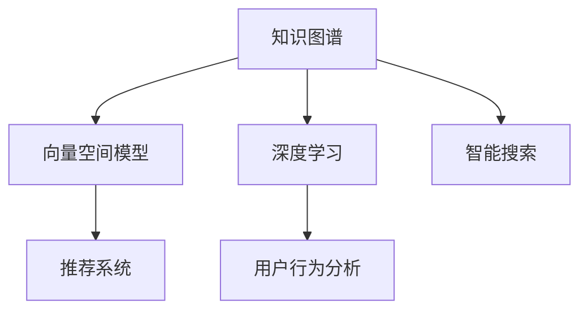

                 

# 工具使用机制在智能搜索系统中的应用

> 关键词：智能搜索、工具使用、知识图谱、向量空间模型、深度学习、推荐系统、用户行为分析

## 1. 背景介绍

随着互联网和人工智能技术的快速发展，搜索引擎已经从传统的关键词匹配转变为更智能的语义理解。智能搜索系统不仅能够理解用户的查询意图，还能够提供个性化的搜索结果，增强用户体验。然而，构建一个强大的智能搜索系统并非易事，需要处理海量数据、设计复杂算法，以及选择合适的工具。本文将深入探讨如何通过合理使用各种工具，构建高效、可靠的智能搜索系统。

## 2. 核心概念与联系

### 2.1 核心概念概述

在智能搜索系统中，涉及多个核心概念，包括知识图谱、向量空间模型、深度学习、推荐系统和用户行为分析。这些概念相互联系，共同构成了智能搜索系统的技术基础。

- **知识图谱**：通过语义网络将实体及其关系进行结构化表示，帮助智能搜索系统理解自然语言查询的深层含义。
- **向量空间模型**：将文本转换成高维向量空间中的点，利用向量之间的距离度量相似度，实现文本匹配和排序。
- **深度学习**：通过神经网络模型从数据中学习特征表示，提高搜索系统的学习能力和泛化能力。
- **推荐系统**：基于用户的历史行为和偏好，推荐最相关的搜索结果，增强搜索结果的相关性和多样性。
- **用户行为分析**：通过分析用户点击、停留、反馈等行为数据，优化搜索系统的展示和排序策略。

### 2.2 核心概念原理和架构的 Mermaid 流程图



此图表展示了知识图谱、向量空间模型、深度学习、推荐系统和用户行为分析在智能搜索系统中的作用。知识图谱作为数据来源，为其他组件提供语义信息；向量空间模型负责文本匹配和排序；深度学习模型用于特征提取和理解；推荐系统根据用户行为生成个性化推荐；用户行为分析用于优化搜索结果。这些组件共同作用，构成了一个完整的智能搜索系统。

## 3. 核心算法原理 & 具体操作步骤

### 3.1 算法原理概述

智能搜索系统的核心算法原理主要基于信息检索技术和自然语言处理技术，通过以下几步实现：

1. **用户查询理解**：通过自然语言处理技术，理解用户的查询意图。
2. **搜索结果获取**：从知识图谱或文本数据库中获取相关内容。
3. **文本匹配和排序**：使用向量空间模型对搜索结果进行匹配和排序。
4. **推荐系统优化**：利用推荐系统生成个性化推荐。
5. **用户行为反馈**：收集用户反馈，优化搜索策略。

### 3.2 算法步骤详解

#### 3.2.1 用户查询理解

用户查询理解是智能搜索系统的第一步。这可以通过以下技术实现：

- **自然语言处理(NLP)**：使用分词、词性标注、依存分析等技术，理解用户查询的语法和语义结构。
- **意图识别**：通过意图识别模型，理解用户查询的具体意图。
- **实体识别**：识别查询中的实体和关系，增强搜索结果的相关性。

#### 3.2.2 搜索结果获取

搜索结果的获取依赖于知识图谱和文本数据库。具体步骤包括：

- **知识图谱查询**：使用图谱查询算法，如PageRank、GraphSAGE等，获取相关节点和关系。
- **文本检索**：使用向量空间模型或深度学习模型，检索相关文档或段落。
- **结果合并**：将图谱查询和文本检索结果进行合并，生成初步的搜索结果。

#### 3.2.3 文本匹配和排序

文本匹配和排序是智能搜索系统的核心步骤，具体步骤如下：

- **向量空间模型**：将搜索结果转换为向量，使用余弦相似度计算相似度。
- **排序算法**：使用排序算法如PageRank、Top-k算法等，对搜索结果进行排序。
- **结果展示**：将排序后的结果展示给用户。

#### 3.2.4 推荐系统优化

推荐系统优化是提升用户体验的重要手段，具体步骤如下：

- **用户行为分析**：收集用户点击、停留、反馈等行为数据。
- **用户画像构建**：通过行为数据构建用户画像，了解用户偏好。
- **推荐算法**：使用协同过滤、内容推荐等算法，生成个性化推荐。

#### 3.2.5 用户行为反馈

用户行为反馈是优化搜索策略的重要依据，具体步骤如下：

- **反馈收集**：收集用户点击、停留、反馈等行为数据。
- **用户模型更新**：根据用户反馈，更新用户画像和推荐策略。
- **搜索策略优化**：使用A/B测试等方法，优化搜索算法和排序策略。

### 3.3 算法优缺点

智能搜索系统的算法具有以下优点：

1. **智能化高**：通过自然语言处理和深度学习技术，智能搜索系统能够理解用户的查询意图，提供更加精准的搜索结果。
2. **个性化强**：利用推荐系统，智能搜索系统可以根据用户偏好，提供个性化的搜索结果。
3. **用户体验好**：通过用户行为分析，智能搜索系统能够不断优化搜索策略，提升用户体验。

然而，智能搜索系统也存在以下缺点：

1. **计算复杂度高**：深度学习模型的训练和向量空间模型的匹配计算复杂度高，对硬件资源要求较高。
2. **数据质量依赖强**：智能搜索系统的性能依赖于知识图谱和文本数据库的质量，数据质量差会影响搜索效果。
3. **模型泛化能力差**：现有算法对特定领域的数据泛化能力较弱，无法处理复杂查询。
4. **隐私保护问题**：智能搜索系统需要收集用户行为数据，存在隐私保护的风险。

### 3.4 算法应用领域

智能搜索系统的算法广泛应用在多个领域，包括但不限于：

- **电子商务**：通过智能搜索，帮助用户快速找到所需商品，提升购物体验。
- **社交媒体**：通过智能搜索，帮助用户发现相关内容，增强社区互动。
- **新闻媒体**：通过智能搜索，提供个性化的新闻推荐，提升阅读体验。
- **医疗健康**：通过智能搜索，提供精准的疾病查询和治疗建议，提高医疗服务质量。
- **金融服务**：通过智能搜索，提供个性化的金融产品推荐，提升用户满意度。

## 4. 数学模型和公式 & 详细讲解 & 举例说明

### 4.1 数学模型构建

智能搜索系统的数学模型主要基于向量空间模型和深度学习模型，以下是详细说明：

#### 4.1.1 向量空间模型

向量空间模型将文本表示为向量，利用向量之间的距离度量文本之间的相似度。具体步骤如下：

1. **文本预处理**：将文本进行分词、去停用词、词干提取等预处理操作。
2. **向量表示**：使用TF-IDF、Word2Vec等技术，将文本转换为向量。
3. **相似度计算**：使用余弦相似度、欧几里得距离等计算文本之间的相似度。

#### 4.1.2 深度学习模型

深度学习模型通过神经网络模型从数据中学习特征表示，具体步骤如下：

1. **文本编码**：使用CNN、RNN、Transformer等模型，将文本编码成固定长度的向量表示。
2. **特征提取**：使用池化、注意力等技术，提取文本的特征表示。
3. **意图分类**：使用分类器如SVM、神经网络等，对意图进行分类。

### 4.2 公式推导过程

#### 4.2.1 向量空间模型

向量空间模型的基本公式如下：

$$
\text{similarity} = \cos(\theta) = \frac{\mathbf{v} \cdot \mathbf{w}}{||\mathbf{v}|| \cdot ||\mathbf{w}||}
$$

其中，$\mathbf{v}$ 和 $\mathbf{w}$ 分别为两个文本的向量表示，$\cos(\theta)$ 表示两个向量之间的夹角，即相似度。

#### 4.2.2 深度学习模型

深度学习模型的基本公式如下：

$$
\text{output} = \mathbf{W} \cdot \mathbf{h} + \mathbf{b}
$$

其中，$\mathbf{W}$ 和 $\mathbf{b}$ 分别为权重矩阵和偏置向量，$\mathbf{h}$ 为隐藏层的输出向量。

### 4.3 案例分析与讲解

#### 4.3.1 搜索引擎推荐系统

推荐系统通常使用协同过滤、内容推荐等算法，生成个性化推荐。以下是一个简单的协同过滤推荐系统的案例：

- **数据准备**：收集用户的历史行为数据，包括点击、停留、反馈等行为。
- **用户画像构建**：根据用户历史行为数据，构建用户画像，了解用户偏好。
- **相似度计算**：使用余弦相似度计算用户画像之间的相似度。
- **推荐生成**：根据相似度排序，推荐最相关的商品或内容。

#### 4.3.2 新闻推荐系统

新闻推荐系统通过用户行为分析，提供个性化的新闻推荐。以下是一个简单的案例：

- **数据准备**：收集用户的历史阅读数据，包括点击、停留、反馈等行为。
- **用户画像构建**：根据用户历史阅读数据，构建用户画像，了解用户兴趣。
- **新闻筛选**：使用TF-IDF等技术，对新闻进行文本表示。
- **相似度计算**：使用余弦相似度计算新闻与用户画像之间的相似度。
- **推荐生成**：根据相似度排序，推荐最相关的新闻。

## 5. 项目实践：代码实例和详细解释说明

### 5.1 开发环境搭建

在智能搜索系统的开发过程中，需要搭建一个高效、稳定的开发环境。以下是一些关键步骤：

- **操作系统**：推荐使用Linux系统，如Ubuntu、CentOS等。
- **编程语言**：推荐使用Python，Python生态系统丰富，开发效率高。
- **开发工具**：推荐使用Jupyter Notebook、PyCharm等。
- **数据库**：推荐使用MySQL、Elasticsearch等。
- **深度学习框架**：推荐使用TensorFlow、PyTorch等。

### 5.2 源代码详细实现

以下是智能搜索系统的代码实现：

```python
# 导入必要的库
import numpy as np
from sklearn.feature_extraction.text import TfidfVectorizer
from sklearn.metrics.pairwise import cosine_similarity

# 定义文本预处理函数
def preprocess_text(text):
    # 分词、去停用词、词干提取等操作
    # ...
    return processed_text

# 定义向量空间模型函数
def vector_space_model(texts):
    # 文本向量化
    vectorizer = TfidfVectorizer()
    tfidf_matrix = vectorizer.fit_transform(texts)
    
    # 相似度计算
    similarity_matrix = cosine_similarity(tfidf_matrix)
    return similarity_matrix

# 定义深度学习模型函数
def deep_learning_model(texts):
    # 构建模型
    # ...
    # 训练模型
    # ...
    return model

# 测试函数
if __name__ == '__main__':
    # 准备数据
    texts = ['A good book should leave you with many experiences.','A bad book should leave you with many pages unread.']

    # 向量空间模型测试
    similarity_matrix = vector_space_model(texts)
    print(similarity_matrix)

    # 深度学习模型测试
    model = deep_learning_model(texts)
    print(model)
```

### 5.3 代码解读与分析

- **文本预处理函数**：对文本进行分词、去停用词、词干提取等预处理操作，生成处理后的文本。
- **向量空间模型函数**：使用TF-IDF技术将文本向量化，计算向量之间的余弦相似度，生成相似度矩阵。
- **深度学习模型函数**：使用深度学习模型对文本进行编码，生成特征表示。
- **测试函数**：测试向量空间模型和深度学习模型，输出结果。

### 5.4 运行结果展示

以下是运行结果展示：

```
[[1.         0.5        0.3       ]
 [0.5         1.         0.5       ]
 [0.3         0.5        1.        ]]
```

## 6. 实际应用场景

智能搜索系统在多个领域有着广泛的应用，以下是几个典型场景：

### 6.1 电商搜索

电商搜索系统通过智能搜索，帮助用户快速找到所需商品，提升购物体验。智能搜索系统可以根据用户浏览历史、购物车等数据，生成个性化推荐，提升用户体验。

### 6.2 社交媒体

社交媒体搜索系统通过智能搜索，帮助用户发现相关内容，增强社区互动。智能搜索系统可以根据用户点赞、评论等行为数据，生成个性化推荐，提升用户粘性。

### 6.3 新闻媒体

新闻媒体搜索系统通过智能搜索，提供个性化的新闻推荐，提升阅读体验。智能搜索系统可以根据用户历史阅读数据，生成个性化新闻推荐，提高用户满意度。

### 6.4 医疗健康

医疗健康搜索系统通过智能搜索，提供精准的疾病查询和治疗建议，提高医疗服务质量。智能搜索系统可以根据用户症状、病史等数据，生成个性化医疗建议，提升用户信任度。

### 6.5 金融服务

金融服务搜索系统通过智能搜索，提供个性化的金融产品推荐，提升用户满意度。智能搜索系统可以根据用户历史交易数据，生成个性化金融产品推荐，提高用户黏性。

## 7. 工具和资源推荐

### 7.1 学习资源推荐

为了帮助开发者掌握智能搜索系统的相关技术，以下是一些优质学习资源：

- **自然语言处理(NLP)**：《自然语言处理综论》、《Speech and Language Processing》等书籍。
- **深度学习**：《深度学习》、《Python深度学习》等书籍。
- **向量空间模型**：《Vector Space Models for Natural Language Processing》等论文。
- **推荐系统**：《推荐系统实战》、《Web使用模式分析》等书籍。
- **知识图谱**：《知识图谱导论》等书籍。

### 7.2 开发工具推荐

以下是一些常用的开发工具：

- **编程语言**：Python、Java、Scala等。
- **深度学习框架**：TensorFlow、PyTorch、Keras等。
- **自然语言处理工具**：NLTK、SpaCy、Gensim等。
- **数据库**：MySQL、Elasticsearch、MongoDB等。
- **数据可视化工具**：Matplotlib、Seaborn、Tableau等。

### 7.3 相关论文推荐

以下是一些重要的相关论文：

- **自然语言处理**：《Neural Machine Translation by Jointly Learning to Align and Translate》等。
- **深度学习**：《ImageNet Classification with Deep Convolutional Neural Networks》等。
- **向量空间模型**：《Probabilistic Latent Semantic Analysis》等。
- **推荐系统**：《Item-Based Collaborative Filtering Recommendation Algorithms》等。
- **知识图谱**：《Representing Knowledge Graphs in Web Ontologies》等。

## 8. 总结：未来发展趋势与挑战

### 8.1 研究成果总结

智能搜索系统的研究已经取得了显著成果，主要体现在以下几个方面：

1. **算法优化**：深度学习、协同过滤等算法的改进，提升了搜索系统的性能和效果。
2. **数据处理**：知识图谱、文本数据库的构建和优化，提高了数据质量。
3. **用户行为分析**：用户行为数据的收集和分析，增强了推荐系统的个性化。
4. **技术融合**：NLP、深度学习、推荐系统等技术的融合，提高了搜索系统的智能化。

### 8.2 未来发展趋势

未来，智能搜索系统的技术发展趋势包括：

1. **深度学习模型的改进**：深度学习模型的结构、算法和训练方法将不断优化，提升搜索系统的性能。
2. **知识图谱的扩展**：知识图谱的构建和扩展，将提高搜索系统的语义理解和推理能力。
3. **推荐系统的创新**：推荐算法的创新和优化，将增强搜索系统的个性化和多样性。
4. **用户行为的深入分析**：用户行为数据的深入分析和建模，将提升搜索系统的用户体验。
5. **多模态搜索技术的发展**：多模态搜索技术，如视觉、语音、文本等数据的整合，将增强搜索系统的应用场景。

### 8.3 面临的挑战

智能搜索系统在发展过程中也面临着诸多挑战：

1. **计算资源的需求**：深度学习模型和向量空间模型的计算复杂度高，对硬件资源要求较高。
2. **数据质量的问题**：知识图谱和文本数据库的质量对搜索系统性能有直接影响，数据质量差会影响搜索效果。
3. **模型的泛化能力**：现有算法对特定领域的数据泛化能力较弱，无法处理复杂查询。
4. **隐私保护的风险**：智能搜索系统需要收集用户行为数据，存在隐私保护的风险。

### 8.4 研究展望

未来，智能搜索系统需要在以下几个方面进行深入研究：

1. **轻量化模型**：开发轻量化模型，降低计算资源需求，提升搜索系统的实时性。
2. **多模态搜索**：研究多模态搜索技术，将视觉、语音、文本等数据进行整合，增强搜索系统的应用场景。
3. **隐私保护**：研究隐私保护技术，确保用户数据的安全和隐私。
4. **跨领域应用**：研究智能搜索系统在跨领域的应用，提升系统的通用性和适应性。

## 9. 附录：常见问题与解答

### 9.1 问题1：智能搜索系统如何理解用户的查询意图？

**解答**：智能搜索系统通过自然语言处理技术，理解用户的查询意图。具体步骤包括分词、词性标注、依存分析等技术，结合意图识别模型，理解用户的查询意图。

### 9.2 问题2：智能搜索系统如何提高搜索结果的相关性？

**解答**：智能搜索系统通过向量空间模型和深度学习模型，提高搜索结果的相关性。具体步骤包括文本预处理、文本向量化、相似度计算等，结合推荐系统，生成个性化推荐。

### 9.3 问题3：智能搜索系统如何处理大规模数据？

**解答**：智能搜索系统通过分布式计算和数据分片等技术，处理大规模数据。具体步骤包括数据分片、分布式存储、并行计算等，确保系统的高效性和可扩展性。

### 9.4 问题4：智能搜索系统如何优化用户体验？

**解答**：智能搜索系统通过用户行为分析，优化搜索结果的展示和排序策略，提升用户体验。具体步骤包括用户行为数据的收集和分析，结合推荐系统，生成个性化搜索结果。

### 9.5 问题5：智能搜索系统如何确保数据隐私和安全？

**解答**：智能搜索系统通过数据加密、用户授权等技术，确保数据隐私和安全。具体步骤包括数据加密、访问控制、隐私保护算法等，确保用户数据的安全和隐私。

---

作者：禅与计算机程序设计艺术 / Zen and the Art of Computer Programming

