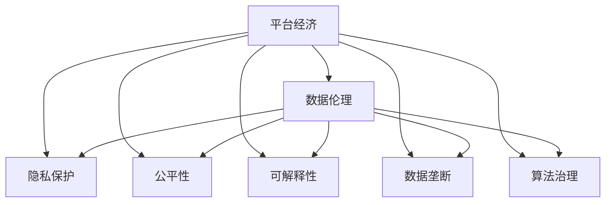

                 

# 平台经济的数据伦理：如何平衡利益与责任？

> 关键词：平台经济,数据伦理,隐私保护,公平性,可解释性

## 1. 背景介绍

随着互联网和移动互联网技术的迅猛发展，平台经济已成为现代经济的重要组成部分。平台经济以其低成本、高效率、便捷性等优势，极大促进了商业模式的创新和消费者福利的提升。然而，随着平台经济的持续扩张，数据伦理问题日益凸显。如何平衡数据利用与隐私保护，实现用户利益与企业利益的协同发展，成为平台经济领域亟需解决的难题。

平台经济的数据伦理问题不仅涉及用户隐私、数据安全、数据使用透明性等传统问题，还涵盖算法偏见、数据垄断、算法治理等新兴领域。这些问题关系到平台经济的健康可持续发展，需要多方参与，共同构建一个公正、透明、可信的数据伦理体系。

## 2. 核心概念与联系

### 2.1 核心概念概述

为更好地理解平台经济的数据伦理问题，本节将介绍几个关键概念：

- **平台经济**：指基于互联网技术，通过构建虚拟平台，实现供需双方高效匹配、信息聚合、资源优化配置的经济形态。典型代表包括电商平台、社交平台、内容平台等。

- **数据伦理**：指在数据收集、存储、使用、共享等各个环节，遵循的伦理原则和行为规范。数据伦理关注数据使用的合法性、公正性、隐私性等，确保数据使用的透明性和责任性。

- **隐私保护**：指在数据处理过程中，对用户个人信息进行必要的保护，防止信息泄露和滥用。隐私保护涉及数据的收集、存储、传输、处理等各个环节。

- **公平性**：指数据使用过程中的公正性和非歧视性，确保不同用户群体能够公平地获取和使用数据。公平性关注数据算法偏见、数据分配不均等问题。

- **可解释性**：指算法的决策过程可被理解和解释，能够向用户和监管机构提供清晰的解释说明。可解释性关注算法的透明性和可信赖性。

- **数据垄断**：指平台通过控制大量数据资源，形成对市场的垄断地位，抑制竞争和创新。数据垄断涉及数据所有权、数据控制权等问题。

- **算法治理**：指在算法设计和应用过程中，遵循的伦理原则和规范。算法治理关注算法的公正性、透明性、责任性等问题。

这些核心概念之间通过数据、平台、算法等紧密相连，形成一个复杂的网络结构。如图1所示，不同概念之间通过数据流、算法流、平台流等相互作用，形成平台经济的数据伦理体系。



图1：平台经济的数据伦理概念关系图

## 3. 核心算法原理 & 具体操作步骤

### 3.1 算法原理概述

平台经济的数据伦理问题，需要通过算法来驱动解决。具体而言，可以通过以下几种算法来平衡利益与责任：

- **隐私保护算法**：如差分隐私、同态加密等，可以在数据收集、存储和传输过程中，保护用户隐私。
- **公平性算法**：如公平算法、对抗性学习等，可以在数据使用过程中，消除算法偏见，实现数据公平分配。
- **可解释性算法**：如LIME、SHAP等，可以解释算法的决策过程，提高算法的透明度和可信度。
- **数据垄断算法**：如数据联邦学习、区块链等，可以在数据共享过程中，防止数据垄断，促进数据公平使用。
- **算法治理算法**：如伦理算法、责任识别算法等，可以在算法应用过程中，确保算法的公正性和透明性。

### 3.2 算法步骤详解

以隐私保护算法中的差分隐私为例，其具体步骤如下：

1. **数据收集**：在平台经济中，数据主要来源于用户行为数据、交易数据、社交数据等。数据收集需遵循最小必要原则，仅收集实现业务功能所需的最小数据集。

2. **数据预处理**：对收集的数据进行清洗、去重、标准化等预处理，确保数据的质量和一致性。

3. **差分隐私处理**：在数据预处理后，使用差分隐私技术对数据进行加密处理。差分隐私通过向数据中添加噪声，使得单个样本的变化对总体统计结果的影响非常小，从而保护用户隐私。

4. **数据存储与传输**：在差分隐私处理后，数据可以安全地存储在平台的数据库中，并可以通过加密通道传输至其他平台或第三方机构。

5. **数据使用与分析**：在差分隐私处理后，数据可以进行各种统计分析和机器学习模型的训练。由于差分隐私的机制，单个样本的变化对分析结果的影响非常小，确保了数据的安全性和隐私性。

### 3.3 算法优缺点

差分隐私算法具有以下优点：
- 保护用户隐私：通过向数据中添加噪声，差分隐私可以有效保护用户隐私，防止数据泄露。
- 降低隐私风险：差分隐私机制可以使得单个样本的变化对总体统计结果的影响非常小，从而降低隐私泄露的风险。
- 保障数据可用性：差分隐私处理后，数据仍然可以用于各种统计分析和机器学习模型的训练。

但差分隐私也存在一些缺点：
- 增加计算复杂度：差分隐私处理增加了数据处理的计算复杂度，可能会影响数据的实时性和处理效率。
- 数据准确性下降：差分隐私处理通过添加噪声，可能使得数据准确性下降，影响数据分析结果的精度。
- 限制数据共享：差分隐私处理后的数据难以与其他平台或第三方机构共享，可能限制数据的使用范围。

### 3.4 算法应用领域

差分隐私算法广泛应用于金融、医疗、政府等多个领域，特别是在涉及敏感数据的应用场景中。以下是几个典型的应用领域：

- **金融领域**：银行、保险公司等金融机构通过差分隐私处理用户交易数据，保障用户隐私的同时，进行风险评估和欺诈检测。
- **医疗领域**：医院和医疗机构通过差分隐私处理患者数据，保护患者隐私，同时进行疾病研究和医疗分析。
- **政府领域**：政府机构通过差分隐私处理公共数据，保障数据隐私，同时进行政策分析和公共服务优化。

差分隐私算法的广泛应用，展示了其在保障用户隐私方面的重要价值。但同时，如何平衡数据隐私和数据可用性，还需进一步探索和优化。

## 4. 数学模型和公式 & 详细讲解 & 举例说明

### 4.1 数学模型构建

差分隐私的目标是在数据集 $D$ 中添加一个噪声向量 $\epsilon$，使得对于任意个体 $i$，添加噪声后，其对总体统计结果的影响非常小。差分隐私的数学模型可以表示为：

$$
\hat{f}(D) = \arg\min_{f} \big\{ \mathbb{E}[f(D)] - f(D^i) \big\} + \frac{\epsilon}{2} \log \bigg( \frac{\delta + n}{\delta} \bigg)
$$

其中 $f$ 表示函数，$\mathbb{E}[f(D)]$ 表示函数 $f$ 在数据集 $D$ 上的期望值，$f(D^i)$ 表示函数 $f$ 在数据集 $D$ 去除个体 $i$ 后的值，$\delta$ 表示错误概率，$n$ 表示数据集大小。

### 4.2 公式推导过程

差分隐私的数学模型推导涉及隐私预算 $\epsilon$ 的分配和计算。具体推导如下：

1. **隐私预算分配**：隐私预算 $\epsilon$ 需要根据数据集的敏感程度和隐私保护需求进行分配。一般采用 $\epsilon$-差分隐私模型，即对于任意两个相邻的数据集，差分隐私机制使得两个数据集之间的最大差异不超过 $\epsilon$。

2. **隐私预算计算**：隐私预算 $\epsilon$ 的计算涉及噪音大小和采样策略的选择。常用的噪音大小为高斯噪声或拉普拉斯噪声，采样策略包括独立采样和联合采样。通过计算期望值和方差，可以确定隐私预算 $\epsilon$ 的值。

3. **隐私保护机制**：隐私保护机制通过向数据添加噪声，实现对用户隐私的保护。常用的差分隐私机制包括 Laplace 机制和 Gaussian 机制。Laplace 机制通过在数据值上添加拉普拉斯噪声来实现差分隐私，Gaussian 机制通过在数据值上添加高斯噪声来实现差分隐私。

### 4.3 案例分析与讲解

以金融领域的信用评分为例，金融机构在评估用户信用时，需要收集用户的财务数据和交易记录。差分隐私机制可以通过向数据添加噪声，保护用户隐私，同时进行信用评分模型的训练。具体步骤包括：

1. **数据收集**：收集用户的财务数据和交易记录，包括收入、支出、贷款记录等。

2. **数据预处理**：对收集的数据进行清洗、去重、标准化等预处理，确保数据的质量和一致性。

3. **差分隐私处理**：使用 Laplace 机制向数据添加拉普拉斯噪声，保护用户隐私。

4. **信用评分模型训练**：在差分隐私处理后，使用信用评分模型进行训练，得出用户的信用评分。

5. **模型评估与使用**：在差分隐私处理后，使用信用评分模型进行用户信用评估，确保用户隐私的保护。

通过差分隐私处理，金融机构可以在保障用户隐私的同时，进行信用评分模型的训练和评估，从而提升信用评分模型的可靠性和公平性。

## 5. 项目实践：代码实例和详细解释说明

### 5.1 开发环境搭建

在进行差分隐私处理的项目实践前，我们需要准备好开发环境。以下是使用Python进行差分隐私处理的环境配置流程：

1. 安装Anaconda：从官网下载并安装Anaconda，用于创建独立的Python环境。

2. 创建并激活虚拟环境：
```bash
conda create -n diffpriv_env python=3.8 
conda activate diffpriv_env
```

3. 安装差分隐私库：
```bash
conda install pydiffpriv
```

4. 安装其他工具包：
```bash
pip install numpy pandas sklearn scipy
```

完成上述步骤后，即可在`diffpriv_env`环境中开始差分隐私处理的实践。

### 5.2 源代码详细实现

以下是使用Pydiffpriv库对信用评分数据进行差分隐私处理的PyTorch代码实现：

```python
import pydiffpriv
from pydiffpriv import Laplace
import numpy as np
from sklearn.linear_model import LogisticRegression

# 假设数据集为包含以下特征的 Pandas DataFrame：income, spending, loan_amount, rating
data = pd.DataFrame({
    "income": [100000, 80000, 70000, 90000, 50000],
    "spending": [20000, 30000, 40000, 20000, 35000],
    "loan_amount": [20000, 30000, 40000, 50000, 60000],
    "rating": [1, 2, 3, 4, 5]
})

# 计算数据集的特征均值和标准差
feature_means = data.mean()
feature_stds = data.std()

# 定义隐私预算 epsilon
epsilon = 0.5

# 创建 Laplace 差分隐私机制
privacy = Laplace(feature_means, feature_stds, epsilon)

# 应用差分隐私处理
privatized_data = privacy.privatize(data)

# 训练信用评分模型
model = LogisticRegression()
model.fit(privatized_data, data["rating"])

# 使用训练好的模型进行信用评分预测
privatized_data = privacy.privatize(data)
predictions = model.predict(privatized_data)

# 打印预测结果
print(predictions)
```

以上就是使用Pydiffpriv库进行差分隐私处理的完整代码实现。可以看到，Pydiffpriv库提供了简单易用的API，可以方便地进行差分隐私处理。

### 5.3 代码解读与分析

让我们再详细解读一下关键代码的实现细节：

**隐私预算分配**：
```python
# 定义隐私预算 epsilon
epsilon = 0.5
```
隐私预算 $\epsilon$ 的分配需要根据数据集的敏感程度和隐私保护需求进行。在本例中，我们假设隐私预算为 0.5。

**差分隐私处理**：
```python
# 创建 Laplace 差分隐私机制
privacy = Laplace(feature_means, feature_stds, epsilon)
```
Laplace 差分隐私机制使用均值和标准差来计算差分隐私参数。在本例中，我们假设使用均值和标准差来计算差分隐私参数。

**隐私保护机制**：
```python
# 应用差分隐私处理
privatized_data = privacy.privatize(data)
```
通过应用差分隐私处理，原始数据集被转化为隐私保护后的数据集。

**模型训练与预测**：
```python
# 训练信用评分模型
model = LogisticRegression()
model.fit(privatized_data, data["rating"])

# 使用训练好的模型进行信用评分预测
privatized_data = privacy.privatize(data)
predictions = model.predict(privatized_data)
```
在差分隐私处理后，使用信用评分模型进行训练和预测，确保用户隐私的保护。

可以看到，差分隐私处理代码实现简洁高效，只需通过简单的 API 调用，即可实现数据隐私保护。开发者可以将更多精力放在模型训练和评估等高层逻辑上，而不必过多关注底层的实现细节。

## 6. 实际应用场景

### 6.1 智能投顾

智能投顾是平台经济中应用差分隐私的典型场景之一。智能投顾通过分析用户的历史交易数据和行为数据，为用户量身定制投资策略。但用户数据往往包含敏感信息，如何保护用户隐私，同时实现个性化投资建议，成为智能投顾的重要挑战。

通过差分隐私处理，智能投顾可以在保护用户隐私的前提下，进行个性化投资策略的训练和推荐。具体而言，智能投顾可以在隐私保护算法中引入差分隐私机制，对用户的历史交易数据进行隐私保护，然后基于保护后的数据进行个性化投资策略的训练和推荐。

### 6.2 健康管理

平台经济中的健康管理平台，可以收集用户的生活习惯、健康数据等敏感信息。通过差分隐私处理，平台可以在保护用户隐私的前提下，进行健康数据分析和个性化健康管理。

具体而言，健康管理平台可以在隐私保护算法中引入差分隐私机制，对用户的生活习惯和健康数据进行隐私保护，然后基于保护后的数据进行健康数据分析和个性化健康管理。通过差分隐私处理，平台可以保障用户隐私，同时提供个性化健康管理建议，提升用户体验。

### 6.3 智能客服

平台经济中的智能客服系统，需要处理大量的用户咨询和投诉数据。这些数据往往包含用户的隐私信息，如何保护用户隐私，同时实现智能客服的准确回复，成为智能客服的重要挑战。

通过差分隐私处理，智能客服可以在保护用户隐私的前提下，进行智能客服模型的训练和优化。具体而言，智能客服可以在隐私保护算法中引入差分隐私机制，对用户咨询和投诉数据进行隐私保护，然后基于保护后的数据进行智能客服模型的训练和优化。

## 7. 工具和资源推荐

### 7.1 学习资源推荐

为了帮助开发者系统掌握差分隐私技术的理论基础和实践技巧，这里推荐一些优质的学习资源：

1. 《差分隐私理论与实践》系列博文：由差分隐私专家撰写，深入浅出地介绍了差分隐私原理、差分隐私算法、差分隐私应用等前沿话题。

2. 《Applied Privacy: Privacy, Security, and Trustworthy Systems》书籍：关于差分隐私的经典著作，全面介绍了差分隐私的理论与实践，并结合实际案例进行讲解。

3. Google AI博客：Google AI团队发布的差分隐私相关博文，涵盖了差分隐私算法的原理、实现和应用等，适合初学者和进阶者学习。

4. Pydiffpriv官方文档：差分隐私库Pydiffpriv的官方文档，提供了差分隐私算法的详细实现和应用样例，是差分隐私实践的必备资料。

5. 差分隐私与联邦学习课程：由斯坦福大学开设的差分隐私与联邦学习课程，有Lecture视频和配套作业，带你入门差分隐私与联邦学习领域的基本概念和经典模型。

通过对这些资源的学习实践，相信你一定能够快速掌握差分隐私技术的精髓，并用于解决实际的隐私保护问题。

### 7.2 开发工具推荐

高效的开发离不开优秀的工具支持。以下是几款用于差分隐私处理开发的常用工具：

1. Pydiffpriv：HuggingFace开发的差分隐私库，支持PyTorch和TensorFlow，提供了简单易用的API进行差分隐私处理。

2. Differential Privacy Toolbox：开源的差分隐私工具箱，支持多种差分隐私算法和数据类型，提供了丰富的差分隐私应用样例。

3. TensorFlow Privacy：TensorFlow配套的差分隐私库，支持多种差分隐私算法和数据类型，提供了高效的差分隐私计算和推理。

4. PySyft：联邦学习框架，支持差分隐私算法，可以在数据不离开本地设备的前提下，进行差分隐私处理和联邦学习。

5. Dask：高性能计算框架，支持大规模数据的差分隐私处理和联邦学习，适用于大数据环境下的差分隐私处理。

合理利用这些工具，可以显著提升差分隐私处理的开发效率，加快创新迭代的步伐。

### 7.3 相关论文推荐

差分隐私技术的发展源于学界的持续研究。以下是几篇奠基性的相关论文，推荐阅读：

1. Differential Privacy：The next generation of private data analysis：差分隐私领域的经典论文，首次提出了差分隐私的定义和理论基础。

2. Privacy-Aware Deep Learning：该论文介绍了差分隐私在深度学习中的应用，提出了基于梯度聚合的差分隐私算法，适用于深度学习模型的训练和推理。

3. Designing Multi-Party Differentially Private Stochastic Conjugate Gradient Ascent：该论文介绍了差分隐私在分布式优化中的应用，提出了基于差分隐私的分布式优化算法，适用于大数据环境下的差分隐私处理。

4. Federated Learning with Privacy Protection：该论文介绍了差分隐私在联邦学习中的应用，提出了基于差分隐私的联邦学习算法，适用于分布式环境下的差分隐私处理。

5. Differential Privacy in federated Learning systems：该论文介绍了差分隐私在联邦学习中的应用，提出了基于差分隐私的联邦学习算法，适用于分布式环境下的差分隐私处理。

这些论文代表了大差分隐私技术的发展脉络。通过学习这些前沿成果，可以帮助研究者把握学科前进方向，激发更多的创新灵感。

## 8. 总结：未来发展趋势与挑战

### 8.1 总结

本文对差分隐私在平台经济中的应用进行了全面系统的介绍。首先阐述了差分隐私在保障用户隐私、提升平台经济效率方面的重要价值，明确了差分隐私在平台经济中的关键作用。其次，从原理到实践，详细讲解了差分隐私的数学原理和关键步骤，给出了差分隐私处理任务开发的完整代码实例。同时，本文还广泛探讨了差分隐私在智能投顾、健康管理、智能客服等多个领域的应用前景，展示了差分隐私范式的巨大潜力。此外，本文精选了差分隐私技术的各类学习资源，力求为读者提供全方位的技术指引。

通过本文的系统梳理，可以看到，差分隐私技术正在成为平台经济中重要的隐私保护手段，极大地拓展了用户数据的安全使用边界，为平台经济的健康可持续发展提供了有力保障。未来，伴随差分隐私技术的不断演进，平台经济的数据伦理问题将得到更好的解决，用户隐私保护将得到更高的重视，平台经济将更加透明、公正、可信。

### 8.2 未来发展趋势

展望未来，差分隐私技术将呈现以下几个发展趋势：

1. 差分隐私与联邦学习融合：差分隐私和联邦学习都是保护数据隐私的技术，两者结合可以提升隐私保护的性能，并降低隐私泄露的风险。

2. 差分隐私与区块链结合：区块链技术可以提供透明的数据记录和不可篡改的特性，与差分隐私结合可以进一步提升数据隐私保护的可靠性。

3. 差分隐私与边缘计算结合：边缘计算可以在数据不离开设备的前提下，进行差分隐私处理，适用于实时性和资源受限的环境。

4. 差分隐私与模型压缩结合：差分隐私处理可能增加计算复杂度，结合模型压缩技术可以提升隐私保护算法的效率。

5. 差分隐私与多模态数据结合：差分隐私处理可以应用于多模态数据，如文本、图像、音频等，提升隐私保护的范围和效果。

这些趋势展示了差分隐私技术的广泛应用前景和重要价值。差分隐私技术的不断演进，将为平台经济提供更强大的隐私保护手段，促进数据的安全使用和平台经济的可持续发展。

### 8.3 面临的挑战

尽管差分隐私技术已经取得了显著的进展，但在迈向更加智能化、普适化应用的过程中，仍面临诸多挑战：

1. 差分隐私计算复杂度高：差分隐私处理增加了数据处理的计算复杂度，可能会影响数据的实时性和处理效率。如何在不降低隐私保护效果的情况下，提升差分隐私算法的计算效率，还需进一步探索和优化。

2. 差分隐私隐私预算分配困难：差分隐私预算的分配需要考虑数据集的敏感程度和隐私保护需求，但如何精准计算隐私预算，还需进一步研究和实践。

3. 差分隐私应用复杂度高：差分隐私处理需要考虑数据的分布、噪声大小、采样策略等复杂因素，如何简化差分隐私算法的应用，还需进一步研究和实践。

4. 差分隐私模型可解释性不足：差分隐私处理后的数据难以解释其内部工作机制和决策逻辑，如何提高差分隐私算法的可解释性，还需进一步研究和实践。

5. 差分隐私算法多样性不足：现有的差分隐私算法主要集中在差分隐私机制上，如何结合更多现代技术，如联邦学习、区块链、边缘计算等，还需进一步研究和实践。

这些挑战凸显了差分隐私技术在应用过程中仍需不断探索和优化。只有全面应对这些挑战，才能充分发挥差分隐私技术在平台经济中的重要价值，保障用户隐私，提升平台经济的健康可持续发展。

### 8.4 研究展望

面对差分隐私面临的挑战，未来的研究需要在以下几个方面寻求新的突破：

1. 探索差分隐私与联邦学习的深度融合：通过结合差分隐私和联邦学习，可以提升隐私保护的性能，并降低隐私泄露的风险，进一步推动差分隐私技术在平台经济中的应用。

2. 研究差分隐私与区块链的协同应用：通过结合差分隐私和区块链，可以提供透明的数据记录和不可篡改的特性，提升差分隐私保护的可靠性和效率。

3. 融合差分隐私与边缘计算：通过结合差分隐私和边缘计算，可以在数据不离开设备的前提下，进行差分隐私处理，适用于实时性和资源受限的环境。

4. 探索差分隐私与模型压缩的结合：通过结合差分隐私和模型压缩技术，可以提升隐私保护算法的效率，并降低计算复杂度。

5. 结合差分隐私与多模态数据处理：通过结合差分隐私和多模态数据处理，可以提升隐私保护的范围和效果，并支持更广泛的数据类型。

这些研究方向的探索，必将引领差分隐私技术迈向更高的台阶，为平台经济提供更强大的隐私保护手段，促进数据的安全使用和平台经济的可持续发展。面向未来，差分隐私技术需要与其他人工智能技术进行更深入的融合，共同推动平台经济的智能化、普适化发展。

## 9. 附录：常见问题与解答

**Q1：差分隐私与数据联邦学习的关系是什么？**

A: 差分隐私和数据联邦学习都是数据隐私保护的重要手段。差分隐私主要关注数据在收集、存储、传输和处理等各个环节的隐私保护，通过添加噪声保护用户隐私。数据联邦学习则主要关注在分布式环境中，如何实现数据共享和模型训练，通过差分隐私保护数据隐私。两者的结合可以进一步提升数据隐私保护的效果，并降低隐私泄露的风险。

**Q2：差分隐私是否适用于所有数据类型？**

A: 差分隐私主要适用于数值型数据和离散型数据，对于文本、图像、音频等非结构化数据，需要进行预处理才能进行差分隐私处理。对于非结构化数据，可以结合差分隐私和多模态数据处理技术，提升隐私保护的广泛性和效果。

**Q3：差分隐私在分布式环境中如何使用？**

A: 差分隐私在分布式环境中可以使用联邦学习技术，通过分布式差分隐私处理和模型训练，保护数据隐私。联邦学习可以使得数据在本地设备上进行训练，减少数据传输和隐私泄露的风险。同时，结合差分隐私和联邦学习技术，可以提升隐私保护的可靠性和效率。

**Q4：差分隐私的噪音大小如何确定？**

A: 差分隐私的噪音大小需要根据数据集的敏感程度和隐私保护需求进行确定。一般使用拉普拉斯机制和高斯机制，根据数据分布的均值和标准差来计算噪音大小。常用的策略是使用隐私预算 $\epsilon$ 和数据集大小 $n$ 来确定噪音大小，从而保护数据隐私。

**Q5：差分隐私与区块链结合的难点是什么？**

A: 差分隐私与区块链结合的难点在于如何在区块链上进行差分隐私处理。区块链需要保证数据的不可篡改性和透明性，但差分隐私处理需要添加噪声保护数据隐私，这两者存在一定的矛盾。因此，需要在区块链上进行差分隐私处理时，考虑如何在保证数据透明性和不可篡改性的同时，进行隐私保护。

通过本文的系统梳理，可以看到，差分隐私技术正在成为平台经济中重要的隐私保护手段，极大地拓展了用户数据的安全使用边界，为平台经济的健康可持续发展提供了有力保障。未来，伴随差分隐私技术的不断演进，平台经济的数据伦理问题将得到更好的解决，用户隐私保护将得到更高的重视，平台经济将更加透明、公正、可信。

作者：禅与计算机程序设计艺术 / Zen and the Art of Computer Programming

