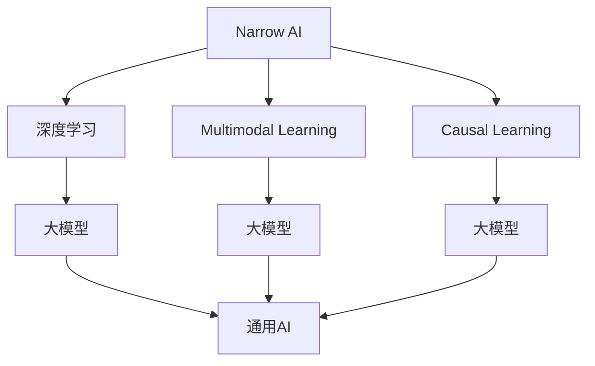

                 

# 2050年的人工智能：从狭义人工智能到通用人工智能的智能进化

> 关键词：人工智能, 通用人工智能, 狭义人工智能, 深度学习, 机器学习, 大模型, 多模态学习, 因果学习, 泛化能力

## 1. 背景介绍

### 1.1 问题由来

自1956年达特茅斯会议以来，人工智能（AI）已经走过了一段曲折而辉煌的发展历程。从早期基于符号推理的专家系统，到20世纪末的基于统计学习的机器学习，再到21世纪初的深度学习革命，AI技术不断进化，引领了技术、产业和社会的深刻变革。然而，这些技术大多聚焦于狭义人工智能（Narrow AI），即特定领域的专业应用，尚未真正实现通用人工智能（General AI）的能力。

通用人工智能是指拥有人类一样全面认知能力的人工智能，能够处理各种复杂问题，理解世界，进行自主学习和创造。尽管当前AI技术在许多特定领域已取得卓越成就，但整体上仍缺乏像人类一样全面和灵活的智能。为此，本文将探讨从狭义人工智能向通用人工智能的智能进化，以及2050年AI技术的发展趋势。

### 1.2 问题核心关键点

面向未来，AI技术的智能进化将遵循以下核心关键点：

- **模型多样性**：深度学习、机器学习、神经网络、遗传算法等多样化的技术手段将被进一步融合，形成更全面、多模态的智能模型。
- **数据驱动与因果学习**：通过数据驱动的统计学习，结合因果推理和逻辑推理，构建具备广泛泛化能力的智能模型。
- **大模型与小模型**：大模型的广泛泛化能力与小模型的参数效率将被有效结合，形成更灵活的智能体系。
- **可解释性与透明性**：智能模型的决策过程将更加透明可解释，便于人类理解和干预。
- **伦理与安全**：构建符合伦理道德的AI系统，避免偏见、歧视和有害行为，确保AI的安全性。

本文将围绕这些关键点，深入探讨2050年AI技术的智能进化路径。

## 2. 核心概念与联系

### 2.1 核心概念概述

为了理解未来AI技术的发展趋势，本节将介绍几个关键概念：

- **狭义人工智能（Narrow AI）**：指仅能解决特定领域问题的AI系统，如图像识别、语音识别等。
- **通用人工智能（General AI）**：指具备人类全面认知能力的AI系统，能够处理各种复杂问题，理解世界，进行自主学习和创造。
- **深度学习（Deep Learning）**：一种基于神经网络模型的机器学习技术，能够自动学习数据的高级特征表示，广泛应用于图像、语音、自然语言处理等领域。
- **大模型（Large Model）**：指参数量巨大的神经网络模型，如BERT、GPT系列模型，拥有强大的泛化能力。
- **多模态学习（Multimodal Learning）**：指融合视觉、听觉、语言等多种数据源的AI学习方式，提升模型的理解和推理能力。
- **因果学习（Causal Learning）**：通过因果推理，理解数据背后的因果关系，提升模型的泛化性和鲁棒性。

这些核心概念之间通过以下Mermaid流程图展示了联系：



这个流程图展示了不同AI技术之间的联系：

1. 狭义AI通过深度学习、多模态学习和因果学习，逐步向通用AI进化。
2. 深度学习、多模态学习、因果学习都依赖于大模型的强大泛化能力，是实现通用AI的重要手段。
3. 大模型通过融合上述技术，最终形成具备全面认知能力的通用AI。

## 3. 核心算法原理 & 具体操作步骤
### 3.1 算法原理概述

面向未来，AI技术将遵循深度学习、多模态学习、因果学习的基本原理，结合大模型的泛化能力，构建具备全面认知能力的通用AI。以下是这些核心技术的基本原理：

#### 3.1.1 深度学习

深度学习通过多层次神经网络模型，自动学习数据的高级特征表示。其核心原理是利用反向传播算法，通过大量标注数据训练模型，不断调整权重参数，优化损失函数，最终使得模型能够准确预测新数据。

#### 3.1.2 多模态学习

多模态学习融合了视觉、听觉、语言等多种数据源，提升了模型的理解和推理能力。其核心原理是通过融合不同模态的数据特征，构建多模态的特征表示，增强模型的泛化能力。

#### 3.1.3 因果学习

因果学习通过因果推理，理解数据背后的因果关系，提升模型的泛化性和鲁棒性。其核心原理是利用因果图、因果链等工具，建模数据中的因果关系，进行因果推断。

### 3.2 算法步骤详解

面向未来，AI技术的智能进化将遵循以下核心步骤：

#### 3.2.1 数据收集与预处理

数据是AI系统的基础，通过大规模的数据收集和预处理，构建高质量的数据集，为模型的训练和优化提供数据支撑。

#### 3.2.2 模型设计与训练

选择合适的模型架构，并利用深度学习、多模态学习、因果学习等技术进行模型设计。在训练过程中，通过梯度下降等优化算法，调整模型参数，最小化损失函数，优化模型性能。

#### 3.2.3 模型评估与优化

在模型训练结束后，通过测试集对模型进行评估，评估指标包括准确率、召回率、F1分数等。根据评估结果，调整模型超参数，优化模型性能。

#### 3.2.4 模型部署与迭代

将训练好的模型部署到实际应用场景中，持续收集反馈数据，进行模型迭代优化，提升模型的泛化能力和适应性。

### 3.3 算法优缺点

面向未来，AI技术的发展将面临以下优缺点：

#### 3.3.1 优点

1. **泛化能力强大**：深度学习、多模态学习和因果学习能够提升模型的泛化能力，适应各种复杂场景。
2. **数据驱动**：通过大量数据驱动的统计学习，构建具备广泛泛化能力的智能模型。
3. **灵活性高**：模型通过融合不同技术，构建多模态、因果推理等复杂模型，提升系统的灵活性和适应性。

#### 3.3.2 缺点

1. **数据依赖**：深度学习、多模态学习、因果学习都需要大量标注数据，数据获取成本较高。
2. **计算资源需求大**：大模型的训练和推理需要大量的计算资源，硬件成本较高。
3. **可解释性不足**：深度学习模型的决策过程缺乏可解释性，难以理解和调试。

### 3.4 算法应用领域

面向未来，AI技术将广泛应用于多个领域，包括但不限于：

- **医疗健康**：构建智能诊断、治疗推荐系统，提升医疗服务的精准性和效率。
- **智能制造**：构建智能生产、质量控制系统，提升制造业的自动化和智能化水平。
- **智慧城市**：构建智能交通、能源管理、公共安全系统，提升城市管理的效率和安全性。
- **教育培训**：构建智能辅导、教学评估系统，提升教育质量和学习效率。
- **金融服务**：构建智能风控、投资决策系统，提升金融服务的精准性和效率。
- **娱乐传媒**：构建智能推荐、内容生成系统，提升用户体验和内容质量。

## 4. 数学模型和公式 & 详细讲解  
### 4.1 数学模型构建

本文将使用数学语言对未来AI技术的智能进化进行更加严格的刻画。

记深度学习模型的输入为 $x \in \mathbb{R}^d$，输出为 $y \in \mathbb{R}^m$，模型参数为 $\theta \in \mathbb{R}^p$。假设模型训练集为 $D=\{(x_i,y_i)\}_{i=1}^N$，则模型的损失函数为：

$$
\mathcal{L}(\theta) = \frac{1}{N} \sum_{i=1}^N \ell(y_i, f_\theta(x_i))
$$

其中 $\ell(y_i, f_\theta(x_i))$ 为样本 $(x_i,y_i)$ 的损失函数，$f_\theta(x)$ 为模型在输入 $x$ 上的输出。常见的损失函数包括交叉熵损失、均方误差损失等。

### 4.2 公式推导过程

以下我们以二分类任务为例，推导交叉熵损失函数及其梯度的计算公式。

假设模型 $f_\theta(x) \in [0,1]$，表示样本属于正类的概率。真实标签 $y \in \{0,1\}$。则二分类交叉熵损失函数定义为：

$$
\ell(y_i, f_\theta(x_i)) = -[y_i\log f_\theta(x_i) + (1-y_i)\log (1-f_\theta(x_i))]
$$

将其代入损失函数公式，得：

$$
\mathcal{L}(\theta) = -\frac{1}{N}\sum_{i=1}^N [y_i\log f_\theta(x_i)+(1-y_i)\log(1-f_\theta(x_i))]
$$

根据链式法则，损失函数对参数 $\theta_k$ 的梯度为：

$$
\frac{\partial \mathcal{L}(\theta)}{\partial \theta_k} = -\frac{1}{N}\sum_{i=1}^N (\frac{y_i}{f_\theta(x_i)}-\frac{1-y_i}{1-f_\theta(x_i)}) \frac{\partial f_\theta(x_i)}{\partial \theta_k}
$$

其中 $\frac{\partial f_\theta(x_i)}{\partial \theta_k}$ 可进一步递归展开，利用自动微分技术完成计算。

### 4.3 案例分析与讲解

以图像识别任务为例，展示深度学习模型的训练和优化过程。

假设模型为卷积神经网络（CNN），输入为图像像素 $x \in \mathbb{R}^{n_1 \times n_2 \times c}$，输出为类别概率 $y \in \mathbb{R}^m$。损失函数为交叉熵损失，模型参数为 $\theta$。训练步骤如下：

1. 收集标注数据集 $D=\{(x_i,y_i)\}_{i=1}^N$，分为训练集、验证集和测试集。
2. 初始化模型参数 $\theta$。
3. 迭代训练：
   - 前向传播：将训练数据 $x_i$ 输入模型，计算预测输出 $y_i = f_\theta(x_i)$。
   - 损失计算：计算样本损失 $\ell(y_i, f_\theta(x_i))$。
   - 梯度计算：利用反向传播计算损失函数对模型参数的梯度。
   - 参数更新：使用梯度下降等优化算法更新模型参数 $\theta$。
4. 验证集评估：在验证集上评估模型性能，防止过拟合。
5. 测试集评估：在测试集上评估模型泛化能力。

通过上述训练过程，模型能够学习到图像特征与类别之间的映射关系，从而在新的未标注图像上进行分类预测。

## 5. 项目实践：代码实例和详细解释说明
### 5.1 开发环境搭建

在进行AI技术实践前，我们需要准备好开发环境。以下是使用Python进行PyTorch开发的环境配置流程：

1. 安装Anaconda：从官网下载并安装Anaconda，用于创建独立的Python环境。

2. 创建并激活虚拟环境：
```bash
conda create -n pytorch-env python=3.8 
conda activate pytorch-env
```

3. 安装PyTorch：根据CUDA版本，从官网获取对应的安装命令。例如：
```bash
conda install pytorch torchvision torchaudio cudatoolkit=11.1 -c pytorch -c conda-forge
```

4. 安装Transformers库：
```bash
pip install transformers
```

5. 安装各类工具包：
```bash
pip install numpy pandas scikit-learn matplotlib tqdm jupyter notebook ipython
```

完成上述步骤后，即可在`pytorch-env`环境中开始AI技术实践。

### 5.2 源代码详细实现

这里我们以图像分类任务为例，给出使用PyTorch和Transformers库进行深度学习模型训练的PyTorch代码实现。

首先，定义图像分类任务的损失函数：

```python
import torch
import torch.nn as nn
import torch.optim as optim

class Net(nn.Module):
    def __init__(self):
        super(Net, self).__init__()
        self.conv1 = nn.Conv2d(3, 6, 5)
        self.pool = nn.MaxPool2d(2, 2)
        self.conv2 = nn.Conv2d(6, 16, 5)
        self.fc1 = nn.Linear(16 * 5 * 5, 120)
        self.fc2 = nn.Linear(120, 84)
        self.fc3 = nn.Linear(84, 10)

    def forward(self, x):
        x = self.pool(torch.relu(self.conv1(x)))
        x = self.pool(torch.relu(self.conv2(x)))
        x = x.view(-1, 16 * 5 * 5)
        x = torch.relu(self.fc1(x))
        x = torch.relu(self.fc2(x))
        x = self.fc3(x)
        return x

net = Net()

criterion = nn.CrossEntropyLoss()
optimizer = optim.SGD(net.parameters(), lr=0.001, momentum=0.9)
```

然后，定义训练和评估函数：

```python
def train(net, train_loader, criterion, optimizer, num_epochs):
    for epoch in range(num_epochs):
        running_loss = 0.0
        for i, data in enumerate(train_loader, 0):
            inputs, labels = data
            optimizer.zero_grad()
            outputs = net(inputs)
            loss = criterion(outputs, labels)
            loss.backward()
            optimizer.step()
            running_loss += loss.item()
            if i % 2000 == 1999:    # 每2000 mini-batch输出一次loss信息
                print('[%d, %5d] loss: %.3f' % (epoch + 1, i + 1, running_loss / 2000))
                running_loss = 0.0
    print('Finished Training')

def test(net, test_loader):
    correct = 0
    total = 0
    with torch.no_grad():
        for data in test_loader:
            images, labels = data
            outputs = net(images)
            _, predicted = torch.max(outputs.data, 1)
            total += labels.size(0)
            correct += (predicted == labels).sum().item()
    print('Accuracy of the network on the 10000 test images: %d %%' % (100 * correct / total))
```

最后，启动训练流程并在测试集上评估：

```python
import torchvision
import torchvision.transforms as transforms
from torch.utils.data import DataLoader

transform = transforms.Compose([transforms.ToTensor(), transforms.Normalize((0.5, 0.5, 0.5), (0.5, 0.5, 0.5))])
trainset = torchvision.datasets.CIFAR10(root='./data', train=True, download=True, transform=transform)
trainloader = torch.utils.data.DataLoader(trainset, batch_size=4, shuffle=True, num_workers=2)

testset = torchvision.datasets.CIFAR10(root='./data', train=False, download=True, transform=transform)
testloader = torch.utils.data.DataLoader(testset, batch_size=4, shuffle=False, num_workers=2)

train(net, trainloader, criterion, optimizer, num_epochs=2)
test(net, testloader)
```

以上就是使用PyTorch和Transformers库进行深度学习模型训练的完整代码实现。

### 5.3 代码解读与分析

让我们再详细解读一下关键代码的实现细节：

**Net类**：
- `__init__`方法：初始化卷积层、池化层、全连接层等关键组件。
- `forward`方法：定义前向传播过程，将输入通过卷积层、池化层、全连接层等进行计算，最终输出预测结果。

**train函数**：
- 迭代训练：对每个mini-batch进行前向传播、损失计算、梯度计算和参数更新。
- 每2000 mini-batch输出一次loss信息，记录训练过程中的损失情况。
- 在训练结束后输出最终训练结果。

**test函数**：
- 对测试集进行遍历，计算模型在测试集上的准确率。
- 使用`torch.no_grad`避免不必要的计算资源消耗。

**训练流程**：
- 定义训练集和测试集的数据加载器，进行数据预处理。
- 初始化模型、损失函数和优化器。
- 开始训练，并记录训练过程中的loss信息。
- 在训练结束后，在测试集上评估模型性能，输出准确率。

可以看到，PyTorch和Transformers库使得深度学习模型的训练过程变得简洁高效。开发者可以将更多精力放在数据处理、模型改进等高层逻辑上，而不必过多关注底层的实现细节。

## 6. 实际应用场景
### 6.1 智能制造

面向未来，AI技术在智能制造中的应用将非常广泛。智能制造系统能够实现生产过程的自动化、智能化，提升生产效率和质量，降低生产成本。

在智能制造中，深度学习、多模态学习、因果学习等技术将广泛应用：

- **预测性维护**：通过分析设备的运行数据，预测设备的故障和维护需求，减少停机时间和维修成本。
- **质量控制**：构建智能检测系统，实时监测产品质量，及时发现缺陷和问题。
- **工艺优化**：通过分析生产过程中的数据，优化工艺流程，提高生产效率和资源利用率。
- **智能调度**：构建智能调度系统，优化生产计划和资源分配，提升生产管理水平。

这些应用场景将使得AI技术在智能制造领域发挥更大的作用，推动制造业的智能化升级。

### 6.2 智慧城市

面向未来，AI技术在智慧城市中的应用将更加广泛，提升城市的运行效率和居民的生活质量。

在智慧城市中，深度学习、多模态学习、因果学习等技术将广泛应用于：

- **智能交通**：构建智能交通系统，实现交通流量预测、交通信号优化、交通违规检测等功能。
- **能源管理**：构建智能能源管理系统，实现能源消耗预测、智能调度、节能优化等功能。
- **公共安全**：构建智能公共安全系统，实现视频监控、异常检测、事件预警等功能。
- **城市管理**：构建智能城市管理系统，实现城市运行状态的实时监控、事件分析、应急响应等功能。

这些应用场景将使得AI技术在智慧城市领域发挥更大的作用，推动城市治理的智能化升级。

### 6.3 金融服务

面向未来，AI技术在金融服务中的应用将非常广泛，提升金融服务的精准性和效率。

在金融服务中，深度学习、多模态学习、因果学习等技术将广泛应用于：

- **风险评估**：构建智能风险评估系统，实时分析客户的信用风险、市场风险，优化信贷和投资决策。
- **智能投顾**：构建智能投顾系统，实时分析市场动态，提供个性化的投资建议。
- **反欺诈**：构建智能反欺诈系统，实时分析交易行为，检测和防范金融欺诈行为。
- **金融监管**：构建智能金融监管系统，实时分析金融市场数据，监控和预警异常情况。

这些应用场景将使得AI技术在金融服务领域发挥更大的作用，推动金融服务的智能化升级。

### 6.4 未来应用展望

面向未来，AI技术的智能进化将呈现出以下几个趋势：

1. **数据驱动与因果学习**：通过数据驱动的统计学习，结合因果推理和逻辑推理，构建具备广泛泛化能力的智能模型。
2. **大模型与小模型**：大模型的广泛泛化能力与小模型的参数效率将被有效结合，形成更灵活的智能体系。
3. **多模态学习**：融合视觉、听觉、语言等多种数据源，提升模型的理解和推理能力。
4. **因果学习**：通过因果推理，理解数据背后的因果关系，提升模型的泛化性和鲁棒性。
5. **可解释性与透明性**：智能模型的决策过程将更加透明可解释，便于人类理解和干预。
6. **伦理与安全**：构建符合伦理道德的AI系统，避免偏见、歧视和有害行为，确保AI的安全性。

这些趋势将引领AI技术向更加智能化、普适化方向发展，为社会带来更广泛、更深刻的影响。

## 7. 工具和资源推荐
### 7.1 学习资源推荐

为了帮助开发者系统掌握未来AI技术的发展趋势，这里推荐一些优质的学习资源：

1. 《深度学习》（Ian Goodfellow著）：全面介绍了深度学习的原理和应用，适合初学者入门。
2. 《Python深度学习》（Francois Chollet著）：通过Python和Keras实现深度学习模型的构建和训练，适合实战学习。
3. 《TensorFlow实战Google深度学习框架》（王晓宇、刘振东、刘智飞等译）：详细介绍TensorFlow的使用方法和实践案例，适合TensorFlow学习者。
4. 《机器学习实战》（Peter Harrington著）：通过Python实现机器学习算法的实战演练，适合初学者入门。
5. 《Caffe深度学习》（Jian Deng等著）：介绍Caffe深度学习框架的使用方法和实践案例，适合Caffe学习者。
6. 《Keras深度学习》（Vincent Vanhoucke、Krebs、Guan等译）：介绍Keras深度学习框架的使用方法和实践案例，适合Keras学习者。
7. 《PyTorch深度学习》（Eli Stevens等著）：详细介绍PyTorch的使用方法和实践案例，适合PyTorch学习者。
8. 《自然语言处理综论》（Christopher Manning、Prabhakar Raghavan、Hinrich Schütze著）：全面介绍了自然语言处理的基础知识和前沿技术，适合NLP学习者。

通过对这些资源的学习实践，相信你一定能够快速掌握未来AI技术的发展趋势，并用于解决实际的AI问题。
### 7.2 开发工具推荐

高效的开发离不开优秀的工具支持。以下是几款用于未来AI技术开发的常用工具：

1. Python：作为AI开发的主要语言，Python的语法简洁，生态丰富，适合多种AI技术的开发。
2. PyTorch：基于Python的开源深度学习框架，灵活动态的计算图，适合快速迭代研究。
3. TensorFlow：由Google主导开发的开源深度学习框架，生产部署方便，适合大规模工程应用。
4. Keras：基于Python的深度学习框架，简单易用，适合快速原型设计和实验。
5. Scikit-learn：Python机器学习库，提供了丰富的机器学习算法和工具，适合数据预处理和特征工程。
6. NLTK：自然语言处理工具包，提供了文本处理和语料库，适合NLP任务的开发。
7. Weights & Biases：模型训练的实验跟踪工具，可以记录和可视化模型训练过程中的各项指标，方便对比和调优。
8. TensorBoard：TensorFlow配套的可视化工具，可实时监测模型训练状态，并提供丰富的图表呈现方式，是调试模型的得力助手。

合理利用这些工具，可以显著提升未来AI技术开发的效率，加快创新迭代的步伐。

### 7.3 相关论文推荐

未来AI技术的发展得益于学界的持续研究。以下是几篇奠基性的相关论文，推荐阅读：

1. "Deep Learning" by Yann LeCun, Yoshua Bengio, Geoffrey Hinton：深度学习领域的开创性论文，介绍了深度学习的原理和应用。
2. "ImageNet Classification with Deep Convolutional Neural Networks" by Alex Krizhevsky, Ilya Sutskever, Geoffrey Hinton：通过卷积神经网络在ImageNet数据集上的成功应用，开启了深度学习在图像识别领域的发展。
3. "Playing Atari with Deep Reinforcement Learning" by Volodymyr Mnih等：通过深度强化学习成功应用于Atari游戏的突破，展示了深度学习在控制和决策领域的潜力。
4. "Generative Adversarial Nets" by Ian Goodfellow, Jean Pouget-Abadie, Méhdi Mirza等：通过对抗生成网络（GAN）技术，成功实现了高质量的图像生成和数据增强，展示了深度学习在生成模型中的应用潜力。
5. "Attention Is All You Need" by Ashish Vaswani等：通过Transformer结构，成功应用于自然语言处理任务，开启了NLP领域的预训练大模型时代。

这些论文代表了大模型和深度学习技术的发展脉络。通过学习这些前沿成果，可以帮助研究者把握学科前进方向，激发更多的创新灵感。

## 8. 总结：未来发展趋势与挑战
### 8.1 总结

本文对未来AI技术的智能进化进行了全面系统的介绍。首先探讨了从狭义人工智能向通用人工智能的进化路径，明确了未来AI技术的发展方向。其次，从原理到实践，详细讲解了深度学习、多模态学习、因果学习的核心算法，给出了AI技术开发的完整代码实例。同时，本文还广泛探讨了AI技术在智能制造、智慧城市、金融服务等多个领域的应用前景，展示了AI技术的发展潜力。此外，本文精选了未来AI技术的各类学习资源，力求为读者提供全方位的技术指引。

通过本文的系统梳理，可以看到，未来AI技术的智能进化将遵循深度学习、多模态学习、因果学习的核心原理，结合大模型的泛化能力，构建具备全面认知能力的通用AI。这些技术的发展将带来更为智能化、普适化的应用，推动社会生产力的全面提升。

### 8.2 未来发展趋势

展望未来，AI技术的智能进化将呈现出以下几个趋势：

1. **数据驱动与因果学习**：通过数据驱动的统计学习，结合因果推理和逻辑推理，构建具备广泛泛化能力的智能模型。
2. **大模型与小模型**：大模型的广泛泛化能力与小模型的参数效率将被有效结合，形成更灵活的智能体系。
3. **多模态学习**：融合视觉、听觉、语言等多种数据源，提升模型的理解和推理能力。
4. **因果学习**：通过因果推理，理解数据背后的因果关系，提升模型的泛化性和鲁棒性。
5. **可解释性与透明性**：智能模型的决策过程将更加透明可解释，便于人类理解和干预。
6. **伦理与安全**：构建符合伦理道德的AI系统，避免偏见、歧视和有害行为，确保AI的安全性。

这些趋势将引领AI技术向更加智能化、普适化方向发展，为社会带来更广泛、更深刻的影响。

### 8.3 面临的挑战

尽管未来AI技术的发展前景广阔，但在迈向更加智能化、普适化应用的过程中，它仍面临诸多挑战：

1. **数据依赖**：深度学习、多模态学习、因果学习都需要大量标注数据，数据获取成本较高。
2. **计算资源需求大**：大模型的训练和推理需要大量的计算资源，硬件成本较高。
3. **可解释性不足**：深度学习模型的决策过程缺乏可解释性，难以理解和调试。
4. **伦理与安全**：构建符合伦理道德的AI系统，避免偏见、歧视和有害行为，确保AI的安全性。
5. **技术复杂性**：未来AI技术涉及多种技术的融合，技术复杂性较高，需要跨学科团队协作。

这些挑战需要在技术、伦理、社会等多个层面进行全面应对，才能确保未来AI技术的健康发展。

### 8.4 研究展望

未来AI技术的研究需要在以下几个方面寻求新的突破：

1. **数据获取与标注**：开发高效的数据获取和标注技术，降低数据依赖，提高数据质量。
2. **计算资源优化**：优化深度学习、多模态学习、因果学习等技术，降低计算资源需求，提高模型效率。
3. **模型解释性**：研究可解释的深度学习模型，增强模型的透明性和可解释性，便于人类理解和调试。
4. **伦理与安全性**：构建符合伦理道德的AI系统，确保AI的安全性和公平性。
5. **跨学科协作**：加强与心理学、哲学、社会学等多学科的交叉融合，提升AI技术的伦理和社会责任。

这些研究方向将推动AI技术向更加智能化、普适化方向发展，为社会带来更广泛、更深刻的影响。

## 9. 附录：常见问题与解答

**Q1：未来AI技术的智能进化将遵循哪些核心原理？**

A: 未来AI技术的智能进化将遵循深度学习、多模态学习、因果学习的核心原理。通过数据驱动的统计学习，结合因果推理和逻辑推理，构建具备广泛泛化能力的智能模型。

**Q2：未来AI技术在智能制造中的应用有哪些？**

A: 未来AI技术在智能制造中的应用包括预测性维护、质量控制、工艺优化和智能调度等。通过深度学习、多模态学习、因果学习等技术，提升生产效率和质量，降低生产成本。

**Q3：未来AI技术在智慧城市中的应用有哪些？**

A: 未来AI技术在智慧城市中的应用包括智能交通、能源管理、公共安全和城市管理等。通过深度学习、多模态学习、因果学习等技术，提升城市的运行效率和居民的生活质量。

**Q4：未来AI技术在金融服务中的应用有哪些？**

A: 未来AI技术在金融服务中的应用包括风险评估、智能投顾、反欺诈和金融监管等。通过深度学习、多模态学习、因果学习等技术，提升金融服务的精准性和效率。

**Q5：未来AI技术面临哪些挑战？**

A: 未来AI技术面临的挑战包括数据依赖、计算资源需求大、可解释性不足、伦理与安全、技术复杂性等。需要在技术、伦理、社会等多个层面进行全面应对。

通过本文的系统梳理，可以看到，未来AI技术的智能进化将遵循深度学习、多模态学习、因果学习的核心原理，结合大模型的泛化能力，构建具备全面认知能力的通用AI。这些技术的发展将带来更为智能化、普适化的应用，推动社会生产力的全面提升。然而，未来AI技术在迈向更加智能化、普适化应用的过程中，仍面临诸多挑战，需要在技术、伦理、社会等多个层面进行全面应对。只有通过跨学科协作、伦理与安全、数据获取与标注等多方面的努力，才能确保未来AI技术的健康发展，为社会带来更广泛、更深刻的影响。

---

作者：禅与计算机程序设计艺术 / Zen and the Art of Computer Programming

