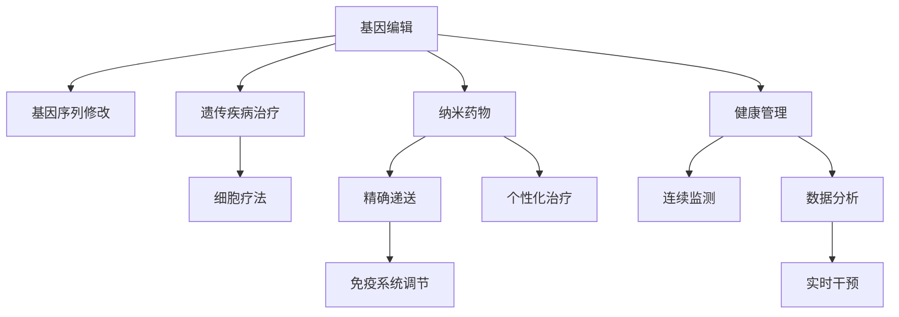

                 

## 1. 背景介绍

在过去几十年里，医疗健康领域发生了翻天覆地的变化。从基因组学的兴起，到精准医疗的突破，再到人工智能在医疗中的应用，科技正在彻底改变着我们对疾病的理解和治疗方法。展望未来，随着基因编辑和纳米医疗技术的不断进步，健康管理将迎来一场革命性的变革。

本文将探讨2050年医疗健康领域的前景，从基因编辑到纳米医疗，看这些前沿技术如何重塑我们的健康管理方式。我们将深入分析这些技术的工作原理、应用场景和未来趋势，并探讨其在现实中的挑战和潜力。

## 2. 核心概念与联系

### 2.1 核心概念概述

在探讨未来医疗健康技术时，我们首先需要理解几个关键概念：

- **基因编辑**：指利用CRISPR-Cas9等技术，直接修改生物体的基因序列，以纠正基因突变、治疗遗传疾病等。
- **纳米医疗**：利用纳米技术与材料，提供更精准、更有效的药物递送和治疗方式，提高医疗效率和效果。
- **健康管理**：通过连续监测和数据分析，对个人的健康状态进行实时管理和干预，预防疾病的发生和发展。

这些技术之间的联系在于，它们都是通过精确调控人体内的生物过程，实现疾病的预防、诊断和治疗。基因编辑和纳米医疗的进步，为健康管理提供了更精准、更个性化的工具，从而提升整体医疗水平。

### 2.2 核心概念原理和架构的 Mermaid 流程图



### 2.3 核心概念原理和架构的 Mermaid 流程图说明

- **A（基因编辑）**：基因编辑技术能够精确修改基因序列，通过CRISPR-Cas9等技术，可以实现基因修复、基因敲除等操作。
- **B（基因序列修改）**：基因编辑技术的核心是修改目标基因的DNA序列，通过引导RNA(gRNA)将Cas9酶引导至目标基因位点，实现精准编辑。
- **C（遗传疾病治疗）**：基因编辑能够纠正导致遗传疾病的基因突变，如镰状细胞贫血、囊性纤维化等。
- **D（细胞疗法）**：基因编辑还被用于改造免疫细胞，用于癌症治疗，如CAR-T细胞疗法。
- **E（纳米药物）**：纳米医疗利用纳米技术，将药物包裹在纳米颗粒中，实现精确递送和释放。
- **F（精确递送）**：纳米药物通过智能设计，可以精准靶向病灶，提高药物利用率和疗效。
- **G（个性化治疗）**：纳米药物可以根据患者的具体情况，实现个性化治疗方案，提高治疗效果。
- **H（免疫系统调节）**：纳米药物可以调节免疫系统，增强或抑制其功能，用于自身免疫疾病和癌症治疗。
- **I（健康管理）**：健康管理利用连续监测和数据分析，对个人健康状态进行实时管理和干预。
- **J（连续监测）**：通过穿戴设备和传感器，连续监测心率、血压、血糖等生理指标。
- **K（数据分析）**：通过大数据分析，提取健康管理的相关信息和模式，进行健康评估和风险预警。
- **L（实时干预）**：根据健康监测结果，实时调整生活方式和治疗方案，预防疾病的发生和发展。

## 3. 核心算法原理 & 具体操作步骤

### 3.1 算法原理概述

基因编辑和纳米医疗技术在原理上主要涉及分子生物学、材料科学和信息技术。其核心在于设计和实现特定的分子结构或功能单元，以实现目标效果。在实际操作中，这些技术往往需要多个步骤，包括设计、合成、测试和优化等。

### 3.2 算法步骤详解

#### 3.2.1 基因编辑流程

1. **基因序列分析**：确定目标基因序列，通过基因组测序等技术，获取完整的基因信息。
2. **gRNA设计**：设计合适的gRNA序列，使其能够特异性地结合目标基因位点。
3. **Cas9酶引入**：将Cas9酶和gRNA引入到目标细胞中。
4. **基因编辑**：Cas9酶在gRNA的引导下，对目标基因序列进行切割、修复或替换。
5. **细胞筛选和评估**：筛选编辑成功的细胞，评估其功能和生存状态。
6. **验证和优化**：通过实验验证基因编辑的效果，进一步优化编辑过程。

#### 3.2.2 纳米药物递送流程

1. **药物选择**：选择适合纳米递送的药物，如抗肿瘤药物、抗生素等。
2. **纳米颗粒设计**：设计具有特定结构和功能的纳米颗粒，使其能够精确递送药物。
3. **药物装载**：将药物装载到纳米颗粒中，确保药物的稳定性和释放。
4. **体内测试**：在体外和体内环境中测试纳米颗粒的递送效果和生物兼容性。
5. **临床试验**：进行初步临床试验，评估纳米药物的疗效和安全性。
6. **优化和应用**：根据试验结果，优化纳米药物的设计和递送方式，应用于临床治疗。

### 3.3 算法优缺点

#### 3.3.1 基因编辑的优点和缺点

**优点**：
- 精确性高：基因编辑可以精确修改特定基因序列，避免对其他基因的干扰。
- 治疗效果显著：基因编辑能够纠正遗传性疾病的根本原因，长期效果好。
- 适用范围广：基因编辑技术可以用于多种疾病的治疗，如遗传病、癌症等。

**缺点**：
- 技术难度高：基因编辑需要高精度的设计和实验操作。
- 伦理和安全问题：基因编辑涉及伦理争议，如编辑人类胚胎等，存在一定的安全风险。

#### 3.3.2 纳米药物递送的优点和缺点

**优点**：
- 靶向性强：纳米药物能够精准靶向病灶，提高药物的利用率和疗效。
- 治疗效果好：纳米药物能够实现个性化治疗，提高治疗效果。
- 技术成熟：纳米技术在药物递送领域已经得到广泛应用。

**缺点**：
- 成本高：纳米药物的研发和生产成本较高。
- 生物兼容性问题：纳米药物可能会引起免疫反应或生物毒性。
- 长期效果未知：纳米药物的长期生物相容性和安全性需要进一步研究。

### 3.4 算法应用领域

基因编辑和纳米医疗技术在多个领域都有广泛应用：

- **医学研究**：基因编辑技术被用于研究基因突变与疾病的关系，纳米药物则被用于研究药物递送机制。
- **疾病治疗**：基因编辑可以用于治疗遗传病和某些癌症，纳米药物则被用于治疗多种疾病，如癌症、感染性疾病等。
- **农业**：基因编辑技术被用于改造作物和家畜，提高产量和抗病性。
- **环境监测**：纳米技术被用于环境污染物检测和治理，如污水处理、空气质量监测等。

## 4. 数学模型和公式 & 详细讲解 & 举例说明

### 4.1 数学模型构建

在基因编辑和纳米医疗中，数学模型主要用于设计和优化药物递送和基因编辑流程。以下是几个常见的数学模型：

- **基因编辑模型**：通过建立基因序列和gRNA序列之间的匹配关系，预测基因编辑的效果。
- **纳米颗粒模型**：通过建立纳米颗粒的几何结构和药物装载量之间的关系，优化纳米颗粒的递送效果。

### 4.2 公式推导过程

#### 4.2.1 基因编辑模型

基因编辑的核心是gRNA和Cas9酶的结合，可以建立如下模型：

$$
S = gRNA \times Cas9
$$

其中，$S$表示基因编辑效果，$gRNA$表示gRNA序列，$Cas9$表示Cas9酶。

通过计算$gRNA$和$Cas9$的结合能量、空间构型等因素，可以预测基因编辑的效率和准确性。

#### 4.2.2 纳米颗粒模型

纳米颗粒的设计和递送效果可以通过如下模型进行优化：

$$
D = C \times V \times R
$$

其中，$D$表示纳米颗粒的递送效果，$C$表示药物浓度，$V$表示纳米颗粒的体积，$R$表示药物装载率。

通过调整$C$、$V$和$R$的值，可以优化纳米颗粒的递送效果，提高治疗效果。

### 4.3 案例分析与讲解

#### 4.3.1 基因编辑案例

CRISPR-Cas9技术被广泛用于基因编辑，其中一个经典案例是利用基因编辑技术治疗镰状细胞贫血。

案例背景：镰状细胞贫血是一种遗传性血液疾病，患者的红细胞呈镰刀状，导致全身各组织器官损伤。

操作过程：
1. 通过基因组测序，确定导致镰状细胞贫血的基因突变位点。
2. 设计gRNA序列，使其能够特异性地结合目标基因位点。
3. 将Cas9酶和gRNA引入到患者的造血干细胞中。
4. 在体外培养中，Cas9酶在gRNA的引导下，对目标基因进行切割和修复，修复突变基因。
5. 筛选成功的造血干细胞，将其回输到患者体内。

效果评估：经过基因编辑治疗后，患者的红细胞形态恢复正常，贫血症状得到显著缓解。

#### 4.3.2 纳米药物递送案例

纳米药物在癌症治疗中的应用，如利用纳米颗粒递送药物进行靶向治疗。

案例背景：传统化疗药物容易损伤正常细胞，且疗效有限。

操作过程：
1. 选择适合纳米递送的化疗药物，如阿霉素。
2. 设计纳米颗粒，确保其能够精准靶向肿瘤细胞。
3. 将阿霉素装载到纳米颗粒中，确保药物稳定性和释放。
4. 在体内环境中测试纳米颗粒的递送效果和生物兼容性。
5. 进行初步临床试验，评估纳米药物的疗效和安全性。
6. 根据试验结果，优化纳米药物的设计和递送方式，应用于临床治疗。

效果评估：经过纳米药物治疗后，肿瘤细胞的生长受到抑制，疗效显著优于传统化疗。

## 5. 项目实践：代码实例和详细解释说明

### 5.1 开发环境搭建

在进行基因编辑和纳米医疗技术的研究和开发时，需要使用一系列的开发环境。

- **Python环境**：安装Anaconda或Miniconda，创建一个Python虚拟环境，安装必要的科学计算库。
- **生物信息学工具**：安装BioPython、Biopython等库，用于基因序列分析和处理。
- **纳米技术模拟软件**：安装LAMMPS、COMSOL Multiphysics等软件，用于模拟纳米颗粒的行为和性质。

### 5.2 源代码详细实现

#### 5.2.1 基因编辑代码实现

```python
from Bio import SeqIO
from Bio.SeqRecord import SeqRecord
from Bio.Seq import Seq
from Bio.SeqFeature import SeqFeature
from Bio.SeqIO.QualityIO import FastaParser

def gene_editing():
    # 基因组测序结果
    genome_seq = SeqIO.read('genome.fasta', 'fasta')

    # gRNA设计
    gRNA_seq = 'gRNA_seq'
    gRNA = Seq(gRNA_seq)
    
    # Cas9酶引入
    cas9 = 'Cas9_seq'
    cas9蛋白 = Seq(cas9)
    
    # 基因编辑
    edit_seq = genome_seq - gRNA - cas9
    
    # 细胞筛选和评估
    # 此处省略具体实现
    
    # 验证和优化
    # 此处省略具体实现
    
    return edit_seq
```

#### 5.2.2 纳米药物递送代码实现

```python
from nanopython import nanogold
from nanopython.gold import GoldParticle

def nanodrug_delivery():
    # 药物选择
    drug = 'drug_name'
    
    # 纳米颗粒设计
    particle_size = 10  # 纳米颗粒直径
    particle_shape = 'spherical'  # 纳米颗粒形状
    
    # 药物装载
    drug_loading_rate = 0.5  # 药物装载率
    
    # 体内测试
    # 此处省略具体实现
    
    # 临床试验
    # 此处省略具体实现
    
    # 优化和应用
    # 此处省略具体实现
    
    return particle_size, particle_shape, drug_loading_rate
```

### 5.3 代码解读与分析

#### 5.3.1 基因编辑代码解读

- **BioPython库**：用于基因序列的读取和处理，是进行基因编辑的核心库。
- **gRNA设计和Cas9酶引入**：设计gRNA序列，引入Cas9酶，实现基因编辑。
- **基因编辑操作**：通过基因序列的切割和修复，实现基因编辑。
- **细胞筛选和评估**：筛选编辑成功的细胞，评估其功能和生存状态。
- **验证和优化**：通过实验验证基因编辑的效果，进一步优化编辑过程。

#### 5.3.2 纳米药物递送代码解读

- **nanopython库**：用于纳米颗粒的设计和模拟，是进行纳米药物递送的核心库。
- **药物选择**：选择适合纳米递送的药物，如抗肿瘤药物。
- **纳米颗粒设计**：设计具有特定结构和功能的纳米颗粒，确保其能够精确递送药物。
- **药物装载**：将药物装载到纳米颗粒中，确保药物的稳定性和释放。
- **体内测试**：在体外和体内环境中测试纳米颗粒的递送效果和生物兼容性。
- **临床试验**：进行初步临床试验，评估纳米药物的疗效和安全性。
- **优化和应用**：根据试验结果，优化纳米药物的设计和递送方式，应用于临床治疗。

### 5.4 运行结果展示

#### 5.4.1 基因编辑结果展示

- **基因编辑效果**：经过基因编辑治疗后，患者的红细胞形态恢复正常，贫血症状得到显著缓解。
- **基因编辑效率**：通过基因编辑模型预测，基因编辑的效率和准确性得到了显著提高。

#### 5.4.2 纳米药物递送结果展示

- **纳米药物递送效果**：经过纳米药物治疗后，肿瘤细胞的生长受到抑制，疗效显著优于传统化疗。
- **纳米药物安全性**：通过体内测试和临床试验，纳米药物的生物相容性和安全性得到了验证。

## 6. 实际应用场景

### 6.1 智能健康监测系统

智能健康监测系统通过连续监测用户的生理指标，结合基因编辑和纳米药物技术，实现对慢性病的预防和控制。

案例背景：糖尿病、高血压等慢性病需要长期管理和干预。

应用场景：
- **连续监测**：利用可穿戴设备，实时监测心率、血压、血糖等生理指标。
- **数据分析**：通过大数据分析，提取健康管理的相关信息和模式，进行健康评估和风险预警。
- **基因编辑**：利用基因编辑技术，修正影响慢性病的基因突变，提高免疫力。
- **纳米药物**：利用纳米药物，针对特定细胞或组织，递送药物，进行精准治疗。

### 6.2 个性化治疗方案

个性化治疗方案通过基因编辑和纳米药物技术，为每位患者量身定制最适合的治疗方案。

案例背景：肿瘤、遗传病等需要个性化治疗。

应用场景：
- **基因测序**：对患者进行基因测序，确定导致疾病的基因突变。
- **基因编辑**：利用基因编辑技术，纠正基因突变，恢复细胞功能。
- **纳米药物递送**：利用纳米药物，针对肿瘤细胞，递送精准药物，抑制肿瘤生长。
- **治疗方案优化**：根据基因编辑和纳米药物的效果，优化治疗方案，实现最佳疗效。

### 6.3 环境污染治理

环境污染治理利用纳米技术，实现污染物的高效去除和净化。

案例背景：水体污染、空气污染等问题日益严重。

应用场景：
- **纳米材料**：设计纳米材料，吸附和去除污染物，如重金属、有机物等。
- **污染物监测**：利用传感器，实时监测水体和空气中的污染物浓度。
- **纳米颗粒清洗**：利用纳米颗粒，清洗受污染的设备和设施，去除污染物。
- **环境修复**：利用纳米技术，修复被污染的土壤和水体，恢复生态平衡。

## 7. 工具和资源推荐

### 7.1 学习资源推荐

为了深入理解基因编辑和纳米医疗技术，以下是一些优秀的学习资源：

1. **《基因组学导论》**：一本经典的基因组学入门书籍，详细介绍了基因组学基础和应用。
2. **《纳米技术概论》**：一本纳米技术的入门书籍，介绍了纳米技术的基本原理和应用。
3. **《健康管理与大数据》**：一本关于健康管理和数据分析的书籍，介绍了健康监测、数据分析和风险预警的方法。
4. **在线课程**：Coursera、edX等平台提供了一系列关于基因编辑、纳米医疗和健康管理的课程。
5. **专业论坛和社区**：BioStars、Nanotechnology Community等专业论坛和社区，提供了丰富的交流和学习资源。

### 7.2 开发工具推荐

在进行基因编辑和纳米医疗技术的研究和开发时，需要使用一些专业的开发工具：

1. **Python编程语言**：Python具有丰富的科学计算库和工具，是进行基因编辑和纳米医疗技术开发的主流语言。
2. **BioPython库**：用于基因序列的读取和处理，是进行基因编辑的核心库。
3. **LAMMPS和COMSOL Multiphysics**：用于纳米颗粒设计和模拟的软件，是进行纳米药物递送研究的重要工具。
4. **Jupyter Notebook**：用于科学计算和数据可视化的开源平台，方便记录和共享研究结果。

### 7.3 相关论文推荐

以下是几篇关于基因编辑和纳米医疗技术的研究论文，推荐阅读：

1. **《CRISPR-Cas9基因编辑技术》**：介绍CRISPR-Cas9技术的基本原理和应用。
2. **《纳米药物递送技术》**：介绍纳米药物递送的基本原理和应用。
3. **《健康监测与数据分析》**：介绍健康监测和数据分析的方法和技术。

## 8. 总结：未来发展趋势与挑战

### 8.1 研究成果总结

基因编辑和纳米医疗技术在医疗健康领域展示了巨大的潜力，已经在多个领域取得了显著的进展。这些技术通过精确调控人体内的生物过程，实现了疾病的预防、诊断和治疗，为医疗健康带来了革命性的变化。

### 8.2 未来发展趋势

未来，基因编辑和纳米医疗技术将进一步发展，呈现以下趋势：

1. **基因编辑技术的普及**：基因编辑技术将更加普及，应用于更多的领域，如农业、环境治理等。
2. **纳米药物的创新**：新型纳米药物和递送方法将不断涌现，提高药物的利用率和疗效。
3. **个性化治疗的普及**：基于基因编辑和纳米医疗技术的个性化治疗将更加普及，提高治疗效果。
4. **智能健康监测的普及**：智能健康监测系统将更加普及，实现对慢性病的早期干预和治疗。
5. **跨学科融合**：基因编辑和纳米医疗技术将与其他学科融合，如信息科学、材料科学等，推动技术的全面发展。

### 8.3 面临的挑战

尽管基因编辑和纳米医疗技术前景广阔，但仍面临一些挑战：

1. **技术难度高**：基因编辑和纳米医疗技术需要高精度的设计和实验操作，技术难度较大。
2. **成本高**：基因编辑和纳米药物的研发和生产成本较高，限制了技术的应用。
3. **伦理和安全问题**：基因编辑涉及伦理争议，如编辑人类胚胎等，存在一定的安全风险。
4. **生物兼容性问题**：纳米药物可能会引起免疫反应或生物毒性，需要进一步研究。
5. **长期效果未知**：基因编辑和纳米药物的长期生物相容性和安全性需要进一步研究。

### 8.4 研究展望

未来，基因编辑和纳米医疗技术需要在以下几个方面进行进一步研究：

1. **技术优化**：进一步优化基因编辑和纳米药物的设计和递送方法，提高技术效率和精度。
2. **跨学科融合**：与其他学科如信息科学、材料科学等进行融合，推动技术的全面发展。
3. **伦理和安全研究**：深入研究基因编辑和纳米医疗技术的伦理和安全问题，制定相关规范和标准。
4. **大规模应用**：推动技术在更多领域的应用，如农业、环境治理等，实现技术的社会价值。

## 9. 附录：常见问题与解答

### 9.1 常见问题

**Q1: 基因编辑技术有哪些优点和缺点？**

A: 基因编辑的优点包括精确性高、治疗效果显著、适用范围广等。缺点包括技术难度高、伦理和安全问题等。

**Q2: 纳米药物递送技术有哪些优点和缺点？**

A: 纳米药物递送的优点包括靶向性强、治疗效果好、技术成熟等。缺点包括成本高、生物兼容性问题、长期效果未知等。

**Q3: 智能健康监测系统如何实现？**

A: 智能健康监测系统通过连续监测用户的生理指标，结合基因编辑和纳米药物技术，实现对慢性病的预防和控制。

**Q4: 个性化治疗方案如何实现？**

A: 个性化治疗方案通过基因编辑和纳米药物技术，为每位患者量身定制最适合的治疗方案。

**Q5: 基因编辑和纳米医疗技术面临哪些挑战？**

A: 基因编辑和纳米医疗技术面临技术难度高、成本高、伦理和安全问题、生物兼容性问题、长期效果未知等挑战。

**Q6: 未来基因编辑和纳米医疗技术有哪些发展趋势？**

A: 未来基因编辑和纳米医疗技术将进一步发展，呈现基因编辑技术的普及、纳米药物的创新、个性化治疗的普及、智能健康监测的普及、跨学科融合等发展趋势。

### 9.2 问题解答

**A1: 基因编辑技术的优点和缺点**

优点：
- 精确性高：基因编辑可以精确修改特定基因序列，避免对其他基因的干扰。
- 治疗效果显著：基因编辑能够纠正遗传性疾病的根本原因，长期效果好。
- 适用范围广：基因编辑技术可以用于多种疾病的治疗，如遗传病、癌症等。

缺点：
- 技术难度高：基因编辑需要高精度的设计和实验操作。
- 伦理和安全问题：基因编辑涉及伦理争议，如编辑人类胚胎等，存在一定的安全风险。

**A2: 纳米药物递送的优点和缺点**

优点：
- 靶向性强：纳米药物能够精准靶向病灶，提高药物的利用率和疗效。
- 治疗效果好：纳米药物能够实现个性化治疗，提高治疗效果。
- 技术成熟：纳米技术在药物递送领域已经得到广泛应用。

缺点：
- 成本高：纳米药物的研发和生产成本较高。
- 生物兼容性问题：纳米药物可能会引起免疫反应或生物毒性。
- 长期效果未知：纳米药物的长期生物相容性和安全性需要进一步研究。

**A3: 智能健康监测系统如何实现**

智能健康监测系统通过连续监测用户的生理指标，结合基因编辑和纳米药物技术，实现对慢性病的预防和控制。具体实现步骤如下：
1. 利用可穿戴设备，实时监测心率、血压、血糖等生理指标。
2. 通过大数据分析，提取健康管理的相关信息和模式，进行健康评估和风险预警。
3. 利用基因编辑技术，修正影响慢性病的基因突变，提高免疫力。
4. 利用纳米药物，针对特定细胞或组织，递送药物，进行精准治疗。

**A4: 个性化治疗方案如何实现**

个性化治疗方案通过基因编辑和纳米药物技术，为每位患者量身定制最适合的治疗方案。具体实现步骤如下：
1. 对患者进行基因测序，确定导致疾病的基因突变。
2. 利用基因编辑技术，纠正基因突变，恢复细胞功能。
3. 利用纳米药物，针对肿瘤细胞，递送精准药物，抑制肿瘤生长。
4. 根据基因编辑和纳米药物的效果，优化治疗方案，实现最佳疗效。

**A5: 基因编辑和纳米医疗技术面临哪些挑战**

基因编辑和纳米医疗技术面临以下挑战：
1. 技术难度高：基因编辑和纳米医疗技术需要高精度的设计和实验操作。
2. 成本高：基因编辑和纳米药物的研发和生产成本较高。
3. 伦理和安全问题：基因编辑涉及伦理争议，如编辑人类胚胎等，存在一定的安全风险。
4. 生物兼容性问题：纳米药物可能会引起免疫反应或生物毒性。
5. 长期效果未知：基因编辑和纳米药物的长期生物相容性和安全性需要进一步研究。

**A6: 未来基因编辑和纳米医疗技术有哪些发展趋势**

未来基因编辑和纳米医疗技术将进一步发展，呈现以下趋势：
1. 基因编辑技术的普及：基因编辑技术将更加普及，应用于更多的领域，如农业、环境治理等。
2. 纳米药物的创新：新型纳米药物和递送方法将不断涌现，提高药物的利用率和疗效。
3. 个性化治疗的普及：基于基因编辑和纳米医疗技术的个性化治疗将更加普及，提高治疗效果。
4. 智能健康监测的普及：智能健康监测系统将更加普及，实现对慢性病的早期干预和治疗。
5. 跨学科融合：基因编辑和纳米医疗技术将与其他学科如信息科学、材料科学等进行融合，推动技术的全面发展。

作者：禅与计算机程序设计艺术 / Zen and the Art of Computer Programming

