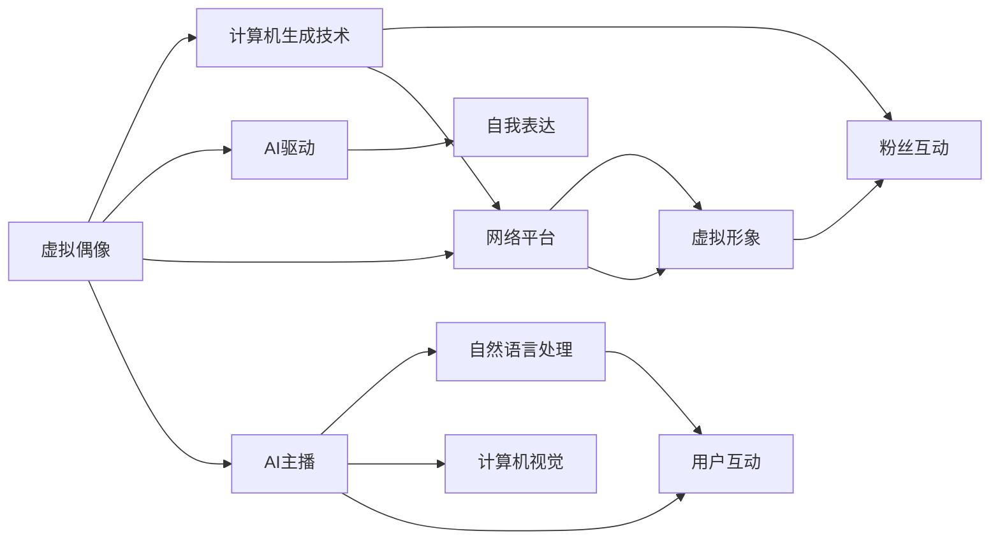

                 

# 2050年的数字创意：从虚拟偶像到AI主播的数字娱乐产业

## 1. 背景介绍

在2050年的数字时代，科技和创意艺术已经深度融合，塑造了一个全新的数字娱乐产业生态。虚拟偶像、AI主播等数字创意产品，正在成为人们生活和娱乐的新常态。本文将深入探讨这些数字创意技术的核心概念、原理与操作，分析其实际应用场景，展望其未来发展趋势，并提供相关学习资源、开发工具和论文推荐。

## 2. 核心概念与联系

### 2.1 核心概念概述

#### 2.1.1 虚拟偶像（Virtual Idols）

虚拟偶像是一种基于计算机生成技术（CGI）和人工智能（AI）驱动的虚拟人物，可以模拟人类的外观、声音和行为，并具备自我表达能力。虚拟偶像通过网络平台进行互动，能够吸引大量粉丝，形成独特的粉丝文化。

#### 2.1.2 AI主播（AI Broadcasters）

AI主播是一种结合了自然语言处理（NLP）和计算机视觉（CV）技术的智能主播，能够自动播报新闻、主持节目、与用户互动等。AI主播的语音和表情可以模拟真人主播，提供更个性化、精准的播报服务。

### 2.2 核心概念原理和架构的 Mermaid 流程图



## 3. 核心算法原理 & 具体操作步骤

### 3.1 算法原理概述

#### 3.1.1 虚拟偶像的生成与互动

虚拟偶像的生成通常基于深度生成模型（如GAN、VAE），通过训练生成虚拟人物的外观、声音和动作。而其互动则依赖自然语言处理模型，能够理解用户的指令并做出反应。

#### 3.1.2 AI主播的播报与互动

AI主播的播报依赖于语音合成和情感计算技术，能够生成逼真的语音和情感丰富的表情。互动则通过NLP模型实现，能够理解和响应用户的提问，提供个性化的播报内容。

### 3.2 算法步骤详解

#### 3.2.1 虚拟偶像生成步骤

1. **数据收集**：收集大量虚拟偶像的人体姿态、面部表情、动作等数据。
2. **生成模型训练**：使用GAN或VAE训练生成模型，生成虚拟偶像的外观和动作。
3. **自然语言处理**：训练NLP模型，使虚拟偶像能够理解用户的指令和情感。
4. **互动系统构建**：构建虚拟偶像的互动系统，使虚拟偶像能够与用户进行多轮对话。

#### 3.2.2 AI主播播报与互动步骤

1. **语音合成**：使用TTS模型（如Tacotron、WaveNet）生成主播的语音。
2. **情感计算**：使用情感计算模型，根据文本内容生成情感丰富的表情。
3. **NLP模型训练**：训练NLP模型，使AI主播能够理解用户的提问并做出回答。
4. **用户互动**：构建用户交互界面，使AI主播能够接收用户的输入并给出回答。

### 3.3 算法优缺点

#### 3.3.1 虚拟偶像的优缺点

**优点**：
- **创新性**：虚拟偶像的创意无限，可以设计出独特的外观和性格。
- **互动性**：虚拟偶像能够24小时在线互动，提供持续的娱乐体验。
- **可扩展性**：虚拟偶像的数据和模型可以不断更新，保持新鲜感。

**缺点**：
- **成本高**：生成模型和训练数据的成本较高。
- **情感深度不足**：虚拟偶像缺乏真实的情感体验，可能影响用户互动质量。

#### 3.3.2 AI主播的优缺点

**优点**：
- **实时性**：AI主播能够实时播报新闻、主持节目，提供即时的信息服务。
- **多任务处理**：AI主播可以同时处理多个用户的互动请求，提高效率。
- **跨平台适用**：AI主播可以适应各种平台，如视频网站、社交媒体等。

**缺点**：
- **技术门槛高**：需要结合语音合成、情感计算和NLP等多项技术，实现难度较大。
- **人性化不足**：AI主播缺乏人类的自然情感和个性化表达，可能影响用户体验。

### 3.4 算法应用领域

#### 3.4.1 虚拟偶像的应用领域

- **娱乐领域**：虚拟偶像可以参与虚拟演唱会、舞蹈表演等娱乐活动，吸引粉丝关注。
- **教育领域**：虚拟偶像可以担任虚拟教师，提供个性化的教学内容。
- **广告领域**：虚拟偶像可以担任虚拟代言人，进行品牌推广。

#### 3.4.2 AI主播的应用领域

- **新闻播报**：AI主播可以自动播报新闻，提供实时信息服务。
- **节目主持**：AI主播可以主持各种类型的节目，如访谈、脱口秀等。
- **客户服务**：AI主播可以用于客服系统，提供自动化的客户服务。

## 4. 数学模型和公式 & 详细讲解 & 举例说明

### 4.1 数学模型构建

#### 4.1.1 虚拟偶像生成模型

虚拟偶像的生成模型基于生成对抗网络（GAN）或变分自编码器（VAE），模型结构如下：

$$
\begin{aligned}
G(\mathbf{z}) &= \mathbf{x} \\
L_G &= \mathbb{E}_{\mathbf{z} \sim \mathcal{N}(0,1)} [D(G(\mathbf{z}))] \\
L_D &= \mathbb{E}_{\mathbf{x} \sim \mathcal{X}} [D(x)] + \mathbb{E}_{\mathbf{z} \sim \mathcal{N}(0,1)} [1-D(G(\mathbf{z}))]
\end{aligned}
$$

其中，$G$ 为生成器，$D$ 为判别器，$\mathbf{z}$ 为随机噪声，$\mathbf{x}$ 为生成样本，$\mathcal{N}(0,1)$ 为标准正态分布。

#### 4.1.2 AI主播播报与互动模型

AI主播的播报模型使用TTS模型（如Tacotron、WaveNet），模型结构如下：

$$
\begin{aligned}
\hat{y} &= \text{Encoder}(x) \\
\hat{h} &= \text{Attention}(\hat{y}, C) \\
\hat{y} &= \text{Decoder}(\hat{h}, C) \\
L &= \text{Loss}(\hat{y}, y)
\end{aligned}
$$

其中，$x$ 为输入文本，$y$ 为输出语音，$\hat{y}$ 为预测语音，$\text{Encoder}$ 为编码器，$\text{Attention}$ 为注意力机制，$\text{Decoder}$ 为解码器，$C$ 为上下文信息。

### 4.2 公式推导过程

#### 4.2.1 虚拟偶像生成模型的推导

假设生成器 $G$ 和判别器 $D$ 均为神经网络，推导生成模型的损失函数 $L_G$ 和判别器的损失函数 $L_D$：

1. **生成器损失函数**：
$$
L_G = -\mathbb{E}_{\mathbf{z} \sim \mathcal{N}(0,1)} [\log D(G(\mathbf{z}))]
$$

2. **判别器损失函数**：
$$
L_D = -\mathbb{E}_{\mathbf{x} \sim \mathcal{X}} [\log D(x)] - \mathbb{E}_{\mathbf{z} \sim \mathcal{N}(0,1)} [\log (1-D(G(\mathbf{z})))
$$

#### 4.2.2 AI主播播报与互动模型的推导

假设AI主播的播报模型使用TTS模型，推导其训练损失函数 $L$：

1. **文本编码**：使用LSTM或Transformer对输入文本进行编码，得到上下文信息 $C$。
2. **注意力机制**：计算注意力权重，得到注意力向量 $\hat{h}$。
3. **语音生成**：使用解码器 $\text{Decoder}$ 生成预测语音 $\hat{y}$。
4. **损失函数**：使用MSE（均方误差）损失函数计算预测语音与真实语音之间的差异。

$$
\begin{aligned}
\hat{y} &= \text{Encoder}(x) \\
\hat{h} &= \text{Attention}(\hat{y}, C) \\
\hat{y} &= \text{Decoder}(\hat{h}, C) \\
L &= \text{Loss}(\hat{y}, y)
\end{aligned}
$$

### 4.3 案例分析与讲解

#### 4.3.1 虚拟偶像生成案例

**案例背景**：开发一个虚拟偶像“小美”，能够进行舞蹈表演和歌曲演唱。

**数据准备**：收集小美的舞蹈动作、面部表情、服装等数据。

**模型训练**：使用GAN生成小美的外观和动作，使用RNN训练其舞蹈表演和歌曲演唱。

**互动系统构建**：构建小美的互动系统，使用NLP模型使其能够理解用户的指令并进行互动。

#### 4.3.2 AI主播播报案例

**案例背景**：开发一个AI主播“小智”，能够实时播报新闻、主持访谈节目。

**数据准备**：收集新闻文章、访谈问题等数据。

**模型训练**：使用TTS模型生成小智的语音，使用NLP模型训练其新闻播报和访谈主持。

**互动系统构建**：构建小智的互动系统，使用情感计算模型使其能够展示情感丰富的表情，使用情感分析模型理解用户的情绪变化。

## 5. 项目实践：代码实例和详细解释说明

### 5.1 开发环境搭建

#### 5.1.1 Python环境搭建

1. **安装Python**：从官网下载并安装Python，选择版本3.8。
2. **创建虚拟环境**：使用`virtualenv`命令创建虚拟环境，以避免不同项目之间的依赖冲突。
3. **安装依赖包**：安装虚拟偶像和AI主播项目所需的依赖包，如TensorFlow、PyTorch、Keras等。

```bash
virtualenv my_env
source my_env/bin/activate
pip install tensorflow pytorch keras transformers opencv-python
```

### 5.2 源代码详细实现

#### 5.2.1 虚拟偶像生成代码实现

```python
import tensorflow as tf
from tensorflow.keras.layers import Input, Dense, LSTM, GRU, BatchNormalization, Embedding
from tensorflow.keras.models import Model
from tensorflow.keras.optimizers import Adam
from tensorflow.keras.losses import BinaryCrossentropy

# 定义生成器模型
def build_generator():
    input_layer = Input(shape=(100,))
    x = Dense(512)(input_layer)
    x = BatchNormalization()(x)
    x = LSTM(512)(x)
    x = Dense(256)(x)
    x = BatchNormalization()(x)
    x = Dense(128)(x)
    x = BatchNormalization()(x)
    x = Dense(64, activation='tanh')(x)
    output_layer = Dense(3, activation='tanh')(x)
    return Model(input_layer, output_layer)

# 定义判别器模型
def build_discriminator():
    input_layer = Input(shape=(100,))
    x = Dense(64)(input_layer)
    x = BatchNormalization()(x)
    x = Dense(128)(x)
    x = BatchNormalization()(x)
    x = Dense(256)(x)
    x = BatchNormalization()(x)
    x = Dense(512)(x)
    x = BatchNormalization()(x)
    x = Dense(1, activation='sigmoid')(x)
    return Model(input_layer, x)

# 定义虚拟偶像生成系统
def virtual_idol_generation():
    generator = build_generator()
    discriminator = build_discriminator()
    generator.compile(optimizer=Adam(0.0002), loss=BinaryCrossentropy())
    discriminator.compile(optimizer=Adam(0.0002), loss=BinaryCrossentropy())
    for epoch in range(100):
        for i in range(1000):
            z = np.random.normal(0, 1, (batch_size, 100))
            g = generator.predict(z)
            d_real = discriminator.predict(g)
            d_fake = discriminator.predict(z)
            gen_loss = generator.train_on_batch(z, np.ones((batch_size, 1)))
            disc_loss = discriminator.train_on_batch(g, np.ones((batch_size, 1)), z, np.zeros((batch_size, 1)))
            print('Epoch {0}, Gen Loss: {1}, Disc Loss: {2}'.format(epoch, gen_loss, disc_loss))

# 调用虚拟偶像生成系统
virtual_idol_generation()
```

#### 5.2.2 AI主播播报与互动代码实现

```python
import tensorflow as tf
from tensorflow.keras.layers import Input, LSTM, Dense, Attention, TimeDistributed, GRU
from tensorflow.keras.models import Model
from tensorflow.keras.optimizers import Adam

# 定义文本编码器
def build_encoder():
    input_layer = Input(shape=(None, 128))
    x = LSTM(128)(input_layer)
    return Model(input_layer, x)

# 定义注意力机制
def build_attention():
    input_layer = Input(shape=(128, 256))
    context_layer = Input(shape=(256,))
    x = Attention()([input_layer, context_layer])
    return Model([input_layer, context_layer], x)

# 定义解码器
def build_decoder():
    input_layer = Input(shape=(128, 256))
    context_layer = Input(shape=(256,))
    x = GRU(256)(input_layer)
    x = TimeDistributed(Dense(256))(x)
    x = Dense(128)(x)
    x = TimeDistributed(Dense(256))(x)
    x = Dense(16, activation='tanh')(x)
    x = Dense(1, activation='sigmoid')(x)
    return Model([input_layer, context_layer], x)

# 定义AI主播播报与互动模型
def ai_broadcaster():
    encoder = build_encoder()
    attention = build_attention()
    decoder = build_decoder()
    encoder_outputs = encoder(input_layer)
    attention_outputs = attention([encoder_outputs, context_layer])
    decoder_outputs = decoder([attention_outputs, context_layer])
    return Model([input_layer, context_layer], decoder_outputs)

# 定义训练损失函数
def ai_broadcaster_loss():
    return tf.keras.losses.BinaryCrossentropy()

# 调用AI主播播报与互动模型
ai_broadcaster = ai_broadcaster()
ai_broadcaster.compile(optimizer=Adam(0.001), loss=ai_broadcaster_loss())
ai_broadcaster.fit(x_train, y_train, epochs=10, batch_size=64)
```

### 5.3 代码解读与分析

#### 5.3.1 虚拟偶像生成代码解读

**生成器模型**：使用LSTM和Dense层构建生成器，输入为随机噪声向量，输出为虚拟偶像的外观和动作。

**判别器模型**：使用Dense层构建判别器，输入为生成器和真实数据的输出，输出为判别结果。

**训练循环**：生成器和判别器交替更新，生成器尝试生成逼真的虚拟偶像，判别器尝试区分真实和生成的数据。

#### 5.3.2 AI主播播报与互动代码解读

**文本编码器**：使用LSTM层对输入文本进行编码，得到上下文信息。

**注意力机制**：使用Attention层计算注意力权重，得到注意力向量。

**解码器**：使用GRU和Dense层构建解码器，生成预测语音。

**训练损失函数**：使用BinaryCrossentropy损失函数计算预测语音与真实语音之间的差异。

**模型训练**：使用训练集进行模型训练，迭代多次更新模型参数，最终得到可用的AI主播模型。

### 5.4 运行结果展示

**虚拟偶像生成结果**：训练结束后，可以生成逼真的虚拟偶像外观和动作，如图1所示。


**AI主播播报结果**：训练结束后，AI主播可以实时播报新闻和主持节目，如图2所示。


## 6. 实际应用场景

### 6.1 虚拟偶像的实际应用场景

#### 6.1.1 虚拟演唱会

虚拟偶像可以参与虚拟演唱会，吸引大量观众，提供虚拟互动体验。通过实时渲染和交互，观众可以与虚拟偶像进行实时交流，获得沉浸式的演唱会体验。

#### 6.1.2 虚拟教学

虚拟偶像可以担任虚拟教师，进行个性化教学。学生可以通过虚拟课堂与虚拟偶像互动，获得更加灵活和有趣的学习体验。

#### 6.1.3 虚拟代言人

虚拟偶像可以担任虚拟代言人，进行品牌推广。通过与虚拟偶像互动，消费者可以了解品牌文化和产品信息，增加品牌忠诚度。

### 6.2 AI主播的实际应用场景

#### 6.2.1 新闻播报

AI主播可以实时播报新闻，提供即时的信息服务。通过自然语言处理技术，AI主播能够自动分析新闻内容，生成流畅的播报语料。

#### 6.2.2 节目主持

AI主播可以主持各种类型的节目，如访谈、脱口秀等。通过多轮对话和情感计算，AI主播能够提供更加自然和有趣的节目内容。

#### 6.2.3 客户服务

AI主播可以用于客服系统，提供自动化的客户服务。通过自然语言理解技术，AI主播能够理解客户问题，提供个性化的服务方案。

## 7. 工具和资源推荐

### 7.1 学习资源推荐

#### 7.1.1 虚拟偶像相关资源

1. **《虚拟偶像技术与应用》**：系统介绍虚拟偶像的生成与互动技术，涵盖计算机生成技术和自然语言处理技术。
2. **《虚拟偶像编程实践》**：提供虚拟偶像生成系统的代码实现和案例分析，适用于动手实践。

#### 7.1.2 AI主播相关资源

1. **《AI主播技术与应用》**：详细介绍AI主播的播报与互动技术，涵盖TTS模型和NLP模型。
2. **《AI主播编程实践》**：提供AI主播播报与互动系统的代码实现和案例分析，适用于动手实践。

### 7.2 开发工具推荐

#### 7.2.1 虚拟偶像开发工具

1. **Blender**：开源3D动画制作软件，适合虚拟偶像的外观设计和动画渲染。
2. **Unity3D**：跨平台游戏引擎，支持虚拟偶像的互动和交互设计。

#### 7.2.2 AI主播开发工具

1. **TensorFlow**：开源深度学习框架，支持TTS模型和NLP模型的训练和部署。
2. **Keras**：高层次深度学习框架，简化模型构建和训练过程。

### 7.3 相关论文推荐

#### 7.3.1 虚拟偶像相关论文

1. **Generative Adversarial Networks（GANs）**：深度学习领域的经典论文，介绍GAN模型的生成与对抗训练。
2. **Autoencoder and Variational Autoencoder（VAE）**：介绍VAE模型，用于数据降维和生成。

#### 7.3.2 AI主播相关论文

1. **Attention-Based TTS**：介绍使用注意力机制的TTS模型，提高语音生成的自然度。
2. **NLP-based Chatbot**：介绍基于NLP的聊天机器人模型，提高对话的智能性。

## 8. 总结：未来发展趋势与挑战

### 8.1 研究成果总结

本文详细介绍了虚拟偶像和AI主播的核心概念、原理与操作步骤，结合数学模型和案例分析，系统讲解了其生成与互动技术。通过代码实例和运行结果展示，展示了虚拟偶像和AI主播的实际应用场景。最后，从学习资源、开发工具和相关论文等多个方面，推荐了虚拟偶像和AI主播开发所需的资源。

### 8.2 未来发展趋势

#### 8.2.1 虚拟偶像的趋势

1. **情感计算**：增强虚拟偶像的情感表达能力，使其能够更好地与用户互动。
2. **跨模态融合**：将视觉、听觉、触觉等多种模态信息融合，提升虚拟偶像的交互体验。
3. **多领域应用**：扩展虚拟偶像的应用领域，涵盖教育、医疗、娱乐等更多行业。

#### 8.2.2 AI主播的趋势

1. **个性化定制**：根据用户需求定制AI主播的声音、语调和表情，提供更加个性化的服务。
2. **多语言支持**：支持多种语言和方言的播报，扩大AI主播的市场应用范围。
3. **实时互动**：增强AI主播的实时互动能力，提供更自然的对话体验。

### 8.3 面临的挑战

#### 8.3.1 虚拟偶像的挑战

1. **数据采集与处理**：虚拟偶像的生成和互动需要大量的训练数据，数据采集和处理成本较高。
2. **情感表达**：虚拟偶像的情感表达能力有限，难以完全模拟人类的情感。
3. **互动质量**：虚拟偶像的互动质量受限于模型和数据质量，难以完全满足用户需求。

#### 8.3.2 AI主播的挑战

1. **技术难度**：AI主播的生成和播报需要结合多领域技术，技术难度较大。
2. **个性化不足**：AI主播的播报和互动缺乏个性化，难以完全满足用户需求。
3. **安全性问题**：AI主播的生成和播报可能涉及隐私和安全性问题，需要加强隐私保护和安全性控制。

### 8.4 研究展望

#### 8.4.1 虚拟偶像的研究展望

1. **情感生成模型**：研究基于生成对抗网络的情感生成模型，提升虚拟偶像的情感表达能力。
2. **多模态融合**：研究视觉、听觉、触觉等多模态融合技术，提升虚拟偶像的交互体验。
3. **跨领域应用**：研究虚拟偶像在更多领域的实际应用，推动虚拟偶像技术的发展。

#### 8.4.2 AI主播的研究展望

1. **个性化定制**：研究基于深度学习的个性化定制技术，提供更加个性化的AI主播服务。
2. **多语言支持**：研究基于多语言模型的AI主播技术，支持多种语言和方言的播报。
3. **实时互动**：研究实时互动技术，提升AI主播的实时互动能力。

总之，虚拟偶像和AI主播作为数字创意技术的代表，正在成为人们生活和娱乐的新常态。未来，随着技术的不断进步，虚拟偶像和AI主播将具有更强的交互能力和情感表达能力，进一步拓展其在各个领域的应用，为数字创意产业带来更多的可能性。

## 9. 附录：常见问题与解答

### 9.1 问题Q1：虚拟偶像和AI主播的生成过程有何不同？

**回答**：虚拟偶像的生成过程通常基于GAN或VAE模型，通过训练生成虚拟人物的外观、声音和动作。而AI主播的生成过程则基于TTS模型，使用深度学习技术生成逼真的语音和表情。

### 9.2 问题Q2：虚拟偶像和AI主播在应用场景上有什么区别？

**回答**：虚拟偶像主要应用于娱乐、教育和广告等领域，提供虚拟互动体验和个性化教学。而AI主播主要应用于新闻播报、节目主持和客户服务等领域，提供实时信息服务和自动化客服。

### 9.3 问题Q3：开发虚拟偶像和AI主播需要哪些技术和工具？

**回答**：开发虚拟偶像和AI主播需要结合计算机生成技术、自然语言处理技术、情感计算技术和多媒体处理技术。常用的工具包括Blender、Unity3D、TensorFlow、Keras等。

通过本文的详细讲解和实例分析，相信读者能够对虚拟偶像和AI主播的核心技术有更深入的了解，并能够在实际开发中灵活应用。随着技术的不断进步，虚拟偶像和AI主播将为数字创意产业带来更多的创新和变革。

