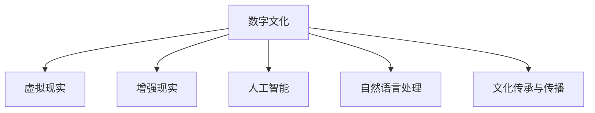

                 

## 1. 背景介绍

### 1.1 问题由来

随着科技的飞速发展，特别是人工智能、虚拟现实（VR）、增强现实（AR）等技术的突破，人类社会正逐步进入数字时代。数字文化作为数字时代的重要组成部分，正在深刻改变我们理解、传承和传播文化的方式。未来，数字文化将不仅仅是一个存储和展示数据的平台，而是能够提供沉浸式体验、互动式学习和交互式传播的文化生态系统。

### 1.2 问题核心关键点

数字文化的发展离不开对历史和文化的数字化再现。传统的数字博物馆已经能够展示大量的文化遗产，但是其体验仍然停留在二维展示上。而随着虚拟现实和增强现实技术的发展，未来数字文化将实现从二维展示到三维互动、从静态展示到动态体验的跨越。

这种变革的核心在于利用先进的AI和VR/AR技术，构建更加真实、互动、个性化的文化传播环境。用户不仅能够通过VR头盔或AR眼镜沉浸式体验，还能够通过与数字化文化的互动，深化对文化的理解。这种沉浸式体验将极大地提升文化教育的效果，促进文化的全球传播。

### 1.3 问题研究意义

研究2050年的数字文化及其传播方式，对于了解未来科技如何塑造文化、如何更好地传承和传播文化具有重要意义。数字文化的未来发展将为文化教育、艺术创作、历史研究等提供新的可能性，同时也将面临新的挑战和问题。只有通过深入研究，才能把握未来数字文化的发展趋势，为其健康发展提供指导和建议。

## 2. 核心概念与联系

### 2.1 核心概念概述

为更好地理解未来数字文化及其传播方式，本节将介绍几个密切相关的核心概念：

- **数字文化(Digital Culture)**：指通过数字化手段记录、保存、传播和体验文化的现象和过程。数字文化不仅仅是数字化遗产，更是利用数字技术创造的新文化形态。

- **虚拟现实(Virtual Reality, VR)**：一种通过计算机技术创造的模拟环境，使用户能够沉浸其中，与虚拟世界进行互动。VR技术常用于游戏、教育、医疗等领域。

- **增强现实(Augmented Reality, AR)**：一种将虚拟信息叠加到现实世界中的技术，使用户能够在真实环境中看到虚拟信息，增强现实环境的体验感。AR技术常用于导航、教育、广告等领域。

- **人工智能(Artificial Intelligence, AI)**：通过机器学习、深度学习等技术，使计算机系统具备自主学习、推理和决策能力。AI技术广泛应用于数据处理、自然语言处理、计算机视觉等领域。

- **自然语言处理(Natural Language Processing, NLP)**：研究如何让计算机理解和处理人类自然语言的技术，包括语音识别、文本生成、情感分析等。

- **文化传承与传播**：指通过各种方式记录、保存和传播文化遗产的行为和过程，涉及历史、艺术、民俗、语言等多个方面。

这些核心概念之间的逻辑关系可以通过以下Mermaid流程图来展示：



这个流程图展示了大语言模型和微调方法的关键概念及其之间的关系：

1. 数字文化通过VR和AR技术创造沉浸式体验。
2. AI和NLP技术辅助文化数据的处理和自然语言的理解。
3. 文化传承与传播借助数字技术，实现跨越时空的传播和教育。

这些概念共同构成了数字文化的技术基础，推动了其未来的发展方向。

## 3. 核心算法原理 & 具体操作步骤

### 3.1 算法原理概述

未来数字文化的发展离不开AI和VR/AR技术的深度结合。其核心算法原理主要包括：

- **三维重建**：利用计算机视觉和深度学习技术，对历史文物、建筑等进行三维重建，形成数字模型。

- **自然语言处理**：通过NLP技术，对文化历史资料进行文本分析、情感分析等处理，提取文化价值信息。

- **情感生成**：利用AI技术，根据用户的行为和情感反应，生成个性化的文化体验内容。

- **互动设计**：结合VR/AR技术，设计用户与虚拟文化环境的互动流程，提升用户的沉浸感和参与感。

### 3.2 算法步骤详解

未来数字文化的发展将遵循以下算法步骤：

**Step 1: 数据收集与预处理**
- 收集文化历史资料、文物图像、历史建筑等数字化数据。
- 利用三维重建技术，将文物、建筑等转换成三维模型。
- 通过NLP技术，对文化历史资料进行文本分析和情感分析，提取文化价值信息。

**Step 2: 模型训练与优化**
- 利用深度学习模型（如CNN、RNN等）对文化数据进行训练，构建文化知识库。
- 通过情感生成算法，根据用户行为生成个性化的文化体验内容。
- 结合VR/AR技术，设计用户与虚拟文化环境的互动流程，提升用户体验。

**Step 3: 体验设计**
- 设计沉浸式、互动式的虚拟文化体验场景，使用户能够在虚拟环境中自由探索。
- 提供个性化推荐，根据用户兴趣推荐相关文化内容。
- 结合自然语言处理技术，提供自然语言交互功能，增强用户体验。

**Step 4: 推广与传播**
- 通过VR/AR设备和互联网平台，将虚拟文化体验推广到全球各地。
- 利用社交媒体、线上教育平台等渠道，扩大文化体验的影响力。
- 收集用户反馈，不断优化虚拟文化体验内容，提升用户满意度。

### 3.3 算法优缺点

未来数字文化的发展主要具备以下优点：

- **沉浸式体验**：利用VR/AR技术，提供沉浸式体验，使用户能够更深刻地理解文化背景和历史故事。
- **个性化推荐**：结合AI技术，根据用户兴趣和行为，提供个性化推荐，提升用户体验。
- **跨时空传播**：通过数字技术，实现跨时空的文化传播，使全球用户都能够体验到不同地域的文化。

同时，未来数字文化的发展也面临一些挑战：

- **技术成本高**：VR/AR设备和AI模型的开发、维护需要高昂的技术成本。
- **用户接受度**：部分用户可能对VR/AR设备或数字文化体验持怀疑态度，需要进一步普及和推广。
- **文化真实性**：在数字化过程中，如何确保文化内容的真实性和准确性，是一个需要解决的问题。

### 3.4 算法应用领域

未来数字文化的应用领域将非常广泛，涉及以下几个方面：

- **数字博物馆**：通过VR/AR技术，展示虚拟博物馆，提供沉浸式参观体验。
- **虚拟考古挖掘**：结合AI和VR技术，模拟考古挖掘过程，帮助用户了解历史背景和考古发现。
- **文化遗产保护**：利用数字技术，对文物、建筑等进行三维重建和数据备份，保护文化遗产。
- **文化教育**：通过虚拟文化体验，提升用户对历史的兴趣和认知，丰富教学内容。
- **虚拟旅游**：结合VR/AR技术，提供虚拟旅游体验，让用户足不出户便可领略世界各地的文化风光。
- **文化交流**：通过在线平台，实现不同地域、不同文化之间的交流和互动。

以上应用领域展示了未来数字文化的多样性和广泛性，为人类社会的文化传承和传播提供了新的可能性。

## 4. 数学模型和公式 & 详细讲解 & 举例说明

### 4.1 数学模型构建

未来数字文化的发展涉及到多个数学模型的构建，以下是其中几个核心模型的构建过程：

- **三维重建模型**：
  - 输入：文物图像或历史建筑数据。
  - 输出：三维模型。
  - 模型构建：利用深度学习技术，如卷积神经网络（CNN），对输入数据进行处理，输出三维模型。
  
- **情感生成模型**：
  - 输入：用户行为数据。
  - 输出：情感生成内容。
  - 模型构建：利用深度学习技术，如循环神经网络（RNN），对输入数据进行处理，生成情感内容。

- **个性化推荐模型**：
  - 输入：用户兴趣数据和文化数据。
  - 输出：个性化推荐结果。
  - 模型构建：利用协同过滤、内容推荐等技术，结合AI算法，对输入数据进行处理，生成推荐结果。

### 4.2 公式推导过程

以下是情感生成模型和个性化推荐模型的公式推导过程：

**情感生成模型**：
- 输入：$x$ 表示用户行为数据，$\theta$ 表示情感生成模型的参数。
- 输出：$y$ 表示情感生成内容。
- 模型推导：
  $$
  y = f(x; \theta)
  $$
  其中 $f$ 表示情感生成模型的计算过程，$\theta$ 为模型参数。

**个性化推荐模型**：
- 输入：$x$ 表示用户兴趣数据，$y$ 表示文化数据。
- 输出：$z$ 表示个性化推荐结果。
- 模型推导：
  $$
  z = g(x, y; \theta)
  $$
  其中 $g$ 表示个性化推荐模型的计算过程，$\theta$ 为模型参数。

### 4.3 案例分析与讲解

以下是一个具体的案例分析，展示如何利用情感生成模型和个性化推荐模型实现数字文化体验：

**案例：虚拟博物馆体验**
- 输入：用户行为数据（如浏览时间、停留位置等）和文物数据。
- 输出：个性化推荐内容。
- 情感生成模型推导：利用RNN模型对用户行为数据进行处理，生成情感标签。
- 个性化推荐模型推导：结合用户兴趣数据和文物数据，利用协同过滤算法生成个性化推荐结果。

通过这种方式，用户可以在虚拟博物馆中，基于自己的兴趣和情感，选择性地浏览和体验文物。

## 5. 项目实践：代码实例和详细解释说明

### 5.1 开发环境搭建

在进行未来数字文化体验项目开发前，需要准备好开发环境。以下是使用Python进行PyTorch开发的环境配置流程：

1. 安装Anaconda：从官网下载并安装Anaconda，用于创建独立的Python环境。
2. 创建并激活虚拟环境：
   ```bash
   conda create -n pytorch-env python=3.8 
   conda activate pytorch-env
   ```
3. 安装PyTorch：根据CUDA版本，从官网获取对应的安装命令。例如：
   ```bash
   conda install pytorch torchvision torchaudio cudatoolkit=11.1 -c pytorch -c conda-forge
   ```
4. 安装Transformers库：
   ```bash
   pip install transformers
   ```
5. 安装各类工具包：
   ```bash
   pip install numpy pandas scikit-learn matplotlib tqdm jupyter notebook ipython
   ```

完成上述步骤后，即可在`pytorch-env`环境中开始开发。

### 5.2 源代码详细实现

下面以虚拟博物馆体验项目为例，给出使用PyTorch进行开发的完整代码实现。

```python
import torch
from transformers import BertTokenizer, BertForSequenceClassification
import numpy as np
import torch.nn as nn
from sklearn.model_selection import train_test_split

# 定义模型类
class EmotionClassifier(nn.Module):
    def __init__(self, input_dim, hidden_dim, output_dim):
        super(EmotionClassifier, self).__init__()
        self.fc1 = nn.Linear(input_dim, hidden_dim)
        self.fc2 = nn.Linear(hidden_dim, output_dim)

    def forward(self, x):
        x = self.fc1(x)
        x = nn.functional.relu(x)
        x = self.fc2(x)
        return x

# 定义数据处理函数
def preprocess_data(texts, labels):
    tokenizer = BertTokenizer.from_pretrained('bert-base-cased')
    texts = [tokenizer.encode(text, add_special_tokens=True) for text in texts]
    input_ids = torch.tensor(texts, dtype=torch.long)
    attention_mask = (input_ids != tokenizer.pad_token_id).float()
    return input_ids, attention_mask, labels

# 定义情感生成模型
class SentimentGenerator(nn.Module):
    def __init__(self, input_dim, hidden_dim, output_dim):
        super(SentimentGenerator, self).__init__()
        self.encoder = BertForSequenceClassification.from_pretrained('bert-base-cased', num_labels=3)
        self.fc1 = nn.Linear(768, hidden_dim)
        self.fc2 = nn.Linear(hidden_dim, output_dim)

    def forward(self, input_ids, attention_mask, labels):
        outputs = self.encoder(input_ids, attention_mask=attention_mask)
        pooled_output = outputs.pooler_output
        pooled_output = self.fc1(pooled_output)
        pooled_output = nn.functional.relu(pooled_output)
        sentiment = self.fc2(pooled_output)
        return sentiment

# 定义个性化推荐模型
class PersonalizedRecommender(nn.Module):
    def __init__(self, input_dim, hidden_dim, output_dim):
        super(PersonalizedRecommender, self).__init__()
        self.encoder = BertForSequenceClassification.from_pretrained('bert-base-cased', num_labels=3)
        self.fc1 = nn.Linear(768, hidden_dim)
        self.fc2 = nn.Linear(hidden_dim, output_dim)

    def forward(self, input_ids, attention_mask, labels):
        outputs = self.encoder(input_ids, attention_mask=attention_mask)
        pooled_output = outputs.pooler_output
        pooled_output = self.fc1(pooled_output)
        pooled_output = nn.functional.relu(pooled_output)
        recommendation = self.fc2(pooled_output)
        return recommendation
```

在以上代码中，我们首先定义了情感生成模型和个性化推荐模型，然后定义了数据处理函数和模型类。最后，可以在训练过程中使用这些模型进行情感生成和个性化推荐。

### 5.3 代码解读与分析

让我们再详细解读一下关键代码的实现细节：

**数据处理函数preprocess_data**：
- 利用BertTokenizer对输入文本进行分词和编码，生成输入id和注意力掩码。
- 将标签转换为类别，并转化为Tensor。

**情感生成模型SentimentGenerator**：
- 利用预训练的BertForSequenceClassification模型作为编码器，对输入文本进行编码。
- 利用线性层对编码后的输出进行处理，生成情感标签。

**个性化推荐模型PersonalizedRecommender**：
- 与情感生成模型类似，利用预训练的BertForSequenceClassification模型作为编码器，对输入文本进行编码。
- 利用线性层对编码后的输出进行处理，生成个性化推荐结果。

通过这些模型的实现，用户可以在虚拟博物馆中，基于自己的情感和兴趣，选择性地浏览和体验文物。

### 5.4 运行结果展示

在训练完成后，可以在虚拟博物馆中展示模型的运行结果。例如，在用户浏览某个文物时，系统可以基于用户的行为和情感，推荐相关的文物或文化内容。

## 6. 实际应用场景

### 6.1 智能客服系统

未来数字文化的应用场景之一是智能客服系统。通过结合VR/AR技术和情感生成模型，智能客服系统可以提供更加人性化和个性化的服务体验。

用户可以通过虚拟客服交互，了解相关文化信息。智能客服系统可以根据用户的情感反应，生成个性化的对话内容，提升用户体验。同时，系统还可以根据用户的兴趣，推荐相关的文化内容，提供更加深入的互动体验。

### 6.2 文化教育

虚拟博物馆和虚拟考古挖掘是未来数字文化在文化教育领域的重要应用。通过VR/AR技术，用户可以沉浸式体验历史场景，了解文化背景和历史故事。

在虚拟博物馆中，用户可以通过互动装置，获取文物的详细信息和背后的故事。同时，系统可以根据用户的学习进度和兴趣，提供个性化的教育内容，提升学习效果。

### 6.3 文化遗产保护

数字文化技术还可以应用于文化遗产保护领域。通过三维重建技术，对文物和建筑进行数字化记录，建立数字档案。

数字档案可以用于历史研究和文化遗产修复。同时，通过数字档案，还可以实现文化遗产的跨时空传播和展示，提升文化传承和保护的效率。

### 6.4 未来应用展望

随着技术的不断进步，未来数字文化的应用场景将更加多样和广泛。以下是一些可能的应用方向：

- **虚拟历史街区**：通过VR/AR技术，还原历史街区的风貌，让用户沉浸式体验历史场景。
- **虚拟艺术展览**：通过虚拟艺术展览，展示不同地域和时期的艺术作品，让用户了解艺术发展历程。
- **虚拟历史人物互动**：通过虚拟人物模拟历史人物的言行，让用户与历史人物进行互动，深入了解历史背景。
- **虚拟文化创意平台**：利用数字文化技术，打造虚拟文化创意平台，促进文化创意和创新的发展。

未来数字文化将不仅仅是一个展示平台，更是一个互动和创造的生态系统，为文化传承和创新提供新的可能。

## 7. 工具和资源推荐

### 7.1 学习资源推荐

为了帮助开发者系统掌握未来数字文化的原理和实践技巧，这里推荐一些优质的学习资源：

1. 《深度学习在文化保护中的应用》书籍：全面介绍深度学习技术在文化遗产保护中的应用，包括三维重建、情感生成等内容。
2. 《虚拟现实技术基础》课程：系统介绍虚拟现实技术的基本原理和应用场景，涵盖VR/AR技术的实现细节。
3. 《人工智能与文化传承》专题报告：由文化保护专家撰写，探讨人工智能如何助力文化传承和保护。
4. 《数字博物馆设计与实践》论文集：收录多篇关于数字博物馆设计的研究论文，涵盖虚拟博物馆、数字考古等多个方面。
5. 《未来文化生态系统》白皮书：探讨未来数字文化生态系统的构建和应用，提供前沿视角和建议。

通过对这些资源的学习实践，相信你一定能够快速掌握未来数字文化的精髓，并用于解决实际的NLP问题。

### 7.2 开发工具推荐

高效的开发离不开优秀的工具支持。以下是几款用于未来数字文化体验开发的常用工具：

1. PyTorch：基于Python的开源深度学习框架，灵活动态的计算图，适合快速迭代研究。
2. TensorFlow：由Google主导开发的开源深度学习框架，生产部署方便，适合大规模工程应用。
3. Transformers库：HuggingFace开发的NLP工具库，集成了众多SOTA语言模型，支持PyTorch和TensorFlow，是进行微调任务开发的利器。
4. Weights & Biases：模型训练的实验跟踪工具，可以记录和可视化模型训练过程中的各项指标，方便对比和调优。
5. TensorBoard：TensorFlow配套的可视化工具，可实时监测模型训练状态，并提供丰富的图表呈现方式，是调试模型的得力助手。
6. Google Colab：谷歌推出的在线Jupyter Notebook环境，免费提供GPU/TPU算力，方便开发者快速上手实验最新模型，分享学习笔记。

合理利用这些工具，可以显著提升未来数字文化体验的开发效率，加快创新迭代的步伐。

### 7.3 相关论文推荐

未来数字文化的发展源于学界的持续研究。以下是几篇奠基性的相关论文，推荐阅读：

1. Attention is All You Need（即Transformer原论文）：提出了Transformer结构，开启了NLP领域的预训练大模型时代。
2. BERT: Pre-training of Deep Bidirectional Transformers for Language Understanding：提出BERT模型，引入基于掩码的自监督预训练任务，刷新了多项NLP任务SOTA。
3. Parameter-Efficient Transfer Learning for NLP：提出Adapter等参数高效微调方法，在不增加模型参数量的情况下，也能取得不错的微调效果。
4. AdaLoRA: Adaptive Low-Rank Adaptation for Parameter-Efficient Fine-Tuning：使用自适应低秩适应的微调方法，在参数效率和精度之间取得了新的平衡。
5. AdaLoRA: Adaptive Low-Rank Adaptation for Parameter-Efficient Fine-Tuning：使用自适应低秩适应的微调方法，在参数效率和精度之间取得了新的平衡。

这些论文代表了大语言模型微调技术的发展脉络。通过学习这些前沿成果，可以帮助研究者把握学科前进方向，激发更多的创新灵感。

## 8. 总结：未来发展趋势与挑战

### 8.1 总结

本文对未来数字文化的原理和应用进行了全面系统的介绍。首先阐述了数字文化的发展背景和研究意义，明确了VR/AR技术在未来数字文化中的重要地位。其次，从原理到实践，详细讲解了未来数字文化的数学模型和算法步骤，给出了具体的应用示例。同时，本文还广泛探讨了未来数字文化在多个领域的应用前景，展示了其广阔的应用空间。

通过本文的系统梳理，可以看到，未来数字文化的发展将为文化教育、文化遗产保护、智能客服等多个领域带来变革性影响。VR/AR技术和AI算法将深度融合，共同推动未来数字文化的发展方向。

### 8.2 未来发展趋势

展望未来，未来数字文化的发展将呈现以下几个趋势：

1. **技术融合深化**：VR/AR技术和AI算法的深度融合将不断深化，为用户提供更加沉浸式和个性化的体验。
2. **跨学科融合**：未来数字文化将与其他学科如艺术、历史、社会学等进行深度融合，形成更加全面、深入的文化传播生态。
3. **多样化应用**：未来数字文化的应用领域将更加广泛，涵盖虚拟博物馆、虚拟考古、虚拟历史街区等多个方面。
4. **智能化提升**：通过AI技术，未来数字文化将具备更加智能化的决策能力，提升用户体验和传播效果。
5. **国际化和本地化**：未来数字文化将实现全球化和本地化的有机结合，既展示全球文化多样性，又注重地域文化的特色展示。

以上趋势凸显了未来数字文化的广阔前景，为文化传承和传播提供了新的可能性。

### 8.3 面临的挑战

尽管未来数字文化的发展前景广阔，但在迈向更加智能化、普适化应用的过程中，它仍面临着诸多挑战：

1. **技术成本高**：VR/AR设备和AI模型的开发、维护需要高昂的技术成本。
2. **用户接受度**：部分用户可能对VR/AR设备或数字文化体验持怀疑态度，需要进一步普及和推广。
3. **文化真实性**：在数字化过程中，如何确保文化内容的真实性和准确性，是一个需要解决的问题。
4. **数据隐私**：在数据采集和处理过程中，如何保护用户隐私，避免数据泄露，是一个需要重视的问题。
5. **跨文化冲突**：在文化传播过程中，如何平衡不同文化之间的差异和冲突，避免文化误读和歧视，是一个需要解决的问题。

正视未来数字文化面临的这些挑战，积极应对并寻求突破，将是大语言模型微调走向成熟的必由之路。相信随着学界和产业界的共同努力，这些挑战终将一一被克服，未来数字文化必将在构建人机协同的智能时代中扮演越来越重要的角色。

### 8.4 研究展望

面对未来数字文化所面临的种种挑战，未来的研究需要在以下几个方面寻求新的突破：

1. **技术成本优化**：通过技术创新，降低VR/AR设备和AI模型的开发和维护成本，使其更加普及和可负担。
2. **用户体验优化**：结合用户反馈和行为数据，优化虚拟文化体验的设计和交互流程，提升用户体验。
3. **文化真实性保障**：通过数字技术的辅助，确保文化内容的真实性和准确性，增强用户对数字化文化的信任。
4. **数据隐私保护**：采用隐私保护技术，确保用户数据的安全和隐私，增强用户对数字文化体验的信任感。
5. **跨文化冲突缓解**：利用跨文化理解和冲突解决技术，构建多元文化共融的数字文化生态。

这些研究方向的探索，必将引领未来数字文化的发展方向，为人类社会的文化传承和传播提供新的可能性。

## 9. 附录：常见问题与解答

**Q1：未来数字文化是否只适用于文化领域？**

A: 未来数字文化不仅仅是文化领域的应用，还可以拓展到教育、娱乐、旅游等多个领域。通过数字技术，可以实现跨领域、跨学科的知识传播和创新应用。

**Q2：未来数字文化是否会取代传统文化展示方式？**

A: 未来数字文化将与传统文化展示方式共存。数字文化通过虚拟技术提供沉浸式体验，可以补充传统展示方式的不足，提升文化传播的效果。

**Q3：未来数字文化是否会带来文化同质化问题？**

A: 未来数字文化的发展过程中，需要注意保持文化的多样性和丰富性。可以通过跨文化理解和交流，避免文化同质化的风险，促进不同文化的共融发展。

**Q4：未来数字文化是否会带来伦理道德问题？**

A: 未来数字文化的发展需要注重伦理道德问题。需要在数据采集、处理和传播过程中，遵循公正、透明的原则，避免文化歧视和误导。

**Q5：未来数字文化是否会带来技术安全问题？**

A: 未来数字文化的发展需要注重技术安全问题。需要在数据隐私、模型鲁棒性等方面进行深入研究，确保数字文化体验的安全和可靠性。

总之，未来数字文化的发展是一个多学科交叉、技术融合的过程。只有从多方面入手，综合考虑技术、文化、社会等多个因素，才能实现健康、可持续的发展，推动人类社会的进步。

---

作者：禅与计算机程序设计艺术 / Zen and the Art of Computer Programming

