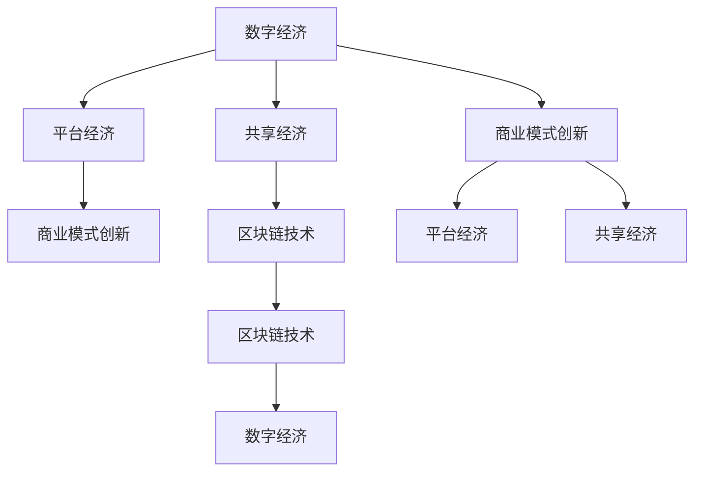

                 

# 2050年的数字经济：从平台经济到共享经济的商业模式创新

> 关键词：数字经济, 平台经济, 共享经济, 商业模式创新, 区块链技术, 可持续性, 人工智能

## 1. 背景介绍

### 1.1 数字经济的崛起

随着互联网技术的迅猛发展，数字经济逐渐成为全球经济增长的重要引擎。特别是20世纪末以来，信息技术的广泛应用推动了全球经济进入了一个崭新的发展阶段。从电子商务的崛起、社交媒体的普及，到云计算、大数据的兴起，互联网技术正在改变传统产业结构，重塑商业模式，引领新一轮经济变革。

### 1.2 平台经济的兴起

平台经济是基于互联网技术的商业模式，通过构建一个连接供需双方的平台，为交易提供便利。典型的平台经济案例包括淘宝、美团、滴滴出行等。平台经济不仅改变了消费者和商家的交易方式，还催生出大量创新型企业和创业机会。

### 1.3 共享经济的出现

共享经济是指通过共享资源和服务，提高资源使用效率，降低交易成本的商业模式。共享经济的代表平台包括Airbnb、Uber等。共享经济基于去中心化的网络结构，通过匹配供需双方的信息，实现资源的高效利用。

## 2. 核心概念与联系

### 2.1 核心概念概述

为了更好地理解未来数字经济的发展方向，本节将介绍几个关键概念及其联系：

- **数字经济**：基于信息技术的经济形态，涵盖了电子商务、社交媒体、云计算、大数据、人工智能等多个领域。数字经济通过数字化技术改变生产、流通、消费等环节，提高经济效率，创造新的增长点。
- **平台经济**：通过构建平台，连接供需双方，提供交易、信息匹配等服务的商业模式。平台经济的核心是信息资源的整合和优化，通过降低交易成本，提高市场效率。
- **共享经济**：通过共享资源和服务，提高资源使用效率，降低交易成本的商业模式。共享经济依赖于去中心化的网络结构，鼓励用户间的直接互动，推动资源的优化配置。
- **商业模式创新**：基于新技术和新市场需求的商业模式变革。商业模式创新往往能带来更大的经济效益和社会价值，是推动数字经济发展的关键动力。
- **区块链技术**：一种分布式账本技术，通过加密和共识机制，保障交易的透明和不可篡改。区块链技术广泛应用于金融、供应链、智能合约等领域，是未来数字经济的重要基础。

### 2.2 核心概念原理和架构的 Mermaid 流程图



这个流程图展示了大语言模型微调的核心概念及其相互关系：

1. 数字经济是整体框架，涵盖平台经济、共享经济等多个领域。
2. 平台经济和共享经济是基于数字经济的商业模式创新。
3. 区块链技术是数字经济的重要基础，支持平台经济和共享经济的高效运作。

## 3. 核心算法原理 & 具体操作步骤

### 3.1 算法原理概述

数字经济的商业模式创新，本质上是基于新技术和新市场需求的商业模式变革。其核心思想是利用互联网和信息技术，构建一个高效、透明、低成本的交易和信息匹配平台，最大化资源利用效率。平台经济和共享经济是数字经济的重要组成部分，通过连接供需双方，提供交易、信息匹配等服务的商业模式。

### 3.2 算法步骤详解

数字经济的商业模式创新主要包括以下几个关键步骤：

**Step 1: 技术准备**

- 选择合适的互联网和信息技术，如云计算、大数据、人工智能等。
- 搭建平台，实现交易、信息匹配等功能。
- 设计和部署区块链技术，保障交易的透明和不可篡改。

**Step 2: 数据准备**

- 收集和处理供需双方的数据，包括用户行为、交易历史、市场环境等。
- 构建数据仓库，进行数据分析和挖掘，发现商业机会。
- 实施数据安全措施，保障用户隐私和数据安全。

**Step 3: 市场调研**

- 分析市场需求和竞争状况，确定平台的目标用户和业务范围。
- 制定商业模式和运营策略，设计平台盈利模式。
- 进行市场测试，评估平台的市场接受度和用户满意度。

**Step 4: 平台建设**

- 设计平台的界面和功能，提升用户体验。
- 开发平台的后端系统，实现交易、信息匹配等功能。
- 部署区块链技术，保障交易的透明和不可篡改。

**Step 5: 运营推广**

- 制定推广策略，吸引用户和商家入驻平台。
- 实施运营管理，保障平台的高效运转。
- 收集用户反馈，不断优化平台功能和用户体验。

### 3.3 算法优缺点

数字经济的商业模式创新具有以下优点：

1. 高效性：通过平台经济和共享经济，极大提高了资源利用效率，降低了交易成本。
2. 透明度：区块链技术保障了交易的透明和不可篡改，提高了市场的信任度。
3. 灵活性：互联网和信息技术支持了多种商业模式的创新，满足了不同市场的需求。

但同时也存在一些缺点：

1. 依赖技术：平台经济的有效运作依赖于高水平的技术支持，对技术要求较高。
2. 风险控制：平台经济和共享经济的高灵活性可能带来较高的风险，需要有效控制。
3. 用户隐私：平台经济和共享经济需要大量用户数据，可能存在用户隐私泄露的风险。
4. 市场波动：市场环境的变化可能影响平台经济的稳定性和可持续性。

### 3.4 算法应用领域

数字经济的商业模式创新已经广泛应用于多个领域，包括：

- **电商**：如淘宝、亚马逊等，通过构建交易平台，连接供需双方，实现高效交易。
- **出行**：如滴滴出行、Uber等，通过共享出行资源，提高资源利用效率。
- **金融**：如支付宝、微信支付等，通过互联网支付平台，实现便捷支付和金融服务。
- **物流**：如顺丰、菜鸟网络等，通过共享物流资源，提升物流效率。
- **旅游**：如Airbnb、Booking等，通过共享住宿资源，提升旅游体验。

## 4. 数学模型和公式 & 详细讲解 & 举例说明

### 4.1 数学模型构建

为了更好地理解数字经济的商业模式创新，我们可以通过数学模型来分析其基本结构和运作机制。假设数字经济平台连接了 $N$ 个商家和 $M$ 个用户，每个用户每天产生 $D$ 笔交易，每个商家的交易量 $T$ 为 $D$。假设每个交易的平均收益为 $R$，每个用户的平均收益为 $U$。

### 4.2 公式推导过程

- **交易量计算公式**：

  $$
  Total\ Transaction\ Volume = \sum_{i=1}^{M}\sum_{j=1}^{N} D \times T_i \times T_j
  $$

  表示平台每天的总交易量，其中 $D$ 为每个用户的日均交易量，$T_i$ 为第 $i$ 个商家的日均交易量。

- **用户收益计算公式**：

  $$
  Total\ User\ Revenue = \sum_{i=1}^{M} U \times D
  $$

  表示平台每天的总用户收益，其中 $U$ 为每个用户的平均收益。

- **商家收益计算公式**：

  $$
  Total\ Merchant\ Revenue = \sum_{j=1}^{N} R \times T_j
  $$

  表示平台每天的总商家收益，其中 $R$ 为每个商家的平均交易收益。

### 4.3 案例分析与讲解

假设某电商平台连接了 100 个商家和 1000 个用户，每个用户每天产生 10 笔交易，每个商家的日均交易量为 1000 笔。每个交易的平均收益为 1 元，每个用户的平均收益为 0.5 元。

计算总交易量和用户收益：

- 总交易量 $Total\ Transaction\ Volume = 1000 \times 100 \times 10 \times 1000 = 10^{10}$ 笔/天。

- 总用户收益 $Total\ User\ Revenue = 1000 \times 0.5 \times 10 = 5000$ 元/天。

分析可知，数字经济平台能够极大地提高交易量和用户收益，为商家提供稳定的交易机会。

## 5. 项目实践：代码实例和详细解释说明

### 5.1 开发环境搭建

在进行项目实践前，我们需要准备好开发环境。以下是使用Python进行Flask开发的环境配置流程：

1. 安装Python：从官网下载并安装Python 3.8。
2. 安装Flask：使用pip安装Flask，命令为 `pip install Flask`。
3. 创建Flask项目：在项目根目录下，创建一个`app.py`文件，并在其中引入Flask。
4. 运行项目：使用以下命令启动项目，命令为 `python app.py`。

### 5.2 源代码详细实现

接下来，我们以一个简单的电商平台为例，实现一个基于Flask的电商平台。

```python
from flask import Flask, render_template, request

app = Flask(__name__)

# 商品列表
items = [
    {'name': '商品A', 'price': 10.00},
    {'name': '商品B', 'price': 20.00},
    {'name': '商品C', 'price': 30.00},
    {'name': '商品D', 'price': 40.00},
]

# 用户列表
users = [
    {'name': '用户1', 'balance': 100},
    {'name': '用户2', 'balance': 200},
    {'name': '用户3', 'balance': 300},
    {'name': '用户4', 'balance': 400},
]

@app.route('/')
def index():
    return render_template('index.html', items=items)

@app.route('/purchase', methods=['POST'])
def purchase():
    user_id = request.form['user_id']
    item_id = request.form['item_id']
    price = float(request.form['price'])
    
    for user in users:
        if user['name'] == user_id:
            if user['balance'] >= price:
                user['balance'] -= price
                return f"购买成功，剩余金额为{user['balance']}"
            else:
                return "余额不足，购买失败"
    return "用户不存在，购买失败"

if __name__ == '__main__':
    app.run(debug=True)
```

### 5.3 代码解读与分析

在上面的代码中，我们使用了Flask框架来搭建一个简单的电商平台。

- `index()` 函数：用于渲染主页，展示商品列表。
- `purchase()` 函数：用于处理用户的购买请求，更新用户的余额。
- `items` 和 `users` 分别表示商品和用户的列表，用于存储和查询数据。
- `request.form` 用于获取用户提交的表单数据。

### 5.4 运行结果展示

运行上述代码后，在浏览器中访问 `http://127.0.0.1:5000/`，即可展示商品列表。点击商品跳转到购买页面，输入用户ID和商品ID，点击购买按钮，即可更新用户的余额，并返回购买结果。

## 6. 实际应用场景

### 6.1 电商平台

数字经济的商业模式创新在电商领域的应用最为广泛。传统的电商平台如淘宝、亚马逊等，通过连接供需双方，提供交易、支付、物流等服务，极大地提高了市场效率和用户满意度。未来，电商平台还将进一步融合大数据、人工智能、区块链等技术，提升用户体验和市场竞争力。

### 6.2 共享出行

共享出行平台如滴滴出行、Uber等，通过共享出行资源，提高车辆利用率，降低出行成本。未来，共享出行平台将进一步融合智能调度、车联网等技术，提升出行体验和安全性。

### 6.3 智慧医疗

数字经济的商业模式创新在智慧医疗领域也有广泛应用。例如，通过构建电子病历平台，连接医院、医生和患者，提供便捷的诊疗服务。未来，智慧医疗还将进一步融合大数据、人工智能、区块链等技术，提升医疗服务效率和质量。

### 6.4 未来应用展望

未来，数字经济的商业模式创新将涵盖更多领域，带来更多商业机会和社会价值。以下是几个可能的未来应用场景：

- **智能制造**：通过工业互联网平台，连接制造商、供应商和用户，提供智能化的生产和服务。
- **智慧城市**：通过智能城市平台，连接政府、企业和市民，提供智能化的城市管理和公共服务。
- **教育平台**：通过在线教育平台，连接教师、学生和家长，提供智能化的教育服务。

## 7. 工具和资源推荐

### 7.1 学习资源推荐

为了帮助开发者系统掌握数字经济商业模式创新的理论基础和实践技巧，这里推荐一些优质的学习资源：

1. 《数字经济理论》系列博文：深入浅出地介绍了数字经济的理论基础和实践应用。
2. Coursera《数字经济与创新》课程：由世界知名学者讲授，涵盖数字经济的基础知识和前沿技术。
3.《数字经济崛起》书籍：全面介绍了数字经济的发展历程和未来趋势，适合深入研究。
4. 数字经济联盟官网：提供丰富的学习资源和社区交流平台，涵盖多个领域和方向。
5. 数字经济创新峰会：定期举办，汇集业内专家和学者，分享最新的研究成果和实践经验。

通过对这些资源的学习实践，相信你一定能够快速掌握数字经济商业模式创新的精髓，并用于解决实际的商业问题。

### 7.2 开发工具推荐

高效的开发离不开优秀的工具支持。以下是几款用于数字经济商业模式开发的工具：

1. Flask：轻量级的Web框架，适合快速开发原型和Web应用。
2. Django：全功能的Web框架，适合开发复杂的数据库驱动应用。
3. PyTorch：基于Python的深度学习框架，支持人工智能模型开发。
4. TensorFlow：由Google主导开发的深度学习框架，支持大规模模型训练和部署。
5. Elasticsearch：分布式搜索和分析引擎，适合处理大数据量和高并发的数据存储和查询。

合理利用这些工具，可以显著提升数字经济商业模式开发的效率，加快创新迭代的步伐。

### 7.3 相关论文推荐

数字经济商业模式创新的发展源于学界的持续研究。以下是几篇奠基性的相关论文，推荐阅读：

1. "Platform Business Models: Suffering from Too Much Value Creation?" ——研究平台经济模型对价值创造和分配的影响。
2. "Blockchain Technology in Supply Chain Management" ——探讨区块链技术在供应链管理中的应用。
3. "Smart Cities: Vision, Potential, Challenges, and Future Directions" ——探讨智慧城市的技术和应用前景。
4. "Artificial Intelligence in Healthcare: Opportunities and Challenges" ——探讨人工智能在医疗健康领域的应用。
5. "Future Internet and Digital Economy: An Interdisciplinary Perspective" ——全面回顾数字经济的发展历程和未来趋势。

这些论文代表了大语言模型微调技术的发展脉络。通过学习这些前沿成果，可以帮助研究者把握学科前进方向，激发更多的创新灵感。

## 8. 总结：未来发展趋势与挑战

### 8.1 研究成果总结

本文对数字经济商业模式创新的理论基础和实践应用进行了全面系统的介绍。首先阐述了数字经济的崛起、平台经济和共享经济的兴起，明确了商业模式创新的重要性和应用前景。其次，从原理到实践，详细讲解了商业模式创新的数学模型和操作步骤，给出了电商平台的代码实例和运行结果展示。同时，本文还探讨了未来数字经济的应用场景和未来展望，推荐了相关的学习资源、开发工具和论文。

通过本文的系统梳理，可以看到，数字经济的商业模式创新正在成为全球经济增长的新引擎，极大地推动了各行各业的变革和发展。未来，伴随技术的不断进步和应用场景的不断拓展，数字经济将发挥更大的作用，带来更多的商业机会和社会价值。

### 8.2 未来发展趋势

展望未来，数字经济的商业模式创新将呈现以下几个发展趋势：

1. **融合技术**：数字经济的商业模式创新将进一步融合大数据、人工智能、区块链等技术，提升平台的高效性和安全性。
2. **垂直领域**：数字经济的商业模式创新将拓展到更多垂直领域，如智能制造、智慧医疗等，提供更加个性化和智能化的服务。
3. **全球化**：数字经济的商业模式创新将推动全球经济一体化进程，提升全球市场的效率和竞争性。
4. **可持续发展**：数字经济的商业模式创新将更多地关注可持续性和环境友好，推动绿色经济的发展。
5. **跨领域合作**：数字经济的商业模式创新将促进跨领域合作，形成生态链条，推动技术创新和市场发展。

### 8.3 面临的挑战

尽管数字经济的商业模式创新已经取得了显著成就，但在迈向更加智能化、普适化应用的过程中，它仍面临着诸多挑战：

1. **技术瓶颈**：数字经济的商业模式创新依赖于高水平的技术支持，如何进一步降低技术门槛，提升应用普及度，是未来需要解决的重要问题。
2. **数据安全**：数字经济的商业模式创新需要大量数据支持，如何保障用户数据安全，避免数据泄露和滥用，是未来需要解决的重要问题。
3. **市场竞争**：数字经济的商业模式创新面临激烈的市场竞争，如何制定有效的市场策略，提升平台竞争力，是未来需要解决的重要问题。
4. **法律合规**：数字经济的商业模式创新需要遵守法律法规，如何制定合理的法规政策，保障用户权益和市场公平，是未来需要解决的重要问题。
5. **社会接受度**：数字经济的商业模式创新需要获得社会认可，如何提高社会接受度，推动技术应用，是未来需要解决的重要问题。

### 8.4 研究展望

面对数字经济的商业模式创新所面临的挑战，未来的研究需要在以下几个方面寻求新的突破：

1. **技术创新**：开发更加高效、安全、易用的技术工具，推动数字经济商业模式创新的普及和应用。
2. **政策支持**：制定合理的法规政策，保障用户权益和市场公平，推动数字经济的健康发展。
3. **社会教育**：提高社会对数字经济的认知和接受度，培养更多的数字经济人才，推动技术创新和应用普及。
4. **国际合作**：加强国际合作和交流，推动数字经济的全球化进程，形成全球市场。
5. **可持续发展**：推动数字经济的可持续发展，关注环境和社会责任，推动绿色经济的发展。

## 9. 附录：常见问题与解答

**Q1: 数字经济的商业模式创新适用于所有行业吗？**

A: 数字经济的商业模式创新适用于多数行业，特别是那些对互联网技术和信息资源依赖较大的行业。例如电商、共享出行、智慧医疗等。但对于一些传统行业，如农业、制造业等，由于技术和资源限制，可能需要根据实际情况进行调整。

**Q2: 数字经济的商业模式创新需要多长时间才能实现？**

A: 数字经济的商业模式创新需要时间和资源投入。通常需要经过市场调研、技术开发、试点测试、全面推广等多个阶段。具体时间取决于项目规模和复杂度。

**Q3: 数字经济的商业模式创新需要哪些技术和资源？**

A: 数字经济的商业模式创新需要互联网技术、人工智能技术、大数据技术、区块链技术等。此外，还需要稳定的资金投入、技术人才和市场推广等资源。

**Q4: 数字经济的商业模式创新是否存在风险？**

A: 数字经济的商业模式创新面临市场风险、技术风险、法律风险等。例如市场竞争、技术漏洞、法律合规等问题。因此，在实施前需要进行充分的风险评估和准备。

**Q5: 数字经济的商业模式创新如何提升用户体验？**

A: 数字经济的商业模式创新通过提供便捷、高效、个性化的服务，提升用户体验。例如电商平台通过智能推荐、在线客服等提升购物体验；共享出行平台通过智能调度、车辆共享等提升出行体验。

---

作者：禅与计算机程序设计艺术 / Zen and the Art of Computer Programming

