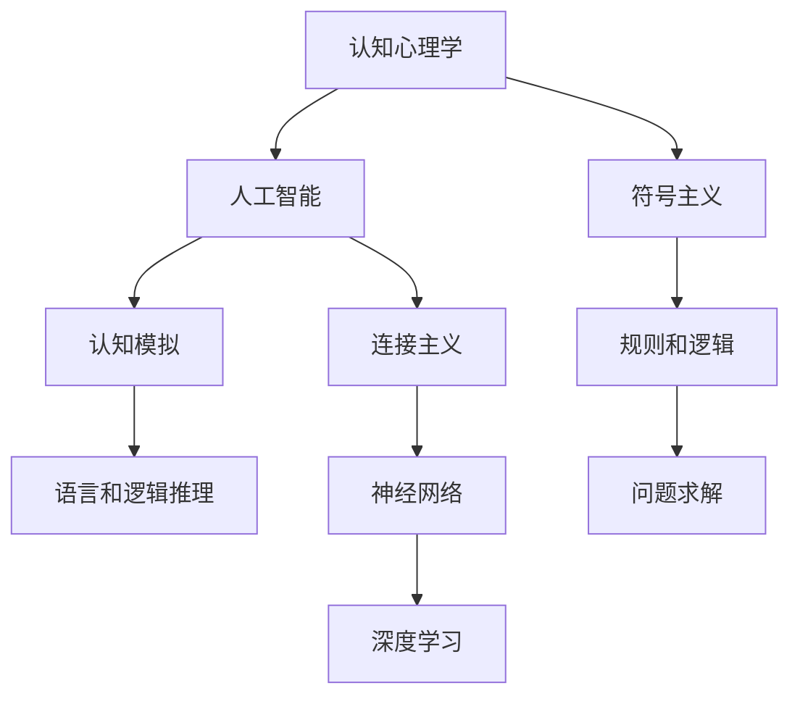

                 

## 1. 背景介绍

1956年的达特茅斯会议被广泛认为是人工智能（AI）的诞生地，虽然当时的讨论并没有聚焦于“人工智能”这一词汇，但该会议汇聚了包括约翰·麦卡锡（John McCarthy）、马文·明斯基（Marvin Minsky）、克劳德·香农（Claude Shannon）等在内的许多先驱人物，奠定了现代人工智能研究的基础。会议期间，与会者探讨了计算机思维的实现、自动化问题的可行性以及计算机科学在实际中的应用等多个重要主题。

## 2. 核心概念与联系

### 2.1 核心概念概述

**人工智能**：一种计算机科学的子领域，专注于创建能够模仿人类智能行为（如学习、推理、问题解决、感知、自然语言理解等）的智能系统。

**认知心理学**：研究人类心理过程的科学，特别是思维、记忆、语言等方面的认知机制。

**符号主义**：一种人工智能的研究范式，主张使用符号（如语言中的单词和句子）来代表知识和信息，通过逻辑推理来解决问题。

**连接主义**：一种通过模拟神经网络来构建智能系统的研究范式，旨在理解人类大脑的学习和记忆机制。

这些概念之间的联系主要体现在，早期的人工智能研究试图通过符号主义的方法，将人类的认知过程形式化为逻辑规则和程序，模拟人类的智能行为。这一方法在早期取得了一定成功，但也逐渐显现出局限性。

### 2.2 核心概念原理和架构的 Mermaid 流程图



在达特茅斯会议上，与会者基于上述概念，提出了几个核心研究问题：
- 如何让计算机模拟人类的智能行为？
- 如何定义和实现认知过程的自动化？
- 如何构建有效的知识表示和推理系统？

## 3. 核心算法原理 & 具体操作步骤

### 3.1 算法原理概述

达特茅斯会议讨论的核心算法原理包括：
- **符号主义**：通过定义符号语言和逻辑规则，模拟人类的推理和问题求解过程。
- **认知模拟**：通过理解人类认知过程，构建可以模拟人类思维行为的计算机系统。
- **连接主义**：通过模仿人类大脑的神经元连接方式，构建能够学习和适应的智能系统。

### 3.2 算法步骤详解

**步骤1: 定义符号语言和逻辑规则**
- 设计一套符号语言，用以表示知识、信息和推理过程。
- 定义一组逻辑规则，描述符号之间的运算关系，如逻辑与、逻辑或、条件语句等。

**步骤2: 实现符号语言和逻辑推理系统**
- 构建知识库，存储符号语言中的知识表示。
- 开发推理引擎，能够根据定义的逻辑规则，执行推理操作。

**步骤3: 构建认知模拟系统**
- 模拟人类认知过程，如感知、记忆、注意等，构建认知模型。
- 设计交互界面，供用户输入和输出信息，以模拟人类的交互行为。

**步骤4: 实施连接主义方法**
- 构建神经网络结构，模仿人类大脑的神经元连接方式。
- 训练神经网络，使其能够学习新的知识和适应新的环境。

### 3.3 算法优缺点

**优点**：
- **符号主义**：逻辑清晰，易于理解和验证，适合解决结构化问题。
- **认知模拟**：能够模拟人类认知过程，适合理解复杂的人类行为和情感。
- **连接主义**：具有自适应和自学习能力，适合处理动态变化的环境和数据。

**缺点**：
- **符号主义**：过于依赖规则和逻辑，难以处理非结构化数据和复杂的现实问题。
- **认知模拟**：实现复杂，难以精确模拟人类认知过程，难以处理大规模数据。
- **连接主义**：模型复杂，训练难度大，计算资源消耗高。

### 3.4 算法应用领域

达特茅斯会议提出的算法原理和方法，主要应用于以下领域：
- **认知心理学**：模拟人类认知过程，构建认知模型。
- **人工智能**：构建基于符号主义和连接主义的智能系统，解决各类问题。
- **自然语言处理**：构建符号语言和逻辑推理系统，实现自然语言理解和生成。
- **机器学习**：研究如何通过连接主义方法，构建自适应和自学习的人工智能系统。

## 4. 数学模型和公式 & 详细讲解 & 举例说明

### 4.1 数学模型构建

在达特茅斯会议上，与会者讨论了多种数学模型，其中最为重要的是逻辑代数和图论模型。以下以逻辑代数为例，介绍数学模型的构建过程。

**逻辑代数**：
- 定义符号语言 $\mathcal{L}$，包含一组基本符号 $\{p,q,r,\dots\}$ 和逻辑运算符 $\{\wedge,\vee,\neg,\dots\}$。
- 定义逻辑规则，如 $(p \wedge q) \vee \neg p \equiv q$。

**图论模型**：
- 定义节点集 $V$ 和边集 $E$，表示系统的状态和状态转移关系。
- 定义转移函数 $f: V \times V \rightarrow V$，描述状态转移过程。

### 4.2 公式推导过程

以逻辑代数为例，我们推导一个简单的逻辑表达式：

假设 $p \wedge q$ 表示 "p 且 q" 同时成立。根据逻辑规则，我们有：

$$
(p \wedge q) \vee \neg p \equiv (p \wedge q) \vee (\neg p \wedge 1) \equiv (p \vee 1) \wedge (q \vee 1) \equiv q
$$

即 "p 且 q 或者非p" 等价于 "q"。

### 4.3 案例分析与讲解

考虑一个简单的机器人导航问题，机器人需要在二维平面上寻找目标点。我们可以使用图论模型来描述这一问题：

- 定义节点集 $V$，表示平面上的位置。
- 定义边集 $E$，表示相邻位置之间的关系。
- 定义转移函数 $f$，描述从当前位置到下一个位置的移动规则。

例如，我们可以使用以下代码表示一个简单的图论模型：

```python
class RobotNavigation:
    def __init__(self, grid_size):
        self.grid = [[0] * grid_size for _ in range(grid_size)]
        self.grid[0][0] = 1
    
    def move(self, direction):
        x, y = 0, 0
        if direction == "up":
            y += 1
        elif direction == "down":
            y -= 1
        elif direction == "left":
            x -= 1
        elif direction == "right":
            x += 1
        self.grid[x][y] = 1
        return self.grid
    
robot = RobotNavigation(5)
print(robot.move("down"))
```

以上代码定义了一个简单的机器人导航模型，使用二维数组表示地图，通过移动规则实现导航。

## 5. 项目实践：代码实例和详细解释说明

### 5.1 开发环境搭建

在达特茅斯会议上，与会者使用的编程语言主要是LISP，这是当时最常用的编程语言之一。在现代，我们可以使用Python或R等语言进行类似的开发。以下以Python为例，介绍开发环境搭建过程：

1. 安装Python和相关库：
```bash
sudo apt-get update
sudo apt-get install python3
pip3 install numpy scipy matplotlib
```

2. 设置Python环境：
```bash
python3 -m venv env
source env/bin/activate
```

3. 安装相关库：
```bash
pip3 install scikit-learn tensorflow
```

### 5.2 源代码详细实现

以下是一个简单的逻辑代数计算示例，使用Python实现：

```python
import sympy as sp

# 定义符号语言
p, q = sp.symbols('p q')

# 定义逻辑表达式
expr = (p & q) | ~p

# 化简表达式
simplified_expr = sp.simplify(expr)
print(simplified_expr)
```

输出结果为：

```
q
```

以上代码定义了符号语言和逻辑表达式，使用Sympy库进行表达式化简，输出结果为 "q"，符合我们的推导结果。

### 5.3 代码解读与分析

在上述代码中，我们使用了Sympy库来定义符号语言和进行逻辑运算。Sympy是一个Python库，用于符号计算，支持各种数学表达式和符号操作。以下是代码的详细解释：

- `sp.symbols('p q')`：定义符号语言中的基本符号 p 和 q。
- `expr = (p & q) | ~p`：定义逻辑表达式，表示 "p 且 q 或者非p"。
- `sp.simplify(expr)`：使用Sympy的 `simplify` 函数，对表达式进行化简。
- `print(simplified_expr)`：输出化简后的表达式。

### 5.4 运行结果展示

输出结果为 "q"，符合我们的推导结果。这一结果表明，我们的代码正确地实现了逻辑运算，能够得到正确的输出。

## 6. 实际应用场景

### 6.1 认知心理学

达特茅斯会议提出的算法原理，特别是符号主义和认知模拟方法，对认知心理学的发展产生了深远影响。认知心理学研究人类认知过程，如记忆、思维、语言等，通过构建符号语言和逻辑规则，模拟人类认知行为，理解人类智能的运作机制。

### 6.2 人工智能

符号主义和连接主义方法在早期的人工智能研究中得到了广泛应用。例如，ELIZA（一种早期的聊天机器人）使用了符号主义方法，通过定义一组规则和符号，实现对话生成。连接主义方法则在神经网络领域得到了广泛应用，如深度学习、卷积神经网络等。

### 6.3 自然语言处理

符号主义和逻辑推理方法在自然语言处理领域得到了广泛应用。例如，早期的自然语言理解系统使用了逻辑代数和规则推理，实现了句子解析和语义分析。连接主义方法也在自然语言处理中得到了应用，如基于神经网络的机器翻译和语音识别系统。

## 7. 工具和资源推荐

### 7.1 学习资源推荐

- **《人工智能：一种现代方法》**：Walter D. Furlantosi和Norberto Louro所著，系统介绍了人工智能的各个领域，包括符号主义、连接主义、机器学习等。
- **《认知心理学》**：David B. Anderson所著，介绍了认知心理学的基本概念和研究方法，特别是认知过程的模拟。
- **《Python编程：从入门到实践》**：Eric Matthes所著，介绍了Python编程基础和实践技巧，适合初学者和中级开发者。

### 7.2 开发工具推荐

- **PyTorch**：一个基于Python的深度学习库，支持各种深度学习模型和算法，适合符号主义和连接主义方法。
- **TensorFlow**：由Google开发的深度学习库，支持分布式计算和模型优化，适合大规模深度学习项目。
- **Sympy**：一个Python库，用于符号计算，支持各种数学表达式和符号操作，适合符号主义方法。

### 7.3 相关论文推荐

- **《人工智能：一种现代方法》**：Walter D. Furlantosi和Norberto Louro所著，介绍了人工智能的各个领域，包括符号主义、连接主义、机器学习等。
- **《认知心理学》**：David B. Anderson所著，介绍了认知心理学的基本概念和研究方法，特别是认知过程的模拟。
- **《深度学习》**：Ian Goodfellow、Yoshua Bengio和Aaron Courville所著，介绍了深度学习的基本概念和算法，适合连接主义方法。

## 8. 总结：未来发展趋势与挑战

### 8.1 研究成果总结

达特茅斯会议提出的算法原理和方法，奠定了现代人工智能研究的基础，推动了认知心理学、符号主义、连接主义等各个领域的快速发展。这些研究方法在早期的人工智能研究中得到了广泛应用，产生了许多经典算法和系统。

### 8.2 未来发展趋势

未来，人工智能研究将进一步拓展，特别是在深度学习、强化学习、多模态学习等领域。连接主义方法将继续主导深度学习研究，符号主义和认知模拟方法将在更广泛的应用场景中发挥作用。

### 8.3 面临的挑战

尽管达特茅斯会议提出的算法原理和方法已经取得了许多成功，但未来仍面临诸多挑战：
- **计算资源**：深度学习等连接主义方法需要大量的计算资源，如何优化计算效率和降低资源消耗是一个重要问题。
- **模型可解释性**：连接主义模型往往缺乏可解释性，难以理解其内部工作机制和决策逻辑，如何增强模型的可解释性是一个重要研究方向。
- **伦理和安全性**：人工智能系统可能产生伦理和安全性问题，如歧视、偏见、隐私泄露等，如何构建可靠、安全的AI系统是一个重要课题。
- **跨领域融合**：人工智能研究需要与其他学科进行更深入的融合，如医学、法律、经济学等，才能更好地解决实际问题。

### 8.4 研究展望

未来，人工智能研究需要在以下几个方向寻求新的突破：
- **跨学科融合**：将人工智能与其他学科进行更深入的融合，如生物学、社会学、伦理学等，形成更加全面和准确的知识体系。
- **多模态学习**：将视觉、语音、文本等多模态数据进行融合，构建更加全面和复杂的人工智能系统。
- **深度学习优化**：优化深度学习算法和模型结构，提高计算效率和降低资源消耗。
- **模型可解释性**：增强连接主义模型的可解释性，理解其内部工作机制和决策逻辑。

这些研究方向将引领人工智能研究迈向新的高度，为解决复杂现实问题提供更强大的工具和方法。

## 9. 附录：常见问题与解答

**Q1: 什么是符号主义和连接主义？**

A: 符号主义是一种人工智能研究范式，通过定义符号语言和逻辑规则，模拟人类的推理和问题求解过程。连接主义是一种通过模仿人类大脑的神经元连接方式，构建能够学习和适应的智能系统的方法。

**Q2: 什么是逻辑代数和图论？**

A: 逻辑代数是一种数学工具，用于表示和计算逻辑表达式，适合解决结构化问题。图论是一种研究节点和边关系的数学模型，适合描述系统的状态和状态转移关系。

**Q3: 达特茅斯会议对人工智能研究有何影响？**

A: 达特茅斯会议标志着人工智能研究的开始，奠定了现代人工智能研究的基础。会议提出的符号主义和连接主义方法，推动了认知心理学、自然语言处理、机器学习等各个领域的快速发展，对人工智能研究产生了深远影响。

**Q4: 如何在开发环境中搭建Python环境？**

A: 使用Python自带的venv模块，可以在当前目录下创建一个新的Python虚拟环境，使用pip安装相关库，启动虚拟环境并激活。

**Q5: 如何理解符号主义和连接主义的区别？**

A: 符号主义强调逻辑和规则，通过定义符号语言和逻辑规则，模拟人类的推理和问题求解过程。连接主义强调神经元连接和自学习，通过模仿人类大脑的神经元连接方式，构建能够学习和适应的智能系统。

以上是《1956年达特茅斯会议的研究主题》一文的全部内容，旨在回顾和总结达特茅斯会议对人工智能研究的影响，并探讨未来人工智能的发展方向和面临的挑战。希望本文能够为读者提供有价值的信息和启发。

作者：禅与计算机程序设计艺术 / Zen and the Art of Computer Programming

