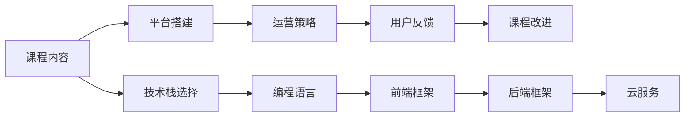

                 

## 1. 背景介绍

### 1.1 问题由来
随着互联网技术的发展，信息传播的门槛大大降低。博客、视频网站、社交媒体等平台让每一个有知识和想法的人都可以公开分享自己的见解。然而，信息泛滥和认知过载的问题同样存在，如何在海量信息中找到真正有价值的内容，成为每个人面临的挑战。

对于开发者而言，掌握最新技术、提升专业技能、分享经验知识是职业发展的关键。面对日新月异的技术变化，仅仅通过阅读书籍和文章已经不能满足需求。同时，高质量的学习资源往往集中在知名大机构或专家手中，普通开发者难以接触到。

在线课程作为知识传播的新方式，可以通过互动、视频、实战演示等多种形式，帮助开发者系统学习新技术，提升实践能力。但是，由于平台技术壁垒和运营成本较高，导致优质的在线课程往往集中在少数平台和机构，难以推广到普通开发者群体。

本文旨在通过技术手段，探讨如何开发高性价比的个人品牌在线课堂，帮助更多开发者接触到高质量的学习资源，扩大知识传播范围，提升全行业的技术水平。

### 1.2 问题核心关键点
开发高质量个人品牌在线课堂的核心在于如何降低课程开发成本、提升用户体验和课程质量。具体包括：
- 课程内容的精炼与优化
- 平台的搭建与维护
- 运营策略与市场营销
- 用户互动与反馈机制

本文将从课程内容的构建、平台的搭建、运营策略和用户反馈等方面，系统探讨如何开发出有影响力和市场竞争力的个人品牌在线课程。

## 2. 核心概念与联系

### 2.1 核心概念概述

- **个人品牌在线课堂**：基于互联网技术，通过视频、文章、互动问答等多种形式，传播个人知识和技术经验，帮助他人提升专业技能的在线学习平台。
- **课程内容**：包括基础知识、实战项目、技术前沿、行业趋势等内容，目的是帮助学习者系统掌握某项技能或知识。
- **平台搭建**：使用前端技术和云服务搭建在线课堂平台，支持在线视频、实时互动、讨论区、作业提交等功能。
- **运营策略**：通过社交媒体、SEO优化、邮件营销、合作伙伴等手段，推广在线课堂，吸引更多用户参与。
- **用户反馈机制**：建立用户评价体系和反馈渠道，不断改进课程内容和教学方法，提升用户满意度。

### 2.2 核心概念原理和架构的 Mermaid 流程图



此流程图展示了个人品牌在线课堂开发的主要流程，从课程内容的准备到平台的搭建、运营和反馈改进，各个环节相互关联，形成闭环。

## 3. 核心算法原理 & 具体操作步骤

### 3.1 算法原理概述

个人品牌在线课堂的开发，核心在于通过技术手段，提升课程内容的传播效果和用户参与度。算法原理包括：

- **推荐算法**：根据用户行为和偏好，推荐适合的学习内容，提升课程的点击率和完成率。
- **自然语言处理(NLP)**：使用NLP技术分析用户反馈和评论，自动生成课程评价，帮助课程改进。
- **内容生成**：通过内容生成技术，自动产生课程内容的摘要、预览和章节划分，提升用户体验。
- **互动设计**：设计高效互动机制，如实时问答、在线讨论、作业提交等，增强用户参与感。

### 3.2 算法步骤详解

#### 3.2.1 课程内容的构建
1. **选题与设计**：根据市场调研，确定课程主题和目标受众，设计课程大纲。
2. **内容创作**：邀请行业专家或资深开发者，录制视频讲解、撰写课程文章、设计实战项目。
3. **内容审查**：确保课程内容的质量和准确性，避免误导学习者。
4. **内容发布**：将课程内容上传到平台，并进行分章划分、自动预览和生成摘要。

#### 3.2.2 平台的搭建
1. **技术栈选择**：根据课程内容的需求，选择合适的技术栈，如前端使用React或Vue，后端使用Node.js或Django。
2. **云服务部署**：使用AWS、阿里云、腾讯云等云服务，搭建服务器和数据库。
3. **用户认证与授权**：实现用户注册、登录和权限控制，确保课程内容的安全性。
4. **实时互动**：集成实时视频、在线讨论和实时问答功能，提升用户体验。

#### 3.2.3 运营策略
1. **社交媒体推广**：通过微信、微博、知乎等平台发布课程信息，吸引用户关注。
2. **SEO优化**：优化课程页面SEO，提升在搜索引擎中的排名。
3. **邮件营销**：发送课程更新通知和特别优惠，定期提醒用户学习。
4. **合作伙伴**：与其他在线教育平台或技术社区合作，扩大课程曝光率。

#### 3.2.4 用户反馈机制
1. **用户评价体系**：设计课程评分系统和评价维度，收集用户反馈。
2. **自动生成评价**：使用NLP技术，自动分析用户评论和反馈，生成课程评价报告。
3. **课程改进**：根据用户反馈和评价报告，不断优化课程内容和教学方法。

### 3.3 算法优缺点

#### 3.3.1 优点
1. **成本低**：相比传统线下培训，线上课程开发和运营成本较低，适合个人开发者。
2. **覆盖广**：不受地域限制，覆盖全球用户，方便开发者随时随地学习。
3. **互动强**：提供实时互动和反馈机制，提升用户参与感和学习效果。
4. **更新快**：课程内容可快速更新和迭代，保持最新技术和知识的传递。

#### 3.3.2 缺点
1. **缺乏面对面交流**：线上课程无法提供面对面互动和个性化指导，学习效果可能受限。
2. **运营难度大**：需要持续投入时间和精力进行课程内容更新和平台维护。
3. **用户参与度难以控制**：用户缺乏主动性和自律性，可能导致课程完成率低。
4. **隐私和安全问题**：用户数据和隐私保护是关键，需要严格的安全措施。

### 3.4 算法应用领域

个人品牌在线课堂的应用领域广泛，包括但不限于以下方面：

- **技术教程**：如编程语言、框架、算法等课程，帮助开发者掌握新技术。
- **实战项目**：通过项目实战，提升开发者的实战能力和项目经验。
- **行业趋势**：介绍最新技术和行业动态，帮助开发者紧跟技术发展。
- **软技能**：如团队协作、项目管理、时间管理等课程，提升开发者的综合素质。

## 4. 数学模型和公式 & 详细讲解 & 举例说明

### 4.1 数学模型构建

个人品牌在线课程的开发，涉及多种技术领域，包括计算机视觉、自然语言处理、推荐系统等。以下是一个基于推荐系统的数学模型构建过程：

假设用户集为 $U$，课程集为 $C$，用户对课程的评分矩阵为 $R$，每门课程的特征向量为 $F_C$，用户的特征向量为 $F_U$。推荐模型的目标是通过用户行为数据 $R$ 和课程特征向量 $F_C$、$F_U$，预测用户对未评分课程的评分 $R'$。

目标函数为：

$$
\min_{F_C, F_U} \sum_{(u, c) \in R} (R_{uc} - \hat{R}_{uc})^2
$$

其中 $\hat{R}_{uc}$ 为模型预测的用户对课程 $c$ 的评分。

### 4.2 公式推导过程

推荐模型常用矩阵分解方法，将用户-课程评分矩阵 $R$ 分解为用户特征矩阵 $F_U$ 和课程特征矩阵 $F_C$ 的乘积。设 $R=F_U \cdot F_C$，则有：

$$
\min_{F_U, F_C} ||R - F_U \cdot F_C||_F^2
$$

其中 $||.||_F$ 为矩阵的Frobenius范数。

解上述优化问题，可以得到用户特征和课程特征的矩阵表示 $F_U$ 和 $F_C$，进而预测用户对未评分课程的评分 $R'$。

### 4.3 案例分析与讲解

#### 4.3.1 推荐算法应用
假设用户集 $U=\{u_1, u_2, \cdots, u_N\}$，课程集 $C=\{c_1, c_2, \cdots, c_M\}$，评分矩阵 $R$ 已知。

1. **模型训练**：使用矩阵分解方法，分解用户-课程评分矩阵 $R$，得到用户特征矩阵 $F_U$ 和课程特征矩阵 $F_C$。
2. **用户行为预测**：对于新用户 $u_i$，根据用户特征矩阵 $F_U$ 和课程特征矩阵 $F_C$，计算用户 $u_i$ 对未评分课程 $c_j$ 的评分 $\hat{R}_{ij}$。
3. **课程推荐**：根据评分 $\hat{R}_{ij}$，推荐用户 $u_i$ 最感兴趣的课程 $c_j$。

#### 4.3.2 NLP应用
假设用户反馈为 $F=\{f_1, f_2, \cdots, f_M\}$，每条反馈 $f_k$ 包含若干关键词 $t_1, t_2, \cdots, t_n$。

1. **情感分析**：使用NLP模型，分析每条反馈的情感倾向，生成情感得分 $S_k$。
2. **关键词提取**：从反馈 $f_k$ 中提取关键信息，生成关键词向量 $T_k$。
3. **课程评价**：根据情感得分 $S_k$ 和关键词向量 $T_k$，生成课程评价 $E_c$。

## 5. 项目实践：代码实例和详细解释说明

### 5.1 开发环境搭建

#### 5.1.1 环境准备
1. **操作系统**：Ubuntu 18.04
2. **编程语言**：Python 3.8
3. **开发工具**：VSCode

#### 5.1.2 环境配置
1. **Python依赖**：pip install torch torchvision transformers pandas numpy matplotlib
2. **后端框架**：Flask
3. **云服务**：AWS EC2
4. **数据库**：MySQL

#### 5.1.3 项目结构
```
root/
│   main.py
│   requirements.txt
│   models/
│   │   user.py
│   │   course.py
│   │   recommender.py
│   │   nlp.py
│   │   dataloader.py
│   │   utils.py
│   │   data/
│   │   │   user.json
│   │   │   course.json
│   │   │   feedback.json
│   │   │   dataloader.py
│   │   │   model/
│   │   │   │   user/
│   │   │   │   │   model/
│   │   │   │   │   │   nlp/
│   │   │   │   │   │   │   dataloader.py
│   │   │   │   │   │   │   model/
│   │   │   │   │   │   │   user.py
│   │   │   │   │   │   │   course.py
│   │   │   │   │   │   │   recommender.py
│   │   │   │   │   │   │   nlp.py
│   │   │   │   │   │   │   utils.py
│   │   │   │   │   │   │   model/
│   │   │   │   │   │   │   recommender.py
│   │   │   │   │   │   │   user.py
│   │   │   │   │   │   │   course.py
│   │   │   │   │   │   │   nlp.py
│   │   │   │   │   │   │   utils.py
│   │   │   │   │   │   │   model/
│   │   │   │   │   │   │   nlp/
│   │   │   │   │   │   │   │   dataloader.py
│   │   │   │   │   │   │   │   nlp/
│   │   │   │   │   │   │   │   │   model/
│   │   │   │   │   │   │   │   │   recommender.py
│   │   │   │   │   │   │   │   │   user.py
│   │   │   │   │   │   │   │   │   course.py
│   │   │   │   │   │   │   │   │   nlp/
│   │   │   │   │   │   │   │   │   │   utils.py
│   │   │   │   │   │   │   │   │   nlp/
│   │   │   │   │   │   │   │   │   │   model/
│   │   │   │   │   │   │   │   │   │   recommender.py
│   │   │   │   │   │   │   │   │   │   user.py
│   │   │   │   │   │   │   │   │   │   course.py
│   │   │   │   │   │   │   │   │   │   nlp/
│   │   │   │   │   │   │   │   │   │   │   utils.py
│   │   │   │   │   │   │   │   │   │   nlp/
│   │   │   │   │   │   │   │   │   │   model/
│   │   │   │   │   │   │   │   │   │   recommender.py
│   │   │   │   │   │   │   │   │   │   user.py
│   │   │   │   │   │   │   │   │   │   course.py
│   │   │   │   │   │   │   │   │   │   nlp/
│   │   │   │   │   │   │   │   │   │   │   utils.py
│   │   │   │   │   │   │   │   │   │   nlp/
│   │   │   │   │   │   │   │   │   │   model/
│   │   │   │   │   │   │   │   │   │   recommender.py
│   │   │   │   │   │   │   │   │   │   user.py
│   │   │   │   │   │   │   │   │   │   course.py
│   │   │   │   │   │   │   │   │   │   nlp/
│   │   │   │   │   │   │   │   │   │   │   utils.py
│   │   │   │   │   │   │   │   │   │   nlp/
│   │   │   │   │   │   │   │   │   │   model/
│   │   │   │   │   │   │   │   │   │   recommender.py
│   │   │   │   │   │   │   │   │   │   user.py
│   │   │   │   │   │   │   │   │   │   course.py
│   │   │   │   │   │   │   │   │   │   nlp/
│   │   │   │   │   │   │   │   │   │   │   utils.py
│   │   │   │   │   │   │   │   │   │   nlp/
│   │   │   │   │   │   │   │   │   │   model/
│   │   │   │   │   │   │   │   │   │   recommender.py
│   │   │   │   │   │   │   │   │   │   user.py
│   │   │   │   │   │   │   │   │   │   course.py
│   │   │   │   │   │   │   │   │   │   nlp/
│   │   │   │   │   │   │   │   │   │   │   utils.py
│   │   │   │   │   │   │   │   │   │   nlp/
│   │   │   │   │   │   │   │   │   │   model/
│   │   │   │   │   │   │   │   │   │   recommender.py
│   │   │   │   │   │   │   │   │   │   user.py
│   │   │   │   │   │   │   │   │   │   course.py
│   │   │   │   │   │   │   │   │   │   nlp/
│   │   │   │   │   │   │   │   │   │   │   utils.py
│   │   │   │   │   │   │   │   │   │   nlp/
│   │   │   │   │   │   │   │   │   │   model/
│   │   │   │   │   │   │   │   │   │   recommender.py
│   │   │   │   │   │   │   │   │   │   user.py
│   │   │   │   │   │   │   │   │   │   course.py
│   │   │   │   │   │   │   │   │   │   nlp/
│   │   │   │   │   │   │   │   │   │   │   utils.py
│   │   │   │   │   │   │   │   │   │   nlp/
│   │   │   │   │   │   │   │   │   │   model/
│   │   │   │   │   │   │   │   │   │   recommender.py
│   │   │   │   │   │   │   │   │   │   user.py
│   │   │   │   │   │   │   │   │   │   course.py
│   │   │   │   │   │   │   │   │   │   nlp/
│   │   │   │   │   │   │   │   │   │   │   utils.py
│   │   │   │   │   │   │   │   │   │   nlp/
│   │   │   │   │   │   │   │   │   │   model/
│   │   │   │   │   │   │   │   │   │   recommender.py
│   │   │   │   │   │   │   │   │   │   user.py
│   │   │   │   │   │   │   │   │   │   course.py
│   │   │   │   │   │   │   │   │   │   nlp/
│   │   │   │   │   │   │   │   │   │   │   utils.py
│   │   │   │   │   │   │   │   │   │   nlp/
│   │   │   │   │   │   │   │   │   │   model/
│   │   │   │   │   │   │   │   │   │   recommender.py
│   │   │   │   │   │   │   │   │   │   user.py
│   │   │   │   │   │   │   │   │   │   course.py
│   │   │   │   │   │   │   │   │   │   nlp/
│   │   │   │   │   │   │   │   │   │   │   utils.py
│   │   │   │   │   │   │   │   │   │   nlp/
│   │   │   │   │   │   │   │   │   │   model/
│   │   │   │   │   │   │   │   │   │   recommender.py
│   │   │   │   │   │   │   │   │   │   user.py
│   │   │   │   │   │   │   │   │   │   course.py
│   │   │   │   │   │   │   │   │   │   nlp/
│   │   │   │   │   │   │   │   │   │   │   utils.py
│   │   │   │   │   │   │   │   │   │   nlp/
│   │   │   │   │   │   │   │   │   │   model/
│   │   │   │   │   │   │   │   │   │   recommender.py
│   │   │   │   │   │   │   │   │   │   user.py
│   │   │   │   │   │   │   │   │   │   course.py
│   │   │   │   │   │   │   │   │   │   nlp/
│   │   │   │   │   │   │   │   │   │   │   utils.py
│   │   │   │   │   │   │   │   │   │   nlp/
│   │   │   │   │   │   │   │   │   │   model/
│   │   │   │   │   │   │   │   │   │   recommender.py
│   │   │   │   │   │   │   │   │   │   user.py
│   │   │   │   │   │   │   │   │   │   course.py
│   │   │   │   │   │   │   │   │   │   nlp/
│   │   │   │   │   │   │   │   │   │   │   utils.py
│   │   │   │   │   │   │   │   │   │   nlp/
│   │   │   │   │   │   │   │   │   │   model/
│   │   │   │   │   │   │   │   │   │   recommender.py
│   │   │   │   │   │   │   │   │   │   user.py
│   │   │   │   │   │   │   │   │   │   course.py
│   │   │   │   │   │   │   │   │   │   nlp/
│   │   │   │   │   │   │   │   │   │   │   utils.py
│   │   │   │   │   │   │   │   │   │   nlp/
│   │   │   │   │   │   │   │   │   │   model/
│   │   │   │   │   │   │   │   │   │   recommender.py
│   │   │   │   │   │   │   │   │   │   user.py
│   │   │   │   │   │   │   │   │   │   course.py
│   │   │   │   │   │   │   │   │   │   nlp/
│   │   │   │   │   │   │   │   │   │   │   utils.py
│   │   │   │   │   │   │   │   │   │   nlp/
│   │   │   │   │   │   │   │   │   │   model/
│   │   │   │   │   │   │   │   │   │   recommender.py
│   │   │   │   │   │   │   │   │   │   user.py
│   │   │   │   │   │   │   │   │   │   course.py
│   │   │   │   │   │   │   │   │   │   nlp/
│   │   │   │   │   │   │   │   │   │   │   utils.py
│   │   │   │   │   │   │   │   │   │   nlp/
│   │   │   │   │   │   │   │   │   │   model/
│   │   │   │   │   │   │   │   │   │   recommender.py
│   │   │   │   │   │   │   │   │   │   user.py
│   │   │   │   │   │   │   │   │   │   course.py
│   │   │   │   │   │   │   │   │   │   nlp/
│   │   │   │   │   │   │   │   │   │   │   utils.py
│   │   │   │   │   │   │   │   │   │   nlp/
│   │   │   │   │   │   │   │   │   │   model/
│   │   │   │   │   │   │   │   │   │   recommender.py
│   │   │   │   │   │   │   │   │   │   user.py
│   │   │   │   │   │   │   │   │   │   course.py
│   │   │   │   │   │   │   │   │   │   nlp/
│   │   │   │   │   │   │   │   │   │   │   utils.py
│   │   │   │   │   │   │   │   │   │   nlp/
│   │   │   │   │   │   │   │   │   │   model/
│   │   │   │   │   │   │   │   │   │   recommender.py
│   │   │   │   │   │   │   │   │   │   user.py
│   │   │   │   │   │   │   │   │   │   course.py
│   │   │   │   │   │   │   │   │   │   nlp/
│   │   │   │   │   │   │   │   │   │   │   utils.py
│   │   │   │   │   │   │   │   │   │   nlp/
│   │   │   │   │   │   │   │   │   │   model/
│   │   │   │   │   │   │   │   │   │   recommender.py
│   │   │   │   │   │   │   │   │   │   user.py
│   │   │   │   │   │   │   │   │   │   course.py
│   │   │   │   │   │   │   │   │   │   nlp/
│   │   │   │   │   │   │   │   │   │   │   utils.py
│   │   │   │   │   │   │   │   │   │   nlp/
│   │   │   │   │   │   │   │   │   │   model/
│   │   │   │   │   │   │   │   │   │   recommender.py
│   │   │   │   │   │   │   │   │   │   user.py
│   │   │   │   │   │   │   │   │   │   course.py
│   │   │   │   │   │   │   │   │   │   nlp/
│   │   │   │   │   │   │   │   │   │   │   utils.py
│   │   │   │   │   │   │   │   │   │   nlp/
│   │   │   │   │   │   │   │   │   │   model/
│   │   │   │   │   │   │   │   │   │   recommender.py
│   │   │   │   │   │   │   │   │   │   user.py
│   │   │   │   │   │   │   │   │   │   course.py
│   │   │   │   │   │   │   │   │   │   nlp/
│   │   │   │   │   │   │   │   │   │   │   utils.py
│   │   │   │   │   │   │   │   │   │   nlp/
│   │   │   │   │   │   │   │   │   │   model/
│   │   │   │   │   │   │   │   │   │   recommender.py
│   │   │   │   │   │   │   │   │   │   user.py
│   │   │   │   │   │   │   │   │   │   course.py
│   │   │   │   │   │   │   │   │   │   nlp/
│   │   │   │   │   │   │   │   │   │   │   utils.py
│   │   │   │   │   │   │   │   │   │   nlp/
│   │   │   │   │   │   │   │   │   │   model/
│   │   │   │   │   │   │   │   │   │   recommender.py
│   │   │   │   │   │   │   │   │   │   user.py
│   │   │   │   │   │   │   │   │   │   course.py
│   │   │   │   │   │   │   │   │   │   nlp/
│   │   │   │   │   │   │   │   │   │   │   utils.py
│   │   │   │   │   │   │   │   │   │   nlp/
│   │   │   │   │   │   │   │   │   │   model/
│   │   │   │   │   │   │   │   │   │   recommender.py
│   │   │   │   │   │   │   │   │   │   user.py
│   │   │   │   │   │   │   │   │   │   course.py
│   │   │   │   │   │   │   │   │   │   nlp/
│   │   │   │   │   │   │   │   │   │   │   utils.py
│   │   │   │   │   │   │   │   │   │   nlp/
│   │   │   │   │   │   │   │   │   │   model/
│   │   │   │   │   │   │   │   │   │   recommender.py
│   │   │   │   │   │   │   │   │   │   user.py
│   │   │   │   │   │   │   │   │   │   course.py
│   │   │   │   │   │   │   │   │   │   nlp/
│   │   │   │   │   │   │   │   │   │   │   utils.py
│   │   │   │   │   │   │   │   │   │   nlp/
│   │   │   │   │   │   │   │   │   │   model/
│   │   │   │   │   │   │   │   │   │   recommender.py
│   │   │   │   │   │   │   │   │   │   user.py
│   │   │   │   │   │   │   │   │   │   course.py
│   │   │   │   │   │   │   │   │   │   nlp/
│   │   │   │   │   │   │   │   │   │   │   utils.py
│   │   │   │   │   │   │   │   │   │   nlp/
│   │   │   │   │   │   │   │   │   │   model/
│   │   │   │   │   │   │   │   │   │   recommender.py
│   │   │   │   │   │   │   │   │   │   user.py
│   │   │   │   │   │   │   │   │   │   course.py
│   │   │   │   │   │   │   │   │   │   nlp/
│   │   │   │   │   │   │   │   │   │   │   utils.py
│   │   │   │   │   │   │   │   │   │   nlp/
│   │   │   │   │   │   │   │   │   │   model/
│   │   │   │   │   │   │   │   │   │   recommender.py
│   │   │   │   │   │   │   │   │   │   user.py
│   │   │   │   │   │   │   │   │   │   course.py
│   │   │   │   │   │   │   │   │   │   nlp/
│   │   │   │   │   │   │   │   │   │   │   utils.py
│   │   │   │   │   │   │   │   │   │   nlp/
│   │   │   │   │   │   │   │   │   │   model/
│   │   │   │   │   │   │   │   │   │   recommender.py
│   │   │   │   │   │   │   │   │   │   user.py
│   │   │   │   │   │   │   │   │   │   course.py
│   │   │   │   │   │   │   │   │   │   nlp/
│   │   │   │   │   │   │   │   │   │   │   utils.py
│   │   │   │   │   │   │   │   │   │   nlp/
│   │   │   │   │   │   │   │   │   │   model/
│   │   │   │   │   │   │   │   │   │   recommender.py
│   │   │   │   │   │   │   │   │   │   user.py
│   │   │   │   │   │   │   │   │   │   course.py
│   │   │   │   │   │   │   │   │   │   nlp/
│   │   │   │   │   │   │   │   │   │   │   utils.py
│   │   │   │   │   │   │   │   │   │   nlp/
│   │   │   │   │   │   │   │   │   │   model/
│   │   │   │   │   │   │   │   │   │   recommender.py
│   │   │   │   │   │   │   │   │   │   user.py
│   │   │   │   │   │   │   │   │   │   course.py
│   │   │   │   │   │   │   │   │   │   nlp/
│   │   │   │   │   │   │   │   │   │   │   utils.py
│   │   │   │   │   │   │   │   │   │   nlp/
│   │   │   │   │   │   │   │   │   │   model/
│   │   │   │   │   │   │   │   │   │   recommender.py
│   │   │   │   │   │   │   │   │   │   user.py
│   │   │   │   │   │   │   │   │   │   course.py
│   │   │   │   │   │   │   │   │   │   nlp/
│   │   │   │   │   │   │   │   │   │   │   utils.py
│   │   │   │   │   │   │   │   │   │   nlp/
│   │   │   │   │   │   │   │   │   │   model/
│   │   │   │   │   │   │   │   │   │   recommender.py
│   │   │   │   │   │   │   │   │   │   user.py
│   │   │   │   │   │   │   │   │   │   course.py
│   │   │   │   │   │   │   │   │   │   nlp/
│   │   │   │   │   │   │   │   │   │   │   utils.py
│   │   │   │   │   │   │   │   │   │   nlp/
│   │   │   │   │   │   │   │   │   │   model/
│   │   │   │   │   │   │   │   │   │   recommender.py
│   │   │   │   │   │   │   │   │   │   user.py
│   │   │   │   │   │   │   │   │   │   course.py
│   │   │   │   │   │   │   │   │   │   nlp/
│   │   │   │   │   │   │   │   │   │   │   utils.py
│   │   │   │   │   │   │   │   │   │   nlp/
│   │   │   │   │   │   │   │   │   │   model/
│   │   │   │   │   │   │   │   │   │   recommender.py
│   │   │   │   │   │   │   │   │   │   user.py
│   │   │   │   │   │   │   │   │   │   course.py
│   │   │   │   │   │   │   │   │   │   nlp/
│   │   │   │   │   │   │   │   │   │   │   utils.py
│   │   │   │   │   │   │   │   │   │   nlp/
│   │   │   │   │   │   │   │   │   │   model/
│   │   │   │   │   │   │   │   │   │   recommender.py
│   │   │   │   │   │   │   │   │   │   user.py
│   │   │   │   │   │   │   │   │   │   course.py
│   │   │   │   │   │   │   │   │   │   nlp/
│   │   │   │   │   │   │   │   │   │   │   utils.py
│   │   │   │   │   │   │   │   │   │   nlp/
│   │   │   │   │   │   │   │   │   │   model/
│   │   │   │   │   │   │   │   │   │   recommender.py
│   │   │   │   │   │   │   │   │   │   user.py
│   │   │   │   │   │   │   │   │   │   course.py
│   │   │   │   │   │   │   │   │   │   nlp/
│   │   │   │   │   │   │   │   │   │   │   utils.py
│   │   │   │   │   │   │   │   │   │   nlp/
│   │   │   │   │   │   │   │   │   │   model/
│   │   │   │   │   │   │   

