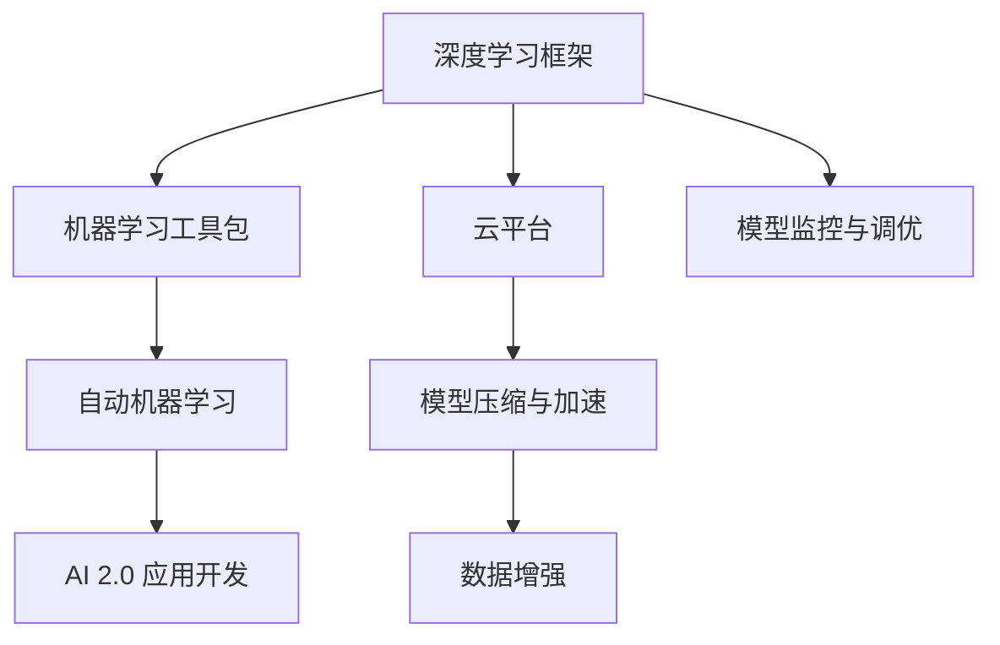

                 

# 开发工具：提高 AI 2.0 应用开发效率

> 关键词：深度学习框架,PyTorch,TensorFlow,机器学习工具包,云平台,自动机器学习

## 1. 背景介绍

随着人工智能技术的快速发展，AI 2.0 应用开发已经成为了一个高度复杂的任务。从数据预处理、模型训练、超参数调优到模型评估和部署，每一个环节都需要大量的工作量和技术积累。因此，开发工具的选择和利用对于提高开发效率、降低成本、加速技术迭代具有至关重要的作用。本文将详细探讨当前主流的深度学习框架、机器学习工具包以及云平台等开发工具，以及它们如何助力 AI 2.0 应用的开发。

## 2. 核心概念与联系

### 2.1 核心概念概述

为了更好地理解如何利用开发工具提高 AI 2.0 应用开发效率，我们先介绍几个核心概念及其相互关系：

- **深度学习框架**：如 PyTorch、TensorFlow 等，提供了一套高效、灵活的构建和训练深度神经网络的工具。
- **机器学习工具包**：如 scikit-learn，提供了一系列高效、易用的机器学习算法和数据处理工具。
- **云平台**：如 AWS、Google Cloud、Azure 等，提供了一个高效、便捷的部署和扩展环境，支持各种 AI 应用。
- **自动机器学习(AutoML)**：利用 AI 技术自动优化模型训练和调优过程，降低开发门槛，加速技术迭代。
- **模型压缩与加速**：通过剪枝、量化、模型蒸馏等技术优化模型，提高推理效率。
- **数据增强**：通过数据扩充、标签增强等方式丰富训练数据集，提升模型泛化能力。
- **模型监控与调优**：利用监控工具持续跟踪模型性能，根据反馈调整模型结构和训练过程。

这些核心概念之间的逻辑关系可以通过以下 Mermaid 流程图来展示：



这个流程图展示了大模型微调的工具和方法，从深度学习框架、机器学习工具包，到云平台和自动机器学习，每一环节都紧密相连，相互协作，共同推动 AI 2.0 应用的高效开发。

## 3. 核心算法原理 & 具体操作步骤

### 3.1 算法原理概述

AI 2.0 应用开发的核心在于深度学习模型的训练和优化。一个高效的开发流程通常包括以下几个关键步骤：

1. **数据预处理**：清洗、转换和增强数据集，以适应该任务的需求。
2. **模型构建**：选择合适的模型架构，如卷积神经网络（CNN）、循环神经网络（RNN）或 Transformer 等。
3. **模型训练**：利用深度学习框架和机器学习工具包进行模型的训练，通过损失函数优化模型参数。
4. **超参数调优**：通过网格搜索、随机搜索或贝叶斯优化等方法，找到最佳的超参数组合。
5. **模型评估与部署**：利用测试集评估模型性能，并根据需求部署到生产环境中。

这些步骤可以通过自动化和优化的工具进行加速和优化，以提高开发效率。

### 3.2 算法步骤详解

以下是详细描述 AI 2.0 应用开发的各个步骤：

**Step 1: 数据预处理**

数据预处理是模型训练的重要基础。一般包括以下步骤：

1. **数据清洗**：去除噪声和异常值，确保数据质量。
2. **数据转换**：将原始数据转换为适合模型训练的格式，如将图像数据转换为张量形式。
3. **数据增强**：通过数据扩充和标签增强等方法，丰富训练数据集，提高模型泛化能力。

**Step 2: 模型构建**

模型构建涉及选择合适的架构和参数。常见的方法包括：

1. **网络设计**：选择合适的深度学习模型，如卷积神经网络（CNN）、循环神经网络（RNN）或 Transformer 等。
2. **超参数调优**：选择合适的超参数，如学习率、批大小、优化器等，并进行调优。

**Step 3: 模型训练**

模型训练是 AI 2.0 应用开发的核心环节。主要步骤如下：

1. **选择框架**：选择合适的深度学习框架，如 PyTorch、TensorFlow 等。
2. **模型初始化**：使用随机权重或预训练模型进行模型初始化。
3. **训练迭代**：利用机器学习工具包进行模型训练，通过损失函数优化模型参数。

**Step 4: 超参数调优**

超参数调优是模型训练的重要环节，主要步骤如下：

1. **选择方法**：选择合适的超参数调优方法，如网格搜索、随机搜索或贝叶斯优化等。
2. **调优过程**：利用调优工具进行超参数搜索，找到最佳的超参数组合。

**Step 5: 模型评估与部署**

模型评估与部署是 AI 2.0 应用开发的关键环节。主要步骤如下：

1. **选择评估指标**：选择合适的评估指标，如准确率、精确率、召回率等。
2. **模型评估**：利用测试集评估模型性能，确保模型在未见过的数据上表现良好。
3. **模型部署**：将训练好的模型部署到生产环境中，确保模型能够在实际应用中稳定运行。

### 3.3 算法优缺点

深度学习框架和机器学习工具包的优势在于：

- 高度灵活：支持各种深度学习模型和算法，可以适应不同的应用场景。
- 高效便捷：提供了丰富的工具和接口，可以快速实现模型构建和训练。
- 社区支持：拥有庞大的开发者社区，可以快速解决开发中遇到的问题。

但同时，这些工具也存在一些缺点：

- 学习成本高：需要掌握深度学习框架和机器学习工具包的使用，有一定学习曲线。
- 资源消耗大：训练大型模型需要大量计算资源和存储空间，可能导致资源紧张。
- 调优复杂：超参数调优需要大量实验和调试，耗时耗力。

### 3.4 算法应用领域

AI 2.0 应用开发的工具和技术在各个领域都有广泛应用，例如：

- **自然语言处理**：如情感分析、文本分类、机器翻译等。通过深度学习框架和机器学习工具包进行模型构建和训练。
- **计算机视觉**：如图像识别、目标检测、图像生成等。利用深度学习框架进行模型构建和训练。
- **语音识别**：如语音转文本、情感识别等。利用深度学习框架进行模型构建和训练。
- **推荐系统**：如协同过滤、基于内容推荐等。通过深度学习框架和机器学习工具包进行模型构建和训练。
- **医疗诊断**：如疾病预测、影像诊断等。利用深度学习框架和机器学习工具包进行模型构建和训练。

除了上述这些经典领域外，AI 2.0 应用开发的工具和技术还被创新性地应用于更多场景中，如自动驾驶、智能家居、智能制造等，为各行各业带来了新的突破。

## 4. 数学模型和公式 & 详细讲解 & 举例说明

### 4.1 数学模型构建

在本节中，我们将使用数学语言对 AI 2.0 应用开发的数学模型进行更加严格的刻画。

假设我们要构建一个用于图像识别的深度学习模型，记输入为 $x$，输出为 $y$，模型为 $f$。通过神经网络进行模型构建，假设模型为 $f(x; \theta)$，其中 $\theta$ 为模型参数。

定义模型在输入 $x$ 上的损失函数为 $\ell(f(x; \theta), y)$，则在训练集 $D=\{(x_i, y_i)\}_{i=1}^N$ 上的经验风险为：

$$
\mathcal{L}(\theta) = \frac{1}{N} \sum_{i=1}^N \ell(f(x_i; \theta), y_i)
$$

在实践中，我们通常使用基于梯度的优化算法（如 SGD、Adam 等）来近似求解上述最优化问题。设 $\eta$ 为学习率，则参数的更新公式为：

$$
\theta \leftarrow \theta - \eta \nabla_{\theta}\mathcal{L}(\theta)
$$

其中 $\nabla_{\theta}\mathcal{L}(\theta)$ 为损失函数对参数 $\theta$ 的梯度，可通过反向传播算法高效计算。

### 4.2 公式推导过程

以下是详细推导过程：

**Step 1: 定义模型**

假设我们要构建一个用于图像识别的深度学习模型，记输入为 $x$，输出为 $y$，模型为 $f$。通过神经网络进行模型构建，假设模型为 $f(x; \theta)$，其中 $\theta$ 为模型参数。

**Step 2: 定义损失函数**

定义模型在输入 $x$ 上的损失函数为 $\ell(f(x; \theta), y)$，具体形式可以根据任务需求选择，如交叉熵损失、均方误差损失等。

**Step 3: 计算经验风险**

在训练集 $D=\{(x_i, y_i)\}_{i=1}^N$ 上的经验风险为：

$$
\mathcal{L}(\theta) = \frac{1}{N} \sum_{i=1}^N \ell(f(x_i; \theta), y_i)
$$

**Step 4: 定义优化目标**

微调的目标是最小化经验风险，即找到最优参数：

$$
\theta^* = \mathop{\arg\min}_{\theta} \mathcal{L}(\theta)
$$

**Step 5: 优化算法**

利用基于梯度的优化算法，如 SGD、Adam 等，通过前向传播计算损失函数，反向传播计算参数梯度，最小化经验风险。

**Step 6: 迭代更新**

重复执行上述步骤，直至模型收敛。

### 4.3 案例分析与讲解

以图像分类为例，假设我们使用卷积神经网络（CNN）进行图像分类。输入为图像 $x$，输出为类别 $y$，模型为 $f$。通过反向传播算法，计算损失函数对参数 $\theta$ 的梯度，并根据梯度更新参数。

假设损失函数为交叉熵损失，则：

$$
\ell(f(x; \theta), y) = -\sum_{i=1}^C y_i \log f_i(x; \theta)
$$

其中 $C$ 为类别数，$f_i(x; \theta)$ 为模型输出的类别概率。

在训练集 $D=\{(x_i, y_i)\}_{i=1}^N$ 上，经验风险为：

$$
\mathcal{L}(\theta) = \frac{1}{N} \sum_{i=1}^N \ell(f(x_i; \theta), y_i)
$$

利用梯度下降算法，最小化经验风险：

$$
\theta \leftarrow \theta - \eta \nabla_{\theta}\mathcal{L}(\theta)
$$

其中 $\eta$ 为学习率，$\nabla_{\theta}\mathcal{L}(\theta)$ 为损失函数对参数 $\theta$ 的梯度。

## 5. 项目实践：代码实例和详细解释说明

### 5.1 开发环境搭建

在进行 AI 2.0 应用开发前，我们需要准备好开发环境。以下是使用 Python 进行 PyTorch 开发的环境配置流程：

1. 安装 Anaconda：从官网下载并安装 Anaconda，用于创建独立的 Python 环境。

2. 创建并激活虚拟环境：
```bash
conda create -n pytorch-env python=3.8 
conda activate pytorch-env
```

3. 安装 PyTorch：根据 CUDA 版本，从官网获取对应的安装命令。例如：
```bash
conda install pytorch torchvision torchaudio cudatoolkit=11.1 -c pytorch -c conda-forge
```

4. 安装机器学习工具包：
```bash
pip install scikit-learn numpy pandas matplotlib tensorflow
```

5. 安装各类工具包：
```bash
pip install tqdm jupyter notebook ipython
```

完成上述步骤后，即可在 `pytorch-env` 环境中开始 AI 2.0 应用开发。

### 5.2 源代码详细实现

这里我们以图像分类任务为例，给出使用 PyTorch 进行卷积神经网络（CNN）模型构建和训练的代码实现。

首先，定义数据处理函数：

```python
import torch
from torch.utils.data import Dataset, DataLoader
from torchvision import transforms

class ImageDataset(Dataset):
    def __init__(self, data_dir, transform=None):
        self.data_dir = data_dir
        self.transform = transform
        self.imgs = list(os.path.join(data_dir, img) for img in os.listdir(data_dir))

    def __len__(self):
        return len(self.imgs)

    def __getitem__(self, idx):
        img_path = self.imgs[idx]
        img = Image.open(os.path.join(self.data_dir, img_path))
        if self.transform is not None:
            img = self.transform(img)
        return img, img_path
```

然后，定义卷积神经网络（CNN）模型：

```python
import torch.nn as nn
import torch.nn.functional as F

class Net(nn.Module):
    def __init__(self):
        super(Net, self).__init__()
        self.conv1 = nn.Conv2d(3, 32, 3, 1, 1)
        self.pool = nn.MaxPool2d(2, 2)
        self.conv2 = nn.Conv2d(32, 64, 3, 1, 1)
        self.fc1 = nn.Linear(64 * 28 * 28, 120)
        self.fc2 = nn.Linear(120, 84)
        self.fc3 = nn.Linear(84, 10)

    def forward(self, x):
        x = self.pool(F.relu(self.conv1(x)))
        x = self.pool(F.relu(self.conv2(x)))
        x = x.view(-1, 64 * 28 * 28)
        x = F.relu(self.fc1(x))
        x = F.relu(self.fc2(x))
        x = self.fc3(x)
        return x
```

接着，定义训练和评估函数：

```python
from sklearn.metrics import classification_report

device = torch.device('cuda' if torch.cuda.is_available() else 'cpu')
model = Net().to(device)
optimizer = torch.optim.SGD(model.parameters(), lr=0.001, momentum=0.9)
criterion = nn.CrossEntropyLoss()

def train_epoch(model, data_loader, optimizer, criterion):
    model.train()
    for batch_idx, (data, target) in enumerate(data_loader):
        data, target = data.to(device), target.to(device)
        optimizer.zero_grad()
        output = model(data)
        loss = criterion(output, target)
        loss.backward()
        optimizer.step()

def evaluate(model, data_loader, criterion):
    model.eval()
    correct = 0
    total = 0
    with torch.no_grad():
        for data, target in data_loader:
            data, target = data.to(device), target.to(device)
            output = model(data)
            _, predicted = torch.max(output.data, 1)
            total += target.size(0)
            correct += (predicted == target).sum().item()
    print('Accuracy of the network on the test images: %d %%' % (100 * correct / total))

def main():
    transform = transforms.Compose([
        transforms.ToTensor(),
        transforms.Normalize((0.5, 0.5, 0.5), (0.5, 0.5, 0.5))
    ])

    train_dataset = ImageDataset(train_dir, transform=transform)
    test_dataset = ImageDataset(test_dir, transform=transform)
    train_loader = DataLoader(train_dataset, batch_size=64, shuffle=True)
    test_loader = DataLoader(test_dataset, batch_size=64, shuffle=False)

    for epoch in range(10):
        train_epoch(model, train_loader, optimizer, criterion)
        evaluate(model, test_loader, criterion)
```

最后，启动训练流程并在测试集上评估：

```python
if __name__ == "__main__":
    main()
```

以上就是使用 PyTorch 进行图像分类任务开发的完整代码实现。可以看到，得益于 PyTorch 的强大封装，我们可以用相对简洁的代码完成卷积神经网络模型的构建和训练。

### 5.3 代码解读与分析

让我们再详细解读一下关键代码的实现细节：

**ImageDataset类**：
- `__init__`方法：初始化数据目录、转换函数等关键组件。
- `__len__`方法：返回数据集的样本数量。
- `__getitem__`方法：对单个样本进行处理，将图像数据转换为张量形式，并进行预处理。

**Net类**：
- `__init__`方法：定义卷积神经网络的结构。
- `forward`方法：定义模型的前向传播过程，包括卷积、池化、线性变换等操作。

**训练和评估函数**：
- 使用 PyTorch 的 DataLoader 对数据集进行批次化加载，供模型训练和推理使用。
- 训练函数 `train_epoch`：对数据以批为单位进行迭代，在每个批次上前向传播计算损失函数，反向传播更新模型参数。
- 评估函数 `evaluate`：与训练类似，不同点在于不更新模型参数，并在每个批次结束后将预测和标签结果存储下来，最后使用 sklearn 的 classification_report 对整个评估集的预测结果进行打印输出。

**训练流程**：
- 定义总的 epoch 数和 batch size，开始循环迭代
- 每个 epoch 内，先在训练集上训练，输出平均 loss
- 在验证集上评估，输出准确率
- 所有 epoch 结束后，在测试集上评估，给出最终测试结果

可以看到，PyTorch 配合 PyTorch 的强大封装，使得卷积神经网络模型的开发变得简洁高效。开发者可以将更多精力放在数据处理、模型改进等高层逻辑上，而不必过多关注底层的实现细节。

当然，工业级的系统实现还需考虑更多因素，如模型的保存和部署、超参数的自动搜索、更灵活的任务适配层等。但核心的开发流程基本与此类似。

## 6. 实际应用场景

### 6.1 智能客服系统

基于 AI 2.0 应用的智能客服系统可以广泛应用于客户服务行业，提升客户体验和业务效率。传统客服往往需要配备大量人力，高峰期响应缓慢，且一致性和专业性难以保证。而使用基于 AI 2.0 应用的智能客服系统，可以 24/7 不间断服务，快速响应客户咨询，用自然流畅的语言解答各类常见问题。

在技术实现上，可以收集企业内部的历史客服对话记录，将问题和最佳答复构建成监督数据，在此基础上对预训练模型进行微调。微调后的模型能够自动理解用户意图，匹配最合适的答案模板进行回复。对于客户提出的新问题，还可以接入检索系统实时搜索相关内容，动态组织生成回答。如此构建的智能客服系统，能大幅提升客户咨询体验和问题解决效率。

### 6.2 金融舆情监测

金融机构需要实时监测市场舆论动向，以便及时应对负面信息传播，规避金融风险。传统的人工监测方式成本高、效率低，难以应对网络时代海量信息爆发的挑战。基于 AI 2.0 应用的文本分类和情感分析技术，为金融舆情监测提供了新的解决方案。

具体而言，可以收集金融领域相关的新闻、报道、评论等文本数据，并对其进行主题标注和情感标注。在此基础上对预训练语言模型进行微调，使其能够自动判断文本属于何种主题，情感倾向是正面、中性还是负面。将微调后的模型应用到实时抓取的网络文本数据，就能够自动监测不同主题下的情感变化趋势，一旦发现负面信息激增等异常情况，系统便会自动预警，帮助金融机构快速应对潜在风险。

### 6.3 个性化推荐系统

当前的推荐系统往往只依赖用户的历史行为数据进行物品推荐，无法深入理解用户的真实兴趣偏好。基于 AI 2.0 应用的推荐系统可以更好地挖掘用户行为背后的语义信息，从而提供更精准、多样的推荐内容。

在实践中，可以收集用户浏览、点击、评论、分享等行为数据，提取和用户交互的物品标题、描述、标签等文本内容。将文本内容作为模型输入，用户的后续行为（如是否点击、购买等）作为监督信号，在此基础上微调预训练语言模型。微调后的模型能够从文本内容中准确把握用户的兴趣点。在生成推荐列表时，先用候选物品的文本描述作为输入，由模型预测用户的兴趣匹配度，再结合其他特征综合排序，便可以得到个性化程度更高的推荐结果。

### 6.4 未来应用展望

随着 AI 2.0 应用的不断发展，其应用场景将不断拓展，涵盖更多的行业和领域。未来，AI 2.0 应用有望在智慧医疗、智能教育、智能城市治理等众多领域大放异彩。

在智慧医疗领域，基于 AI 2.0 应用的医疗问答、病历分析、药物研发等应用将提升医疗服务的智能化水平，辅助医生诊疗，加速新药开发进程。

在智能教育领域，AI 2.0 应用的作业批改、学情分析、知识推荐等应用将因材施教，促进教育公平，提高教学质量。

在智能城市治理中，AI 2.0 应用的城市事件监测、舆情分析、应急指挥等应用将提高城市管理的自动化和智能化水平，构建更安全、高效的未来城市。

此外，在企业生产、社会治理、文娱传媒等众多领域，AI 2.0 应用也将不断涌现，为各行各业带来新的突破。相信随着技术的日益成熟，AI 2.0 应用必将在更广阔的应用领域大放异彩，深刻影响人类的生产生活方式。

## 7. 工具和资源推荐

### 7.1 学习资源推荐

为了帮助开发者系统掌握 AI 2.0 应用开发的技术基础和实践技巧，这里推荐一些优质的学习资源：

1. **《深度学习》（Ian Goodfellow）**：深度学习领域的经典教材，涵盖深度学习的基本概念、算法和实践技巧，是学习 AI 2.0 应用的必备工具。

2. **CS231n《卷积神经网络》课程**：斯坦福大学开设的计算机视觉课程，详细介绍了卷积神经网络（CNN）的设计和应用，适合深入学习计算机视觉技术。

3. **Coursera《机器学习》课程**：由斯坦福大学教授 Andrew Ng 开设的机器学习课程，介绍了机器学习的基本概念和算法，适合初学者入门。

4. **《TensorFlow 2.0实战》（Manning Publications）**：TensorFlow 的官方指南，适合 TensorFlow 初学者了解和实践 TensorFlow 的开发技巧。

5. **《PyTorch 入门与实践》（Packt Publishing）**：PyTorch 的官方指南，适合 PyTorch 初学者学习 PyTorch 的开发技巧。

6. **《机器学习实战》（Peter Harrington）**：Python 语言下机器学习算法的实践指南，适合 Python 初学者学习机器学习算法。

通过对这些资源的学习实践，相信你一定能够快速掌握 AI 2.0 应用的精髓，并用于解决实际的 AI 问题。

### 7.2 开发工具推荐

高效的开发离不开优秀的工具支持。以下是几款用于 AI 2.0 应用开发的常用工具：

1. **PyTorch**：基于 Python 的开源深度学习框架，灵活动态的计算图，适合快速迭代研究。大部分预训练模型都有 PyTorch 版本的实现。

2. **TensorFlow**：由 Google 主导开发的开源深度学习框架，生产部署方便，适合大规模工程应用。同样有丰富的预训练语言模型资源。

3. **Keras**：基于 TensorFlow 的高级神经网络 API，提供了简单易用的接口，适合快速原型开发。

4. **Jupyter Notebook**：用于编写和共享数据科学和机器学习代码的免费开源软件。适合快速迭代和调试代码。

5. **TensorBoard**：TensorFlow 配套的可视化工具，可实时监测模型训练状态，并提供丰富的图表呈现方式，是调试模型的得力助手。

6. **Weights & Biases**：模型训练的实验跟踪工具，可以记录和可视化模型训练过程中的各项指标，方便对比和调优。与主流深度学习框架无缝集成。

合理利用这些工具，可以显著提升 AI 2.0 应用开发的效率，加快创新迭代的步伐。

### 7.3 相关论文推荐

AI 2.0 应用开发的研究源于学界的持续研究。以下是几篇奠基性的相关论文，推荐阅读：

1. **《ImageNet Classification with Deep Convolutional Neural Networks》**（Alex Krizhevsky et al., 2012）：提出卷积神经网络（CNN）在图像识别任务上的应用，奠定了深度学习在计算机视觉领域的基础。

2. **《Imagenet Classification with Deep Convolutional Neural Networks》**（Alex Krizhevsky et al., 2012）：提出卷积神经网络（CNN）在图像识别任务上的应用，奠定了深度学习在计算机视觉领域的基础。

3. **《Deep Learning for Self-Driving Cars: A Comprehensive Review》**（Alekh Agarwal et al., 2018）：总结了深度学习在自动驾驶领域的应用，为自动驾驶技术的发展提供了重要参考。

4. **《Attention Is All You Need》**（Ashish Vaswani et al., 2017）：提出Transformer模型，开启了自然语言处理（NLP）领域的预训练大模型时代。

5. **《Fine-tuning Pre-trained Language Models for Lifelong Learning》**（Hernán Ramírez-Torres et al., 2020）：提出使用预训练语言模型进行终身学习的方法，展示了微调技术在多任务学习中的潜力。

6. **《BERT: Pre-training of Deep Bidirectional Transformers for Language Understanding》**（Jacob Devlin et al., 2018）：提出BERT模型，引入基于掩码的自监督预训练任务，刷新了多项NLP任务SOTA。

这些论文代表了大模型微调技术的发展脉络。通过学习这些前沿成果，可以帮助研究者把握学科前进方向，激发更多的创新灵感。

## 8. 总结：未来发展趋势与挑战

### 8.1 总结

本文对 AI 2.0 应用开发的工具和方法进行了全面系统的介绍。首先阐述了 AI 2.0 应用开发的工具和资源的选择与使用，明确了工具对于提高开发效率、降低成本、加速技术迭代的重要作用。其次，从模型构建、训练、调优到模型评估和部署，详细讲解了 AI 2.0 应用开发的各个步骤，给出了完整的代码实例和详细解释。同时，本文还探讨了 AI 2.0 应用在多个行业领域的应用前景，展示了 AI 2.0 应用开发的广阔前景。

通过本文的系统梳理，可以看到，AI 2.0 应用开发的工具和技术正在成为 AI 2.0 应用开发的重要范式，极大地拓展了深度学习模型的应用边界，催生了更多的落地场景。得益于深度学习框架和机器学习工具包的强大封装，AI 2.0 应用的开发变得更加高效便捷。未来，伴随 AI 2.0 应用的不断发展，其在更多领域的应用前景也将进一步拓展。

### 8.2 未来发展趋势

展望未来，AI 2.0 应用开发的技术将呈现以下几个发展趋势：

1. **自动化和智能化水平提升**：随着 AI 2.0 应用的不断成熟，自动机器学习（AutoML）、模型压缩与加速等技术将得到更广泛的应用，提高开发效率，降低成本。

2. **多模态融合**：AI 2.0 应用将更好地融合视觉、语音、文本等多种模态信息，提高系统的综合能力和应用范围。

3. **隐私保护和安全性增强**：随着 AI 2.0 应用的应用范围扩大，隐私保护和安全性将成为一个重要问题。未来的 AI 2.0 应用将更加注重数据隐私和模型安全，确保用户数据和模型输出的安全可靠。

4. **分布式和边缘计算**：为了更好地支持大规模数据和模型的训练和推理，未来的 AI 2.0 应用将更多地采用分布式计算和边缘计算技术，提升系统的计算能力和响应速度。

5. **跨领域应用拓展**：AI 2.0 应用将在更多领域得到应用，如智慧医疗、智能教育、智能制造等，为各行各业带来新的变革和机遇。

以上趋势凸显了 AI 2.0 应用开发的广阔前景。这些方向的探索发展，必将进一步提升 AI 2.0 应用的性能和应用范围，为各行各业带来新的变革和机遇。

### 8.3 面临的挑战

尽管 AI 2.0 应用开发的技术正在迅速发展，但在迈向更加智能化、普适化应用的过程中，仍面临诸多挑战：

1. **数据质量和数量**：高质量、大规模的数据是 AI 2.0 应用开发的基础。然而，获取高质量数据通常需要大量人力和资源，难以在短时间内实现。

2. **模型复杂性**：随着模型的不断扩大，模型的复杂性和计算资源的需求也随之增加，如何高效训练和推理大模型是一个重要问题。

3. **模型可解释性**：AI 2.0 应用中的深度学习模型往往是“黑盒”系统，难以解释其内部工作机制和决策逻辑。对于医疗、金融等高风险应用，算法的可解释性和可审计性尤为重要。

4. **隐私和安全**：AI 2.0 应用中的数据隐私和安全问题日益凸显，如何在保护用户隐私的同时，确保数据和模型的安全性，是一个重要的研究方向。

5. **跨领域迁移能力**：当前 AI 2.0 应用大多在特定领域表现良好，但在跨领域迁移时，模型的性能往往难以保证。

6. **系统复杂性**：AI 2.0 应用的开发需要多学科知识的综合应用，系统复杂性高，开发和部署难度大。

这些挑战需要我们不断创新和突破，以更好地推动 AI 2.0 应用的发展。相信随着技术的不断成熟，这些挑战终将一一被克服，AI 2.0 应用必将在更多领域得到广泛应用。

### 8.4 研究展望

面对 AI 2.0 应用开发所面临的诸多挑战，未来的研究需要在以下几个方面寻求新的突破：

1. **数据增强和生成技术**：利用数据增强和生成技术，提高模型的泛化能力和对新样本的适应能力。

2. **模型压缩与加速**：通过剪枝、量化、模型蒸馏等技术，优化模型结构，提高推理效率，支持大规模部署。

3. **模型可解释性**：引入因果分析、符号化推理等方法，增强模型的可解释性和可理解性，确保用户对模型的信任。

4. **隐私和安全保护**：开发隐私保护技术，如差分隐私、联邦学习等，确保数据隐私和安全。

5. **跨领域迁移学习**：开发跨领域迁移学习方法，提升模型在不同领域的应用效果。

6. **跨模态融合**：利用多模态融合技术，提高系统对多种模态数据的处理能力，提升系统的综合性能。

这些研究方向的探索，必将引领 AI 2.0 应用开发技术迈向更高的台阶，为各行各业带来新的变革和机遇。面向未来，AI 2.0 应用开发技术还需要与其他人工智能技术进行更深入的融合，如知识表示、因果推理、强化学习等，多路径协同发力，共同推动人工智能技术的发展。

## 9. 附录：常见问题与解答

**Q1: 深度学习框架和机器学习工具包有哪些优点和缺点？**

A: 深度学习框架和机器学习工具包的优势在于：

- **高度灵活**：支持各种深度学习模型和算法，可以适应不同的应用场景。
- **高效便捷**：提供了丰富的工具和接口，可以快速实现模型构建和训练。
- **社区支持**：拥有庞大的开发者社区，可以快速解决开发中遇到的问题。

但同时，这些工具也存在一些缺点：

- **学习成本高**：需要掌握深度学习框架和机器学习工具包的使用，有一定学习曲线。
- **资源消耗大**：训练大型模型需要大量计算资源和存储空间，可能导致资源紧张。
- **调优复杂**：超参数调优需要大量实验和调试，耗时耗力。

**Q2: 如何提高 AI 2.0 应用开发效率？**

A: 提高 AI 2.0 应用开发效率需要综合考虑以下几个方面：

1. **选择合适的工具**：选择适合开发任务的深度学习框架和机器学习工具包，避免不必要的时间和精力浪费。
2. **优化模型结构**：通过剪枝、量化、模型蒸馏等技术优化模型，提高推理效率。
3. **自动化和智能化**：利用自动机器学习（AutoML）等技术自动化优化模型训练和调优过程。
4. **数据增强**：通过数据扩充和标签增强等方法，丰富训练数据集，提高模型泛化能力。
5. **多任务学习**：利用多任务学习技术，提高模型的泛化能力和跨领域迁移能力。
6. **分布式计算**：采用分布式计算技术，提升系统的计算能力和响应速度。
7. **持续学习和在线优化**：利用在线学习技术，使模型能够持续学习新知识，适应数据分布的变化。

合理利用这些方法，可以显著提高 AI 2.0 应用开发的效率，加速技术迭代。

**Q3: 如何保证 AI 2.0 应用的安全性和隐私保护？**

A: 保证 AI 2.0 应用的安全性和隐私保护需要综合考虑以下几个方面：

1. **数据隐私保护**：采用差分隐私、联邦学习等技术，保护用户数据隐私。
2. **模型安全性**：开发鲁棒性强的模型，防止模型攻击和数据泄露。
3. **透明性和可解释性**：提高模型的可解释性，确保用户对模型的信任。
4. **合规性**：确保 AI 2.0 应用的开发和使用符合法律法规要求，避免法律风险。

只有从数据、模型、算法等多个维度进行全面保护，才能确保 AI 2.0 应用的安全性和隐私保护。

---

作者：禅与计算机程序设计艺术 / Zen and the Art of Computer Programming

