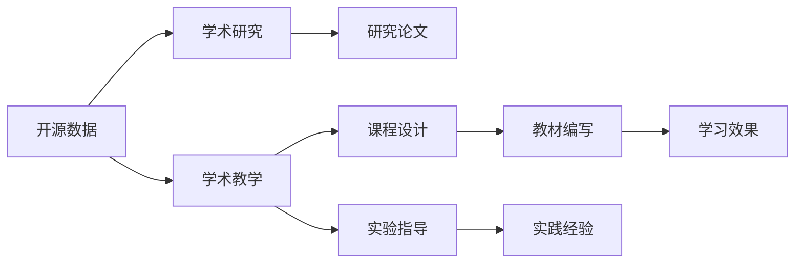

                 

## 1. 背景介绍

### 1.1 研究与教学的交叉点

近年来，开源社区在学术界中扮演了越来越重要的角色。开源不仅提供了丰富的研究资源，也为教学带来了新的方法。学术研究者们通过开源社区的资源，不仅提升了研究效率，还能将研究成果更广泛地传播。同时，他们也可以利用开源资源，结合自己的研究背景，设计新的实验和教学案例，提升教学质量。

这种研究与教学的结合，已经成为推动学术发展的重要动力。本文将详细探讨开源在学术研究与教学中的价值，为研究者们提供全面深入的见解。

## 2. 核心概念与联系

### 2.1 核心概念概述

**开源**：即开源软件开源数据，通过公共协议发布，任何个人或组织都可以使用、修改、分发。

**学术研究**：指科学领域的系统研究，旨在发现新知识、揭示自然规律，其成果通常以研究论文、专利、技术报告等形式呈现。

**学术教学**：指在高等教育机构中进行的学科教育活动，旨在培养学生的学术能力和实践能力，其过程通常包括课程设计、教材编写、实验指导等环节。

**开源与学术研究**：通过开源数据和工具，研究者能够快速地验证假设、构建模型、优化算法，提升研究效率。

**开源与学术教学**：教师可以利用开源资源设计课程内容、实验案例，学生通过开源项目获得实践经验，提高学习效果。

**开源、研究与教学的联系**：开源社区为学术研究提供了丰富的资源，为教学提供了平台，三者相互促进，共同推动学术发展。

### 2.2 核心概念原理和架构的 Mermaid 流程图



## 3. 核心算法原理 & 具体操作步骤

### 3.1 算法原理概述

**开源贡献**：指研究者将研究代码、数据、成果等资源发布到开源社区，供其他人使用、修改和分发。在学术界，开源贡献不仅推动了社区的持续发展和创新，也为研究者提供了展示和交流的平台。

**研究与教学结合**：研究者可以基于开源资源，设计新的实验和案例，进行教学示范。同时，教师可以将研究成果融入教学，提升教学质量。

### 3.2 算法步骤详解

**Step 1: 准备研究数据与工具**

研究者需选择合适的开源数据集和工具，如TensorFlow、PyTorch等。通过分析已有数据，提出研究问题，设计实验方案。

**Step 2: 实施研究实验**

使用开源工具，研究者构建模型、进行实验验证。记录实验过程、结果和改进策略，撰写研究论文。

**Step 3: 发布开源贡献**

研究者将代码、数据和研究成果发布到GitHub等开源社区，附上论文链接、实验记录等详细信息。

**Step 4: 接受社区反馈**

其他研究者通过社区对研究成果进行评论、修改和优化。研究者根据反馈，进行进一步的研究和改进。

**Step 5: 应用于教学**

教师利用开源资源设计课程，讲解实验步骤和改进过程，指导学生实践。学生通过实际项目，提升学术能力和实践经验。

### 3.3 算法优缺点

**优点**：

1. **资源共享**：开源资源丰富，研究者可以高效地获取所需数据和工具，提高研究效率。
2. **社区互动**：开源社区提供了互动平台，研究者能够获得丰富的反馈和建议，促进学术交流。
3. **教学示范**：教师可以利用开源资源设计实验和案例，提升教学效果。
4. **研究成果传播**：开源贡献扩大了研究成果的影响力，提升研究者的学术地位。

**缺点**：

1. **数据质量参差不齐**：开源数据集存在不完整、不标准等问题，需要研究者进行预处理。
2. **时间投入较大**：发布、维护开源项目需要大量时间，影响研究者本职工作。
3. **知识产权问题**：开源社区中的代码和数据可能存在版权问题，研究者需谨慎处理。
4. **依赖性较高**：研究者对开源工具的依赖较高，一旦出现版本问题，可能影响实验结果。

### 3.4 算法应用领域

开源贡献广泛应用于科学研究、教育实践、技术开发等多个领域。具体应用场景包括：

- **科学研究**：研究者通过开源数据集和工具，设计和验证新模型，提升研究效率。
- **教学实践**：教师利用开源项目，设计实验课程，指导学生实践，提升教学效果。
- **技术开发**：开发人员通过开源代码，改进和扩展已有工具，加速技术创新。
- **数据挖掘**：数据科学家利用开源数据集，进行分析和预测，发现新的知识模式。

## 4. 数学模型和公式 & 详细讲解 & 举例说明

### 4.1 数学模型构建

**数学模型**：
$$
y = f(x)
$$
其中 $x$ 为输入，$y$ 为输出，$f$ 为映射函数。

**开源数据集**：收集开源数据集 $D$，并将其转化为训练集、验证集和测试集。

**实验设计**：设计实验流程，包括模型构建、训练、验证和测试。

### 4.2 公式推导过程

**模型构建**：
$$
M = f(\theta, x)
$$
其中 $M$ 为模型，$\theta$ 为参数，$x$ 为输入。

**训练过程**：
$$
\theta = \mathop{\arg\min}_{\theta} \sum_{i=1}^N \ell(M(x_i), y_i)
$$
其中 $\ell$ 为损失函数，$y_i$ 为真实标签。

**验证与测试**：
$$
\text{Accuracy} = \frac{\sum_{i=1}^N \mathbb{I}(M(x_i) = y_i)}{N}
$$
其中 $\mathbb{I}$ 为示性函数，$1$ 表示预测结果与真实标签相等，$0$ 表示否则。

### 4.3 案例分析与讲解

以计算机视觉任务为例：

**Step 1: 准备数据与工具**
收集开源图像数据集如CIFAR-10，使用TensorFlow进行构建模型。

**Step 2: 实施实验**
构建卷积神经网络（CNN）模型，使用交叉熵损失函数进行训练，并在验证集上进行调参。

**Step 3: 发布开源贡献**
将模型代码、数据集和实验报告发布到GitHub，并附上论文链接。

**Step 4: 接受社区反馈**
其他研究者对代码进行评论和改进，提出新的实验设计。

**Step 5: 应用于教学**
教师利用开源模型，设计计算机视觉实验课程，学生通过实验练习，提升实践能力。

## 5. 项目实践：代码实例和详细解释说明

### 5.1 开发环境搭建

**环境配置**：
1. 安装Python 3.8：
   ```
   conda create -n env python=3.8
   conda activate env
   ```
2. 安装TensorFlow：
   ```
   pip install tensorflow
   ```
3. 安装OpenCV：
   ```
   pip install opencv-python
   ```

### 5.2 源代码详细实现

**代码示例**：

```python
import tensorflow as tf
from tensorflow.keras import datasets, layers, models

# 加载数据集
(train_images, train_labels), (test_images, test_labels) = datasets.cifar10.load_data()

# 数据预处理
train_images, test_images = train_images / 255.0, test_images / 255.0

# 构建模型
model = models.Sequential()
model.add(layers.Conv2D(32, (3, 3), activation='relu', input_shape=(32, 32, 3)))
model.add(layers.MaxPooling2D((2, 2)))
model.add(layers.Conv2D(64, (3, 3), activation='relu'))
model.add(layers.MaxPooling2D((2, 2)))
model.add(layers.Conv2D(64, (3, 3), activation='relu'))

# 输出层
model.add(layers.Flatten())
model.add(layers.Dense(64, activation='relu'))
model.add(layers.Dense(10))

# 编译模型
model.compile(optimizer='adam',
              loss=tf.keras.losses.SparseCategoricalCrossentropy(from_logits=True),
              metrics=['accuracy'])

# 训练模型
model.fit(train_images, train_labels, epochs=10, 
          validation_data=(test_images, test_labels))
```

### 5.3 代码解读与分析

**模型构建**：
- 使用`Sequential`模型，添加卷积层、池化层和全连接层。
- 使用`relu`激活函数和`adam`优化器，提高模型训练速度和效果。

**数据预处理**：
- 将像素值归一化到[0,1]区间，避免梯度消失问题。
- 使用`cifar10.load_data()`加载CIFAR-10数据集，获取训练集和测试集。

**模型训练**：
- 使用`model.fit()`函数，指定训练集和测试集，进行模型训练和验证。
- 通过`epochs`参数设置训练轮数，`validation_data`参数指定验证集。

### 5.4 运行结果展示

**结果展示**：
- 训练过程中记录模型准确率和损失值。
- 在测试集上验证模型性能，输出准确率和混淆矩阵。

## 6. 实际应用场景

### 6.1 科学研究

**研究应用**：
- 研究者利用开源数据集，如MNIST、CIFAR等，验证新模型。
- 研究者使用开源工具，如PyTorch、TensorFlow，提升模型性能。
- 研究者通过社区互动，获取反馈和建议，优化实验设计。

**案例**：
- 在机器学习领域，研究者利用TensorFlow构建深度神经网络，进行图像分类、自然语言处理等任务。
- 在数据科学领域，研究者通过Scikit-learn进行数据分析和建模，发现新的知识模式。

### 6.2 教学实践

**教学应用**：
- 教师利用开源项目，设计实验课程，讲解实验步骤和改进过程。
- 学生通过实际项目，提升学术能力和实践经验。

**案例**：
- 在计算机科学课程中，教师利用PyTorch构建神经网络，进行图像分类和目标检测实验。
- 在数据科学课程中，学生使用Scikit-learn进行数据分析和建模，提升统计分析能力。

### 6.3 技术开发

**开发应用**：
- 开发人员通过开源代码，改进和扩展已有工具，加速技术创新。
- 开发人员利用开源数据集，进行实验验证，优化模型性能。

**案例**：
- 在自然语言处理领域，开发人员使用BERT进行文本分类和情感分析。
- 在计算机视觉领域，开发人员使用OpenCV进行图像处理和识别。

## 7. 工具和资源推荐

### 7.1 学习资源推荐

**书籍**：
- 《深度学习》（Ian Goodfellow 著）：系统介绍深度学习的基本概念和算法。
- 《机器学习实战》（Peter Harrington 著）：详细讲解机器学习的应用方法和实现技巧。
- 《Python深度学习》（Francois Chollet 著）：使用Keras框架进行深度学习开发。

**在线课程**：
- Coursera的《机器学习》课程：由Andrew Ng主讲，涵盖机器学习的基本概念和算法。
- edX的《深度学习基础》课程：由Sebastian Thrun主讲，讲解深度学习的基础知识和实现方法。
- Udacity的《人工智能》课程：讲解AI的基本原理和应用。

**博客与社区**：
- Towards Data Science：提供大量深度学习、数据科学和机器学习相关文章。
- Medium：汇集众多研究者和开发者，分享研究成果和实践经验。
- GitHub：开源代码存储和共享平台，提供丰富的项目和资源。

### 7.2 开发工具推荐

**IDE**：
- PyCharm：流行的Python开发环境，提供强大的代码编辑和调试功能。
- Visual Studio Code：轻量级且功能强大的代码编辑器，支持多种编程语言。
- Jupyter Notebook：交互式编程工具，适合进行数据处理和机器学习实验。

**库与框架**：
- TensorFlow：灵活且强大的深度学习框架，支持多种模型构建和优化。
- PyTorch：动态计算图框架，易于构建和调试深度学习模型。
- Scikit-learn：简单易用的数据科学和机器学习库，提供丰富的算法和工具。

**项目管理工具**：
- Git：版本控制工具，支持代码管理和协作。
- GitHub/GitLab：代码托管平台，支持团队协作和代码审查。
- Jira/Trello：项目管理工具，帮助团队跟踪任务和进度。

### 7.3 相关论文推荐

**经典论文**：
- "A Survey of Machine Learning Techniques for Predicting Medication Adherence"（医学领域）：利用机器学习进行药物依从性预测。
- "Deep Learning for Healthcare: A Review"（医学领域）：系统介绍深度学习在医疗中的应用。
- "A Survey on Computer Vision and Deep Learning"（计算机视觉领域）：综述深度学习在计算机视觉中的应用。

**前沿论文**：
- "Natural Language Processing (NLP) with Transformers: A Survey of the State of the Art and Recent Advances"：介绍Transformer在NLP中的应用。
- "Deep Learning in Natural Language Processing: A Review"：综述深度学习在NLP中的应用。
- "Deep Learning for Natural Language Processing"（NLP领域）：介绍深度学习在NLP中的最新进展。

## 8. 总结：未来发展趋势与挑战

### 8.1 研究成果总结

开源贡献已经成为学术研究的重要组成部分，推动了社区的持续发展和创新。通过开源资源，研究者能够高效地验证假设、构建模型、优化算法，提升研究效率。同时，开源社区也为教学提供了平台，教师可以利用开源资源设计实验和案例，提升教学效果。

### 8.2 未来发展趋势

**开源贡献的普及化**：未来，开源贡献将成为学术研究的标准流程，研究者通过开源平台分享和交流成果，加速学术发展。

**跨学科融合**：跨学科融合将成为新的趋势，开源社区中的多领域数据和工具，促进了不同学科的交叉研究，带来更多创新机会。

**教育资源的丰富化**：开源教育资源将不断丰富，教师可以利用开源项目进行实验教学，提升学生实践能力。

**技术标准与规范**：开源社区将制定更多技术标准和规范，提升工具和数据的可用性和可复用性。

**社区的国际化**：开源社区将更加国际化，来自不同国家的研究者和开发者将更加频繁地交流和合作。

### 8.3 面临的挑战

**数据质量问题**：开源数据集可能存在不完整、不标准等问题，需要研究者进行预处理。

**资源投入成本**：发布、维护开源项目需要大量时间，影响研究者本职工作。

**知识产权风险**：开源社区中的代码和数据可能存在版权问题，研究者需谨慎处理。

**依赖性较高**：研究者对开源工具的依赖较高，一旦出现版本问题，可能影响实验结果。

### 8.4 研究展望

未来，开源贡献将进一步促进学术研究和教学的发展，推动更多创新和应用。研究者需要关注以下方向：

**多学科交叉研究**：加强跨学科的交流与合作，推动跨领域的知识融合和创新。

**教育资源整合**：整合开源教育资源，提供更多实验和实践案例，提升教学效果。

**技术标准建设**：制定更多技术标准和规范，提升工具和数据的可用性和可复用性。

**社区交流机制**：建立更加完善的社区交流机制，促进研究者之间的互动和合作。

**数据质量提升**：提升开源数据集的质量，确保数据的标准化和可用性。

## 9. 附录：常见问题与解答

### Q1: 开源贡献如何提高研究效率？

A: 开源贡献通过共享数据和代码，研究者可以高效地获取所需资源，快速验证假设和构建模型。同时，开源社区提供了互动平台，研究者能够获得丰富的反馈和建议，优化实验设计。

### Q2: 开源贡献如何提升教学效果？

A: 教师可以利用开源项目进行实验教学，设计实验课程，讲解实验步骤和改进过程。学生通过实际项目，提升学术能力和实践经验。

### Q3: 开源贡献的缺点有哪些？

A: 开源数据集可能存在不完整、不标准等问题，需要研究者进行预处理。发布、维护开源项目需要大量时间，影响研究者本职工作。存在开源工具的依赖性较高，一旦出现版本问题，可能影响实验结果。

### Q4: 开源贡献的未来趋势是什么？

A: 开源贡献将成为学术研究的标准流程，促进社区的持续发展和创新。跨学科融合将成为新的趋势，带来更多创新机会。开源教育资源将不断丰富，提升教学效果。技术标准和规范将更加完善，工具和数据的可用性和可复用性将提高。

**作者：禅与计算机程序设计艺术 / Zen and the Art of Computer Programming**

