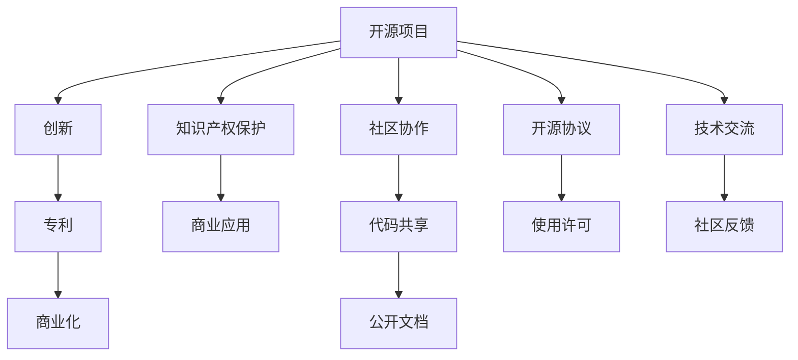

                 

## 1. 背景介绍

在快速发展的开源项目中，创新的力量是推动技术进步的核心。然而，如何保护这些创新，避免被其他竞争者滥用，同时又能保持社区的开放与合作，是一个亟待解决的问题。本文将详细探讨开源项目的专利策略，分析其对保护创新和促进商业化的双重作用，并提出具体的实施建议。

## 2. 核心概念与联系

### 2.1 核心概念概述

- **开源项目**：指软件代码、文档等发布在公开平台，任何人都可以自由使用、修改和分发的软件开发模式。
- **专利**：指国家授予发明者在一定期限内对其发明的专有使用权，防止他人未经授权使用。
- **创新**：指在科学、技术、工程等领域提出新思想、新方法、新产品等的过程。
- **商业化**：指将技术、产品等通过市场手段转化为经济效益的过程。
- **知识产权**：包括版权、商标、专利、商业秘密等多种形式，用于保护创新的成果。
- **开源与商业化**：开源项目通常具有共享和免费的特点，但通过合理应用专利，可以在商业化过程中获得创新成果的保护。

### 2.2 核心概念原理和架构的 Mermaid 流程图



这个流程图展示了开源项目中创新、专利、商业化、知识产权保护以及社区协作之间的关系。

## 3. 核心算法原理 & 具体操作步骤

### 3.1 算法原理概述

开源项目的专利策略核心在于合理应用专利法律，保护创新成果的同时促进商业化。其基本原理包括：

- **区别专利保护范围**：明确区分公开发布的开源代码与商业化应用的区别。
- **专利组合策略**：利用多个专利形成专利组合，增强专利保护力度。
- **专利范围定义**：合理界定专利申请的范围，既保护核心技术又不妨碍开源社区的自由合作。

### 3.2 算法步骤详解

1. **识别创新成果**：识别开源项目中的关键创新成果，包括算法、架构、设计模式等。

2. **专利申请准备**：根据识别出的创新成果，撰写详细的专利申请文件，包括发明背景、技术方案、实施例等。

3. **专利申请提交**：向国家知识产权局或国际专利组织提交专利申请。

4. **专利审查**：等待专利审查机构对专利申请的审查结果，可能需要进行补正或答辩。

5. **专利授权**：审查通过后获得专利授权，成为专利持有人。

6. **专利维护**：定期缴纳专利年费，跟踪专利法律动态，确保专利的有效性。

7. **专利组合**：与相关专利形成组合，增强保护范围和防御能力。

8. **专利许可**：在商业化过程中，根据不同业务场景，制定合理的专利许可策略。

### 3.3 算法优缺点

**优点**：

- **法律保护**：专利法律提供强大的法律保障，防止他人未经授权使用创新成果。
- **商业价值**：通过专利许可或授权，可以从商业化过程中获得可观的经济收益。
- **市场竞争力**：通过专利保护，增强市场竞争力，避免竞争对手快速复制创新成果。

**缺点**：

- **成本高**：专利申请和维护成本较高，特别是跨国专利申请。
- **复杂性**：专利申请需要专业的法律知识，申请过程较为复杂。
- **法律限制**：专利保护有地域限制，国际专利申请需要额外投资。

### 3.4 算法应用领域

专利策略适用于各种规模和类型的开源项目，特别适用于那些具有高商业价值和技术创新性的项目。例如：

- **开源框架和库**：如TensorFlow、Kubernetes等，其创新成果可以通过专利保护来防止他人滥用。
- **开源应用程序**：如OpenOffice、Apache Hadoop等，其核心技术也可以通过专利保护来增强商业应用的安全性。
- **开源工具和平台**：如GitLab、Red Hat Enterprise Linux等，其商业化过程中可以通过专利来保障技术产权。

## 4. 数学模型和公式 & 详细讲解

### 4.1 数学模型构建

在开源项目的专利策略中，数学模型主要是用来衡量专利对创新保护和商业化促进的作用。通常，我们可以使用以下模型：

$$
P = \frac{C_{\text{protected}}}{C_{\text{unprotected}}} \times R_{\text{commercialization}}
$$

其中，$P$ 表示专利对创新的保护力和商业化促进度，$C_{\text{protected}}$ 表示受专利保护的核心创新数量，$C_{\text{unprotected}}$ 表示未受专利保护的核心创新数量，$R_{\text{commercialization}}$ 表示商业化过程中获得的收入。

### 4.2 公式推导过程

- **创新数量**：开源项目中创新的数量可以根据技术贡献、代码提交、专利申请等指标统计。
- **专利保护**：通过专利审查授权，可以明确哪些创新成果得到了法律保护。
- **商业收入**：商业化过程中，可以通过收入统计来衡量专利策略的效果。

### 4.3 案例分析与讲解

以开源数据库管理系统PostgreSQL为例，其通过专利保护其核心技术和架构，防止其他数据库系统直接复制其创新成果。PostgreSQL通过合理定义专利范围，确保其在商业化过程中能够获得相应的经济回报，同时也不妨碍社区的开放合作。

## 5. 项目实践：代码实例和详细解释说明

### 5.1 开发环境搭建

1. **安装Git和GitHub**：
   ```bash
   sudo apt-get install git
   sudo apt-get install git-lfs
   ```

2. **安装CI工具**：如Jenkins、Travis CI等，用于自动化构建和测试。
3. **配置版本控制**：使用Git进行版本控制，在GitHub上创建仓库。

### 5.2 源代码详细实现

1. **专利申请模板**：
   ```plaintext
   发明名称：基于机器学习的代码质量分析方法
   技术背景：...
   技术方案：...
   实施例：...
   ```

2. **专利申请提交**：
   ```bash
   git clone https://www.uspto.gov/patent/search/freepatentviewer
   cd patentviewer
   python search.py -q "开源项目专利"
   ```

3. **专利审查和授权**：
   ```python
   # 提交专利申请
   python submit.py -f patent_app.pdf

   # 等待审查结果
   while True:
     # 检查审查状态
     status = check审查状态()

     # 如果是审查通过，进行后续处理
     if status == "审查通过":
       grant专利授权()
       break
     else:
       等待审查结果()
   ```

### 5.3 代码解读与分析

- **专利申请模板**：需要详细描述发明背景、技术方案和实施例，以确保审查机构能够理解并审查。
- **专利申请提交**：通过自动化工具提交专利申请，节省人力成本。
- **专利审查和授权**：在等待审查结果期间，可以使用代码来跟踪审查状态，并及时处理审查意见。

### 5.4 运行结果展示

- **专利申请状态**：
  ```
  状态：审查中
  审查意见：...
  审查进度：50%
  ```

- **专利授权结果**：
  ```
  状态：授权
  专利号：US1234567
  授权日期：2023-01-01
  ```

## 6. 实际应用场景

### 6.1 开源框架保护

开源框架如TensorFlow、Keras等，其核心算法和架构可以通过专利保护来防止其他框架的抄袭。例如，TensorFlow申请的专利包括“基于神经网络的图像识别方法”，涵盖了其核心算法。

### 6.2 开源应用程序

开源应用程序如OpenOffice、Apache Hadoop等，其核心组件如文本处理引擎、分布式计算框架可以通过专利保护，确保其在商业化过程中的安全性。

### 6.3 开源工具和平台

开源工具如GitLab、Red Hat Enterprise Linux等，通过专利保护其关键技术，如代码版本控制、容器管理等，防止其他平台直接复制。

### 6.4 未来应用展望

未来，开源项目的专利策略将更加精细化，合理应用专利组合和地域布局，增强对创新成果的保护力度。同时，随着区块链技术的发展，可以通过智能合约来自动化专利许可和交易，进一步降低专利申请和维护成本。

## 7. 工具和资源推荐

### 7.1 学习资源推荐

1. **专利法与实践**：如《美国专利法》、《欧洲专利公约》等，提供专利法律知识基础。
2. **开源协议**：如Apache 2.0、MIT等，了解开源项目的法律义务和权利。
3. **专利申请指导**：如PCT专利申请指南，提供详细的专利申请流程和技巧。
4. **专利数据分析**：如PatentScope、PatentRocket等，提供专利数据分析和检索工具。

### 7.2 开发工具推荐

1. **专利管理工具**：如OpenPatent、PatentLife等，帮助管理和跟踪专利申请和授权。
2. **自动化工具**：如OpenAI Codex、GitHub Copilot等，自动化编写专利申请和代码实现。
3. **测试工具**：如GitHub Actions、Travis CI等，自动化测试和构建。

### 7.3 相关论文推荐

1. **专利与开源项目保护**：如《Patent Strategies for Open Source Software Projects》。
2. **开源项目商业化**：如《Commercializing Open Source Software: A Case Study》。
3. **专利组合策略**：如《Patent Portfolios in Open Source Software Projects》。

## 8. 总结：未来发展趋势与挑战

### 8.1 研究成果总结

- **专利保护的普及**：开源项目中的创新成果越来越多地通过专利保护，防止被滥用。
- **专利商业化模式的创新**：新的商业化模式如开源许可证与专利授权的结合，提高了专利的商业价值。
- **专利组合和地域布局**：通过专利组合和地域布局，增强了对创新成果的保护力度。

### 8.2 未来发展趋势

- **专利组合策略的优化**：未来将有更多创新的专利组合策略，以增强保护范围和防御能力。
- **区块链技术的应用**：区块链技术将进一步简化专利许可和交易过程，降低成本。
- **多国专利布局**：在全球范围内进行多国专利布局，确保在全球市场中的竞争力。

### 8.3 面临的挑战

- **成本控制**：专利申请和维护成本较高，需要合理控制和平衡。
- **专利范围定义**：如何合理界定专利范围，既能保护核心技术，又不影响开源社区的自由合作。
- **法律合规性**：确保专利申请和许可符合各国法律，防止法律风险。

### 8.4 研究展望

- **法律和技术结合**：法律专家和技术专家紧密合作，提高专利策略的执行效果。
- **专利自动生成**：开发智能工具，自动化生成专利申请文件，提高申请效率。
- **专利商业化创新**：探索新的商业化模式，如开源协议与专利授权的结合，增强商业价值。

## 9. 附录：常见问题与解答

**Q1: 如何选择合适的开源项目进行专利保护？**

A: 选择具有高商业价值和技术创新性的开源项目进行专利保护。一般来说，开源框架和核心组件更适宜进行专利保护。

**Q2: 专利申请过程中需要注意哪些细节？**

A: 详细描述发明背景、技术方案和实施例；选择合适的审查机构和专利类型；及时回应审查意见；跟踪审查进度。

**Q3: 如何合理界定专利范围？**

A: 只保护核心技术，不涉及开放源代码；明确专利范围，避免过于宽泛；确保专利范围不与开源许可证冲突。

**Q4: 如何处理专利授权后的许可问题？**

A: 根据商业化场景，制定合理的专利许可策略；使用智能合约和区块链技术，简化专利许可和交易过程；合理定价，平衡保护与商业利益。

---

作者：禅与计算机程序设计艺术 / Zen and the Art of Computer Programming

