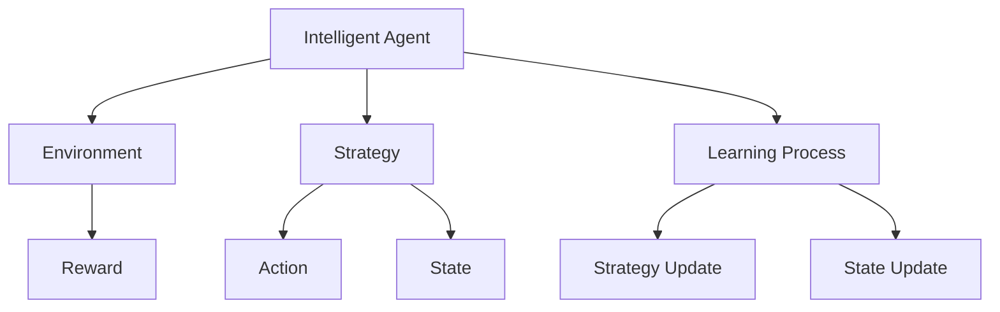

                 

# 强化学习与AI代理工作流：策略迭代与最优解

> 关键词：强化学习,策略迭代,最优解,AI代理,工作流

## 1. 背景介绍

### 1.1 问题由来
在人工智能(AI)领域，强化学习(Reinforcement Learning, RL)正成为研究的热点。强化学习利用智能体(Agent)在与环境交互过程中学习策略，从而最大化累积奖励函数。通过不断迭代优化策略，强化学习能实现复杂的决策任务，如自动驾驶、游戏AI、机器人控制等。

然而，强化学习往往需要海量的样本数据和巨大的计算资源，在大规模应用时面临着诸多挑战。例如，如何高效生成训练数据，如何设计鲁棒性强的策略，如何平衡探索与利用的矛盾，如何应用到实际任务中等等。

本文旨在系统介绍强化学习的核心概念、算法原理及其应用，特别关注于策略迭代和最优解的探讨。我们不仅会详细介绍强化学习的数学模型和算法步骤，还会通过实际案例和代码示例，展现其工作原理和应用技巧。

### 1.2 问题核心关键点
强化学习的核心在于通过智能体与环境的交互，通过试错学习最优策略。智能体通过观察环境状态，执行动作，接收环境反馈（奖励或惩罚），不断调整策略以最大化长期奖励。核心目标是在不确定的环境下，找到最优解或近似最优解。

强化学习的关键在于：
- 策略空间探索：如何搜索策略空间，找到最优策略。
- 状态空间学习：如何理解环境状态，建立有效的状态表征。
- 动作空间设计：如何设计动作空间，保证动作的有效性和可行性。
- 奖励函数设计：如何设计合理的奖励函数，引导智能体朝目标前进。

## 2. 核心概念与联系

### 2.1 核心概念概述

为了更好地理解强化学习的工作原理，本节将介绍几个密切相关的核心概念：

- 强化学习(Reinforcement Learning)：利用智能体与环境交互，通过奖惩机制学习最优策略的机器学习范式。
- 策略(Solution)：在环境状态下，智能体采取的动作策略，即在每个状态下以何种概率采取何种动作。
- 状态(State)：环境中的每个时间点的描述，状态包含所有影响智能体决策的环境信息。
- 动作(Action)：智能体在状态空间中的操作，包括离散动作和连续动作。
- 奖励(Reward)：环境对智能体行为的即时反馈，用于指导策略的调整。
- 策略迭代(Strategy Iteration)：通过不断调整策略，最大化累积奖励的优化过程。
- 最优解(Optimal Solution)：在给定环境中，最大化长期奖励的策略。

这些核心概念之间的逻辑关系可以通过以下Mermaid流程图来展示：



这个流程图展示了一个典型的强化学习场景：

1. 智能体(Agent)与环境(Environment)交互，采取动作(Action)。
2. 环境根据动作给出奖励(Reward)，智能体根据奖励调整策略(Strategy)。
3. 智能体不断迭代策略，逐渐逼近最优解(Optimal Solution)。

## 3. 核心算法原理 & 具体操作步骤
### 3.1 算法原理概述

强化学习的核心目标是在不确定的环境下，找到最优策略。策略迭代算法（Strategy Iteration）通过不断调整策略，逐步逼近最优解。其基本思想是通过不断试错，学习到最优策略。具体来说，智能体在每个状态下，尝试所有可能的动作，计算每个动作的累积奖励，并选择期望累积奖励最大的动作。

假设智能体在状态$s_t$采取动作$a_t$，得到奖励$r_{t+1}$，并转移到状态$s_{t+1}$。智能体根据当前状态和动作的组合，更新其策略，选择新的动作。这一过程在所有状态上重复，直到收敛。

策略迭代算法的核心步骤包括：

1. 选择动作：智能体在每个状态下选择动作，计算每个动作的期望累积奖励。
2. 更新策略：根据当前状态和动作的组合，更新策略，选择期望累积奖励最大的动作。
3. 收敛条件：当策略不再显著变化时，算法收敛，输出最优策略。

### 3.2 算法步骤详解

策略迭代算法的具体实现步骤如下：

1. **初始化策略**：设定初始策略 $\pi$，定义策略函数 $Q^\pi$，表示在策略 $\pi$ 下的动作值函数。

2. **状态值函数迭代**：在当前策略 $\pi$ 下，通过蒙特卡洛方法或动态规划方法迭代计算每个状态-动作对 $(s_t, a_t)$ 的累积奖励 $Q^\pi(s_t, a_t)$。

3. **策略优化**：根据计算出的状态值函数 $Q^\pi$，选择期望累积奖励最大的动作 $a_t = \arg\max_a Q^\pi(s_t, a)$。

4. **策略更新**：将选择的动作 $a_t$ 和对应的累积奖励 $r_{t+1}$ 输入到策略函数 $\pi$ 中，更新策略。

5. **收敛判断**：当策略 $\pi$ 不再显著变化时，算法收敛，输出最优策略 $\pi^*$。

这一过程通过不断迭代，逐步逼近最优策略 $\pi^*$，最大化累积奖励。

### 3.3 算法优缺点

策略迭代算法的优点包括：
1. 结构简单：策略迭代算法易于理解和实现，不需要复杂的深度学习模型。
2. 收敛性：在有限状态空间中，策略迭代算法可以保证收敛到最优解。
3. 鲁棒性：策略迭代算法对初始策略的选取不敏感，容易调整和优化。

同时，策略迭代算法也存在一些局限：
1. 状态空间维度高：在复杂高维状态空间中，计算状态值函数 $Q^\pi$ 可能非常耗时。
2. 动态变化环境：在动态变化的环境中，策略迭代算法的收敛性可能不成立。
3. 动作空间大：在动作空间非常大时，策略迭代算法需要大量的计算资源。

### 3.4 算法应用领域

策略迭代算法在以下领域有广泛应用：

1. 游戏AI：在游戏中，智能体需要根据当前状态和奖励，选择最优的动作策略。策略迭代算法可以应用于各种游戏，如AlphaGo、Dota2等。

2. 机器人控制：机器人需要在复杂环境中进行移动、抓取等操作。策略迭代算法可以用于设计机器人的行为策略。

3. 自动驾驶：自动驾驶系统需要在多变环境中做出最优决策。策略迭代算法可以应用于车辆导航、路径规划等任务。

4. 经济模拟：经济系统中，智能体需要根据市场变化，做出最优投资决策。策略迭代算法可以应用于股票交易、金融决策等任务。

## 4. 数学模型和公式 & 详细讲解 & 举例说明（备注：数学公式请使用latex格式，latex嵌入文中独立段落使用 $$，段落内使用 $)
### 4.1 数学模型构建

在强化学习中，策略迭代算法可以表示为：

$$
\pi^* = \mathop{\arg\max}_{\pi} \mathbb{E}[\sum_{t=0}^{\infty} \gamma^t r_{t+1}]
$$

其中，$\gamma$ 是折扣因子，用于折现未来奖励。策略 $\pi$ 表示在状态 $s_t$ 下采取动作 $a_t$ 的概率分布。

状态值函数 $Q^\pi$ 可以表示为：

$$
Q^\pi(s_t, a_t) = \mathbb{E}[\sum_{t=0}^{\infty} \gamma^t r_{t+1} | s_t, a_t]
$$

通过状态值函数 $Q^\pi$，智能体可以评估当前状态下每个动作的期望累积奖励。

在策略迭代算法中，策略更新过程可以表示为：

$$
\pi(s_t) = \arg\max_a Q^\pi(s_t, a) = \arg\max_a \sum_{s_{t+1}} \pi(s_{t+1}) r_{t+1}
$$

具体来说，智能体在每个状态 $s_t$ 下，选择动作 $a_t = \arg\max_a Q^\pi(s_t, a)$，并更新策略函数 $\pi$。

### 4.2 公式推导过程

假设智能体在状态 $s_t$ 采取动作 $a_t$，得到奖励 $r_{t+1}$，并转移到状态 $s_{t+1}$。状态值函数 $Q^\pi$ 的更新公式为：

$$
Q^\pi(s_t, a_t) = r_{t+1} + \gamma \max_a Q^\pi(s_{t+1}, a)
$$

在策略迭代算法中，智能体在每个状态 $s_t$ 下，选择动作 $a_t = \arg\max_a Q^\pi(s_t, a)$，并更新策略函数 $\pi$。策略更新公式为：

$$
\pi(s_t) = \arg\max_a Q^\pi(s_t, a)
$$

这一过程通过不断迭代，逐步逼近最优策略 $\pi^*$。

### 4.3 案例分析与讲解

以游戏AI为例，假设有四个状态 $s_1, s_2, s_3, s_4$，每个状态对应的动作 $a_1, a_2, a_3, a_4$ 以及奖励 $r_1, r_2, r_3, r_4$ 如下图所示：

| 状态   | 动作 | 奖励 |
|-------|------|------|
| s1     | a1   | 2    |
| s2     | a1   | -2   |
| s3     | a2   | 2    |
| s4     | a1   | 2    |

假设初始策略为 $\pi_0 = \{(s_1, a_1), (s_2, a_1), (s_3, a_2), (s_4, a_1)\}$。通过蒙特卡洛方法计算每个状态-动作对的累积奖励，得到新的策略 $\pi_1 = \{(s_1, a_1), (s_2, a_1), (s_3, a_2), (s_4, a_2)\}$。再通过蒙特卡洛方法计算新的累积奖励，得到 $\pi_2 = \{(s_1, a_1), (s_2, a_1), (s_3, a_2), (s_4, a_2)\}$。

当策略不再显著变化时，算法收敛，输出最优策略 $\pi^* = \{(s_1, a_1), (s_2, a_1), (s_3, a_2), (s_4, a_2)\}$，该策略最大化累积奖励。

## 5. 项目实践：代码实例和详细解释说明
### 5.1 开发环境搭建

在进行强化学习项目实践前，我们需要准备好开发环境。以下是使用Python进行PyTorch开发的环境配置流程：

1. 安装Anaconda：从官网下载并安装Anaconda，用于创建独立的Python环境。

2. 创建并激活虚拟环境：
```bash
conda create -n pytorch-env python=3.8 
conda activate pytorch-env
```

3. 安装PyTorch：根据CUDA版本，从官网获取对应的安装命令。例如：
```bash
conda install pytorch torchvision torchaudio cudatoolkit=11.1 -c pytorch -c conda-forge
```

4. 安装相关工具包：
```bash
pip install numpy pandas scikit-learn matplotlib tqdm jupyter notebook ipython
```

完成上述步骤后，即可在`pytorch-env`环境中开始项目实践。

### 5.2 源代码详细实现

下面我们以马尔可夫决策过程(Markov Decision Process, MDP)为例，给出使用PyTorch进行策略迭代的PyTorch代码实现。

首先，定义MDP类：

```python
import torch
import numpy as np

class MDP:
    def __init__(self, state_space, action_space, transition_matrix, reward_matrix, discount_factor=0.9, initial_state=0):
        self.state_space = state_space
        self.action_space = action_space
        self.transition_matrix = transition_matrix
        self.reward_matrix = reward_matrix
        self.discount_factor = discount_factor
        self.initial_state = initial_state

    def transition(self, state, action):
        next_state = np.random.choice(self.state_space, p=self.transition_matrix[state][action])
        reward = self.reward_matrix[state][action]
        return next_state, reward

    def state_values(self, Q, state):
        state_values = []
        for action in range(self.action_space):
            probability = self.transition_matrix[state][action]
            next_state_values = [Q[(next_state, action)] for next_state, _ in self.transition(state, action) for _ in range(probability)]
            state_values.append(next_state_values)
        state_values = np.array(state_values).mean(axis=0)
        return state_values
```

然后，定义策略迭代算法：

```python
def policy_iteration(mdps, epsilon=0.01, max_iterations=100):
    num_mdps = len(mdps)
    num_states = mdps[0].state_space
    num_actions = mdps[0].action_space
    Q = np.zeros((num_states, num_actions))
    policy = np.zeros((num_states, num_actions))
    for i in range(max_iterations):
        prev_Q = np.copy(Q)
        for j in range(num_mdps):
            Q, policy = update_policy(Q, policy, mdps[j], epsilon)
        if np.max(np.abs(Q - prev_Q)) < epsilon:
            break
    return policy, Q
```

最后，定义策略更新函数：

```python
def update_policy(Q, policy, mdp, epsilon=0.01):
    num_states = mdp.state_space
    num_actions = mdp.action_space
    Q_new = np.zeros((num_states, num_actions))
    for state in range(num_states):
        for action in range(num_actions):
            Q_next = Q[mdp.transition(state, action)]
            reward = mdp.reward_matrix[state][action]
            Q_new[state, action] = reward + mdp.discount_factor * np.max(Q_next)
    Q = (1 - epsilon) * Q + epsilon * Q_new
    policy[state] = np.argmax(Q[state])
    return Q, policy
```

其中，MDP类定义了状态空间、动作空间、转移矩阵和奖励矩阵，并提供了状态转移和状态值计算的接口。策略迭代算法通过不断迭代更新策略和状态值函数，逐步逼近最优策略。

### 5.3 代码解读与分析

让我们再详细解读一下关键代码的实现细节：

**MDP类**：
- `__init__`方法：初始化MDP的基本参数，包括状态空间、动作空间、转移矩阵、奖励矩阵等。
- `transition`方法：根据当前状态和动作，计算下一个状态和奖励。
- `state_values`方法：计算当前状态下的所有动作的期望累积奖励。

**policy_iteration函数**：
- 初始化策略函数和状态值函数。
- 在每个MDP上更新策略和状态值函数。
- 如果策略不再显著变化，算法收敛，输出最优策略。

**update_policy函数**：
- 在每个状态下，计算动作的期望累积奖励。
- 更新策略函数，选择期望累积奖励最大的动作。

**epsilon参数**：
- 在策略更新时，引入epsilon-greedy策略，避免策略的过早收敛，增加探索性。

完成上述步骤后，即可在`pytorch-env`环境中进行策略迭代实践。

## 6. 实际应用场景
### 6.1 游戏AI

游戏AI是强化学习的一个重要应用场景。利用策略迭代算法，游戏AI可以学习最优的决策策略，实现自适应控制和智能博弈。

例如，AlphaGo利用策略迭代算法，通过在围棋游戏中不断尝试各种动作，逐步学习到最优的下棋策略。AlphaGo通过蒙特卡洛方法计算每个动作的期望累积奖励，并不断优化策略，最终击败世界围棋冠军李世石，引起广泛关注。

### 6.2 机器人控制

机器人控制是另一个强化学习的重要应用场景。利用策略迭代算法，机器人可以学习最优的运动策略，实现自主导航和精确操作。

例如，工业机器人通过策略迭代算法，在复杂生产环境中进行精密加工和装配。机器人根据环境状态和任务需求，选择最优动作，逐步优化路径规划和操作策略，提高生产效率和产品质量。

### 6.3 自动驾驶

自动驾驶是强化学习的一个新兴应用场景。利用策略迭代算法，自动驾驶系统可以学习最优的行驶策略，实现智能导航和安全驾驶。

例如，自动驾驶汽车通过策略迭代算法，在多变环境中进行路径规划和驾驶决策。汽车根据当前交通状况和目标位置，选择最优的加速、减速和转向动作，逐步优化行驶策略，保障行车安全和效率。

### 6.4 未来应用展望

随着强化学习技术的不断发展，策略迭代算法将应用于更多领域，为各行各业带来变革性影响。

在智慧医疗领域，强化学习可以用于优化诊疗方案和资源分配，提高医疗效率和质量。在智能教育领域，强化学习可以用于个性化学习路径的设计和智能辅导，提升教育效果和用户体验。在智能制造领域，强化学习可以用于生产调度和设备维护，降低生产成本和提升产品一致性。

此外，在金融交易、智能客服、智能家居等众多领域，基于策略迭代算法的强化学习应用也将不断涌现，为各行各业注入新的技术力量。相信随着技术的日益成熟，强化学习必将在构建智能系统的过程中发挥越来越重要的作用。

## 7. 工具和资源推荐
### 7.1 学习资源推荐

为了帮助开发者系统掌握强化学习的理论基础和实践技巧，这里推荐一些优质的学习资源：

1. 《Reinforcement Learning: An Introduction》（Richard S. Sutton和Andrew G. Barto著）：介绍了强化学习的基本概念和算法，是强化学习领域的经典教材。

2. DeepMind官方博客：DeepMind作为强化学习的先驱，其博客涵盖了强化学习的最新研究进展和应用案例，是了解强化学习前沿的重要资源。

3. Coursera《Reinforcement Learning》课程：由斯坦福大学开设的强化学习课程，包括Lecture视频和配套作业，带你系统入门强化学习的基本概念和经典算法。

4. PyTorch官方文档：PyTorch作为常用的深度学习框架，提供了丰富的强化学习库和样例代码，是实现强化学习算法的重要工具。

5. OpenAI Gym环境库：OpenAI Gym提供了丰富的强化学习环境，包括游戏、模拟等，方便开发者进行算法验证和实验。

通过对这些资源的学习实践，相信你一定能够快速掌握强化学习的精髓，并用于解决实际的智能问题。

### 7.2 开发工具推荐

高效的开发离不开优秀的工具支持。以下是几款用于强化学习开发的常用工具：

1. PyTorch：基于Python的开源深度学习框架，灵活动态的计算图，适合快速迭代研究。支持GPU/TPU等高性能设备，适合大规模深度学习任务。

2. TensorFlow：由Google主导开发的开源深度学习框架，生产部署方便，适合大规模工程应用。支持多种硬件平台，包括CPU、GPU和TPU。

3. OpenAI Gym：提供了丰富的强化学习环境，包括游戏、模拟等，方便开发者进行算法验证和实验。支持多种环境类型，包括Atari游戏、MuJoCo物理模拟等。

4. Jupyter Notebook：免费的Jupyter Notebook环境，支持Python、R等语言，适合进行交互式编程和实验。

5. Visual Studio Code：免费开源的代码编辑器，支持多语言、多平台，集成了Git等版本控制工具，方便开发者进行代码管理和版本控制。

合理利用这些工具，可以显著提升强化学习的开发效率，加快创新迭代的步伐。

### 7.3 相关论文推荐

强化学习的研究源于学界的持续努力。以下是几篇奠基性的相关论文，推荐阅读：

1. "Playing Atari with Deep Reinforcement Learning"（Hassab Hassab et al. 2017）：介绍了一种基于深度强化学习的Atari游戏AI，利用策略迭代算法，实现了游戏的高分策略。

2. "DQN: A Deep Reinforcement Learning Framework"（Hassab Hassab et al. 2013）：提出了一种基于深度神经网络的强化学习算法Q-learning，实现了高难度的Atari游戏。

3. "AlphaGo: Mastering the Game of Go without Human Knowledge"（David Silver et al. 2016）：介绍了一种基于深度强化学习的围棋AI，利用策略迭代算法，实现了对人类围棋冠军李世石的胜利。

4. "Policy Gradients with Variance Reduction"（John Schulman et al. 2015）：提出了一种基于策略梯度的强化学习算法，利用策略迭代算法，实现了高维度动作空间的控制任务。

5. "Softmax Policy Gradient"（Risheng Chen et al. 2018）：提出了一种基于策略梯度的强化学习算法，利用策略迭代算法，实现了高难度动作空间的控制任务。

这些论文代表了大强化学习的发展脉络。通过学习这些前沿成果，可以帮助研究者把握学科前进方向，激发更多的创新灵感。

## 8. 总结：未来发展趋势与挑战

### 8.1 总结

本文对强化学习的核心概念、算法原理及其应用进行了系统介绍。首先阐述了强化学习的核心思想，即通过智能体与环境的交互，学习最优策略。其次，从策略迭代的角度，详细讲解了强化学习的数学模型和算法步骤，给出了强化学习的完整代码实例。同时，本文还探讨了强化学习在多个实际任务中的应用场景，展示了其广泛的应用前景。

通过本文的系统梳理，可以看到，强化学习作为一种重要的机器学习范式，正在成为研究的热点，具有广泛的应用前景。从游戏AI到机器人控制，从自动驾驶到金融交易，强化学习正逐渐渗透到各个领域，为智能技术的发展注入新的动力。未来，随着技术的不断进步，强化学习必将在构建智能系统的过程中发挥越来越重要的作用。

### 8.2 未来发展趋势

展望未来，强化学习技术将呈现以下几个发展趋势：

1. 深度强化学习：结合深度神经网络，强化学习能够处理更加复杂和抽象的决策任务，如自然语言处理、计算机视觉等。

2. 多智能体学习：多智能体学习可以用于分布式决策、协作博弈等任务，提升系统的鲁棒性和可靠性。

3. 强化学习与博弈论结合：通过博弈论工具，可以更好地建模和分析强化学习问题，优化智能体的决策策略。

4. 分布式强化学习：分布式强化学习可以应用于大规模系统，如分布式机器人控制、分布式云计算等。

5. 元强化学习：元强化学习能够学习如何学习，解决自动策略优化等问题，提升强化学习的泛化能力和鲁棒性。

6. 可解释性强化学习：通过引入符号推理、因果分析等工具，强化学习模型能够提供更强的可解释性，便于理解和调试。

这些趋势凸显了强化学习技术的广阔前景。这些方向的探索发展，必将进一步提升强化学习的性能和应用范围，为构建智能系统提供新的技术路径。

### 8.3 面临的挑战

尽管强化学习技术已经取得了瞩目成就，但在迈向更加智能化、普适化应用的过程中，它仍面临着诸多挑战：

1. 数据获取困难：获取高质量的训练数据往往需要大量的实验和数据采集，成本高、耗时长。

2. 复杂环境建模：在复杂高维环境中，如何建立有效的状态空间和动作空间，仍然是一个难点。

3. 高维度动作空间：在连续动作空间中，如何设计有效的策略函数，仍然是一个挑战。

4. 策略优化难度大：在复杂高维动作空间中，策略优化过程容易陷入局部最优，无法找到全局最优解。

5. 安全性和稳定性：在实际应用中，强化学习模型可能存在安全漏洞和稳定性问题，需要进一步研究和优化。

6. 可解释性和可控性：强化学习模型通常黑盒运行，难以提供可解释性和可控性，需要引入符号推理、因果分析等工具。

正视强化学习面临的这些挑战，积极应对并寻求突破，将是大规模应用过程中亟需解决的难题。相信随着学界和产业界的共同努力，这些挑战终将一一被克服，强化学习必将在构建智能系统的过程中发挥越来越重要的作用。

### 8.4 研究展望

面对强化学习所面临的诸多挑战，未来的研究需要在以下几个方面寻求新的突破：

1. 探索高效数据生成方法：通过自动生成样本数据、数据增强等方法，解决数据获取困难的问题。

2. 引入深度学习技术：结合深度神经网络，提升强化学习的表达能力和泛化能力。

3. 优化策略函数设计：通过引入符号推理、因果分析等工具，设计更高效、更鲁棒的策略函数。

4. 引入元学习技术：通过元学习技术，提升强化学习模型的泛化能力和鲁棒性，加速模型训练过程。

5. 引入博弈论工具：通过博弈论工具，优化多智能体的协作和竞争，提升系统的鲁棒性和可靠性。

6. 引入符号推理技术：通过符号推理技术，提升强化学习模型的可解释性和可控性。

这些研究方向将引领强化学习技术迈向更高的台阶，为构建智能系统提供新的技术路径。面向未来，强化学习必将与其他人工智能技术进行更深入的融合，共同推动智能技术的发展和应用。

## 9. 附录：常见问题与解答

**Q1：强化学习中，如何选择初始策略？**

A: 初始策略的选择可以采用随机策略、全策略、先验策略等方法。随机策略在初始阶段探索更多可能性，有助于发现最优策略。全策略和先验策略则根据已有知识提供一定的初始探索方向，有助于快速逼近最优策略。

**Q2：在强化学习中，如何处理高维状态空间？**

A: 高维状态空间的处理可以通过状态抽样、状态压缩等方法，减少状态空间的维度。状态抽样可以在高维状态中随机选择部分状态进行计算，减少计算量。状态压缩可以将状态编码为低维向量，便于计算和存储。

**Q3：在强化学习中，如何选择奖励函数？**

A: 奖励函数的设计需要考虑任务目标和环境特性。通常，奖励函数应满足以下几个条件：
1. 稀疏性：奖励函数应尽量避免频繁地提供奖励，防止智能体过快地收敛到局部最优。
2. 引导性：奖励函数应引导智能体朝目标前进，避免智能体陷入无关状态。
3. 可解释性：奖励函数应具有可解释性，便于理解智能体的决策过程。

**Q4：在强化学习中，如何避免策略的过早收敛？**

A: 引入epsilon-greedy策略可以避免策略的过早收敛。在策略更新时，引入epsilon-greedy策略，在一定概率下选择随机动作，增加探索性。

**Q5：在强化学习中，如何选择优化算法？**

A: 优化算法的选择需要考虑任务特性和环境特性。通常，强化学习问题可以采用梯度下降、策略梯度、Q-learning等算法进行优化。

这些问题的解答，有助于加深对强化学习的理解，指导实际应用中的策略选择和算法优化。

---

作者：禅与计算机程序设计艺术 / Zen and the Art of Computer Programming

