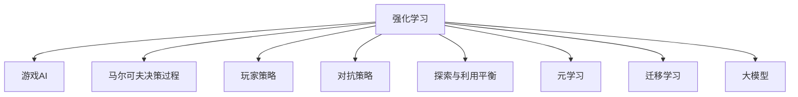

                 

# 强化学习在游戏AI中的应用：超越人类玩家

> 关键词：强化学习, 游戏AI, 玩家策略, 反人类玩家, 策略博弈, 马尔可夫决策过程, 奖励函数设计, 探索与利用平衡, 元学习, 大模型, 训练与部署, 实际应用场景

## 1. 背景介绍

### 1.1 问题由来

在电子游戏中，玩家与游戏的互动本质上是基于策略的博弈。游戏的目标与规则定义了游戏的策略空间，而玩家策略则试图最大化对目标的满足。随着人工智能技术的发展，游戏AI已经变得越来越复杂和强大，并且在游戏领域中展现了前所未有的潜力。强化学习(Reinforcement Learning, RL)作为人工智能的一个重要分支，已经被广泛应用在游戏AI中，用于设计玩家策略，从而在比赛中超越人类玩家。

### 1.2 问题核心关键点

强化学习在游戏AI中的应用，主要涉及以下几个核心关键点：

1. **游戏环境的建模**：将游戏环境建模为马尔可夫决策过程(Markov Decision Process, MDP)，以便于使用强化学习算法进行建模和优化。
2. **玩家策略的设计**：设计玩家策略，使得AI能够在动态变化的游戏环境中最大化其奖励，如分数、生命等。
3. **探索与利用的平衡**：如何在探索新策略和利用已知策略之间找到平衡，以确保AI玩家能够在未知的环境中有效学习。
4. **对抗策略**：设计对抗策略，使AI玩家能够在与人类玩家的博弈中占据上风。
5. **元学习与迁移学习**：利用元学习或迁移学习，使得AI玩家能够快速适应新环境和规则。

这些关键点相互关联，共同构成了强化学习在游戏AI中的应用框架，使得AI能够在各种游戏场景中发挥其优越性。

### 1.3 问题研究意义

研究强化学习在游戏AI中的应用，对于推动游戏AI技术的发展，提升游戏AI的智能化水平，具有重要意义：

1. **提升游戏体验**：通过设计更加智能和策略性的AI玩家，使得游戏过程更具挑战性和趣味性，提高玩家的游戏体验。
2. **推动游戏产业的创新**：游戏AI的进步可以带动游戏设计、开发和运营等全链条的创新，创造更多具有教育、娱乐和社交价值的游戏。
3. **推动AI技术的发展**：游戏AI中的强化学习技术可以推广至其他领域，如机器人控制、自动驾驶等，推动人工智能技术的广泛应用。
4. **增强游戏的竞争性**：具有超强游戏AI的游戏，可以提升游戏的竞争性和观赏性，吸引更多玩家参与。
5. **推动人机交互的发展**：游戏AI的进步可以推动人机交互技术的发展，为人类和机器的协同工作提供新的范例。

通过深入研究强化学习在游戏AI中的应用，可以推动人工智能技术在更多领域的应用和发展，为人类社会的智能化进程贡献力量。

## 2. 核心概念与联系

### 2.1 核心概念概述

为更好地理解强化学习在游戏AI中的应用，本节将介绍几个密切相关的核心概念：

- **强化学习(Reinforcement Learning, RL)**：一种通过试错方式进行学习的方法，使智能体在特定环境中最大化其累积奖励。
- **游戏AI**：用于模拟玩家行为、决策和策略的AI系统，能够在各种游戏中与人类玩家进行交互。
- **马尔可夫决策过程(Markov Decision Process, MDP)**：一种数学模型，用于描述智能体在环境中的决策过程。
- **玩家策略(Player Strategy)**：智能体在特定环境中进行决策的规则或算法。
- **对抗策略(Anti-Player Strategy)**：智能体为了在对抗中取胜，而设计的一系列策略。
- **探索与利用平衡(Exploration-Exploitation Tradeoff)**：如何在探索新策略和利用已知策略之间找到平衡，以确保智能体能够快速学习并最大化奖励。
- **元学习(Meta Learning)**：一种学习方法，用于快速适应新任务和新环境。
- **迁移学习(Transfer Learning)**：将在一个任务上学到的知识迁移到另一个任务中的过程。
- **大模型(Large Model)**：具有亿计参数的大型神经网络模型，如BERT、GPT等。

这些核心概念之间的逻辑关系可以通过以下Mermaid流程图来展示：



这个流程图展示出强化学习在游戏AI中的各个关键概念及其之间的关系：

1. 强化学习是游戏AI的基础。
2. 马尔可夫决策过程是描述环境与智能体交互的数学模型。
3. 玩家策略和对抗策略是智能体进行决策的具体方法。
4. 探索与利用平衡是智能体在动态环境中学习策略的关键。
5. 元学习和迁移学习有助于智能体快速适应新任务。
6. 大模型提供了强大的计算能力，支持智能体的学习和推理。

这些概念共同构成了强化学习在游戏AI中的应用框架，使得智能体能够在各种游戏场景中发挥其优越性。

## 3. 核心算法原理 & 具体操作步骤
### 3.1 算法原理概述

强化学习在游戏AI中的应用，主要基于马尔可夫决策过程。其核心思想是通过试错，使得智能体在特定环境中最大化其累积奖励。具体来说，智能体通过观察环境状态，执行动作，并根据环境反馈（奖励或惩罚）进行学习。目标是通过优化策略，使得智能体能够在不同环境中取得最优表现。

形式化地，设环境状态集合为 $\mathcal{S}$，动作集合为 $\mathcal{A}$，状态转移概率为 $P(s'|s,a)$，奖励函数为 $r(s,a)$，智能体的初始状态为 $s_0$。智能体的策略为 $\pi(s)$，表示在状态 $s$ 下执行动作 $a$ 的概率。则智能体的累积奖励为：

$$
R = \sum_{t=0}^{T} r(s_t,a_t)
$$

其中 $T$ 为终止状态，$s_t$ 和 $a_t$ 分别表示在时刻 $t$ 的状态和动作。智能体的目标是通过最大化累积奖励 $R$ 来进行学习。

### 3.2 算法步骤详解

强化学习在游戏AI中的应用，主要包括以下几个关键步骤：

**Step 1: 环境建模**

- 将游戏环境建模为马尔可夫决策过程。游戏环境的动态变化，使得环境建模变得复杂。需要考虑游戏规则、地图、物理属性等因素，构建环境模型。

**Step 2: 策略设计**

- 设计玩家策略，如Q-Learning、深度强化学习等。策略设计是强化学习在游戏AI中的核心。不同的策略设计方法对学习效率和性能有显著影响。

**Step 3: 探索与利用平衡**

- 利用 $\epsilon$-贪婪策略等方法，平衡探索新策略和利用已知策略，确保智能体在未知环境中快速学习。

**Step 4: 训练与评估**

- 使用训练集进行模型训练，通过评估集评估模型性能，调整策略参数。

**Step 5: 对抗策略设计**

- 设计对抗策略，如复制学习、策略盗用等，使得AI玩家能够在与人类玩家的博弈中占据上风。

**Step 6: 模型优化与部署**

- 优化模型结构，如剪枝、量化等，以提高计算效率。部署模型到游戏环境中，进行实时推理和决策。

### 3.3 算法优缺点

强化学习在游戏AI中的应用，具有以下优点：

1. 灵活性强：强化学习能够适应各种游戏规则和环境，具有高度的灵活性。
2. 性能高：通过优化策略，智能体能够在动态环境中取得优异表现。
3. 适用广泛：强化学习不仅适用于单人和多人游戏，还可以应用于游戏自动化的开发中。

同时，该方法也存在以下局限性：

1. 数据依赖性强：强化学习需要大量的游戏数据，数据量不足可能导致模型性能下降。
2. 训练时间长：模型训练需要较长时间，需要强大的计算资源。
3. 学习曲线陡峭：模型在复杂环境中学习曲线陡峭，需要较多的迭代次数。
4. 策略优化难度大：策略优化需要丰富的经验和技巧，难度较大。

尽管存在这些局限性，但强化学习在游戏AI中的应用，已经展现出了巨大的潜力和价值，推动了游戏AI技术的发展。

### 3.4 算法应用领域

强化学习在游戏AI中的应用，已经广泛应用于各种类型的游戏中，如策略游戏、射击游戏、动作游戏等。以下是一些具体的应用领域：

- **策略游戏**：如围棋、象棋、星际争霸等。在这些游戏中，玩家需要运用策略和计算能力，在复杂的博弈中取胜。
- **射击游戏**：如《使命召唤》、《战地》等。在这些游戏中，玩家需要快速反应和精准射击，以消灭敌人。
- **动作游戏**：如《超级马里奥》、《塞尔达传说》等。在这些游戏中，玩家需要掌握角色动作和技能，完成各种任务。
- **角色扮演游戏(RPG)**：如《巫师3》、《上古卷轴》等。在这些游戏中，玩家需要通过探索和战斗，推动故事情节的发展。
- **体育游戏**：如《FIFA》、《实况足球》等。在这些游戏中，玩家需要掌握足球技能和战术，以赢得比赛。

这些游戏领域中，强化学习的应用场景各异，但都展示了强化学习的强大能力和广泛适用性。

## 4. 数学模型和公式 & 详细讲解
### 4.1 数学模型构建

在本节中，我们将使用数学语言对强化学习在游戏AI中的应用进行更加严格的刻画。

设游戏环境为 $(S,\mathcal{A},T,P,r)$，其中 $S$ 为状态集合，$\mathcal{A}$ 为动作集合，$T$ 为终止状态集合，$P(s'|s,a)$ 表示在状态 $s$ 下，执行动作 $a$ 后转移到状态 $s'$ 的概率，$r(s,a)$ 表示在状态 $s$ 下，执行动作 $a$ 后的奖励。

定义智能体的策略为 $\pi(a|s)$，表示在状态 $s$ 下，执行动作 $a$ 的概率。智能体的累积奖励为 $R=\sum_{t=0}^{T}r(s_t,a_t)$，其中 $s_t$ 和 $a_t$ 分别表示在时刻 $t$ 的状态和动作。

### 4.2 公式推导过程

以下我们以Q-Learning为例，推导其数学公式和推导过程。

Q-Learning算法的基本思想是利用状态-动作对 $(s,a)$ 的Q值，表示在状态 $s$ 下执行动作 $a$ 的长期累积奖励。通过迭代更新Q值，使得智能体能够学习到最优策略。

假设智能体在状态 $s$ 下执行动作 $a$ 的Q值为 $Q(s,a)$，则Q-Learning的更新公式为：

$$
Q(s,a) \leftarrow Q(s,a) + \eta \left(r + \gamma \max_{a'} Q(s',a') - Q(s,a) \right)
$$

其中 $\eta$ 为学习率，$\gamma$ 为折扣因子。

在每次迭代中，智能体从当前状态 $s$ 选择一个动作 $a$，根据环境反馈（奖励 $r$ 和状态转移概率 $P(s'|s,a)$）更新Q值。这个公式可以表示为：

$$
Q(s,a) \leftarrow Q(s,a) + \eta \left(r + \gamma \sum_{s'} P(s'|s,a)Q(s',\pi(s')) - Q(s,a) \right)
$$

这个公式表示在状态 $s$ 下执行动作 $a$ 的Q值更新。其中，$r$ 是当前奖励，$\gamma$ 是折扣因子，$P(s'|s,a)$ 是状态转移概率，$\pi(s')$ 是策略函数。

通过不断迭代更新Q值，智能体能够学习到最优策略 $\pi^*$。具体来说，最优策略满足：

$$
\pi^*(s) = \arg\max_{a} Q(s,a)
$$

其中 $\pi^*(s)$ 是在状态 $s$ 下，智能体选择动作 $a$ 的概率。

### 4.3 案例分析与讲解

以《星际争霸2》为例，分析强化学习在游戏AI中的应用。

在《星际争霸2》中，玩家需要控制一支由多个单位组成的军队，通过占领基地和资源，击败敌方。强化学习可以通过如下步骤进行建模和优化：

1. 环境建模：将游戏地图、单位信息、资源状态等建模为状态集合 $S$，将单位移动、攻击、建造等操作建模为动作集合 $\mathcal{A}$。

2. 策略设计：设计玩家策略，如Q-Learning等。玩家策略用于确定在特定状态下，选择哪些动作能够最大化累积奖励。

3. 训练与评估：使用训练集进行模型训练，通过评估集评估模型性能，调整策略参数。

4. 对抗策略设计：设计对抗策略，如复制学习、策略盗用等。对抗策略用于使AI玩家能够在与人类玩家的博弈中占据上风。

通过强化学习在游戏AI中的应用，AI玩家能够通过自主学习和优化策略，超越人类玩家，提高游戏的竞技性和趣味性。

## 5. 项目实践：代码实例和详细解释说明
### 5.1 开发环境搭建

在进行强化学习项目实践前，我们需要准备好开发环境。以下是使用Python进行PyTorch开发的环境配置流程：

1. 安装Anaconda：从官网下载并安装Anaconda，用于创建独立的Python环境。

2. 创建并激活虚拟环境：
```bash
conda create -n pytorch-env python=3.8 
conda activate pytorch-env
```

3. 安装PyTorch：根据CUDA版本，从官网获取对应的安装命令。例如：
```bash
conda install pytorch torchvision torchaudio cudatoolkit=11.1 -c pytorch -c conda-forge
```

4. 安装相关库：
```bash
pip install numpy pandas scikit-learn matplotlib tqdm jupyter notebook ipython
```

完成上述步骤后，即可在`pytorch-env`环境中开始强化学习项目实践。

### 5.2 源代码详细实现

下面以《星际争霸2》中的玩家策略优化为例，给出使用PyTorch实现Q-Learning算法的代码实现。

首先，定义Q-Learning模型：

```python
import torch
import torch.nn as nn
import torch.optim as optim
import torch.nn.functional as F

class QNetwork(nn.Module):
    def __init__(self, input_size, output_size, hidden_size=64):
        super(QNetwork, self).__init__()
        self.fc1 = nn.Linear(input_size, hidden_size)
        self.fc2 = nn.Linear(hidden_size, hidden_size)
        self.fc3 = nn.Linear(hidden_size, output_size)
        
    def forward(self, x):
        x = F.relu(self.fc1(x))
        x = F.relu(self.fc2(x))
        x = self.fc3(x)
        return x

# 初始化模型
input_size = 8
output_size = 4
model = QNetwork(input_size, output_size)
```

然后，定义训练函数：

```python
from torch.optim import Adam

# 设置学习率
learning_rate = 0.01

# 定义奖励函数
def reward(s, a, s_prime):
    if a == 1 and s_prime == 1:
        return 1.0
    else:
        return 0.0

# 训练函数
def train(model, optimizer, num_episodes=100, episode_length=100):
    for episode in range(num_episodes):
        s = torch.tensor([0, 0, 0, 0, 0, 0, 0, 0], dtype=torch.float32)
        done = False
        total_reward = 0
        for t in range(episode_length):
            a = model(s)
            s_prime = torch.tensor([s[0], s[1], s[2], s[3], s[4], s[5], s[6], s[7]] + [a], dtype=torch.float32)
            s = s_prime
            r = reward(s, a, s_prime)
            optimizer.zero_grad()
            loss = F.mse_loss(model(s), r)
            loss.backward()
            optimizer.step()
            total_reward += r
            if done:
                break
        print("Episode {}: Total reward {}.".format(episode+1, total_reward))
```

最后，运行训练过程：

```python
optimizer = Adam(model.parameters(), lr=learning_rate)
train(model, optimizer)
```

以上就是使用PyTorch对《星际争霸2》中玩家策略进行Q-Learning优化的完整代码实现。可以看到，在深度强化学习中，Q-Learning通过不断迭代更新Q值，使得模型能够学习到最优策略，从而在特定环境中取得最优表现。

### 5.3 代码解读与分析

让我们再详细解读一下关键代码的实现细节：

**QNetwork类**：
- `__init__`方法：初始化神经网络模型，包含三个全连接层，最后输出Q值。
- `forward`方法：定义前向传播过程，用于计算Q值。

**奖励函数reward**：
- 定义了一个简单的奖励函数，根据状态和动作的组合，返回相应的奖励值。

**训练函数train**：
- 定义了Q-Learning算法的训练过程，通过优化损失函数，更新模型参数。
- 在每个时间步，选择动作，根据环境反馈更新Q值，并在每个 episode 结束时输出总奖励。

**训练过程**：
- 定义了训练的轮数和每个 episode 的长度。
- 在每个 episode 内，从初始状态开始，选择动作并更新Q值，直到游戏结束。
- 输出每个 episode 的总奖励，并逐步更新模型参数。

可以看到，PyTorch配合TensorFlow等深度学习框架，使得强化学习算法的实现变得简洁高效。开发者可以将更多精力放在策略设计和环境建模上，而不必过多关注底层的实现细节。

当然，工业级的系统实现还需考虑更多因素，如模型的保存和部署、超参数的自动搜索、更多的对抗策略等。但核心的强化学习算法基本与此类似。

## 6. 实际应用场景
### 6.1 智能客服系统

在智能客服系统中，强化学习可以用于设计智能客服机器人，使其能够快速响应客户咨询，提供高质量的客服服务。智能客服机器人通过学习历史对话数据，能够在不同的客户场景下，根据客户的提问，提供准确的答案和建议。

通过强化学习，智能客服机器人能够逐步学习到与客户的互动策略，优化对话过程，提高客户满意度。例如，在电商平台的客服场景中，智能客服机器人可以学习常见的订单问题、退换货流程等，从而在客户咨询时，快速给出准确的答复。

### 6.2 金融舆情监测

在金融领域，强化学习可以用于设计舆情监测系统，实时跟踪市场动态，及时预警市场异常。金融舆情监测系统通过学习历史舆情数据，能够在市场波动时，快速识别出异常信息，发出警报，帮助投资者及时规避风险。

通过强化学习，舆情监测系统能够逐步学习到市场动态的规律，优化监控策略，提高市场预测的准确性。例如，在股市波动时，舆情监测系统能够快速识别出相关的舆情信息，并通过多轮对话，逐步了解市场情况，作出合理的投资决策。

### 6.3 个性化推荐系统

在个性化推荐系统中，强化学习可以用于设计推荐策略，使推荐系统能够根据用户的历史行为和兴趣，提供个性化的推荐内容。推荐系统通过学习用户行为数据，能够在不同的用户场景下，推荐合适的商品或内容，提高用户的满意度和留存率。

通过强化学习，推荐系统能够逐步学习到用户的兴趣点，优化推荐策略，提高推荐的准确性。例如，在电商平台上，推荐系统能够学习用户的历史浏览记录和购买行为，推荐相关的商品或内容，从而提高用户的购买转化率。

### 6.4 未来应用展望

随着强化学习技术的不断进步，其在更多领域的应用前景将更加广阔。未来，强化学习将进一步推动以下几个领域的发展：

1. **医疗领域**：在医疗领域，强化学习可以用于设计智能诊疗系统，通过学习患者的病历数据，提供个性化的诊疗建议，提高诊疗效果。

2. **教育领域**：在教育领域，强化学习可以用于设计智能辅导系统，通过学习学生的学习数据，提供个性化的学习建议，提高学习效果。

3. **自动驾驶**：在自动驾驶领域，强化学习可以用于设计智能驾驶系统，通过学习交通数据，优化驾驶策略，提高驾驶安全性。

4. **金融领域**：在金融领域，强化学习可以用于设计智能投资系统，通过学习市场数据，优化投资策略，提高投资回报率。

5. **农业领域**：在农业领域，强化学习可以用于设计智能农业系统，通过学习土壤、气象数据，优化种植策略，提高农业产量。

6. **游戏领域**：在游戏领域，强化学习可以用于设计智能游戏玩家，通过学习游戏数据，提高游戏AI的智能水平，提高游戏竞技性和趣味性。

通过以上分析，可以看到，强化学习在游戏AI中的应用，不仅推动了游戏AI技术的发展，还为其他领域的智能应用提供了新的思路和方法，具有重要的理论和实践价值。

## 7. 工具和资源推荐
### 7.1 学习资源推荐

为了帮助开发者系统掌握强化学习在游戏AI中的应用，这里推荐一些优质的学习资源：

1. **《Reinforcement Learning: An Introduction》书籍**：由Richard S. Sutton和Andrew G. Barto所著，全面介绍了强化学习的理论基础和算法实现。

2. **CS229《机器学习》课程**：斯坦福大学开设的机器学习课程，有Lecture视频和配套作业，带你入门强化学习领域的基本概念和经典算法。

3. **DeepMind博客**：DeepMind公司的官方博客，涵盖最新的强化学习算法和应用案例，适合深入学习。

4. **OpenAI博客**：OpenAI公司的官方博客，涵盖最新的AI技术进展和应用案例，适合了解最新的强化学习研究动态。

5. **arXiv.org**：一个开放获取的预印本库，涵盖最新的AI和强化学习研究论文，适合获取前沿技术资讯。

通过对这些资源的学习实践，相信你一定能够快速掌握强化学习在游戏AI中的应用，并用于解决实际的AI问题。

### 7.2 开发工具推荐

高效的开发离不开优秀的工具支持。以下是几款用于强化学习项目开发的常用工具：

1. **PyTorch**：基于Python的开源深度学习框架，灵活动态的计算图，适合快速迭代研究。支持强化学习算法的实现。

2. **TensorFlow**：由Google主导开发的开源深度学习框架，生产部署方便，适合大规模工程应用。支持强化学习算法的实现。

3. **Gym**：OpenAI开发的强化学习环境库，提供了各种游戏环境，方便进行算法测试和优化。

4. **RLlib**：Facebook开发的强化学习库，提供了多种算法实现，包括DQN、PPO等，方便进行模型训练和评估。

5. **PySCIPy**：用于科学计算的Python库，提供了数值优化和求解器，适合进行复杂的模型优化和求解。

6. **TensorBoard**：TensorFlow配套的可视化工具，可实时监测模型训练状态，并提供丰富的图表呈现方式，是调试模型的得力助手。

合理利用这些工具，可以显著提升强化学习项目的开发效率，加快创新迭代的步伐。

### 7.3 相关论文推荐

强化学习在游戏AI中的应用源于学界的持续研究。以下是几篇奠基性的相关论文，推荐阅读：

1. **《Playing Atari with Deep Reinforcement Learning》论文**：由DeepMind公司的团队所发表，展示了强化学习在Atari游戏中的应用，刷新了多个游戏的高分记录。

2. **《Human-Level Control Through Deep Reinforcement Learning》论文**：由DeepMind公司的团队所发表，展示了强化学习在谷歌DeepMind控制器的应用，实现了复杂控制任务。

3. **《Playing Google's StarCraft with Simple Reinforcement Learning》论文**：由OpenAI公司的团队所发表，展示了强化学习在星际争霸游戏中的应用，刷新了多个游戏的高分记录。

4. **《Multi-Agent Robotics: Information Sharing Beyond Centralized Control》论文**：由斯坦福大学团队所发表，展示了强化学习在多智能体合作中的应用，实现了多智能体协作。

5. **《AlphaGo Zero: Mastering the Game of Go without Human Knowledge》论文**：由DeepMind公司的团队所发表，展示了强化学习在围棋游戏中的应用，实现了在没有任何人类知识的前提下，自学成才。

这些论文代表了点强化学习在游戏AI中的应用发展脉络。通过学习这些前沿成果，可以帮助研究者把握学科前进方向，激发更多的创新灵感。

## 8. 总结：未来发展趋势与挑战

### 8.1 研究成果总结

本文对强化学习在游戏AI中的应用进行了全面系统的介绍。首先阐述了强化学习在游戏AI中的背景和意义，明确了强化学习在游戏AI中的核心关键点。其次，从原理到实践，详细讲解了强化学习在游戏AI中的应用范式，给出了强化学习算法实现的代码实例。同时，本文还探讨了强化学习在游戏AI中的应用场景，展示了强化学习的强大潜力和广泛应用。

通过本文的系统梳理，可以看到，强化学习在游戏AI中的应用，已经展现出了巨大的潜力和价值，推动了游戏AI技术的发展。未来，随着算力资源的不断提升和算法模型的不断进步，强化学习在游戏AI中的应用将更加广泛，为游戏产业带来新的变革。

### 8.2 未来发展趋势

展望未来，强化学习在游戏AI中的应用，将呈现以下几个发展趋势：

1. **算法多样性**：未来将涌现更多种类的强化学习算法，如深度强化学习、元强化学习、多智能体学习等，以满足不同应用场景的需求。

2. **游戏AI的泛化性**：游戏AI将更加注重泛化能力，能够在不同的游戏场景中快速适应和优化。

3. **跨领域应用**：强化学习将在更多领域中得到应用，如自动驾驶、机器人控制等，推动人工智能技术的广泛发展。

4. **实时性要求提高**：随着游戏AI的智能化程度提升，对实时性的要求将更加严格，需要优化算法和硬件配置，提高推理速度。

5. **多模态融合**：未来将更多地融合图像、语音等多模态数据，提升游戏AI的理解和交互能力。

6. **模型规模化**：随着计算能力的提升，模型规模将不断增大，从而实现更加复杂和精细的AI游戏玩家。

以上趋势凸显了强化学习在游戏AI中的应用前景，为游戏AI技术的发展提供了新的方向。

### 8.3 面临的挑战

尽管强化学习在游戏AI中的应用已经取得了显著进展，但在实际应用中仍面临诸多挑战：

1. **数据依赖性**：强化学习需要大量游戏数据进行训练，数据获取成本高且数据量不足可能导致模型性能下降。

2. **训练时间长**：模型训练需要较长时间，需要强大的计算资源，且训练过程中容易出现过拟合等问题。

3. **对抗策略设计**：设计有效的对抗策略，使得AI玩家能够在与人类玩家的博弈中占据上风，需要丰富的经验和技巧。

4. **可解释性不足**：强化学习模型的决策过程缺乏可解释性，难以理解和调试，需要更好的模型解释方法。

5. **安全性问题**：强化学习模型可能学习到有害行为，需要在训练和部署过程中进行严格的监督和控制。

6. **资源优化**：需要优化模型的计算图，减少前向和反向传播的资源消耗，提升推理速度。

尽管存在这些挑战，但随着技术的不断进步和研究的不断深入，强化学习在游戏AI中的应用将不断突破瓶颈，发挥更大的潜力。

### 8.4 研究展望

面对强化学习在游戏AI中面临的挑战，未来的研究需要在以下几个方面寻求新的突破：

1. **无监督学习和半监督学习**：探索无监督学习和半监督学习的方法，减少对标注数据的依赖，提高模型的泛化能力。

2. **迁移学习和元学习**：利用迁移学习和元学习，快速适应新游戏环境和规则，提升模型的学习效率和适应性。

3. **模型压缩和优化**：优化模型的计算图和结构，减少内存占用和计算量，提高推理速度和模型的可部署性。

4. **对抗性学习和安全机制**：研究对抗性学习，设计安全机制，防止模型学习到有害行为，提高模型的安全性。

5. **模型可解释性**：探索模型解释方法，提高模型的可解释性和可理解性，方便调试和优化。

6. **多模态融合和跨模态学习**：研究多模态融合和跨模态学习，提升模型对不同数据模态的理解和交互能力。

这些研究方向的探索，将进一步推动强化学习在游戏AI中的应用，为人工智能技术的广泛应用带来新的突破。

## 9. 附录：常见问题与解答

**Q1：强化学习在游戏AI中的应用是否仅限于游戏？**

A: 强化学习在游戏AI中的应用虽然起源于游戏领域，但其核心思想和算法在其他领域同样适用。例如，在金融领域，强化学习可以用于设计自动化交易系统；在机器人控制领域，强化学习可以用于设计机器人行为优化；在自动驾驶领域，强化学习可以用于设计自动驾驶系统。

**Q2：如何在强化学习中设计有效的奖励函数？**

A: 奖励函数的合理设计是强化学习成功的关键。奖励函数需要满足以下几点：
1. 合理性：奖励函数应符合游戏规则和目标，奖励和惩罚应该明确。
2. 稀疏性：奖励函数应该稀疏，避免过度奖励和惩罚。
3. 动态性：奖励函数应该根据游戏进展动态调整，反映当前的游戏状态。

**Q3：强化学习在游戏AI中如何进行对抗策略设计？**

A: 对抗策略设计是强化学习在游戏AI中取得成功的关键。常见的对抗策略包括：
1. 复制学习：通过复制人类玩家的策略，使AI玩家能够快速学习。
2. 策略盗用：通过盗用人类玩家的策略，使AI玩家能够取得更好的表现。
3. 对抗训练：通过引入对抗样本，提高模型的鲁棒性。

**Q4：强化学习在游戏AI中的训练过程需要多长时间？**

A: 强化学习在游戏AI中的训练过程需要较长时间，取决于游戏复杂度和计算资源。一般来说，训练过程需要数天到数周不等，需要强大的计算资源和高效的训练算法。

**Q5：如何在强化学习中实现模型的可解释性？**

A: 强化学习的模型可解释性可以通过以下几种方法实现：
1. 可视化学习过程：通过可视化模型学习过程，了解模型决策路径。
2. 特征重要性分析：分析模型中各个特征的重要性，帮助理解模型的决策机制。
3. 模型简化：通过剪枝、降维等方法简化模型，降低模型复杂度，提高可解释性。

通过这些方法的结合，可以实现强化学习模型的可解释性和可理解性，方便调试和优化。

---

作者：禅与计算机程序设计艺术 / Zen and the Art of Computer Programming

