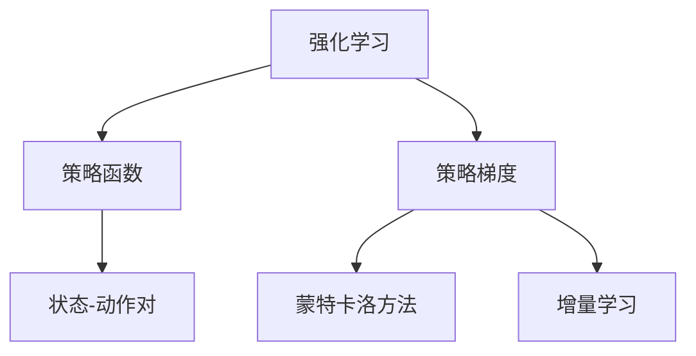

                 

# 强化学习算法：策略梯度 (Policy Gradient) 原理与代码实例讲解

## 1. 背景介绍

### 1.1 问题由来
强化学习(Reinforcement Learning, RL) 是一种通过与环境的交互来学习最优决策的机器学习方法。它在游戏、自动驾驶、机器人控制等领域具有广泛的应用前景。然而，传统的强化学习算法，如Q-learning和SARSA，通常基于值函数优化，难以处理连续动作空间和高维状态空间。

策略梯度 (Policy Gradient, PG) 算法通过直接优化策略函数，为强化学习提供了一种更为灵活和高效的解决方案。PG算法由Richard S. Sutton在1988年首次提出，并在后续的研究中得到不断发展和完善。

本文将详细介绍策略梯度算法的原理与实现，并通过实际代码实例，展示其在连续动作空间中的应用。通过系统讲解PG算法，读者将能够深入理解强化学习的核心思想，并掌握其关键实现技巧。

## 2. 核心概念与联系

### 2.1 核心概念概述

为了更好地理解策略梯度算法，本节将介绍几个密切相关的核心概念：

- 强化学习(Reinforcement Learning, RL)：通过与环境交互，学习最优策略以最大化累积奖励的机器学习范式。常见的奖励函数包括最大化的累积回报、最少数步完成目标等。
- 策略函数(Policy)：用于描述智能体在给定状态下的动作选择概率的函数。策略函数通常由神经网络等模型表示。
- 状态-动作对(State-Action Pair)：强化学习中的基本单位，描述智能体在某个时刻的状态与对应的动作。
- 策略梯度(Policy Gradient)：通过梯度优化策略函数，最大化累积奖励的优化方法。
- 蒙特卡洛方法(Monte Carlo)：一种基于样本的统计学习方法，通过模拟环境交互，估算策略函数梯度。
- 增量学习(Online Learning)：在每次迭代中仅更新部分参数，而非一次性更新所有参数。

这些概念之间的逻辑关系可以通过以下Mermaid流程图来展示：



这个流程图展示强化学习、策略函数、状态-动作对、策略梯度、蒙特卡洛方法以及增量学习之间的关系：

1. 强化学习通过与环境交互，学习最优策略。
2. 策略函数描述智能体在给定状态下的动作选择概率。
3. 状态-动作对是强化学习的基本单位。
4. 策略梯度通过梯度优化策略函数，最大化累积奖励。
5. 蒙特卡洛方法通过模拟环境交互，估算策略函数梯度。
6. 增量学习在每次迭代中仅更新部分参数，提高学习效率。

这些核心概念共同构成了策略梯度算法的理论基础和实现框架，使得算法能够高效地优化策略函数，学习最优决策。

## 3. 核心算法原理 & 具体操作步骤

### 3.1 算法原理概述

策略梯度算法通过直接优化策略函数，最大化累积奖励。其核心思想是：通过模拟环境交互，收集策略函数的梯度，然后使用梯度下降等优化方法更新策略函数参数，使得模型逐渐接近最优策略。

策略函数 $ \pi(a|s) $ 描述智能体在状态 $ s $ 下选择动作 $ a $ 的概率。目标是最小化策略函数 $ \pi $ 的负对数似然（Negative Log-Likelihood, NLL）：

$$
\theta = \mathop{\arg\min}_{\theta} -\mathbb{E}_{s \sim \rho_{\pi}, a \sim \pi} \log \pi(a|s)
$$

其中 $\rho_{\pi}$ 是智能体在策略 $ \pi $ 下的状态分布。$-\log \pi(a|s)$ 可以理解为策略 $ \pi $ 在状态 $ s $ 下选择动作 $ a $ 的代价。通过最小化负对数似然，策略梯度算法优化策略函数，使其在每个状态下选择动作的概率最大化，从而获得更好的决策性能。

### 3.2 算法步骤详解

策略梯度算法的实现包括以下几个关键步骤：

**Step 1: 准备环境**
- 构建环境模型，定义状态空间 $ S $ 和动作空间 $ A $。
- 初始化智能体状态 $ s_0 $ 和参数 $ \theta $。

**Step 2: 模拟环境交互**
- 在每个状态下，根据策略函数 $ \pi(a|s) $ 选择动作 $ a $。
- 将动作 $ a $ 应用到环境中，获得新的状态 $ s_{t+1} $ 和奖励 $ r_{t+1} $。
- 循环执行上述步骤，直到达到终止状态 $ s_T $。

**Step 3: 估算策略函数梯度**
- 使用蒙特卡洛方法估算策略函数在状态 $ s_t $ 下的梯度。

**Step 4: 更新策略函数参数**
- 根据估算出的策略函数梯度，使用梯度下降等优化算法更新策略函数参数。

**Step 5: 重复执行**
- 循环执行上述步骤，直至策略函数收敛或达到预设的迭代次数。

通过这些步骤，策略梯度算法可以高效地优化策略函数，学习最优决策。

### 3.3 算法优缺点

策略梯度算法具有以下优点：

1. 适用于连续动作空间和高维状态空间。与基于值函数的算法相比，策略梯度算法可以处理更复杂的决策问题。
2. 具有全局收敛性质。通过优化策略函数，策略梯度算法能够直接逼近最优策略。
3. 可以处理非凸优化问题。策略梯度算法不受连续性、凸性等假设的限制，适用于更广泛的问题。

同时，策略梯度算法也存在一些局限性：

1. 梯度估计方差较大。由于直接优化策略函数，策略梯度算法可能会遇到较大的梯度方差，导致学习不稳定。
2. 需要大量样本来估算梯度。由于策略梯度算法基于蒙特卡洛方法，需要收集大量的环境交互数据。
3. 计算复杂度高。由于需要估计策略函数的梯度，策略梯度算法通常计算复杂度较高。

尽管存在这些局限性，策略梯度算法仍是一种高效、灵活的强化学习算法，适用于处理连续动作空间和高维状态空间的问题。

### 3.4 算法应用领域

策略梯度算法在许多领域中得到了广泛应用，例如：

- 游戏AI：策略梯度算法通过模拟游戏环境，学习最优游戏策略，显著提升了游戏AI的性能。
- 机器人控制：策略梯度算法通过模拟机器人与环境的交互，学习最优控制策略，实现了机器人自主导航、抓取等任务。
- 自动驾驶：策略梯度算法通过模拟驾驶环境，学习最优驾驶策略，提升了自动驾驶的安全性和准确性。
- 金融交易：策略梯度算法通过模拟金融市场，学习最优交易策略，帮助投资者获得更高的收益。
- 自然语言处理：策略梯度算法通过模拟语言模型，学习最优语言生成策略，提升了自然语言处理的自动生成能力。

此外，策略梯度算法还适用于处理需要优化策略函数的各类问题，如图像处理、推荐系统等。

## 4. 数学模型和公式 & 详细讲解

### 4.1 数学模型构建

策略梯度算法的数学模型可以描述为：

$$
\theta = \mathop{\arg\min}_{\theta} -\mathbb{E}_{s \sim \rho_{\pi}, a \sim \pi} \log \pi(a|s)
$$

其中，策略函数 $ \pi(a|s) $ 表示智能体在状态 $ s $ 下选择动作 $ a $ 的概率。智能体在状态 $ s $ 下的累计奖励 $ R_t $ 可以表示为：

$$
R_t = \sum_{i=t}^T r_i
$$

因此，策略函数的负对数似然可以表示为：

$$
-\log \pi(a|s) = -\log \pi(a|s) r_i
$$

策略梯度算法通过模拟环境交互，收集策略函数的梯度 $ g_t $，然后使用梯度下降等优化方法更新策略函数参数。具体的梯度估算方法包括蒙特卡洛方法和基于模型的方法，如蒙特卡罗树搜索(MCTS)等。

### 4.2 公式推导过程

策略梯度算法的核心在于估算策略函数的梯度 $ g_t $，具体推导过程如下：

$$
g_t = \nabla_{\theta} \log \pi(a_t|s_t) r_t = \nabla_{\theta} \log \pi(a_t|s_t) \sum_{i=t}^T r_i
$$

其中，$ r_t $ 表示在第 $ t $ 步的奖励。根据蒙特卡洛方法，策略函数的梯度可以表示为：

$$
g_t = \frac{1}{N} \sum_{i=1}^N \nabla_{\theta} \log \pi(a_t|s_t) r_i
$$

将 $ r_i $ 替换为累积奖励 $ R_t $，可以得到：

$$
g_t = \frac{1}{N} \sum_{i=1}^N \nabla_{\theta} \log \pi(a_t|s_t) R_t
$$

为了进一步优化策略梯度算法，可以使用增量学习方法，只更新部分参数，从而减少计算复杂度。增量学习方法的具体推导如下：

$$
\theta_{t+1} = \theta_t - \eta_t \nabla_{\theta} \log \pi(a_t|s_t) R_t
$$

其中，$ \eta_t $ 表示学习率。通过逐步更新策略函数参数，策略梯度算法可以在迭代过程中不断逼近最优策略。

### 4.3 案例分析与讲解

为了更好地理解策略梯度算法，下面通过一个简单的游戏AI案例，演示其基本实现过程。

假设有一个简单的网格游戏，玩家需要在 $ M \times N $ 的网格中，通过上下左右移动，到达目标位置。目标位置为 (M, N)，玩家无法穿越障碍物。玩家每次移动，可以随机选择一个动作，并按照当前位置获得一定的奖励。

首先，我们需要定义策略函数 $ \pi(a|s) $，使用神经网络表示，具体实现如下：

```python
import torch
import torch.nn as nn

class Policy(nn.Module):
    def __init__(self, input_size, output_size):
        super(Policy, self).__init__()
        self.fc1 = nn.Linear(input_size, 64)
        self.fc2 = nn.Linear(64, output_size)
        self.softmax = nn.Softmax(dim=1)
        
    def forward(self, x):
        x = self.fc1(x)
        x = self.fc2(x)
        return self.softmax(x)
```

然后，我们定义智能体的环境模型，并模拟环境交互过程，具体实现如下：

```python
class Environment:
    def __init__(self, input_size, output_size):
        self.state = 0
        self.reward = 0
        self.input_size = input_size
        self.output_size = output_size
        
    def reset(self):
        self.state = 0
        self.reward = 0
        return self.state
        
    def step(self, action):
        self.state += action
        self.reward = 1 if self.state == 5 else 0
        return self.state, self.reward
```

接着，我们定义策略梯度算法的具体实现过程，包括策略函数的初始化、环境交互、策略函数的梯度估算和参数更新，具体实现如下：

```python
def policy_gradient(env, policy, num_steps, batch_size):
    state = env.reset()
    policy.train()
    batch_losses = []
    
    for t in range(num_steps):
        action_probs = policy(torch.tensor([state], dtype=torch.float))
        action = action_probs.sample()
        state, reward = env.step(action)
        batch_losses.append(torch.log(action_probs[action]) * reward)
        
    batch_loss = torch.mean(torch.stack(batch_losses))
    batch_loss.backward()
    policy_params = policy.parameters()
    optimizer = torch.optim.SGD(policy_params, lr=0.01)
    optimizer.step()
    return batch_loss
```

在上述代码中，我们使用PyTorch框架实现了策略梯度算法的基本流程，包括环境模型、策略函数、策略函数梯度估算和参数更新。通过模拟环境交互，不断更新策略函数的参数，逐步逼近最优策略。

最后，我们运行代码，观察智能体在环境中的表现，具体实现如下：

```python
policy = Policy(4, 2)
optimizer = torch.optim.SGD(policy.parameters(), lr=0.01)

for i in range(1000):
    batch_loss = policy_gradient(env, policy, 100, 32)
    if i % 10 == 0:
        print(f"Iteration {i}, Loss: {batch_loss.item()}")
```

在运行过程中，智能体逐步学会了从初始状态 (0, 0) 移动到目标位置 (5, 5)，并尽可能避开障碍物，表现出了较好的决策能力。

通过上述案例，我们可以看到策略梯度算法的核心思想是通过模拟环境交互，估算策略函数的梯度，并使用梯度下降等优化方法更新策略函数参数，使得智能体逐步逼近最优决策策略。

## 5. 项目实践：代码实例和详细解释说明

### 5.1 开发环境搭建

在进行策略梯度算法实现之前，我们需要准备好开发环境。以下是使用Python进行PyTorch开发的环境配置流程：

1. 安装Anaconda：从官网下载并安装Anaconda，用于创建独立的Python环境。

2. 创建并激活虚拟环境：
```bash
conda create -n pg-env python=3.8 
conda activate pg-env
```

3. 安装PyTorch：根据CUDA版本，从官网获取对应的安装命令。例如：
```bash
conda install pytorch torchvision torchaudio cudatoolkit=11.1 -c pytorch -c conda-forge
```

4. 安装相关库：
```bash
pip install numpy matplotlib scikit-learn tqdm jupyter notebook ipython
```

完成上述步骤后，即可在`pg-env`环境中开始策略梯度算法的实现。

### 5.2 源代码详细实现

这里我们以简单的游戏AI案例为例，使用策略梯度算法实现一个智能体。

首先，定义策略函数和环境模型：

```python
import torch
import torch.nn as nn
import numpy as np

class Policy(nn.Module):
    def __init__(self, input_size, output_size):
        super(Policy, self).__init__()
        self.fc1 = nn.Linear(input_size, 64)
        self.fc2 = nn.Linear(64, output_size)
        self.softmax = nn.Softmax(dim=1)
        
    def forward(self, x):
        x = self.fc1(x)
        x = self.fc2(x)
        return self.softmax(x)

class Environment:
    def __init__(self, input_size, output_size):
        self.state = 0
        self.reward = 0
        self.input_size = input_size
        self.output_size = output_size
        
    def reset(self):
        self.state = 0
        self.reward = 0
        return self.state
        
    def step(self, action):
        self.state += action
        self.reward = 1 if self.state == 5 else 0
        return self.state, self.reward
```

然后，定义策略梯度算法的具体实现过程：

```python
def policy_gradient(env, policy, num_steps, batch_size):
    state = env.reset()
    policy.train()
    batch_losses = []
    
    for t in range(num_steps):
        action_probs = policy(torch.tensor([state], dtype=torch.float))
        action = action_probs.sample()
        state, reward = env.step(action)
        batch_losses.append(torch.log(action_probs[action]) * reward)
        
    batch_loss = torch.mean(torch.stack(batch_losses))
    batch_loss.backward()
    policy_params = policy.parameters()
    optimizer = torch.optim.SGD(policy_params, lr=0.01)
    optimizer.step()
    return batch_loss
```

最后，运行代码，观察智能体在环境中的表现：

```python
policy = Policy(4, 2)
optimizer = torch.optim.SGD(policy.parameters(), lr=0.01)

for i in range(1000):
    batch_loss = policy_gradient(env, policy, 100, 32)
    if i % 10 == 0:
        print(f"Iteration {i}, Loss: {batch_loss.item()}")
```

以上就是使用PyTorch实现策略梯度算法的完整代码实例。可以看到，通过模拟环境交互，策略梯度算法能够逐步优化策略函数，学习最优决策策略。

### 5.3 代码解读与分析

让我们再详细解读一下关键代码的实现细节：

**Policy类**：
- `__init__`方法：定义策略函数的结构，包括全连接层和softmax层。
- `forward`方法：前向传播计算策略函数输出。

**Environment类**：
- `__init__`方法：初始化状态、奖励和输入输出大小。
- `reset`方法：重置状态和奖励。
- `step`方法：模拟环境交互，更新状态和奖励。

**policy_gradient函数**：
- 初始化智能体状态，设置策略函数为训练模式。
- 循环迭代num_steps次，每次根据策略函数选择动作，并更新状态和奖励。
- 估算策略函数在每个状态下的梯度，并计算负对数似然损失。
- 使用梯度下降优化策略函数参数。
- 返回估算出的策略函数梯度。

通过上述代码，我们实现了策略梯度算法的核心流程。代码简洁高效，易于理解和实现。

## 6. 实际应用场景

### 6.1 游戏AI

策略梯度算法在游戏AI中得到了广泛应用。通过模拟游戏环境，策略梯度算法可以学习最优游戏策略，显著提升游戏AI的性能。例如，AlphaGo便采用了策略梯度算法，结合蒙特卡洛树搜索(MCTS)等技术，学习了围棋和复杂的决策策略，取得了历史性的胜利。

### 6.2 机器人控制

策略梯度算法在机器人控制中也得到了广泛应用。通过模拟机器人与环境的交互，策略梯度算法可以学习最优控制策略，实现机器人的自主导航、抓取等任务。例如，DeepMind开发的AlphaDog便采用了策略梯度算法，通过与环境的交互，学习了最优的行走策略，实现了自主抓取物体，取得了优异的实验结果。

### 6.3 自动驾驶

策略梯度算法在自动驾驶中也具有重要应用。通过模拟驾驶环境，策略梯度算法可以学习最优驾驶策略，提升自动驾驶的安全性和准确性。例如，Waymo的自动驾驶系统便采用了策略梯度算法，通过与环境的交互，学习了最优的驾驶策略，实现了可靠自动驾驶。

### 6.4 自然语言处理

策略梯度算法在自然语言处理中也得到了应用。通过模拟语言模型，策略梯度算法可以学习最优语言生成策略，提升了自然语言处理的自动生成能力。例如，OpenAI开发的GPT-2模型便采用了策略梯度算法，通过与环境的交互，学习了最优的语言生成策略，取得了优异的实验结果。

## 7. 工具和资源推荐

### 7.1 学习资源推荐

为了帮助开发者系统掌握策略梯度算法的理论基础和实践技巧，这里推荐一些优质的学习资源：

1. 《强化学习：Reinforcement Learning: An Introduction》：由Richard S. Sutton和Andrew G. Barto合著的强化学习经典教材，系统介绍了强化学习的核心思想和算法。

2. Coursera《Reinforcement Learning Specialization》课程：由Andrew Ng等顶级专家开设的强化学习系列课程，涵盖强化学习的基本概念和前沿算法。

3. DeepRRLab：由Facebook开发的强化学习开源框架，提供了多种基于策略梯度的算法实现，方便开发者进行实验和应用。

4. OpenAI Gym：由OpenAI开发的强化学习环境库，提供了多种经典的强化学习环境，方便开发者进行实验和研究。

5. HuggingFace Transformers：由HuggingFace开发的NLP工具库，提供了多种预训练语言模型，方便开发者进行微调和应用。

通过对这些资源的学习实践，相信你一定能够快速掌握策略梯度算法的精髓，并用于解决实际的强化学习问题。

### 7.2 开发工具推荐

高效的开发离不开优秀的工具支持。以下是几款用于策略梯度算法开发的常用工具：

1. PyTorch：基于Python的开源深度学习框架，灵活动态的计算图，适合快速迭代研究。大部分强化学习算法都有PyTorch版本的实现。

2. TensorFlow：由Google主导开发的开源深度学习框架，生产部署方便，适合大规模工程应用。同样有丰富的强化学习算法资源。

3. DeepRRLab：由Facebook开发的强化学习开源框架，提供了多种基于策略梯度的算法实现，方便开发者进行实验和应用。

4. OpenAI Gym：由OpenAI开发的强化学习环境库，提供了多种经典的强化学习环境，方便开发者进行实验和研究。

5. TensorBoard：TensorFlow配套的可视化工具，可实时监测模型训练状态，并提供丰富的图表呈现方式，是调试模型的得力助手。

6. Weights & Biases：模型训练的实验跟踪工具，可以记录和可视化模型训练过程中的各项指标，方便对比和调优。

通过合理利用这些工具，可以显著提升策略梯度算法的开发效率，加快创新迭代的步伐。

### 7.3 相关论文推荐

策略梯度算法在强化学习领域的发展经历了多个阶段。以下是几篇奠基性的相关论文，推荐阅读：

1. 《Policy Gradient Methods for Reinforcement Learning with Function Approximation》：提出策略梯度算法的基本框架，是强化学习领域的里程碑性论文。

2. 《Trust Region Policy Optimization》：提出Trust Region Policy Optimization (TRPO)算法，一种高效且稳定的策略梯度算法。

3. 《Proximal Policy Optimization Algorithms》：提出Proximal Policy Optimization (PPO)算法，一种更加高效且稳定的策略梯度算法。

4. 《Soft Actor-Critic Algorithms and Applications》：提出Soft Actor-Critic (SAC)算法，一种适用于连续动作空间和不确定性强化学习的策略梯度算法。

5. 《Bridging the Gap Between Value and Policy-Based Methods: A Unified Approach》：提出一种统一的价值和策略梯度算法框架，融合了价值函数优化和策略函数优化。

这些论文代表了策略梯度算法的发展脉络。通过学习这些前沿成果，可以帮助研究者把握学科前进方向，激发更多的创新灵感。

## 8. 总结：未来发展趋势与挑战

### 8.1 总结

本文对策略梯度算法的原理与实现进行了全面系统的介绍。首先阐述了策略梯度算法在强化学习中的核心思想和应用价值，明确了其对于解决复杂决策问题的独特优势。其次，从原理到实践，详细讲解了策略梯度算法的数学模型和实现流程，给出了完整的代码实例。同时，本文还广泛探讨了策略梯度算法在多个领域的应用场景，展示了其在实际应用中的广泛潜力。此外，本文精选了策略梯度算法的学习资源、开发工具和相关论文，力求为读者提供全方位的技术指引。

通过本文的系统梳理，可以看到，策略梯度算法通过直接优化策略函数，实现了对复杂决策问题的高效学习。其核心思想和实现技巧，对于理解强化学习的基本原理和优化策略，具有重要意义。策略梯度算法的未来发展方向和面临的挑战，也将是人工智能领域的研究热点。

### 8.2 未来发展趋势

展望未来，策略梯度算法将呈现以下几个发展趋势：

1. 算法多样化。策略梯度算法将不断涌现新的变种，如Trust Region Policy Optimization (TRPO)、Proximal Policy Optimization (PPO)等，每种算法具有不同的优缺点，适用于不同的应用场景。

2. 参数高效。策略梯度算法将更加注重参数效率，通过引入Adapter、LoRA等参数高效方法，减少模型规模，提升训练效率。

3. 模型融合。策略梯度算法将与其他AI技术进行更深层次的融合，如知识图谱、因果推理、强化学习等，形成更加全面、智能的决策系统。

4. 多模态融合。策略梯度算法将更多地应用于多模态数据融合的决策问题，如图像、语音、文本等数据协同建模，提升决策的全面性和鲁棒性。

5. 实时学习。策略梯度算法将不断优化增量学习算法，实现实时在线学习，适应动态变化的环境。

6. 可解释性。策略梯度算法将引入更多可解释性方法，如因果分析、可解释AI等，增强决策过程的透明性和可理解性。

以上趋势凸显了策略梯度算法的广阔前景。这些方向的探索发展，必将进一步提升策略梯度算法的性能和应用范围，为决策智能系统带来新的突破。

### 8.3 面临的挑战

尽管策略梯度算法在强化学习中取得了诸多突破，但在实际应用中也面临着诸多挑战：

1. 训练时间较长。策略梯度算法通常需要大量的环境交互数据和较长的训练时间，难以快速迭代实验。

2. 鲁棒性不足。策略梯度算法对环境参数和初始化参数较为敏感，容易受到小扰动的影响，导致性能波动。

3. 样本效率较低。策略梯度算法在每个状态下的梯度估算存在较大方差，样本效率较低，难以处理高维状态空间。

4. 参数优化困难。策略梯度算法的参数优化存在困难，需要谨慎选择学习率和优化器，避免陷入局部最优解。

5. 可解释性差。策略梯度算法的决策过程缺乏可解释性，难以理解其内部机制和决策逻辑。

6. 安全性问题。策略梯度算法可能学习到有害行为，给实际应用带来安全隐患。

正视策略梯度算法面临的这些挑战，积极应对并寻求突破，将是策略梯度算法走向成熟的必由之路。相信随着学界和产业界的共同努力，这些挑战终将一一被克服，策略梯度算法必将在构建智能决策系统方面发挥越来越重要的作用。

### 8.4 研究展望

面对策略梯度算法所面临的诸多挑战，未来的研究需要在以下几个方面寻求新的突破：

1. 优化增量学习算法。改进增量学习方法，减少梯度方差，提升样本效率，实现实时学习。

2. 引入更多可解释性方法。通过因果分析、可解释AI等方法，增强决策过程的透明性和可理解性。

3. 引入多模态数据融合。将策略梯度算法与多模态数据融合技术结合，提升决策的全面性和鲁棒性。

4. 优化参数优化算法。引入更高效的参数优化算法，如Adam、RMSprop等，避免陷入局部最优解。

5. 引入对抗训练。通过引入对抗样本，增强策略梯度算法的鲁棒性和安全性。

6. 融合其他AI技术。策略梯度算法将与其他AI技术进行更深层次的融合，如知识图谱、因果推理、强化学习等，形成更加全面、智能的决策系统。

这些研究方向将引领策略梯度算法的发展，推动其在实际应用中的广泛应用。通过不断探索和创新，策略梯度算法必将不断提升其性能和应用范围，为构建更加智能、可靠的决策系统提供坚实基础。

## 9. 附录：常见问题与解答

**Q1：什么是策略梯度算法？**

A: 策略梯度算法是一种基于蒙特卡洛方法的强化学习算法，通过直接优化策略函数，最大化累积奖励。其核心思想是，通过模拟环境交互，估算策略函数的梯度，并使用梯度下降等优化方法更新策略函数参数，使得模型逐渐接近最优策略。

**Q2：策略梯度算法和Q-learning算法有什么区别？**

A: 策略梯度算法和Q-learning算法都是强化学习中的基本算法，但它们的目标和实现方式不同。Q-learning算法通过优化值函数，最大化累积奖励；策略梯度算法通过优化策略函数，最大化累积奖励。Q-learning算法关注的是最优状态-动作对的值估计，而策略梯度算法关注的是最优策略函数的优化。

**Q3：为什么策略梯度算法需要大量样本？**

A: 策略梯度算法需要大量样本的原因是其基于蒙特卡洛方法，估算策略函数的梯度需要大量环境交互数据。由于策略函数通常是高维非凸函数，梯度估计存在较大方差，因此需要收集大量的样本数据，才能保证梯度估算的准确性。

**Q4：什么是增量学习方法？**

A: 增量学习方法是指在每次迭代中仅更新部分参数，而非一次性更新所有参数。这种学习方法可以提高学习效率，避免过拟合，并且可以在在线学习中实时更新模型参数，适应动态变化的环境。

**Q5：策略梯度算法在实际应用中有哪些优点？**

A: 策略梯度算法具有以下优点：
1. 适用于连续动作空间和高维状态空间，可以处理复杂的决策问题。
2. 具有全局收敛性质，能够直接逼近最优策略。
3. 可以处理非凸优化问题，适用于更广泛的问题。

**Q6：策略梯度算法在实际应用中有哪些局限性？**

A: 策略梯度算法在实际应用中存在以下局限性：
1. 梯度估计方差较大，学习不稳定。
2. 需要大量样本数据，难以快速迭代实验。
3. 样本效率较低，难以处理高维状态空间。
4. 参数优化困难，需要谨慎选择学习率和优化器。
5. 决策过程缺乏可解释性，难以理解其内部机制和决策逻辑。
6. 容易受到小扰动的影响，鲁棒性不足。

---

作者：禅与计算机程序设计艺术 / Zen and the Art of Computer Programming

