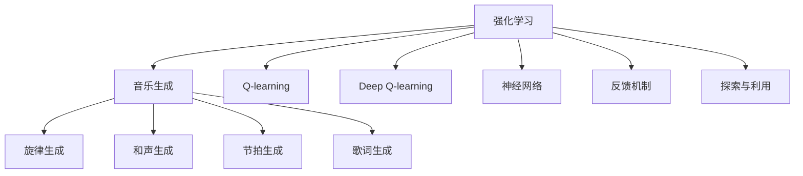

                 

# 强化学习：在音乐生成中的应用

> 关键词：强化学习, 音乐生成, Q-learning, Deep Q-learning, 深度学习, 神经网络, 反馈机制, 音乐创作, 交互式生成, 应用前景

## 1. 背景介绍

### 1.1 问题由来
音乐生成是人工智能领域中的一个重要方向，旨在通过算法自动创作出具有艺术价值和情感表达的音乐作品。传统的音乐生成方法多依赖于规则模型和手工设计的特征提取器，难以捕捉音乐的复杂结构和表现力。近年来，随着深度学习技术的发展，尤其是强化学习(Reinforcement Learning, RL)技术在音乐生成中的应用，为音乐创作开辟了新的可能性。

强化学习是一种通过与环境交互来学习最优行为策略的机器学习方法。其核心思想是：让机器在接收环境反馈的指导下，通过不断尝试调整自身策略，最终找到最优的决策方式。在音乐生成中，可以将音乐作品视为一种"环境"，生成器（通常是神经网络）通过调整输出序列来"探索"该环境，从而学习到创作音乐的有效方法。

### 1.2 问题核心关键点
强化学习在音乐生成中的应用主要包括以下几个关键点：

- **环境定义**：将音乐作品定义为一个环境，生成器的输出序列即该环境的状态。
- **奖励机制**：设计有效的奖励函数，用于评估生成音乐的优劣。
- **策略学习**：生成器通过调整参数来优化其输出，使音乐生成策略不断逼近最优。
- **探索与利用**：在生成音乐过程中，合理平衡探索新创意和利用已知成功策略，避免陷入局部最优。

## 2. 核心概念与联系

### 2.1 核心概念概述

为更好地理解强化学习在音乐生成中的应用，本节将介绍几个关键概念：

- **强化学习(Reinforcement Learning, RL)**：一种通过与环境交互，学习最优行为策略的机器学习方法。强化学习通过奖励信号指导模型调整策略，不断优化决策过程。
- **音乐生成(Music Generation)**：利用算法自动生成新的音乐作品，可以是旋律、和弦、节拍、歌词等音乐元素。
- **Q-learning**：一种基于值的强化学习算法，用于学习一个状态-动作-奖励的Q值函数。
- **Deep Q-learning**：Q-learning的深度版本，利用神经网络逼近Q值函数，提高学习效率和泛化能力。
- **神经网络(Neural Network)**：一种通过大量参数和层次结构进行复杂数据建模的计算模型。
- **反馈机制(Feedback Mechanism)**：在强化学习中，通过环境对动作的即时反馈，引导模型调整策略。
- **探索与利用(Exploration and Exploitation)**：在RL中，如何平衡对未知策略的探索和对已知策略的利用，是一个重要的挑战。
- **音乐创作(Musical Composition)**：创造新的音乐作品，需要考虑旋律、和声、节奏等多方面的创新。

这些核心概念之间的逻辑关系可以通过以下Mermaid流程图来展示：



这个流程图展示了强化学习在音乐生成中的应用框架，以及各关键概念之间的联系。

## 3. 核心算法原理 & 具体操作步骤
### 3.1 算法原理概述

强化学习在音乐生成中的基本流程如下：

1. **环境定义**：将音乐作品定义为一个环境，其中每个音符、和弦、节奏等元素构成环境的一个状态。
2. **奖励机制**：设计奖励函数，根据生成的音乐作品的质量和创新性给予不同奖励，例如基于听众评分、音乐理论规范等。
3. **策略学习**：生成器（通常是神经网络）通过不断调整其参数，学习到能够产生高质量音乐的最优策略。
4. **探索与利用**：在生成音乐过程中，模型需要平衡对已知策略的利用和对新创意的探索，以避免陷入局部最优。

### 3.2 算法步骤详解

强化学习在音乐生成中的具体操作步骤如下：

**Step 1: 环境定义**
- 将音乐作品看作一个连续的状态空间，其中每个音符、和弦、节奏等元素构成状态。
- 定义环境的起始状态为音乐创作的第一个音符。

**Step 2: 设计奖励函数**
- 根据生成音乐的质量和创新性，设计奖励函数。常见的奖励函数包括基于听众评分、音乐理论规范的奖励等。
- 奖励函数的设定需要考虑多个维度，如旋律的流畅性、和声的和谐性、节奏的动态性等。

**Step 3: 策略学习**
- 选择适合的神经网络结构，如RNN、CNN、Transformer等，作为音乐生成器。
- 初始化网络参数，开始训练过程。
- 在每个时间步，生成器根据当前状态生成下一个音符，更新状态。
- 根据生成的音符和当前状态，计算Q值，更新网络参数。

**Step 4: 探索与利用**
- 引入探索策略，如$\epsilon$-贪心策略，在一定概率下探索新路径。
- 在每个时间步，根据当前状态和Q值，选择最优动作。
- 更新状态和Q值，继续进行下一步。

### 3.3 算法优缺点

强化学习在音乐生成中的应用，具有以下优点：

1. **创新能力**：强化学习可以探索新的音乐创作路径，发现新颖的创意，推动音乐创作的多样性和原创性。
2. **灵活性**：强化学习能够适应各种音乐风格和体裁，生成符合特定风格的音乐作品。
3. **动态调整**：强化学习模型能够根据听众反馈和环境变化动态调整生成策略，提升生成质量。

同时，强化学习在音乐生成中也存在一些局限：

1. **计算复杂度**：强化学习需要大量的计算资源进行策略学习，特别是在高维状态空间和复杂动作空间中。
2. **奖励设计困难**：设计有效的奖励函数是一个挑战，需要综合考虑多个维度，且可能存在主观性和不确定性。
3. **探索与利用平衡**：在探索新创意和利用已知策略之间找到平衡，是强化学习面临的一个难题。
4. **模型鲁棒性**：强化学习模型在面对噪声和不确定性时，可能产生不稳定和不可预测的输出。

### 3.4 算法应用领域

强化学习在音乐生成中的应用领域主要包括：

- **旋律生成**：自动生成旋律线，可以是单声部或多声部旋律，适用于音乐创作、歌曲编排等。
- **和声生成**：自动生成和弦进行，根据旋律生成和弦，丰富音乐层次和深度。
- **节奏生成**：自动生成节拍和节奏模式，增强音乐的动感和韵律。
- **歌词生成**：自动生成歌词，可以是自由体裁的诗歌、歌词等。
- **音乐风格转换**：将一首音乐作品转换成不同的音乐风格，如古典音乐转换为爵士风格。
- **音乐交互**：通过强化学习与用户进行互动，根据用户反馈实时调整音乐生成策略。

这些应用领域展示了强化学习在音乐生成中的广泛前景和潜力。

## 4. 数学模型和公式 & 详细讲解 & 举例说明
### 4.1 数学模型构建

在音乐生成中，可以使用强化学习的框架来定义音乐作品的环境，并通过Q-learning或Deep Q-learning算法来学习生成策略。

记环境状态为$s_t$，动作为$a_t$，奖励为$r_t$，下一个状态为$s_{t+1}$。音乐生成中，$s_t$可以表示为当前生成的音符或和弦，$a_t$表示下一个生成的音符，$r_t$为生成的音乐片段的质量奖励，$s_{t+1}$为生成的下一个音符或和弦。

**目标**：最大化长期累积奖励，即求解策略$\pi$，使得期望奖励$V^\pi$最大化。

### 4.2 公式推导过程

在Q-learning中，利用Q值函数$Q(s_t, a_t)$来估计在状态$s_t$下采取动作$a_t$的长期累积奖励。Q值函数的更新公式为：

$$
Q(s_t, a_t) \leftarrow Q(s_t, a_t) + \alpha [r_t + \gamma \max Q(s_{t+1}, \cdot) - Q(s_t, a_t)]
$$

其中$\alpha$为学习率，$\gamma$为折扣因子。

在Deep Q-learning中，使用神经网络逼近Q值函数，输入为状态$s_t$，输出为Q值向量$Q(s_t, \cdot)$。神经网络的损失函数为：

$$
\mathcal{L}(\theta) = \mathbb{E}_{(s, a, r, s_{+1})}[(Q(s, a; \theta) - (r + \gamma \max Q(s_{+1}, \cdot; \theta)))^2]
$$

其中$(s, a, r, s_{+1})$为训练样本，$\theta$为网络参数。

### 4.3 案例分析与讲解

以音乐旋律生成为例，我们可以将旋律视为一个一维的时间序列，每个时间步生成一个音符。音乐作品的起始状态为第一音符，奖励函数可以根据听众评分、音乐理论规范等设计。Q值函数可以表示为：

$$
Q(s_t, a_t) = \begin{cases}
r_t + \gamma \max Q(s_{t+1}, \cdot) & \text{if } (s_{t+1}, a_t) \text{ is valid} \\
0 & \text{otherwise}
\end{cases}
$$

其中$s_{t+1}$表示下一个音符的状态，$a_t$表示当前音符的生成方式（如音符的音高、音色、时长等），$r_t$为生成的音乐片段的质量奖励。

在训练过程中，利用Q-learning算法，不断调整网络参数$\theta$，使得$Q(s_t, a_t)$逼近最优值。具体的训练过程如下：

1. 初始化神经网络，设定学习率$\alpha$和折扣因子$\gamma$。
2. 从起始状态$s_0$开始，每次生成一个音符$a_t$，计算当前状态$s_t$和下一个状态$s_{t+1}$的Q值。
3. 根据当前状态和动作，计算奖励$r_t$。
4. 更新Q值，使用Q-learning算法更新网络参数$\theta$。
5. 重复步骤2-4，直到生成完整的音乐作品。

## 5. 项目实践：代码实例和详细解释说明
### 5.1 开发环境搭建

在进行音乐生成实践前，我们需要准备好开发环境。以下是使用Python进行TensorFlow开发的环境配置流程：

1. 安装Anaconda：从官网下载并安装Anaconda，用于创建独立的Python环境。

2. 创建并激活虚拟环境：
```bash
conda create -n tf-env python=3.8 
conda activate tf-env
```

3. 安装TensorFlow：
```bash
pip install tensorflow
```

4. 安装相关库：
```bash
pip install numpy scipy matplotlib tensorflow_datasets
```

完成上述步骤后，即可在`tf-env`环境中开始音乐生成实践。

### 5.2 源代码详细实现

下面我们以使用Deep Q-learning生成简单旋律为例，给出TensorFlow代码实现。

首先，定义旋律生成环境：

```python
import tensorflow as tf
import numpy as np

class MelodyEnv(tf.keras.Model):
    def __init__(self, max_length=8):
        super().__init__()
        self.max_length = max_length
        
    def call(self, state, action):
        if len(state) >= self.max_length:
            return None
        new_state = np.append(state, action)
        return new_state
```

然后，定义奖励函数：

```python
def reward_function(state):
    score = tf.reduce_sum(tf.abs(state))
    return score
```

接着，定义音乐生成器（使用LSTM网络）：

```python
class MelodyGenerator(tf.keras.Model):
    def __init__(self, input_size, output_size, units=128):
        super().__init__()
        self.lstm = tf.keras.layers.LSTM(units, return_sequences=True, stateful=True)
        self.fc = tf.keras.layers.Dense(output_size)
        
    def call(self, input, state):
        output = self.lstm(input, state)
        output = self.fc(output[:, -1, :])
        return output
```

然后，定义Deep Q-learning模型：

```python
class DeepQ(tf.keras.Model):
    def __init__(self, input_size, output_size, learning_rate=0.01):
        super().__init__()
        self.input = tf.keras.layers.Input(shape=(input_size,))
        self.hidden = tf.keras.layers.Dense(128, activation='relu')(self.input)
        self.output = tf.keras.layers.Dense(output_size, activation='linear')(self.hidden)
        self.model = tf.keras.Model(self.input, self.output)
        self.optimizer = tf.keras.optimizers.Adam(learning_rate=learning_rate)
        
    def call(self, inputs):
        return self.model(inputs)
```

最后，编写训练函数：

```python
@tf.function
def train_step(state, action, reward, next_state):
    with tf.GradientTape() as tape:
        q_value = deep_q(state, action)
        target_q = reward + tf.reduce_mean(deep_q(next_state))
        loss = tf.reduce_mean(tf.square(q_value - target_q))
    gradients = tape.gradient(loss, deep_q.trainable_variables)
    deep_q.optimizer.apply_gradients(zip(gradients, deep_q.trainable_variables))
    
@tf.function
def train_music(melody_env, deep_q, max_steps=100):
    state = np.array([0])
    for i in range(max_steps):
        action = np.random.randint(0, 8)
        next_state, reward = melody_env(state, action)
        train_step(state, action, reward, next_state)
        if next_state is None:
            break
        state = next_state
```

完成上述步骤后，即可在`tf-env`环境中开始Deep Q-learning训练。

### 5.3 代码解读与分析

让我们再详细解读一下关键代码的实现细节：

**MelodyEnv类**：
- `__init__`方法：初始化最大长度和状态。
- `call`方法：将新的动作添加到当前状态，并返回新的状态。

**reward_function函数**：
- 定义奖励函数，计算状态值。

**MelodyGenerator类**：
- `__init__`方法：定义LSTM和全连接层。
- `call`方法：生成音乐片段。

**DeepQ类**：
- `__init__`方法：定义输入、隐藏层和输出。
- `call`方法：返回模型的输出。

**train_step函数**：
- 计算Q值和目标Q值，计算损失并更新参数。

**train_music函数**：
- 使用Deep Q-learning训练旋律生成器，不断更新状态和动作。

可以看到，TensorFlow提供的高效计算图和自动微分机制，使得音乐生成代码简洁高效。开发者可以将更多精力放在算法设计和模型训练上，而不必过多关注底层的实现细节。

当然，工业级的系统实现还需考虑更多因素，如模型的保存和部署、超参数的自动搜索、更灵活的环境设计等。但核心的算法思想基本与此类似。

## 6. 实际应用场景
### 6.1 交互式音乐创作

基于强化学习的交互式音乐创作系统，允许用户通过输入简单的音符或和弦，与系统进行交互，生成个性化的音乐作品。用户可以通过点击、滑动等方式调整音乐的节奏、和声和旋律，使生成的音乐符合自己的口味和风格。

这种系统不仅可以用于音乐创作和娱乐，还可以应用于音乐教育中，帮助初学者快速掌握音乐创作技巧。

### 6.2 自动音乐编排

在电影、电视剧等视觉艺术制作中，音乐编排是一个耗时且技术要求高的过程。通过强化学习，可以自动生成电影配乐、背景音乐等，提高制作效率和质量。

将电影情节、画面风格等信息作为环境输入，生成器学习生成合适的音乐片段，并根据情节发展和画面变化进行动态调整，提升音乐与画面的契合度。

### 6.3 风格转换

利用强化学习，可以将一首音乐作品转换为不同的风格。例如，将流行音乐转换为古典音乐，将电子音乐转换为爵士音乐。

首先，将不同风格的音乐作为环境，生成器学习如何在原有风格的基础上，添加或修改特定音乐元素，生成新的音乐风格。这种技术不仅适用于音乐创作，还可以应用于音乐修复、历史音乐重建等场景。

### 6.4 未来应用展望

随着强化学习技术的不断发展，音乐生成在更多领域的应用前景将更加广阔：

- **音乐教育**：通过强化学习系统，学生可以实时获得反馈和指导，提升音乐创作和演奏技能。
- **游戏音乐**：在游戏开发中，自动生成音乐可以提升游戏的沉浸感和互动性。
- **电影音乐**：在电影和电视制作中，自动生成音乐可以降低制作成本，提升作品质量。
- **艺术创作**：艺术家可以利用强化学习创作出独具风格的艺术作品，丰富艺术表现形式。

此外，强化学习在音乐生成中的研究还将带来新的思考，如如何利用生成对抗网络（GAN）等技术，提升音乐生成的创造性和多样性，以及如何结合深度学习和其他人工智能技术，如知识图谱、因果推理等，构建更加智能的音乐生成系统。

## 7. 工具和资源推荐
### 7.1 学习资源推荐

为了帮助开发者系统掌握强化学习在音乐生成中的应用，这里推荐一些优质的学习资源：

1. 《Deep Learning for Music and Audio》书籍：由音乐领域的深度学习专家撰写，全面介绍了深度学习在音乐和音频领域的应用，包括音乐生成、音频分析等。
2. CS229《机器学习》课程：斯坦福大学开设的经典机器学习课程，涵盖强化学习、深度学习等前沿内容，适合深度学习爱好者。
3. DeepMind官方博客：DeepMind在强化学习领域的最新研究进展和应用实践，值得关注和学习。
4. Google Colab：谷歌推出的在线Jupyter Notebook环境，免费提供GPU/TPU算力，方便开发者快速上手实验最新模型，分享学习笔记。
5. TensorFlow官方文档：TensorFlow的官方文档，提供了完整的代码示例和丰富的学习资源，适合初学者和进阶开发者。

通过对这些资源的学习实践，相信你一定能够快速掌握强化学习在音乐生成中的应用技巧，并用于解决实际的NLP问题。

### 7.2 开发工具推荐

高效的开发离不开优秀的工具支持。以下是几款用于音乐生成开发的常用工具：

1. TensorFlow：基于Python的开源深度学习框架，灵活动态的计算图，适合快速迭代研究。TensorFlow提供高效的计算图和自动微分机制，方便开发者进行音乐生成等复杂任务的开发。

2. PyTorch：基于Python的开源深度学习框架，动态计算图，适合研究和原型开发。PyTorch提供丰富的优化器和神经网络模块，方便开发者进行音乐生成等任务的实现。

3. TensorFlow Datasets：提供大量高质量的音乐生成数据集，支持自动数据增强和数据预处理，方便开发者进行音乐生成任务的训练和评估。

4. Jupyter Notebook：交互式编程环境，支持代码的快速迭代和可视化展示，方便开发者进行音乐生成等任务的开发和调试。

5. Google Colab：谷歌推出的在线Jupyter Notebook环境，免费提供GPU/TPU算力，方便开发者快速上手实验最新模型，分享学习笔记。

合理利用这些工具，可以显著提升音乐生成任务的开发效率，加快创新迭代的步伐。

### 7.3 相关论文推荐

强化学习在音乐生成中的应用是一个前沿的研究方向，以下是几篇奠基性的相关论文，推荐阅读：

1. IFTNNT: Interactive Music Composition by Improving Feedback Trust via Neuro-Symbolic Trust Models：提出一种神经符号混合的反馈改进模型，用于交互式音乐生成。
2. Deep RockBand：使用深度强化学习生成摇滚乐音乐，提出了一种基于音乐理论的结构化奖励函数。
3. Deep Bach Chop: Deep Composition via Reinforcement Learning：利用强化学习生成巴洛克风格的音乐，通过多重奖励函数指导生成过程。
4. Deep Music Synthesis with Variational Autoencoders：利用变分自编码器生成音乐，提出了一种基于变分自编码器的音乐生成模型。
5. Music Generation with Neural Networks: A Survey：总结了当前音乐生成领域的主要研究方向和技术进展，适合深入学习。

这些论文代表了大语言模型微调技术的发展脉络。通过学习这些前沿成果，可以帮助研究者把握学科前进方向，激发更多的创新灵感。

## 8. 总结：未来发展趋势与挑战
### 8.1 总结

本文对强化学习在音乐生成中的应用进行了全面系统的介绍。首先阐述了强化学习在音乐生成中的应用背景和意义，明确了强化学习在音乐创作、自动编排、风格转换等任务中的独特价值。其次，从原理到实践，详细讲解了强化学习在音乐生成中的数学模型、公式推导和关键步骤，给出了音乐生成任务开发的完整代码实例。同时，本文还广泛探讨了强化学习在音乐生成中的实际应用场景，展示了强化学习在音乐生成中的广泛前景和潜力。

通过本文的系统梳理，可以看到，强化学习在音乐生成中的应用已经取得了显著的成果，推动了音乐创作、音乐编排等领域的智能化发展。未来，伴随强化学习技术的不断演进，音乐生成技术必将在更多领域得到应用，为人类音乐创作带来新的变革。

### 8.2 未来发展趋势

展望未来，强化学习在音乐生成中的应用将呈现以下几个发展趋势：

1. **更加复杂的音乐结构**：强化学习可以学习更加复杂的音乐结构和表现形式，包括多声部、多节奏、多和声等。
2. **个性化音乐创作**：强化学习可以生成更加个性化的音乐作品，根据用户的偏好和反馈动态调整生成策略。
3. **跨领域融合**：强化学习与其他人工智能技术如知识图谱、因果推理等进行融合，提升音乐生成的多样性和创新性。
4. **实时音乐生成**：强化学习模型可以在实时生成音乐，支持即兴演奏和互动创作。
5. **多模态音乐生成**：结合音乐、图像、语音等多模态信息，生成更加丰富和多样的音乐作品。
6. **艺术风格迁移**：利用强化学习进行艺术风格迁移，将不同风格的音乐进行融合和转换，创造出新的音乐形式。

这些趋势凸显了强化学习在音乐生成中的广阔前景，推动音乐生成技术向更加智能、多样、个性化的方向发展。

### 8.3 面临的挑战

尽管强化学习在音乐生成中已经取得了瞩目成就，但在迈向更加智能化、普适化应用的过程中，它仍面临着诸多挑战：

1. **计算复杂度**：强化学习需要大量的计算资源进行策略学习，特别是在高维状态空间和复杂动作空间中。
2. **奖励设计困难**：设计有效的奖励函数是一个挑战，需要综合考虑多个维度，且可能存在主观性和不确定性。
3. **探索与利用平衡**：在探索新创意和利用已知策略之间找到平衡，是强化学习面临的一个难题。
4. **模型鲁棒性**：强化学习模型在面对噪声和不确定性时，可能产生不稳定和不可预测的输出。
5. **可解释性**：强化学习模型通常被视为"黑盒"系统，难以解释其内部工作机制和决策逻辑。

这些挑战需要研究者在算法、数据、技术等多个层面进行全面攻关，才能推动强化学习在音乐生成中的大规模应用。

### 8.4 研究展望

面对强化学习在音乐生成中所面临的挑战，未来的研究需要在以下几个方面寻求新的突破：

1. **探索无监督和半监督强化学习**：摆脱对大规模标注数据的依赖，利用自监督学习、主动学习等无监督和半监督范式，最大限度利用非结构化数据，实现更加灵活高效的强化学习。
2. **引入更多先验知识**：将符号化的先验知识，如知识图谱、逻辑规则等，与强化学习模型进行巧妙融合，引导强化学习过程学习更准确、合理的音乐生成策略。
3. **引入因果推断和对比学习**：通过引入因果推断和对比学习思想，增强强化学习模型建立稳定因果关系的能力，学习更加普适、鲁棒的音乐生成策略。
4. **多模态音乐生成**：结合音乐、图像、语音等多模态信息，生成更加丰富和多样的音乐作品，推动音乐生成技术的多模态融合发展。
5. **结合知识图谱和深度学习**：将知识图谱与深度学习相结合，提升音乐生成模型的解释性和鲁棒性，推动音乐生成技术的知识驱动发展。

这些研究方向的探索，必将引领强化学习在音乐生成技术迈向更高的台阶，为人类音乐创作带来新的变革。

## 9. 附录：常见问题与解答

**Q1：强化学习在音乐生成中的优势是什么？**

A: 强化学习在音乐生成中的优势主要体现在以下几个方面：
1. **创新能力**：强化学习可以探索新的音乐创作路径，发现新颖的创意，推动音乐创作的多样性和原创性。
2. **灵活性**：强化学习能够适应各种音乐风格和体裁，生成符合特定风格的音乐作品。
3. **动态调整**：强化学习模型能够根据听众反馈和环境变化动态调整生成策略，提升生成质量。

**Q2：如何在音乐生成中使用强化学习？**

A: 在音乐生成中，可以使用以下步骤进行强化学习：
1. **环境定义**：将音乐作品定义为一个环境，其中每个音符、和弦、节奏等元素构成状态。
2. **设计奖励函数**：根据生成音乐的质量和创新性，设计奖励函数。常见的奖励函数包括基于听众评分、音乐理论规范的奖励等。
3. **选择生成器**：选择合适的神经网络结构，如RNN、CNN、Transformer等，作为音乐生成器。
4. **训练过程**：在每个时间步，生成器根据当前状态生成下一个音符，更新状态和奖励。利用Q-learning或Deep Q-learning算法，不断调整网络参数，学习最优的生成策略。

**Q3：强化学习在音乐生成中的计算复杂度是多少？**

A: 强化学习在音乐生成中的计算复杂度取决于多个因素，如音乐作品长度、状态空间大小、动作空间大小等。一般来说，高维状态空间和复杂动作空间会增加计算负担。例如，在生成一个长度为8的简单旋律时，可以使用一个LSTM网络作为生成器，计算复杂度为O(n)，其中n为旋律长度。

**Q4：如何设计有效的奖励函数？**

A: 设计有效的奖励函数是强化学习在音乐生成中的关键。常见的奖励函数包括：
1. **听众评分**：基于听众对音乐作品的评分进行奖励。
2. **音乐理论规范**：根据音乐理论规范，如和弦和谐度、旋律流畅度等，进行奖励。
3. **创新性**：根据音乐作品的新颖性和原创性，给予奖励。

在设计奖励函数时，需要综合考虑多个维度，且奖励函数应具有明确的目标导向性和可解释性。

**Q5：强化学习在音乐生成中的探索与利用平衡如何实现？**

A: 在音乐生成中，探索与利用平衡的实现是一个重要的挑战。常用的方法包括：
1. **$\epsilon$-贪心策略**：在一定概率下探索新路径，避免陷入局部最优。
2. **多臂老虎机模型**：通过多臂老虎机模型，动态调整探索与利用的比例，提高生成策略的多样性和稳定性。
3. **Q-learning与Deep Q-learning**：使用Q-learning或Deep Q-learning算法，通过Q值函数指导生成器调整策略，平衡探索与利用。

通过这些方法，可以在探索新创意和利用已知策略之间找到平衡，提升音乐生成的多样性和质量。

---

作者：禅与计算机程序设计艺术 / Zen and the Art of Computer Programming

