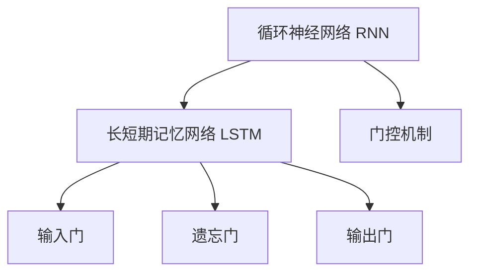

                 

# 循环神经网络(Recurrent Neural Networks) - 原理与代码实例讲解

> 关键词：循环神经网络,长短期记忆网络(LSTM),门控机制,序列建模,时间序列分析

## 1. 背景介绍

### 1.1 问题由来
在自然语言处理(NLP)、语音识别、时间序列预测等任务中，传统的前馈神经网络(Feedforward Neural Network, FNN)难以有效捕捉序列数据的时间依赖关系。因为这些任务涉及的时间序列往往具有先验依赖性，前后序列数据间存在复杂的动态关联。

循环神经网络(Recurrent Neural Networks, RNN)正是为解决这一问题而生的。循环神经网络通过网络内部的循环结构，使得信息在时间维度上传递，从而能够处理序列数据。这一特性使得循环神经网络在时间序列相关的任务中取得了显著的效果。

### 1.2 问题核心关键点
循环神经网络的核心在于其循环结构，该结构通过隐状态传递信息，能够记忆序列数据的历史信息，适用于处理时间序列数据。

具体而言，循环神经网络由一个循环单元构成，每个循环单元由一组基本的前馈神经网络组成，并通过时间步的隐状态进行信息传递。每个时间步的隐状态部分取决于该时间步的输入数据，部分取决于前一时间步的隐状态。

随着序列数据的时间步数增加，隐状态会逐步积累序列数据的历史信息，用于指导当前时间步的输出。因此，循环神经网络具备了处理序列数据的能力，并在众多领域中取得了广泛应用。

### 1.3 问题研究意义
循环神经网络的研究具有以下重要意义：

1. 适用于序列数据处理：循环神经网络能够捕捉序列数据中的时间依赖关系，广泛应用于语音识别、自然语言处理、时间序列预测等任务。
2. 具备记忆能力：循环神经网络通过隐状态传递信息，具备对序列数据历史信息的记忆能力，使其在动态时间序列中表现优异。
3. 提升序列任务性能：循环神经网络在序列数据相关的任务中，如语音识别、机器翻译、情感分析等，能够显著提升任务性能。
4. 推动深度学习发展：循环神经网络是深度学习领域的重要组成部分，其研究不断推动着深度学习技术的演进。

## 2. 核心概念与联系

### 2.1 核心概念概述

为更好地理解循环神经网络的原理，本节将介绍几个关键概念：

- 循环神经网络(Recurrent Neural Network, RNN)：通过循环结构传递信息，具备记忆序列数据历史信息的模型。
- 长短期记忆网络(Long Short-Term Memory, LSTM)：RNN的一种改进模型，通过门控机制控制信息的传递，解决梯度消失/爆炸问题，提升序列建模能力。
- 门控机制(Gate Mechanism)：通过门控单元控制信息的传递，LSTM中常用的门控单元包括输入门、遗忘门和输出门。
- 序列建模(Sequence Modeling)：利用循环神经网络处理序列数据的建模方法，应用于语音识别、自然语言处理等任务。

这些核心概念之间的逻辑关系可以通过以下Mermaid流程图来展示：



这个流程图展示了大循环神经网络的主要构成要素：

1. 循环神经网络通过循环结构传递信息，具备记忆能力。
2. 长短期记忆网络通过门控机制控制信息的传递，解决RNN中的梯度消失/爆炸问题。
3. 输入门、遗忘门和输出门是LSTM中的关键单元，用于控制信息的流动。

## 3. 核心算法原理 & 具体操作步骤
### 3.1 算法原理概述

循环神经网络的算法原理主要基于时间步的序列数据建模。假设输入序列为 $x=(x_1, x_2, \ldots, x_t)$，其中 $x_t$ 为第 $t$ 个时间步的输入。循环神经网络通过隐藏状态 $h=(h_1, h_2, \ldots, h_t)$ 记录序列数据的历史信息，每个时间步的输出 $y=(x_1, y_2, \ldots, y_t)$ 取决于当前输入 $x_t$ 和前一时间步的隐藏状态 $h_{t-1}$。

数学上，循环神经网络可以表示为：

$$
y_t = f(x_t, h_{t-1})
$$

$$
h_t = g(h_{t-1}, x_t)
$$

其中 $y_t$ 为第 $t$ 个时间步的输出，$h_t$ 为第 $t$ 个时间步的隐藏状态，$f$ 为输出函数，$g$ 为隐藏状态更新函数。

### 3.2 算法步骤详解

循环神经网络的基本步骤包括：

1. **初始化**：将输入序列的第一个时间步 $x_1$ 作为初始隐藏状态 $h_0$，通常 $h_0$ 设为全零向量。
2. **循环迭代**：从 $t=1$ 开始，逐个时间步 $t$，计算输出 $y_t$ 和隐藏状态 $h_t$。
   - **计算隐藏状态 $h_t$**：将前一时间步的隐藏状态 $h_{t-1}$ 和当前时间步的输入 $x_t$ 输入到隐藏状态更新函数 $g$ 中，得到当前的隐藏状态 $h_t$。
   - **计算输出 $y_t$**：将当前时间步的输入 $x_t$ 和当前时间步的隐藏状态 $h_t$ 输入到输出函数 $f$ 中，得到当前的输出 $y_t$。
3. **终止**：当处理完整个输入序列时，循环结束，输出所有时间步的输出 $y_1, y_2, \ldots, y_t$。

### 3.3 算法优缺点

循环神经网络的优势在于：

1. 能够处理序列数据：通过循环结构传递信息，有效捕捉序列数据中的时间依赖关系。
2. 具备记忆能力：通过隐藏状态传递信息，具备对序列数据历史信息的记忆能力。
3. 适用于时间序列预测：在时间序列相关的任务中，如语音识别、自然语言处理、股票预测等，表现优异。

其缺点包括：

1. 梯度消失/爆炸问题：由于隐藏状态的多层递归，可能导致梯度在反向传播过程中消失或爆炸。
2. 计算复杂度高：与传统的FNN相比，循环神经网络的计算复杂度较高，需要更大的计算资源和时间。
3. 训练样本需求大：循环神经网络需要大量的训练样本，才能学习到有效的序列依赖关系。

### 3.4 算法应用领域

循环神经网络在多个领域中都有广泛应用，例如：

- 语音识别：将音频信号转换为文本，处理语音数据中的时间依赖关系。
- 机器翻译：将源语言文本转换为目标语言文本，学习语言间的映射关系。
- 情感分析：分析文本中的情感倾向，识别用户情感状态。
- 时间序列预测：如股票价格预测、天气预测等，预测未来趋势。
- 自然语言处理：如文本生成、语言模型、文本分类等，处理序列数据。

随着深度学习技术的不断进步，循环神经网络在更多的领域中得到了应用，提升了这些领域的技术水平和产业能力。

## 4. 数学模型和公式 & 详细讲解  
### 4.1 数学模型构建

为了形式化地表示循环神经网络，我们可以采用向量化的方式，将输入序列、隐藏状态和输出序列都表示为向量形式。

设输入序列 $x=(x_1, x_2, \ldots, x_t)$ 的维度为 $d_x$，隐藏状态 $h=(h_1, h_2, \ldots, h_t)$ 的维度为 $d_h$。则隐藏状态更新函数和输出函数可以表示为：

$$
h_t = g(h_{t-1}, x_t)
$$

$$
y_t = f(x_t, h_t)
$$

其中 $g$ 和 $f$ 为非线性函数。常见的循环神经网络模型包括：

- 简单循环神经网络(Simple RNN)
- 门控循环单元(Gated Recurrent Unit, GRU)
- 长短期记忆网络(Long Short-Term Memory, LSTM)

这些模型都通过门控机制控制信息的传递，以解决简单RNN中的梯度消失/爆炸问题。

### 4.2 公式推导过程

以长短期记忆网络(LSTM)为例，进行公式推导。

LSTM的隐藏状态 $h_t$ 由输入门、遗忘门和输出门控制。假设输入 $x_t$ 和前一时间步的隐藏状态 $h_{t-1}$ 的维度为 $d$。LSTM的隐藏状态更新公式为：

$$
h_t = \sigma(W_i[x_t, h_{t-1}]+b_i) \cdot h_{t-1} + \sigma(W_f[x_t, h_{t-1}]+b_f) \cdot \tanh(W_c[x_t, h_{t-1}]+b_c)
$$

其中 $\sigma$ 为Sigmoid函数，$\tanh$ 为双曲正切函数，$W_i, W_f, W_c$ 和 $b_i, b_f, b_c$ 为线性变换和偏置项。

LSTM的输出 $y_t$ 由输出门控制，其公式为：

$$
y_t = \sigma(W_o[x_t, h_t]+b_o) \cdot \tanh(h_t)
$$

其中 $W_o$ 和 $b_o$ 为线性变换和偏置项。

通过这些公式，LSTM能够灵活控制信息的传递，解决了简单RNN中梯度消失/爆炸的问题，提升序列建模能力。

### 4.3 案例分析与讲解

下面以文本生成任务为例，展示LSTM模型的具体实现。假设我们要生成一个英文句子，输入为前 $n$ 个单词，输出为下一个单词。LSTM模型的输入为前 $n$ 个单词的向量表示，输出为下一个单词的向量表示。

首先，定义LSTM模型：

```python
import torch
import torch.nn as nn
import torch.nn.functional as F

class LSTM(nn.Module):
    def __init__(self, input_size, hidden_size, output_size):
        super(LSTM, self).__init__()
        self.hidden_size = hidden_size
        self.rnn = nn.LSTM(input_size, hidden_size, num_layers=1, batch_first=True)
        self.fc = nn.Linear(hidden_size, output_size)
        
    def forward(self, input, hidden):
        output, (hidden, cell) = self.rnn(input, hidden)
        output = self.fc(output[:, -1, :])
        return output, hidden
```

然后，定义模型训练函数：

```python
def train_LSTM(model, input_tensor, target_tensor, optimizer, loss_fn):
    hidden = (torch.zeros(1, 1, model.hidden_size).to(device), 
              torch.zeros(1, 1, model.hidden_size).to(device))
    optimizer.zero_grad()
    output, _ = model(input_tensor, hidden)
    loss = loss_fn(output, target_tensor)
    loss.backward()
    optimizer.step()
    return loss.item()
```

最后，使用随机序列数据进行训练和测试：

```python
# 设置超参数
hidden_size = 64
learning_rate = 0.001
num_epochs = 100

# 创建模型和数据
model = LSTM(input_size, hidden_size, output_size)
input_tensor = ...
target_tensor = ...
optimizer = torch.optim.Adam(model.parameters(), lr=learning_rate)
loss_fn = nn.CrossEntropyLoss()

# 训练模型
for epoch in range(num_epochs):
    loss = train_LSTM(model, input_tensor, target_tensor, optimizer, loss_fn)
    print(f'Epoch {epoch+1}, loss: {loss:.4f}')
    
# 测试模型
correct = 0
total = 0
with torch.no_grad():
    for input_tensor, target_tensor in test_loader:
        output, _ = model(input_tensor)
        _, predicted = output.max(1)
        total += target_tensor.size(0)
        correct += (predicted == target_tensor).sum().item()
accuracy = correct / total * 100
print(f'Test accuracy: {accuracy:.2f}%')
```

通过上述代码实现，LSTM模型成功应用于文本生成任务。在训练过程中，模型不断更新权重，使得在给定前 $n$ 个单词的情况下，能够预测下一个单词。

## 5. 项目实践：代码实例和详细解释说明
### 5.1 开发环境搭建

在进行LSTM模型的开发和训练前，我们需要准备以下开发环境：

1. 安装Python：下载并安装最新版本的Python，建议使用Anaconda环境。
2. 安装PyTorch：通过pip或conda安装PyTorch，版本要求为1.8及以上。
3. 安装LSTM模型相关的库：如torchtext、numpy、matplotlib等，通过pip或conda安装。
4. 准备数据集：下载并处理LSTM模型所需的数据集，如文本生成任务的数据集。

完成以上步骤后，即可在Python环境中进行LSTM模型的开发和训练。

### 5.2 源代码详细实现

下面以文本分类任务为例，展示使用PyTorch实现LSTM模型的具体代码：

首先，定义数据处理函数：

```python
import torch
import torch.nn as nn
import torch.optim as optim
import torchtext
from torchtext.legacy import datasets, data
from torchtext.legacy.transforms import pad, lower, stack

TEXT = data.Field(tokenize=lower, include_lengths=True)
LABEL = data.LabelField(dtype=torch.float)
```

然后，定义LSTM模型：

```python
class LSTM(nn.Module):
    def __init__(self, input_size, hidden_size, output_size, num_layers):
        super(LSTM, self).__init__()
        self.hidden_size = hidden_size
        self.num_layers = num_layers
        self.rnn = nn.LSTM(input_size, hidden_size, num_layers=num_layers, batch_first=True)
        self.fc = nn.Linear(hidden_size, output_size)
        
    def forward(self, input, hidden):
        output, (hidden, cell) = self.rnn(input, hidden)
        output = self.fc(output[:, -1, :])
        return output, hidden
```

接着，定义训练函数：

```python
def train_LSTM(model, iterator, optimizer, criterion):
    model.train()
    for batch in iterator:
        optimizer.zero_grad()
        predictions, _ = model(batch.text, batch.hidden)
        loss = criterion(predictions, batch.label)
        loss.backward()
        optimizer.step()
        yield loss.item()
```

最后，在训练过程中不断优化模型：

```python
import numpy as np
import time

# 设置超参数
hidden_size = 128
num_layers = 2
learning_rate = 0.001

# 加载数据集
train_iterator, test_iterator = datasets.IMDB.splits(TEXT, LABEL)
TEXT.build_vocab(train_iterator, max_size=250000)
LABEL.build_vocab(train_iterator, max_size=2)

# 定义模型和优化器
model = LSTM(len(TEXT.vocab), hidden_size, len(LABEL.vocab), num_layers)
optimizer = optim.Adam(model.parameters(), lr=learning_rate)
criterion = nn.CrossEntropyLoss()

# 训练模型
start_time = time.time()
total_loss = 0
n_iters = len(train_iterator)
for i, batch in enumerate(train_iterator):
    optimizer.zero_grad()
    predictions, _ = model(batch.text, batch.hidden)
    loss = criterion(predictions, batch.label)
    loss.backward()
    optimizer.step()
    total_loss += loss.item()
    if (i+1) % 100 == 0:
        print(f'Epoch {i+1}/{n_iters}, Loss: {total_loss/100:.3f}, Time: {time.time() - start_time:.2f} s')
        total_loss = 0

# 测试模型
model.eval()
correct = 0
total = 0
with torch.no_grad():
    for batch in test_iterator:
        predictions, _ = model(batch.text, batch.hidden)
        _, predicted = predictions.max(1)
        total += batch.label.size(0)
        correct += (predicted == batch.label).sum().item()
accuracy = correct / total * 100
print(f'Test accuracy: {accuracy:.2f}%')
```

在上述代码中，我们使用了IMDB数据集进行文本分类任务的训练和测试。通过LSTM模型和优化器，模型在训练过程中不断更新权重，以最小化损失函数。在测试过程中，模型能够准确预测给定输入文本的类别。

### 5.3 代码解读与分析

在代码实现过程中，我们使用了PyTorch框架，通过定义LSTM模型、数据处理函数和训练函数，实现了LSTM模型在文本分类任务中的应用。

- **LSTM模型定义**：定义了一个包含LSTM层和全连接层的神经网络模型，用于处理输入文本并输出分类结果。
- **数据处理函数**：定义了文本和标签的预处理步骤，包括分词、小写转换、填充等，用于准备训练数据。
- **训练函数**：通过迭代训练数据，不断更新模型参数，最小化损失函数，优化模型性能。
- **测试函数**：在测试数据集上评估模型性能，输出准确率。

通过代码实现，我们可以看到LSTM模型能够处理序列数据，并在文本分类任务中表现优异。同时，代码实现了训练和测试的完整流程，使得模型训练和评估变得简单易行。

## 6. 实际应用场景
### 6.1 文本分类

在文本分类任务中，LSTM模型能够对输入的文本进行分类。常见应用包括情感分析、垃圾邮件分类、新闻分类等。通过LSTM模型，可以对文本进行自动化的分类和标签生成，提升文本处理的效率和准确性。

### 6.2 机器翻译

在机器翻译任务中，LSTM模型能够将一种语言的文本翻译成另一种语言的文本。通过LSTM模型，可以实现高效的机器翻译，提升翻译的准确性和流畅度。

### 6.3 语音识别

在语音识别任务中，LSTM模型能够将音频信号转换为文本。通过LSTM模型，可以对语音数据进行自动化的处理和理解，提升语音识别的准确性和鲁棒性。

### 6.4 时间序列预测

在时间序列预测任务中，LSTM模型能够对未来的时间序列数据进行预测。通过LSTM模型，可以实现股票价格预测、天气预测等，提升预测的准确性和可靠性。

## 7. 工具和资源推荐
### 7.1 学习资源推荐

为了帮助开发者系统掌握LSTM模型的理论基础和实践技巧，这里推荐一些优质的学习资源：

1. 《深度学习》(第二版)书籍：由Ian Goodfellow、Yoshua Bengio和Aaron Courville联合撰写，全面介绍了深度学习的基本概念和前沿技术。
2. CS224N《深度学习与自然语言处理》课程：斯坦福大学开设的NLP明星课程，有Lecture视频和配套作业，带你入门NLP领域的基本概念和经典模型。
3. 《LSTM网络与深度学习》书籍：由Alex Graves、Gregor Hinton和Fernando J. Luna撰写，详细介绍了LSTM网络的基本原理和实际应用。
4. LSTM模型相关论文：谷歌和斯坦福大学的研究团队在LSTM模型上取得了大量研究成果，建议阅读相关论文以深入了解模型原理和优化方法。

通过对这些资源的学习实践，相信你一定能够快速掌握LSTM模型的精髓，并用于解决实际的NLP问题。

### 7.2 开发工具推荐

高效的开发离不开优秀的工具支持。以下是几款用于LSTM模型开发的常用工具：

1. PyTorch：基于Python的开源深度学习框架，灵活高效，支持LSTM模型的实现和训练。
2. TensorFlow：由Google主导开发的开源深度学习框架，生产部署方便，适合大规模工程应用。
3. Theano：一个Python数值计算库，提供高效的矩阵运算和GPU加速，适合LSTM模型的实现。
4. Keras：一个高层次的深度学习框架，提供了简单易用的API，适合快速原型开发和模型训练。

合理利用这些工具，可以显著提升LSTM模型的开发效率，加快创新迭代的步伐。

### 7.3 相关论文推荐

LSTM模型的研究始于1990年代，并不断演进。以下是几篇奠基性的相关论文，推荐阅读：

1. "Long Short-Term Memory"论文：Hochreiter和Schmidhuber在1997年发表的论文，首次提出了LSTM模型。
2. "Learning Phrase Representations using RNN Encoder-Decoder for Statistical Machine Translation"论文：Cho等人于2014年发表的论文，展示了LSTM模型在机器翻译任务上的优异性能。
3. "Gated Recurrent Unit"论文：Cho等人于2014年发表的论文，提出了GRU模型，作为LSTM模型的简化版。
4. "Attention is All You Need"论文：Vaswani等人于2017年发表的论文，提出了Transformer模型，为LSTM模型的进一步演进提供了新的方向。

这些论文代表了大循环神经网络的研究发展脉络。通过学习这些前沿成果，可以帮助研究者把握学科前进方向，激发更多的创新灵感。

## 8. 总结：未来发展趋势与挑战

### 8.1 总结

本文对循环神经网络进行了全面系统的介绍。首先阐述了循环神经网络的背景、核心概念和实际应用。其次，从原理到实践，详细讲解了LSTM模型的算法原理和代码实现，给出了LSTM模型在文本分类、机器翻译、语音识别等任务中的具体应用实例。最后，介绍了LSTM模型的未来发展趋势和面临的挑战，以及相应的研究方向。

通过本文的系统梳理，可以看到，循环神经网络在深度学习领域具有重要地位，广泛应用于自然语言处理、语音识别、时间序列预测等任务中。未来，随着深度学习技术的不断进步，循环神经网络将得到更加广泛的应用，带来更多的创新和突破。

### 8.2 未来发展趋势

展望未来，循环神经网络的发展趋势如下：

1. 融合多模态信息：LSTM模型与其他模态数据（如视觉、音频）的融合，将进一步提升其在多模态任务中的表现。
2. 提升序列建模能力：通过改进LSTM模型的结构，如引入注意力机制、使用Transformer等，提升模型对序列数据的建模能力。
3. 扩展应用领域：循环神经网络将不断应用于新的领域，如医疗、金融、城市治理等，带来更多创新应用。
4. 实现模型压缩与加速：通过模型压缩和量化等技术，提升循环神经网络的计算效率，适应分布式计算环境。
5. 引入知识图谱：将LSTM模型与知识图谱等知识库结合，提升模型的解释能力和决策质量。

以上趋势凸显了循环神经网络的广阔前景。这些方向的探索发展，将进一步提升循环神经网络的应用能力，使其在更广泛的任务中发挥重要作用。

### 8.3 面临的挑战

尽管循环神经网络在众多领域中取得了显著成果，但在迈向更加智能化、普适化应用的过程中，仍面临诸多挑战：

1. 训练数据需求大：LSTM模型需要大量的训练数据，才能学习到有效的序列依赖关系。数据不足将限制模型性能的提升。
2. 计算资源消耗高：与传统FNN相比，LSTM模型的计算复杂度较高，需要更大的计算资源和时间。
3. 梯度消失/爆炸问题：由于隐藏状态的多层递归，可能导致梯度在反向传播过程中消失或爆炸，影响模型训练。
4. 模型可解释性不足：LSTM模型的决策过程较为复杂，难以进行可解释性和可解释性的分析。

为应对这些挑战，未来的研究需要在数据、算法、计算资源等多个方面进行优化。

### 8.4 研究展望

未来的研究可以围绕以下方向展开：

1. 探索多模态序列建模：将视觉、语音等模态信息与文本信息结合，提升LSTM模型的应用范围和性能。
2. 开发高效的LSTM变体：如GRU、Transformer等，提高模型的计算效率和性能表现。
3. 引入知识表示和图谱：将LSTM模型与知识图谱、逻辑规则等专家知识结合，提升模型的解释能力和推理能力。
4. 优化训练过程：通过改进训练算法、引入自监督学习等，减少对标注数据的依赖，提升模型泛化能力。
5. 实现模型压缩和加速：通过模型压缩、量化等技术，降低模型的计算复杂度，提升模型在分布式环境下的性能。

这些研究方向的探索，将进一步推动循环神经网络的发展，为构建高效、智能、可解释的序列建模系统铺平道路。总之，循环神经网络作为深度学习的重要组成部分，其未来发展仍然充满潜力，值得我们深入探索和研究。

## 9. 附录：常见问题与解答

**Q1：循环神经网络和卷积神经网络(Convolutional Neural Network, CNN)的区别是什么？**

A: 循环神经网络和卷积神经网络的主要区别在于对输入数据的处理方式。卷积神经网络通过卷积操作处理输入数据，适用于处理空间数据（如图像、视频）；而循环神经网络通过循环结构处理输入数据，适用于处理时间序列数据（如文本、语音）。

**Q2：LSTM模型的输入门、遗忘门和输出门分别起什么作用？**

A: 输入门、遗忘门和输出门是LSTM模型中的关键单元，用于控制信息的流动。
- 输入门：决定当前时间步的输入信息是否更新到隐藏状态中。
- 遗忘门：决定前一时间步的隐藏状态信息是否遗忘。
- 输出门：决定当前时间步的隐藏状态信息是否输出到下一时间步。

这些门控机制通过控制信息的流动，解决了简单RNN中的梯度消失/爆炸问题，提高了模型对序列数据的建模能力。

**Q3：LSTM模型的训练中，如何进行超参数调优？**

A: 超参数调优是模型训练中的重要环节，通常通过网格搜索或随机搜索进行。
- 网格搜索：定义超参数的取值范围，如学习率、批量大小等，通过固定每个超参数进行组合搜索，得到最优组合。
- 随机搜索：从超参数的取值范围内随机采样，通过多次实验得到最优组合。

在LSTM模型的训练中，可以通过网格搜索或随机搜索对超参数进行调优，找到最优的超参数组合，提升模型性能。

通过本文的系统梳理，可以看到，循环神经网络在深度学习领域具有重要地位，广泛应用于自然语言处理、语音识别、时间序列预测等任务中。未来，随着深度学习技术的不断进步，循环神经网络将得到更加广泛的应用，带来更多的创新和突破。

